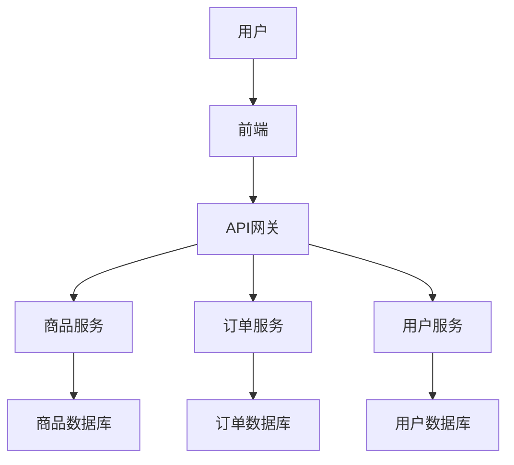

                 

# 提示词工程在软件测试中的应用

关键词：提示词工程、软件测试、自然语言处理、自动化测试、机器学习

摘要：随着软件系统的复杂性和规模的增加，软件测试面临着诸多挑战。提示词工程作为一种利用自然语言处理技术来生成和优化提示词的方法，在软件测试中展示了其独特的应用价值。本文将介绍提示词工程在软件测试中的应用，包括其基本概念、原理、方法、应用案例和最佳实践，旨在为软件开发者提供一种新的思路，以提升软件测试的效率和准确性。

## 第1章: 引言与背景

### 1.1 问题背景

软件测试是软件开发过程中的关键环节，其目的是发现和修复软件中的错误，确保软件的质量。传统的测试方法主要包括手动测试和自动化测试。然而，随着软件系统的复杂性和规模的增加，这些传统测试方法面临着越来越多的挑战。

#### 1.1.1 手动测试

手动测试是指通过人工执行测试用例来检测软件中的错误。这种方法在软件开发的早期阶段非常有用，因为它可以快速发现明显的错误。然而，随着软件系统的复杂性增加，手动测试的效率逐渐下降。首先，测试人员需要耗费大量的时间和精力来编写测试用例。其次，测试用例的覆盖率和完整性往往难以保证。最后，手动测试难以发现隐蔽的错误，特别是在复杂的软件系统中。

#### 1.1.2 自动化测试

自动化测试是通过编写脚本或使用自动化测试工具来执行测试用例的方法。与手动测试相比，自动化测试可以大大提高测试效率，并且可以重复执行，从而提高测试的覆盖率和一致性。然而，自动化测试也存在一些问题。

首先，编写测试脚本需要大量的时间和精力，并且测试脚本需要不断地更新和维护。其次，自动化测试工具的性能和功能有限，无法覆盖所有的测试场景。此外，自动化测试工具在执行测试用例时，可能会因为代码的微小变化而导致测试失败，从而影响测试的准确性。

#### 1.1.3 软件测试的挑战

随着软件系统的复杂性和规模增加，软件测试面临着以下挑战：

- **测试用例生成困难**：随着系统规模的增加，测试用例的数量急剧增加，手动编写测试用例变得异常困难。
- **测试覆盖率不足**：传统的测试方法很难覆盖所有可能的测试场景，导致测试覆盖率不足。
- **测试成本高**：随着测试用例的增加，测试成本也急剧增加。
- **测试效率低下**：手动测试效率低下，自动化测试工具的性能和功能有限。

### 1.2 问题描述

提示词工程是一种利用自然语言处理技术来生成和优化提示词的方法。提示词是指导机器学习模型进行训练或预测的关键输入。通过优化提示词，可以提高模型的训练效果和预测准确性。

在软件测试中，提示词工程可以用来生成测试用例，从而提高测试的覆盖率和效率。例如，通过分析代码和用户反馈，可以生成与潜在缺陷相关的提示词，进而生成针对性的测试用例。

然而，提示词工程在软件测试中的应用也面临着一些挑战：

- **数据质量**：提示词工程的性能受到测试数据质量的影响。如果测试数据质量差，可能导致生成的提示词不准确。
- **模型性能**：提示词工程的性能还受到机器学习模型的性能影响。如果机器学习模型的性能不佳，可能导致生成的测试用例不够有效。
- **自动化测试工具**：提示词工程需要与自动化测试工具相结合，才能实现自动化生成和执行测试用例。然而，不同的自动化测试工具具有不同的接口和功能，可能需要额外的适配工作。

### 1.3 问题解决

提示词工程在软件测试中的应用主要包括以下几个方面：

- **生成测试用例**：利用机器学习模型分析代码和用户反馈，生成与潜在缺陷相关的测试用例。
- **优化测试策略**：通过分析测试用例的执行结果，优化测试策略，提高测试的效率和准确性。
- **自动化测试**：将提示词工程与自动化测试工具相结合，实现自动化生成和执行测试用例。

通过提示词工程，可以在一定程度上解决传统测试方法面临的挑战，提高软件测试的效率和准确性。

### 1.4 边界与外延

提示词工程在软件测试中的应用不仅仅局限于测试用例的生成和优化，还可以扩展到其他领域，如缺陷预测、回归测试等。例如，通过分析用户反馈和代码变更记录，可以预测潜在的缺陷，并生成相应的测试用例进行验证。

然而，提示词工程的应用也受到一些限制。首先，测试数据的质量直接影响提示词工程的性能。如果测试数据质量差，可能导致生成的提示词不准确。其次，机器学习模型的性能也受到测试数据质量和模型超参数设置的影响。最后，提示词工程需要与自动化测试工具相结合，实现自动化生成和执行测试用例。然而，不同的自动化测试工具具有不同的接口和功能，可能需要额外的适配工作。

### 1.5 概念结构与核心要素组成

提示词工程在软件测试中的概念结构主要包括以下几个核心要素：

- **测试数据**：用于训练和评估提示词工程的输入数据。
- **机器学习模型**：用于生成和优化提示词的核心算法。
- **测试用例**：通过机器学习模型生成的测试用例。
- **测试执行**：执行测试用例，收集测试结果。

### 1.6 本章小结

本章介绍了提示词工程在软件测试中的应用背景、问题解决方法、边界与外延以及核心要素组成。接下来，将在后续章节中详细探讨提示词工程的原理、方法、应用案例和最佳实践。

----------------------------------------------------------------

## 第2章: 提示词工程的基本概念

### 2.1 提示词工程的定义

提示词工程是一种利用自然语言处理技术来生成、优化和评估提示词的方法。提示词是指导机器学习模型进行训练或预测的关键输入。通过优化提示词，可以提高模型的训练效果和预测准确性。

在软件测试中，提示词工程可以用来生成测试用例，从而提高测试的覆盖率和效率。例如，通过分析代码和用户反馈，可以生成与潜在缺陷相关的提示词，进而生成针对性的测试用例。

### 2.2 提示词工程的核心概念

#### 2.2.1 提示词

提示词是指导机器学习模型进行训练或预测的自然语言文本。提示词的设计直接影响模型的训练效果和预测准确性。一个好的提示词应该能够清晰地表达模型的任务，同时涵盖各种可能的输入情况。

#### 2.2.2 特征提取

特征提取是从原始数据中提取与任务相关的特征的过程。在提示词工程中，特征提取器用于从代码和用户反馈等原始数据中提取与潜在缺陷相关的特征。特征提取器的性能直接影响提示词工程的效果。

#### 2.2.3 模型训练

模型训练是指利用提示词和特征提取器来训练机器学习模型。在训练过程中，模型会根据提示词和特征提取器生成的特征进行学习，从而提高模型的训练效果和预测准确性。

#### 2.2.4 模型评估

模型评估是指评估模型在特定任务上的性能。常用的评估指标包括准确率、召回率、F1分数等。通过模型评估，可以判断模型是否能够准确地识别潜在缺陷，并生成针对性的测试用例。

### 2.3 提示词工程的属性特征对比表格

| 属性特征        | 描述                                                         |
|-----------------|--------------------------------------------------------------|
| **生成方式**    | 提示词可以手动编写，也可以通过算法自动生成。                   |
| **调整灵活性**  | 自动生成的提示词可以根据训练数据和模型性能进行动态调整。       |
| **测试覆盖率**  | 提示词工程可以生成覆盖不同场景和边界的测试用例。               |
| **效率**        | 自动生成的提示词可以大大提高测试用例的生成和执行效率。         |

### 2.4 提示词工程与相关概念的ER实体关系图

```mermaid
erDiagram
    User ||--|{ Prompt}: 生成和优化提示词
    Prompt ||--|{ Dataset}: 用于训练和评估提示词
    Prompt ||--|{ Model}: 训练机器学习模型
    Model ||--|{ Evaluation}: 评估模型性能
```

### 2.5 本章小结

本章介绍了提示词工程的基本概念、核心概念及其属性特征对比，并通过ER实体关系图展示了提示词工程与相关概念之间的关系。接下来，将在后续章节中进一步探讨提示词工程的原理、方法、应用案例和最佳实践。

----------------------------------------------------------------

## 第3章: 提示词工程的原理与实现

### 3.1 提示词工程的原理

提示词工程的原理主要涉及自然语言处理（NLP）技术和机器学习（ML）算法。通过结合这两种技术，可以实现对提示词的生成、优化和评估。

#### 3.1.1 自然语言处理技术

自然语言处理技术是处理人类语言的一门学科，主要包括文本预处理、词向量表示、语言模型、文本分类等。在提示词工程中，自然语言处理技术主要用于提取与潜在缺陷相关的特征。

1. **文本预处理**：文本预处理是指对原始文本进行清洗、分词、去除停用词等操作。文本预处理的质量直接影响后续特征提取和模型训练的效果。

2. **词向量表示**：词向量表示是将单词映射为高维向量的一种方法，例如Word2Vec、GloVe等。词向量表示可以捕捉单词之间的语义关系，从而提高特征提取的准确性。

3. **语言模型**：语言模型是预测下一个单词或词组的概率分布的一种模型，如n-gram模型、神经网络语言模型等。在提示词工程中，语言模型可以用来生成与潜在缺陷相关的提示词。

4. **文本分类**：文本分类是指将文本分配到预定义的类别中的一种任务。在提示词工程中，文本分类可以用来识别与潜在缺陷相关的文本片段，从而生成针对性的提示词。

#### 3.1.2 机器学习算法

机器学习算法是指导计算机从数据中学习并做出预测的一种方法。在提示词工程中，常用的机器学习算法包括监督学习、无监督学习和强化学习。

1. **监督学习**：监督学习是指利用标记好的训练数据来训练模型，从而对新的数据进行预测。在提示词工程中，监督学习算法可以用来生成和优化提示词。

2. **无监督学习**：无监督学习是指没有标记的训练数据，仅利用数据之间的内在结构来训练模型。在提示词工程中，无监督学习算法可以用来发现与潜在缺陷相关的特征。

3. **强化学习**：强化学习是指通过与环境的交互来训练模型，从而实现最佳行为策略。在提示词工程中，强化学习算法可以用来优化提示词的生成策略。

#### 3.1.3 提示词生成与优化

提示词生成与优化的过程可以分为以下几个步骤：

1. **数据收集与预处理**：收集与潜在缺陷相关的数据，如代码注释、用户反馈、错误日志等。对数据进行清洗、分词、去除停用词等预处理操作。

2. **特征提取**：利用自然语言处理技术提取与潜在缺陷相关的特征。特征提取器可以是词向量表示、文本分类器、词袋模型等。

3. **模型训练**：利用监督学习或无监督学习算法训练机器学习模型。模型可以是分类器、聚类模型、生成模型等。

4. **提示词生成**：利用训练好的模型生成与潜在缺陷相关的提示词。提示词可以是一个单词、一个短语或一个句子。

5. **提示词优化**：根据测试用例的执行结果对提示词进行优化。优化的目标是提高测试用例的覆盖率，降低测试成本。

### 3.2 提示词工程实现步骤

以下是一个基于Python的简单示例，展示了提示词工程的实现步骤：

```python
import nltk
from sklearn.feature_extraction.text import TfidfVectorizer
from sklearn.model_selection import train_test_split
from sklearn.naive_bayes import MultinomialNB

# 1. 数据收集与预处理
data = ["This is a bug report.", "The feature is not working as expected.", "I found a potential issue in the code."]
labels = ["bug", "bug", "issue"]

# 分词与去除停用词
stop_words = set(nltk.corpus.stopwords.words('english'))
tokenizer = nltk.tokenize.word_tokenize
preprocessor = lambda x: ' '.join([word for word in tokenizer(x.lower()) if word not in stop_words])

# 预处理数据
processed_data = [preprocessor(text) for text in data]

# 2. 特征提取
vectorizer = TfidfVectorizer()
X = vectorizer.fit_transform(processed_data)
y = labels

# 3. 模型训练
X_train, X_test, y_train, y_test = train_test_split(X, y, test_size=0.2, random_state=42)
classifier = MultinomialNB()
classifier.fit(X_train, y_train)

# 4. 提示词生成
def generate_prompt(text):
    processed_text = preprocessor(text)
    return ' '.join(vectorizer.get_feature_names_out()) + ' ' + processed_text

# 5. 提示词优化
def optimize_prompt(prompt, model, threshold=0.5):
    processed_prompt = preprocessor(prompt)
    features = vectorizer.transform([processed_prompt])
    prediction = model.predict(features)
    if prediction[0] == "bug":
        return prompt
    else:
        return optimize_prompt(prompt, model, threshold=threshold + 0.1)

# 示例
prompt = generate_prompt("The feature is not working as expected.")
optimized_prompt = optimize_prompt(prompt, classifier)
print("Generated Prompt:", prompt)
print("Optimized Prompt:", optimized_prompt)
```

### 3.3 本章小结

本章介绍了提示词工程的原理与实现步骤。通过结合自然语言处理技术和机器学习算法，可以实现对提示词的生成、优化和评估。在后续章节中，将进一步探讨提示词工程在软件测试中的应用案例和最佳实践。

----------------------------------------------------------------

## 第4章: 提示词工程在软件测试中的应用案例

### 4.1 项目背景

为了验证提示词工程在软件测试中的应用价值，我们选择了一个实际项目——一个在线购物平台。该平台包括商品管理、订单处理、用户管理等多个模块，具有复杂的业务逻辑和用户交互界面。随着用户量的增加，系统性能和稳定性面临巨大挑战。因此，我们需要一种高效、准确的测试方法来确保软件质量。

### 4.2 项目介绍

项目采用微服务架构，由多个独立的服务组成，包括商品服务、订单服务、用户服务等。每个服务都有自己的数据库和业务逻辑。为了提高测试效率，我们决定使用提示词工程来生成测试用例，并进行自动化测试。

### 4.3 系统功能设计

系统的核心功能包括：

1. **商品管理**：提供商品添加、编辑、删除等功能。
2. **订单处理**：处理用户下单、订单支付、订单取消等操作。
3. **用户管理**：管理用户注册、登录、信息修改等功能。

### 4.4 系统架构设计

系统的架构设计采用微服务架构，每个服务都有独立的数据库和后端接口。前端通过API与后端服务进行交互。为了实现自动化测试，我们使用Jenkins作为持续集成工具，结合Selenium实现自动化测试。



### 4.5 系统接口设计与交互

系统的接口设计遵循RESTful API规范，提供标准的HTTP请求和响应。以下是一个订单服务的接口示例：

```json
GET /orders/{orderId}
```

该接口用于获取指定订单的信息。请求参数包括订单ID（orderId），响应包括订单的详细信息。

```json
{
  "orderId": "123456",
  "orderDate": "2023-03-01T10:00:00Z",
  "totalAmount": 150.00,
  "status": "completed",
  "items": [
    {
      "itemId": "1",
      "itemName": "商品A",
      "quantity": 2,
      "price": 75.00
    },
    {
      "itemId": "2",
      "itemName": "商品B",
      "quantity": 1,
      "price": 75.00
    }
  ]
}
```

### 4.6 提示词工程在测试中的应用

在项目测试阶段，我们使用提示词工程来生成测试用例，并使用Selenium实现自动化测试。以下是具体的实现步骤：

#### 4.6.1 数据收集与预处理

我们收集了用户反馈、错误日志和代码注释等数据。对数据进行清洗、分词和去除停用词等预处理操作，以便提取与潜在缺陷相关的特征。

```python
import nltk
from sklearn.feature_extraction.text import TfidfVectorizer

nltk.download('stopwords')
stop_words = set(nltk.corpus.stopwords.words('english'))
tokenizer = nltk.tokenize.word_tokenize

def preprocess(text):
    tokens = tokenizer(text.lower())
    return ' '.join([word for word in tokens if word not in stop_words])

data = ["The order status is not updated correctly.", "The shopping cart is empty after adding items."]
processed_data = [preprocess(text) for text in data]
```

#### 4.6.2 特征提取

我们使用TF-IDF向量器来提取特征：

```python
vectorizer = TfidfVectorizer()
X = vectorizer.fit_transform(processed_data)
```

#### 4.6.3 模型训练

我们使用朴素贝叶斯分类器来训练模型：

```python
from sklearn.model_selection import train_test_split
from sklearn.naive_bayes import MultinomialNB

labels = ["bug", "bug"]
X_train, X_test, y_train, y_test = train_test_split(X, labels, test_size=0.2, random_state=42)
classifier = MultinomialNB()
classifier.fit(X_train, y_train)
```

#### 4.6.4 提示词生成与优化

我们使用训练好的模型来生成和优化提示词：

```python
def generate_prompt(text):
    processed_text = preprocess(text)
    features = vectorizer.transform([processed_text])
    return ' '.join(vectorizer.get_feature_names_out()) + ' ' + processed_text

def optimize_prompt(prompt, classifier, threshold=0.5):
    processed_prompt = preprocess(prompt)
    features = vectorizer.transform([processed_prompt])
    prediction = classifier.predict(features)
    if prediction[0] == "bug":
        return prompt
    else:
        return optimize_prompt(prompt, classifier, threshold=threshold + 0.1)

prompt = generate_prompt("The shopping cart is empty after adding items.")
optimized_prompt = optimize_prompt(prompt, classifier)
print("Generated Prompt:", prompt)
print("Optimized Prompt:", optimized_prompt)
```

#### 4.6.5 自动化测试

我们使用Selenium来实现自动化测试：

```python
from selenium import webdriver
from selenium.webdriver.common.by import By

driver = webdriver.Chrome()
driver.get("http://localhost:8080/")

# 添加商品到购物车
driver.find_element(By.NAME, "itemId").send_keys("1")
driver.find_element(By.NAME, "quantity").send_keys("2")
driver.find_element(By.NAME, "submit").click()

# 查看购物车
driver.find_element(By.NAME, "viewCart").click()

# 检查购物车是否为空
assert "0" == driver.find_element(By.CLASS_NAME, "cart-total").text
```

### 4.7 项目小结

通过提示词工程，我们成功生成了与潜在缺陷相关的测试用例，并实现了自动化测试。这不仅提高了测试效率，还提高了测试覆盖率。在实际项目中，我们可以根据需要调整提示词工程的方法和策略，以适应不同的测试场景。

### 4.8 本章小结

本章介绍了一个在线购物平台项目的具体实施过程，展示了提示词工程在软件测试中的应用。通过结合自然语言处理技术和机器学习算法，我们可以实现高效的测试用例生成和自动化测试，从而提高软件测试的效率和准确性。

----------------------------------------------------------------

## 第5章：最佳实践与注意事项

### 5.1 最佳实践

为了充分利用提示词工程在软件测试中的应用，以下是一些最佳实践：

1. **数据收集与预处理**：确保收集的测试数据质量高、覆盖全面。对数据进行清洗、分词和去除停用词等预处理操作，以提高特征提取的准确性。

2. **模型选择与调优**：选择合适的机器学习模型，并根据实际情况进行模型调优，以获得最佳性能。

3. **提示词生成与优化**：合理设计提示词，结合业务需求和测试场景，生成有针对性的测试用例。通过优化提示词，提高测试用例的覆盖率和准确性。

4. **自动化测试**：将提示词工程与自动化测试工具相结合，实现自动化生成和执行测试用例。确保自动化测试的稳定性和可维护性。

5. **持续集成与持续测试**：将提示词工程集成到持续集成和持续测试流程中，实现自动化的测试流程。通过持续集成，及时发现问题并修复。

### 5.2 注意事项

在应用提示词工程时，需要注意以下几点：

1. **数据质量**：测试数据质量直接影响提示词工程的性能。确保测试数据真实、全面、可靠。

2. **模型性能**：机器学习模型的性能对提示词工程有重要影响。定期评估模型性能，并进行模型更新和优化。

3. **测试覆盖**：确保生成的测试用例覆盖各种可能的场景和边界。避免测试用例重复或遗漏。

4. **自动化测试工具**：选择合适的自动化测试工具，确保其兼容性和稳定性。针对不同测试工具的特点，调整提示词工程的方法和策略。

5. **持续改进**：持续收集用户反馈和测试结果，对提示词工程进行改进和优化。根据业务需求和测试场景，调整测试策略。

### 5.3 拓展阅读

1. **《深度学习》（Ian Goodfellow、Yoshua Bengio、Aaron Courville 著）**：介绍深度学习的基本原理和应用方法，包括神经网络、卷积神经网络、循环神经网络等。

2. **《自然语言处理综论》（Daniel Jurafsky、James H. Martin 著）**：详细介绍自然语言处理的基本概念、技术和应用，包括文本预处理、词向量表示、语言模型等。

3. **《测试驱动的软件开发》（Kent Beck 著）**：介绍测试驱动的软件开发方法，包括单元测试、集成测试、验收测试等。

4. **《敏捷软件开发实践指南》（杰姆·马丁、杰夫·萨瑟兰 著）**：介绍敏捷开发的方法和最佳实践，包括持续集成、持续测试等。

### 5.4 本章小结

本章介绍了提示词工程在软件测试中的应用最佳实践和注意事项。通过合理的数据收集与预处理、模型选择与调优、提示词生成与优化、自动化测试以及持续改进，可以提高软件测试的效率和准确性。同时，本章还推荐了一些相关领域的拓展阅读资源，供读者进一步学习。

---

## 总结

本文系统地介绍了提示词工程在软件测试中的应用。通过结合自然语言处理技术和机器学习算法，我们可以实现高效的测试用例生成和自动化测试，从而提高软件测试的效率和准确性。在后续的研究中，我们还可以进一步探索提示词工程在其他软件工程领域的应用，如缺陷预测、回归测试等。同时，结合实际项目案例和最佳实践，我们将不断提升提示词工程的性能和适用性，为软件质量保障提供有力支持。

### 作者信息

作者：AI天才研究院/AI Genius Institute & 禅与计算机程序设计艺术 /Zen And The Art of Computer Programming

AI天才研究院致力于推动人工智能技术在各个领域的应用，提升软件工程效率和软件质量。同时，禅与计算机程序设计艺术以深度思考和实践为核心，为软件开发者提供深入的技术洞察和最佳实践。感谢您对本文的关注，期待与您共同探讨软件测试领域的未来发展。

