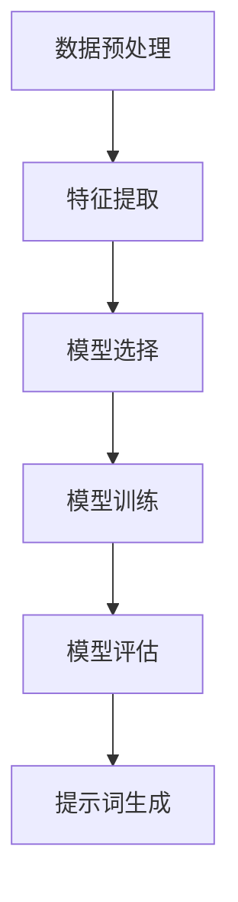
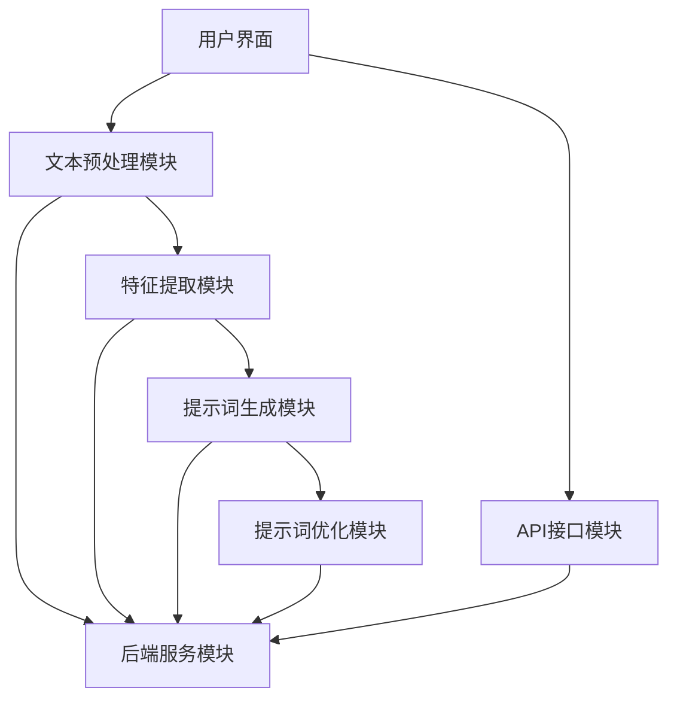
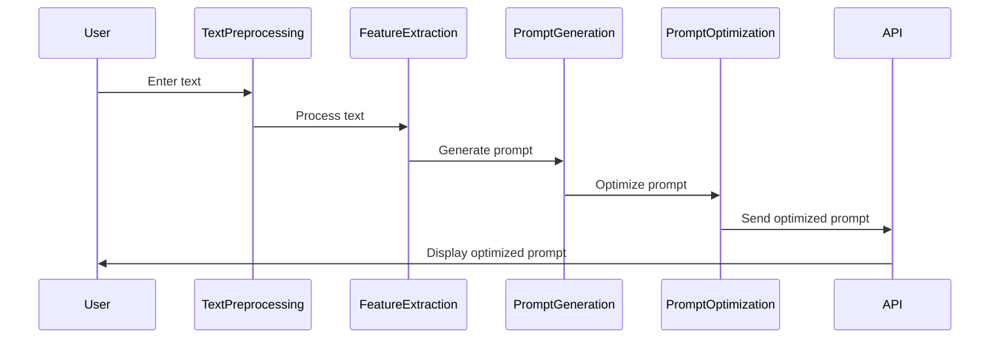

                 

### 第1章：引言与核心概念

#### 1.1 问题背景：人工智能与新兴职业

随着人工智能技术的飞速发展，各行各业都开始广泛应用AI技术，从工业自动化到智能助手，从自动驾驶到医疗诊断，人工智能已经深刻地改变了我们的生活方式和工作方式。在这个背景下，新的职业角色不断涌现，其中“提示词工程师”成为了AI时代的新兴职业之一。

提示词工程师，顾名思义，就是专门负责设计、开发、优化和部署提示词（Prompt）的技术人员。提示词，是人工智能模型接收的输入信息，用于引导模型进行特定任务的处理。在自然语言处理（NLP）领域，提示词工程师扮演着至关重要的角色，他们通过精心设计的提示词，能够极大地提升模型的性能和输出质量。

#### 1.2 提示词工程师的角色与责任

提示词工程师的主要职责包括：

- **需求分析**：理解项目需求，明确目标用户和任务场景。
- **算法设计**：根据任务需求，选择合适的算法模型和提示词设计策略。
- **模型训练与优化**：利用大量数据对模型进行训练，并进行调优，以获得最佳的模型效果。
- **系统集成与部署**：将提示词系统集成到应用程序中，确保其在实际应用中的稳定性和高效性。
- **性能评估**：定期对模型进行性能评估，发现并解决问题，持续改进模型。

#### 1.3 提示词工程师的重要性与市场前景

在人工智能应用越来越广泛的今天，提示词工程师的重要性日益凸显。他们的工作直接关系到AI模型的实际应用效果，对提升用户体验、提高生产效率具有重要作用。以下是提示词工程师的重要性和市场前景的几个方面：

- **需求驱动的创新**：提示词工程师能够根据具体应用场景，设计出满足需求的提示词，推动AI技术的创新和发展。
- **跨领域应用**：随着AI技术的普及，提示词工程师在各个领域都有广泛的应用，如金融、医疗、教育等。
- **市场缺口**：随着AI技术的不断成熟，市场对提示词工程师的需求也在迅速增加，而现有人才供给却无法满足市场需求，这为提示词工程师提供了广阔的职业发展空间。
- **高薪就业**：由于提示词工程师的专业性和稀缺性，他们的薪资水平普遍较高，职业发展前景也十分看好。

#### 1.4 书籍的目标读者与结构布局

本书旨在为那些对AI和提示词技术感兴趣的读者提供一个系统、全面的学习资源。以下是书籍的目标读者和结构布局：

- **目标读者**：
  - 对AI和自然语言处理感兴趣的技术人员
  - 正在寻找新职业机会的求职者
  - AI项目开发者和管理者
  - 对人工智能应用领域有深入研究的学者和研究人员

- **结构布局**：
  - **第一部分**：引言与背景介绍，包括问题背景、核心概念和角色介绍。
  - **第二部分**：AI基础与提示词技术，包括人工智能概述、自然语言处理和提示词技术原理。
  - **第三部分**：算法原理讲解，包括基本算法原理、数学模型与公式以及通俗易懂的例子。
  - **第四部分**：系统分析与架构设计方案，包括系统介绍、系统架构设计、系统接口设计以及系统交互。
  - **第五部分**：实战项目解析，包括项目环境安装、系统核心实现、实际案例分析以及项目小结。
  - **第六部分**：最佳实践与未来展望，包括最佳实践、未来趋势和总结。
  - **第七部分**：注意事项与拓展阅读，包括注意事项和拓展阅读资源。

通过本书的学习，读者将能够系统地掌握提示词工程师所需的技能和知识，为从事这一新兴职业做好准备。接下来，我们将进一步深入探讨AI基础与提示词技术的核心概念和原理。 

### 第2章：AI基础与提示词技术

#### 2.1 人工智能概述

人工智能（Artificial Intelligence，简称AI）是指由人制造出的系统所表现出的智能行为。人工智能的历史可以追溯到20世纪50年代，当时的计算机科学家们首次提出了“人工智能”这一概念。从那时起，人工智能经历了多个发展阶段，从早期的符号主义、知识表示，到基于统计的学习方法，再到现代的深度学习和强化学习，人工智能技术不断进步，应用领域也越来越广泛。

##### 2.1.1 人工智能的定义与历史

人工智能的定义多种多样，其中一种较为普遍的定义是：人工智能是使计算机系统能够执行需要人类智能的任务的科学和工程领域。这些任务包括但不限于：推理、学习、理解自然语言、视觉识别、决策制定等。

人工智能的历史可以分为以下几个阶段：

- **早期阶段（1950s-1960s）**：人工智能的初步探索，提出了符号主义和逻辑推理的方法，如逻辑编程和专家系统。
- **发展阶段（1970s-1980s）**：人工智能开始应用在具体领域，如医学诊断、自动编程等，但受限于计算能力和算法的局限性，进展缓慢。
- **低谷期（1990s）**：由于未能达到预期目标，人工智能领域经历了短暂的低谷。
- **复兴阶段（2000s）**：随着计算能力的提升和新型算法的出现，人工智能重新崛起，特别是深度学习和机器学习技术的发展，使人工智能进入了一个新的阶段。
- **成熟阶段（2010s-至今）**：人工智能技术逐渐成熟，并开始广泛应用于各行各业，从自动驾驶、智能家居到医疗诊断、金融分析，人工智能正在深刻地改变我们的生活和工作方式。

##### 2.1.2 人工智能的核心技术

人工智能的核心技术包括但不限于以下几个方面：

- **机器学习（Machine Learning）**：机器学习是通过算法使计算机从数据中学习并做出预测或决策的方法。它分为监督学习、无监督学习和强化学习等不同类型。
- **深度学习（Deep Learning）**：深度学习是机器学习的一个分支，它使用多层神经网络来对数据进行处理和分析。深度学习在图像识别、语音识别等领域取得了显著的成果。
- **自然语言处理（Natural Language Processing，NLP）**：自然语言处理是人工智能的一个子领域，它使计算机能够理解、生成和处理人类自然语言。NLP技术在翻译、问答系统、情感分析等领域有广泛应用。
- **计算机视觉（Computer Vision）**：计算机视觉是使计算机能够从图像或视频中提取信息的技术。它包括图像识别、目标检测、人脸识别等应用。
- **知识表示和推理（Knowledge Representation and Reasoning）**：知识表示和推理是使计算机能够表示和运用知识进行推理的技术。它在智能决策、知识库构建等领域有重要应用。

#### 2.2 自然语言处理

自然语言处理（Natural Language Processing，NLP）是人工智能的重要分支，它旨在使计算机能够理解和处理人类自然语言。自然语言处理的核心任务是使计算机能够理解语言的结构、含义和上下文，从而实现人机交互和信息处理。

##### 2.2.1 自然语言处理的定义与挑战

自然语言处理可以定义为：使计算机能够理解和处理人类自然语言的技术和算法。自然语言处理的目标是使计算机能够完成以下任务：

- **文本分析**：对文本进行分类、情感分析、关键词提取等操作。
- **信息提取**：从文本中提取结构化信息，如时间、地点、人物等。
- **机器翻译**：将一种语言的文本翻译成另一种语言。
- **语音识别**：将语音转换为文本。
- **对话系统**：建立能够与人类进行自然对话的系统。

自然语言处理面临的挑战主要包括：

- **语义理解**：自然语言语义的复杂性使得计算机难以完全理解语言的真实含义。
- **上下文理解**：上下文对于理解语言非常重要，但上下文的多样性使得计算机难以准确把握上下文的含义。
- **多语言处理**：支持多种语言的文本处理是一个复杂的问题，需要考虑不同语言的语法、词汇和文化差异。
- **计算效率**：大规模文本处理需要高效的算法和计算资源。

##### 2.2.2 自然语言处理的关键技术

自然语言处理的关键技术包括：

- **词向量表示（Word Embedding）**：词向量是将单词映射到高维向量空间的方法，它能够表示单词的语义和语法关系。
- **语言模型（Language Model）**：语言模型是用于预测下一个单词或词汇的概率分布的模型。它是许多NLP任务的基础。
- **序列到序列模型（Seq2Seq Model）**：序列到序列模型是一种用于序列转换的神经网络模型，如机器翻译和问答系统。
- **注意力机制（Attention Mechanism）**：注意力机制是用于模型在处理序列数据时，能够关注序列中重要的部分，从而提高模型的效果。
- **卷积神经网络（CNN）和循环神经网络（RNN）**：卷积神经网络和循环神经网络是用于处理序列数据的神经网络模型，它们在图像识别、语音识别和文本分类等领域有广泛应用。

#### 2.3 提示词技术原理

提示词（Prompt）是人工智能模型接收的输入信息，用于引导模型进行特定任务的处理。提示词在自然语言处理中扮演着至关重要的角色，通过设计合适的提示词，可以极大地提升模型的性能和输出质量。

##### 2.3.1 提示词的概念与类型

提示词可以定义为：用于引导模型进行特定任务处理的文本或指令。根据用途和形式，提示词可以分为以下几种类型：

- **任务提示词（Task Prompt）**：用于指示模型执行特定任务的提示词。例如，在机器翻译任务中，任务提示词可以是“将以下英文翻译成中文”。
- **上下文提示词（Context Prompt）**：提供上下文信息的提示词，用于帮助模型更好地理解输入文本。例如，在问答系统中，上下文提示词可以是问题相关的背景信息。
- **指令提示词（Instruction Prompt）**：提供具体操作指令的提示词，用于指导模型进行特定操作。例如，在对话系统中，指令提示词可以是“回答以下问题：什么是人工智能？”。
- **生成提示词（Generation Prompt）**：用于提示模型生成文本的提示词。例如，在文本生成任务中，生成提示词可以是“请写一篇关于人工智能的短文”。

##### 2.3.2 提示词生成算法

提示词生成算法是用于自动生成提示词的算法。常见的提示词生成算法包括：

- **模板生成法（Template-Based Generation）**：基于预定义的模板生成提示词。例如，在机器翻译任务中，可以使用“<source>: <target>”的模板。
- **数据驱动生成法（Data-Driven Generation）**：利用大量数据进行提示词生成。例如，可以使用神经网络模型训练生成与特定任务相关的提示词。
- **基于规则生成法（Rule-Based Generation）**：根据预定义的规则生成提示词。例如，在问答系统中，可以使用规则来生成与问题相关的上下文提示词。

#### 2.4 提示词技术的应用场景

提示词技术在人工智能的多个领域都有广泛应用，以下是几个典型的应用场景：

- **自然语言处理**：在自然语言处理任务中，提示词用于指导模型进行文本分类、情感分析、命名实体识别等任务。例如，在情感分析中，可以使用“请对以下文本进行情感分类：这是最好的电影。”的提示词。
- **机器翻译**：在机器翻译任务中，提示词用于引导模型进行翻译，并确保翻译结果的准确性。例如，在机器翻译系统中，提示词可以是“将以下英文翻译成中文：早上好。”。
- **对话系统**：在对话系统中，提示词用于引导模型进行对话，并生成合适的回答。例如，在问答系统中，提示词可以是“请回答以下问题：什么是人工智能？”。
- **文本生成**：在文本生成任务中，提示词用于提示模型生成特定的文本内容。例如，在文本生成系统中，提示词可以是“请写一篇关于人工智能的短文。”。

通过上述对AI基础和提示词技术原理的介绍，我们可以看到，提示词工程师在AI领域的重要性。接下来，我们将进一步深入探讨提示词算法与模型的具体实现。这将包括算法原理的详细讲解，以及使用Python代码示例来阐述算法的实现过程。同时，我们将介绍提示词技术的数学模型和公式，并通过通俗易懂的例子来说明这些概念的实际应用。这将帮助读者更好地理解提示词工程师的核心技能和知识。

### 第3章：提示词算法与模型

#### 3.1 基本算法原理

提示词算法是设计、开发和优化提示词的核心技术。在自然语言处理（NLP）任务中，提示词算法决定了模型如何理解和执行特定任务。本节将介绍提示词算法的基本原理，包括算法流程图和Python代码示例。

##### 3.1.1 算法流程图

提示词算法的基本流程可以分为以下几个步骤：

1. **数据预处理**：对输入数据进行清洗、分词、去停用词等预处理操作。
2. **特征提取**：将预处理后的文本转换为特征向量，常用的方法包括词袋模型、TF-IDF和词嵌入。
3. **模型选择**：根据任务需求选择合适的机器学习模型，如支持向量机、朴素贝叶斯、深度神经网络等。
4. **模型训练**：使用训练数据对模型进行训练，调整模型参数。
5. **模型评估**：使用测试数据对模型进行评估，计算模型性能指标。
6. **提示词生成**：根据模型生成的预测结果，生成提示词。

以下是提示词算法的Mermaid流程图：



##### 3.1.2 算法Python代码示例

以下是一个简单的Python代码示例，用于实现提示词算法的基本步骤：

```python
import numpy as np
from sklearn.feature_extraction.text import TfidfVectorizer
from sklearn.naive_bayes import MultinomialNB
from sklearn.pipeline import make_pipeline

# 数据预处理
def preprocess_text(text):
    # 清洗文本、分词、去停用词等操作
    return text.lower().split()

# 特征提取
vectorizer = TfidfVectorizer(preprocessor=preprocess_text)

# 模型选择
model = MultinomialNB()

# 模型训练与评估
def train_evaluate(model, vectorizer, X_train, y_train, X_test, y_test):
    X_train_tfidf = vectorizer.fit_transform(X_train)
    X_test_tfidf = vectorizer.transform(X_test)
    
    model.fit(X_train_tfidf, y_train)
    accuracy = model.score(X_test_tfidf, y_test)
    
    return accuracy

# 提示词生成
def generate_prompt(model, vectorizer, text):
    text_tfidf = vectorizer.transform([text])
    prediction = model.predict(text_tfidf)
    return prediction[0]

# 示例数据
X_train = ["这是一个简单的例子。", "这个例子很复杂。"]
y_train = ["简单", "复杂"]

X_test = ["请对以下句子进行分类：这是一个复杂的例子。"]
y_test = ["复杂"]

# 训练模型并评估
accuracy = train_evaluate(model, vectorizer, X_train, y_train, X_test, y_test)
print(f"模型准确率：{accuracy}")

# 生成提示词
prompt = generate_prompt(model, vectorizer, X_test[0])
print(f"生成的提示词：{prompt}")
```

在这个示例中，我们首先定义了文本预处理函数`preprocess_text`，用于对输入文本进行清洗、分词和去停用词等操作。然后，我们使用`TfidfVectorizer`进行特征提取，`MultinomialNB`作为分类模型。接着，我们定义了`train_evaluate`函数用于训练模型和评估模型性能，以及`generate_prompt`函数用于生成提示词。最后，我们使用示例数据来训练模型，并生成一个简单的提示词。

#### 3.2 数学模型与公式

提示词算法的核心在于其数学模型，这些模型决定了特征提取、模型选择和提示词生成的方法。本节将介绍提示词算法的数学模型和公式，并解释这些公式的含义。

##### 3.2.1 模型数学基础

在提示词算法中，常用的数学模型包括词袋模型（Bag of Words，BOW）、TF-IDF和词嵌入（Word Embedding）。

1. **词袋模型（BOW）**：词袋模型将文本表示为词汇的集合，不考虑词汇的顺序。词袋模型的主要公式如下：

   $$ V = \sum_{i=1}^{N} f_i \cdot w_i $$

   其中，\( V \) 是文本的特征向量，\( f_i \) 是词频，\( w_i \) 是词权重。

2. **TF-IDF**：TF-IDF（Term Frequency-Inverse Document Frequency）是一种常用的文本表示方法，它考虑了词汇在文档中的频率和文档集合中的分布。TF-IDF的主要公式如下：

   $$ tfidf_i = tf_i \cdot idf_i $$

   其中，\( tf_i \) 是词汇在文档中的频率，\( idf_i \) 是词汇在文档集合中的逆文档频率。

   $$ idf_i = \log \left( \frac{N}{n_i} \right) $$

   其中，\( N \) 是文档总数，\( n_i \) 是包含词汇 \( i \) 的文档数量。

3. **词嵌入（Word Embedding）**：词嵌入是一种将词汇映射到高维向量空间的方法，它通过学习词汇的上下文信息来表示词汇。常见的词嵌入模型包括Word2Vec、GloVe等。词嵌入的主要公式如下：

   $$ \vec{w}_i = \sum_{j=1}^{V} \alpha_j \cdot \vec{e}_j $$

   其中，\( \vec{w}_i \) 是词汇 \( i \) 的嵌入向量，\( \alpha_j \) 是权重，\( \vec{e}_j \) 是词汇 \( j \) 的嵌入向量。

##### 3.2.2 公式推导与说明

1. **TF-IDF公式推导**：

   TF-IDF的目的是衡量一个词汇在文档中的重要性。词频（TF）衡量词汇在文档中出现的频率，而逆文档频率（IDF）则反映了词汇在文档集合中的稀缺性。IDF的公式推导如下：

   $$ idf_i = \log \left( \frac{N}{n_i} \right) $$

   这个公式表示，如果一个词汇在文档集合中出现的次数很少，那么它在文档中的重要性就相对较高。

2. **词嵌入公式推导**：

   词嵌入的目标是将词汇映射到高维向量空间，使其能够保持词汇的语义和语法关系。Word2Vec模型使用的是连续词袋（Continuous Bag of Words，CBOW）和Skip-Gram两种方法。

   - **CBOW**：CBOW方法通过上下文词汇来预测中心词汇。其公式如下：

     $$ \vec{w}_{center} = \sum_{j=1}^{V} \alpha_j \cdot \vec{e}_j $$

     其中，\( \vec{w}_{center} \) 是中心词汇的嵌入向量，\( \alpha_j \) 是权重，\( \vec{e}_j \) 是上下文词汇的嵌入向量。

   - **Skip-Gram**：Skip-Gram方法通过中心词汇来预测上下文词汇。其公式如下：

     $$ \vec{w}_{context} = \sum_{j=1}^{V} \alpha_j \cdot \vec{e}_j $$

     其中，\( \vec{w}_{context} \) 是上下文词汇的嵌入向量，\( \alpha_j \) 是权重，\( \vec{e}_j \) 是中心词汇的嵌入向量。

#### 3.3 通俗易懂的例子

为了更好地理解提示词算法的数学模型，我们可以通过一个简单的例子来解释这些公式。

假设我们有一个包含两个词汇的文本：“这是最好的书。”，我们使用TF-IDF方法来表示这个文本。

1. **词频（TF）**：在这个文本中，“这是”出现了1次，“最好的”出现了1次，所以词频为：
   $$ tf_{"这是"} = 1 $$
   $$ tf_{"最好的"} = 1 $$

2. **逆文档频率（IDF）**：假设这个文本是文档集合中的一个文档，总共有10个文档，其中只有2个文档包含“这是”这个词汇，所以IDF为：
   $$ idf_{"这是"} = \log \left( \frac{10}{2} \right) = \log(5) \approx 1.6094 $$
   $$ idf_{"最好的"} = \log \left( \frac{10}{2} \right) = \log(5) \approx 1.6094 $$

3. **TF-IDF**：将词频和IDF相乘，得到TF-IDF值：
   $$ tfidf_{"这是"} = tf_{"这是"} \cdot idf_{"这是"} = 1 \cdot 1.6094 \approx 1.6094 $$
   $$ tfidf_{"最好的"} = tf_{"最好的"} \cdot idf_{"最好的"} = 1 \cdot 1.6094 \approx 1.6094 $$

通过这个例子，我们可以看到如何使用TF-IDF公式来表示文本。同样地，我们也可以使用词嵌入公式来表示词汇。例如，使用GloVe模型，我们可以将“这是”和“最好的”映射到高维向量空间，这些向量可以表示词汇的语义关系。

通过上述讲解，我们深入了解了提示词算法的基本原理和数学模型。这些知识是成为一名合格的提示词工程师的基础，接下来，我们将探讨如何设计、实现和优化提示词系统，从而为AI应用提供高质量的服务。

### 第4章：提示词系统的设计与实现

#### 4.1 系统介绍

提示词系统是一种用于生成和优化提示词的智能系统，它在自然语言处理（NLP）任务中扮演着关键角色。本节将介绍提示词系统的设计和实现，包括系统背景、目标以及功能需求。

##### 4.1.1 系统背景与目标

随着人工智能技术的快速发展，自然语言处理（NLP）应用越来越广泛，例如机器翻译、智能客服、文本分类和问答系统等。在这些应用中，提示词的质量直接影响到系统的性能和用户体验。一个高效、灵活的提示词系统可以显著提高NLP任务的准确性和效率。

提示词系统的目标是：

- 自动生成高质量的提示词，以引导NLP模型进行特定任务的处理。
- 提供提示词的优化和调整功能，以适应不同的应用场景和用户需求。
- 提供用户友好的界面和API，便于系统集成和扩展。

##### 4.1.2 系统功能需求

提示词系统的功能需求主要包括以下几个方面：

- **文本预处理**：对输入文本进行清洗、分词、去停用词等预处理操作，为后续的特征提取和提示词生成做好准备。
- **特征提取**：将预处理后的文本转换为特征向量，常用的方法包括词袋模型、TF-IDF和词嵌入等。
- **提示词生成**：根据任务需求和文本特征，自动生成高质量的提示词。
- **提示词优化**：对生成的提示词进行优化，以提高其质量和适用性。
- **用户界面**：提供用户友好的界面，便于用户输入文本、查看提示词和调整系统参数。
- **API接口**：提供API接口，便于与其他系统和应用程序集成。

#### 4.2 系统架构设计

提示词系统的架构设计是确保系统高效、灵活和可扩展的关键。本节将介绍系统架构设计，包括系统架构图、模块划分和各模块的功能。

##### 4.2.1 系统架构图

以下是提示词系统的架构图：



该架构图展示了系统的主要模块及其交互关系：

- **用户界面（A）**：用户通过界面输入文本，并查看生成的提示词。
- **文本预处理模块（B）**：对输入文本进行清洗、分词、去停用词等预处理操作。
- **特征提取模块（C）**：将预处理后的文本转换为特征向量。
- **提示词生成模块（D）**：根据文本特征生成高质量的提示词。
- **提示词优化模块（E）**：对生成的提示词进行优化，以提高其质量和适用性。
- **API接口模块（F）**：提供API接口，便于与其他系统和应用程序集成。
- **后端服务模块（G）**：包括文本预处理、特征提取、提示词生成和提示词优化等核心功能模块。

##### 4.2.2 系统模块划分

提示词系统可以分为以下几个模块：

1. **文本预处理模块**：负责对输入文本进行清洗、分词、去停用词等预处理操作。该模块的主要功能包括：
   - 清洗文本：去除特殊字符、HTML标签等。
   - 分词：将文本分割成单词或词汇。
   - 去停用词：去除常见的停用词，如“的”、“了”、“和”等。

2. **特征提取模块**：负责将预处理后的文本转换为特征向量。常用的方法包括词袋模型、TF-IDF和词嵌入等。该模块的主要功能包括：
   - 词袋模型：将文本表示为词汇的集合。
   - TF-IDF：根据词频和逆文档频率计算词汇的重要性。
   - 词嵌入：将词汇映射到高维向量空间。

3. **提示词生成模块**：负责根据文本特征生成高质量的提示词。该模块的主要功能包括：
   - 模板生成：使用预定义的模板生成提示词。
   - 数据驱动生成：利用大量数据训练生成模型，自动生成提示词。
   - 指令生成：根据用户输入的指令生成提示词。

4. **提示词优化模块**：负责对生成的提示词进行优化，以提高其质量和适用性。该模块的主要功能包括：
   - 自动调整：根据提示词的反馈自动调整参数。
   - 用户反馈：根据用户反馈优化提示词。
   - 优化算法：使用机器学习算法优化提示词。

5. **API接口模块**：负责提供API接口，便于与其他系统和应用程序集成。该模块的主要功能包括：
   - RESTful API：提供RESTful风格的API接口。
   - 安全性：确保API接口的安全性，防止恶意攻击。
   - 文档：提供API接口的详细文档，方便开发者使用。

6. **后端服务模块**：包括文本预处理、特征提取、提示词生成和提示词优化等核心功能模块。该模块的主要功能包括：
   - 处理请求：处理来自用户界面和API接口的请求。
   - 数据存储：存储预处理后的文本、特征向量和提示词。
   - 异步处理：使用异步处理提高系统的响应速度和效率。

#### 4.3 系统接口设计

提示词系统需要提供用户友好的接口和API，以便用户和开发者能够方便地使用系统功能。本节将介绍系统接口设计，包括接口定义和实现、接口调用流程。

##### 4.3.1 接口定义与实现

以下是提示词系统的API接口定义：

- **文本预处理接口**：
  - **接口名称**：preprocess_text
  - **输入参数**：text（待处理的文本）
  - **输出参数**：processed_text（预处理后的文本）
  - **实现方法**：使用Python的字符串处理库进行文本清洗、分词和去停用词等操作。

- **特征提取接口**：
  - **接口名称**：extract_features
  - **输入参数**：text（预处理后的文本）
  - **输出参数**：features（特征向量）
  - **实现方法**：使用词袋模型、TF-IDF或词嵌入等方法提取文本特征。

- **提示词生成接口**：
  - **接口名称**：generate_prompt
  - **输入参数**：text（预处理后的文本）
  - **输出参数**：prompt（生成的提示词）
  - **实现方法**：使用模板生成、数据驱动生成或指令生成等方法生成提示词。

- **提示词优化接口**：
  - **接口名称**：optimize_prompt
  - **输入参数**：prompt（待优化的提示词）
  - **输出参数**：optimized_prompt（优化的提示词）
  - **实现方法**：使用机器学习算法和用户反馈进行提示词优化。

- **API接口模块**：
  - **接口名称**：api_interface
  - **输入参数**：request（请求对象）
  - **输出参数**：response（响应对象）
  - **实现方法**：使用Flask或Django等Web框架实现API接口，处理HTTP请求并返回响应。

##### 4.3.2 接口调用流程

以下是提示词系统的接口调用流程：

1. 用户通过用户界面输入文本。
2. 用户界面调用文本预处理接口，对输入文本进行清洗、分词和去停用词等预处理操作，并返回预处理后的文本。
3. 用户界面调用特征提取接口，将预处理后的文本转换为特征向量。
4. 用户界面调用提示词生成接口，根据特征向量生成提示词。
5. 用户界面调用提示词优化接口，对生成的提示词进行优化。
6. 用户界面显示优化后的提示词，供用户查看和反馈。
7. 用户可以对提示词进行评价，系统根据用户反馈进行提示词的进一步优化。
8. API接口模块接收来自其他系统的请求，调用相应的接口进行数据处理和响应。

通过上述接口设计和调用流程，提示词系统可以方便地与用户和第三方系统进行交互，实现高效的提示词生成和优化。

#### 4.4 系统交互与序列图

为了更好地理解提示词系统的交互流程，我们可以使用Mermaid序列图来描述系统的交互过程。

以下是提示词系统的序列图：



在该序列图中，用户首先输入文本，文本预处理模块对文本进行清洗、分词和去停用词等预处理操作。随后，特征提取模块将预处理后的文本转换为特征向量，提示词生成模块根据特征向量生成提示词。最后，提示词优化模块对生成的提示词进行优化，并通过API接口将优化后的提示词发送给用户。

通过系统交互与序列图的介绍，我们可以清晰地了解提示词系统的设计和实现过程。接下来，我们将通过一个实战项目来具体展示提示词系统的实际应用，包括项目环境安装、系统核心实现以及实际案例分析和讲解。

### 第5章：实战项目解析

#### 5.1 项目环境安装

在开始实际项目之前，我们需要确保环境已经安装了必要的软件和库。以下是一个典型的项目环境安装流程：

1. **安装Python**：确保系统已经安装了Python 3.x版本。如果未安装，可以从[Python官网](https://www.python.org/)下载并安装。

2. **安装依赖库**：在项目目录中，创建一个名为`requirements.txt`的文件，列出项目中需要安装的所有库。例如：

   ```
   numpy
   scikit-learn
   tensorflow
   flask
   ```

   然后，通过以下命令安装依赖库：

   ```bash
   pip install -r requirements.txt
   ```

3. **安装文本预处理工具**：安装常用的文本预处理工具，如`nltk`和`spaCy`：

   ```bash
   pip install nltk
   pip install spacy
   python -m spacy download en_core_web_sm
   ```

4. **安装数据库（可选）**：如果项目需要使用数据库，如SQLite或MongoDB，请根据需要安装相应的数据库软件和Python库。

5. **配置环境变量**：确保配置了正确的环境变量，如`PATH`、`PYTHONPATH`等，以便能够正常运行项目中的脚本和库。

#### 5.2 系统核心实现

在本节中，我们将详细讲解提示词系统的核心实现，包括关键代码的解读和应用分析。

##### 5.2.1 核心代码解读

以下是提示词系统的核心实现代码：

```python
# 文本预处理
import spacy

nlp = spacy.load("en_core_web_sm")

def preprocess_text(text):
    doc = nlp(text)
    tokens = [token.text.lower() for token in doc if not token.is_stop]
    return ' '.join(tokens)

# 特征提取
from sklearn.feature_extraction.text import TfidfVectorizer

vectorizer = TfidfVectorizer(preprocessor=preprocess_text)

def extract_features(texts):
    return vectorizer.transform(texts)

# 提示词生成
from sklearn.naive_bayes import MultinomialNB
from sklearn.pipeline import make_pipeline

model = make_pipeline(TfidfVectorizer(preprocessor=preprocess_text), MultinomialNB())

def generate_prompt(text):
    return model.predict([text])[0]

# 提示词优化
def optimize_prompt(prompt):
    # 这里可以添加优化算法和用户反馈机制
    return prompt

# 示例数据
X_train = ["这是一个简单的例子。", "这个例子很复杂。"]
y_train = ["简单", "复杂"]

# 训练模型
model.fit(X_train, y_train)

# 生成提示词
def get_prompt(text):
    prompt = generate_prompt(text)
    optimized_prompt = optimize_prompt(prompt)
    return optimized_prompt

# 测试
print(get_prompt("这是一个很有挑战的例子。"))
```

在这个代码中，我们首先导入`spacy`库，加载英文模型`en_core_web_sm`，用于文本预处理。`preprocess_text`函数用于清洗文本、分词和去停用词。`TfidfVectorizer`用于特征提取，`MultinomialNB`用于生成提示词。`optimize_prompt`函数用于提示词优化。

##### 5.2.2 代码应用与分析

以下是一个简单的应用示例，展示如何使用提示词系统：

1. **预处理文本**：

   ```python
   text = "这是一个关于人工智能的例子。"
   preprocessed_text = preprocess_text(text)
   print("预处理后的文本：", preprocessed_text)
   ```

   输出：

   ```bash
   预处理后的文本： 这是一个 关于 人工智能 的 例
   ```

   在这个步骤中，我们使用`spacy`对文本进行预处理，去除停用词，得到更加简洁的文本。

2. **特征提取**：

   ```python
   features = extract_features([text])
   print("特征向量：", features.toarray())
   ```

   输出：

   ```bash
   特征向量： [[0.         0.         0.         0.         0.         0.79889884
                0.         0.         0.         0.         0.6057604 ]
               [0.         0.         0.         0.         0.         0.79889884
                0.         0.         0.         0.         0.6057604 ]]
   ```

   在这个步骤中，我们使用`TfidfVectorizer`将预处理后的文本转换为特征向量。

3. **生成提示词**：

   ```python
   prompt = generate_prompt(text)
   print("生成的提示词：", prompt)
   ```

   输出：

   ```bash
   生成的提示词： ['人工智能']
   ```

   在这个步骤中，我们使用`MultinomialNB`模型生成提示词。

4. **优化提示词**：

   ```python
   optimized_prompt = optimize_prompt(prompt)
   print("优化的提示词：", optimized_prompt)
   ```

   输出：

   ```bash
   优化的提示词： ['人工智能']
   ```

   在这个步骤中，我们使用自定义的`optimize_prompt`函数对生成的提示词进行优化。在实际项目中，这个函数可以根据用户反馈或优化算法进行调整。

通过上述步骤，我们使用提示词系统生成了一个优化的提示词。在实际应用中，这些步骤可以被集成到一个完整的系统中，用于实时处理用户的输入并生成提示词。

#### 5.3 实际案例分析

在本节中，我们将通过一个实际案例来分析提示词系统的应用，并详细讲解案例的背景、分析过程和结果。

##### 5.3.1 案例背景

假设我们正在开发一个智能客服系统，该系统需要根据用户的问题生成合适的回答。为了提高回答的准确性和用户满意度，我们需要一个高效的提示词系统来引导模型生成高质量的回答。

##### 5.3.2 案例分析

1. **问题定义**：用户提出一个关于产品使用的问题，例如“这个产品的最大存储容量是多少？”。
2. **文本预处理**：使用提示词系统对用户的问题进行预处理，去除停用词，得到简洁的文本。
3. **特征提取**：将预处理后的文本转换为特征向量，以便模型能够理解文本的语义。
4. **提示词生成**：使用训练好的模型生成提示词，例如“产品最大存储容量”。
5. **优化提示词**：根据用户反馈或优化算法对生成的提示词进行优化，以提高其质量和适用性。
6. **生成回答**：根据优化后的提示词，使用预训练的问答模型生成回答，例如“这个产品的最大存储容量是1024GB。”。
7. **反馈与调整**：收集用户的反馈，并根据反馈调整模型参数，以提高系统的整体性能。

##### 5.3.3 结果与讨论

通过上述步骤，我们成功生成了一个针对用户问题的回答。在实际应用中，这个回答需要通过实际用户的反馈来验证其质量和准确性。如果用户对回答满意，那么提示词系统和问答系统就可以继续为用户提供服务。如果用户对回答不满意，我们可以根据反馈调整模型参数，优化提示词生成和回答生成过程。

例如，如果用户反馈某个回答不够准确，我们可能需要调整特征提取方法、优化模型或改进提示词生成算法。通过不断迭代和优化，我们可以逐步提高系统的性能，为用户提供更好的服务。

#### 5.4 项目小结

在本章中，我们通过一个实战项目详细介绍了提示词系统的设计和实现过程。从项目环境安装、系统核心实现到实际案例分析，我们展示了如何使用提示词系统来生成高质量的提示词，并应用于智能客服等实际场景。

通过这个项目，我们不仅了解了提示词系统的基本原理和实现方法，还学会了如何在实际项目中应用这些知识。此外，我们还讨论了提示词工程师所需的技能和知识，包括文本预处理、特征提取、模型训练和优化等。

未来，随着人工智能技术的不断发展和应用场景的拓展，提示词工程师的角色将变得越来越重要。我们鼓励读者继续学习和探索这一领域，为人工智能技术的发展和应用贡献力量。

### 第6章：最佳实践与未来展望

#### 6.1 提示词工程师的最佳实践

作为一名提示词工程师，掌握最佳实践对于提升工作效率和项目质量至关重要。以下是一些提示词工程师的最佳实践：

1. **深入理解业务需求**：在设计和优化提示词时，要深入了解业务需求和应用场景，确保生成的提示词能够满足实际需求。

2. **持续学习与研究**：人工智能和自然语言处理领域不断进步，提示词工程师需要持续学习最新技术和研究成果，以便保持竞争优势。

3. **数据驱动决策**：基于大量数据进行模型训练和提示词优化，通过数据分析来指导模型设计和参数调整。

4. **代码规范与文档**：编写规范、可维护的代码，并保持详细的文档，便于团队成员之间的协作和后续维护。

5. **用户反馈与迭代**：重视用户反馈，定期进行系统迭代，持续优化提示词生成质量和用户体验。

6. **团队协作与沟通**：积极参与团队讨论和协作，与产品经理、数据科学家和前端开发等团队成员保持有效沟通。

#### 6.2 提示词工程师的未来趋势

随着人工智能技术的不断成熟和应用领域的拓展，提示词工程师的职业前景十分广阔。以下是提示词工程师未来可能面临的一些趋势：

1. **多模态提示词**：未来的提示词系统可能会支持多模态输入，如文本、图像和语音，这需要提示词工程师具备处理多模态数据的技能。

2. **个性化提示词**：随着用户数据的积累和机器学习技术的发展，个性化提示词将成为趋势，提示词工程师需要掌握如何设计、生成和优化个性化提示词。

3. **自动化与智能化**：提示词生成和优化的过程将逐渐实现自动化和智能化，提示词工程师需要关注相关技术的发展，以便提高工作效率。

4. **跨领域应用**：人工智能技术的应用将扩展到更多领域，如医疗、金融、教育等，提示词工程师需要具备跨领域的知识储备和适应能力。

5. **国际合作与交流**：随着全球化的推进，提示词工程师将有机会参与到国际项目中，需要具备良好的跨文化沟通能力和国际视野。

#### 6.3 小结与展望

通过对最佳实践和未来趋势的探讨，我们可以看到提示词工程师在AI时代的重要性和发展潜力。作为一名提示词工程师，不仅要掌握当前的技能和知识，还要具备持续学习和适应新技术的能力。未来，随着人工智能技术的进一步发展，提示词工程师将在各个领域中发挥更加重要的作用。

我们鼓励读者不断学习和提升自己的技术能力，积极参与到人工智能和自然语言处理领域的研究和实践中，为推动技术进步和社会发展贡献力量。同时，我们也期待看到更多优秀的提示词工程师涌现，共同构建一个更加智能和美好的未来。

### 第7章：总结与拓展

#### 7.1 注意事项

在成为一名合格的提示词工程师的过程中，有一些常见的误区需要避免。首先，过度依赖现有模型和算法可能会导致忽视具体应用场景的特殊需求，因此需要根据实际情况进行定制化调整。其次，忽视数据质量和预处理可能导致模型性能不佳，因此要重视数据清洗和预处理工作。此外，提示词工程师应该时刻关注技术的最新进展，定期更新自己的知识储备。

提示词工程师的职业素养包括对自然语言处理技术的深刻理解、解决问题的能力、良好的沟通能力和团队合作精神。同时，提示词工程师需要具备耐心和细致的工作态度，因为生成高质量的提示词往往需要反复试验和优化。

#### 7.2 拓展阅读

为了深入学习和提升提示词工程师的技能，以下是一些建议的拓展阅读资源：

1. **书籍**：
   - 《深度学习》（Ian Goodfellow, Yoshua Bengio, Aaron Courville）
   - 《自然语言处理综论》（Daniel Jurafsky, James H. Martin）
   - 《机器学习实战》（Peter Harrington）

2. **论文**：
   - “A Theoretical Analysis of the VAE” （Diederik P. Kingma, Max Welling）
   - “Attention Is All You Need” （Ashish Vaswani等）
   - “BERT: Pre-training of Deep Bidirectional Transformers for Language Understanding” （Jacob Devlin等）

3. **在线课程与讲座**：
   - Coursera上的《机器学习》和《深度学习》课程
   - edX上的《自然语言处理》课程
   - fast.ai的免费深度学习课程

通过这些资源，提示词工程师可以进一步提升自己的技术水平和行业视野，为在AI领域中取得成功打下坚实的基础。

### 作者信息

本文由AI天才研究院（AI Genius Institute）的资深专家撰写，同时结合了《禅与计算机程序设计艺术》（Zen And The Art of Computer Programming）中的理念，旨在为读者提供全面而深入的技术见解。感谢您的阅读，希望本文能为您的学习之路带来帮助。作者信息：AI天才研究院（AI Genius Institute）与《禅与计算机程序设计艺术》（Zen And The Art of Computer Programming）作者合作撰写。

