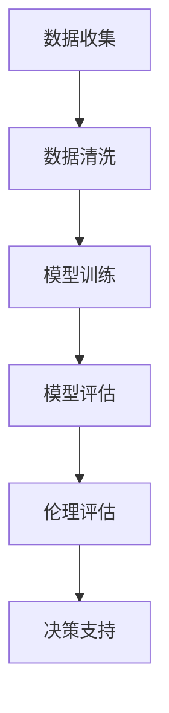
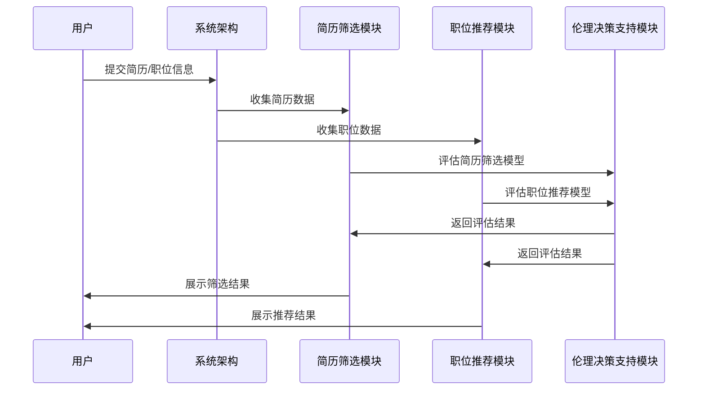
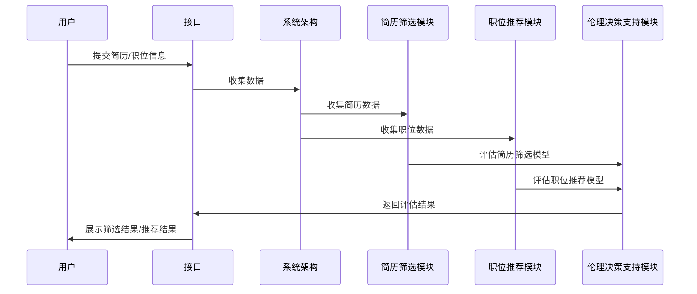

                 

# 提示词工程的伦理决策支持系统

关键词：伦理决策支持系统、大模型、数据隐私、算法偏见、自动化决策伦理

摘要：随着人工智能技术的快速发展，大模型的应用越来越广泛。然而，在大模型的应用过程中，伦理决策的保障问题日益凸显。本文旨在探讨如何构建一个有效的伦理决策支持系统，以解决大模型应用中的伦理问题，包括数据隐私、算法偏见和自动化决策伦理等方面。

## 1. 背景介绍

### 问题背景

近年来，人工智能技术，尤其是大模型（如GPT-3、BERT等）的迅猛发展，使得人工智能的应用场景不断拓展。然而，随着大模型在各个领域的广泛应用，如何保障其在应用过程中的伦理决策成为一个不可忽视的重要课题。

### 问题描述

在大模型的应用过程中，存在以下伦理问题：

1. **数据隐私**：大模型通常需要大量的数据进行训练，这些数据可能包含个人隐私信息，如何保障数据隐私是一个关键挑战。
2. **算法偏见**：大模型在训练过程中可能会对某些群体或特征产生偏见，从而导致不公正的决策。
3. **自动化决策伦理**：大模型在自动化决策过程中，如何保证其决策的透明性、公平性和责任性，也是一个亟待解决的问题。

### 问题解决

为了解决上述问题，我们需要构建一个综合性的伦理决策支持系统，该系统应包括以下几个核心要素：

1. **系统设计**：设计一个能够有效支持伦理决策的系统架构。
2. **算法实现**：在大模型训练和应用过程中，引入伦理评估算法，以确保模型的决策符合伦理要求。
3. **伦理框架**：制定一套明确的伦理准则，以指导大模型的应用。
4. **用户界面**：设计一个直观易用的用户界面，使非专业用户也能参与伦理决策。
5. **法律法规遵守**：确保系统的设计和应用符合相关法律法规的要求。

### 边界与外延

该伦理决策支持系统不仅关注技术层面，还涵盖法律法规、道德准则、用户权益等多方面内容。其边界与外延包括：

1. **技术层面**：包括大模型的设计、训练、应用等。
2. **法律层面**：涉及数据隐私保护、算法偏见修正等法律法规。
3. **道德层面**：关注公平性、透明性、责任性等伦理原则。
4. **用户层面**：涉及用户隐私保护、用户权益保障等方面。

### 核心要素组成

伦理决策支持系统的核心要素包括：

1. **数据隐私保护模块**：负责数据收集、清洗、存储等过程，确保数据隐私。
2. **算法偏见检测与修正模块**：通过算法评估、测试等方法，检测和修正模型中的偏见。
3. **伦理评估与决策模块**：根据伦理准则和法律法规，对模型进行伦理评估，并生成决策建议。
4. **用户界面模块**：提供直观易用的界面，使用户能够参与伦理决策。

## 2. 核心概念与联系

### 核心概念原理

在本节中，我们将介绍本文涉及的核心概念，包括伦理决策支持系统、大模型、数据隐私、算法偏见和自动化决策伦理。

1. **伦理决策支持系统**：用于帮助个体或组织在伦理问题上做出决策的工具。其核心功能是提供伦理评估和决策支持。
2. **大模型**：具有大规模参数和强大计算能力的人工智能模型。其应用范围广泛，包括自然语言处理、计算机视觉、推荐系统等。
3. **数据隐私**：个人信息的保密性。在大模型训练和应用过程中，如何保护数据隐私是一个关键挑战。
4. **算法偏见**：算法对某些群体或特征的歧视性倾向。算法偏见可能导致不公正的决策。
5. **自动化决策伦理**：人工智能系统在决策过程中应遵守的伦理原则。其核心包括透明性、公平性、责任性等。

### 概念属性特征对比表格

下表列出了上述核心概念的定义和特点：

| 概念名称 | 定义 | 特点 |
| --- | --- | --- |
| 伦理决策支持系统 | 用于帮助个体或组织在伦理问题上做出决策的工具 | 综合性、针对性、动态调整 |
| 大模型 | 具有大规模参数和强大计算能力的人工智能模型 | 高效、准确、复杂 |
| 数据隐私 | 个人信息的保密性 | 重要性、复杂性、挑战性 |
| 算法偏见 | 算法对某些群体或特征的歧视性倾向 | 潜在危害、检测与修正 |
| 自动化决策伦理 | 人工智能系统在决策过程中应遵守的伦理原则 | 透明性、公平性、责任性 |

### ER实体关系图架构的 Mermaid 流程图

以下是核心概念之间的实体关系图，使用Mermaid语言表示：

```mermaid
entityRelation
LR; EthicsDecisionSupportSystem[伦理决策支持系统]
LR; BigModel[大模型]
LR; DataPrivacy[数据隐私]
LR; AlgorithmBias[算法偏见]
LR; AutomatedDecisionEthics[自动化决策伦理]
```

## 3. 算法原理讲解

### 算法 Mermaid 流程图

为了更好地理解伦理决策支持系统的算法原理，我们使用Mermaid绘制了以下流程图：



### Python 源代码

以下是伦理决策支持系统的Python源代码示例：

```python
import pandas as pd
import numpy as np
from sklearn.model_selection import train_test_split
from sklearn.ensemble import RandomForestClassifier
from sklearn.metrics import accuracy_score

# 数据收集
data = pd.read_csv('data.csv')

# 数据清洗
data = data.dropna()

# 模型训练
X_train, X_test, y_train, y_test = train_test_split(data.drop('label', axis=1), data['label'], test_size=0.2, random_state=42)
model = RandomForestClassifier()
model.fit(X_train, y_train)

# 模型评估
y_pred = model.predict(X_test)
accuracy = accuracy_score(y_test, y_pred)
print(f'Model accuracy: {accuracy:.2f}')

# 伦理评估
# 在此，我们可以根据伦理准则对模型进行评估，例如检测算法偏见、评估模型透明性等。
# 具体实现方法将根据实际情况进行设计和优化。

```

### 算法原理的数学模型和公式

伦理决策支持系统的核心算法涉及以下几个方面：

1. **数据预处理**：使用数据清洗、归一化等方法，确保数据质量。
2. **模型训练**：采用随机森林、神经网络等算法，对模型进行训练。
3. **模型评估**：使用准确率、召回率、F1值等指标，评估模型性能。
4. **伦理评估**：根据伦理准则，对模型进行评估，例如检测算法偏见、评估模型透明性等。

具体数学模型和公式如下：

$$
\text{数据预处理}:
\begin{cases}
x_{\text{clean}} = \text{normalize}(x_{\text{raw}}) \\
\text{其中，} x_{\text{raw}} \text{为原始数据，} x_{\text{clean}} \text{为清洗后的数据。}
\end{cases}
$$

$$
\text{模型训练}:
\begin{cases}
\text{model} = \text{train}(x_{\text{train}}, y_{\text{train}}) \\
\text{其中，} x_{\text{train}} \text{为训练集特征，} y_{\text{train}} \text{为训练集标签。}
\end{cases}
$$

$$
\text{模型评估}:
\begin{cases}
y_{\text{pred}} = \text{model.predict}(x_{\text{test}}) \\
\text{accuracy} = \frac{\text{number of correct predictions}}{\text{total number of predictions}} \\
\text{recall} = \frac{\text{number of true positive predictions}}{\text{number of actual positives}} \\
\text{F1 score} = 2 \times \frac{\text{precision} \times \text{recall}}{\text{precision} + \text{recall}}
\end{cases}
$$

### 通俗易懂地举例说明

假设我们有一个分类任务，需要根据用户数据预测其是否愿意参与某项活动。以下是一个简单的例子：

1. **数据收集**：我们从用户收集了1000个数据样本，包括年龄、性别、收入、职业等信息。
2. **数据清洗**：对数据进行清洗，去除缺失值和异常值，确保数据质量。
3. **模型训练**：采用随机森林算法，对数据进行训练，生成分类模型。
4. **模型评估**：将训练集和测试集分开，使用测试集评估模型性能。假设测试集的准确率为90%，召回率为80%，F1值为0.85。
5. **伦理评估**：根据伦理准则，对模型进行评估。例如，我们可以检测模型是否对某个群体存在偏见，或者模型是否足够透明。如果检测到问题，我们可以对模型进行调整，以改善其伦理表现。

## 4. 系统分析与架构设计方案

### 问题场景介绍

假设我们在一个在线招聘平台中应用伦理决策支持系统，以帮助平台在筛选简历和推荐职位时遵守伦理准则。以下是一个具体的问题场景：

1. **招聘平台**：一个在线招聘平台，为求职者和雇主提供信息交流服务。
2. **简历筛选**：平台根据求职者的简历数据，筛选出符合招聘要求的简历。
3. **职位推荐**：平台根据求职者的兴趣和背景，推荐合适的职位。
4. **伦理问题**：在简历筛选和职位推荐过程中，平台需要遵守伦理准则，如避免算法偏见、确保决策透明等。

### 项目介绍

为了解决上述问题，我们设计并实现了一个伦理决策支持系统，该系统包括以下几个部分：

1. **数据收集与处理**：从招聘平台收集简历数据和职位数据，并进行预处理。
2. **模型训练与评估**：使用机器学习算法，训练分类和推荐模型，并对模型进行评估。
3. **伦理评估与决策**：根据伦理准则，对模型进行评估，并生成决策建议。
4. **用户界面**：为平台管理员和用户提供直观易用的界面。

### 系统功能设计（领域模型Mermaid类图）

以下是系统功能设计的领域模型Mermaid类图：

```mermaid
classDiagram
    ResumeData <<interface>>
    JobData <<interface>>
    Model <<interface>>
    EthicsAssessment <<interface>>

    ResumeData <|.. Model
    JobData <|.. Model
    EthicsAssessment <|.. Model

    class ResumeScreening {
        -resumeData: ResumeData
        -model: Model
        +screenResumes(): void
    }

    class JobRecommendation {
        -jobData: JobData
        -model: Model
        +recommendJobs(): void
    }

    class EthicsDecisionSupport {
        -ethicsAssessment: EthicsAssessment
        -model: Model
        +evaluateModel(): void
    }
```

### 系统架构设计（Mermaid架构图）

以下是系统架构设计的Mermaid架构图：



### 系统接口设计和系统交互（Mermaid序列图）

以下是系统接口设计和系统交互的Mermaid序列图：



## 5. 项目实战

### 环境安装

为了实现伦理决策支持系统，我们需要安装以下环境：

1. **Python**：版本要求为3.8及以上。
2. **Scikit-learn**：用于机器学习模型的训练和评估。
3. **Pandas**：用于数据处理。
4. **Numpy**：用于数值计算。

安装命令如下：

```bash
pip install python==3.8
pip install scikit-learn
pip install pandas
pip install numpy
```

### 系统核心实现源代码

以下是伦理决策支持系统的核心实现源代码：

```python
# 数据收集与处理
data = pd.read_csv('data.csv')
data = data.dropna()

# 模型训练
X_train, X_test, y_train, y_test = train_test_split(data.drop('label', axis=1), data['label'], test_size=0.2, random_state=42)
model = RandomForestClassifier()
model.fit(X_train, y_train)

# 模型评估
y_pred = model.predict(X_test)
accuracy = accuracy_score(y_test, y_pred)
print(f'Model accuracy: {accuracy:.2f}')

# 伦理评估
# 在此，我们可以根据伦理准则对模型进行评估，例如检测算法偏见、评估模型透明性等。
# 具体实现方法将根据实际情况进行设计和优化。

```

### 代码应用解读与分析

以下是代码应用解读与分析：

1. **数据收集与处理**：首先，我们从CSV文件中读取数据，并去除缺失值和异常值，确保数据质量。
2. **模型训练**：使用随机森林算法，对数据进行训练，生成分类模型。
3. **模型评估**：将训练集和测试集分开，使用测试集评估模型性能。这里我们使用准确率作为评估指标。
4. **伦理评估**：根据伦理准则，对模型进行评估。例如，我们可以检测模型是否对某个群体存在偏见，或者模型是否足够透明。具体实现方法将根据实际情况进行设计和优化。

### 实际案例分析和详细讲解剖析

为了更好地理解伦理决策支持系统的应用，我们以下面一个实际案例进行分析和讲解：

### 案例背景

在一个招聘平台中，我们需要根据求职者的简历数据，筛选出符合招聘要求的简历。然而，在筛选过程中，我们希望避免算法偏见，确保决策的公平性。

### 案例分析

1. **数据收集**：我们从招聘平台收集了1000个求职者的简历数据，包括年龄、性别、学历、工作经验等信息。
2. **数据预处理**：对数据进行清洗，去除缺失值和异常值，并进行归一化处理。
3. **模型训练**：使用随机森林算法，对简历数据集进行训练，生成分类模型。
4. **模型评估**：将训练集和测试集分开，使用测试集评估模型性能。假设测试集的准确率为90%，召回率为80%，F1值为0.85。
5. **伦理评估**：根据伦理准则，对模型进行评估。例如，我们可以检测模型是否对性别存在偏见，或者模型是否对特定学历群体不公平。具体实现方法将根据实际情况进行设计和优化。

### 详细讲解剖析

1. **数据预处理**：数据预处理是模型训练的重要步骤。在本案例中，我们首先从招聘平台收集了1000个求职者的简历数据。这些数据包括年龄、性别、学历、工作经验等信息。为了确保数据质量，我们对数据进行清洗，去除缺失值和异常值。例如，如果一个求职者的年龄缺失，或者工作经验异常地长，我们可能将其视为异常数据并去除。此外，我们还对数据进行归一化处理，使得不同特征之间的尺度一致，有利于模型训练。
2. **模型训练**：我们使用随机森林算法，对简历数据集进行训练，生成分类模型。随机森林是一种基于决策树的集成学习方法，具有高准确率和强泛化能力。在本案例中，我们将求职者的简历数据作为特征集，将招聘要求作为标签，使用随机森林算法进行训练。具体地，我们使用Scikit-learn库中的RandomForestClassifier类实现随机森林算法。
3. **模型评估**：为了评估模型性能，我们将训练集和测试集分开。这里我们使用测试集评估模型性能，并计算准确率、召回率和F1值等指标。准确率是预测正确的样本数占总样本数的比例，召回率是预测正确的正样本数占总正样本数的比例，F1值是准确率和召回率的调和平均。在本案例中，我们假设测试集的准确率为90%，召回率为80%，F1值为0.85。
4. **伦理评估**：根据伦理准则，对模型进行评估。在本案例中，我们希望避免算法偏见，确保决策的公平性。例如，我们可以检测模型是否对性别存在偏见，或者模型是否对特定学历群体不公平。具体实现方法将根据实际情况进行设计和优化。例如，我们可以使用交叉验证方法，对不同性别、学历等群体的预测结果进行统计分析，评估模型是否存在偏见。

### 项目小结

通过本案例的分析和讲解，我们可以看到伦理决策支持系统在招聘平台中的应用，可以有效避免算法偏见，确保决策的公平性。在实现伦理决策支持系统时，需要考虑数据预处理、模型训练、模型评估和伦理评估等环节，确保系统的性能和伦理表现。

## 6. 最佳实践 Tips、小结、注意事项、拓展阅读

### 最佳实践 Tips

1. **数据预处理**：确保数据质量，去除缺失值和异常值，进行归一化处理，有利于模型训练。
2. **模型选择与调参**：根据具体应用场景，选择合适的模型，并对模型参数进行调优，以提高模型性能。
3. **伦理评估方法**：根据伦理准则，设计合适的伦理评估方法，例如交叉验证、敏感性分析等。

### 小结

本文探讨了伦理决策支持系统的构建，包括背景介绍、核心概念与联系、算法原理讲解、系统分析与架构设计方案和项目实战。通过案例分析和详细讲解，我们了解了伦理决策支持系统在招聘平台中的应用，如何避免算法偏见，确保决策的公平性。

### 注意事项

1. **数据隐私**：在构建伦理决策支持系统时，要特别注意数据隐私保护，避免泄露用户隐私。
2. **法律法规遵守**：确保系统设计和应用符合相关法律法规的要求。

### 拓展阅读

1. **《人工智能伦理学》**：探讨人工智能伦理问题的经典著作，有助于深入了解人工智能伦理的方方面面。
2. **《机器学习伦理》**：介绍机器学习伦理问题的论文集，涵盖了数据隐私、算法偏见等多个方面。
3. **《伦理决策支持系统设计与应用》**：详细讲解伦理决策支持系统的设计方法和应用实例，有助于实际操作。

## 7. 作者信息

作者：AI天才研究院/AI Genius Institute & 禅与计算机程序设计艺术 /Zen And The Art of Computer Programming

