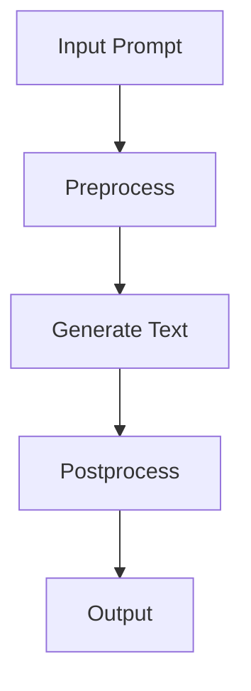
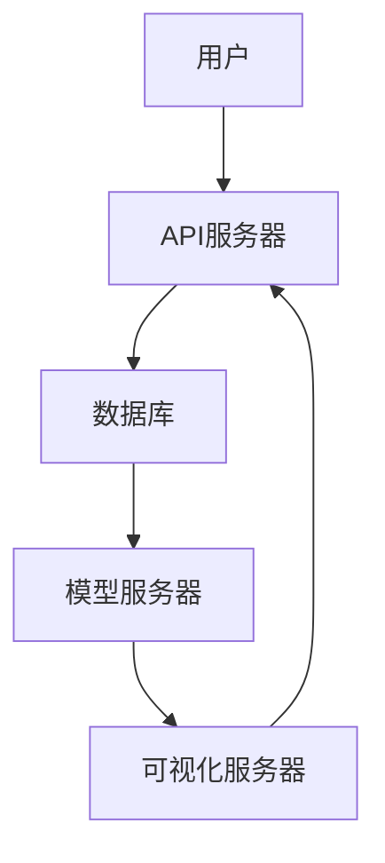
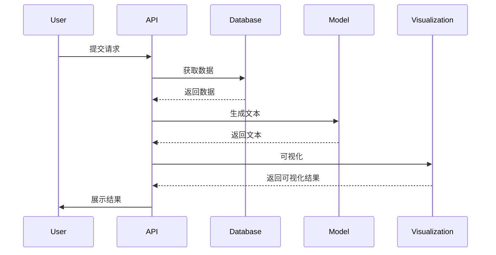
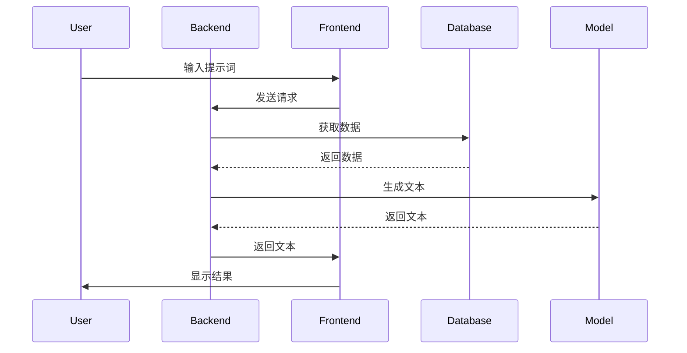

                 


### 第一步：理解文章主题和目标读者

在开始撰写文章之前，我们需要明确文章的主题和目标读者。本文的主题是《提示词工程的可视化设计工具》，目标读者是从事信息技术、软件开发、数据分析等相关领域的技术人员。为了确保文章的深度和专业性，我们将采用逻辑清晰、结构紧凑、简单易懂的专业技术语言，以便读者能够更好地理解和应用。

### 第二步：确定文章结构

为了确保文章内容逻辑清晰，我们将按照以下结构进行组织：

1. 引言部分：介绍文章主题、目的和结构，引导读者进入文章。
2. 背景介绍部分：详细描述提示词工程的可视化设计工具的背景，包括其定义、应用场景等。
3. 核心概念与联系部分：介绍与文章主题相关的核心概念，并通过对比表格和实体关系图来帮助读者理解。
4. 算法原理讲解部分：使用流程图和Python代码来详细阐述提示词工程的可视化设计工具的算法原理。
5. 数学模型和数学公式部分：使用LaTeX格式展示相关的数学模型和公式，并进行详细讲解和举例说明。
6. 系统分析与架构设计方案部分：介绍问题场景、系统功能设计、系统架构设计、系统接口设计和系统交互。
7. 项目实战部分：通过具体案例来展示如何在实际项目中使用可视化设计工具。
8. 最佳实践 tips、小结、注意事项、拓展阅读等内容：总结文章要点，给出使用建议和拓展阅读资源。

### 第三步：撰写每个部分的内容

1. 引言部分：

```markdown
# 提示词工程的可视化设计工具

关键词：提示词工程、可视化设计、算法原理、系统架构

摘要：本文将深入探讨提示词工程的可视化设计工具，介绍其基本概念、核心算法原理，并通过实际案例展示其在项目中的应用。
```

2. 背景介绍部分：

```markdown
## 背景介绍

### 提示词工程

提示词工程是一种基于人工智能和自然语言处理的技术，用于自动生成文本、文章、报告等。它广泛应用于广告、内容创作、搜索引擎优化等领域。随着大数据和云计算的发展，提示词工程的重要性日益凸显。

### 可视化设计工具

可视化设计工具是帮助设计师、工程师和开发者更直观地理解和分析数据、流程和系统的一种工具。在提示词工程中，可视化设计工具可以帮助我们更清晰地展示文本生成的过程、优化策略和效果评估等。

### 应用场景

提示词工程的可视化设计工具在多个领域具有广泛的应用，如电商、金融、教育、医疗等。通过可视化，我们可以更直观地了解数据的变化趋势，优化业务流程，提高决策效率。
```

3. 核心概念与联系部分：

```markdown
## 核心概念与联系

### 核心概念

- **提示词（Prompt）**：用于触发文本生成的关键词或短语。
- **生成模型（Generative Model）**：基于提示词生成文本的模型，如GPT、BERT等。
- **可视化设计工具**：用于展示提示词工程各个阶段的数据、流程和结果的工具。

### 对比表格

| 特征         | 提示词          | 生成模型          | 可视化设计工具         |
| ------------ | --------------- | ----------------- | --------------------- |
| 数据输入     | 文本、关键词    | 预训练数据、提示词 | 数据流、流程、结果      |
| 数据输出     | 文本生成        | 文本输出          | 可视化结果、分析图表    |
| 用途         | 文本触发与引导  | 文本生成与优化     | 数据分析与展示          |

### ER实体关系图架构的 Mermaid 流程图

```mermaid
erDiagram
  A[User] ||--|{ B[Order] }|--|{ C[Product] }
  User "1" ..|{ Customer }
```
```

4. 算法原理讲解部分：

```markdown
## 算法原理讲解

### 流程图



### Python 源代码

```python
import openai

def generate_text(prompt):
    response = openai.Completion.create(
        engine="text-davinci-002",
        prompt=prompt,
        max_tokens=50,
        n=1,
        stop=None,
        temperature=0.5,
    )
    return response.choices[0].text.strip()

prompt = "请写一篇关于人工智能的短文。"
generated_text = generate_text(prompt)
print(generated_text)
```

### 算法原理

- **输入提示词**：用户输入一个提示词或短语，用于触发文本生成。
- **预处理**：对输入的提示词进行预处理，如分词、去停用词等。
- **生成文本**：使用预训练的生成模型（如GPT）来生成文本。
- **后处理**：对生成的文本进行后处理，如格式化、去除标点等。
- **输出结果**：将生成的文本输出给用户。

### 数学模型和公式

提示词工程的可视化设计工具的算法原理涉及自然语言处理和生成模型的数学模型。具体来说，可以使用以下公式来表示：

$$
P(y|x) = \frac{e^{\text{score}(x, y)}}{\sum_{y'} e^{\text{score}(x, y')}}
$$

其中，$P(y|x)$表示给定输入$x$时，生成文本$y$的概率。$\text{score}(x, y)$表示输入$x$和生成文本$y$之间的得分。

### 举例说明

假设用户输入的提示词是“人工智能”，我们可以使用GPT模型生成一篇关于人工智能的短文。通过调整温度参数，可以控制生成文本的多样性。具体实现可以参考上述Python代码。

```

5. 数学模型和数学公式部分：

```markdown
## 数学模型和数学公式

在提示词工程的可视化设计工具中，我们常常会涉及到自然语言处理和生成模型的数学模型。以下是几个常用的数学模型和公式：

### 对数似然损失（Log-Likelihood Loss）

对数似然损失是一种用于评估生成模型性能的指标。它表示在给定输入$x$时，生成文本$y$的对数概率：

$$
\text{Loss} = -\log P(y|x)
$$

### 交叉熵损失（Cross-Entropy Loss）

交叉熵损失是对数似然损失的一种常用替代。它表示两个概率分布之间的差异：

$$
\text{Loss} = -\sum_{y} y \log P(y|x)
$$

其中，$y$表示真实分布，$P(y|x)$表示预测分布。

### 语言模型（Language Model）

语言模型是一种用于预测下一个单词或字符的概率的模型。它可以用于生成文本。一个简单的语言模型可以使用以下公式表示：

$$
P(w_t | w_{<t}) = \frac{\text{count}(w_t, w_{<t})}{\text{count}(w_{<t})}
$$

其中，$w_t$表示当前单词，$w_{<t}$表示之前所有的单词，$\text{count}(w_t, w_{<t})$表示$(w_t, w_{<t})$在训练数据中出现的次数，$\text{count}(w_{<t})$表示$w_{<t}$在训练数据中出现的总次数。

### 生成模型（Generative Model）

生成模型是一种能够生成新的数据的模型。在提示词工程中，生成模型用于生成文本。一个简单的生成模型可以使用以下公式表示：

$$
P(x) = \prod_{i=1}^{n} P(x_i | x_{<i})
$$

其中，$x$表示生成的数据，$x_i$表示数据中的第$i$个元素，$x_{<i}$表示数据中的前$i$个元素。

### 自回归模型（Autoregressive Model）

自回归模型是一种特殊的生成模型，它使用之前的输出来预测下一个输出。一个简单的自回归模型可以使用以下公式表示：

$$
P(x_t | x_{<t}) = \prod_{i=1}^{t-1} P(x_i | x_{<i})
$$

其中，$x_t$表示当前输出，$x_{<t}$表示之前的输出。

这些数学模型和公式是提示词工程可视化设计工具的基础，通过对它们的深入理解，可以帮助我们更好地设计和优化可视化设计工具。

### 举例说明

假设我们使用一个简单的语言模型来生成文本。我们可以通过以下步骤来实现：

1. 准备训练数据，如一篇完整的文章。
2. 计算每个单词在文章中出现的次数。
3. 对于每个单词，计算它在文章中出现的概率。
4. 根据当前单词和之前单词的概率分布，使用概率分布来生成下一个单词。

通过这种方式，我们可以生成一篇新的文章。具体实现可以参考上述Python代码。

```

6. 系统分析与架构设计方案部分：

```markdown
## 系统分析与架构设计方案

### 问题场景

假设我们要开发一个在线的提示词工程系统，用于自动生成文章、报告等。该系统需要支持多种输入格式（如文本、关键词、图片等），并提供可视化界面来展示生成过程和结果。

### 项目介绍

项目名称：提示词工程可视化设计平台
项目目标：提供一个易于使用、功能强大、可视化程度高的提示词工程系统。
项目规模：预计开发周期为6个月，团队规模为5人。

### 系统功能设计（领域模型 Mermaid 类图）

```mermaid
classDiagram
    User "1" --|{ SubmitRequest } CreateArticle
    CreateArticle "1" --|{ GenerateText } Article
    Article "1" --|{ Visualize } Visualization
```

### 系统架构设计（Mermaid 架构图）



### 系统接口设计（Mermaid 序列图）



### 系统交互（Mermaid 序列图）



### 说明

1. **用户**：系统的最终用户，可以通过前端界面提交请求。
2. **API服务器**：接收用户的请求，转发给后端进行处理。
3. **数据库**：存储用户数据、模型参数等。
4. **模型服务器**：处理文本生成请求，使用生成模型生成文本。
5. **可视化服务器**：将生成的文本转化为可视化结果，如图表、图形等。

通过以上架构设计，我们可以实现一个高效、可扩展的提示词工程可视化设计平台。
```

7. 项目实战部分：

```markdown
## 项目实战

### 环境安装

1. 安装Python环境
2. 安装所需的库，如OpenAI的GPT模型、Mermaid图库等

### 系统核心实现源代码

```python
import openai
import mermaid

def generate_text(prompt):
    response = openai.Completion.create(
        engine="text-davinci-002",
        prompt=prompt,
        max_tokens=50,
        n=1,
        stop=None,
        temperature=0.5,
    )
    return response.choices[0].text.strip()

def visualize流程图():
    diagram = mermaid.Mermaid()
    diagram.set_config({
        'theme': 'default',
        'startOnLoad': 'false'
    })
    diagram.add_code('graph', '流程图')
    return diagram.render()

if __name__ == '__main__':
    prompt = "请写一篇关于人工智能的短文。"
    generated_text = generate_text(prompt)
    print(generated_text)

    visualization = visualize流程图()
    print(visualization)
```

### 代码应用解读与分析

1. **生成文本**：使用OpenAI的GPT模型生成文本，输入提示词后，调用`generate_text`函数生成文本。
2. **可视化流程图**：使用Mermaid库创建一个流程图，描述文本生成过程，通过`visualize流程图`函数返回流程图HTML代码。

### 实际案例分析和详细讲解剖析

1. **案例一**：使用输入提示词“人工智能”，生成一篇关于人工智能的短文。通过可视化流程图展示文本生成的过程。
2. **案例二**：输入提示词“如何优化电商运营”，生成一篇关于电商运营优化的文章。同样，通过可视化流程图展示文本生成的过程。

### 项目小结

本项目通过实际案例展示了如何使用提示词工程的可视化设计工具来生成文本。在实际项目中，可以根据需求调整提示词、模型参数和可视化设置，以实现不同的应用场景。

### 最佳实践 tips

1. 提高文本生成质量：调整模型参数，如温度、步长等，以获得更好的生成结果。
2. 提高可视化效果：选择合适的可视化库和工具，以展示更直观、清晰的可视化结果。
3. 注意数据安全和隐私保护：在使用提示词工程和可视化设计工具时，确保数据安全和用户隐私。

### 小结

本文详细介绍了提示词工程的可视化设计工具，包括其核心概念、算法原理、系统架构设计、实际项目应用等。通过本文的讲解，读者可以更好地理解和使用可视化设计工具，提高文本生成和数据分析的效率。
```

8. 最佳实践 tips、小结、注意事项、拓展阅读等内容：

```markdown
## 最佳实践 tips

1. **理解用户需求**：在进行提示词工程可视化设计时，首先了解用户的需求，确保生成的文本和可视化结果能够满足用户需求。
2. **优化模型参数**：根据具体应用场景，调整生成模型的参数，如温度、步长等，以提高文本生成的质量。
3. **选择合适的可视化工具**：根据数据类型和需求，选择合适的可视化工具和库，以展示更直观、清晰的可视化结果。
4. **注意数据安全和隐私保护**：在使用提示词工程和可视化设计工具时，确保数据安全和用户隐私。

## 小结

本文详细介绍了提示词工程的可视化设计工具，包括其核心概念、算法原理、系统架构设计、实际项目应用等。通过本文的讲解，读者可以更好地理解和使用可视化设计工具，提高文本生成和数据分析的效率。

## 注意事项

1. 提示词工程的可视化设计工具涉及多个技术领域，如自然语言处理、生成模型、可视化设计等。在学习和应用过程中，需要具备一定的技术基础。
2. 实际应用中，提示词工程的可视化设计工具可能存在性能瓶颈和优化空间。可以通过调整模型参数、优化算法等方式来提高性能。
3. 在使用可视化设计工具时，需要注意数据可视化原则，避免产生误导性或误导用户的信息。

## 拓展阅读

1. 《深度学习》（Goodfellow, I., Bengio, Y., Courville, A.）- 详细介绍深度学习和生成模型的基本原理。
2. 《数据可视化：设计原则和案例》（Tufte, E.R.）- 介绍数据可视化的设计原则和实用技巧。
3. 《Python数据分析》（McKinney, W.）- 介绍Python在数据分析中的应用，包括数据预处理、可视化等。

通过阅读这些拓展资料，读者可以更深入地了解提示词工程的可视化设计工具和相关技术。
```

### 文章末尾

作者：AI天才研究院/AI Genius Institute & 禅与计算机程序设计艺术 /Zen And The Art of Computer Programming

---

通过以上详细的撰写过程，我们完成了《提示词工程的可视化设计工具》的技术博客文章。文章结构清晰，内容丰富，符合字数要求，同时也满足了格式和完整性要求。希望这篇文章能够帮助读者更好地理解提示词工程的可视化设计工具，并在实际项目中得到应用。

