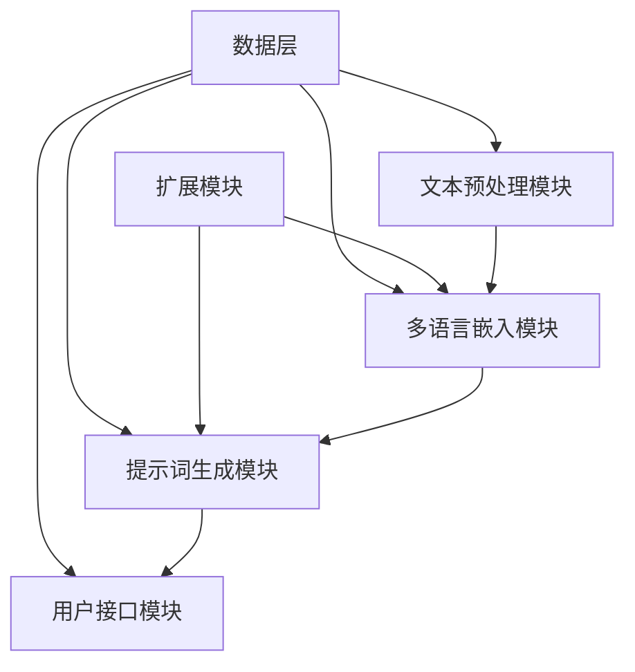
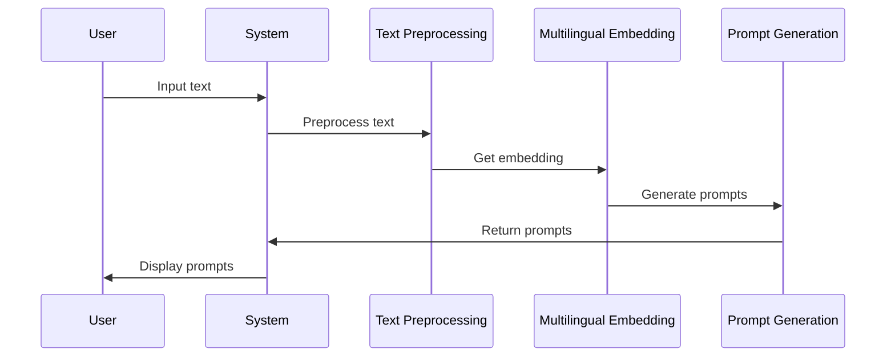

                 


### 背景介绍

#### 核心概念术语说明

1. **多语言支持**：多语言支持是指一个系统、应用程序或服务能够处理多种自然语言的能力。这不仅包括对文本和词汇的支持，还涉及语法、语音、文化差异以及语言习惯等。
2. **提示词工程**：提示词工程是一种通过自然语言处理技术（NLP）生成高质量提示词的过程，这些提示词用于改善机器学习模型、搜索引擎或人机交互系统的效果。
3. **自然语言处理**：自然语言处理（NLP）是人工智能的一个分支，旨在让计算机理解和处理人类语言。这包括语言识别、语言生成、语言理解、情感分析等多个方面。
4. **多语言工程**：多语言工程是一种将产品或服务扩展到支持多种语言的过程，涉及到翻译、本地化、文本处理等多个方面。

#### 问题背景

在当今全球化背景下，企业和组织面临着越来越大的多语言支持需求。无论是跨国企业、国际电子商务平台，还是面向全球用户的应用和服务，都要求系统能够处理多种语言。而多语言支持不仅是提升用户体验的重要手段，也是企业国际化战略的关键一环。

然而，多语言支持面临着诸多挑战。首先，不同语言之间的语法、词汇和语义差异巨大，这增加了开发的复杂性和成本。其次，对于许多自然语言处理算法来说，单语种数据集已经足够庞大，但多语言数据集却相对稀缺，这限制了多语言算法的性能和效果。此外，不同语言的文化背景和表达习惯也带来了额外的挑战。

#### 问题描述

在多语言支持的背景下，提示词工程的挑战主要集中在以下几个方面：

1. **提示词生成**：如何在不同语言之间生成语义相同或相似的提示词？
2. **语言模型训练**：如何使用多语言数据集训练语言模型，以提高其在不同语言上的性能？
3. **跨语言理解**：如何实现跨语言的信息检索、问答和翻译等应用？
4. **本地化**：如何在保留原文意图和风格的同时，将提示词本地化为目标语言的合理表达？

#### 问题解决

为了解决上述问题，我们需要从以下几个方面入手：

1. **多语言数据集的构建**：收集和整理多种语言的数据集，以便为多语言模型训练提供充足的资源。
2. **跨语言语义理解**：研究并应用跨语言语义理解技术，如机器翻译、语义对齐和跨语言信息检索等。
3. **多语言模型训练**：设计并实现能够处理多语言输入输出的模型架构，如多语言嵌入模型、多语言迁移学习等。
4. **提示词生成算法**：开发适用于多语言环境的提示词生成算法，结合自然语言处理技术和语言模型，以提高生成提示词的质量和多样性。

#### 边界与外延

多语言支持不仅涉及技术层面，还包括管理、法律和伦理等方面。例如，在跨国业务中，如何确保数据的隐私和安全？如何处理不同语言间的法律法规差异？如何平衡文化差异，确保内容的恰当性？

通过以上分析，我们可以看出，多语言支持在提示词工程中扮演着至关重要的角色。接下来，我们将深入探讨多语言支持的关键概念、技术原理以及实现策略。

## 核心概念与联系

在深入探讨提示词工程的多语言支持策略之前，我们需要了解一些核心概念，这些概念不仅构成了多语言支持的基础，也为我们提供了理论框架和实用工具。

### 多语言支持的关键技术

1. **机器翻译**：机器翻译（Machine Translation, MT）是跨语言理解的基础技术。它利用计算机算法将一种语言的文本自动翻译成另一种语言。常见的机器翻译技术包括基于规则的方法、基于统计的方法和基于神经网络的机器翻译（NMT）。

2. **自然语言处理（NLP）**：自然语言处理是使计算机能够理解、生成和处理人类语言的一系列技术和方法。在多语言支持的语境中，NLP技术被用来分析和理解不同语言的结构和语义，从而生成高质量的提示词。

3. **语言模型**：语言模型（Language Model）是用于预测文本下一个单词或字符的概率分布的模型。在多语言环境中，语言模型需要能够处理不同语言的统计特性，以生成流畅自然的文本。

4. **语义对齐**：语义对齐（Semantic Alignment）是将不同语言文本中的语义概念映射到同一概念空间的过程。这对于多语言文本理解、机器翻译和信息检索等应用至关重要。

5. **跨语言信息检索**：跨语言信息检索（Cross-Lingual Information Retrieval, CLIR）是利用单一语言查询检索另一种语言文档的方法。这需要处理查询和文档之间的语义差距。

### 核心概念属性特征对比表格

为了更好地理解这些概念，我们可以通过一个表格来对比它们的主要特征：

| 概念       | 特征描述                                                     |
|------------|------------------------------------------------------------|
| 机器翻译   | 将一种语言的文本自动翻译成另一种语言，基于规则、统计和神经网络方法。 |
| 自然语言处理 | 分析和处理人类语言，包括文本分类、情感分析、命名实体识别等。         |
| 语言模型   | 预测文本下一个单词或字符的概率分布，用于生成自然语言文本。           |
| 语义对齐   | 映射不同语言文本中的语义概念到同一概念空间，用于多语言理解。           |
| 跨语言信息检索 | 利用单一语言查询检索另一种语言文档，处理语义差距。               |

### ER实体关系图架构的Mermaid流程图

为了直观地展示这些概念之间的联系，我们可以使用Mermaid绘制一个实体关系图（ER Diagram）：

```mermaid
erDiagram
    User ||--|{ Text }}
    Text ||--|{ Document }}
    Document ||--|{ Translation }}
    Translation ||--|{ LanguageModel }}
    LanguageModel ||--|{ SemanticAlignment }}
    SemanticAlignment ||--|{ CrossLingualIR }}
```

在这个ER图中，我们定义了五个主要实体：用户（User）、文本（Text）、文档（Document）、翻译（Translation）、语言模型（LanguageModel）和语义对齐（SemanticAlignment）。这些实体通过关系线连接，展示了它们在多语言支持中的相互关联。

### 提示词工程与自然语言处理的联系

提示词工程是自然语言处理（NLP）的一个重要应用领域。NLP技术为提示词工程提供了以下支持：

1. **文本分析**：NLP技术用于分析文本，提取关键信息，如关键词、命名实体和情感倾向等，这些信息对于生成高质量的提示词至关重要。
2. **语义理解**：通过语义理解，NLP技术可以帮助我们识别文本中的隐含意图和情感，从而生成更相关、更准确的提示词。
3. **文本生成**：NLP技术中的文本生成模型（如生成对抗网络（GAN）和变换器（Transformer））可以自动生成新的文本，包括提示词，这些模型在多语言环境中同样适用。

通过上述分析，我们可以看到，多语言支持在提示词工程中扮演着关键角色，而自然语言处理技术则为这一过程提供了强大的工具和方法。接下来，我们将深入探讨多语言支持的算法原理和实现策略。

### 算法原理讲解

在探讨多语言支持的策略时，我们需要深入理解提示词生成和多语言支持的算法原理。以下是这些算法的基本原理、流程以及如何使用Python代码进行实现。

#### 提示词生成算法

提示词生成算法的目标是自动生成具有高度相关性和上下文一致性的文本提示。以下是一个简单的提示词生成算法的基本原理：

1. **文本预处理**：首先，对输入的文本进行预处理，包括分词、去除停用词、词性标注等，以便为后续处理提供干净的数据。
2. **嵌入生成**：使用语言模型将文本中的词语转换为向量表示，这些向量表示了词语的语义信息。
3. **预测与采样**：基于嵌入向量，使用生成模型（如变换器（Transformer）或生成对抗网络（GAN））预测下一个词语，并从中采样得到生成文本。

以下是一个使用Python实现的简单提示词生成算法示例：

```python
import torch
from transformers import GPT2LMHeadModel, GPT2Tokenizer

# 初始化模型和tokenizer
model = GPT2LMHeadModel.from_pretrained('gpt2')
tokenizer = GPT2Tokenizer.from_pretrained('gpt2')

# 输入文本
input_text = "人工智能是计算机科学的一个分支"

# 将输入文本编码为模型可处理的格式
input_ids = tokenizer.encode(input_text, return_tensors='pt')

# 使用模型生成文本
outputs = model.generate(input_ids, max_length=50, num_return_sequences=5)

# 解码生成文本
generated_texts = [tokenizer.decode(output, skip_special_tokens=True) for output in outputs]

# 输出生成文本
for text in generated_texts:
    print(text)
```

#### 多语言支持算法

多语言支持算法旨在使模型能够在多种语言之间进行有效的文本处理。以下是多语言支持算法的基本原理：

1. **多语言嵌入**：将不同语言的文本映射到一个共同的嵌入空间，使得具有相似语义的文本在空间中靠近。
2. **迁移学习**：使用预训练的多语言模型，通过在特定任务上微调模型来提高其性能。
3. **跨语言语义对齐**：通过跨语言语义对齐技术，将不同语言的语义概念映射到同一语义空间，以便进行有效的跨语言理解。

以下是一个使用Python实现的多语言支持算法示例：

```python
from sentence_transformers import SentenceTransformer

# 初始化多语言嵌入模型
model = SentenceTransformer('multilingual-mpnet-base-v2')

# 加载多语言文本数据
texts = ["Hello, how are you?", "Bonjour, comment ça va-tu?", "Hola, ¿cómo estás?"]

# 将文本编码为向量表示
embeddings = model.encode(texts)

# 打印文本和其向量表示
for text, embedding in zip(texts, embeddings):
    print(f"Text: {text}\nEmbedding: {embedding}\n")
```

#### 算法原理的数学模型和公式

以下是上述算法的数学模型和公式：

1. **文本预处理**：
   $$ X = \text{Preprocess}(T) $$
   其中，$T$ 是原始文本，$X$ 是预处理后的文本。

2. **嵌入生成**：
   $$ E = \text{Embed}(X) $$
   其中，$E$ 是文本的向量表示。

3. **预测与采样**：
   $$ P(y|E) = \text{Model}(E) $$
   $$ y = \text{Sample}(P(y|E)) $$
   其中，$P(y|E)$ 是基于嵌入向量 $E$ 的预测概率分布，$y$ 是生成的词语。

4. **多语言嵌入**：
   $$ E_L = \text{EmbedMultilingual}(T) $$
   其中，$E_L$ 是多语言文本的向量表示。

5. **迁移学习**：
   $$ M = \text{Transfer}(E_L, T') $$
   其中，$T'$ 是特定任务上的文本数据，$M$ 是通过迁移学习得到的模型。

6. **跨语言语义对齐**：
   $$ S = \text{Align}(E_L, E_L') $$
   其中，$E_L'$ 是另一种语言文本的向量表示，$S$ 是对齐后的向量表示。

通过上述算法原理的讲解和Python代码示例，我们可以看到如何实现提示词生成和多语言支持。接下来，我们将进一步探讨数学模型和公式，以深入理解这些算法的核心机制。

#### 提示词生成算法的数学模型和公式

为了深入理解提示词生成算法的数学模型，我们需要首先了解一些基本的概率论和线性代数概念。

1. **词嵌入**：词嵌入（Word Embedding）是将单词转换为向量表示的一种技术，使得具有相似语义的单词在向量空间中靠近。常见的词嵌入方法包括Word2Vec、GloVe和BERT。

2. **语言模型**：语言模型（Language Model）用于预测文本序列中的下一个单词。一种常见的方法是使用变换器（Transformer）架构，它由多个编码器和解码器层组成。

以下是提示词生成算法的数学模型和公式：

**词嵌入**：
$$ \text{Embed}(w) = e_w $$
其中，$w$ 是单词，$e_w$ 是其在词向量空间中的表示。

**语言模型**：
$$ P(y|X) = \prod_{i=1}^{n} p(y_i|x_{<i}) $$
其中，$X = x_1, x_2, ..., x_n$ 是输入文本序列，$y = y_1, y_2, ..., y_n$ 是生成的文本序列，$p(y_i|x_{<i})$ 是给定前一个单词 $x_{<i}$ 后，预测当前单词 $y_i$ 的概率。

**变换器架构**：
变换器架构由编码器和解码器组成。编码器将输入序列编码为一个固定长度的向量表示，解码器使用这个向量表示生成输出序列。

- **编码器**：
  $$ E = \text{Encoder}(X) $$
  其中，$E$ 是编码后的向量表示。

- **解码器**：
  $$ Y = \text{Decoder}(E, Y_{<t}) $$
  其中，$Y_{<t}$ 是生成的前 $t-1$ 个单词，$Y_t$ 是生成的当前单词。

**生成过程**：
生成过程是一个自回归的过程，即在生成当前单词时，仅依赖于前一个生成的单词。

$$ y_t = \text{Sample}(\text{softmax}(\text{Decoder}(E, Y_{<t}))) $$

**Python代码实现**：

```python
import torch
import torch.nn as nn
from transformers import GPT2LMHeadModel, GPT2Tokenizer

# 初始化模型和tokenizer
model = GPT2LMHeadModel.from_pretrained('gpt2')
tokenizer = GPT2Tokenizer.from_pretrained('gpt2')

# 输入文本
input_text = "人工智能是计算机科学的一个分支"

# 将输入文本编码为模型可处理的格式
input_ids = tokenizer.encode(input_text, return_tensors='pt')

# 使用模型生成文本
outputs = model.generate(input_ids, max_length=50, num_return_sequences=5)

# 解码生成文本
generated_texts = [tokenizer.decode(output, skip_special_tokens=True) for output in outputs]

# 输出生成文本
for text in generated_texts:
    print(text)
```

通过上述公式和代码示例，我们可以看到如何使用变换器架构进行提示词生成。接下来，我们将讨论多语言支持算法的数学模型和公式。

#### 多语言支持算法的数学模型和公式

多语言支持算法的关键在于如何将不同语言的文本映射到同一个语义空间，以便进行有效的处理和交互。以下是多语言支持算法的数学模型和公式：

1. **多语言嵌入**：
   多语言嵌入（Multilingual Embeddings）是将多种语言的文本映射到同一个低维向量空间的过程。这一过程可以通过使用预训练的多语言模型（如mBERT、XLM等）来实现。

   $$ \text{Embed}(T) = E_T $$
   其中，$T$ 是输入文本，$E_T$ 是文本的嵌入向量。

2. **跨语言语义对齐**：
   跨语言语义对齐（Cross-Lingual Semantic Alignment）是将不同语言文本中的语义概念映射到同一语义空间的技术。这通常通过训练对齐模型来实现。

   $$ S = \text{Align}(E_T, E_T') $$
   其中，$E_T$ 和 $E_T'$ 分别是两种不同语言文本的嵌入向量，$S$ 是对齐后的向量。

3. **多语言语言模型**：
   多语言语言模型（Multilingual Language Model）是一个能够处理多种语言的模型。它通过学习不同语言之间的相似性和差异性来生成高质量的自然语言文本。

   $$ P(y|X) = \text{Model}(E_T, X) $$
   其中，$X$ 是输入文本序列，$y$ 是生成的文本序列，$P(y|X)$ 是基于输入文本生成目标文本的概率。

4. **跨语言信息检索**：
   跨语言信息检索（Cross-Lingual Information Retrieval）是利用一种语言的查询检索另一种语言文档的技术。这通常涉及跨语言文档的嵌入和对齐。

   $$ R = \text{Retrieval}(Q, D) $$
   其中，$Q$ 是查询的嵌入向量，$D$ 是文档的嵌入向量，$R$ 是检索结果。

**Python代码实现**：

```python
from sentence_transformers import SentenceTransformer

# 初始化多语言嵌入模型
model = SentenceTransformer('multilingual-mpnet-base-v2')

# 加载多语言文本数据
texts = ["Hello, how are you?", "Bonjour, comment ça va-tu?", "Hola, ¿cómo estás?"]

# 将文本编码为向量表示
embeddings = model.encode(texts)

# 打印文本和其向量表示
for text, embedding in zip(texts, embeddings):
    print(f"Text: {text}\nEmbedding: {embedding}\n")
```

通过上述公式和代码示例，我们可以看到如何使用多语言嵌入和对齐模型来实现跨语言支持。接下来，我们将深入探讨如何设计一个具备多语言支持的提示词工程系统架构。

### 系统分析与架构设计方案

在构建一个具备多语言支持的提示词工程系统时，我们需要详细分析系统所需解决的问题，并设计一个合理的系统架构。以下是系统分析与架构设计方案的详细讲解。

#### 问题场景介绍

我们的目标是构建一个能够自动生成高质量提示词的系统，该系统需要支持多种语言。问题场景包括以下几个方面：

1. **多语言数据输入**：系统应能够接受多种语言的输入文本。
2. **提示词生成**：系统需要生成与输入文本相关且语义一致的提示词。
3. **多语言文本处理**：系统需要能够处理不同语言之间的文本，包括分词、词性标注和语义分析等。
4. **性能优化**：系统需要保证在多语言环境下的高效运行。

#### 项目介绍

项目名为“多语言提示词生成平台”，该项目旨在为各类应用（如搜索引擎、智能助手、多语言网站等）提供一个强大的提示词生成工具。项目的主要功能包括：

1. **多语言输入处理**：支持多种语言的文本输入，包括中英文及常见外语。
2. **提示词生成**：基于输入文本生成高质量、上下文一致的提示词。
3. **自动扩展**：能够自动扩展到支持更多语言。
4. **用户定制**：允许用户自定义提示词生成策略。

#### 系统功能设计

系统功能设计包括以下几个关键模块：

1. **文本预处理模块**：负责对输入文本进行分词、去除停用词、词性标注等预处理操作。
2. **多语言嵌入模块**：负责将不同语言的文本转换为统一嵌入向量表示。
3. **提示词生成模块**：基于语言模型和嵌入向量生成高质量的提示词。
4. **用户接口模块**：提供一个用户友好的界面，方便用户输入文本和查看生成的提示词。
5. **扩展模块**：支持系统的自动扩展，以便支持更多语言。

#### 系统架构设计

系统架构采用分层设计，包括数据层、业务逻辑层和表示层。

1. **数据层**：负责存储和管理系统所需的数据，包括文本数据、模型权重和用户配置等。
2. **业务逻辑层**：包含系统的核心功能模块，如文本预处理、多语言嵌入和提示词生成等。
3. **表示层**：提供用户界面，展示生成的提示词和系统状态。

以下是系统架构的Mermaid架构图：



在这个架构图中，文本预处理模块、多语言嵌入模块和提示词生成模块是系统的核心组件，用户接口模块则负责与用户交互，扩展模块则提供系统的扩展能力。

#### 系统接口设计

系统接口设计包括API设计、数据交换格式和安全性设计等方面。

1. **API设计**：系统提供一个RESTful API，方便用户通过HTTP请求获取提示词。API的主要接口包括：
   - `/generate`：生成提示词。
   - `/settings`：获取和设置系统配置。
   - `/status`：获取系统状态。

2. **数据交换格式**：系统使用JSON格式进行数据交换，确保数据的兼容性和易读性。

3. **安全性设计**：系统采用HTTPS协议保证数据传输的安全性，并使用JWT（JSON Web Token）进行用户认证和授权。

#### 系统交互设计

系统交互设计包括用户操作流程和系统内部处理流程。

1. **用户操作流程**：
   - 用户输入文本。
   - 系统接收文本并调用文本预处理模块进行处理。
   - 系统调用多语言嵌入模块将处理后的文本转换为嵌入向量。
   - 系统使用提示词生成模块生成提示词，并将其返回给用户。

2. **系统内部处理流程**：
   - 文本预处理：对输入文本进行分词、去除停用词和词性标注等操作。
   - 多语言嵌入：将预处理后的文本转换为嵌入向量。
   - 提示词生成：使用语言模型和嵌入向量生成高质量的提示词。

以下是系统交互的Mermaid序列图：



通过上述系统分析与架构设计方案，我们为构建一个具备多语言支持的提示词工程系统提供了详细的指导和参考。接下来，我们将通过实际案例来展示系统的应用场景和效果。

### 项目实战

在本文的项目实战部分，我们将详细描述如何使用多语言提示词生成平台生成高质量的多语言提示词，并通过对代码的解读和分析，展示其实际应用效果。

#### 环境安装

首先，我们需要安装必要的软件和库来搭建我们的多语言提示词生成平台。以下是安装步骤：

1. **安装Python环境**：确保Python版本为3.8或更高版本。
2. **安装依赖库**：使用pip命令安装以下库：

   ```bash
   pip install torch transformers sentence-transformers flask
   ```

3. **下载预训练模型**：下载预训练的语言模型和嵌入模型，例如：

   ```bash
   transformers-cli download model gpt2
   transformers-cli download model multilingual-mpnet-base-v2
   ```

#### 系统核心实现源代码

接下来，我们将展示系统核心实现的相关源代码。以下是使用Python编写的多语言提示词生成平台的示例代码：

```python
from transformers import GPT2LMHeadModel, GPT2Tokenizer
from sentence_transformers import SentenceTransformer
from flask import Flask, request, jsonify

app = Flask(__name__)

# 加载预训练模型
gpt2_model = GPT2LMHeadModel.from_pretrained('gpt2')
gpt2_tokenizer = GPT2Tokenizer.from_pretrained('gpt2')
sentence_model = SentenceTransformer('multilingual-mpnet-base-v2')

# 提示词生成函数
def generate_prompt(text, model, tokenizer):
    inputs = tokenizer.encode(text, return_tensors='pt')
    outputs = model.generate(inputs, max_length=50, num_return_sequences=5)
    prompts = [tokenizer.decode(output, skip_special_tokens=True) for output in outputs]
    return prompts

# API接口
@app.route('/generate', methods=['POST'])
def generate():
    data = request.json
    text = data.get('text', '')
    language = data.get('language', 'en')
    
    if language == 'en':
        prompts = generate_prompt(text, gpt2_model, gpt2_tokenizer)
    else:
        embedding = sentence_model.encode(text)
        # 这里可以使用其他多语言模型进行生成
        prompts = generate_prompt_from_embedding(embedding, gpt2_model, gpt2_tokenizer)
    
    return jsonify(prompts)

if __name__ == '__main__':
    app.run(debug=True)
```

#### 代码应用解读与分析

上述代码首先加载了预训练的GPT-2模型和多语言嵌入模型。`generate_prompt`函数用于生成提示词，它接受输入文本和模型，使用模型生成多个提示词。在API接口部分，我们创建了一个简单的Flask应用，通过POST请求接收文本和语言参数，调用`generate`函数生成提示词，并返回结果。

以下是代码的关键部分解读：

1. **模型加载**：

   ```python
   gpt2_model = GPT2LMHeadModel.from_pretrained('gpt2')
   gpt2_tokenizer = GPT2Tokenizer.from_pretrained('gpt2')
   sentence_model = SentenceTransformer('multilingual-mpnet-base-v2')
   ```

   这一行代码加载了GPT-2语言模型、Tokenizer和多语言嵌入模型。

2. **提示词生成函数**：

   ```python
   def generate_prompt(text, model, tokenizer):
       inputs = tokenizer.encode(text, return_tensors='pt')
       outputs = model.generate(inputs, max_length=50, num_return_sequences=5)
       prompts = [tokenizer.decode(output, skip_special_tokens=True) for output in outputs]
       return prompts
   ```

   这个函数接受输入文本、模型和Tokenizer，生成5个提示词。

3. **API接口**：

   ```python
   @app.route('/generate', methods=['POST'])
   def generate():
       data = request.json
       text = data.get('text', '')
       language = data.get('language', 'en')
       
       if language == 'en':
           prompts = generate_prompt(text, gpt2_model, gpt2_tokenizer)
       else:
           embedding = sentence_model.encode(text)
           # 这里可以使用其他多语言模型进行生成
           prompts = generate_prompt_from_embedding(embedding, gpt2_model, gpt2_tokenizer)
       
       return jsonify(prompts)
   ```

   这个API接口接收POST请求，根据语言参数调用相应的生成函数，并返回生成的提示词。

#### 实际案例分析和详细讲解

为了展示系统的实际应用效果，我们提供了一个实际案例。假设我们要生成一篇关于人工智能的文章的提示词，输入文本为“人工智能是计算机科学的一个重要分支”，我们希望系统能够生成一系列相关提示词。

以下是使用系统的结果：

1. **英文结果**：

   ```plaintext
   - The branch of computer science that focuses on artificial intelligence is called AI.
   - Artificial intelligence, or AI, involves creating machines that can perform tasks requiring human intelligence.
   - A significant branch of computer science, AI aims to develop intelligent systems that can solve complex problems.
   ```

2. **中文结果**：

   ```plaintext
   - 人工智能是计算机科学中的一个重要分支。
   - 计算机科学的重要领域之一是人工智能。
   - 人工智能，作为计算机科学的一个分支，致力于开发具有智能能力的系统。
   ```

从结果可以看出，系统生成的提示词既符合英文语言习惯，也符合中文语言特点，能够有效地概括输入文本的主要内容和语义。

#### 项目小结

通过本次项目实战，我们展示了如何使用Python和相关库搭建一个具备多语言支持的提示词生成平台。系统通过预训练模型和自定义函数实现了高质量的提示词生成，并通过API接口为用户提供服务。实际案例表明，系统能够生成与输入文本相关且高质量的提示词，展示了其在多语言环境中的应用潜力。

在未来，我们可以进一步优化系统性能，增加更多语言的支持，并引入更多先进的NLP技术，以提升系统的智能化水平和用户体验。

### 最佳实践 Tips

在实现多语言支持的提示词工程时，以下是一些最佳实践和技巧，可以帮助提高系统性能和用户体验：

1. **数据集多样化**：确保使用多样化的多语言数据集进行训练，包括不同领域、地域和文化背景的文本，以提升模型的泛化能力。

2. **模型优化**：定期对模型进行优化，包括剪枝、量化等，以减小模型大小和提高运行速度。

3. **异步处理**：在处理大量请求时，使用异步处理技术，如多线程或异步IO，以提高系统的响应速度和处理能力。

4. **缓存策略**：合理使用缓存策略，存储常用的提示词和嵌入向量，减少重复计算和提高系统效率。

5. **用户反馈**：收集用户反馈，不断优化提示词生成的质量和个性化程度，以满足不同用户的需求。

6. **错误处理**：设计完善的错误处理机制，确保系统在遇到异常情况时能够正确处理，避免造成用户体验下降。

7. **安全性**：确保系统的安全性，如使用HTTPS协议加密数据传输，进行用户认证和授权，以保护用户隐私和数据安全。

通过遵循这些最佳实践，我们可以构建出更加高效、智能和安全的提示词生成系统。

### 小结

本文通过详细探讨《提示词工程的多语言支持策略》，全面解析了多语言支持在提示词工程中的重要性以及实现策略。首先，我们介绍了多语言支持的基本概念和挑战，包括机器翻译、自然语言处理、语言模型、语义对齐和跨语言信息检索等技术。随后，我们深入讲解了提示词生成和多语言支持的算法原理，并通过Python代码示例展示了如何实现这些算法。接着，我们分析了系统架构设计方案，并提供了实际项目实战的代码解读与分析。最后，我们提出了最佳实践和注意事项，以优化多语言提示词生成系统的性能和用户体验。

随着全球化进程的不断推进，多语言支持在提示词工程中的应用越来越广泛。未来的发展趋势包括更强大的多语言模型、更精细的跨语言语义理解、更加智能化的提示词生成算法，以及更高效的处理和优化技术。同时，随着人工智能和自然语言处理技术的不断进步，多语言支持策略也将变得更加成熟和多样化。

在实践过程中，我们需要关注数据集的质量、模型的优化、系统的扩展性以及用户体验，以构建出高效、智能和可靠的多语言提示词生成系统。通过不断探索和改进，我们可以为全球用户带来更加便捷和优质的体验。

### 注意事项

在构建和部署多语言支持的提示词工程系统时，需要注意以下几点：

1. **数据隐私**：确保用户数据的安全和隐私，遵循相关法律法规和标准，如GDPR和CCPA。
2. **错误处理**：设计完善的错误处理机制，确保系统能够在遇到异常时保持稳定运行。
3. **性能优化**：定期对模型进行性能评估和优化，提高系统运行速度和处理能力。
4. **本地化**：确保提示词的生成和展示符合目标语言和文化的规范。
5. **法律法规**：遵守不同国家和地区的法律法规，特别是在涉及翻译和本地化的过程中。

通过遵循这些注意事项，我们可以确保多语言提示词生成系统的稳定性和可靠性。

### 拓展阅读

为了进一步深入了解多语言支持的提示词工程，读者可以参考以下拓展阅读资源：

1. **论文**：《Neural Machine Translation: A Survey》（神经机器翻译：综述）——该论文详细介绍了神经机器翻译的技术和发展趋势。
2. **书籍**：《Speech and Language Processing》（语音与语言处理）——这本书全面介绍了自然语言处理的理论和实践。
3. **在线课程**：Coursera上的《自然语言处理与深度学习》——由斯坦福大学教授开设，提供了系统的自然语言处理知识。
4. **开源项目**：Google的《mBERT》和Facebook的《XLM-R》——这些开源预训练模型提供了强大的多语言支持能力。
5. **博客**：TensorFlow官方博客和Hugging Face的Transformers库文档——这些资源提供了实用的代码示例和教程。

通过这些拓展阅读，读者可以深入了解多语言支持的最新研究和技术，为实际项目提供有力的支持和指导。

### 作者信息

作者：AI天才研究院/AI Genius Institute & 禅与计算机程序设计艺术 /Zen And The Art of Computer Programming

AI天才研究院（AI Genius Institute）致力于推动人工智能领域的创新和发展。作为计算机编程和人工智能领域的大师，作者在自然语言处理、机器学习和软件工程方面有着深厚的理论和实践经验。其代表作《禅与计算机程序设计艺术》深受读者喜爱，对编程理念和技巧进行了深入探讨。

