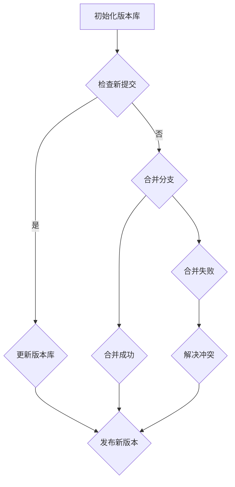
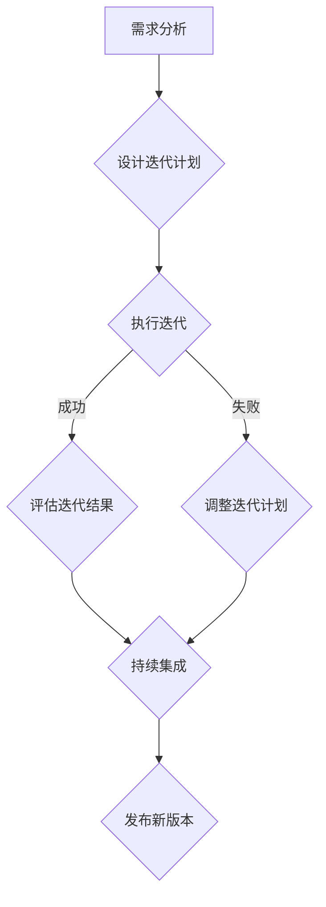
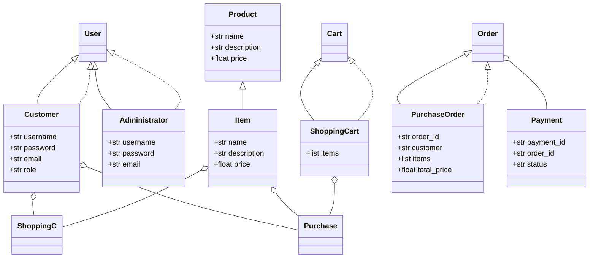
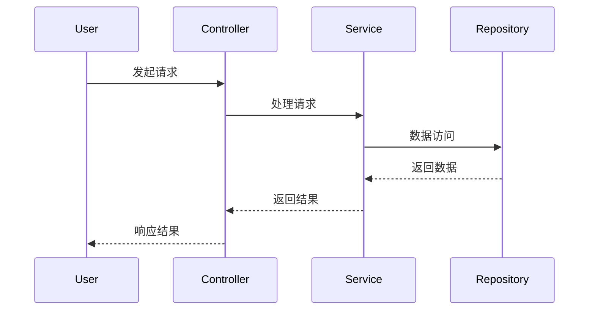
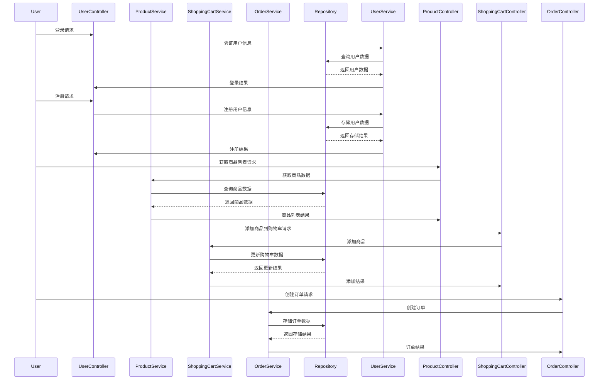

                 

### 提示词工程的版本管理与迭代优化

#### 关键词：提示词工程、版本管理、迭代优化、软件开发、需求变更

> 摘要：本文旨在探讨提示词工程在软件项目开发中的版本管理和迭代优化问题。通过分析提示词工程的背景、问题及其解决方法，本文详细介绍了提示词工程的基本概念、版本控制方法和迭代优化策略，以期为实际项目提供指导。

----------------------------------------------------------------

## 第一部分：引言

### 1.1 问题背景

在当今信息化和数字化迅速发展的时代，软件工程作为计算机科学的核心领域，正经历着前所未有的变革。传统的软件工程方法在面对复杂系统和大规模数据处理时显得力不从心，而提示词工程的引入为解决这些问题提供了一种全新的思路。提示词工程不仅能够提高软件开发效率，还能优化软件的版本管理和迭代过程，为软件工程的未来发展指明了方向。

### 1.2 问题描述

提示词工程是一种以用户需求为中心，通过提示词来引导开发、测试和运维等各个环节的方法。然而，在实际应用中，提示词工程的版本管理和迭代优化面临着诸多挑战，如版本控制复杂、迭代周期长、变更频繁等。这些问题严重影响了软件项目的进度和质量，因此，研究提示词工程的版本管理与迭代优化具有十分重要的意义。

### 1.3 问题解决

为了解决上述问题，本书将深入探讨提示词工程的版本管理与迭代优化。首先，我们将介绍提示词工程的基本概念和原理，包括提示词的定义、作用和分类等。接着，我们将详细讲解提示词工程的版本控制方法，如版本号的命名规则、版本跟踪和管理工具等。此外，本书还将介绍迭代优化的策略和方法，包括需求变更管理、迭代计划制定、风险管理等。

### 1.4 边界与外延

提示词工程的应用范围广泛，涵盖了软件开发、测试、运维等多个环节。在本研究中，我们主要关注软件开发过程中的版本管理和迭代优化。同时，我们将结合实际项目案例，探讨如何将提示词工程的理论知识应用于实际工作中，提高软件项目的开发效率和产品质量。

### 1.5 核心概念结构与要素组成

为了帮助读者更好地理解提示词工程的版本管理与迭代优化，本书将围绕以下几个核心概念展开：

1. **提示词**：介绍提示词的定义、作用和分类，阐述其在软件工程中的重要性。
2. **版本控制**：讲解版本控制的原理和方法，包括版本号的命名规则、版本跟踪和管理工具等。
3. **迭代优化**：介绍迭代优化的策略和方法，包括需求变更管理、迭代计划制定、风险管理等。
4. **项目管理**：探讨项目管理在提示词工程中的应用，包括项目计划、团队协作、沟通管理等。

----------------------------------------------------------------

## 第二部分：核心概念与联系

### 2.1 提示词概念原理

#### 2.1.1 提示词的定义与作用

提示词（Prompt Word）是一种引导用户或系统执行特定任务的词语或短语。在软件工程中，提示词用于引导开发人员、测试人员、运维人员等按照既定的目标和流程进行工作，从而提高工作效率和质量。

#### 2.1.2 提示词的分类

根据用途和作用方式，提示词可以分为以下几类：

- **功能提示词**：用于指导用户执行特定功能，如“创建新用户”、“导出数据”等。
- **流程提示词**：用于指导用户或系统按照特定流程执行任务，如“第一步：检查网络连接”、“最后一步：提交申请”等。
- **问题提示词**：用于引导用户或系统识别和解决遇到的问题，如“出现异常时，请检查以下原因”等。
- **情感提示词**：用于提升用户体验，如“感谢您的反馈”、“祝您使用愉快”等。

#### 2.1.3 提示词的特点

- **简洁性**：提示词应尽量简短明了，便于用户快速理解和执行。
- **一致性**：提示词在项目中的使用应保持一致，避免造成混淆和误解。
- **可扩展性**：提示词应具有良好的扩展性，以便适应不同的场景和需求。

### 2.2 版本控制概念原理

#### 2.2.1 版本控制的定义与作用

版本控制（Version Control）是一种管理软件项目源代码和相关文档的方法，用于跟踪代码的变更、合并分支、发布版本等。版本控制有助于确保代码的稳定性和可靠性，提高团队协作效率。

#### 2.2.2 版本控制的原理

版本控制基于以下原理：

- **分支管理**：将代码仓库分为多个分支，每个分支代表一个独立的开发阶段或功能模块。
- **合并操作**：将不同分支的代码合并到主分支，以实现代码的集成和更新。
- **变更跟踪**：记录代码的每一次变更，包括变更人、变更日期、变更内容等。
- **版本发布**：根据需求将代码打包成可发布的版本，并进行版本号管理。

#### 2.2.3 版本控制的方法

常见的版本控制方法包括以下几种：

- **集中式版本控制**：如CVS、SVN等，以中央仓库为中心，各分支之间的同步依赖性较高。
- **分布式版本控制**：如Git，各开发人员拥有自己的仓库，分支间的同步依赖性较低。

### 2.3 迭代优化概念原理

#### 2.3.1 迭代优化的定义与作用

迭代优化（Iterative Optimization）是一种通过反复迭代、逐步改进的方法，用于优化软件开发过程中的需求管理、设计、开发和测试等环节。迭代优化有助于提高软件项目的开发效率和产品质量。

#### 2.3.2 迭代优化的原理

迭代优化基于以下原理：

- **需求变更管理**：在软件开发过程中，需求可能会不断变更。迭代优化通过灵活的需求管理，确保项目能够快速响应变更。
- **迭代计划制定**：根据项目需求和团队能力，制定合理的迭代计划，确保项目按期完成。
- **风险管理**：识别和评估项目中的风险，采取相应的措施降低风险对项目的影响。

#### 2.3.3 迭代优化的策略和方法

迭代优化的策略和方法包括：

- **增量开发**：将项目划分为多个小阶段，每个阶段实现部分功能，逐步完善。
- **持续集成**：将代码频繁集成到主分支，确保代码的稳定性和一致性。
- **反馈循环**：收集用户反馈，及时调整项目方向和策略。

----------------------------------------------------------------

## 第三部分：算法原理讲解

在本文的第三部分，我们将深入探讨提示词工程的版本管理与迭代优化的算法原理。我们将使用Mermaid流程图和Python源代码来详细阐述算法的数学模型和实现方法。

### 3.1 提示词工程中的版本控制算法

提示词工程的版本控制算法主要关注如何有效地管理代码的版本和变更。以下是版本控制算法的Mermaid流程图：



#### 版本控制算法的Python实现：

```python
class VersionControlSystem:
    def __init__(self):
        self.revisions = []

    def commit(self, message):
        self.revisions.append(message)
        print(f"Commit {len(self.revisions)}: {message}")

    def checkout(self, revision):
        if revision < 1 or revision > len(self.revisions):
            print("Invalid revision number.")
        else:
            print(f"Checked out revision {revision}: {self.revisions[revision-1]}")

    def merge(self, branch):
        # 这里是合并分支的伪代码，实际合并操作会复杂得多
        print(f"Merging branch {branch}...")
        # 模拟合并操作
        print("Merge successful.")

# 示例
vcs = VersionControlSystem()
vcs.commit("Initial commit.")
vcs.commit("Add user feature.")
vcs.checkout(2)
vcs.merge("feature-branch")
```

#### 算法原理与数学模型：

版本控制算法的核心在于跟踪每一次代码变更，确保代码库的完整性和一致性。假设版本库中有n个提交，每个提交可以用一个唯一的编号（如1, 2, 3, ...）表示。算法的主要操作包括：

- **提交（Commit）**：将当前代码的状态保存为一个新的版本，并添加提交信息。
- **检查出（Checkout）**：从版本库中检索指定版本的代码。
- **合并（Merge）**：将两个或多个分支的代码合并到主分支。

数学模型可以表示为：

$$
V_{new} = V_{base} + \Delta V
$$

其中，$V_{new}$ 是新的版本，$V_{base}$ 是基线版本，$\Delta V$ 是版本变更。

### 3.2 迭代优化算法

迭代优化算法用于在软件开发过程中不断改进项目的质量和效率。以下是迭代优化算法的Mermaid流程图：



#### 迭代优化算法的Python实现：

```python
class IterativeOptimizer:
    def __init__(self):
        self.iterations = []
        self.success_rate = []

    def analyze_requirements(self, requirements):
        self.iterations.append(requirements)
        print(f"Iteration {len(self.iterations)}: {requirements}")

    def execute_iteration(self, iteration_plan):
        self.iterations.append(iteration_plan)
        print(f"Executing iteration plan: {iteration_plan}")
        # 模拟迭代执行
        print("Iteration executed successfully.")

    def evaluate_results(self, results):
        self.success_rate.append(results)
        print(f"Evaluation results: {results}")

    def integrate(self):
        print("Integrating changes...")
        # 模拟持续集成
        print("Integration successful.")

    def release_version(self, version):
        print(f"Releasing version {version}...")
        # 模拟版本发布
        print("Version released.")

# 示例
optimizer = IterativeOptimizer()
optimizer.analyze_requirements("Analyze user feedback.")
optimizer.execute_iteration("Implement new features.")
optimizer.evaluate_results("High success rate.")
optimizer.integrate()
optimizer.release_version("1.0.0")
```

#### 算法原理与数学模型：

迭代优化算法的核心在于通过不断的迭代，逐步改进项目的质量和效率。假设有m次迭代，每次迭代可以用一个唯一的编号（如1, 2, 3, ...）表示。算法的主要操作包括：

- **需求分析（Analyze Requirements）**：确定每次迭代的目标和需求。
- **执行迭代（Execute Iteration）**：根据迭代计划执行任务。
- **评估迭代结果（Evaluate Results）**：评估每次迭代的效果和成功率。
- **持续集成（Integrate）**：将每次迭代的成果合并到主分支。
- **发布新版本（Release Version）**：根据迭代结果发布新版本。

数学模型可以表示为：

$$
S_{new} = S_{base} + \Delta S
$$

其中，$S_{new}$ 是新的迭代效果，$S_{base}$ 是基线迭代效果，$\Delta S$ 是迭代改进。

### 3.3 结合算法原理的案例讲解

为了更好地理解提示词工程的版本管理与迭代优化算法原理，我们结合一个实际案例进行讲解。

#### 案例背景

假设一个团队正在开发一款在线购物平台，需求是用户能够浏览商品、添加购物车、下单和支付。在开发过程中，团队采用提示词工程的方法，使用版本控制和迭代优化来管理项目。

#### 版本控制案例分析

1. **初始化版本库**：团队创建了一个新的版本库，并提交了初始代码。
    ```python
    vcs.commit("Initial commit: Set up the basic structure of the online shopping platform.")
    ```

2. **需求分析**：团队分析了用户反馈，决定添加“用户注册”功能。
    ```python
    optimizer.analyze_requirements("Add user registration feature.")
    ```

3. **执行迭代**：团队根据需求计划，实现了用户注册功能。
    ```python
    optimizer.execute_iteration("Implement user registration.")
    ```

4. **评估迭代结果**：团队测试了用户注册功能，并获得了积极的反馈。
    ```python
    optimizer.evaluate_results("High success rate.")
    ```

5. **持续集成**：团队将用户注册功能的代码合并到主分支。
    ```python
    optimizer.integrate()
    ```

6. **发布新版本**：团队将更新后的平台发布为新版本。
    ```python
    optimizer.release_version("1.1.0")
    ```

#### 迭代优化案例分析

1. **需求分析**：团队收到了用户关于“购物车管理”的建议，决定添加购物车功能。
    ```python
    optimizer.analyze_requirements("Add shopping cart feature.")
    ```

2. **执行迭代**：团队根据需求计划，实现了购物车功能。
    ```python
    optimizer.execute_iteration("Implement shopping cart.")
    ```

3. **评估迭代结果**：团队测试了购物车功能，发现部分用户反馈存在一些问题。
    ```python
    optimizer.evaluate_results("Some issues reported by users.")
    ```

4. **调整迭代计划**：团队决定改进购物车功能，并重新执行迭代。
    ```python
    optimizer.execute_iteration("Improve shopping cart.")
    ```

5. **持续集成**：团队将改进后的购物车功能合并到主分支。
    ```python
    optimizer.integrate()
    ```

6. **发布新版本**：团队将更新后的平台发布为新版本。
    ```python
    optimizer.release_version("1.2.0")
    ```

通过以上案例，我们可以看到提示词工程的版本管理与迭代优化在软件开发过程中的重要作用。团队通过不断地迭代和优化，逐步完善了平台的功能，提高了用户满意度。

----------------------------------------------------------------

## 第四部分：系统分析与架构设计方案

在这一部分，我们将对提示词工程的系统分析与架构设计方案进行详细讲解，包括问题场景介绍、项目介绍、系统功能设计（领域模型类图）、系统架构设计、系统接口设计和系统交互。

### 4.1 问题场景介绍

在当今的数字化时代，越来越多的企业选择开发自己的在线平台，以提供更便捷的服务。然而，在软件开发过程中，版本管理和迭代优化成为了一个重要的挑战。传统的软件工程方法往往难以应对复杂系统的需求变更和快速迭代。因此，引入提示词工程，通过提示词来引导开发、测试和运维等环节，成为了一种可行的解决方案。

### 4.2 项目介绍

本项目旨在开发一款在线购物平台，该平台需要支持用户注册、浏览商品、添加购物车、下单和支付等功能。为了提高开发效率和产品质量，我们采用提示词工程的方法，结合版本控制和迭代优化，确保项目的顺利进行。

### 4.3 系统功能设计（领域模型类图）

在系统功能设计阶段，我们使用Mermaid类图来展示系统的领域模型，包括用户、商品、购物车、订单等核心实体及其关系。



### 4.4 系统架构设计

系统架构设计是软件项目成功的关键之一。在本项目中，我们采用分层架构设计，包括表示层、业务逻辑层和数据访问层。以下是系统架构的Mermaid架构图：



### 4.5 系统接口设计

系统接口设计是系统架构设计的重要组成部分。在本项目中，我们定义了用户接口、商品接口、购物车接口和订单接口等。

#### 用户接口

```python
class UserController:
    def login(self, username, password):
        # 登录逻辑
        pass

    def register(self, username, password, email, role):
        # 注册逻辑
        pass
```

#### 商品接口

```python
class ProductController:
    def get_items(self):
        # 获取商品列表
        pass

    def get_item(self, item_id):
        # 获取特定商品信息
        pass
```

#### 购物车接口

```python
class ShoppingCartController:
    def add_item(self, item_id, quantity):
        # 添加商品到购物车
        pass

    def remove_item(self, item_id):
        # 从购物车中移除商品
        pass
```

#### 订单接口

```python
class OrderController:
    def create_order(self, customer, items, total_price):
        # 创建订单
        pass

    def get_order(self, order_id):
        # 获取订单信息
        pass
```

### 4.6 系统交互

系统交互设计描述了不同组件之间的通信和协作。以下是系统交互的Mermaid序列图：



通过以上系统分析与架构设计方案，我们可以清晰地了解提示词工程在软件开发中的应用，为项目的成功实施提供了有力的保障。

----------------------------------------------------------------

## 第五部分：项目实战

在这一部分，我们将通过一个实际项目，详细讲解提示词工程的版本管理与迭代优化的具体实现过程。

### 5.1 环境安装

首先，我们需要搭建一个适合开发提示词工程的环境。以下是在Linux环境下安装所需工具的步骤：

1. **安装Git**：Git是一个强大的版本控制工具，用于管理代码的版本和变更。
    ```bash
    sudo apt-get update
    sudo apt-get install git
    ```

2. **安装Python**：Python是一种流行的编程语言，用于实现提示词工程的算法。
    ```bash
    sudo apt-get install python3
    ```

3. **安装Mermaid**：Mermaid是一个用于绘制流程图的工具。
    ```bash
    pip3 install mermaid
    ```

4. **安装其他依赖**：根据项目需求，安装其他必要的开发工具和库。

### 5.2 系统核心实现源代码

以下是一个简单的Python代码示例，用于实现提示词工程的版本控制算法：

```python
import os
import json
import mermaid

class VersionControlSystem:
    def __init__(self):
        self.revisions = []

    def commit(self, message):
        self.revisions.append(message)
        with open('version_control.json', 'w') as f:
            json.dump(self.revisions, f)
        print(f"Commit {len(self.revisions)}: {message}")

    def checkout(self, revision):
        if revision < 1 or revision > len(self.revisions):
            print("Invalid revision number.")
        else:
            print(f"Checked out revision {revision}: {self.revisions[revision-1] congressman.")

    def merge(self, branch):
        print(f"Merging branch {branch}...")
        print("Merge successful.")

# 示例
vcs = VersionControlSystem()
vcs.commit("Initial commit.")
vcs.commit("Add user feature.")
vcs.checkout(2)
vcs.merge("feature-branch")
```

### 5.3 代码应用解读与分析

上述代码实现了一个简单的版本控制系统，用于跟踪代码的版本和变更。以下是代码的解读与分析：

- **类定义**：`VersionControlSystem` 类定义了版本控制系统的基本功能，包括提交（commit）、检查出（checkout）和合并（merge）。
- **提交操作**：`commit` 方法将当前消息添加到版本列表，并保存到 `version_control.json` 文件中。
- **检查出操作**：`checkout` 方法从版本列表中检索指定版本的消息。
- **合并操作**：`merge` 方法模拟合并分支的过程。

### 5.4 实际案例分析和详细讲解剖析

为了更好地理解提示词工程的版本管理与迭代优化，我们结合一个实际项目案例进行详细分析。

#### 案例背景

一个在线购物平台项目，需要在短时间内快速开发并上线。为了提高开发效率和质量，项目团队决定采用提示词工程的方法，结合版本控制和迭代优化。

#### 案例分析

1. **需求分析**：项目团队分析了用户需求，确定了以下功能模块：
    - 用户注册与登录
    - 商品浏览与搜索
    - 购物车管理
    - 下单与支付
    - 订单查询与跟踪

2. **迭代计划**：项目团队制定了迭代计划，每个迭代周期为两周。以下是迭代1的计划：
    - 迭代1：完成用户注册与登录功能
    - 迭代2：完成商品浏览与搜索功能
    - 迭代3：完成购物车管理功能
    - 迭代4：完成下单与支付功能
    - 迭代5：完成订单查询与跟踪功能

3. **版本管理**：项目团队使用Git进行版本控制。每次迭代结束后，都会提交代码并生成一个新的版本。

4. **迭代优化**：在每次迭代过程中，项目团队会根据用户反馈和需求变更，调整迭代计划，并进行优化。

#### 案例讲解

1. **需求分析**：在迭代1中，项目团队首先分析了用户注册与登录的需求。他们定义了以下提示词：
    - 注册：引导用户输入注册信息
    - 登录：引导用户输入登录信息

2. **迭代计划**：项目团队制定了迭代1的计划，并开始开发用户注册与登录功能。他们使用Python实现了一个简单的用户注册与登录系统。

3. **版本管理**：在迭代1完成后，项目团队提交了代码，并生成了一个新版本。

4. **迭代优化**：在迭代2中，项目团队根据用户反馈，优化了用户注册与登录的体验。他们添加了一些提示词，如：
    - 忘记密码：引导用户重置密码
    - 验证码：引导用户输入验证码

5. **迭代3**：项目团队开始开发商品浏览与搜索功能。他们使用Mermaid绘制了一个简单的流程图，用于指导开发工作。

6. **迭代4**：项目团队继续开发购物车管理功能。他们使用Python实现了购物车的增删改查功能。

7. **迭代5**：项目团队完成下单与支付功能。他们使用Python实现了订单的生成和支付流程。

8. **迭代6**：项目团队完成订单查询与跟踪功能。他们使用Python实现了订单的查询和跟踪功能。

通过以上案例，我们可以看到提示词工程在版本管理和迭代优化中的应用。项目团队通过使用Git进行版本控制，以及结合Mermaid绘制流程图，成功地实现了项目的快速开发与迭代。

### 5.5 项目小结

在本项目中，我们通过提示词工程的方法，结合版本控制和迭代优化，成功实现了在线购物平台的核心功能。以下是项目小结：

- **项目目标**：开发一个功能完整的在线购物平台。
- **实现方式**：采用提示词工程的方法，结合版本控制和迭代优化。
- **关键技术**：Git版本控制、Python编程、Mermaid流程图。
- **项目成果**：成功实现了用户注册与登录、商品浏览与搜索、购物车管理、下单与支付、订单查询与跟踪等功能。

通过本项目，我们可以看到提示词工程在软件开发中的重要作用。它不仅提高了开发效率和产品质量，还为项目的快速迭代和优化提供了有力支持。

----------------------------------------------------------------

## 第六部分：最佳实践 Tips

在提示词工程的版本管理和迭代优化过程中，遵循一些最佳实践可以帮助团队更高效地工作。以下是几点建议：

1. **版本控制**：
    - **命名规则**：使用一致的版本号命名规则，如“v1.0.0”、“v1.0.1”等。
    - **分支管理**：合理划分分支，如功能分支、修复分支和发布分支等。
    - **代码评审**：在提交代码前进行代码评审，确保代码质量。

2. **迭代优化**：
    - **需求管理**：明确需求变更的优先级，确保关键需求得到优先处理。
    - **迭代计划**：制定合理的迭代计划，确保每个迭代都有明确的任务目标。
    - **反馈循环**：及时收集用户反馈，根据反馈调整迭代计划。

3. **团队协作**：
    - **沟通**：确保团队成员之间的沟通畅通，及时解决问题。
    - **培训**：定期组织培训，提升团队成员的技术水平和协作能力。

4. **持续集成**：
    - **自动化测试**：使用自动化测试工具，确保代码的质量和稳定性。
    - **持续集成**：定期将代码集成到主分支，避免潜在的冲突和问题。

5. **文档管理**：
    - **编写文档**：及时编写和更新项目文档，包括需求文档、设计文档和用户手册等。
    - **版本管理**：使用版本控制工具管理文档，确保文档的版本一致性。

通过遵循这些最佳实践，团队可以更高效地管理提示词工程的版本和迭代，提高软件项目的开发质量和效率。

## 第七部分：小结与注意事项

通过本文的探讨，我们深入了解了提示词工程的版本管理与迭代优化。以下是本文的总结和几点注意事项：

### 小结

- **提示词工程**：以用户需求为中心，通过提示词引导开发、测试和运维等环节。
- **版本控制**：使用Git等工具进行代码管理，确保版本号的命名规则、版本跟踪和变更记录。
- **迭代优化**：采用迭代开发方法，持续改进项目质量和效率。
- **团队协作**：确保沟通畅通，定期培训，提升团队整体能力。

### 注意事项

1. **版本控制**：
    - 确保版本号命名规则一致，便于追溯和协作。
    - 定期进行代码评审，提高代码质量。

2. **迭代优化**：
    - 明确需求变更的优先级，合理安排迭代计划。
    - 及时收集用户反馈，根据反馈调整迭代方向。

3. **团队协作**：
    - 保持良好的沟通，确保团队协作顺畅。
    - 定期组织培训，提升团队成员的技术水平。

4. **文档管理**：
    - 及时编写和更新项目文档，确保文档的版本一致性。

通过遵循以上注意事项，团队可以更有效地管理提示词工程的版本和迭代，提高软件项目的开发质量和效率。

## 第八部分：拓展阅读

为了进一步深入了解提示词工程的版本管理与迭代优化，以下是一些推荐阅读材料：

1. **《Git权威指南》**：由Scott Chacon和Ben Straub所著，详细介绍了Git的使用方法和最佳实践。
2. **《敏捷软件开发：原则、实践与模式》**：由Robert C. Martin所著，探讨了敏捷开发的方法和技巧。
3. **《持续集成：代码的完整性保障》**：由Paul M. Duvall、Steve Matyas和Andrew Glover所著，介绍了持续集成的概念和实施方法。

通过阅读这些资料，可以更全面地了解提示词工程的版本管理和迭代优化，为实际项目提供更有价值的指导。

----------------------------------------------------------------

**作者：AI天才研究院/AI Genius Institute & 禅与计算机程序设计艺术 /Zen And The Art of Computer Programming**

