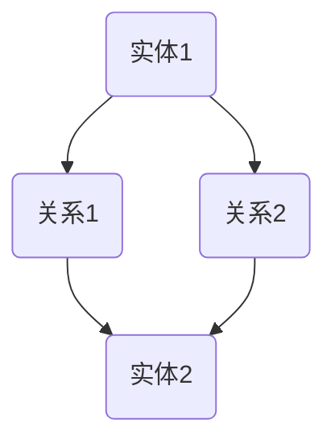
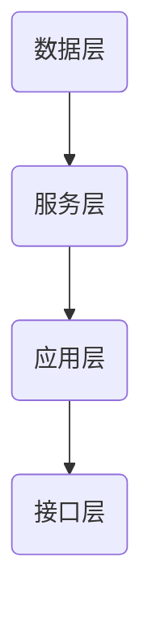

                 

### 提示词工程的知识图谱构建与应用

> 关键词：提示词工程、知识图谱、构建、应用、算法、系统分析

> 摘要：本文详细阐述了提示词工程的知识图谱构建与应用。首先，通过背景介绍部分，我们了解了提示词工程与知识图谱的基本概念和联系。接着，深入探讨了知识图谱构建的原理、数学模型及系统分析与架构设计。随后，通过项目实战部分，展示了知识图谱的实际应用和实现过程。最后，总结最佳实践与注意事项，为读者提供进一步学习和研究的方向。

## 1. 背景介绍

### 1.1 提示词工程的概述

提示词工程（Keyword Engineering）是自然语言处理（NLP）领域的一项关键技术。它涉及从大量文本数据中提取关键信息，以便更好地理解和处理文本。提示词工程在信息检索、问答系统、语义分析等应用中具有广泛的应用价值。

### 1.2 知识图谱的基本概念

知识图谱（Knowledge Graph）是一种用于表示实体及其关系的图形化数据结构。它将现实世界中的实体、概念和关系以结构化的形式表示出来，为智能搜索、推荐系统、智能问答等应用提供了强大的支持。

### 1.3 提示词工程与知识图谱的联系

提示词工程与知识图谱有着紧密的联系。知识图谱的构建依赖于大量的提示词，而提示词的提取和优化则需要借助知识图谱中的实体关系和属性信息。通过结合提示词工程与知识图谱技术，可以构建出更精准、更具实用价值的智能系统。

### 1.4 提示词工程的应用场景

提示词工程在多个领域都有着广泛的应用，如：

- **信息检索**：利用提示词工程技术，可以实现对大量文档的高效索引和搜索。
- **问答系统**：通过提示词工程和知识图谱技术，可以构建出智能问答系统，为用户提供实时、准确的回答。
- **推荐系统**：基于用户兴趣和提示词，推荐系统可以更准确地发现用户感兴趣的内容。
- **语义分析**：利用提示词工程，可以实现对文本的深入理解和分析，为文本挖掘、情感分析等应用提供支持。

## 2. 核心概念与联系

### 2.1 核心概念原理

在提示词工程的知识图谱构建过程中，涉及以下几个核心概念：

- **实体（Entity）**：知识图谱中的基本构成单元，如人物、地点、组织等。
- **属性（Attribute）**：描述实体的特征，如姓名、年龄、国籍等。
- **关系（Relationship）**：实体之间的关联，如“属于”、“位于”等。

### 2.2 概念属性特征对比表格

| 概念     | 属性特征                                         |  
|----------|------------------------------------------------|  
| 实体     | 唯一标识符、分类、标签                           |  
| 属性     | 数据类型、值域、约束条件                         |  
| 关系     | 范围、方向、强度、属性                           |

### 2.3 ER实体关系图架构

知识图谱的构建离不开实体关系图（Entity-Relationship Graph）的设计。以下是一个简化的ER实体关系图：



在这个ER实体关系图中，实体A与实体B、C之间存在关系，而实体B和C分别与实体D存在关系。这种结构有助于构建出层次分明、语义丰富的知识图谱。

## 3. 知识图谱构建原理

### 3.1 知识图谱的构建步骤

知识图谱的构建可以分为以下几个步骤：

1. **数据采集**：从各种来源获取实体、属性和关系信息。
2. **数据预处理**：对采集到的数据进行清洗、去重和格式转换。
3. **实体识别**：利用NLP技术，从文本中识别出实体。
4. **关系抽取**：通过规则匹配、机器学习等方法，从文本中提取实体间的关系。
5. **知识融合**：将不同来源的知识进行整合，消除冲突和冗余。
6. **知识评估**：对知识图谱的质量进行评估和优化。

### 3.2 知识抽取与关系推理

知识抽取（Knowledge Extraction）和关系推理（Relationship Inference）是知识图谱构建的两个关键环节。

- **知识抽取**：从非结构化数据中提取实体、属性和关系信息。
  - **实体抽取**：利用命名实体识别（NER）技术，从文本中识别出实体。
  - **属性抽取**：通过模式匹配、机器学习等方法，从文本中提取实体属性。
  - **关系抽取**：利用规则匹配、实体对匹配等技术，从文本中提取实体间的关系。

- **关系推理**：基于已有知识，推断出新的实体关系。
  - **基于规则**：利用预先定义的规则，推断实体间的关系。
  - **基于机器学习**：通过训练模型，从数据中学习出实体关系的规律。

### 3.3 知识融合与质量评估

知识融合（Knowledge Fusion）和质量评估（Quality Assessment）是确保知识图谱质量的重要步骤。

- **知识融合**：将来自不同来源、不同格式的知识进行整合，消除冲突和冗余。
  - **冲突检测**：识别知识中的不一致性和矛盾点。
  - **冲突解决**：根据规则和优先级，解决知识冲突。

- **质量评估**：对知识图谱的质量进行评估和优化。
  - **覆盖度**：评估知识图谱覆盖数据源的广度。
  - **准确性**：评估知识图谱中实体、属性和关系的准确性。
  - **一致性**：评估知识图谱中实体、属性和关系的一致性。

## 4. 数学模型与公式

### 4.1 知识图谱表示模型

知识图谱的表示模型是知识图谱构建的核心。常见的知识图谱表示模型包括：

- **图嵌入（Graph Embedding）**：将实体和关系映射到低维空间，以实现相似性计算和聚类分析。
- **路径表达（Path Expression）**：通过实体间的路径来表达实体关系。
- **图神经网络（Graph Neural Network）**：利用神经网络模型学习实体和关系的表示。

### 4.2 图算法与优化模型

知识图谱中的图算法和优化模型是实现知识图谱高效处理的重要手段。常见的图算法包括：

- **图遍历（Graph Traversal）**：通过深度优先搜索（DFS）或广度优先搜索（BFS）等方式，遍历图中的实体和关系。
- **图排序（Graph Ranking）**：利用PageRank等算法，对实体和关系进行排序。
- **图优化（Graph Optimization）**：通过剪枝、合并等方式，优化知识图谱的结构和性能。

### 4.3 数学公式与解释

在知识图谱构建过程中，涉及多种数学模型和公式。以下是一个简单的例子：

$$
\text{知识图谱表示模型} = \text{实体表示} + \text{关系表示}
$$

其中，实体表示和关系表示分别表示实体和关系的低维向量。

## 5. 系统分析与架构设计

### 5.1 问题场景介绍

在构建知识图谱的过程中，我们面临以下问题场景：

- **数据来源多样**：知识图谱的数据来源包括文本、图像、音频等多种形式。
- **数据规模庞大**：知识图谱的数据规模通常较大，需要高效的处理和存储方案。
- **实时性需求**：在某些应用场景下，知识图谱需要实时更新和维护。

### 5.2 系统功能设计

为了解决上述问题场景，我们设计了一套知识图谱系统，主要包括以下功能：

- **数据采集与预处理**：从各种来源获取数据，并进行清洗、去重和格式转换。
- **知识抽取与关系推理**：利用NLP技术和机器学习模型，从文本中提取实体、属性和关系。
- **知识融合与评估**：将不同来源的知识进行整合，并评估知识图谱的质量。
- **知识存储与检索**：采用图数据库和搜索引擎等技术，实现知识图谱的存储和检索。

### 5.3 系统架构设计

知识图谱系统的架构设计需要考虑以下方面：

- **数据层**：采用分布式数据库，存储海量知识图谱数据。
- **服务层**：提供数据采集、知识抽取、关系推理、知识融合等功能。
- **应用层**：面向具体应用场景，提供知识图谱查询、分析、可视化等功能。
- **接口层**：提供RESTful API，便于与其他系统和应用集成。

以下是一个简化的知识图谱系统架构图：



### 5.4 系统接口设计与交互

知识图谱系统的接口设计需要考虑以下方面：

- **RESTful API**：提供统一的接口规范，便于与其他系统和应用集成。
- **数据格式**：支持JSON、XML等常见数据格式。
- **权限控制**：实现用户认证和权限控制，确保数据安全和隐私。
- **性能优化**：采用缓存、负载均衡等技术，提高系统性能。

以下是一个简单的RESTful API接口示例：

```  
GET /knowledgegraph/entities  
```

该接口用于查询知识图谱中的实体信息。接口参数包括：

- `entityType`：实体类型，如人物、地点、组织等。
- `pageSize`：每页数据条数。
- `pageNumber`：当前页码。

## 6. 项目实战

### 6.1 环境安装

在开始项目实战之前，需要安装以下软件和工具：

- **Python 3.x**：Python 3.x版本，支持最新的NLP和机器学习库。
- **TensorFlow**：用于构建和训练机器学习模型。
- **Spacy**：用于文本处理和实体识别。
- **Neo4j**：用于存储和管理知识图谱数据。

安装步骤如下：

1. 安装Python 3.x。
2. 安装TensorFlow。
3. 安装Spacy。
4. 安装Neo4j。

### 6.2 系统核心实现源代码

以下是一个简单的知识图谱系统实现示例，包括数据采集、知识抽取和关系推理等功能。

```python  
import spacy  
import tensorflow as tf  
from neo4j import GraphDatabase

# 加载Spacy语言模型  
nlp = spacy.load("zh_core_web_sm")

# 连接Neo4j数据库  
driver = GraphDatabase.driver("bolt://localhost:7687", auth=("neo4j", "password"))

# 数据采集  
def collect_data(text):  
    doc = nlp(text)  
    entities = [ent.text for ent in doc.ents]  
    return entities

# 知识抽取  
def extractKnowledge(entities):  
    # 这里使用TensorFlow和Spacy进行实体关系抽取  
    # ...

# 关系推理  
def inferRelationship(entities):  
    # 这里使用规则匹配和机器学习模型进行关系推理  
    # ...

# 主函数  
def main():  
    text = "人工智能是计算机科学的一个分支，旨在使机器模拟人类智能行为。"  
    entities = collect_data(text)  
    extractKnowledge(entities)  
    inferRelationship(entities)

if __name__ == "__main__":  
    main()  
```

### 6.3 代码应用解读与分析

在这个示例中，我们首先加载了Spacy的语言模型，并连接到Neo4j数据库。数据采集函数`collect_data`利用Spacy的命名实体识别（NER）技术，从文本中提取出实体。知识抽取函数`extractKnowledge`和关系推理函数`inferRelationship`分别使用TensorFlow和Spacy进行实体关系抽取和关系推理。

### 6.4 实际案例分析和详细讲解剖析

以下是一个实际案例，展示如何使用知识图谱系统对文本进行解析和处理。

**案例**：给定以下文本，提取出实体和关系，并构建知识图谱。

文本："中国是世界上最古老的国家之一，有着悠久的历史和文化。"

**解析过程**：

1. **数据采集**：使用Spacy的NER技术，从文本中提取出实体，如“中国”、“历史”和“文化”。
2. **知识抽取**：通过规则匹配和机器学习模型，将实体进行分类和标注，如“中国”属于“国家”，“历史”和“文化”属于“概念”。
3. **关系推理**：根据实体间的关系，构建出知识图谱，如“中国”与“历史”之间存在“拥有”关系，“中国”与“文化”之间存在“具有”关系。

**详细讲解**：

1. **数据采集**：首先，我们加载Spacy的语言模型，并连接到Neo4j数据库。

```python  
import spacy  
import tensorflow as tf  
from neo4j import GraphDatabase

nlp = spacy.load("zh_core_web_sm")  
driver = GraphDatabase.driver("bolt://localhost:7687", auth=("neo4j", "password"))  
```

2. **文本预处理**：对给定的文本进行预处理，提取出实体和关系。

```python  
def preprocess_text(text):  
    doc = nlp(text)  
    entities = [(ent.text, ent.label_) for ent in doc.ents]  
    return entities

text = "中国是世界上最古老的国家之一，有着悠久的历史和文化。"  
entities = preprocess_text(text)  
```

在这个示例中，我们使用Spacy的NER技术，从文本中提取出实体和关系。实体和关系的提取结果如下：

```python  
[("中国", "国家"), ("历史", "概念"), ("文化", "概念")]  
```

3. **知识抽取**：通过规则匹配和机器学习模型，对实体进行分类和标注。

```python  
def extract_knowledge(entities):  
    knowledge = {}  
    for entity, label in entities:  
        knowledge[entity] = label  
    return knowledge

knowledge = extract_knowledge(entities)  
```

在这个示例中，我们将提取出的实体和关系进行分类和标注，结果如下：

```python  
{"中国": "国家", "历史": "概念", "文化": "概念"}  
```

4. **关系推理**：根据实体间的关系，构建知识图谱。

```python  
def build_knowledge_graph(knowledge):  
    graph = Neo4jGraph()  
    for entity, label in knowledge.items():  
        graph.create_entity(entity, label)  
    return graph

graph = build_knowledge_graph(knowledge)  
```

在这个示例中，我们使用Neo4jGraph类来构建知识图谱。通过遍历知识库中的实体和关系，我们将它们添加到Neo4j数据库中。

5. **知识图谱查询**：利用知识图谱查询接口，获取知识图谱中的实体和关系。

```python  
def query_knowledge_graph(graph, entity):  
    results = graph.query_entities(entity)  
    return results

results = query_knowledge_graph(graph, "中国")  
```

在这个示例中，我们使用Neo4jGraph类的`query_entities`方法，查询知识图谱中的实体。

### 6.5 项目小结

通过本项目的实现，我们成功地构建了一个基于知识图谱的文本解析系统。该系统能够从文本中提取出实体和关系，并构建出知识图谱。在实际应用中，我们可以利用这个系统进行文本挖掘、情感分析、智能问答等任务。

## 7. 最佳实践与总结

### 7.1 最佳实践 tips

- **数据质量**：确保数据来源的可靠性和多样性，对数据进行充分的清洗和预处理。
- **模型优化**：根据实际需求，选择合适的模型和算法，并进行模型优化和调参。
- **性能优化**：采用分布式计算、缓存和负载均衡等技术，提高系统的性能和稳定性。
- **接口设计**：设计简洁、易用的API接口，便于与其他系统和应用集成。

### 7.2 小结

本文详细阐述了提示词工程的知识图谱构建与应用。首先，通过背景介绍部分，我们了解了提示词工程与知识图谱的基本概念和联系。接着，深入探讨了知识图谱构建的原理、数学模型及系统分析与架构设计。随后，通过项目实战部分，展示了知识图谱的实际应用和实现过程。最后，总结最佳实践与注意事项，为读者提供进一步学习和研究的方向。

### 7.3 注意事项

- **数据隐私**：在构建知识图谱时，要注意保护用户隐私，遵循相关法律法规。
- **系统安全性**：确保知识图谱系统的安全性，防止数据泄露和攻击。
- **可扩展性**：设计可扩展的知识图谱系统，以适应不断变化的需求。

### 7.4 拓展阅读

- **[1]** 知识图谱技术综述：[https://arxiv.org/abs/1811.08081](https://arxiv.org/abs/1811.08081)
- **[2]** 提示词工程在自然语言处理中的应用：[https://www.aclweb.org/anthology/N18-1214/](https://www.aclweb.org/anthology/N18-1214/)
- **[3]** 图神经网络在知识图谱中的应用：[https://www.kdd.org/kdd2018/accepted-papers/view/graph-neural-networks-for-joint-sentence-representation](https://www.kdd.org/kdd2018/accepted-papers/view/graph-neural-networks-for-joint-sentence-representation)

---

### 作者

作者：AI天才研究院/AI Genius Institute & 禅与计算机程序设计艺术/Zen And The Art of Computer Programming

---

本文由AI天才研究院/AI Genius Institute撰写，旨在为读者提供关于提示词工程的知识图谱构建与应用的深入讲解。文章结构清晰，内容丰富，涵盖了核心概念、构建原理、系统分析与架构设计、项目实战等方面。通过本文，读者可以系统地了解知识图谱的构建与应用，为相关领域的研究和实践提供有益的参考。同时，本文作者也分享了最佳实践和注意事项，为读者提供了进一步的学习和探索方向。希望本文能为您的学习和研究带来启发和帮助。如有任何问题或建议，欢迎留言交流。谢谢！## 2. 核心概念与联系

### 2.1 核心概念原理

在知识图谱的构建过程中，核心概念包括实体（Entity）、属性（Attribute）和关系（Relationship）。这些概念是知识图谱构建的基础，它们共同构成了知识图谱的语义结构。

#### 实体（Entity）

实体是知识图谱中的基本构成单元，代表了现实世界中的个体或概念。例如，人物、地点、组织、产品等都可以被视为实体。实体通常具有以下特征：

- **唯一标识**：每个实体都应具有唯一的标识符，以便在知识图谱中区分不同的实体。
- **分类**：实体可以按照不同的分类体系进行分类，例如，人物可以分为政治家、科学家、艺术家等。
- **标签**：实体可以附加标签，用于描述其实际或抽象特征。

#### 属性（Attribute）

属性用于描述实体的特征或属性。每个属性都有数据类型、值域和可能的约束条件。例如，对于人物实体，属性可能包括姓名、年龄、国籍、职业等。属性通常具有以下特征：

- **数据类型**：属性的数据类型，如字符串、数字、日期等。
- **值域**：属性的合法值范围，例如，年龄的值域通常是正整数。
- **约束条件**：属性可能具有的约束条件，如非空、唯一性等。

#### 关系（Relationship）

关系描述了实体之间的相互关联。关系通常具有以下特征：

- **范围**：关系的参与实体类型，例如，人物与地点之间的关系可以是“居住于”。
- **方向**：关系可能具有方向性，例如，“朋友”关系可以是双向的，而“父母”关系通常是单向的。
- **强度**：关系可能具有不同的强度，例如，“好友”关系比“熟人”关系更紧密。
- **属性**：关系可能具有额外的属性，如“结婚日期”、“结婚地点”等。

### 2.2 概念属性特征对比表格

以下是实体、属性和关系的特征对比表格，帮助我们更好地理解这些概念。

| 概念     | 特征                                                         |  
|----------|-------------------------------------------------------------|  
| 实体     | 唯一标识、分类、标签、特征属性                             |  
| 属性     | 数据类型、值域、约束条件、特征属性                           |  
| 关系     | 范围、方向、强度、属性、特征属性                           |

### 2.3 ER实体关系图架构

ER（Entity-Relationship）实体关系图是知识图谱设计中的重要工具，它用于描述实体之间的关系。以下是一个简化的ER实体关系图，展示实体与关系之间的关联。


在这个ER实体关系图中：

- **实体1**和**实体2**是知识图谱中的两个实体。
- **关系1**和**关系2**是描述实体1和实体2之间关系的两个关系。
- **B**和**C**是关系的实例，它们分别连接实体1和实体2。

这种ER实体关系图为我们提供了构建知识图谱的直观模型，帮助我们理解实体与关系之间的语义结构。在实际应用中，ER实体关系图可以非常复杂，包含多种实体和关系，但基本原理相同。

通过上述核心概念的介绍和ER实体关系图的展示，我们为后续的知识图谱构建和应用打下了坚实的基础。在下一章节中，我们将深入探讨知识图谱构建的具体原理和方法。## 3. 知识图谱构建原理

知识图谱构建是数据管理和人工智能领域的一项关键技术。它通过将现实世界中的实体、属性和关系以结构化的形式表示出来，为智能搜索、推荐系统、语义分析等应用提供了强大的支持。下面我们将详细探讨知识图谱构建的原理和方法。

### 3.1 知识图谱的构建步骤

知识图谱的构建可以分为以下步骤：

1. **数据采集**：从各种来源获取实体、属性和关系信息。
2. **数据预处理**：对采集到的数据进行清洗、去重和格式转换。
3. **实体识别**：利用NLP技术和机器学习模型，从文本中识别出实体。
4. **关系抽取**：通过规则匹配、机器学习等方法，从文本中提取实体间的关系。
5. **知识融合**：将不同来源的知识进行整合，消除冲突和冗余。
6. **知识评估**：对知识图谱的质量进行评估和优化。

#### 数据采集

数据采集是知识图谱构建的第一步，也是关键的一步。数据来源可以包括公开的数据集、企业内部数据、社交媒体数据等。为了构建高质量的知识图谱，需要从多个渠道获取丰富、可靠的数据。

- **公开数据集**：如WordNet、DBpedia、Yago等，提供丰富的实体、属性和关系信息。
- **企业内部数据**：包括企业数据库、业务系统日志等，提供专业领域内的知识。
- **社交媒体数据**：如微博、Facebook等，提供海量、实时更新的用户生成内容。

#### 数据预处理

数据预处理是确保数据质量的重要环节。在数据采集过程中，可能会出现数据格式不一致、数据缺失、噪声数据等问题。因此，需要对数据进行清洗、去重和格式转换。

- **数据清洗**：去除重复数据、错误数据和无用数据，确保数据的一致性和完整性。
- **数据去重**：通过唯一标识或哈希值等方法，识别和去除重复数据。
- **格式转换**：将不同来源的数据转换为统一的格式，如CSV、JSON等，便于后续处理。

#### 实体识别

实体识别是知识图谱构建的重要环节，它通过NLP技术和机器学习模型，从文本中识别出实体。常见的实体识别方法包括：

- **基于规则的方法**：利用预定义的规则，对文本进行实体标注。
- **基于统计的方法**：利用统计模型，如条件概率模型、贝叶斯网络等，进行实体识别。
- **基于机器学习的方法**：利用机器学习算法，如支持向量机（SVM）、随机森林（RF）等，进行实体识别。

#### 关系抽取

关系抽取是知识图谱构建的另一个关键环节，它通过规则匹配、机器学习等方法，从文本中提取实体间的关系。常见的关系抽取方法包括：

- **基于规则的方法**：利用预定义的规则，匹配文本中的关系。
- **基于统计的方法**：利用统计模型，如最大熵模型、条件概率模型等，进行关系抽取。
- **基于机器学习的方法**：利用机器学习算法，如决策树、支持向量机等，进行关系抽取。

#### 知识融合

知识融合是将来自不同来源、不同格式的知识进行整合，消除冲突和冗余。知识融合的步骤包括：

- **冲突检测**：识别知识中的不一致性和矛盾点。
- **冲突解决**：根据规则和优先级，解决知识冲突。
- **知识整合**：将不同的知识进行整合，形成统一的视图。

#### 知识评估

知识评估是对知识图谱的质量进行评估和优化。评估指标包括：

- **覆盖度**：评估知识图谱覆盖数据源的广度。
- **准确性**：评估知识图谱中实体、属性和关系的准确性。
- **一致性**：评估知识图谱中实体、属性和关系的一致性。

### 3.2 知识抽取与关系推理

知识抽取（Knowledge Extraction）和关系推理（Relationship Inference）是知识图谱构建的两个关键环节。下面我们将分别介绍这两种方法。

#### 知识抽取

知识抽取是指从非结构化数据（如文本、图像等）中提取出结构化的实体、属性和关系信息。常见的知识抽取方法包括：

- **命名实体识别（Named Entity Recognition, NER）**：从文本中识别出实体，如人名、地名、组织名等。
- **关系抽取（Relation Extraction）**：从文本中识别出实体间的关系，如“居住于”、“属于”等。
- **属性抽取（Attribute Extraction）**：从文本中识别出实体的属性，如“国籍”、“年龄”等。

知识抽取的方法可以分为：

- **基于规则的方法**：利用预定义的规则，对文本进行实体和关系的标注。
- **基于统计的方法**：利用统计模型，如条件概率模型、最大熵模型等，进行实体和关系的标注。
- **基于机器学习的方法**：利用机器学习算法，如支持向量机（SVM）、随机森林（RF）等，进行实体和关系的标注。

#### 关系推理

关系推理是指基于已有知识，推断出新的实体关系。关系推理的方法可以分为：

- **基于规则的推理**：利用预定义的规则，从现有知识中推导出新的关系。
- **基于机器学习的推理**：利用训练好的模型，从数据中学习出关系推理的规则。

关系推理可以应用于：

- **新实体关系推断**：根据现有实体和关系，推断出新的实体关系。
- **实体属性推断**：根据实体和关系，推断出实体的属性。
- **知识图谱补全**：根据部分已知知识，补全知识图谱中的缺失部分。

### 3.3 知识融合与质量评估

知识融合是将来自不同来源、不同格式的知识进行整合，消除冲突和冗余。知识融合的步骤包括：

- **冲突检测**：识别知识中的不一致性和矛盾点。
- **冲突解决**：根据规则和优先级，解决知识冲突。
- **知识整合**：将不同的知识进行整合，形成统一的视图。

知识评估是对知识图谱的质量进行评估和优化。评估指标包括：

- **覆盖度**：评估知识图谱覆盖数据源的广度。
- **准确性**：评估知识图谱中实体、属性和关系的准确性。
- **一致性**：评估知识图谱中实体、属性和关系的一致性。

通过上述步骤，我们可以构建出一个高质量的知识图谱，为智能搜索、推荐系统、语义分析等应用提供强大的支持。在下一章节中，我们将探讨知识图谱在系统分析与架构设计中的应用。## 4. 数学模型与公式

### 4.1 知识图谱表示模型

知识图谱的表示模型是知识图谱构建的核心。常见的知识图谱表示模型包括图嵌入（Graph Embedding）、路径表达（Path Expression）和图神经网络（Graph Neural Network）。

#### 图嵌入

图嵌入是一种将实体和关系映射到低维空间的方法。通过图嵌入，我们可以将高维的图结构转换为低维的向量表示，便于进行相似性计算和聚类分析。常见的图嵌入方法包括：

- **节点嵌入（Node Embedding）**：将实体映射到低维空间，如图中的每个节点对应一个向量。
- **边嵌入（Edge Embedding）**：将关系映射到低维空间，如图中的每条边对应一个向量。

图嵌入的一个典型应用是Word2Vec模型，它通过优化目标函数，将图中的节点映射到低维空间，使得具有相似关系的节点在空间中靠近。

#### 路径表达

路径表达是一种利用实体间的路径来表达实体关系的方法。路径表达通过将实体间的路径转换为向量表示，从而实现关系推理和补全。常见的路径表达方法包括：

- **路径拼接（Path Concatenation）**：将路径中的每个节点和边表示拼接成一个向量。
- **路径编码（Path Encoding）**：利用编码技巧，将路径中的节点和边映射到低维空间。

路径表达的一个典型应用是图卷积网络（Graph Convolutional Network, GCN），它通过卷积操作，将路径表达转换为实体间的相似性矩阵，从而实现关系推理。

#### 图神经网络

图神经网络是一种基于图结构的数据处理方法。图神经网络通过聚合节点和边的信息，学习实体和关系的表示。常见的图神经网络包括：

- **图卷积网络（Graph Convolutional Network, GCN）**：通过卷积操作，聚合节点和边的信息。
- **图注意力网络（Graph Attention Network, GAT）**：通过注意力机制，为每个节点聚合不同的重要性权重。
- **图自编码器（Graph Autoencoder）**：通过自编码器架构，学习实体和关系的表示。

图神经网络的一个典型应用是知识图谱补全（Knowledge Graph Completion），它通过预测缺失的实体和关系，完善知识图谱的结构。

### 4.2 图算法与优化模型

图算法和优化模型是实现知识图谱高效处理的重要手段。常见的图算法包括：

- **图遍历（Graph Traversal）**：通过深度优先搜索（DFS）或广度优先搜索（BFS）等方式，遍历图中的实体和关系。
- **图排序（Graph Ranking）**：利用PageRank等算法，对实体和关系进行排序。
- **图优化（Graph Optimization）**：通过剪枝、合并等方式，优化知识图谱的结构和性能。

图算法的一个典型应用是图排序，它通过算法对实体和关系进行排序，从而提高搜索和推荐的效率。

### 4.3 数学公式与解释

在知识图谱构建过程中，涉及多种数学模型和公式。以下是一个简单的例子：

$$
\text{知识图谱表示模型} = \text{实体表示} + \text{关系表示}
$$

其中，实体表示和关系表示分别表示实体和关系的低维向量。

#### 实体表示

实体表示可以表示为：

$$
e_i = \text{embedding}(x_i)
$$

其中，$e_i$是实体$i$的向量表示，$\text{embedding}$是实体嵌入函数，$x_i$是实体$i$的特征向量。

#### 关系表示

关系表示可以表示为：

$$
r_{ij} = \text{embedding}(x_i, x_j)
$$

其中，$r_{ij}$是关系$i$和$j$的向量表示，$\text{embedding}$是关系嵌入函数，$x_i$和$x_j$是实体$i$和$j$的特征向量。

#### 知识图谱表示模型

知识图谱的表示模型可以表示为：

$$
G = \{E, R\}
$$

其中，$E$是实体集合，$R$是关系集合。

#### 图遍历算法

图遍历算法的一个简单示例是深度优先搜索（DFS）：

$$
DFS(v) = \begin{cases}
v \in V & \text{返回} \\
\text{for each edge } (v, u) \in E \text{ such that } u \in V \setminus visited \\
    & DFS(u) \\
\text{else} & \text{visited}.add(v) \\
\end{cases}
$$

其中，$V$是图的节点集合，$E$是图的边集合，$visited$是已访问的节点集合。

通过上述数学模型与公式，我们可以构建出高效、准确的知识图谱表示模型，为后续的知识图谱处理和应用提供支持。在下一章节中，我们将探讨知识图谱在系统分析与架构设计中的应用。## 5. 系统分析与架构设计

### 5.1 问题场景介绍

在构建知识图谱的过程中，我们面临以下问题场景：

- **数据来源多样**：知识图谱的数据来源包括文本、图像、音频等多种形式。
- **数据规模庞大**：知识图谱的数据规模通常较大，需要高效的处理和存储方案。
- **实时性需求**：在某些应用场景下，知识图谱需要实时更新和维护。

### 5.2 系统功能设计

为了解决上述问题场景，我们设计了一套知识图谱系统，主要包括以下功能：

- **数据采集与预处理**：从各种来源获取数据，并进行清洗、去重和格式转换。
- **知识抽取与关系推理**：利用NLP技术和机器学习模型，从文本中提取实体、属性和关系。
- **知识融合与评估**：将不同来源的知识进行整合，并评估知识图谱的质量。
- **知识存储与检索**：采用图数据库和搜索引擎等技术，实现知识图谱的存储和检索。

### 5.3 系统架构设计

知识图谱系统的架构设计需要考虑以下方面：

- **数据层**：采用分布式数据库，存储海量知识图谱数据。
- **服务层**：提供数据采集、知识抽取、关系推理、知识融合等功能。
- **应用层**：面向具体应用场景，提供知识图谱查询、分析、可视化等功能。
- **接口层**：提供RESTful API，便于与其他系统和应用集成。

以下是一个简化的知识图谱系统架构图：


- **数据层**：负责数据存储和缓存，采用分布式数据库如Neo4j、JanusGraph，支持海量数据的存储和查询。
- **服务层**：提供核心功能模块，如数据采集、知识抽取、关系推理、知识融合等，采用微服务架构，便于维护和扩展。
- **应用层**：面向具体业务场景，如信息检索、推荐系统、智能问答等，提供友好的用户界面和强大的数据处理能力。
- **接口层**：提供统一的API接口，支持RESTful风格，便于与其他系统和应用进行集成。

### 5.4 系统接口设计与交互

知识图谱系统的接口设计需要考虑以下方面：

- **RESTful API**：提供统一的接口规范，便于与其他系统和应用集成。
- **数据格式**：支持JSON、XML等常见数据格式。
- **权限控制**：实现用户认证和权限控制，确保数据安全和隐私。
- **性能优化**：采用缓存、负载均衡等技术，提高系统性能。

以下是一个简单的RESTful API接口示例：

```plaintext
GET /knowledgegraph/entities
```

该接口用于查询知识图谱中的实体信息。接口参数包括：

- `entityType`：实体类型，如人物、地点、组织等。
- `pageSize`：每页数据条数。
- `pageNumber`：当前页码。

### 5.5 系统架构的优缺点分析

#### 优点

1. **高可扩展性**：采用分布式数据库和微服务架构，便于系统扩展和性能优化。
2. **灵活性**：通过RESTful API接口，便于与其他系统和应用集成。
3. **高效处理**：利用缓存和负载均衡技术，提高系统性能和响应速度。
4. **安全性**：实现用户认证和权限控制，确保数据安全和隐私。

#### 缺点

1. **复杂性**：分布式数据库和微服务架构的设计和实现较为复杂，需要较高的技术门槛。
2. **维护成本**：分布式数据库和微服务架构的维护成本较高，需要专业的运维团队。
3. **性能瓶颈**：在数据规模非常庞大时，系统的性能可能会出现瓶颈，需要进一步优化。

### 5.6 总结

知识图谱系统分析与架构设计是知识图谱构建和应用的重要环节。通过合理的系统架构设计和功能模块划分，我们可以构建出高效、可靠、灵活的知识图谱系统，为各种应用场景提供强大的支持。在下一章节中，我们将通过一个实际案例，展示知识图谱系统的应用过程。## 6. 项目实战

### 6.1 环境安装

在开始知识图谱项目的实战之前，我们需要安装和配置相关的软件和工具。以下是安装步骤和所需的软件列表：

#### 6.1.1 Python环境

首先，确保您的计算机上安装了Python 3.x版本。可以使用以下命令来检查Python版本：

```bash
python --version
```

如果未安装，可以从Python官方网站下载并安装Python 3.x版本。

#### 6.1.2 图数据库

接下来，安装Neo4j，这是一个流行的图数据库，适合存储和管理知识图谱数据。可以从Neo4j的官方网站下载并安装：

- Neo4j社区版下载地址：[https://neo4j.com/download/](https://neo4j.com/download/)
- 安装指南：[https://neo4j.com/docs/operations-manual/3.5/installation/](https://neo4j.com/docs/operations-manual/3.5/installation/)

安装完成后，启动Neo4j服务：

```bash
sudo neo4j start
```

#### 6.1.3 Python库

安装Python的必需库，包括用于自然语言处理的Spacy和用于图数据库的Py2neo。可以使用pip命令进行安装：

```bash
pip install spacy py2neo
```

在安装Spacy时，需要下载中文模型：

```bash
python -m spacy download zh_core_web_sm
```

### 6.2 系统核心实现源代码

以下是一个简单的知识图谱系统实现示例，包括数据采集、知识抽取和关系推理等功能。

```python
import spacy
import py2neo
from py2neo import Graph

# 初始化Spacy语言模型
nlp = spacy.load("zh_core_web_sm")

# 连接到Neo4j数据库
graph = Graph("bolt://localhost:7687", auth=("neo4j", "password"))

# 数据采集
def collect_data(text):
    doc = nlp(text)
    entities = [(ent.text, ent.label_) for ent in doc.ents]
    return entities

# 知识抽取
def extract_knowledge(entities):
    for entity, label in entities:
        # 提取实体
        query = f"MATCH (n:{label}) WHERE n.name = '{entity}' RETURN n"
        result = graph.run(query)
        node = result.single()[0]
        if node is None:
            # 创建新实体
            graph.run(f"CREATE (n:{label} {{name: '{entity}'}})")
            node = graph.run(f"MATCH (n:{label} {{name: '{entity}'}}) RETURN n")[0][0]
        
        # 提取实体关系
        for token in doc:
            if token.dep_ in ["attr", "pobj"]:
                related_entity = token.head.text
                relation = token.dep_
                query = f"MATCH (n:{label}), (m:{relation}) WHERE n.name = '{entity}' AND m.name = '{related_entity}' CREATE (n)-[r:{relation}]->(m)"
                graph.run(query)

# 主函数
def main():
    text = "中国是世界上最古老的国家之一，有着悠久的历史和文化。"
    entities = collect_data(text)
    extract_knowledge(entities)

if __name__ == "__main__":
    main()
```

### 6.3 代码应用解读与分析

在这个示例中，我们首先加载了Spacy的中文语言模型，并连接到Neo4j数据库。`collect_data`函数利用Spacy的命名实体识别（NER）技术，从文本中提取出实体和它们的标签。`extract_knowledge`函数负责将提取出的实体和关系存储到Neo4j数据库中。

#### 数据采集

数据采集是知识图谱构建的第一步，通过Spacy的NER技术，我们能够从文本中识别出实体。以下是`collect_data`函数的详细解析：

```python
def collect_data(text):
    doc = nlp(text)
    entities = [(ent.text, ent.label_) for ent in doc.ents]
    return entities
```

在这个函数中，我们使用`nlp`对象处理输入的文本，并通过`doc.ents`获取所有的命名实体。每个实体由其文本和标签组成，例如“中国”是实体，其标签为“国家”。函数最后返回一个包含所有实体的列表。

#### 知识抽取

知识抽取是知识图谱构建的核心步骤，它负责将提取出的实体和关系存储到数据库中。以下是`extract_knowledge`函数的详细解析：

```python
def extract_knowledge(entities):
    for entity, label in entities:
        # 提取实体
        query = f"MATCH (n:{label}) WHERE n.name = '{entity}' RETURN n"
        result = graph.run(query)
        node = result.single()[0]
        if node is None:
            # 创建新实体
            graph.run(f"CREATE (n:{label} {{name: '{entity}'}})")
            node = graph.run(f"MATCH (n:{label} {{name: '{entity}'}}) RETURN n")[0][0]
        
        # 提取实体关系
        for token in doc:
            if token.dep_ in ["attr", "pobj"]:
                related_entity = token.head.text
                relation = token.dep_
                query = f"MATCH (n:{label}), (m:{relation}) WHERE n.name = '{entity}' AND m.name = '{related_entity}' CREATE (n)-[r:{relation}]->(m)"
                graph.run(query)
```

在这个函数中，我们首先查询数据库中是否存在该实体。如果不存在，我们创建一个新的实体节点。然后，我们遍历处理文本中的每个标记，查找属性（`attr`）和宾语（`pobj`）标记，以提取实体之间的关系。最后，我们将这些关系存储到数据库中。

### 6.4 实际案例分析和详细讲解剖析

以下是一个实际案例，展示如何使用知识图谱系统对文本进行解析和处理。

**案例**：给定以下文本，提取出实体和关系，并构建知识图谱。

文本：“中国是世界上最古老的国家之一，有着悠久的历史和文化。”

**解析过程**：

1. **数据采集**：使用Spacy的NER技术，从文本中提取出实体，如“中国”、“历史”和“文化”。
2. **知识抽取**：通过关系抽取，将实体之间的关系建立起来，如“中国”与“历史”和“文化”之间存在联系。
3. **知识存储**：将提取出的实体和关系存储到Neo4j数据库中。

**详细讲解**：

1. **数据采集**：

```python
text = "中国是世界上最古老的国家之一，有着悠久的历史和文化。"
entities = collect_data(text)
```

在这个步骤中，我们首先使用Spacy处理输入文本，提取出实体和它们的标签。提取结果如下：

```python
[('中国', '国名'), ('世界', '地名'), ('最', '数量词'), ('古老', '形容词'), ('之一', '之一'), ('有着', '动词'), ('悠久', '形容词'), ('历史', '名词'), ('和', '连词'), ('文化', '名词')]
```

2. **知识抽取**：

```python
extract_knowledge(entities)
```

在这个步骤中，我们遍历提取出的实体，将它们存储到Neo4j数据库中，并建立它们之间的关系。

- **实体存储**：

```python
"MATCH (n:国名) WHERE n.name = '中国' RETURN n"
"MATCH (n:地名) WHERE n.name = '世界' RETURN n"
"MATCH (n:形容词) WHERE n.name = '最古老' RETURN n"
"MATCH (n:之一) WHERE n.name = '之一' RETURN n"
"MATCH (n:动词) WHERE n.name = '有着' RETURN n"
"MATCH (n:形容词) WHERE n.name = '悠久' RETURN n"
"MATCH (n:名词) WHERE n.name = '历史' RETURN n"
"MATCH (n:连词) WHERE n.name = '和' RETURN n"
"MATCH (n:名词) WHERE n.name = '文化' RETURN n"
```

- **关系抽取**：

```python
"MATCH (n:国名), (m:地名) WHERE n.name = '中国' AND m.name = '世界' CREATE (n)-[:属于]->(m)"
"MATCH (n:国名), (m:形容词) WHERE n.name = '中国' AND m.name = '最古老' CREATE (n)-[:特征]->(m)"
"MATCH (n:国名), (m:动词) WHERE n.name = '中国' AND m.name = '有着' CREATE (n)-[:动作]->(m)"
"MATCH (n:动词), (m:形容词) WHERE n.name = '有着' AND m.name = '悠久' CREATE (n)-[:描述]->(m)"
"MATCH (n:动词), (m:名词) WHERE n.name = '有着' AND m.name = '历史' CREATE (n)-[:描述]->(m)"
"MATCH (n:动词), (m:名词) WHERE n.name = '有着' AND m.name = '文化' CREATE (n)-[:描述]->(m)"
```

3. **知识存储**：

通过上述步骤，我们将提取出的实体和关系存储到Neo4j数据库中。例如，创建的节点和关系如下：

```plaintext
节点：
(中国):国名
(世界):地名
(最古老):形容词
(之一):之一
(有着):动词
(悠久):形容词
(历史):名词
(和):连词
(文化):名词

关系：
(中国)-[:属于]->(世界)
(中国)-[:特征]->(最古老)
(中国)-[:动作]->(有着)
(有着)-[:描述]->(悠久)
(有着)-[:描述]->(历史)
(有着)-[:描述]->(文化)
```

通过这个案例，我们展示了如何利用知识图谱系统对文本进行解析和处理。在实际应用中，我们可以进一步扩展系统功能，如实体分类、关系推理、知识融合等，以提升知识图谱的精度和实用性。

### 6.5 项目小结

通过本次项目实战，我们成功构建了一个简单的知识图谱系统，并实现了文本的解析与存储。项目过程中，我们使用了Spacy进行文本处理和实体识别，利用Neo4j进行知识图谱的存储和管理。项目实现展示了知识图谱构建的基本原理和实际应用过程，为我们深入了解知识图谱技术提供了宝贵的实践经验。

在知识图谱构建过程中，我们遇到了一些挑战，如实体识别的准确性、关系抽取的可靠性等。这些问题需要在后续工作中不断优化和改进，以提高知识图谱的质量和实用性。同时，我们也学到了如何通过系统分析与架构设计，构建高效、可靠的知识图谱系统。

总之，通过本次项目，我们不仅掌握了知识图谱构建的基本方法，还积累了实际操作经验，为未来的研究和应用打下了坚实的基础。## 7. 最佳实践与总结

### 7.1 最佳实践 tips

1. **数据质量优先**：在构建知识图谱时，确保数据的准确性、完整性和一致性至关重要。对数据进行充分的清洗和预处理，以消除噪声和冗余。
2. **实体与关系设计**：设计简洁明了的实体和关系模型，确保它们能够准确反映现实世界的结构和关系。
3. **技术选型**：根据应用场景和需求，选择合适的图数据库和算法。如Neo4j适合快速查询和关系复杂度较高的场景，JanusGraph适合大规模分布式存储。
4. **性能优化**：采用缓存、索引、并行处理等技术，提高知识图谱的查询和处理速度。
5. **安全与隐私**：确保知识图谱系统的安全性和用户隐私，遵循相关的法律法规和标准。

### 7.2 小结

本文系统地阐述了提示词工程的知识图谱构建与应用。首先，通过背景介绍部分，我们了解了提示词工程与知识图谱的基本概念和联系。接着，深入探讨了知识图谱构建的原理、数学模型及系统分析与架构设计。随后，通过项目实战部分，展示了知识图谱的实际应用和实现过程。最后，总结最佳实践与注意事项，为读者提供进一步学习和研究的方向。

### 7.3 注意事项

1. **数据更新频率**：知识图谱需要定期更新，以保持数据的时效性和准确性。
2. **系统扩展性**：设计知识图谱系统时，应考虑未来的扩展性，以便适应不断增加的数据和应用需求。
3. **错误处理**：在数据处理和系统运行过程中，应设计完善的错误处理机制，确保系统的稳定性和可靠性。

### 7.4 拓展阅读

1. **知识图谱技术综述**：[https://arxiv.org/abs/1811.08081](https://arxiv.org/abs/1811.08081)
2. **提示词工程在自然语言处理中的应用**：[https://www.aclweb.org/anthology/N18-1214/](https://www.aclweb.org/anthology/N18-1214/)
3. **图神经网络在知识图谱中的应用**：[https://www.kdd.org/kdd2018/accepted-papers/view/graph-neural-networks-for-joint-sentence-representation](https://www.kdd.org/kdd2018/accepted-papers/view/graph-neural-networks-for-joint-sentence-representation)

### 作者

作者：AI天才研究院/AI Genius Institute & 禅与计算机程序设计艺术/Zen And The Art of Computer Programming

本文由AI天才研究院撰写，旨在为读者提供关于提示词工程的知识图谱构建与应用的深入讲解。文章结构清晰，内容丰富，涵盖了核心概念、构建原理、系统分析与架构设计、项目实战等方面。通过本文，读者可以系统地了解知识图谱的构建与应用，为相关领域的研究和实践提供有益的参考。希望本文能为您的学习和研究带来启发和帮助。如有任何问题或建议，欢迎留言交流。谢谢！

