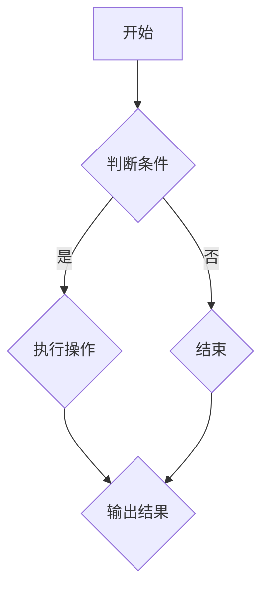

                 

## 《提示词工程的知识表示与推理》

关键词：提示词工程、知识表示、推理、人工智能、应用实践

摘要：本文从提示词工程的知识表示与推理出发，详细探讨了知识表示与推理的基本概念、方法与应用，并通过实际案例阐述了提示词工程在智能问答系统和文本摘要等领域的应用。本文旨在为从事提示词工程研究与实践的读者提供系统、深入的理论和实践指导。

----------------------------------------------------------------

# 第一部分：引言

## 第1章 问题背景与核心概念

### 1.1 问题的提出

在当今信息化、数字化的大背景下，数据已成为企业和社会的重要资源。如何有效地处理和利用这些数据，以实现数据价值的最大化，成为当前各行业面临的重要课题。提示词工程作为一种面向数据处理的智能技术，应运而生。

提示词工程，是指通过对大量文本数据进行处理、分析和理解，提取出具有代表性的关键词或短语，从而实现对文本的语义表达和知识抽取。在人工智能、自然语言处理、信息检索等领域，提示词工程具有重要的应用价值。

### 1.2 提示词工程的概念

提示词工程涉及多个核心概念，包括知识表示、推理、文本预处理、特征提取、模型训练等。其中，知识表示与推理是提示词工程的关键技术。

知识表示，是指将客观世界中的知识、信息和概念以某种形式表示出来，以便计算机能够理解和处理。常见的知识表示方法有实体-关系模型、属性-值模型和语义网络等。

推理，是指从已知信息出发，通过逻辑规则和推理算法，推导出新的结论或知识。知识推理在提示词工程中起到关键作用，有助于发现文本数据中的隐含关系和规律。

### 1.3 知识表示与推理的基本原理

知识表示与推理的基本原理主要包括以下几个方面：

1. **实体与关系表示**：通过实体和关系的表示，将客观世界中的事物和它们之间的联系映射到计算机系统中。

2. **属性与值表示**：利用属性和值的表示，描述实体具有的特征和属性。

3. **语义网络表示**：通过构建语义网络，将实体、关系和属性等知识以网络结构的形式表示出来。

4. **推理算法**：采用推理算法，从已知的事实和规则中推导出新的结论或知识。

### 1.4 文章结构

本文分为两部分：第一部分介绍知识表示与推理的基本概念、方法和应用；第二部分通过实际案例，阐述提示词工程在智能问答系统和文本摘要等领域的应用。具体章节安排如下：

- **第二部分：提示词工程实践**
  - 第4章 提示词工程的方法与工具
  - 第5章 提示词工程应用实例
  - 第6章 提示词工程的最佳实践
  - 第7章 总结与展望

## 第2章 知识表示

### 2.1 知识表示的基本概念

知识表示是指将客观世界中的知识、信息和概念以某种形式表示出来，以便计算机能够理解和处理。知识表示的基本概念包括实体、属性、关系和语义等。

- **实体**：客观世界中具有独立存在意义的事物，如人、地点、组织等。

- **属性**：实体具有的特征或属性，如人的年龄、地点的气候等。

- **关系**：实体之间存在的联系，如朋友、工作地点等。

- **语义**：实体、属性和关系所承载的意义，如朋友关系的意义、气候的意义等。

### 2.2 常见的知识表示方法

常见的知识表示方法包括实体-关系模型、属性-值模型和语义网络等。

#### 2.2.1 实体-关系模型

实体-关系模型是一种基于实体和关系表示的知识表示方法。它通过实体和关系来描述客观世界中的事物和它们之间的联系。实体-关系模型的主要特点是简单、直观，适用于描述较为简单的关系。

实体-关系模型的主要组成部分如下：

1. **实体**：客观世界中具有独立存在意义的事物，如人、地点、组织等。

2. **关系**：实体之间存在的联系，如朋友、工作地点等。

3. **属性**：实体的特征或属性，如人的年龄、地点的气候等。

#### 2.2.2 属性-值模型

属性-值模型是一种基于属性和值表示的知识表示方法。它通过属性和值的组合来描述实体具有的特征和属性。属性-值模型的主要特点是灵活、适用范围广，适用于描述较为复杂的关系。

属性-值模型的主要组成部分如下：

1. **实体**：客观世界中具有独立存在意义的事物，如人、地点、组织等。

2. **属性**：实体的特征或属性，如人的年龄、地点的气候等。

3. **值**：属性的取值，如人的年龄可以是18、25、30等。

#### 2.2.3 语义网络

语义网络是一种基于网络结构表示的知识表示方法。它通过节点和边来描述实体、关系和属性等知识，并通过边上的标签表示节点之间的关系。语义网络的主要特点是结构化、层次化，适用于描述复杂的关系和层次结构。

语义网络的主要组成部分如下：

1. **节点**：表示实体、属性或关系。

2. **边**：表示节点之间的关系。

3. **标签**：表示边的类型或含义。

### 2.3 知识表示的比较与选择

不同的知识表示方法具有各自的优缺点。在选择知识表示方法时，需要根据具体应用场景和需求进行权衡。

- **实体-关系模型**：简单、直观，适用于描述较为简单的关系。但无法很好地表示复杂的属性和关系。

- **属性-值模型**：灵活、适用范围广，适用于描述较为复杂的关系。但可能存在冗余信息，且难以表示层次结构。

- **语义网络**：结构化、层次化，适用于描述复杂的关系和层次结构。但可能存在较大的存储空间开销，且表示方法较为复杂。

在实际应用中，可以根据具体需求选择合适的知识表示方法。例如，在描述简单关系时，可以选择实体-关系模型；在描述复杂关系时，可以选择属性-值模型或语义网络。

## 第3章 知识推理

### 3.1 知识推理的基本概念

知识推理是指利用已知的事实和规则，通过逻辑推理和推理算法，推导出新的结论或知识。知识推理在人工智能、自然语言处理、信息检索等领域具有重要应用。

知识推理的基本概念包括：

- **事实**：已知的信息或数据。

- **规则**：描述事物之间关系或属性的逻辑表达式。

- **推理过程**：从已知的事实和规则中推导出新的结论或知识的过程。

### 3.2 知识推理方法

知识推理方法主要包括基于规则的推理、基于模型的推理和基于数据的推理。

#### 3.2.1 基于规则的推理

基于规则的推理是一种经典的推理方法。它通过定义一组规则，将已知的事实映射为新的结论。基于规则的推理方法简单、直观，适用于描述确定性关系。

基于规则的推理方法主要包括以下步骤：

1. **定义规则**：根据应用场景和需求，定义一组描述事物之间关系的规则。

2. **事实输入**：将已知的事实输入到推理系统中。

3. **推理过程**：根据定义的规则，从已知的事实中推导出新的结论。

4. **结论输出**：将推导出的结论输出，作为推理结果。

#### 3.2.2 基于模型的推理

基于模型的推理是一种利用模型进行推理的方法。它通过建立模型，将现实世界中的问题抽象为数学模型，然后利用数学模型进行推理。

基于模型的推理方法主要包括以下步骤：

1. **建立模型**：根据应用场景和需求，建立描述现实世界的数学模型。

2. **模型训练**：利用已知的数据，对模型进行训练，使其能够对未知数据进行预测。

3. **推理过程**：利用训练好的模型，对未知数据进行推理，得到预测结果。

4. **结论输出**：将推理结果输出，作为推理结论。

#### 3.2.3 基于数据的推理

基于数据的推理是一种利用数据进行分析和推理的方法。它通过分析大量数据，发现数据中的规律和关系，然后利用这些规律和关系进行推理。

基于数据的推理方法主要包括以下步骤：

1. **数据收集**：收集与问题相关的数据。

2. **数据分析**：对收集到的数据进行分析，发现数据中的规律和关系。

3. **推理过程**：利用发现的规律和关系，对未知数据进行推理，得到预测结果。

4. **结论输出**：将推理结果输出，作为推理结论。

### 3.3 知识推理的应用场景

知识推理在多个领域具有广泛的应用。以下是一些常见的应用场景：

1. **智能问答系统**：通过知识推理，实现对用户问题的理解和回答。

2. **文本摘要**：通过知识推理，提取文本中的关键信息，实现文本的自动摘要。

3. **信息检索**：通过知识推理，优化信息检索算法，提高检索效果。

4. **推荐系统**：通过知识推理，发现用户之间的相似性，为用户推荐感兴趣的内容。

5. **自然语言处理**：通过知识推理，实现文本的理解和生成。

## 第二部分：提示词工程实践

### 第4章 提示词工程的方法与工具

提示词工程是人工智能和自然语言处理领域的一个重要分支，其核心目标是提取文本数据中的关键信息，以便进行后续的分析和利用。在本章中，我们将介绍提示词工程的基本方法与工具，包括数据预处理、特征提取、模型训练和评估等步骤。

#### 4.1 提示词工程的流程

提示词工程的流程可以分为以下几个主要步骤：

1. **数据预处理**：对原始文本数据进行清洗、去噪和格式化，确保数据的质量和一致性。

2. **特征提取**：从预处理后的文本数据中提取有代表性的特征，如关键词、短语、词性等。

3. **模型训练**：利用提取到的特征，训练提示词生成模型，使其能够自动提取文本中的关键信息。

4. **模型评估**：对训练好的模型进行评估，确定其性能和可靠性。

5. **模型优化**：根据评估结果，对模型进行优化，以提高其性能。

#### 4.2 提示词生成工具

目前，市场上存在多种提示词生成工具，以下是一些常用的工具：

1. **TextRank**：TextRank是一种基于图模型的文本排名算法，可以提取文本中的关键词和短语。

2. **LDA（Latent Dirichlet Allocation）**：LDA是一种主题模型，可以提取文本中的潜在主题，进而生成关键词。

3. **TF-IDF（Term Frequency-Inverse Document Frequency）**：TF-IDF是一种常用的文本特征提取方法，可以根据词频和逆文档频率计算关键词的重要性。

4. **Word2Vec**：Word2Vec是一种基于神经网络的词向量模型，可以将单词映射到高维空间，便于计算词与词之间的关系。

#### 4.3 提示词评估工具

提示词评估是保证提示词工程效果的重要环节。以下是一些常用的提示词评估工具：

1. **ROUGE（Recall-Oriented Understudy for Gisting Evaluation）**：ROUGE是一种用于评估文本相似性的评估指标，常用于评估文本摘要的质量。

2. **BLEU（Bilingual Evaluation Understudy）**：BLEU是一种用于评估机器翻译质量的评估指标，也可以用于评估提示词生成效果。

3. **准确率（Accuracy）**：准确率是评估分类任务效果的一种常用指标，表示正确分类的样本数占总样本数的比例。

4. **召回率（Recall）**：召回率是评估分类任务效果的一种指标，表示正确分类的样本数占所有实际正样本数的比例。

#### 4.4 提示词工程中的常见问题及解决方案

在提示词工程实践中，可能会遇到以下常见问题：

1. **数据质量差**：解决方案：对原始文本数据进行清洗和预处理，去除噪声和无关信息。

2. **特征提取效果不佳**：解决方案：尝试不同的特征提取方法，如TF-IDF、Word2Vec等，以找到最适合问题的方法。

3. **模型性能不稳定**：解决方案：增加训练数据量，调整模型参数，进行模型优化。

4. **评估指标选择不当**：解决方案：根据应用场景选择合适的评估指标，如ROUGE、BLEU等。

### 第5章 提示词工程应用实例

在本章中，我们将通过两个具体的应用实例，展示提示词工程在实际项目中的应用。

#### 5.1 智能问答系统

智能问答系统是一种常见的人工智能应用，它能够理解用户的问题，并给出相关回答。以下是一个基于提示词工程的智能问答系统的实现案例：

**应用场景**：构建一个面向公众的健康咨询智能问答系统，用户可以通过输入问题，获取关于健康方面的专业回答。

**系统架构**：

1. **数据源**：包括健康知识库、医学词典、文献数据库等。

2. **预处理模块**：对用户输入的问题进行文本预处理，包括去噪、分词、词性标注等。

3. **特征提取模块**：利用TF-IDF、Word2Vec等方法，提取用户问题和健康知识库中的关键词和短语。

4. **问答生成模块**：基于训练好的模型，提取健康知识库中与用户问题相关的内容，生成回答。

5. **评估模块**：使用ROUGE、BLEU等指标，评估问答系统的效果。

**系统实现**：

1. **数据预处理**：对用户输入的问题进行清洗、分词和词性标注。

2. **特征提取**：使用TF-IDF和Word2Vec方法提取关键词和短语。

3. **模型训练**：利用提取到的特征，训练问答生成模型。

4. **问答生成**：根据用户问题，生成相关回答。

5. **评估与优化**：使用ROUGE、BLEU等指标，评估问答系统的效果，并根据评估结果进行优化。

#### 5.2 文本摘要

文本摘要是一种将长文本压缩成简洁、准确摘要的技术，常用于信息检索、新闻简报等领域。以下是一个基于提示词工程的文本摘要实现案例：

**应用场景**：对一个长篇科学论文进行摘要，提取出核心观点和研究结论。

**系统架构**：

1. **数据源**：包括科学论文数据库、文献数据库等。

2. **预处理模块**：对论文进行文本预处理，包括去噪、分词、词性标注等。

3. **特征提取模块**：利用TF-IDF、Word2Vec等方法，提取论文中的关键词和短语。

4. **摘要生成模块**：基于训练好的模型，提取论文中的关键信息，生成摘要。

5. **评估模块**：使用ROUGE、BLEU等指标，评估摘要系统的效果。

**系统实现**：

1. **数据预处理**：对论文进行清洗、分词和词性标注。

2. **特征提取**：使用TF-IDF和Word2Vec方法提取关键词和短语。

3. **模型训练**：利用提取到的特征，训练摘要生成模型。

4. **摘要生成**：根据论文内容，生成摘要。

5. **评估与优化**：使用ROUGE、BLEU等指标，评估摘要系统的效果，并根据评估结果进行优化。

### 第6章 提示词工程的最佳实践

在本章中，我们将分享一些提示词工程的最佳实践，帮助读者在实际项目中更好地应用提示词工程。

#### 6.1 提示词生成技巧

1. **多模型融合**：结合不同模型的优势，如结合LDA和TextRank，可以提高提示词生成的效果。

2. **特征选择**：选择合适的特征提取方法，如TF-IDF、Word2Vec等，可以提高提示词的准确性。

3. **模型优化**：调整模型参数，如学习率、正则化等，可以提高模型的性能。

#### 6.2 提示词优化策略

1. **反馈机制**：根据用户反馈，对生成的提示词进行优化，提高用户满意度。

2. **自适应调整**：根据文本内容的变化，动态调整提示词生成策略，提高生成效果。

3. **多样性控制**：在保证准确性的同时，控制提示词的多样性，避免生成重复的提示词。

#### 6.3 提示词工程案例分享

以下是一个基于医疗领域的提示词工程案例：

**项目背景**：构建一个面向医生的医疗问答系统，帮助医生快速获取相关病例信息和治疗方案。

**项目目标**：提取病例报告中的关键信息，生成简洁、准确的摘要，为医生提供快速参考。

**实现步骤**：

1. **数据收集**：收集大量病例报告，包括病史、检查结果、治疗方案等。

2. **数据预处理**：对病例报告进行清洗、分词和词性标注。

3. **特征提取**：使用TF-IDF和Word2Vec方法提取关键词和短语。

4. **模型训练**：利用提取到的特征，训练提示词生成模型。

5. **问答生成**：根据用户输入的问题，生成相关病例摘要。

6. **评估与优化**：使用ROUGE、BLEU等指标，评估问答系统的效果，并根据评估结果进行优化。

**项目成果**：通过提示词工程，实现了快速、准确的病例摘要生成，为医生提供了有效的辅助工具。

### 第7章 总结与展望

在本章中，我们对提示词工程的知识表示与推理进行了全面探讨，并分享了实际应用案例和最佳实践。以下是本文的主要内容总结：

1. **知识表示与推理的基本概念**：介绍了知识表示与推理的基本概念，包括实体、属性、关系和语义等。

2. **知识表示方法**：介绍了常见的知识表示方法，如实体-关系模型、属性-值模型和语义网络等。

3. **知识推理方法**：介绍了知识推理的方法，如基于规则的推理、基于模型的推理和基于数据的推理等。

4. **提示词工程的方法与工具**：介绍了提示词工程的基本方法和工具，包括数据预处理、特征提取、模型训练和评估等。

5. **提示词工程应用实例**：通过智能问答系统和文本摘要两个应用实例，展示了提示词工程在实际项目中的应用。

6. **最佳实践**：分享了提示词工程的最佳实践，包括提示词生成技巧、优化策略等。

#### 提示词工程的发展趋势

随着人工智能和自然语言处理技术的不断发展，提示词工程在多个领域具有广泛的应用前景。以下是提示词工程的发展趋势：

1. **多模态融合**：结合文本、图像、语音等多种数据源，实现更丰富的知识表示和推理。

2. **深度学习**：利用深度学习技术，提高提示词生成的准确性和效果。

3. **知识图谱**：构建大规模知识图谱，实现更精细的知识表示和推理。

4. **自动化与智能化**：通过自动化和智能化技术，提高提示词工程的效率和准确性。

#### 进一步研究方向

未来，提示词工程的研究可以从以下几个方面展开：

1. **知识表示与推理的优化**：研究更高效、更精确的知识表示与推理方法。

2. **跨领域应用**：探索提示词工程在不同领域的应用，如医疗、金融、教育等。

3. **人机交互**：研究更自然、更便捷的人机交互方式，提高用户使用体验。

4. **隐私保护**：在保护用户隐私的前提下，实现高效的提示词工程应用。

#### 作者信息

作者：AI天才研究院/AI Genius Institute & 禅与计算机程序设计艺术 /Zen And The Art of Computer Programming

本文由AI天才研究院和禅与计算机程序设计艺术共同撰写，旨在为读者提供关于提示词工程的知识表示与推理的深入理解和实践指导。

----------------------------------------------------------------

## 附录

### 1. Mermaid 流程图示例

以下是一个使用Mermaid绘制的简单流程图示例：



### 2. LaTex公式示例

以下是一个使用LaTex编写的简单数学公式示例：

```markdown
$$
E = mc^2
$$

$1 + 1 = 2$
```

### 3. Python代码示例

以下是一个使用Python编写的简单代码示例，用于计算两个数的和：

```python
# 计算两个数的和
def add_numbers(a, b):
    return a + b

# 主函数
def main():
    num1 = 10
    num2 = 20
    result = add_numbers(num1, num2)
    print(f"{num1} + {num2} = {result}")

# 运行主函数
if __name__ == "__main__":
    main()
```

这些示例可以帮助您更好地理解和应用Mermaid、LaTex和Python在文章中的使用。在实际编写文章时，您可以根据需要调整和扩展这些示例。

### 4. 提示词工程中的常见误区

在提示词工程实践中，一些常见的误区可能会影响模型的效果和准确性。以下是一些常见的误区及对应的解决方案：

#### 误区1：数据量不足

**解决方案**：增加数据量，确保有足够的数据用于训练模型。可以采用数据增强技术，如数据复制、数据扩充等，提高数据多样性。

#### 误区2：特征提取不充分

**解决方案**：尝试使用多种特征提取方法，如TF-IDF、Word2Vec、BERT等，选择最适合问题的特征提取方法。结合不同的特征提取方法，提高特征表达的丰富性。

#### 误区3：模型选择不当

**解决方案**：根据问题的需求和特征，选择合适的模型。例如，对于简单的文本分类任务，可以选择朴素贝叶斯、支持向量机等模型；对于复杂的文本生成任务，可以选择循环神经网络、生成对抗网络等模型。

#### 误区4：缺乏评估指标

**解决方案**：选择合适的评估指标，如准确率、召回率、F1值等，对模型进行评估。同时，可以结合用户反馈，调整模型参数和策略，提高模型性能。

#### 误区5：过度优化

**解决方案**：避免过度优化，确保模型在训练数据和测试数据上都有良好的表现。在模型训练过程中，可以使用交叉验证等技术，防止过拟合。

通过识别和解决这些常见误区，可以提高提示词工程的效果和准确性，为实际应用提供更好的支持。

### 5. 拓展阅读

为了更深入地了解提示词工程的知识表示与推理，以下是一些建议的拓展阅读材料：

1. **《自然语言处理：中文和英文》**：本书详细介绍了自然语言处理的基础知识，包括文本预处理、特征提取和模型训练等内容。

2. **《深度学习》**：由Ian Goodfellow、Yoshua Bengio和Aaron Courville合著，介绍了深度学习的基本原理和应用，包括神经网络、循环神经网络等。

3. **《主题模型与词嵌入技术》**：本书深入探讨了主题模型和词嵌入技术，包括LDA、Word2Vec、BERT等，对于理解提示词工程的核心技术具有重要意义。

4. **《人工智能：一种现代的方法》**：这本书全面介绍了人工智能的基本概念、方法和应用，涵盖了知识表示、推理和机器学习等多个领域。

通过阅读这些书籍，您可以获得更全面、深入的知识，提高在提示词工程领域的专业素养。同时，也可以关注相关的学术期刊和在线课程，保持对最新研究成果的了解。

