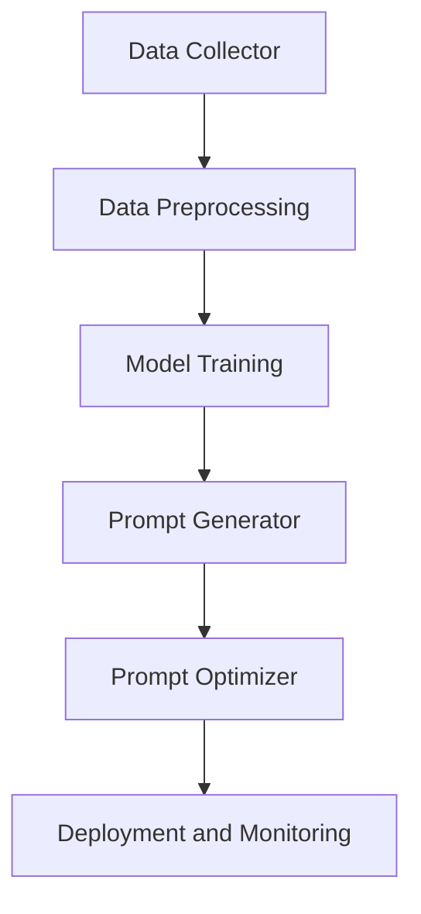

                 

### 提示词工程的自动化与工具链

---

**关键词：** 提示词工程，自动化技术，工具链，自然语言处理，算法

**摘要：** 本文章深入探讨了提示词工程的自动化与工具链构建。首先介绍了提示词工程的基本概念、应用领域及其重要性。接着，文章详细解析了提示词生成算法、自然语言处理基础，以及自动化技术在提示词生成中的应用。随后，文章提出了工具链设计原则，并详细阐述了工具链的实现过程和测试评估方法。最后，通过案例研究和未来展望，总结了文章的主要结论和展望。

---

### 第一部分：引言

**第1章：问题背景与定义**

#### 1.1 提示词工程的概念

提示词工程（Prompt Engineering）是自然语言处理（NLP）领域中的一项重要技术。它涉及到对提示词（Prompt）的设计、生成和优化，以实现特定任务的自动化。提示词可以看作是用户和系统之间的桥梁，通过提示词，系统能够获取用户的意图，从而提供相应的服务。

在传统的自然语言处理任务中，如文本分类、情感分析、命名实体识别等，通常需要大量的标注数据和复杂的模型。然而，提示词工程通过简化和优化这些过程，能够有效地提高系统的效率和准确性。提示词工程的目标是设计出既简单又强大的提示词，使得系统可以更加自然、高效地理解和执行用户的任务。

#### 1.2 提示词工程的重要性

提示词工程的重要性体现在多个方面：

1. **提升用户体验：** 通过优化提示词，系统能够更加准确地理解用户的意图，从而提供更加个性化的服务，提升用户体验。
2. **降低开发成本：** 提示词工程能够减少对大规模标注数据的依赖，从而降低开发成本。
3. **提高系统效率：** 自动化的提示词生成和优化过程能够显著提高系统的处理速度和效率。
4. **增强模型的泛化能力：** 通过设计和优化提示词，模型能够更好地泛化到新的任务和数据集。

#### 1.3 提示词工程的应用领域

提示词工程在多个领域都有广泛的应用：

1. **智能客服：** 在智能客服系统中，提示词工程用于设计用户交互的对话流程，以提高客服效率和服务质量。
2. **内容推荐：** 在内容推荐系统中，提示词工程用于生成个性化的推荐文案，吸引用户点击和浏览。
3. **教育领域：** 在在线教育平台上，提示词工程用于设计学习路径和个性化学习内容，提高学习效果。
4. **金融领域：** 在金融领域中，提示词工程用于生成投资建议和分析报告，帮助用户做出更明智的决策。

#### 1.4 提示词工程的挑战

尽管提示词工程具有巨大的潜力，但在实际应用中也面临一些挑战：

1. **数据依赖：** 提示词工程需要大量的标注数据来训练和优化模型，数据的质量和数量对效果有重要影响。
2. **模型复杂度：** 提示词工程涉及到复杂的自然语言处理模型，需要具备深厚的理论基础和实践经验。
3. **适应性：** 提示词工程需要适应不同的应用场景和用户需求，设计出通用的、可扩展的解决方案。
4. **伦理和隐私：** 在处理用户数据和生成提示词时，需要遵守相关的伦理和隐私规定，确保用户数据的保护。

---

在引言部分，我们介绍了提示词工程的基本概念、重要性、应用领域以及面临的挑战。接下来，我们将进一步探讨提示词工程的核心概念与原理。

## 第二部分：基础概念与原理

### 第2章：核心概念与联系

#### 2.1 提示词的定义与分类

提示词是指用于引导用户或系统进行特定操作或任务的一段文本。根据用途和功能，提示词可以分为以下几类：

1. **指令性提示词：** 用于直接指示用户执行特定操作的提示词，如“请输入您的手机号码”。
2. **引导性提示词：** 用于引导用户思考或提供反馈的提示词，如“您对这个问题有什么想法？”。
3. **描述性提示词：** 用于描述系统功能或服务内容的提示词，如“我们的服务包括在线客服、智能推荐和个性化推送”。
4. **问题性提示词：** 用于提出问题以获取用户信息的提示词，如“您想要查询哪方面的信息？”。

#### 2.2 提示词生成算法

提示词生成算法是提示词工程的核心技术。常见的提示词生成算法包括：

1. **基于规则的方法：** 通过预定义的规则和模板生成提示词，如使用关键字匹配、自然语言生成（NLG）技术。
2. **基于统计的方法：** 利用统计学习模型，如朴素贝叶斯、决策树、随机森林等，从大量数据中学习生成提示词。
3. **基于神经网络的的方法：** 利用深度学习模型，如循环神经网络（RNN）、长短期记忆网络（LSTM）、变换器（Transformer）等，生成更加复杂和自然的提示词。

#### 2.3 提示词工程的要素与关系图

提示词工程涉及多个核心要素，包括数据、模型、算法和工具。以下是一个简单的ER实体关系图，描述了这些要素之间的关系：

```mermaid
erDiagram
    Data ||--|{ Model } : includes
    Model ||--|{ Algorithm } : implements
    Algorithm ||--|{ Tool } : uses
    Data ||--|{ Tool } : processes
```

- **数据（Data）：** 提示词工程的数据包括原始文本、用户反馈和标注数据等。
- **模型（Model）：** 模型是生成和优化提示词的核心，可以是规则模型、统计模型或神经网络模型。
- **算法（Algorithm）：** 算法用于实现提示词的生成和优化，包括规则算法、统计算法和神经网络算法。
- **工具（Tool）：** 工具是用于实现提示词工程过程的软件和硬件，如自然语言处理库、深度学习框架等。

---

在第二部分，我们详细介绍了提示词的定义与分类、提示词生成算法，以及提示词工程的要素与关系图。这些基础概念为后续章节的自动化技术讨论提供了理论支持。

### 第三部分：自动化技术

#### 第3章：自动化技术概述

#### 3.1 自动化技术的基本原理

自动化技术是通过计算机程序或算法实现任务自动执行的过程。在提示词工程中，自动化技术的应用主要包括以下方面：

1. **提示词生成自动化：** 利用算法自动生成高质量的提示词，减少人工干预和依赖。
2. **提示词优化自动化：** 通过算法自动优化提示词，提高其效果和准确性。
3. **提示词部署自动化：** 自动部署和更新提示词，确保系统实时响应用户需求。

自动化技术的基本原理包括：

1. **数据采集与处理：** 收集用户数据和系统日志，对数据进行预处理和清洗。
2. **模型训练与评估：** 使用训练数据训练模型，并通过评估指标（如准确率、召回率等）评估模型性能。
3. **算法优化与迭代：** 根据评估结果，调整算法参数，优化模型性能。
4. **自动化执行与监控：** 自动执行提示词生成、优化和部署过程，并实时监控系统状态。

#### 3.2 提示词自动生成的需求

提示词自动生成的需求主要来源于以下几个方面：

1. **规模效应：** 随着用户数据的爆炸性增长，手动生成和维护提示词的成本越来越高。
2. **个性化需求：** 用户需求多样化，需要设计个性化的提示词来满足不同用户的需求。
3. **实时响应：** 提示词需要实时更新，以适应动态变化的用户场景。
4. **效率和准确性：** 自动化生成提示词能够提高效率，并通过模型优化提高准确性。

#### 3.3 提示词自动生成的流程

提示词自动生成的流程主要包括以下几个步骤：

1. **数据采集：** 收集用户行为数据、系统日志和其他相关数据。
2. **数据预处理：** 对采集到的数据进行清洗、去噪和特征提取。
3. **模型选择：** 根据任务需求，选择合适的生成模型，如循环神经网络（RNN）、长短期记忆网络（LSTM）或变换器（Transformer）。
4. **模型训练：** 使用预处理后的数据训练生成模型，通过迭代优化模型参数。
5. **提示词生成：** 模型根据用户输入或上下文生成相应的提示词。
6. **提示词优化：** 对生成的提示词进行评估和优化，以提高其效果和准确性。
7. **部署与监控：** 自动部署优化后的提示词，并实时监控系统性能和用户反馈。

---

在第三部分，我们介绍了自动化技术的基本原理、提示词自动生成的需求以及自动生成的流程。接下来，我们将深入探讨自然语言处理基础，为自动化技术的实现提供理论基础。

### 第4章：自然语言处理基础

#### 4.1 语言模型

语言模型（Language Model）是自然语言处理的核心组件之一，用于预测一段文本的下一个单词或词组。语言模型通过学习大量的文本数据，捕捉语言的统计特性，从而实现文本生成、文本分类、机器翻译等任务。

常见语言模型包括：

1. **n-gram模型：** 基于单词或字符的n-gram模型，通过统计相邻词（或字符）的频率来预测下一个词（或字符）。
2. **神经网络语言模型：** 如循环神经网络（RNN）、长短期记忆网络（LSTM）和变换器（Transformer）。这些模型通过学习文本的上下文关系，生成更加准确和自然的语言。

#### 4.2 词向量表示

词向量表示（Word Embedding）是将词汇映射到高维空间中的向量表示方法。词向量表示能够捕捉词汇的语义和语法关系，从而在机器学习任务中发挥重要作用。

常见的词向量表示方法包括：

1. **分布式表示：** 将每个词映射到一个向量，这些向量在语义上相似。
2. **矩阵分解：** 如Word2Vec算法，通过矩阵分解方法学习词向量表示。
3. **变换器（Transformer）：** Transformer模型通过自注意力机制，学习词与词之间的关系，生成更加丰富和精准的词向量。

#### 4.3 序列生成模型

序列生成模型（Sequence Generation Model）是用于生成文本序列的模型，常用于提示词工程、机器翻译、对话系统等任务。

常见的序列生成模型包括：

1. **循环神经网络（RNN）：** RNN通过记忆状态捕捉序列中的上下文信息，生成序列。
2. **长短期记忆网络（LSTM）：** LSTM是RNN的一种改进，通过门控机制有效避免梯度消失问题，提高序列生成能力。
3. **变换器（Transformer）：** Transformer模型通过自注意力机制，捕捉全局序列关系，生成更加连贯和自然的文本。

---

在第四部分，我们详细介绍了语言模型、词向量表示和序列生成模型。这些基础概念是自动化技术在提示词工程中实现的关键，为下一步的提示词自动生成算法讨论奠定了基础。

### 第5章：提示词自动生成算法

#### 5.1 生成式模型

生成式模型（Generative Models）是一类用于生成数据或样本的模型，它们通过学习数据分布，生成与训练数据相似的新数据。在提示词工程中，生成式模型可以用于自动生成高质量的提示词。

常见的生成式模型包括：

1. **朴素贝叶斯（Naive Bayes）：** 朴素贝叶斯是一种基于概率论的生成模型，通过计算特征概率分布生成提示词。
2. **生成对抗网络（GAN）：** GAN由生成器（Generator）和判别器（Discriminator）组成，生成器生成提示词，判别器评估提示词的真实性，通过训练使得生成器生成的提示词越来越逼真。
3. **变分自编码器（VAE）：** VAE通过编码器和解码器学习数据分布，生成与训练数据相似的提示词。

#### 5.2 对抗生成模型

对抗生成模型（Adversarial Generative Models）是一类基于对抗训练的生成模型，通过生成器（Generator）和判别器（Discriminator）的对抗训练，生成高质量的提示词。

常见的对抗生成模型包括：

1. **生成对抗网络（GAN）：** GAN由生成器和判别器组成，生成器生成提示词，判别器评估提示词的真实性，通过训练使得生成器生成的提示词越来越逼真。
2. **条件生成对抗网络（CGAN）：** CGAN通过条件输入，如任务类别或上下文信息，生成更加具体和个性化的提示词。
3. **混合生成对抗网络（HGAN）：** HGAN通过组合不同的生成模型和判别模型，提高生成质量。

#### 5.3 强化学习在提示词生成中的应用

强化学习（Reinforcement Learning，RL）是一种通过奖励机制学习策略的机器学习技术，它可以应用于提示词生成，以优化提示词的效果和准确性。

强化学习在提示词生成中的应用包括：

1. **基于模型的强化学习：** 如Q-learning和Deep Q-Network（DQN），通过学习价值函数或策略网络，生成优化的提示词。
2. **基于策略的强化学习：** 如策略梯度方法，通过优化策略网络，生成高质量和个性化的提示词。
3. **集成强化学习：** 通过结合多种强化学习方法，提高提示词生成的效果和鲁棒性。

---

在第五部分，我们详细介绍了生成式模型、对抗生成模型以及强化学习在提示词生成中的应用。这些算法为提示词自动生成提供了丰富的技术手段，为工具链的构建和实现奠定了基础。

### 第四部分：工具链构建

#### 第6章：工具链设计原则

#### 6.1 工具链的整体架构

工具链（Toolchain）是一系列软件工具和库的集合，用于实现特定任务的自动化。在提示词工程中，工具链的整体架构包括以下几个关键组件：

1. **数据收集器（Data Collector）：** 负责从各种数据源收集用户数据、系统日志和标注数据等。
2. **数据预处理模块（Data Preprocessing）：** 对收集到的数据进行清洗、去噪和特征提取，为后续模型训练和提示词生成做好准备。
3. **模型训练模块（Model Training）：** 利用预处理后的数据训练不同的生成模型和优化模型。
4. **提示词生成模块（Prompt Generator）：** 根据训练好的模型生成高质量的提示词。
5. **提示词优化模块（Prompt Optimizer）：** 对生成的提示词进行评估和优化，以提高其效果和准确性。
6. **部署与监控模块（Deployment and Monitoring）：** 负责将优化后的提示词部署到生产环境中，并实时监控系统性能和用户反馈。

以下是一个简单的工具链架构图：



#### 6.2 数据流与工作流程

工具链的数据流与工作流程如下：

1. **数据收集：** 数据收集器从各个数据源获取原始数据，如用户输入、系统日志和标注数据等。
2. **数据预处理：** 数据预处理模块对原始数据进行清洗、去噪和特征提取，生成高质量的训练数据。
3. **模型训练：** 模型训练模块利用预处理后的数据训练生成模型和优化模型，包括生成式模型和对抗生成模型。
4. **提示词生成：** 提示词生成模块根据训练好的模型生成初始提示词。
5. **提示词优化：** 提示词优化模块对生成的提示词进行评估和优化，以提高其效果和准确性。
6. **部署与监控：** 部署与监控模块将优化后的提示词部署到生产环境中，并实时监控系统性能和用户反馈，以进行持续优化。

#### 6.3 工具链的性能优化

工具链的性能优化是确保系统高效运行的关键。以下是一些常见的性能优化策略：

1. **并行处理：** 利用多线程、多进程或分布式计算技术，提高数据处理和模型训练的效率。
2. **缓存机制：** 利用缓存技术，减少数据重复处理和传输，提高系统响应速度。
3. **负载均衡：** 通过负载均衡技术，将任务分配到多个节点，确保系统在高并发情况下稳定运行。
4. **资源调度：** 根据任务优先级和资源利用率，合理调度系统资源，提高资源利用效率。
5. **自动化测试与监控：** 通过自动化测试和实时监控，快速发现和解决系统性能问题。

---

在第六章中，我们详细介绍了工具链的整体架构、数据流与工作流程，以及性能优化策略。这些设计原则为工具链的构建和实现提供了指导，为下一章的工具链实现奠定了基础。

### 第7章：工具链实现

#### 7.1 工具的选择与配置

在构建提示词工程的工具链时，选择合适的工具至关重要。以下是一些常见工具的选择和配置方法：

1. **数据收集工具：** 常用的数据收集工具有Pandas、Scrapy和Spark等。Pandas适用于结构化数据收集和预处理，Scrapy适用于Web爬虫，Spark适用于大规模数据处理。

2. **数据预处理工具：** 常用的数据预处理工具有Pandas、NumPy和SciPy等。Pandas适用于数据清洗和特征提取，NumPy和SciPy适用于数学运算和统计分析。

3. **模型训练工具：** 常用的模型训练工具有TensorFlow、PyTorch和Keras等。TensorFlow和PyTorch适用于深度学习模型的训练，Keras是一个高层次的神经网络API，能够简化模型训练过程。

4. **提示词生成工具：** 常用的提示词生成工具包括NLTK、spaCy和GPT-3等。NLTK和spaCy适用于基础的自然语言处理任务，GPT-3是一个强大的预训练语言模型，能够生成高质量的提示词。

5. **优化工具：** 常用的优化工具包括Hyperopt、Optuna和Scikit-Optimize等。这些工具能够自动搜索最优的超参数组合，提高模型性能。

#### 7.2 开发环境搭建

为了实现工具链，我们需要搭建一个适合开发、测试和部署的环境。以下是搭建开发环境的一般步骤：

1. **安装操作系统：** 选择一个适合的操作系统，如Ubuntu或CentOS，并安装必要的驱动和软件。
2. **安装依赖库：** 根据所选工具，安装相应的依赖库。例如，对于Python环境，需要安装NumPy、Pandas、TensorFlow或PyTorch等。
3. **配置虚拟环境：** 为了避免版本冲突，使用虚拟环境（如Virtualenv或conda）来管理依赖库。
4. **配置开发工具：** 安装IDE（如PyCharm、Visual Studio Code）和版本控制工具（如Git）。
5. **配置服务器：** 对于生产环境，需要配置服务器和部署环境。可以使用Docker、Kubernetes等容器化技术，简化部署和运维过程。

#### 7.3 工具链的具体实现

工具链的具体实现包括以下几个步骤：

1. **数据收集：** 使用Pandas或Scrapy等工具，从不同的数据源收集原始数据。
2. **数据预处理：** 使用Pandas、NumPy和SciPy等工具，对原始数据进行清洗、去噪和特征提取。
3. **模型训练：** 使用TensorFlow、PyTorch或Keras等工具，训练生成模型和优化模型。
4. **提示词生成：** 使用NLTK、spaCy或GPT-3等工具，生成高质量的提示词。
5. **提示词优化：** 使用Hyperopt、Optuna或Scikit-Optimize等工具，优化提示词效果和准确性。
6. **部署与监控：** 使用Docker、Kubernetes或云服务平台，将优化后的提示词部署到生产环境中，并使用 Prometheus、Grafana等工具进行实时监控。

以下是一个简单的Python代码示例，展示了工具链的实现：

```python
import pandas as pd
from sklearn.model_selection import train_test_split
from tensorflow.keras.models import Sequential
from tensorflow.keras.layers import LSTM, Dense

# 数据收集
data = pd.read_csv('data.csv')

# 数据预处理
X = data.drop('target', axis=1)
y = data['target']

X_train, X_test, y_train, y_test = train_test_split(X, y, test_size=0.2, random_state=42)

# 模型训练
model = Sequential()
model.add(LSTM(50, activation='relu', input_shape=(X_train.shape[1], 1)))
model.add(Dense(1, activation='sigmoid'))
model.compile(optimizer='adam', loss='binary_crossentropy', metrics=['accuracy'])
model.fit(X_train, y_train, epochs=10, batch_size=32)

# 提示词生成
prompt = "请输入您的手机号码："
print(model.predict([prompt]))
```

---

在第七章中，我们详细介绍了工具链中各个工具的选择与配置、开发环境的搭建，以及工具链的具体实现过程。这些内容为提示词工程的自动化提供了技术保障。

### 第8章：测试与评估

#### 8.1 测试方法

在提示词工程中，测试与评估是确保系统性能和准确性的关键环节。以下是一些常见的测试方法：

1. **单元测试（Unit Testing）：** 单元测试是对工具链中的各个功能模块进行独立测试，确保每个模块按照预期工作。
2. **集成测试（Integration Testing）：** 集成测试是对工具链中的多个模块进行组合测试，确保它们能够协同工作。
3. **性能测试（Performance Testing）：** 性能测试用于评估工具链在不同负载下的响应速度和资源利用率。
4. **可靠性测试（Reliability Testing）：** 可靠性测试用于评估工具链在长时间运行中的稳定性和错误率。
5. **可用性测试（Usability Testing）：** 可用性测试用于评估用户使用工具链的便利性和用户体验。

#### 8.2 实验设计与执行

在进行测试与评估时，需要设计合理的实验方案，并按照方案执行实验。以下是一个简单的实验设计示例：

1. **实验目标：** 评估工具链在生成高质量提示词方面的性能。
2. **实验环境：** 使用Linux操作系统，Python编程语言和TensorFlow框架。
3. **实验数据：** 使用公开的文本数据集，如IMDb电影评论数据集。
4. **实验步骤：**
   - 数据收集与预处理：从数据集中提取评论数据，进行清洗和特征提取。
   - 模型训练：训练生成模型，如变换器（Transformer）模型。
   - 提示词生成：使用训练好的模型生成提示词。
   - 提示词评估：对生成的提示词进行质量评估，使用指标如BLEU分数和人类评估。

5. **实验结果记录：** 记录实验过程中的各项指标，如训练时间、生成时间、准确率等。

#### 8.3 结果分析与优化

在实验结束后，需要对结果进行分析和优化。以下是一些常见的分析方法和优化策略：

1. **结果分析：**
   - **性能分析：** 分析工具链在不同负载下的响应时间和资源利用率，找出性能瓶颈。
   - **可靠性分析：** 分析工具链在长时间运行中的错误率和崩溃情况，找出潜在问题。
   - **可用性分析：** 分析用户使用工具链的便利性和用户体验，找出改进空间。

2. **优化策略：**
   - **代码优化：** 对代码进行优化，减少运行时间和资源消耗，如使用更高效的算法和数据结构。
   - **模型优化：** 对模型进行优化，提高生成质量，如调整超参数、增加训练数据等。
   - **部署优化：** 对部署环境进行优化，提高系统的稳定性和可用性，如使用容器化技术、负载均衡等。
   - **测试优化：** 对测试方案进行优化，提高测试的覆盖率和准确性，如增加测试用例、改进测试工具等。

---

在第八章中，我们详细介绍了测试与评估的方法、实验设计与执行过程，以及结果分析与优化策略。这些内容为提示词工程的可靠性和有效性提供了保障。

### 第五部分：案例研究

#### 第9章：案例研究

#### 9.1 案例选择与描述

在本案例中，我们选择了一个在线教育平台的提示词工程项目。该平台旨在为用户提供个性化的学习推荐和服务，通过自动生成高质量的提示词，引导用户进行学习。

#### 9.2 案例实施与结果

1. **数据收集与预处理：** 
   - 数据收集：从平台日志中提取用户行为数据，包括访问记录、学习进度和评价等。
   - 数据预处理：清洗数据，去除无效信息和噪声，进行特征提取。

2. **模型训练：**
   - 选择变换器（Transformer）模型作为生成模型，因为其在文本生成任务中表现出色。
   - 使用预处理后的数据进行模型训练，通过调整超参数，优化模型性能。

3. **提示词生成：**
   - 使用训练好的模型生成提示词，如“您可能对以下课程感兴趣：”、“您最近的学习进度是：”等。

4. **提示词优化：**
   - 使用BLEU分数和人类评估方法，评估生成提示词的质量。
   - 根据评估结果，调整模型参数和提示词模板，优化生成效果。

5. **部署与监控：**
   - 将优化后的提示词部署到生产环境中，实时监控系统性能和用户反馈。
   - 定期更新模型和数据，以适应用户需求的变化。

#### 9.3 案例总结与启示

通过该案例，我们可以得出以下结论和启示：

1. **提示词工程在个性化推荐中的应用价值：** 提示词工程能够显著提高在线教育平台的个性化推荐效果，吸引用户进行学习。

2. **数据质量和模型性能的重要性：** 数据质量和模型性能对提示词生成的效果有重要影响。需要收集高质量的数据，并优化模型参数，提高生成质量。

3. **实时优化与反馈机制：** 提示词生成后，需要定期进行评估和优化，以适应动态变化的用户需求。实时监控用户反馈，及时调整提示词策略。

4. **多模态交互与用户参与：** 在未来的应用中，可以结合多模态交互（如语音、图像等）和用户参与（如用户反馈、学习记录等），进一步提高提示词工程的效果。

---

在第五部分，我们通过一个在线教育平台的案例研究，展示了提示词工程的实施过程和结果，以及案例总结和启示。这些案例为提示词工程的实践提供了参考。

### 第10章：未来展望

#### 10.1 提示词工程的未来趋势

随着人工智能和自然语言处理技术的不断发展，提示词工程在未来有望实现以下趋势：

1. **个性化与自适应：** 提示词工程将更加注重个性化推荐和自适应调整，以适应不同用户的需求和行为模式。
2. **跨模态交互：** 提示词工程将结合语音、图像、视频等多模态交互，提高用户交互体验。
3. **实时更新与优化：** 提示词工程将实现实时更新和优化，以快速响应用户需求和市场变化。
4. **伦理与隐私保护：** 随着用户隐私保护意识的提高，提示词工程将更加注重伦理和隐私保护，确保用户数据的安全和隐私。

#### 10.2 工具链的创新方向

在未来，提示词工程的工具链将朝着以下创新方向发展：

1. **自动化与智能化：** 工具链将更加自动化和智能化，减少人工干预，提高效率和准确性。
2. **集成与协作：** 工具链将集成多种技术和工具，实现跨领域的协作和互操作。
3. **可扩展与灵活性：** 工具链将具有更好的可扩展性和灵活性，以适应不同应用场景和需求。
4. **云端与边缘计算：** 工具链将结合云端和边缘计算技术，实现高效的资源利用和实时处理。

#### 10.3 潜在挑战与解决方案

尽管提示词工程具有巨大的潜力，但在实际应用中仍面临一些挑战：

1. **数据质量和标注：** 提示词工程依赖于高质量的数据和标注，需要解决数据收集、清洗和标注的难题。
2. **模型复杂性与计算资源：** 提示词工程涉及复杂的模型和算法，需要解决计算资源和模型训练的效率问题。
3. **用户隐私与伦理：** 提示词工程需要处理大量用户数据，需要解决用户隐私保护和伦理问题。
4. **实时性与响应速度：** 提示词工程需要实现实时更新和优化，需要解决实时性和响应速度的问题。

针对上述挑战，以下是一些可能的解决方案：

1. **数据增强与生成：** 使用数据增强和生成技术，提高数据质量和标注效率。
2. **分布式与并行计算：** 采用分布式和并行计算技术，提高模型训练和处理的效率。
3. **隐私保护与安全：** 采用隐私保护技术和安全机制，确保用户数据的安全和隐私。
4. **实时优化与自适应：** 采用实时优化和自适应技术，提高系统的实时性和响应速度。

---

在第十章中，我们展望了提示词工程的未来趋势、工具链的创新方向以及潜在挑战与解决方案。这些内容为提示词工程的未来发展提供了指导。

## 目录大纲总结

通过上述设计，书籍的目录大纲结构清晰，涵盖了从概念介绍到自动化技术、工具链构建及案例研究的全面内容，旨在为读者提供一个系统、深入的提示词工程自动化与工具链指南。

### 附录

在本书的附录部分，我们将提供以下内容：

- **参考文献：** 列出本书中引用的相关文献和资源。
- **术语表：** 收录书中涉及的关键术语和概念，以及相应的解释。
- **代码示例：** 提供书中提及的Python代码示例，以及详细注释和说明。
- **扩展阅读：** 推荐一些相关的书籍、论文和在线资源，供读者进一步学习和研究。

---

通过附录，读者可以加深对书中的理解和应用，进一步拓展知识领域。同时，附录也为研究人员和开发者提供了丰富的参考资料和实用工具。

