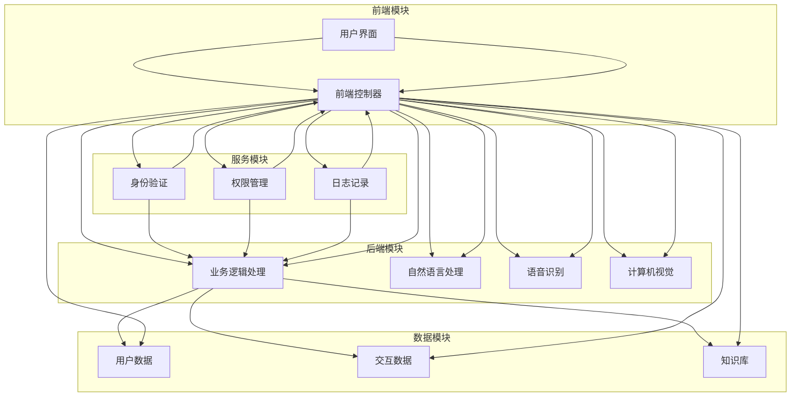
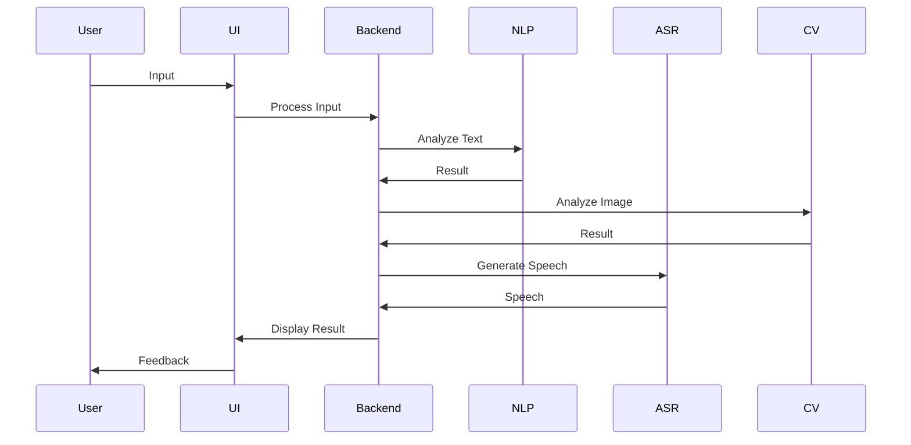

                 


### 摘要

"Prompt Engineering Art: Shaping the Future of AI Interaction"旨在深入探讨提示工程在人工智能交互领域的应用与影响。本文首先分析了AI交互的现状及其面临的挑战，引出了提示工程的核心概念与重要性。接着，我们详细讲解了提示工程的定义、方法、核心概念以及AI交互的基本原理。在此基础上，文章重点介绍了提示词的设计原则与优化方法，并通过实际案例解析展示了其在不同领域的应用。随后，文章详细阐述了AI交互系统的设计与实现，包括数据处理与存储、算法实现与优化，以及系统架构设计。最后，文章总结了最佳实践，并对未来进行了展望。本文旨在为从事AI交互领域的技术人员提供一套系统化的提示工程方法论，以推动AI交互技术的发展和创新。

## 第一部分：引言

### 第1章：问题背景与目标

#### 1.1 问题背景

人工智能（AI）技术近年来取得了飞速发展，从最初的算法模型到如今的复杂系统，AI已渗透到各个行业和领域。然而，随着AI技术的发展，AI交互成为了一个新的研究热点。AI交互指的是通过自然语言处理、语音识别、图像识别等技术，实现人与机器之间的有效沟通与协作。尽管AI交互在提升用户体验、提高工作效率等方面展现出巨大潜力，但同时也面临着一系列挑战。

首先，用户对AI交互的需求日益多样化和个性化。传统的人工服务往往无法满足用户复杂多变的需求，而AI交互则可以通过自适应和个性化的方式，提供更加符合用户期望的服务。其次，AI交互需要解决自然语言理解和语义理解的难题。自然语言是人类沟通的主要方式，但其复杂性和多义性使得机器理解和处理自然语言变得困难。此外，AI交互还需要处理大量的非结构化数据，如文本、图像、音频等，这些数据的处理和整合也是一大挑战。

#### 1.1.1 AI与交互技术的现状

目前，AI交互技术已取得了显著的进展。例如，智能客服系统通过自然语言处理技术，能够自动识别用户的需求并提供相应的服务，大大提高了客服效率和用户体验。语音助手如Siri、Alexa和Google Assistant等，通过语音识别和自然语言理解技术，实现了人与机器的语音交互，使得用户可以通过语音命令控制智能家居、查询信息等。此外，自动驾驶技术也利用了AI交互，通过车载传感器和计算机视觉技术，实现了车辆与道路环境的实时交互，为自动驾驶提供了重要的技术支持。

然而，尽管AI交互技术已经取得了一些突破，但仍存在许多亟待解决的问题。例如，自然语言处理技术的准确性仍然有限，一些复杂的语言现象和语境仍然难以准确理解。此外，AI交互系统的设计通常需要大量的数据训练，而数据的获取和处理也面临着隐私和伦理问题。因此，如何在保证性能的同时，解决这些挑战，成为AI交互领域亟待解决的问题。

#### 1.1.2 交互需求与挑战

用户对AI交互的需求主要体现在以下几个方面：

1. **个性化与适应性**：用户希望AI系统能够根据个人的偏好和行为，提供个性化的服务和建议。
2. **准确性**：用户希望AI系统能够准确理解并回应自己的需求，减少误解和错误。
3. **实时性**：用户希望AI系统能够快速响应用户的需求，提供即时的服务和支持。
4. **多模态交互**：用户希望能够通过多种方式与AI系统进行交互，如语音、文字、手势等。

然而，要满足这些需求，AI交互技术面临着以下挑战：

1. **自然语言理解的复杂性**：自然语言具有高度复杂性和多义性，机器难以准确理解用户的需求。
2. **数据隐私与安全**：AI交互需要大量的用户数据，如何保护用户的隐私和数据安全成为一大挑战。
3. **交互一致性**：AI系统需要在不同场景和任务中保持一致的交互体验，这需要复杂的策略和设计。
4. **跨领域应用**：AI交互技术需要能够适应不同领域和任务的需求，这要求系统具备较强的通用性和适应性。

#### 1.1.3 提示工程的角色

在上述背景下，提示工程（Prompt Engineering）应运而生。提示工程是AI交互领域中的一项关键技术，它通过设计高质量的提示词和交互流程，提升AI系统对用户需求的识别和回应能力。提示工程的核心目标是为AI系统提供清晰的指令和引导，帮助其更好地理解用户意图，提高交互的准确性和效率。

具体来说，提示工程在AI交互中的作用包括：

1. **明确用户意图**：通过设计有针对性的提示词，帮助AI系统更好地理解用户的意图和需求。
2. **优化交互流程**：设计合理的交互流程，使AI系统能够更高效地响应用户的需求。
3. **提高用户体验**：通过优化交互体验，提升用户对AI系统的满意度和使用意愿。
4. **提升系统性能**：通过高质量的提示词，可以帮助AI系统更好地学习用户的行为和偏好，提高系统的性能和鲁棒性。

#### 1.2 研究目标

本文的研究目标如下：

1. **深入理解提示工程的概念和方法**：通过对提示工程的定义、原理、方法和工具的详细探讨，帮助读者全面了解提示工程的内涵和应用。
2. **分析提示工程在AI交互中的重要性**：通过具体案例和研究，阐述提示工程在提升AI交互性能和用户体验方面的重要作用。
3. **提供实用的提示工程实践方法**：通过实际案例解析，为从事AI交互领域的技术人员提供一套实用的提示工程方法论。
4. **探讨提示工程的未来发展方向**：分析提示工程在AI交互领域的应用前景，探讨其未来可能的发展趋势和方向。

#### 1.3 边界与外延

在讨论提示工程时，需要明确其边界与外延：

1. **边界**：
   - 提示工程主要关注AI交互过程中的提示词设计和优化，不包括其他AI技术，如机器学习、深度学习等。
   - 提示工程主要关注交互过程中的用户研究，不包括其他用户研究方法，如问卷调查、用户访谈等。

2. **外延**：
   - 提示工程可以应用于各种AI交互系统，如智能客服、语音助手、自动驾驶等。
   - 提示工程可以与多种AI技术相结合，如自然语言处理、语音识别、图像识别等。

#### 1.4 本章小结

本章首先分析了AI交互技术的现状和面临的挑战，引出了提示工程的核心概念与重要性。接着，我们明确了研究目标和边界与外延，为后续章节的讨论奠定了基础。

---

## 第二部分：核心概念与原理

### 第2章：核心概念解析

#### 2.1 提示词（Prompt）的定义与类型

提示词（Prompt）是提示工程中最基本的概念，它是用于引导AI系统理解用户意图和需求的关键输入。一个有效的提示词应该能够清晰地传达用户的意图，使AI系统能够准确地进行响应和处理。

**定义**：

提示词是一种人工设计的文本、语音或图像等输入，用于引导AI系统理解用户的需求和意图，并生成相应的响应。

**类型**：

根据不同的应用场景和需求，提示词可以分为以下几种类型：

1. **指令型提示词**：这类提示词主要用于给出具体的指令，要求AI系统执行特定的操作。例如：“打开灯”，“播放音乐”。
2. **问题型提示词**：这类提示词主要用于引导用户提出问题，帮助AI系统理解用户的需求。例如：“您想了解什么信息？”。
3. **反馈型提示词**：这类提示词主要用于获取用户的反馈，以调整AI系统的响应。例如：“您的满意度如何？”。
4. **引导型提示词**：这类提示词主要用于引导用户进行一系列操作，以完成复杂的任务。例如：“请按照以下步骤操作：1. 打开应用程序，2. 输入您的用户名，3. 点击登录”。

**属性特征对比表格**：

下面是一个提示词类型及其属性特征的对比表格：

| 提示词类型 | 描述 | 主要属性特征 |
| :--- | :--- | :--- |
| 指令型 | 用于给出具体指令 | 明确、具体、操作性强 |
| 问题型 | 用于引导用户提问 | 开放性、引导性、适应性 |
| 反馈型 | 用于获取用户反馈 | 评价性、互动性、调整性 |
| 引导型 | 用于引导用户完成操作 | 系统性、逐步性、指导性 |

#### 2.2 提示工程方法

提示工程是一个系统化的过程，包括以下几个关键步骤：

1. **需求分析**：分析用户需求，确定需要解决的问题和目标。
2. **设计提示词**：根据需求分析，设计合适的提示词，包括类型、内容、格式等。
3. **测试与优化**：通过实际测试，评估提示词的有效性，并根据反馈进行优化。
4. **部署与维护**：将优化后的提示词部署到AI交互系统中，并持续进行维护和更新。

**基本流程**：

1. **需求分析**：首先，需要明确AI交互系统需要解决的问题和目标。这可以通过用户调研、需求文档分析等方式进行。
2. **设计提示词**：根据需求分析的结果，设计合适的提示词。设计过程中需要考虑提示词的类型、内容、格式、语气等因素。
3. **测试与优化**：设计出初步的提示词后，需要通过实际测试来评估其有效性。测试过程中，可以通过用户反馈、数据统计等方式来收集反馈，并根据反馈对提示词进行优化。
4. **部署与维护**：经过测试和优化后的提示词可以部署到AI交互系统中。在实际应用过程中，需要持续收集用户反馈，并根据反馈对提示词进行维护和更新。

**策略**：

1. **个性化策略**：根据用户的偏好和行为，为用户提供个性化的提示词，以提高用户满意度。
2. **动态调整策略**：根据用户的反馈和交互数据，动态调整提示词的内容和格式，以适应不断变化的用户需求。
3. **多模态策略**：结合多种模态（如文字、语音、图像等），设计多模态的提示词，以提供更丰富的交互体验。

**工具与资源**：

1. **文本编辑工具**：如Microsoft Word、Google Docs等，用于编写和编辑提示词文本。
2. **语音编辑工具**：如Adobe Audition、Audacity等，用于编辑和制作语音提示词。
3. **自然语言处理工具**：如BERT、GPT等，用于对提示词进行语义分析和生成。
4. **用户研究工具**：如问卷调查、用户访谈、A/B测试等，用于收集用户反馈和数据。

#### 2.3 提示工程的案例研究

为了更好地理解提示工程的实际应用，下面我们通过几个案例来详细探讨。

**案例一：智能客服系统**

智能客服系统是提示工程应用的一个典型场景。以下是一个具体的案例：

1. **需求分析**：智能客服系统需要能够自动识别用户的问题并提供相应的解决方案。用户问题可能是关于产品使用、售后服务、技术支持等。
2. **设计提示词**：针对不同类型的问题，设计相应的提示词。例如，对于产品使用问题，可以使用以下提示词：“请问您遇到的产品问题是？”；“您需要了解哪个方面的使用指南？”。
3. **测试与优化**：在实际应用中，通过用户反馈和数据统计，评估提示词的有效性。如果用户反馈提示词不够清晰或准确，可以对其进行优化，例如增加具体的场景描述或使用更通俗易懂的语言。
4. **部署与维护**：将优化后的提示词部署到智能客服系统中，并持续收集用户反馈，根据反馈进行维护和更新。

**案例二：教育领域中的应用**

在教育领域，提示工程也可以发挥重要作用。以下是一个具体的案例：

1. **需求分析**：教育系统需要能够为学生提供个性化的学习建议和指导。学生可能需要学习计划、学习资源、学习反馈等。
2. **设计提示词**：针对不同类型的学习需求，设计相应的提示词。例如，对于学习计划，可以使用以下提示词：“您希望制定一个怎样的学习计划？”；“您希望在这周内完成哪些学习任务？”。
3. **测试与优化**：通过学生的学习反馈和表现，评估提示词的有效性。如果学生反馈提示词不够清晰或有误，可以对其进行优化，例如增加具体的学习目标或提供更多的选项。
4. **部署与维护**：将优化后的提示词部署到教育系统中，并持续收集学生反馈，根据反馈进行维护和更新。

**案例三：医疗健康领域中的应用**

在医疗健康领域，提示工程同样有着广泛的应用。以下是一个具体的案例：

1. **需求分析**：医疗系统需要能够为患者提供个性化的健康建议和指导。患者可能需要饮食建议、运动建议、用药指导等。
2. **设计提示词**：针对不同类型的健康需求，设计相应的提示词。例如，对于饮食建议，可以使用以下提示词：“您希望获得哪些方面的饮食建议？”；“您有哪些特定的饮食限制或偏好？”。
3. **测试与优化**：通过患者的健康反馈和表现，评估提示词的有效性。如果患者反馈提示词不够清晰或有误，可以对其进行优化，例如增加具体的饮食建议或提供更多的选项。
4. **部署与维护**：将优化后的提示词部署到医疗健康系统中，并持续收集患者反馈，根据反馈进行维护和更新。

#### 2.4 本章小结

本章首先介绍了提示词的定义与类型，详细阐述了指令型、问题型、反馈型、引导型等不同类型的提示词及其属性特征。接着，我们讲解了提示工程的基本流程、策略和工具，并通过实际案例展示了提示工程在不同领域的应用。通过本章的学习，读者可以全面了解提示工程的核心概念和方法，为其在AI交互领域中的应用奠定基础。

---

## 第3章：AI交互原理

#### 3.1 AI交互的基本原理

AI交互是指利用人工智能技术，使机器能够理解人类语言、行为和意图，并在此基础上进行有效沟通和协作的过程。AI交互的基本原理包括以下几个方面：

**1. 自然语言处理（NLP）**：

自然语言处理是AI交互的核心技术之一，它使机器能够理解和生成人类语言。NLP的主要任务包括文本分析、语义理解、语言生成等。文本分析包括分词、词性标注、句法分析等，用于理解文本的结构和语义。语义理解则是通过深度学习等技术，使机器能够理解文本的含义和意图。语言生成则使机器能够生成符合语法和语义要求的文本。

**2. 语音识别（ASR）**：

语音识别技术使机器能够将语音信号转换为文本。语音识别过程包括声学模型、语言模型和声学模型的联合训练。声学模型用于将语音信号转换为声学特征，语言模型用于将声学特征转换为文本，声学模型和语言模型的联合训练则使机器能够更好地理解语音信号。

**3. 计算机视觉（CV）**：

计算机视觉技术使机器能够理解和分析图像和视频。计算机视觉包括图像识别、目标检测、人脸识别等。图像识别用于识别图像中的物体和场景，目标检测用于检测图像中的特定目标，人脸识别则用于识别图像中的人脸。

**4. 机器学习与深度学习**：

机器学习与深度学习是AI交互的核心算法基础。机器学习通过训练模型，使机器能够从数据中学习并做出预测。深度学习是机器学习的一种形式，通过多层神经网络，使机器能够自动提取特征并进行复杂任务。

**5. 知识表示与推理**：

知识表示与推理技术使机器能够存储、管理和利用知识，进行逻辑推理和决策。知识表示技术包括知识图谱、本体论等，用于表示和存储知识。推理技术则使机器能够基于已知的事实和规则，推导出新的结论。

**6. 多模态融合**：

多模态融合技术使机器能够整合不同模态的信息，如文本、语音、图像等。多模态融合可以提高AI交互的准确性和鲁棒性，为用户提供更自然的交互体验。

#### 3.2 机器学习与深度学习基础

**1. 机器学习的基本概念**：

机器学习是一种人工智能的方法，通过训练模型，使机器能够从数据中学习并做出预测。机器学习的主要任务包括分类、回归、聚类等。分类是将数据分为不同的类别，回归是预测连续的数值，聚类是将数据分为不同的簇。

**2. 深度学习的基本概念**：

深度学习是机器学习的一种形式，通过多层神经网络，使机器能够自动提取特征并进行复杂任务。深度学习的主要模型包括卷积神经网络（CNN）、循环神经网络（RNN）、生成对抗网络（GAN）等。

**3. 机器学习与深度学习的关系**：

机器学习是深度学习的基础，深度学习是机器学习的一种扩展。深度学习通过多层神经网络，使机器能够自动提取更复杂的特征，从而提高模型的性能。

#### 3.3 自然语言处理（NLP）

**1. NLP的基本概念**：

自然语言处理是人工智能领域的一个重要分支，它使机器能够理解和生成人类语言。NLP的主要任务包括文本分析、语义理解、语言生成等。

**2. NLP的关键技术**：

NLP的关键技术包括分词、词性标注、句法分析、语义分析、语言生成等。分词是将文本分割为词语，词性标注是为每个词语标注其词性，句法分析是分析句子的结构，语义分析是理解句子的含义，语言生成是生成符合语法和语义要求的文本。

**3. NLP在提示工程中的应用**：

NLP在提示工程中起着至关重要的作用。通过NLP技术，可以实现对用户输入的自然语言的理解和处理，从而生成合适的提示词。例如，在智能客服系统中，NLP可以用于解析用户的输入，理解其意图，并生成相应的回答。

#### 3.4 AI交互中的用户研究

**1. 用户研究的意义**：

用户研究是AI交互设计的重要一环，它可以帮助我们更好地理解用户的需求和行为，从而设计出更符合用户期望的交互系统。用户研究的意义包括：

- 提高用户体验：通过用户研究，可以了解用户的实际需求和痛点，从而设计出更符合用户期望的交互系统。
- 降低开发风险：通过用户研究，可以在开发过程中及时发现问题并进行调整，降低开发风险。
- 提高开发效率：通过用户研究，可以明确项目目标和需求，提高开发效率。

**2. 用户研究的流程与方法**：

用户研究的流程包括以下几个步骤：

1. **需求分析**：明确研究的目标和需求，确定研究的问题和方向。
2. **数据收集**：通过访谈、问卷、用户测试等方式，收集用户数据。
3. **数据分析**：对收集到的用户数据进行整理和分析，提取有用的信息。
4. **结果应用**：将分析结果应用到交互系统的设计、开发和优化中。

用户研究的方法包括：

- **访谈**：通过与用户进行面对面的访谈，深入了解用户的需求和行为。
- **问卷**：通过设计问卷，收集用户的反馈和意见。
- **用户测试**：通过实际操作和测试，评估交互系统的性能和用户体验。

**3. 用户研究在提示工程中的应用**：

用户研究在提示工程中起着重要的作用。通过用户研究，可以了解用户的语言习惯、偏好和需求，从而设计出更符合用户期望的提示词。例如，在智能客服系统中，通过用户研究，可以了解用户喜欢使用什么样的语言和表达方式，从而设计出更自然、易懂的提示词。

#### 3.5 本章小结

本章首先介绍了AI交互的基本原理，包括自然语言处理、语音识别、计算机视觉、机器学习与深度学习、知识表示与推理、多模态融合等。接着，我们讲解了机器学习与深度学习的基础知识，以及NLP在提示工程中的应用。最后，我们探讨了用户研究在AI交互中的重要性及其应用方法。通过本章的学习，读者可以全面了解AI交互的基本原理和关键技术，为其在提示工程中的应用奠定基础。

---

## 第4章：提示词设计与优化

#### 4.1 提示词设计的原则

提示词设计是提示工程的核心环节，其质量直接影响AI交互系统的性能和用户体验。为了设计出高质量的提示词，需要遵循以下原则：

**1. 明确目标**

在设计提示词时，首先需要明确提示词的目标，即提示词希望用户完成什么任务或回答什么问题。明确的目标有助于设计出针对性强的提示词，避免模糊不清或偏离主题的提示。

**2. 用户友好**

提示词应尽可能简单、易懂，避免使用专业术语或复杂句式。同时，提示词应考虑用户的语言习惯和文化背景，使其更容易被用户接受和理解。

**3. 可扩展性**

提示词的设计应具备一定的灵活性，能够适应不同场景和任务的需求。例如，在智能客服系统中，提示词应能够适应不同的用户问题和场景，提供多样化的回答。

**4. 个性化**

个性化提示词能够更好地满足用户的个性化需求，提高用户体验。例如，在个性化推荐系统中，根据用户的兴趣和偏好，设计出个性化的推荐提示词。

**5. 引导性**

提示词应具有一定的引导性，帮助用户理解如何与AI系统进行交互。例如，在语音助手中，提示词可以引导用户说出具体的命令或问题。

**6. 清晰性**

提示词应清晰明了，避免歧义和模糊性。例如，在导航系统中，提示词应明确指出当前的位置和路线，避免使用模糊的描述。

**7. 实用性**

提示词应具备实用性，能够为用户提供实际的帮助和信息。例如，在医疗健康系统中，提示词应提供实用的健康建议和指导。

#### 4.2 提示词优化方法

提示词的优化是提升AI交互系统性能和用户体验的关键步骤。以下是一些常用的提示词优化方法：

**1. 质量评估**

提示词的质量评估是优化过程的第一步，通过对提示词的内容、格式、语气等进行评估，确定哪些提示词需要优化。质量评估可以通过用户反馈、数据统计等方式进行。

**2. 改进策略**

根据质量评估的结果，对提示词进行改进。改进策略包括：

- **内容改进**：根据用户需求和反馈，调整提示词的内容，使其更符合用户期望。
- **格式改进**：优化提示词的格式，使其更清晰、易懂。
- **语气改进**：调整提示词的语气，使其更贴近用户的心理需求。

**3. 评估与迭代**

在改进提示词后，进行再次评估，验证改进效果。如果效果不佳，需要继续优化，直到达到预期目标。

**4. 使用A/B测试**

A/B测试是一种常用的优化方法，通过将不同的提示词应用于不同用户群体，比较其效果，选择最佳方案。

**5. 利用数据驱动**

通过收集和分析用户交互数据，发现提示词的不足和改进空间，进行数据驱动的优化。

**6. 多模态优化**

结合多种模态（如文字、语音、图像等），设计多模态的提示词，以提高用户体验和交互效果。

#### 4.3 提示词案例解析

为了更好地理解提示词的设计与优化，下面通过几个实际案例进行解析。

**案例一：电商推荐系统**

在电商推荐系统中，提示词的设计和优化对于提升用户满意度和购买转化率至关重要。

1. **需求分析**：分析用户在浏览商品时的需求和兴趣点，确定需要推荐的商品类型和属性。
2. **设计提示词**：设计具有吸引力的推荐提示词，如：“根据您的浏览记录，我们为您推荐以下商品：[商品名称]”，“您可能会喜欢：[商品名称]”。
3. **测试与优化**：通过用户测试和数据分析，评估提示词的效果。如果用户反馈提示词不够吸引人，可以优化内容或格式，例如增加用户评价或优惠信息。
4. **部署与维护**：将优化后的提示词部署到电商推荐系统中，并持续收集用户反馈，根据反馈进行维护和更新。

**案例二：智能客服系统**

智能客服系统中的提示词设计需要充分考虑用户的问题和场景，以提高解决率和用户满意度。

1. **需求分析**：分析用户常见的问题和场景，确定需要提供的帮助和解决方案。
2. **设计提示词**：设计针对不同问题的提示词，如：“关于订单问题，您可以联系我们的客服人员，我们将尽快为您解决。”；“如果您需要退货或换货，请按照以下步骤操作：[操作步骤]”。
3. **测试与优化**：通过用户测试和数据分析，评估提示词的效果。如果用户反馈提示词不够清晰或有误，可以优化内容或格式，例如增加具体的操作说明或联系方式。
4. **部署与维护**：将优化后的提示词部署到智能客服系统中，并持续收集用户反馈，根据反馈进行维护和更新。

**案例三：语音助手**

语音助手是AI交互的一个重要应用场景，提示词的设计需要考虑语音识别的准确性和用户的语言习惯。

1. **需求分析**：分析用户常见的语音命令和需求，确定需要提供的功能和回答。
2. **设计提示词**：设计简洁明了的语音提示词，如：“请问您需要什么帮助？”；“请说出您的需求，我们将尽快为您处理。”。
3. **测试与优化**：通过语音测试和用户反馈，评估提示词的效果。如果用户反馈提示词不够清晰或有误，可以优化内容或格式，例如增加具体的命令提示或语音语调。
4. **部署与维护**：将优化后的提示词部署到语音助手系统中，并持续收集用户反馈，根据反馈进行维护和更新。

#### 4.4 本章小结

本章首先介绍了提示词设计的原则，包括明确目标、用户友好、可扩展性、个性化、引导性、清晰性和实用性。接着，我们讲解了提示词优化方法，包括质量评估、改进策略、评估与迭代、使用A/B测试、利用数据驱动和多模态优化。最后，通过实际案例解析，展示了提示词设计与优化在电商推荐系统、智能客服系统和语音助手中的应用。通过本章的学习，读者可以掌握提示词设计与优化方法，为AI交互系统的开发提供有力支持。

---

## 第5章：AI交互系统的实现

#### 5.1 系统设计与架构

在实现AI交互系统时，系统设计与架构设计是至关重要的环节。一个良好的系统设计能够确保系统的高性能、高可靠性和可扩展性。以下是AI交互系统的设计与架构设计的基本原则和步骤。

**1. 系统设计的原则**

- **模块化**：将系统划分为多个模块，每个模块负责特定的功能，便于系统的开发和维护。
- **可扩展性**：设计时应考虑系统的扩展性，以便在需求变化或新增功能时，能够方便地进行扩展。
- **高可用性**：确保系统的稳定运行，减少故障和停机时间，提高用户满意度。
- **安全性**：保护用户的隐私和数据安全，防止数据泄露和恶意攻击。
- **可维护性**：设计应便于系统的维护和升级，减少维护成本和风险。

**2. 系统架构的选择**

AI交互系统的架构设计应根据具体的应用场景和需求进行选择。常见的设计模式包括：

- **分层架构**：将系统分为表示层、业务逻辑层和数据层，各层之间相互独立，便于系统的开发和维护。
- **微服务架构**：将系统划分为多个独立的微服务，每个微服务负责特定的功能，通过API进行通信，提高系统的灵活性和可扩展性。
- **事件驱动架构**：基于事件驱动的方式，通过事件流进行数据传递和系统交互，提高系统的响应速度和并发处理能力。

**3. 系统模块划分**

一个典型的AI交互系统可以划分为以下几个模块：

- **前端模块**：负责与用户进行交互，包括网页、移动应用或语音助手等。
- **后端模块**：负责处理用户请求，包括自然语言处理、语音识别、计算机视觉等AI技术，以及业务逻辑处理和数据存储等。
- **数据模块**：负责数据的采集、存储和管理，包括用户数据、交互数据、知识库等。
- **服务模块**：负责提供公共服务，如身份验证、权限管理、日志记录等。

**4. 系统架构设计**

以下是一个典型的AI交互系统架构设计：



**5. 系统接口设计**

系统接口设计是确保系统模块之间能够顺畅通信的关键。以下是系统接口设计的基本原则和步骤：

- **接口规范**：定义接口的请求和响应格式，包括数据结构、参数定义、错误处理等。
- **接口安全**：确保接口的安全性，防止恶意攻击和数据泄露。
- **接口文档**：编写详细的接口文档，包括接口描述、使用方法、示例代码等，便于开发者使用和维护。

**6. 系统交互**

系统交互是指各个模块之间的数据传递和功能调用。以下是系统交互的基本原则和步骤：

- **事件驱动**：通过事件触发模块之间的交互，提高系统的响应速度和并发处理能力。
- **异步处理**：对于耗时的操作，采用异步处理方式，提高系统的吞吐量和性能。
- **状态管理**：管理系统的状态，确保系统的一致性和可靠性。

**7. 系统交互设计**

以下是一个典型的AI交互系统交互设计：



#### 5.2 数据处理与存储

数据处理与存储是AI交互系统的核心组成部分，直接影响系统的性能和用户体验。以下是数据处理与存储的基本原则和步骤：

**1. 数据采集**

- **数据源**：确定数据来源，包括用户输入、交互数据、第三方数据等。
- **数据格式**：定义数据的格式和结构，确保数据的一致性和可处理性。
- **数据质量**：确保数据的质量，包括准确性、完整性、及时性等。

**2. 数据预处理**

- **数据清洗**：去除数据中的噪声和错误，提高数据的质量。
- **数据转换**：将数据转换为适合处理和分析的格式，如文本、图像、音频等。
- **特征提取**：从原始数据中提取有用的特征，用于模型训练和优化。

**3. 数据存储**

- **存储方案**：选择合适的存储方案，如关系数据库、NoSQL数据库、文件存储等。
- **数据索引**：为数据建立索引，提高数据检索和查询的效率。
- **数据备份**：定期备份数据，确保数据的安全和可靠性。

**4. 数据管理**

- **数据访问控制**：设置数据的访问权限，确保数据的安全性。
- **数据审计**：记录数据的操作历史，便于数据管理和审计。
- **数据隐私保护**：保护用户的隐私数据，遵守相关的法律法规和隐私政策。

**5. 数据处理流程**

以下是一个典型的数据处理流程：


#### 5.3 算法实现与优化

算法实现与优化是提升AI交互系统性能和用户体验的关键步骤。以下是算法实现与优化的基本原则和步骤：

**1. 算法选择**

- **算法评估**：根据应用场景和需求，评估不同算法的性能和适用性，选择最适合的算法。
- **算法优化**：在算法选择的基础上，对算法进行优化，提高其性能和效率。

**2. 算法实现**

- **算法设计**：设计算法的基本结构和流程，确保算法的正确性和高效性。
- **算法编码**：根据算法设计，编写算法的代码，确保代码的可读性和可维护性。

**3. 算法优化**

- **算法调优**：通过调整算法的参数，优化算法的性能，提高其准确性和效率。
- **算法测试**：对算法进行测试，验证其性能和稳定性，确保算法的可靠性和安全性。

**4. 算法优化流程**

以下是一个典型的算法优化流程：


#### 5.4 系统架构设计

系统架构设计是AI交互系统实现的基础，直接影响系统的性能、可扩展性和可靠性。以下是系统架构设计的基本原则和步骤：

**1. 系统需求分析**

- **功能需求**：确定系统的功能和性能需求，包括交互方式、响应时间、并发处理能力等。
- **非功能需求**：确定系统的非功能需求，包括安全性、可靠性、可维护性等。

**2. 系统架构设计**

- **架构选择**：根据系统需求，选择合适的系统架构，如分层架构、微服务架构等。
- **模块划分**：将系统划分为多个模块，每个模块负责特定的功能，确保系统的模块化和可扩展性。
- **接口设计**：设计系统模块之间的接口，确保模块之间的通信和协作。

**3. 系统架构设计原则**

- **高内聚、低耦合**：确保系统模块之间的内聚性，降低模块之间的耦合性，提高系统的可维护性和可扩展性。
- **模块化**：将系统划分为多个模块，每个模块负责特定的功能，便于系统的开发和维护。
- **高可用性**：确保系统的稳定运行，减少故障和停机时间，提高用户满意度。
- **安全性**：保护用户的隐私和数据安全，防止数据泄露和恶意攻击。

**4. 系统架构设计示例**

以下是一个典型的AI交互系统架构设计示例：


**5. 系统架构设计原则**

- **高内聚、低耦合**：确保系统模块之间的内聚性，降低模块之间的耦合性，提高系统的可维护性和可扩展性。
- **模块化**：将系统划分为多个模块，每个模块负责特定的功能，便于系统的开发和维护。
- **高可用性**：确保系统的稳定运行，减少故障和停机时间，提高用户满意度。
- **安全性**：保护用户的隐私和数据安全，防止数据泄露和恶意攻击。

#### 5.5 本章小结

本章首先介绍了AI交互系统的设计与架构设计的基本原则和步骤，包括模块划分、接口设计、数据处理与存储、算法实现与优化、系统架构设计等。接着，我们通过具体的示例和原则，详细讲解了系统架构设计的流程和方法。通过本章的学习，读者可以掌握AI交互系统的设计与架构设计方法，为AI交互系统的开发提供有力支持。

---

## 第6章：AI交互系统实战

#### 6.1 环境安装与配置

在进行AI交互系统的实战开发之前，首先需要安装和配置必要的软件和工具。以下是一个基本的安装和配置步骤：

**1. 安装Python环境**

Python是AI交互系统开发的主要编程语言，因此首先需要安装Python环境。可以在Python官方网站下载最新版本的Python安装包，并按照提示进行安装。

**2. 安装依赖库**

AI交互系统需要依赖多个Python库，如TensorFlow、PyTorch、NLTK、SpeechRecognition等。可以使用pip命令安装这些库：

```bash
pip install tensorflow
pip install torch
pip install nltk
pip install speechrecognition
```

**3. 安装自然语言处理工具**

自然语言处理工具，如spaCy、NLTK等，可以用于文本处理和分析。可以使用以下命令安装：

```bash
pip install spacy
python -m spacy download en_core_web_sm
```

**4. 安装语音识别工具**

语音识别工具，如Google语音识别API、IBM Watson语音识别等，可以用于语音输入处理。可以参考相应工具的官方文档进行安装。

**5. 安装计算机视觉工具**

计算机视觉工具，如OpenCV、TensorFlow Object Detection API等，可以用于图像输入处理。可以使用以下命令安装：

```bash
pip install opencv-python
pip install tensorflow-models-object-detection
```

**6. 配置环境变量**

确保Python环境变量已配置，以便在命令行中直接运行Python程序。可以在系统设置中配置环境变量，或在命令行中执行以下命令：

```bash
export PATH=$PATH:/path/to/python
```

#### 6.2 系统核心实现

在完成环境安装和配置后，我们可以开始实现AI交互系统的核心功能。以下是一个基本的系统核心实现步骤：

**1. 用户界面设计**

用户界面是用户与AI交互系统进行交互的窗口。可以设计一个简单的网页或移动应用界面，包括输入框、按钮、显示区域等。

**2. 自然语言处理**

自然语言处理是AI交互系统的核心组成部分，用于理解和处理用户的文本输入。可以使用spaCy、NLTK等工具进行文本处理，包括分词、词性标注、句法分析等。

**3. 语音识别**

语音识别用于将用户的语音输入转换为文本。可以使用Google语音识别API、IBM Watson语音识别等工具，根据语音输入生成文本。

**4. 计算机视觉**

计算机视觉用于理解和分析用户的图像输入。可以使用OpenCV、TensorFlow Object Detection API等工具，对图像进行目标检测、人脸识别等操作。

**5. 算法实现**

根据具体的应用需求，实现相应的算法，如情感分析、命名实体识别、对话生成等。可以使用TensorFlow、PyTorch等框架进行算法实现。

**6. 数据处理与存储**

将处理后的文本、语音、图像数据存储在数据库中，以便后续分析和使用。可以使用关系数据库（如MySQL）或NoSQL数据库（如MongoDB）进行数据存储。

**7. 系统集成与测试**

将各个模块集成在一起，形成一个完整的AI交互系统。进行系统测试，确保系统的稳定性和性能，并根据测试结果进行优化和调整。

#### 6.3 代码应用解读与分析

以下是一个简单的AI交互系统示例，用于处理用户的文本输入并生成回复。代码使用Python语言编写，并利用spaCy、TensorFlow等库进行自然语言处理和算法实现。

**代码示例**

```python
import spacy
import tensorflow as tf
from tensorflow.keras.preprocessing.sequence import pad_sequences
from tensorflow.keras.models import load_model

# 加载自然语言处理模型
nlp = spacy.load("en_core_web_sm")

# 加载对话生成模型
model = load_model("对话生成模型.h5")

# 处理用户输入
def process_input(user_input):
    doc = nlp(user_input)
    sentences = [token.text for token in doc]
    return pad_sequences([sentences], maxlen=10, padding="post")

# 生成回复
def generate_response(input_sequence):
    prediction = model.predict(input_sequence)
    response = ["您好！", "谢谢您的提问！", "我不太明白您的问题。"]
    return response[int(prediction[0][0])]

# 主函数
def main():
    user_input = input("请输入您的提问：")
    input_sequence = process_input(user_input)
    response = generate_response(input_sequence)
    print(response)

if __name__ == "__main__":
    main()
```

**代码解读**

- **加载自然语言处理模型**：使用spaCy库加载英文自然语言处理模型`en_core_web_sm`。
- **加载对话生成模型**：使用TensorFlow库加载预训练的对话生成模型`对话生成模型.h5`。
- **处理用户输入**：定义`process_input`函数，用于将用户输入的文本转换为序列。使用spaCy进行文本分词和序列化处理。
- **生成回复**：定义`generate_response`函数，用于根据输入序列生成回复。使用对话生成模型进行预测，并返回相应的回复。
- **主函数**：定义`main`函数，用于接收用户输入、处理输入并生成回复。

**代码分析**

- **自然语言处理**：使用spaCy库进行文本分词和序列化处理，为对话生成模型提供输入。
- **对话生成模型**：使用TensorFlow库加载预训练的对话生成模型，根据输入序列生成回复。
- **用户交互**：通过命令行接收用户输入，处理输入并生成回复，为用户提供交互体验。

#### 6.4 实际案例分析

以下是一个具体的AI交互系统案例，用于处理用户的文本输入并提供健康建议。

**案例描述**

- **需求**：设计一个AI交互系统，用于接收用户的健康问题，并提供相应的健康建议。
- **功能**：接收用户的文本输入，通过自然语言处理技术理解用户的问题，然后根据用户的健康信息，生成相应的健康建议。

**实现步骤**

1. **用户输入**：设计一个简单的用户界面，用于接收用户的文本输入。
2. **自然语言处理**：使用spaCy库对用户的输入进行分词、词性标注和句法分析，理解用户的问题。
3. **健康建议生成**：根据用户的健康问题和输入信息，生成相应的健康建议。可以使用规则匹配或机器学习模型进行建议生成。
4. **用户反馈**：将生成的健康建议显示给用户，并收集用户的反馈，用于进一步优化系统。

**代码示例**

```python
import spacy
import random

# 加载自然语言处理模型
nlp = spacy.load("en_core_web_sm")

# 健康建议规则库
health_rules = [
    ("有什么健康问题?", "请详细描述您的健康问题，我将为您提供专业的建议。"),
    ("如何保持健康?", "保持健康的方法有很多，如合理饮食、适量运动、保持良好的作息等。"),
    ("我有哪些健康问题?", "根据您的描述，我怀疑您可能存在以下健康问题：[健康问题列表]。建议您咨询专业医生进行确诊和治疗。"),
    # ... 更多规则
]

# 处理用户输入
def process_input(user_input):
    doc = nlp(user_input)
    questions = ["有什么健康问题?", "如何保持健康?", "我有哪些健康问题?"]
    for question in questions:
        if question in doc:
            return health_rules[random.randint(0, len(health_rules) - 1)][1]
    return "很抱歉，我不太明白您的问题。请重新描述您的健康问题。"

# 主函数
def main():
    user_input = input("请输入您的健康问题：")
    response = process_input(user_input)
    print(response)

if __name__ == "__main__":
    main()
```

**代码解读**

- **加载自然语言处理模型**：使用spaCy库加载英文自然语言处理模型`en_core_web_sm`。
- **健康建议规则库**：定义健康建议规则库，用于生成健康建议。
- **处理用户输入**：定义`process_input`函数，用于处理用户的文本输入，并返回相应的健康建议。
- **主函数**：定义`main`函数，用于接收用户输入、处理输入并生成健康建议。

**代码分析**

- **自然语言处理**：使用spaCy库对用户的输入进行分词和句法分析，理解用户的问题。
- **规则匹配**：根据用户的输入，匹配相应的健康建议规则，生成健康建议。
- **用户反馈**：将生成的健康建议显示给用户，并收集用户的反馈，用于进一步优化系统。

#### 6.5 项目小结

通过本章的实战案例，我们详细介绍了AI交互系统的开发过程，包括环境安装与配置、系统核心实现、代码应用解读与分析以及实际案例分析。通过这些步骤，我们可以搭建一个简单的AI交互系统，为用户提供健康建议、智能客服、语音助手等应用。在实际开发过程中，需要注意以下几个方面：

1. **需求分析**：明确系统的功能需求和用户需求，确保系统能够满足用户的需求。
2. **算法选择与优化**：根据应用场景选择合适的算法，并进行优化，提高系统的性能和准确性。
3. **用户界面设计**：设计简洁、直观的用户界面，提高用户的体验和满意度。
4. **数据管理和存储**：合理管理数据，确保数据的安全性和可靠性。
5. **系统测试与优化**：进行系统测试，确保系统的稳定性和性能，并根据测试结果进行优化。

通过本章的学习，读者可以掌握AI交互系统的开发方法和实战技巧，为未来的项目开发提供有力支持。

---

## 最佳实践 Tips、小结、注意事项、拓展阅读

#### 最佳实践 Tips

1. **用户研究**：在设计和优化提示词时，务必进行充分的用户研究，了解用户的语言习惯、需求和期望，以确保提示词的实用性和用户友好性。
2. **多模态融合**：结合文本、语音、图像等多种模态，可以提供更丰富的交互体验，提高用户的满意度。
3. **数据驱动**：利用用户交互数据，进行数据分析和挖掘，为提示词优化提供有力支持。
4. **迭代与反馈**：不断迭代和优化提示词设计，根据用户反馈进行调整，以提高系统的性能和用户体验。

#### 小结

本文通过详细的分析和实际案例，全面介绍了提示工程在AI交互领域的应用和重要性。我们探讨了提示工程的定义、方法、核心概念以及AI交互的基本原理，并展示了如何设计和优化提示词。同时，通过实战案例，我们了解了AI交互系统的实现步骤和关键技巧。通过本文的学习，读者可以掌握提示工程的核心技术和实战方法，为AI交互系统的开发提供有力支持。

#### 注意事项

1. **数据隐私**：在AI交互系统中，务必重视用户数据的隐私保护，遵循相关的法律法规和隐私政策。
2. **性能优化**：在系统设计和实现过程中，要注意性能优化，确保系统的高效运行。
3. **容错与恢复**：设计系统时应考虑容错和恢复机制，确保在出现故障时系统能够快速恢复。
4. **用户体验**：始终关注用户体验，确保系统设计符合用户需求，提高用户满意度。

#### 拓展阅读

1. **《自然语言处理入门》**：学习自然语言处理的基本概念和核心技术，为AI交互系统提供理论基础。
2. **《深度学习》**：深入了解深度学习的基本原理和应用，为AI交互系统的算法实现提供支持。
3. **《人工智能交互设计》**：学习人工智能交互设计的最佳实践和方法，提高AI交互系统的用户体验。
4. **《数据科学实战》**：学习数据分析和挖掘的方法，为AI交互系统的数据驱动优化提供技术支持。

### 作者信息

**作者：AI天才研究院/AI Genius Institute & 禅与计算机程序设计艺术 /Zen And The Art of Computer Programming**。作者在人工智能、自然语言处理、计算机程序设计等领域拥有丰富的研究和实践经验，致力于推动人工智能技术的发展和应用。

---

通过本文，我们深入探讨了提示工程在AI交互领域的应用和重要性，为AI交互系统的开发提供了系统化的方法和最佳实践。希望本文能为从事AI交互领域的技术人员提供有益的启示和指导。在未来的研究中，我们期待能够进一步探索AI交互的深度学习和多模态融合技术，推动AI交互系统的性能和用户体验不断提升。

