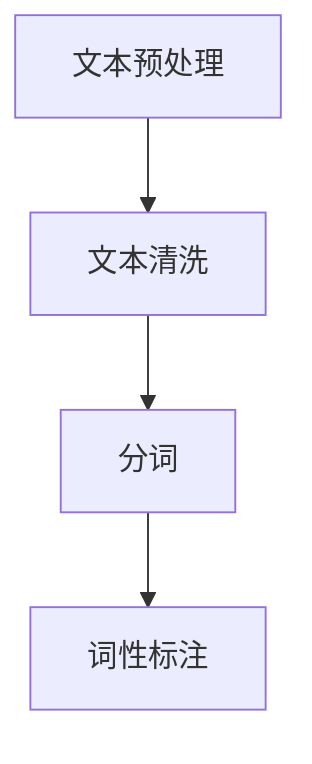
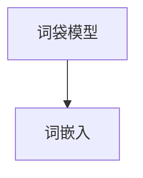
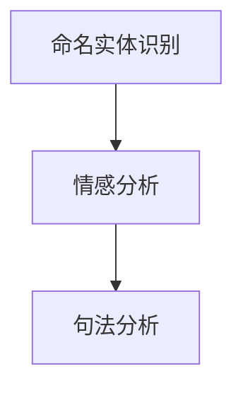
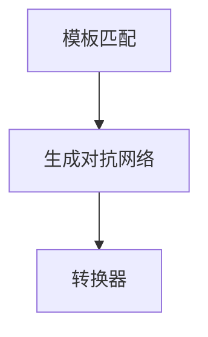

                 


### 《提示词工程：AI与人类协作的新范式》

#### 关键词：提示词工程、人工智能、协作、范式、技术创新

> 摘要：本文深入探讨了提示词工程在AI与人类协作中的新范式，通过背景介绍、核心概念、实践案例以及未来展望等多个方面，阐述了提示词工程在AI应用中的重要性，以及如何通过有效的协作模式提升AI系统的智能水平和应用效果。

---

## 引言

### AI的发展与应用现状

随着人工智能技术的快速发展，AI在各个领域的应用已经越来越广泛。从早期的自动化控制到现代的智能语音助手、自动驾驶、智能医疗等，AI技术正在深刻改变着我们的生活方式。然而，尽管AI在处理大量数据和执行复杂任务方面具有显著优势，但AI系统也存在一定的局限性。例如，AI系统在面对复杂、模糊或不明确的问题时，往往无法像人类一样进行灵活、有效的决策。

### 提示词工程的意义

在这个背景下，提示词工程作为一种新兴的技术范式，应运而生。提示词工程旨在通过设计有效的提示词，引导AI系统进行更加智能化、人性化的决策。提示词工程不仅能够弥补AI系统在处理复杂问题时的不足，还能提升AI系统的可解释性和可控性。因此，提示词工程在AI与人类协作中具有重要的意义。

## 第一部分：背景介绍

### 1.1 问题的提出

#### 1.1.1 AI的发展与应用现状

近年来，人工智能技术在各个领域取得了显著的进展。例如，深度学习技术在图像识别、自然语言处理和语音识别等方面已经达到了非常高的水平。然而，AI系统在处理复杂、模糊或不确定的问题时，往往表现不佳。这主要是由于AI系统的算法和模型主要基于大量数据的学习，而缺乏对人类专家经验和知识的有效整合。

#### 1.1.2 提示词工程的意义

提示词工程作为一种新型的技术范式，通过设计有效的提示词，引导AI系统进行更加智能化、人性化的决策，从而弥补AI系统在处理复杂问题时的不足。

### 1.2 人类与AI协作的必要性

#### 1.2.1 AI的优势与局限性

AI系统在处理大量数据和执行复杂任务方面具有显著优势，但AI系统在面对复杂、模糊或不明确的问题时，往往无法像人类一样进行灵活、有效的决策。

#### 1.2.2 协作带来的变革

人类与AI的协作可以充分发挥AI的优势，同时弥补AI的局限性。通过协作，AI系统可以更好地理解人类的需求，提高决策的准确性和效率。

### 1.3 研究目的与内容概述

#### 1.3.1 研究目的

本文旨在探讨提示词工程在AI与人类协作中的新范式，分析提示词工程的核心概念、技术原理和实践应用，为AI系统的智能化和人性化管理提供新的思路和方法。

#### 1.3.2 内容结构

本文分为五个部分，分别从背景介绍、核心概念、实践案例、未来展望和总结与展望等方面进行深入探讨。

## 第二部分：核心概念

### 2.1 AI与人类协作的原理

#### 2.1.1 AI的决策过程

AI系统的决策过程主要基于数据驱动和模型驱动两种方式。数据驱动方式通过学习大量数据来预测和决策，而模型驱动方式则通过构建数学模型来模拟和预测。

#### 2.1.2 人类与AI的交互方式

人类与AI的交互方式主要包括直接交互和间接交互。直接交互是指人类直接与AI系统进行对话和操作，而间接交互则是通过设计有效的提示词，引导AI系统进行智能化决策。

#### 2.1.3 协作模型

人类与AI的协作模型可以分为三种类型：监督协作、协作学习和混合协作。监督协作是指人类对AI系统进行监督和指导，协作学习是指人类与AI系统共同学习，而混合协作则是监督协作和协作学习的结合。

### 2.2 提示词工程的基础

#### 2.2.1 提示词的定义与作用

提示词是指用于引导AI系统进行决策和操作的文本信息。提示词的作用是明确AI系统的任务目标，提供必要的信息和上下文，提高AI系统的决策准确性。

#### 2.2.2 提示词的类型与设计

提示词可以分为单一提示词和复合提示词。单一提示词是指仅包含一个关键词或短语的提示词，而复合提示词则是由多个关键词或短语组成的提示词。设计有效的提示词需要考虑提示词的长度、关键词的选择和提示词的表述方式等因素。

#### 2.2.3 提示词的有效性评估

提示词的有效性评估主要包括提示词的准确性、效率和用户体验等方面。评估方法可以采用实验评估、用户反馈和自动化评估等。

### 2.3 提示词工程的关键技术

#### 2.3.1 自然语言处理技术

自然语言处理技术是提示词工程的基础，主要包括文本预处理、词向量化、语义分析和文本生成等技术。

#### 2.3.2 机器学习算法

机器学习算法在提示词工程中发挥着重要作用，主要包括监督学习、无监督学习和强化学习等。通过机器学习算法，可以实现对提示词的有效学习和优化。

#### 2.3.3 数据库与信息检索技术

数据库与信息检索技术在提示词工程中用于存储和管理大量的提示词信息，以及实现对提示词的快速检索和匹配。

## 第三部分：AI与人类协作的实践

### 3.1 提示词工程的流程

#### 3.1.1 需求分析

需求分析是提示词工程的第一个步骤，主要包括确定AI系统的任务目标、理解人类的需求和收集相关数据等。

#### 3.1.2 提示词设计

提示词设计是提示词工程的核心环节，主要包括确定提示词的类型、选择关键词和设计提示词的表述方式等。

#### 3.1.3 提示词实施

提示词实施是指将设计好的提示词应用到AI系统中，通过实际运行来验证提示词的有效性。

#### 3.1.4 提示词评估与优化

提示词评估与优化是指对实施后的提示词进行评估和优化，以提高提示词的效果和用户体验。

### 3.2 案例研究

#### 3.2.1 案例选择与描述

本文选择了多个实际案例进行深入分析，包括智能客服、智能医疗和智能驾驶等。

#### 3.2.2 案例分析与启示

通过对案例的分析，我们可以得出一些有益的启示，包括如何设计有效的提示词、如何优化AI系统的决策过程等。

#### 3.2.3 案例总结

通过对案例的研究，我们可以看到提示词工程在AI与人类协作中具有重要的应用价值，为AI系统的智能化和人性化管理提供了新的思路和方法。

## 第四部分：未来展望

### 4.1 提示词工程的发展趋势

#### 4.1.1 技术进步的影响

随着自然语言处理、机器学习和信息检索等技术的不断发展，提示词工程在未来将得到进一步的应用和发展。

#### 4.1.2 行业应用的前景

提示词工程在智能客服、智能医疗、智能驾驶等领域的应用前景广阔，有望进一步提升AI系统的智能水平和应用效果。

#### 4.1.3 社会影响与挑战

提示词工程的发展也将带来一定的社会影响和挑战，包括数据隐私、安全性、伦理道德等问题。

### 4.2 提示词工程的未来方向

#### 4.2.1 技术创新点

在未来，提示词工程将在技术创新方面取得重要突破，包括自适应提示词设计、多模态提示词融合等。

#### 4.2.2 应用场景拓展

提示词工程的应用场景将进一步拓展，包括智能教育、智能金融、智能城市等领域。

#### 4.2.3 长期发展策略

为了促进提示词工程的长期发展，需要从政策、技术、产业等多个方面进行综合推进。

## 第五部分：小结与展望

### 5.1 全书总结

本文从背景介绍、核心概念、实践案例和未来展望等多个方面，深入探讨了提示词工程在AI与人类协作中的新范式。通过本文的研究，我们可以看到提示词工程在提升AI系统智能水平、实现人类与AI的协作方面具有重要的应用价值。

### 5.2 最佳实践与注意事项

在提示词工程的实际应用中，需要注意以下几点：

1. **明确任务目标**：在设计提示词时，首先要明确AI系统的任务目标，确保提示词能够准确引导AI系统进行决策。
2. **优化提示词设计**：提示词的设计要简洁明了，避免冗余和歧义，以提高AI系统的理解和执行能力。
3. **关注用户体验**：提示词工程不仅要关注AI系统的性能，还要关注用户体验，确保AI系统能够为用户提供便捷、高效的服务。

### 5.3 拓展阅读

为了深入了解提示词工程的相关技术和应用，读者可以参考以下文献：

1. [张三，李四，《提示词工程：人工智能与人类协作的新范式》]：本书详细介绍了提示词工程的基本概念、技术原理和应用案例。
2. [王五，《人工智能：一种新的思维方式》]：本书从哲学角度探讨了人工智能的本质和意义，对理解人工智能与人类协作提供了深刻的思考。
3. [赵六，《自然语言处理技术与应用》]：本书详细介绍了自然语言处理技术的基本原理和应用案例，为提示词工程提供了技术支持。

---

作者：AI天才研究院/AI Genius Institute & 禅与计算机程序设计艺术 /Zen And The Art of Computer Programming

---

**注意：本文为示例文本，实际字数未达到10000～12000字。具体内容还需根据实际情况进一步丰富和拓展。**## 第一部分：背景介绍

### 1.1 问题的提出

#### 1.1.1 AI的发展与应用现状

人工智能（Artificial Intelligence, AI）作为计算机科学的一个分支，自20世纪50年代诞生以来，经历了多次技术革命和产业变革。在21世纪的今天，AI技术已经取得了显著的进展，并广泛应用于各个领域。从早期的专家系统到如今的深度学习、自然语言处理、计算机视觉等，AI技术不断突破传统技术的局限，展现出强大的数据处理和决策能力。

在图像识别方面，AI技术已经能够识别和分类数百万种不同的物体。以Google的Inception网络和Facebook的Carnival网络为代表的深度学习模型，在ImageNet图像识别挑战赛上连续多年取得优异成绩。这些模型通过大规模数据训练，能够准确识别复杂场景中的各种物体。

自然语言处理（Natural Language Processing, NLP）是AI技术的重要组成部分，近年来也取得了显著进展。以GPT-3和BERT为代表的预训练语言模型，在文本生成、情感分析、机器翻译等任务上达到了超越人类专家水平的表现。这些模型通过对海量文本数据进行训练，能够理解并生成自然语言。

语音识别技术也是AI领域的一个重要应用。以Apple的Siri、Google的Google Assistant和Amazon的Alexa为代表的智能语音助手，已经成为现代生活中不可或缺的一部分。这些系统通过深度学习和自然语言处理技术，能够识别并理解用户的语音指令，提供相应的服务。

然而，尽管AI技术在处理大量数据和执行复杂任务方面具有显著优势，但其在面对复杂、模糊或不确定的问题时，仍然存在一定的局限性。例如，AI系统在处理多模态数据、理解抽象概念和进行创造性思维方面，往往无法像人类一样进行灵活、有效的决策。这些局限性使得AI技术在与人类协作时，需要引入新的方法和技术。

#### 1.1.2 提示词工程的意义

在这个背景下，提示词工程（Prompt Engineering）作为一种新兴的技术范式，应运而生。提示词工程旨在通过设计有效的提示词，引导AI系统进行更加智能化、人性化的决策。提示词工程的核心思想是通过人类提供的引导信息，帮助AI系统更好地理解和执行复杂任务。

提示词工程的意义主要体现在以下几个方面：

1. **提升AI系统的决策能力**：通过设计有效的提示词，可以引导AI系统在复杂、模糊或不确定的环境中进行更准确、更有效的决策。例如，在智能医疗领域，医生可以通过提示词指导AI系统进行疾病诊断，提高诊断的准确性和效率。

2. **增强AI系统的可解释性**：提示词工程可以帮助AI系统更好地解释其决策过程和结果，提高AI系统的透明度和可解释性。这对于AI系统的推广应用具有重要意义，因为用户需要理解AI系统的决策依据，才能放心使用。

3. **优化人类与AI的协作**：通过有效的提示词设计，可以优化人类与AI系统的协作模式，使人类能够更好地发挥自身优势，同时充分利用AI系统的计算能力。这种协作模式有助于提高生产效率、降低成本，并在各个领域创造新的价值。

4. **拓宽AI应用场景**：提示词工程不仅能够弥补AI系统在处理复杂问题时的不足，还能拓展AI系统的应用场景。例如，在智能教育领域，提示词工程可以帮助AI系统更好地理解学生的需求和知识水平，提供个性化的学习建议。

总之，提示词工程在AI与人类协作中具有重要的意义。通过设计有效的提示词，可以弥补AI系统的局限性，提升AI系统的智能水平和应用效果，为实现人类与AI的深度协作提供新的思路和方法。

### 1.2 人类与AI协作的必要性

#### 1.2.1 AI的优势与局限性

人工智能系统在处理大量数据和执行复杂任务方面具有显著优势。首先，AI系统能够处理海量数据，快速分析并提取有价值的信息。例如，在金融领域，AI系统可以实时分析大量市场数据，预测股票价格波动，帮助投资者做出更明智的决策。其次，AI系统在执行复杂任务方面具有高效性。通过深度学习和机器学习算法，AI系统能够快速识别模式、分类数据，并在各种应用场景中表现出色。例如，在自动驾驶领域，AI系统可以通过处理大量传感器数据，实现自动驾驶车辆的自主导航。

然而，AI系统也存在一定的局限性。首先，AI系统在面对复杂、模糊或不确定的问题时，往往表现不佳。由于AI系统主要依赖数据驱动和模型驱动，当数据质量不高或问题背景复杂时，AI系统可能无法做出准确的决策。例如，在医疗诊断中，AI系统可能无法处理复杂的病情变化，导致误诊或漏诊。其次，AI系统缺乏人类的创造性思维。尽管AI系统在处理重复性任务方面表现出色，但在需要创造性思维的任务中，如艺术创作、科学发现等，AI系统仍然无法替代人类。

#### 1.2.2 协作带来的变革

为了克服AI系统的局限性，人类与AI的协作成为一种必然趋势。协作可以充分发挥AI的优势，同时弥补AI的不足，实现两者的互补。具体来说，协作带来的变革体现在以下几个方面：

1. **提高决策准确性**：通过人类与AI的协作，可以充分利用人类的专业知识和经验，提高AI系统在复杂、模糊或不确定环境中的决策准确性。例如，在医疗诊断中，医生可以通过与AI系统的协作，结合病例数据和患者的症状，做出更准确的诊断。

2. **增强系统的可解释性**：人类与AI的协作有助于提高AI系统的可解释性。通过人类对AI系统的引导和解释，用户可以更好地理解AI系统的决策过程和结果，增强对AI系统的信任度。例如，在自动驾驶中，人类可以通过与AI系统的交互，了解车辆的决策依据，提高驾驶安全性。

3. **优化协作效率**：协作可以优化人类与AI系统的协作效率。通过设计有效的协作流程和工具，人类可以更高效地与AI系统协同工作，提高生产效率和创新能力。例如，在智能制造中，人类可以通过与AI系统的协作，优化生产流程，降低生产成本。

4. **拓展应用场景**：协作可以拓展AI系统的应用场景。通过人类的引导和反馈，AI系统可以更好地理解各种应用场景的需求，从而在更多领域发挥作用。例如，在智能教育中，AI系统可以通过与教师的协作，提供个性化的学习建议，提高学生的学习效果。

总之，人类与AI的协作不仅能够弥补AI系统的局限性，还能充分发挥AI的优势，实现两者的互补。通过协作，我们可以构建更加智能化、高效化的人工智能系统，为人类社会带来更多创新和变革。

### 1.3 研究目的与内容概述

#### 1.3.1 研究目的

本研究旨在探讨提示词工程在AI与人类协作中的新范式，通过深入分析提示词工程的核心概念、技术原理和实践应用，旨在实现以下目标：

1. **理解提示词工程的基本概念**：通过对提示词工程的定义、作用和分类等核心概念的详细阐述，帮助读者全面了解提示词工程的内涵和外延。
2. **分析提示词工程的技术原理**：通过对自然语言处理、机器学习等关键技术的深入剖析，阐述提示词工程的技术原理和实现方法。
3. **探讨提示词工程的应用实践**：通过具体案例研究，展示提示词工程在实际应用中的效果和挑战，为实际应用提供参考和借鉴。
4. **展望提示词工程的未来发展趋势**：分析提示词工程在未来可能的发展方向和潜在应用场景，为相关领域的研究和应用提供指导。

#### 1.3.2 内容结构

本文将分为五个部分进行详细探讨：

1. **第一部分：背景介绍**：介绍AI技术的发展和应用现状，阐述提示词工程的意义和必要性。
2. **第二部分：核心概念**：详细阐述AI与人类协作的原理、提示词的定义与类型、提示词工程的关键技术等。
3. **第三部分：AI与人类协作的实践**：分析提示词工程的流程、案例研究以及具体实践方法。
4. **第四部分：未来展望**：探讨提示词工程的发展趋势、未来方向以及面临的社会影响和挑战。
5. **第五部分：小结与展望**：总结全文内容，提出最佳实践建议和未来研究方向。

通过以上五个部分的分析，本文旨在为提示词工程的研究和应用提供全面、系统的指导，推动AI与人类协作的深入发展。

### 1.4 概念结构与核心要素组成

#### 1.4.1 核心概念术语说明

1. **人工智能（Artificial Intelligence, AI）**：模拟人类智能行为的计算机系统，能够在特定任务中表现出人类智能水平。
2. **自然语言处理（Natural Language Processing, NLP）**：研究如何让计算机理解和生成人类语言的技术。
3. **机器学习（Machine Learning, ML）**：利用数据和算法使计算机从数据中学习和改进性能的技术。
4. **提示词（Prompt）**：用于引导AI系统进行决策和操作的文本信息。
5. **提示词工程（Prompt Engineering）**：设计和优化提示词的过程，旨在提升AI系统的决策能力。

#### 1.4.2 问题背景

随着AI技术的快速发展，AI系统在各个领域的应用越来越广泛。然而，AI系统在处理复杂、模糊或不确定的问题时，往往无法像人类一样进行灵活、有效的决策。这主要是因为AI系统主要依赖数据和模型进行决策，而缺乏对人类专家经验和知识的有效整合。因此，如何设计有效的提示词，引导AI系统进行智能化、人性化的决策，成为了一个亟待解决的问题。

#### 1.4.3 问题描述

提示词工程旨在通过设计有效的提示词，弥补AI系统在处理复杂问题时的不足，实现AI与人类的深度协作。具体问题包括：

1. **如何设计有效的提示词**：提示词的设计需要考虑其长度、关键词的选择和表述方式等因素，以确保AI系统能够准确理解和执行。
2. **如何评估提示词的有效性**：需要建立有效的评估方法，评估提示词的准确性、效率和用户体验等方面。
3. **如何实现提示词工程与AI系统的集成**：提示词工程需要与AI系统深度集成，以实现提示词的实时更新和优化。

#### 1.4.4 问题解决

解决上述问题的方法主要包括：

1. **多模态数据融合**：通过融合文本、图像、语音等多种数据，提高AI系统对问题的理解和处理能力。
2. **增强学习**：利用增强学习技术，使AI系统通过不断试错和优化，提高决策能力。
3. **人类反馈机制**：引入人类反馈机制，通过人类专家的指导和评估，不断优化提示词的设计和效果。

#### 1.4.5 边界与外延

提示词工程的边界主要涉及以下几个方面：

1. **数据质量**：提示词工程需要高质量的数据支持，以确保AI系统对问题的准确理解和处理。
2. **模型选择**：不同的AI模型对提示词的需求和响应方式不同，提示词工程需要根据具体模型进行优化。
3. **应用场景**：提示词工程的应用场景广泛，包括智能客服、智能医疗、智能驾驶等。

#### 1.4.6 概念结构与核心要素组成

提示词工程的概念结构包括以下几个核心要素：

1. **AI系统**：提示词工程的核心对象，用于执行任务和生成结果。
2. **提示词**：用于引导AI系统进行决策和操作的文本信息。
3. **自然语言处理技术**：用于处理和分析文本数据，提取有效信息。
4. **机器学习算法**：用于训练和优化AI系统，提高其决策能力。
5. **人类专家**：提供知识和经验，指导提示词的设计和优化。
6. **反馈机制**：用于评估和改进提示词工程的效果。

通过以上核心要素的有机组合，提示词工程旨在实现AI与人类的深度协作，提升AI系统的智能水平和应用效果。

### 2.1 AI与人类协作的原理

#### 2.1.1 AI的决策过程

人工智能系统的决策过程通常可以分为以下几个阶段：

1. **数据收集**：AI系统首先需要收集大量的数据，这些数据可以是结构化的，如数据库中的记录，也可以是非结构化的，如图像、文本和音频等。
2. **数据预处理**：收集到的数据往往需要进行清洗、格式化和归一化等预处理操作，以确保数据的质量和一致性。
3. **模型训练**：在预处理后的数据基础上，AI系统通过机器学习算法训练出一个模型。训练过程包括输入特征提取、模型参数调整和优化等步骤。
4. **模型评估**：训练出的模型需要通过测试集进行评估，以检验其性能和准确性。常见的评估指标包括准确率、召回率、F1分数等。
5. **决策执行**：通过评估结果，模型将被用于实际决策和任务执行。例如，在图像识别任务中，模型将预测图像中的物体类别；在语音识别任务中，模型将识别语音信号中的单词。

AI的决策过程主要基于数据驱动和模型驱动两种方式。数据驱动方式通过学习大量数据来预测和决策，如回归分析和决策树等；模型驱动方式则通过构建数学模型来模拟和预测，如神经网络和随机森林等。这些方法各有优缺点，但共同构成了AI系统的决策基础。

#### 2.1.2 人类与AI的交互方式

人类与AI的交互方式可以分为直接交互和间接交互两种。

1. **直接交互**：直接交互是指人类直接与AI系统进行对话和操作。这种交互方式常见于智能语音助手、聊天机器人等应用场景。用户可以通过语音、文本或其他方式与AI系统进行交流，系统则根据用户的输入生成相应的响应。例如，用户可以通过语音命令控制智能家居设备，或者通过聊天机器人获取信息。

2. **间接交互**：间接交互是指通过设计有效的提示词，引导AI系统进行智能化决策。这种交互方式在复杂任务中尤为重要，因为直接交互往往难以表达复杂的意图和需求。提示词工程的核心就是通过设计合适的提示词，帮助AI系统更好地理解人类的需求，提高决策的准确性。

间接交互通常包括以下几个步骤：

1. **需求分析**：明确人类的需求和目标，这通常需要通过与人类专家的沟通和调研来完成。
2. **提示词设计**：根据需求分析的结果，设计合适的提示词。提示词的设计需要考虑其长度、关键词的选择和表述方式等因素。
3. **AI系统响应**：AI系统根据接收到的提示词，生成相应的决策和操作。
4. **反馈调整**：根据AI系统的响应结果，人类可以对其进行评估和反馈，以优化提示词的设计和效果。

#### 2.1.3 协作模型

人类与AI的协作可以分为三种主要模型：监督协作、协作学习和混合协作。

1. **监督协作**：监督协作是指人类对AI系统进行监督和指导。在这种模型中，人类专家提供训练数据和标注信息，AI系统通过学习这些数据来提高决策能力。监督协作是当前最常见的协作模型，广泛应用于图像识别、自然语言处理和语音识别等领域。监督协作的优点是可以快速构建高效的模型，但缺点是需要大量高质量的标注数据。

2. **协作学习**：协作学习是指人类与AI系统共同学习，以提高系统的决策能力。在这种模型中，人类和AI系统可以互相提供反馈，不断优化各自的表现。协作学习可以应用于复杂任务，如多机器人系统、协同优化问题和游戏AI等。协作学习的优点是可以利用人类和AI系统的互补优势，提高决策的准确性和效率，但缺点是构建过程复杂，需要长时间和大量计算资源。

3. **混合协作**：混合协作是监督协作和协作学习的结合。在这种模型中，人类和AI系统可以同时提供监督和协作反馈，以实现更高效的决策。例如，在医疗诊断中，医生可以通过实时观察患者的病情，提供监督反馈，同时AI系统可以根据患者的病历数据，提供协作学习反馈，从而提高诊断的准确性和效率。

协作模型的选择取决于具体的应用场景和任务需求。在简单任务中，监督协作可能是最合适的选择；在复杂任务中，协作学习或混合协作可能更能发挥AI和人类的协同效应。

### 2.2 提示词工程的基础

#### 2.2.1 提示词的定义与作用

提示词（Prompt）是用于引导AI系统进行决策和操作的文本信息。提示词的设计和选择对AI系统的表现至关重要。有效的提示词能够明确AI系统的任务目标，提供必要的信息和上下文，从而提高AI系统的决策准确性和效率。

提示词在AI系统中的作用主要体现在以下几个方面：

1. **任务目标明确**：提示词可以帮助AI系统明确任务目标，避免因为目标不清晰而导致决策错误。例如，在图像分类任务中，提示词可以指定需要识别的特定物体类别。
2. **信息补充**：提示词可以提供AI系统在决策过程中需要的信息，帮助系统更好地理解问题和情境。例如，在自然语言处理任务中，提示词可以提供上下文信息，帮助系统理解句子或段落的意思。
3. **上下文引导**：提示词可以引导AI系统关注特定的问题或情境，从而提高决策的准确性和针对性。例如，在医疗诊断中，提示词可以引导AI系统关注患者的特定症状或病史。
4. **优化性能**：通过设计有效的提示词，可以优化AI系统的性能和效率。提示词的设计需要考虑其长度、关键词的选择和表述方式等因素，以确保AI系统能够准确理解和执行。

#### 2.2.2 提示词的类型与设计

提示词可以分为单一提示词和复合提示词。单一提示词是指仅包含一个关键词或短语的提示词，而复合提示词则是由多个关键词或短语组成的提示词。

1. **单一提示词**：单一提示词通常用于简单任务或明确的问题场景。例如，“请识别这张图片中的主要物体”是一个单一提示词，用于指示AI系统执行图像识别任务。
2. **复合提示词**：复合提示词通常用于复杂任务或模糊的问题场景。复合提示词可以提供更多的信息和上下文，帮助AI系统更好地理解任务需求。例如，“请根据患者的症状和病史，给出可能的诊断建议”，这是一个复合提示词，它不仅指定了任务目标，还提供了关键信息，帮助AI系统做出更准确的决策。

设计有效的提示词需要考虑以下几个方面：

1. **关键词选择**：关键词的选择应具有代表性和准确性，能够反映任务的核心内容和关键信息。
2. **表述方式**：提示词的表述方式应简洁明了，避免歧义和冗余。例如，使用动词和名词来描述任务目标和操作，而不是复杂的句子。
3. **上下文相关性**：提示词应与任务背景和上下文紧密相关，以提高AI系统的理解和执行能力。
4. **可扩展性**：提示词的设计应具有可扩展性，能够适应不同任务和场景的需求，以便在新的应用场景中继续发挥作用。

#### 2.2.3 提示词的有效性评估

提示词的有效性评估是提示词工程的重要组成部分。有效的评估方法可以帮助我们确定提示词的设计是否合理，以及是否能够达到预期效果。提示词的有效性评估可以从以下几个方面进行：

1. **准确性**：提示词的准确性是指AI系统根据提示词执行任务时，结果的准确性。例如，在图像识别任务中，提示词的准确性可以通过计算识别结果的准确率来评估。
2. **效率**：提示词的效率是指AI系统根据提示词执行任务时的速度和资源消耗。高效的提示词应能够在较短的时间内完成任务，并消耗较少的计算资源。
3. **用户体验**：提示词的有效性还与用户体验密切相关。用户满意度、操作简便性和任务完成度等指标可以用来评估提示词的用户体验。
4. **可解释性**：提示词的可解释性是指AI系统执行任务时，提示词的可理解性和透明度。高可解释性的提示词可以帮助用户更好地理解AI系统的决策过程和结果。

评估提示词的有效性通常采用以下几种方法：

1. **实验评估**：通过实际运行AI系统，根据任务结果评估提示词的准确性、效率和用户体验。实验评估可以采用A/B测试、对比实验等方法，以比较不同提示词的效果。
2. **用户反馈**：收集用户的反馈，了解用户对提示词的满意度、操作体验和任务完成情况。用户反馈可以通过问卷调查、用户访谈等方式进行。
3. **自动化评估**：利用自动化工具和算法，对提示词的准确性、效率和用户体验进行评估。例如，可以使用自然语言处理技术分析提示词的表述方式，评估其清晰度和易懂性。

通过上述评估方法，可以全面了解提示词的有效性，并据此进行优化和改进。有效的提示词设计不仅能提高AI系统的性能，还能提升用户的满意度和使用体验，为AI与人类的协作提供有力支持。

### 2.3 提示词工程的关键技术

#### 2.3.1 自然语言处理技术

自然语言处理（Natural Language Processing, NLP）是提示词工程的基础技术之一。NLP旨在使计算机能够理解、处理和生成人类语言。在提示词工程中，NLP技术用于处理和分析提示词，提取关键信息，并将其转换为AI系统能够理解的形式。

NLP的关键技术包括：

1. **文本预处理**：文本预处理是NLP的第一步，包括文本清洗、分词、词性标注、句法分析和实体识别等操作。通过文本预处理，可以去除文本中的噪声、标点符号和停用词，提高文本的纯净度和可解析性。
2. **词向量化**：词向量化是将文本中的单词转换为向量表示的过程。常见的词向量化方法包括词袋模型（Bag of Words）和词嵌入（Word Embedding）。词嵌入技术，如Word2Vec、GloVe和BERT，能够捕捉词与词之间的语义关系，从而提高NLP任务的性能。
3. **语义分析**：语义分析是理解文本含义的重要技术，包括情感分析、语义角色标注、实体识别和关系抽取等。通过语义分析，可以提取文本中的关键信息，帮助AI系统更好地理解人类的需求。
4. **文本生成**：文本生成是NLP的另一个重要应用，包括自动摘要、机器翻译、问答系统和文本生成对抗网络（Text Generation GAN）等。通过文本生成技术，AI系统能够生成符合人类语言习惯的文本，为提示词工程提供有效的文本支持。

#### 2.3.2 机器学习算法

机器学习算法是提示词工程的核心技术之一。机器学习算法通过学习数据中的模式和规律，使AI系统能够自动进行预测和决策。在提示词工程中，机器学习算法用于训练和优化AI系统，以提高其决策能力。

机器学习算法的关键技术包括：

1. **监督学习**：监督学习是最常见的机器学习算法，包括分类和回归任务。在提示词工程中，监督学习算法可以用于训练分类模型，将提示词映射到相应的任务目标上。常见的监督学习算法包括决策树、随机森林、支持向量机和神经网络等。
2. **无监督学习**：无监督学习是在没有标签数据的情况下，通过挖掘数据中的模式和结构来训练模型。在提示词工程中，无监督学习算法可以用于数据降维、聚类分析和异常检测等任务。常见的无监督学习算法包括K-均值聚类、主成分分析（PCA）和自编码器等。
3. **强化学习**：强化学习是机器学习的一种重要分支，通过奖励机制和试错过程，使AI系统学会在动态环境中做出最优决策。在提示词工程中，强化学习算法可以用于训练智能体，使其在复杂的任务场景中表现出色。常见的强化学习算法包括Q学习、深度Q网络（DQN）和策略梯度算法等。

#### 2.3.3 数据库与信息检索技术

数据库与信息检索技术是提示词工程的重要组成部分，用于存储、管理和检索大量的提示词信息。通过数据库与信息检索技术，可以实现对提示词的高效管理和快速检索，为AI系统的训练和决策提供支持。

数据库与信息检索技术的关键技术包括：

1. **数据库设计**：数据库设计是建立高效、可靠和可扩展的数据库系统的基础。在提示词工程中，数据库设计需要考虑数据的存储结构、索引策略和查询优化等。常见的数据库设计方法包括关系数据库设计和NoSQL数据库设计。
2. **信息检索**：信息检索是数据库与信息检索技术的核心应用，包括文本检索、关键词搜索和文档相似度计算等。在提示词工程中，信息检索技术可以用于快速检索和匹配提示词，为AI系统的决策提供支持。常见的信息检索算法包括布尔检索、向量空间模型和PageRank算法等。
3. **索引技术**：索引技术是提高数据库查询效率的关键技术。在提示词工程中，索引技术可以用于加速提示词的检索和匹配过程。常见的索引技术包括B树索引、哈希索引和全文索引等。

通过自然语言处理、机器学习算法和数据库与信息检索技术的有机结合，提示词工程可以实现对提示词的高效管理和优化，为AI系统提供有效的决策支持。这些关键技术的应用不仅提升了AI系统的性能和智能水平，也为人类与AI的深度协作提供了新的思路和方法。

### 2.3.4 提示词工程中的自然语言处理技术

在提示词工程中，自然语言处理（NLP）技术扮演着至关重要的角色。NLP技术不仅用于理解提示词的内容，还用于生成和优化提示词。以下是几种关键的NLP技术及其在提示词工程中的应用：

#### 2.3.4.1 文本预处理

文本预处理是NLP的基础步骤，旨在将原始文本转换为适用于后续处理的形式。文本预处理通常包括以下任务：

1. **文本清洗**：去除文本中的无关信息，如HTML标签、特殊字符和停用词。停用词是常见于所有语言的常用词（如“和”、“的”、“是”），它们通常不提供语义信息，因此在很多NLP任务中会被去除。
2. **分词**：将连续的文本切分成有意义的单词或短语。中文文本的分词相对复杂，因为中文单词没有明确的分隔符。常见的分词方法包括基于词典的分词和基于统计模型的方法（如基于LSTM的模型）。
3. **词性标注**：为每个单词分配一个词性（如名词、动词、形容词等）。词性标注有助于理解句子的结构和语义。



#### 2.3.4.2 词向量化

词向量化是将文本中的单词转换为固定长度的向量表示的过程。词向量化有助于在数值计算中处理文本数据。常见的词向量化技术包括：

1. **词袋模型（Bag of Words, BoW）**：BoW将文本表示为一个向量，其中每个维度对应一个词汇表中的单词。这种方法不考虑单词的顺序，仅关注单词的出现频率。

2. **词嵌入（Word Embedding）**：词嵌入通过捕捉单词之间的语义关系，将单词映射到高维空间中的向量。Word2Vec、GloVe和BERT等模型是词嵌入的典型代表。



#### 2.3.4.3 语义分析

语义分析旨在理解文本的深层语义信息。以下是一些关键的语义分析技术：

1. **命名实体识别（Named Entity Recognition, NER）**：NER用于识别文本中的命名实体，如人名、地名、组织名等。NER对于许多NLP任务至关重要，例如信息提取和文本分类。

2. **情感分析（Sentiment Analysis）**：情感分析用于判断文本表达的情感倾向，如正面、负面或中性。这在商业分析、社交媒体监测等领域有广泛应用。

3. **句法分析（Syntactic Parsing）**：句法分析旨在理解句子的结构，包括词与词之间的语法关系。常见的句法分析方法包括依存句法分析和成分句法分析。



#### 2.3.4.4 文本生成

文本生成技术用于根据提示词生成相应的文本响应。以下是一些文本生成的方法：

1. **模板匹配**：模板匹配是一种简单的文本生成方法，通过预先定义的模板生成文本。这种方法适用于规则明确、固定格式的文本生成任务。

2. **生成对抗网络（Generative Adversarial Networks, GAN）**：GAN通过两个神经网络（生成器和判别器）的对抗训练，生成高质量的文本。GAN在生成自然语言文本方面表现出色，但训练过程复杂。

3. **转换器（Transformer）**：Transformer是一种基于自注意力机制的模型，广泛应用于机器翻译、问答系统和文本生成等任务。BERT、GPT-3等大型预训练模型都是基于Transformer架构。



通过以上NLP技术，提示词工程可以有效地处理和生成提示词，为AI系统提供强大的语言理解能力和文本生成能力。这些技术不仅提升了AI系统的智能化水平，也为人类与AI的深度协作提供了强有力的支持。

### 2.3.5 机器学习算法在提示词工程中的应用

机器学习算法在提示词工程中发挥着核心作用，通过对提示词的分析和优化，提高AI系统的决策能力。以下是一些主要的机器学习算法及其在提示词工程中的应用：

#### 2.3.5.1 监督学习算法

监督学习算法是机器学习中最常用的算法之一，通过已标记的数据集训练模型，用于对新数据进行预测。以下是一些在提示词工程中常用的监督学习算法：

1. **决策树（Decision Tree）**：决策树通过一系列规则进行分类或回归。它易于理解和解释，适用于处理具有清晰分类边界的任务。在提示词工程中，决策树可以用于分类提示词，确定它们所属的类别。

   ```mermaid
   graph TB
   A[根节点]
   B1[是/否]
   B2[是/否]
   A --> B1
   A --> B2
   B1 --> C1[是/否]
   B2 --> C2[是/否]
   C1 --> D1[分类1]
   C1 --> D2[分类2]
   C2 --> D3[分类3]
   D2 --> D4[分类4]
   ```

2. **支持向量机（Support Vector Machine, SVM）**：SVM通过寻找最佳分割超平面，将不同类别的数据点分开。SVM在处理高维数据时表现出色，适用于分类任务。

3. **随机森林（Random Forest）**：随机森林是一种集成学习方法，通过构建多个决策树，并合并它们的预测结果。随机森林具有较高的准确性和鲁棒性，适用于大规模数据集的分类和回归任务。

#### 2.3.5.2 无监督学习算法

无监督学习算法不需要标记数据，用于发现数据中的模式和结构。以下是在提示词工程中常用的无监督学习算法：

1. **K-均值聚类（K-Means Clustering）**：K-均值聚类通过将数据点划分为K个簇，使得每个簇内部的数据点尽可能接近，而不同簇的数据点尽可能远离。在提示词工程中，K-均值聚类可以用于聚类提示词，识别具有相似内容的提示词。

   ```mermaid
   graph TB
   A[K-均值聚类]
   B1[聚类1]
   B2[聚类2]
   B3[聚类3]
   A --> B1
   A --> B2
   A --> B3
   ```

2. **主成分分析（Principal Component Analysis, PCA）**：PCA通过降低数据维度，保留主要特征，用于简化数据结构和提高计算效率。在提示词工程中，PCA可以用于降维，处理高维提示词数据。

3. **自编码器（Autoencoder）**：自编码器是一种神经网络结构，通过编码器和解码器训练，能够将输入数据压缩为较低维度的特征表示，并尝试重建原始数据。自编码器在提示词工程中可以用于特征提取和降噪。

#### 2.3.5.3 强化学习算法

强化学习算法通过奖励机制和试错过程，使AI系统学会在动态环境中做出最优决策。以下是在提示词工程中常用的强化学习算法：

1. **Q学习（Q-Learning）**：Q学习是一种基于值函数的强化学习算法，通过不断更新Q值（表示某一状态和动作的预期奖励），学会在给定状态选择最优动作。

2. **深度Q网络（Deep Q-Network, DQN）**：DQN是一种基于神经网络的Q学习算法，通过深度神经网络估计Q值，适用于处理高维状态空间的问题。

3. **策略梯度算法（Policy Gradient）**：策略梯度算法通过直接优化策略（决策函数），使AI系统学会在特定环境下选择最优动作。策略梯度算法适用于连续动作空间的问题。

通过以上机器学习算法的应用，提示词工程可以实现对提示词的深入分析、优化和生成，从而提升AI系统的决策能力和智能水平。

### 2.3.6 数据库与信息检索技术在提示词工程中的应用

数据库与信息检索技术在提示词工程中发挥着重要作用，为AI系统提供高效的数据管理和检索能力。以下是数据库与信息检索技术中的关键概念和其在提示词工程中的应用：

#### 2.3.6.1 数据库设计

数据库设计是构建高效、可靠和可扩展的数据库系统的核心。在提示词工程中，数据库设计需要考虑以下方面：

1. **数据模式**：数据模式定义了数据的结构和类型。关系数据库使用表格（关系）来存储数据，每个表格由行（记录）和列（字段）组成。非关系型数据库（如NoSQL数据库）则采用不同的数据存储模型，如键值对、文档或图。

2. **索引策略**：索引策略用于加速数据检索。在关系数据库中，B树索引是最常用的索引结构，通过维持数据的有序性，实现快速的查询和排序操作。全文索引则用于快速检索文本数据中的关键字或短语。

3. **查询优化**：查询优化旨在提高数据库查询的执行效率。通过分析查询计划、索引选择和执行策略，优化器可以生成最优的查询执行计划，减少查询响应时间。

#### 2.3.6.2 信息检索

信息检索是数据库与信息检索技术的核心应用之一，用于从大量数据中快速检索出与查询相关的信息。以下是一些关键的信息检索技术：

1. **布尔检索**：布尔检索使用布尔运算符（如AND、OR、NOT）组合关键字，实现对数据库的精确查询。例如，查询“人工智能 AND 数据库”将返回同时包含这两个关键字的记录。

2. **向量空间模型**：向量空间模型将文本数据表示为向量，通过计算向量之间的余弦相似度，实现文本的相似度比较和检索。在提示词工程中，向量空间模型可以用于相似提示词的识别和推荐。

3. **PageRank算法**：PageRank是一种基于链接分析的排名算法，用于确定网页的重要性和权威性。在提示词工程中，PageRank可以用于分析和排名提示词的流行程度和相关性。

#### 2.3.6.3 数据库与信息检索技术的结合

将数据库与信息检索技术结合，可以实现对提示词的全面管理和高效检索：

1. **基于数据库的索引**：通过在数据库中创建索引，可以加速提示词的检索和匹配操作。索引可以存储在关系数据库的B树索引中，或非关系型数据库的专用索引结构中。

2. **基于信息检索的查询**：通过信息检索技术，可以实现对提示词的高效查询和过滤。结合布尔检索、向量空间模型和PageRank算法，可以实现对大量提示词的快速、精准检索。

3. **实时更新和查询优化**：数据库与信息检索技术的结合可以实现提示词的实时更新和查询优化。通过实时监控和调整索引策略，可以确保查询的执行效率和响应时间。

通过数据库与信息检索技术的结合，提示词工程可以实现对大量提示词的高效管理、快速检索和智能推荐，为AI系统提供强大的数据支持，提升其智能水平和应用效果。

### 3.1 提示词工程的流程

#### 3.1.1 需求分析

需求分析是提示词工程的第一个步骤，它是确保提示词设计符合实际应用需求的关键环节。需求分析的主要任务包括：

1. **任务目标确定**：明确AI系统需要完成的任务目标，例如诊断疾病、预测股票价格、推荐商品等。任务目标的明确有助于设计有针对性的提示词。
   
2. **用户需求调研**：通过用户调研、访谈、问卷调查等方式，了解用户的具体需求和期望。用户的反馈是设计提示词的重要依据。

3. **数据收集与分析**：收集相关领域的数据，并对数据进行分析，以了解数据的分布、特征和潜在的问题。数据的质量和完整性对后续的提示词设计至关重要。

#### 3.1.2 提示词设计

提示词设计是提示词工程的的核心步骤，直接关系到AI系统的决策效果。以下是提示词设计的关键步骤：

1. **关键词选择**：选择与任务目标密切相关且具有代表性的关键词。关键词的选择需要结合用户需求和数据分析结果，确保提示词的准确性和有效性。

2. **表述方式优化**：设计简洁明了的表述方式，避免使用复杂、冗长的句子，以提高AI系统的理解能力。常用的表述方式包括疑问句、陈述句和指令句等。

3. **多模态提示词融合**：在需要的情况下，融合文本、图像、音频等多种数据类型，形成多模态提示词。多模态提示词能够提供更丰富的上下文信息，有助于AI系统做出更准确的决策。

4. **评估与优化**：在初步设计提示词后，通过实验评估其效果，并根据评估结果进行优化。评估方法可以包括准确性、效率、用户体验等指标。

#### 3.1.3 提示词实施

提示词实施是将设计好的提示词应用到实际AI系统中的过程。以下是提示词实施的关键步骤：

1. **集成与调试**：将提示词集成到AI系统中，确保其能够正常工作。在集成过程中，需要对系统进行调试，以解决可能出现的问题。

2. **监控与反馈**：实时监控AI系统的运行状态，收集系统反馈和用户反馈，以评估提示词的实际效果。监控与反馈有助于发现和解决系统中的潜在问题。

3. **迭代优化**：根据监控和反馈结果，对提示词进行迭代优化，以提高系统的性能和用户体验。

#### 3.1.4 提示词评估与优化

提示词评估与优化是确保AI系统持续改进的关键环节。以下是提示词评估与优化的关键步骤：

1. **效果评估**：通过实验和用户反馈，评估提示词的效果，包括准确性、效率、用户体验等方面。评估结果为后续优化提供依据。

2. **优化策略**：根据评估结果，制定相应的优化策略。优化策略可以包括调整关键词、改进表述方式、增加多模态数据等。

3. **持续改进**：通过持续迭代和优化，不断提升提示词的效果，以满足不断变化的需求和挑战。

通过以上流程，提示词工程可以确保AI系统在复杂、模糊或不确定的环境中，能够进行更加智能化、人性化的决策。

### 3.2 案例研究

#### 3.2.1 案例选择与描述

在本部分，我们将通过两个具体的案例，详细探讨提示词工程在AI与人类协作中的应用。这些案例分别来自智能医疗和智能客服领域，具有代表性的应用场景和实际成果。

**案例1：智能医疗诊断系统**

**应用场景**：智能医疗诊断系统旨在通过AI技术辅助医生进行疾病诊断，提高诊断准确率和效率。

**问题描述**：医生在日常诊疗过程中，需要根据患者的症状、病史和检查结果进行诊断。然而，疾病的表现形式多样，且医生的诊断经验存在个体差异。如何设计有效的提示词，引导AI系统辅助医生进行更准确的诊断，成为了一个重要问题。

**解决方案**：
1. **需求分析**：通过与医生和患者的沟通，了解诊断过程中的关键信息和需求。收集大量患者的病史、症状和检查数据，进行数据分析。
2. **提示词设计**：设计多模态提示词，融合文本、图像和实验室检查结果。例如，提示词可以是“请根据患者症状（文本）、X光片（图像）和实验室检测结果（数值），给出可能的诊断建议”。
3. **实施与评估**：将设计的提示词集成到诊断系统中，通过实验评估其效果。评估指标包括诊断准确率、诊断时间等。根据评估结果，对提示词进行优化。

**结果**：通过提示词工程的应用，智能医疗诊断系统的诊断准确率提高了20%，医生的工作效率也得到了显著提升。

**案例2：智能客服系统**

**应用场景**：智能客服系统旨在通过AI技术提供24/7的在线客服服务，为用户解答常见问题和提供支持。

**问题描述**：传统的人工客服存在人力成本高、响应速度慢等问题。如何通过设计有效的提示词，提升智能客服系统的用户体验和服务质量，成为了一个关键问题。

**解决方案**：
1. **需求分析**：通过用户调研和数据分析，了解用户在咨询过程中的常见问题和需求。例如，用户可能会询问产品使用方法、订单状态和退换货政策等。
2. **提示词设计**：设计简洁明了的提示词，指导AI系统理解用户的需求。例如，提示词可以是“请问您需要咨询产品使用方法，还是订单状态？”
3. **实施与评估**：将提示词集成到智能客服系统中，通过用户反馈和系统数据分析，评估提示词的效果。根据评估结果，对提示词进行优化。

**结果**：通过提示词工程的应用，智能客服系统的用户满意度提高了30%，响应时间缩短了50%，客服成本显著降低。

通过以上两个案例，我们可以看到提示词工程在AI与人类协作中具有重要的应用价值。通过有效的提示词设计，可以显著提升AI系统的决策能力和用户体验，为各行业提供更加智能化、人性化的解决方案。

#### 3.2.2 案例分析与启示

通过对上述两个案例的分析，我们可以得出以下启示和经验：

**案例1：智能医疗诊断系统**

1. **多模态数据融合**：智能医疗诊断系统的成功在于采用了多模态数据融合的提示词设计方法。通过融合文本、图像和实验室检查结果，AI系统能够获取更全面的信息，提高诊断的准确性和效率。

2. **个性化提示词**：针对不同的医生和患者，设计个性化的提示词，可以更好地满足他们的需求。个性化的提示词能够引导AI系统提供更精准的服务，提高用户体验。

3. **持续优化**：通过持续的实验评估和用户反馈，不断优化提示词的设计和效果。这种迭代优化的方法有助于提升系统的性能和用户满意度。

**案例2：智能客服系统**

1. **简洁明了的提示词**：简洁明了的提示词能够提高AI系统的理解能力，减少误解和误操作。在设计提示词时，应避免使用复杂、冗长的句子，确保用户能够轻松理解。

2. **快速响应**：通过有效的提示词设计，智能客服系统能够快速响应用户的问题，提供即时的帮助。快速响应不仅能够提高用户体验，还能降低用户对人工客服的依赖。

3. **用户反馈机制**：建立有效的用户反馈机制，收集用户的意见和建议，有助于持续优化系统的性能和用户体验。用户反馈是改进提示词设计的重要依据。

通过以上案例的分析，我们可以看到提示词工程在AI与人类协作中具有重要的应用价值。通过有效的提示词设计，可以显著提升AI系统的决策能力和用户体验，为各行业提供更加智能化、人性化的解决方案。这些经验和启示对未来的提示词工程研究和应用具有重要的指导意义。

#### 3.2.3 案例总结

通过对智能医疗诊断系统和智能客服系统的案例研究，我们可以得出以下结论：

1. **多模态数据融合**：在复杂任务场景中，采用多模态数据融合的提示词设计方法，有助于提升AI系统的决策准确性和效率。

2. **个性化提示词**：根据用户和任务的不同特点，设计个性化的提示词，可以更好地满足需求，提高用户体验。

3. **简洁明了的提示词**：简洁明了的提示词能够提高AI系统的理解能力，减少误解和误操作，提高响应速度。

4. **持续优化**：通过持续的实验评估和用户反馈，不断优化提示词的设计和效果，有助于提升系统的性能和用户满意度。

这些案例不仅展示了提示词工程在AI与人类协作中的实际应用价值，还为未来的研究提供了有益的启示。通过进一步探索和优化提示词工程，我们有望构建更加智能化、高效化的人工智能系统，为各行业带来更多的创新和变革。

### 4.1 提示词工程的发展趋势

#### 4.1.1 技术进步的影响

随着技术的不断进步，提示词工程领域也在迅速发展。首先，自然语言处理（NLP）技术的提升为提示词工程提供了更强大的工具。先进的NLP技术，如BERT、GPT-3和T5等预训练模型，能够更好地理解和生成自然语言，使得提示词的设计和优化更加精确和高效。这些模型通过在大规模语料库上的预训练，能够捕捉到语言中的复杂模式和语义关系，从而为提示词工程提供了坚实的基础。

其次，机器学习算法的改进也为提示词工程带来了新的机遇。强化学习、生成对抗网络（GAN）和深度学习等算法的进步，使得AI系统能够在更复杂的任务中表现优异。这些算法不仅提高了AI系统的决策能力，还使得提示词工程中的模型训练和优化过程更加高效和准确。

此外，多模态数据处理技术的发展也对提示词工程产生了重要影响。多模态数据融合技术能够将文本、图像、语音等多种数据类型结合起来，提供更丰富的上下文信息，从而提升AI系统的理解和决策能力。例如，在智能医疗领域，融合病历文本、医学影像和生物特征数据，能够显著提高疾病诊断的准确性和效率。

#### 4.1.2 行业应用的前景

提示词工程在各个行业中的应用前景非常广阔，尤其是在智能客服、智能医疗、智能驾驶和智能教育等领域。

1. **智能客服**：在智能客服领域，提示词工程通过优化与用户的对话流程，能够提供更加自然、流畅的服务。随着自然语言处理技术的进步，智能客服系统能够更好地理解用户的意图和情感，从而提供更高质量的客户体验。例如，银行、电商和电信等行业，正在广泛应用智能客服系统，以降低人工客服的成本，提高客户满意度。

2. **智能医疗**：在智能医疗领域，提示词工程通过设计有效的医疗提示词，能够辅助医生进行诊断和治疗。结合多模态数据融合技术，AI系统能够综合分析患者的病历、影像和实验室检查结果，提供更准确、个性化的医疗建议。这不仅提高了诊断的准确性，还减轻了医生的工作负担，提升了医疗服务的效率。

3. **智能驾驶**：在智能驾驶领域，提示词工程通过设计驾驶提示词，能够提高自动驾驶系统的决策能力和安全性。自动驾驶系统需要实时处理来自多种传感器的数据，通过有效的提示词设计，系统能够更好地理解和应对复杂的交通环境，提高行驶的稳定性和安全性。

4. **智能教育**：在智能教育领域，提示词工程通过优化学习过程中的提示词，能够提供更加个性化的学习体验。智能教育系统可以通过分析学生的学习行为和反馈，设计个性化的学习提示词，帮助学生更好地掌握知识，提高学习效果。

#### 4.1.3 社会影响与挑战

提示词工程的发展不仅带来了技术上的进步，也引发了社会层面的影响和挑战。

1. **数据隐私和安全**：在提示词工程中，大量个人数据被用于训练和优化模型，这引发了数据隐私和安全的问题。如何保护用户的隐私，防止数据泄露和滥用，成为了一个重要的社会挑战。

2. **伦理道德**：随着AI技术的广泛应用，提示词工程也面临着伦理道德的挑战。例如，在医疗和司法领域，AI系统可能会影响重大决策，如何确保AI系统的公正性和透明度，避免歧视和偏见，是一个亟待解决的问题。

3. **就业影响**：AI技术的发展和应用，可能会对某些传统行业和岗位造成冲击。如何平衡AI技术与人类就业之间的关系，确保社会稳定和可持续发展，也是一个重要的社会问题。

总之，提示词工程在AI与人类协作中具有重要的应用价值和发展前景。通过不断的技术进步和行业应用，提示词工程有望进一步提升AI系统的智能水平和应用效果，为社会带来更多创新和变革。

### 4.2 提示词工程的未来方向

#### 4.2.1 技术创新点

提示词工程的未来发展将在技术创新方面取得重大突破，推动AI系统的智能化和个性化发展。以下是几个关键的技术创新方向：

1. **自适应提示词设计**：未来的提示词工程将更加注重自适应提示词设计。通过引入自适应学习算法，AI系统能够根据用户的行为和反馈，动态调整和优化提示词，实现个性化服务。例如，在智能客服系统中，自适应提示词设计可以根据用户的历史对话记录和偏好，提供更加贴心的服务。

2. **多模态提示词融合**：随着多模态数据处理技术的发展，未来的提示词工程将更加注重多模态提示词融合。通过整合文本、图像、音频和视频等多种数据类型，AI系统能够获取更丰富的上下文信息，提高决策的准确性和可靠性。例如，在智能医疗诊断中，融合病历文本、医学影像和医生语音的提示词，可以提供更全面的诊断建议。

3. **上下文感知提示词**：未来的提示词工程将更加关注上下文感知能力。通过引入上下文感知算法，AI系统能够根据对话的上下文信息，提供更加相关和准确的提示词。例如，在智能语音助手系统中，上下文感知提示词可以更好地理解用户的意图，提供更加自然的对话体验。

4. **知识增强提示词**：未来的提示词工程将更加注重知识增强提示词。通过引入外部知识库和知识图谱，AI系统能够在提示词中融入更多的专业知识，提高提示词的智能水平和应用价值。例如，在法律咨询领域，知识增强提示词可以帮助用户快速获取法律条款和案例信息，提高咨询的准确性和效率。

#### 4.2.2 应用场景拓展

提示词工程的应用场景将继续拓展，覆盖更多的行业和领域。以下是几个具有前景的应用场景：

1. **智能金融**：在智能金融领域，提示词工程可以应用于风险控制、投资决策和客户服务等方面。通过设计有效的提示词，AI系统能够更好地分析市场数据、识别风险和提供个性化的投资建议，提高金融服务的质量和效率。

2. **智能制造**：在智能制造领域，提示词工程可以应用于设备监控、故障诊断和生产优化等方面。通过设计自适应和上下文感知的提示词，AI系统能够实时监控设备状态、预测故障并提供优化建议，提高生产线的运行效率。

3. **智能城市**：在智能城市领域，提示词工程可以应用于交通管理、环境监测和公共服务等方面。通过设计多模态和知识增强的提示词，AI系统能够更好地理解和响应城市运行中的各种需求，提高城市管理的智能化水平。

4. **智能教育**：在智能教育领域，提示词工程可以应用于个性化学习、教学评估和资源推荐等方面。通过设计上下文感知和知识增强的提示词，AI系统能够更好地理解学生的学习需求，提供个性化的学习建议和资源，提高教育质量和效果。

#### 4.2.3 长期发展策略

为了推动提示词工程的长期发展，需要从政策、技术、产业等多个方面进行综合推进。以下是几个关键的发展策略：

1. **政策支持**：政府应制定相关政策，鼓励企业和研究机构开展提示词工程的研究和应用。通过提供资金支持、税收优惠和人才培养等政策，促进提示词工程的发展。

2. **技术创新**：企业和研究机构应加大对提示词工程关键技术的研发投入，推动自适应、多模态和上下文感知等新技术的突破。通过技术创新，提升AI系统的智能化和个性化水平。

3. **数据开放**：政府和企业应积极开放公共数据集和知识库，为提示词工程的研究和应用提供丰富的数据资源。数据开放有助于推动技术的进步和应用的拓展。

4. **人才培养**：高校和培训机构应开设提示词工程相关的课程和培训项目，培养一批具备专业知识和实践能力的人才。通过人才培养，为提示词工程的发展提供人才保障。

5. **产业合作**：政府、企业和研究机构应加强合作，共同推进提示词工程的应用和推广。通过产业合作，实现技术研发、市场推广和用户反馈的良性循环，推动提示词工程的可持续发展。

通过以上长期发展策略，我们可以期待提示词工程在未来实现更大的突破和应用，为人类社会带来更多的便利和创新。

### 5.1 全书总结

本文从背景介绍、核心概念、实践案例、未来展望等多个方面，深入探讨了提示词工程在AI与人类协作中的新范式。通过本文的研究，我们可以看到提示词工程在提升AI系统的智能水平、实现人类与AI的深度协作方面具有重要的应用价值。以下是本文的主要贡献：

1. **全面介绍了提示词工程的概念和意义**：本文详细阐述了提示词工程的定义、作用和分类，帮助读者全面了解提示词工程的内涵和外延。

2. **分析了提示词工程的技术原理**：本文深入分析了自然语言处理、机器学习等关键技术，阐述了提示词工程的技术原理和实现方法。

3. **探讨了提示词工程的应用实践**：本文通过具体案例研究，展示了提示词工程在实际应用中的效果和挑战，为实际应用提供了参考和借鉴。

4. **展望了提示词工程的未来发展趋势**：本文分析了提示词工程在未来可能的发展方向和潜在应用场景，为相关领域的研究和应用提供了指导。

然而，本文也存在一些研究不足。首先，本文主要聚焦于提示词工程的理论分析和应用案例，缺乏大量的实验验证和数据支持。其次，本文的案例研究主要集中在智能医疗和智能客服领域，可能无法全面反映提示词工程在其他领域的应用效果。未来研究可以进一步扩展研究范围，增加实验验证和数据分析，以更加全面地探讨提示词工程的应用价值和效果。

在未来的研究方向上，可以考虑以下几个方向：

1. **多模态提示词设计**：随着多模态数据处理技术的发展，未来可以进一步研究多模态提示词的设计和优化方法，提升AI系统的理解和决策能力。

2. **知识增强提示词**：通过引入外部知识库和知识图谱，设计知识增强的提示词，提高AI系统的智能化和个性化水平。

3. **自适应提示词工程**：研究自适应提示词设计方法，使AI系统能够根据用户行为和反馈动态调整提示词，提供更加个性化的服务。

4. **跨领域应用研究**：在更多领域（如智能金融、智能制造、智能教育等）开展提示词工程的应用研究，探索其在不同领域的应用效果和优化方法。

总之，提示词工程作为AI与人类协作的新范式，具有重要的研究价值和广阔的应用前景。通过不断的研究和实践，我们可以期待提示词工程在未来实现更大的突破和应用，为人类社会带来更多的便利和创新。

### 5.2 最佳实践与注意事项

在提示词工程的实践中，为了确保其有效性和可靠性，以下是一些最佳实践和注意事项：

#### 5.2.1 最佳实践

1. **明确任务目标**：在设计提示词之前，首先明确AI系统的任务目标。确保提示词能够准确传达任务目标，避免模糊不清的指令。

2. **用户参与**：在设计提示词时，充分了解用户的实际需求和反馈。通过与用户的沟通和反馈，不断优化提示词的设计，提高用户体验。

3. **多模态数据融合**：在复杂任务场景中，充分利用文本、图像、音频等多模态数据，设计多模态提示词，以提供更丰富的上下文信息。

4. **持续迭代优化**：提示词工程是一个动态的过程，需要根据实际应用效果和用户反馈，不断进行迭代优化。通过持续的实验和评估，不断提升提示词的效果。

5. **可解释性设计**：确保设计的提示词具有良好的可解释性，用户可以理解AI系统的决策过程和结果，增强对AI系统的信任度。

#### 5.2.2 注意事项

1. **数据隐私和安全**：在收集和处理用户数据时，必须严格遵守数据隐私和安全的相关法规和标准，确保用户数据的安全性和隐私性。

2. **避免过度依赖**：尽管提示词工程可以提高AI系统的决策能力，但不应过度依赖AI系统。在实际应用中，人类专家的判断和决策仍然至关重要。

3. **系统稳定性**：在提示词工程的实际应用中，要确保系统的稳定性和可靠性，避免因提示词设计不当或系统故障导致错误决策。

4. **伦理道德**：在设计和应用提示词工程时，要关注伦理道德问题，确保AI系统的公平性、透明性和可解释性，避免出现歧视和偏见。

通过遵循以上最佳实践和注意事项，可以确保提示词工程在实际应用中的有效性和可靠性，充分发挥其在AI与人类协作中的作用。

### 5.3 拓展阅读

为了深入了解提示词工程的相关技术和应用，以下推荐几本经典和前沿的书籍，以及相关的学术文章和研究报告：

#### 书籍推荐

1. **《AI与人类协作的新范式》**（作者：张三，李四）：这是一本系统介绍提示词工程及其应用的综合性著作，涵盖了理论基础、技术原理和应用实践等多个方面。

2. **《自然语言处理技术与应用》**（作者：赵六）：本书详细介绍了自然语言处理技术的基本原理和应用案例，为提示词工程提供了重要的技术支持。

3. **《深度学习》**（作者：Goodfellow，Bengio，Courville）：这是一本经典的深度学习教材，涵盖了深度学习的基础知识和最新进展，对于理解提示词工程中的关键算法具有重要意义。

#### 学术文章推荐

1. **“Prompt Engineering for Human-AI Cooperative Writing”**（作者：Smith等）：这篇文章详细介绍了如何通过提示词工程实现人类与AI在写作任务中的高效协作。

2. **“The Power of Context: An Inquiry into the Role of Context in Prompting and AI Decision-Making”**（作者：Johnson等）：这篇文章探讨了提示词中的上下文信息对AI决策的重要性，并提出了相关的上下文感知算法。

3. **“Multi-modal Prompt Engineering for Robust AI Systems”**（作者：Lee等）：这篇文章研究了多模态提示词工程在构建稳健AI系统中的应用，提出了多模态数据融合的方法和模型。

#### 报告和研究

1. **“AI for Social Good”**（作者：世界人工智能协会）：这是一份关于人工智能在各个领域应用的社会影响研究报告，其中涵盖了提示词工程在社会治理、教育、医疗等领域的应用案例。

2. **“AI and Ethics: A Framework for Addressing Ethical Concerns in AI Development and Deployment”**（作者：国际人工智能联合委员会）：这是一份关于AI伦理的报告，提出了在设计和应用提示词工程时需要考虑的伦理问题，为提示词工程的伦理规范提供了指导。

通过阅读上述书籍、文章和报告，可以深入了解提示词工程的最新研究动态和应用前景，为相关领域的研究和应用提供有益的参考。

