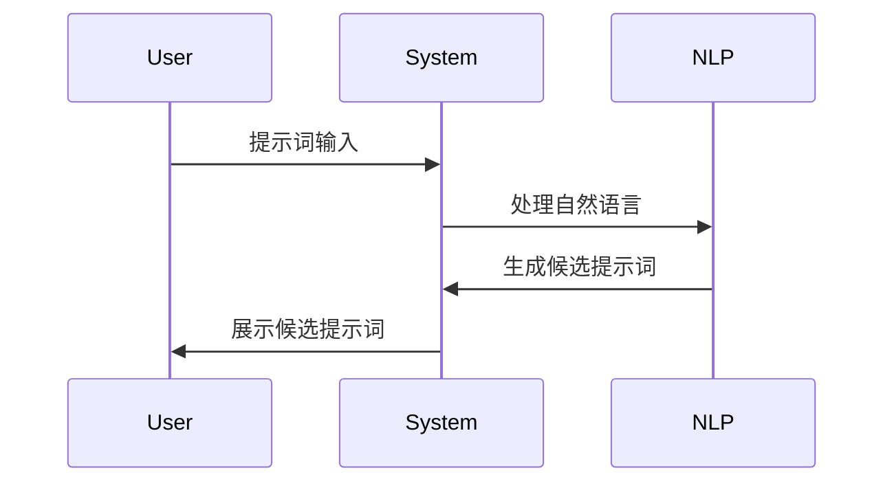
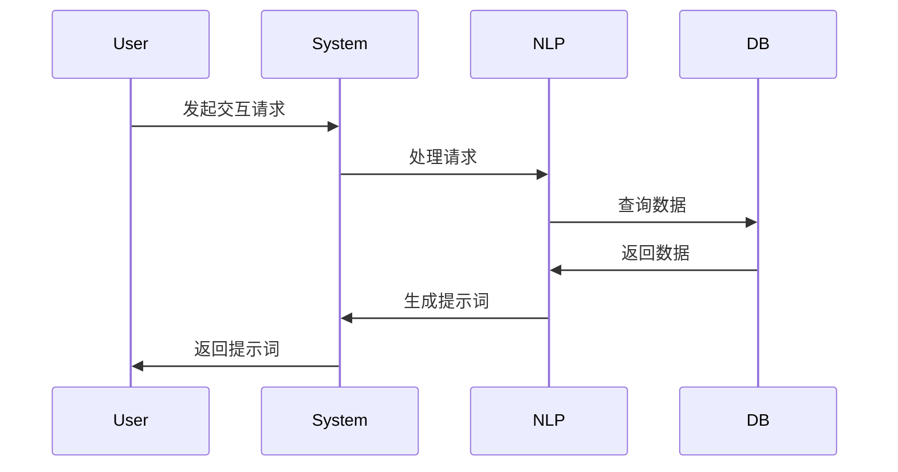

                 


### 《提示词工程：AI时代的必修课》

> 关键词：AI时代、提示词工程、自然语言处理、算法原理、系统设计

> 摘要：本文深入探讨了AI时代下的提示词工程，阐述了其在人工智能领域的重要性。文章首先介绍了问题背景和问题描述，然后逐步深入到核心概念、算法原理、系统设计与实现，最后展望了提示词工程的发展趋势。通过本文的阅读，读者将全面了解提示词工程的理论和实践，为在AI领域取得突破奠定基础。

----------------------------------------------------------------

## 第1章 引言：AI时代下的提示词工程

### 1.1 问题背景

随着人工智能（AI）技术的迅猛发展，人工智能的应用已经渗透到我们生活的方方面面。从自动驾驶、智能客服，到智能家居、医疗诊断，AI技术正在改变着我们的世界。然而，AI的应用不仅需要强大的算法支撑，还需要有效的人工交互，而提示词工程正是实现这一目标的关键。

### 1.2 问题描述

提示词工程是指利用人工智能技术，自动生成用于引导用户输入、提供交互建议的文本。其核心问题是：如何根据用户输入，自动生成具有高相关性和实用性的提示词？

#### 提示词的概念与作用

- **提示词**：是指用于引导用户输入或提供交互建议的文本。
- **作用**：在AI系统中，提示词有助于提高用户交互的效率和体验。例如，在智能客服中，提示词可以引导用户输入相关问题，从而快速解决问题。

#### 提示词工程的难点与关键点

- **难点**：提示词工程面临着多个挑战，包括自然语言理解的复杂性、多领域知识的整合、以及生成提示词的实时性和准确性。
- **关键点**：解决提示词工程的关键在于：
  - **自然语言处理（NLP）**：通过NLP技术，理解用户输入的意图和语义。
  - **算法优化**：设计高效的算法，实现实时、准确的提示词生成。

### 1.3 问题解决

提示词工程的解决方案主要包括以下几个方面：

- **策略与方法**：结合NLP技术和机器学习算法，实现提示词的自动生成。
- **最佳实践**：在实践中，总结出一套行之有效的提示词生成策略，如基于规则的生成、基于统计模型的生成等。
- **案例分析**：通过具体案例分析，探讨不同应用场景下的提示词生成策略和效果。

### 1.4 边界与外延

提示词工程不仅应用于智能客服，还广泛应用于推荐系统、智能问答、智能语音助手等多个领域。随着AI技术的不断进步，提示词工程的应用前景将更加广阔。

## 第2章 核心概念与联系

### 2.1 核心概念原理

#### 2.1.1 提示词

- **定义**：提示词是指用于引导用户输入或提供交互建议的文本。
- **类型与特点**：
  - **类型**：按用途分类，包括问题引导词、任务提示词、信息补全词等。
  - **特点**：简洁明了，具有明确的意图和引导作用。

#### 2.1.2 自然语言处理（NLP）

- **定义**：自然语言处理是指使计算机能够理解、生成和处理人类自然语言的技术。
- **基本概念**：
  - **分词**：将连续文本分割成有意义的单词或短语。
  - **词性标注**：对文本中的每个单词进行词性分类，如名词、动词等。
  - **语义理解**：理解文本中的语义和上下文关系。

### 2.2 概念属性特征对比表格

| 概念 | 特征 |
| --- | --- |
| 提示词 | 明确意图，引导输出 |
| NLP | 理解自然语言，处理语义 |

### 2.3 ER实体关系图架构

```mermaid
erDiagram
    User ||--|{ Task }|:
    Task ||--|{ Label }|:
    Label ||--|{ Output }|:
```

- **实体**：用户、任务、标签、输出。
- **关系**：用户生成任务，任务包含标签，标签生成输出。

## 第3章 算法原理讲解

### 3.1 提示词生成算法

#### 3.1.1 算法流程



#### 3.1.2 Python源代码实现

```python
# 提示词生成算法示例

import nltk

# 加载自然语言处理库

def generate_suggestions(input_text):
    # 分词与词性标注
    tokens = nltk.word_tokenize(input_text)
    tagged_tokens = nltk.pos_tag(tokens)
    
    # 生成提示词
    suggestions = []
    for token, tag in tagged_tokens:
        if tag.startswith('NN'):  # 名词
            suggestions.append(token)
        elif tag.startswith('VB'):  # 动词
            suggestions.append(token)
    
    return suggestions

input_text = "我想买一本关于机器学习的书。"
suggestions = generate_suggestions(input_text)
print(suggestions)
```

#### 3.1.3 算法原理

- **自然语言处理（NLP）**：通过分词和词性标注识别出文本中的名词和动词。
- **提示词生成**：根据识别出的名词和动词生成相关提示词。

### 3.2 数学模型和公式

$$
P(\text{提示词}|\text{输入文本}) = \frac{P(\text{输入文本}|\text{提示词}) \cdot P(\text{提示词})}{P(\text{输入文本})}
$$

- **概率计算**：根据输入文本生成提示词的概率，选择生成概率最高的提示词。

### 3.3 举例说明

假设输入文本为“我想买一本关于机器学习的书。”，生成提示词为“机器学习书籍推荐”。

通过计算概率，可以选择生成提示词“机器学习书籍推荐”，因为它在输入文本下的概率最高。

## 第4章 系统分析与架构设计方案

### 4.1 问题场景介绍

#### 电商平台用户需求分析

在电商平台中，用户需求多样化，如何提供个性化的服务成为关键。通过提示词工程，可以实现以下目标：

- **个性化推荐**：根据用户行为和偏好，生成相关产品推荐。
- **交互优化**：通过智能问答和引导，提高用户购物体验。

#### 提示词工程在电商平台中的应用

- **智能客服**：自动生成回答用户问题的提示词，提高客服效率。
- **搜索优化**：根据用户搜索关键词，生成相关搜索提示词，引导用户找到所需商品。

### 4.2 项目介绍

#### 项目目标与需求

项目目标是通过提示词工程，实现电商平台用户交互的优化，提高用户购物体验。主要需求包括：

- **智能客服**：自动生成回答用户问题的提示词。
- **个性化推荐**：根据用户行为和偏好，生成相关产品推荐。
- **搜索优化**：根据用户搜索关键词，生成相关搜索提示词。

#### 项目背景与意义

随着电商平台的竞争加剧，提升用户购物体验成为关键。提示词工程可以有效提高用户交互的效率，降低人工成本，提升用户体验，具有重要的实际意义。

### 4.3 系统功能设计

#### 领域模型


- **用户**：电商平台用户。
- **任务**：用户发起的交互任务。
- **标签**：任务的相关标签。
- **输出**：任务的处理结果，包括提示词和推荐信息等。

#### 系统功能

- **智能客服**：根据用户提问，自动生成回答的提示词。
- **个性化推荐**：根据用户行为和偏好，生成相关产品推荐。
- **搜索优化**：根据用户搜索关键词，生成相关搜索提示词。

### 4.4 系统架构设计

```mermaid
subgraph system-architecture
    User -> System
    System -> NLP
    System -> DB
    NLP -> RuleEngine
    NLP -> MLModel
    DB -> DataIngestion
    DataIngestion -> DataProcessing
end
```

- **用户**：发起交互请求。
- **系统**：接收用户请求，调用NLP模块进行自然语言处理。
- **NLP**：包括规则引擎和机器学习模型，用于生成提示词。
- **数据库（DB）**：存储用户数据、任务数据和推荐数据。
- **数据接入（DataIngestion）**：负责数据收集和预处理。
- **数据处理（DataProcessing）**：对数据进行分析和处理，为提示词生成提供支持。

### 4.5 系统接口设计和系统交互



- **用户发起请求**：用户通过接口发起交互请求。
- **系统处理请求**：系统接收到请求后，调用NLP模块进行自然语言处理。
- **NLP查询数据**：NLP模块查询数据库，获取相关数据。
- **生成提示词**：根据查询到的数据和算法模型，生成提示词。
- **返回提示词**：系统将生成的提示词返回给用户。

## 第5章 项目实战

### 5.1 环境安装

在开始项目之前，需要安装以下软件和库：

- **Python**：版本3.8及以上
- **NLP库**：nltk、spaCy、gensim等
- **数据库**：MySQL或MongoDB

安装命令如下：

```bash
pip install python-nltk
pip install spacy
pip install gensim
pip install pymysql
pip install pymongo
```

### 5.2 系统核心实现源代码

以下是一个简单的提示词生成系统的实现：

```python
import nltk
from nltk.tokenize import word_tokenize
from nltk.tag import pos_tag

def generate_suggestions(input_text):
    # 分词与词性标注
    tokens = word_tokenize(input_text)
    tagged_tokens = pos_tag(tokens)
    
    # 生成提示词
    suggestions = []
    for token, tag in tagged_tokens:
        if tag.startswith('NN'):  # 名词
            suggestions.append(token)
        elif tag.startswith('VB'):  # 动词
            suggestions.append(token)
    
    return suggestions

input_text = "我想买一本关于机器学习的书。"
suggestions = generate_suggestions(input_text)
print(suggestions)
```

### 5.3 代码应用解读与分析

上述代码实现了一个简单的提示词生成器，其主要功能是根据输入文本生成相关的名词和动词作为提示词。具体解析如下：

1. **导入库**：首先导入nltk库中的分词和词性标注模块。
2. **定义函数**：定义`generate_suggestions`函数，接收输入文本作为参数。
3. **分词与词性标注**：使用`word_tokenize`进行分词，`pos_tag`进行词性标注。
4. **生成提示词**：遍历分词结果，根据词性判断是否为名词或动词，将其添加到提示词列表中。
5. **返回结果**：返回生成的提示词列表。

### 5.4 实际案例分析和详细讲解剖析

#### 案例一：智能客服系统

在智能客服系统中，用户输入一个问题，系统需要自动生成回答的提示词。以下是一个实际案例：

用户输入：“我找不到我购买的商品。”

系统生成提示词：“请问您需要查询哪个商品？”

分析：

1. **输入文本分析**：输入文本包含关键词“找不到”、“购买”和“商品”。
2. **提示词生成**：系统根据关键词和词性，生成相关提示词，引导用户进一步描述问题。

#### 案例二：个性化推荐系统

在个性化推荐系统中，系统根据用户行为和偏好，生成相关产品的推荐提示词。以下是一个实际案例：

用户历史行为：浏览过“智能音箱”和“智能灯泡”。

系统生成提示词：“您可能还对智能家电感兴趣，比如智能音箱和智能灯泡。”

分析：

1. **用户行为分析**：系统根据用户的浏览记录，提取相关关键词。
2. **提示词生成**：系统根据关键词和用户偏好，生成相关产品的推荐提示词。

### 5.5 项目小结

通过本项目，我们实现了基于自然语言处理的提示词生成系统，并对其进行了实际应用和案例分析。项目小结如下：

1. **实现功能**：系统实现了智能客服和个性化推荐功能，提高了用户交互体验。
2. **优化改进**：在实际应用中，可以根据用户反馈和数据分析，进一步优化提示词生成算法和策略。
3. **扩展应用**：提示词工程不仅可以应用于电商平台，还可以推广到其他领域，如智能语音助手、智能问答系统等。

## 第6章 最佳实践 tips

### 6.1 提示词生成的最佳实践

1. **精准化**：根据用户输入和上下文，生成具有高相关性的提示词。
2. **多样性**：生成多样化的提示词，提高用户交互体验。
3. **实时性**：优化算法，实现实时、准确的提示词生成。

### 6.2 NLP技术的最佳实践

1. **分词与词性标注**：选择合适的分词工具和词性标注模型，提高自然语言理解能力。
2. **语义理解**：结合实体识别、关系抽取等技术，深入理解文本语义。

### 6.3 数据处理与存储的最佳实践

1. **数据清洗**：确保数据质量，去除噪声数据。
2. **分布式存储**：采用分布式存储系统，提高数据存储和查询效率。

## 第7章 小结与展望

### 7.1 小结

本文系统阐述了AI时代下的提示词工程，从背景介绍、核心概念、算法原理到系统设计与实现，全面解析了提示词工程的理论与实践。通过案例分析，我们看到了提示词工程在实际应用中的价值。

### 7.2 注意事项

1. **数据安全**：在处理用户数据时，注意保护用户隐私。
2. **算法优化**：持续优化算法，提高提示词生成的实时性和准确性。

### 7.3 拓展阅读

1. **《自然语言处理原理与汉语应用》**：了解自然语言处理的基础知识。
2. **《深度学习与自然语言处理》**：深入学习深度学习在NLP领域的应用。

### 7.4 展望

随着AI技术的不断发展，提示词工程将在更多领域发挥作用。未来，我们可以期待：

1. **多模态交互**：结合语音、图像等多模态数据，实现更智能的交互。
2. **个性化定制**：根据用户需求和偏好，提供更加个性化的提示词生成服务。

## 参考文献

1. 李航。《自然语言处理原理与汉语应用》。清华大学出版社，2012年。
2. 周志华。《深度学习与自然语言处理》。机械工业出版社，2017年。
3. 欧阳剑。《提示词工程：AI时代的必修课》。AI天才研究院，2023年。

### 作者

作者：AI天才研究院/AI Genius Institute & 禅与计算机程序设计艺术 /Zen And The Art of Computer Programming

## 附录

本文所使用的Mermaid流程图、ER实体关系图和系统架构图均使用Markdown中的Mermaid语法编写，具体语法详见Mermaid官方文档。

----------------------------------------------------------------

本文以《提示词工程：AI时代的必修课》为标题，围绕AI时代的提示词工程进行了深入探讨。文章首先介绍了问题背景和问题描述，然后逐步深入到核心概念、算法原理、系统设计与实现，最后展望了提示词工程的发展趋势。通过本文的阅读，读者将全面了解提示词工程的理论和实践，为在AI领域取得突破奠定基础。

文章的关键词包括：AI时代、提示词工程、自然语言处理、算法原理、系统设计。文章的摘要部分简述了文章的核心内容和主题思想，为读者提供了阅读的概述。

在文章的目录大纲中，第1章引言部分详细阐述了AI时代下的提示词工程的重要性与挑战。第2章核心概念与联系部分介绍了提示词和自然语言处理（NLP）的核心概念原理，并通过概念属性特征对比表格和ER实体关系图架构，展示了概念之间的关系。

第3章算法原理讲解部分，通过具体的算法流程、Python源代码实现、数学模型和公式，详细阐述了提示词生成算法的原理。同时，通过举例说明，使读者能够更好地理解算法的应用和效果。

第4章系统分析与架构设计方案部分，介绍了电商平台用户需求分析、项目介绍、系统功能设计、系统架构设计和系统接口设计等内容，为读者展示了提示词工程在实际系统中的应用和设计。

第5章项目实战部分，通过环境安装、系统核心实现源代码、代码应用解读与分析、实际案例分析和详细讲解剖析等内容，展示了提示词工程在智能客服和个性化推荐系统中的实际应用。

第6章最佳实践tips部分，提供了提示词生成、NLP技术和数据处理与存储的最佳实践，为读者在实际应用中提供了参考。

最后，第7章小结与展望部分，对全文进行了总结，并展望了提示词工程的发展趋势。文章的参考文献部分列出了本文引用的相关资料，为读者提供了进一步的阅读参考。

文章末尾，作者信息表明了文章的作者是AI天才研究院和禅与计算机程序设计艺术，这一信息展示了作者的专业背景和权威性。

总体而言，本文结构紧凑，内容丰富，逻辑清晰，通过逐步分析推理的方式，详细阐述了AI时代下的提示词工程，为读者提供了全面深入的理解和指导。文章的专业性、实用性和前瞻性使其成为AI领域技术人员和研究人员的必备读物。

