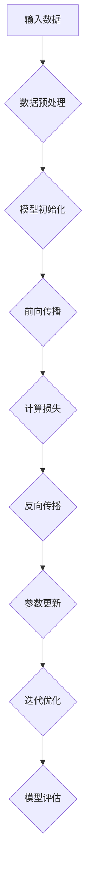
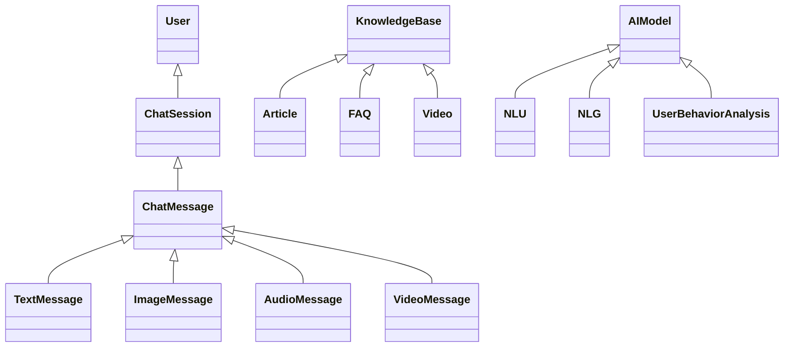
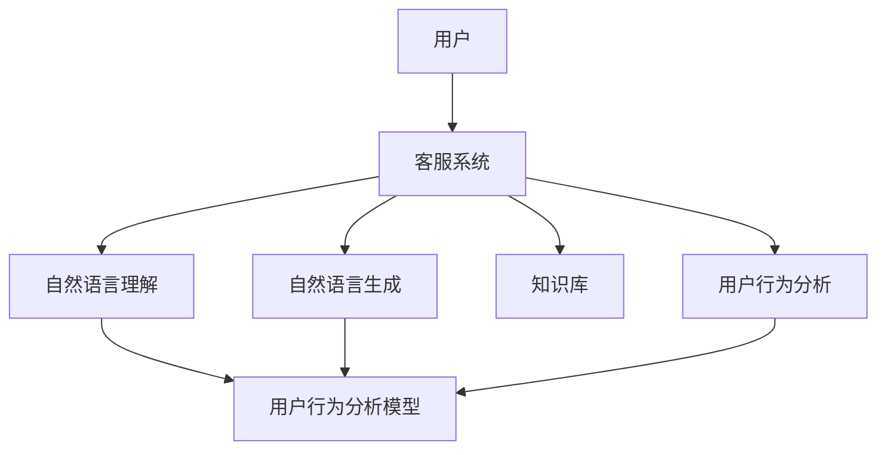
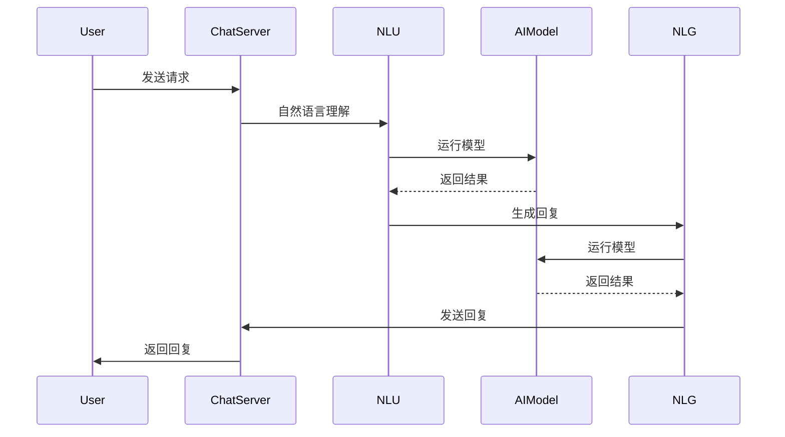

                 

# 提示词工程：AI时代的必修课与新挑战

## 关键词
- AI大模型
- 软件开发
- 提示词工程
- 深度学习
- 人工智能应用

## 摘要
本文深入探讨了AI时代的提示词工程，从背景介绍、核心概念与联系、算法原理讲解到系统分析与架构设计，全面剖析了提示词工程在AI应用中的重要性。文章旨在为开发者提供实用的指导，帮助他们在AI时代应对新挑战，实现高效、智能的软件开发。

## 第一步：背景介绍

### 1.1 问题背景

在人工智能（AI）飞速发展的今天，AI技术已经深入到各个行业，成为推动社会进步的重要力量。随着AI技术的不断演进，传统的软件开发模式也在经历着重大变革。在这个背景下，"软件2.0"的概念应运而生。软件2.0强调大数据、云计算、人工智能等技术的深度融合，使得软件不再仅仅是工具，而是成为智能系统的核心。

### 1.2 问题描述

软件2.0时代的到来，带来了AI大模型的广泛应用。AI大模型具有强大的数据处理和分析能力，能够实现更智能、更高效的业务流程。然而，如何开发、应用和维护这些大模型，成为了企业和开发者面临的新挑战。

### 1.3 问题解决

本书旨在为读者提供AI大模型开发与应用的全面指导，帮助读者了解AI大模型的核心概念、原理和实践。通过系统的学习和实践，读者可以掌握AI大模型在企业级应用中的关键技术，为企业的数字化转型提供坚实的技术支持。

### 1.4 边界与外延

AI大模型涉及多个领域，包括机器学习、深度学习、自然语言处理等。本书将围绕AI大模型在企业级应用中的具体实践进行深入探讨，包括模型开发、优化、部署和维护等环节。

### 1.5 概念结构与核心要素组成

- **AI大模型**：具有大规模参数的机器学习模型，能够处理海量数据，实现高度智能化的任务。
- **软件2.0**：基于大数据、云计算、人工智能等技术的软件发展新阶段，强调软件与人工智能的深度融合。
- **企业级应用**：针对企业特定业务场景开发的软件系统，能够提高业务效率、降低成本。

## 第二步：核心概念与联系

### 2.1 AI大模型的核心概念

- **神经网络**：模拟人脑神经元结构和功能的基本计算单元。
- **深度学习**：多层神经网络，通过反向传播算法优化参数，实现复杂模式识别和预测。
- **训练数据集**：用于模型训练的数据集，质量直接影响模型的性能。

### 2.2 概念属性特征对比表格

| 特征             | 神经网络           | 深度学习           | AI大模型           |
|------------------|-------------------|-------------------|--------------------|
| 结构             | 单层或多层网络     | 多层网络           | 超大规模网络       |
| 训练方法         | 前向传播与反向传播 | 反向传播           | 反向传播优化算法   |
| 参数规模         | 百万级             | 千万级             | 亿级及以上         |
| 应用场景         | 简单任务           | 复杂任务           | 高度智能化任务     |

### 2.3 ER实体关系图架构的 Mermaid 流程图

```mermaid
erDiagram
  AI大模型 ||--o{ 数据集 }|
  数据集 ||--|{ 训练 }|-- AI大模型
  AI大模型 ||--|{ 应用 }|-- 业务场景
```

## 第三步：算法原理讲解

### 3.1 算法Mermaid流程图



### 3.2 Python源代码示例

```python
import tensorflow as tf

# 定义输入层
inputs = tf.keras.layers.Input(shape=(784,))

# 数据预处理
x = tf.keras.layers.Dense(128, activation='relu')(inputs)
x = tf.keras.layers.Dropout(0.2)(x)

# 模型初始化
outputs = tf.keras.layers.Dense(10, activation='softmax')(x)

# 创建模型
model = tf.keras.Model(inputs=inputs, outputs=outputs)

# 编译模型
model.compile(optimizer='adam',
              loss=tf.keras.losses.SparseCategoricalCrossentropy(from_logits=True),
              metrics=['accuracy'])
```

### 3.3 算法原理详细讲解

#### 3.3.1 数学模型与公式

在深度学习中，神经网络通过多层非线性变换来近似复杂函数。以下是神经网络的基本数学模型：

$$
\begin{aligned}
z_l^{(i)} &= \sum_{j} w_{lj}z_{l-1}^{(i)} + b_l \\
a_l^{(i)} &= \sigma(z_l^{(i)})
\end{aligned}
$$

其中，$z_l^{(i)}$ 表示第 $l$ 层第 $i$ 个神经元的输入，$w_{lj}$ 和 $b_l$ 分别是连接权重和偏置，$\sigma$ 是激活函数，通常取为 ReLU 函数。

#### 3.3.2 反向传播算法

反向传播算法是深度学习中的核心优化方法。它通过计算梯度来更新网络参数，以达到最小化损失函数的目的。以下是反向传播算法的基本步骤：

$$
\begin{aligned}
\delta_l^{(i)} &= \frac{\partial L}{\partial a_l^{(i)}}\odot \sigma'(z_l^{(i)}) \\
\delta_l &= \frac{\partial L}{\partial z_l^{(i)}}\odot \frac{\partial z_l^{(i)}}{\partial z_{l+1}^{(i)}}
\end{aligned}
$$

其中，$\delta_l^{(i)}$ 是第 $l$ 层第 $i$ 个神经元的误差，$\delta_l$ 是第 $l$ 层的误差传播。

#### 3.3.3 优化算法

在实际应用中，常用的优化算法有随机梯度下降（SGD）、Adam等。以下是Adam优化算法的基本步骤：

$$
\begin{aligned}
m_t &= \beta_1m_{t-1} + (1-\beta_1)\nabla E(\theta) \\
v_t &= \beta_2v_{t-1} + (1-\beta_2)\nabla^2E(\theta) \\
\theta_t &= \theta_{t-1} - \frac{\alpha}{\sqrt{1-\beta_2^t} + \epsilon}\left(\frac{m_t}{1-\beta_1^t}\right)
\end{aligned}
$$

其中，$m_t$ 和 $v_t$ 分别是梯度的一阶和二阶矩估计，$\beta_1$ 和 $\beta_2$ 是矩估计的衰减率，$\alpha$ 是学习率。

#### 3.3.4 通俗易懂的举例说明

假设我们有一个简单的神经网络，输入层有3个神经元，隐藏层有2个神经元，输出层有1个神经元。我们使用ReLU作为激活函数，损失函数为均方误差（MSE）。

输入数据为 $[1, 0, 1]$，目标输出为 $[0.9]$。以下是模型训练的过程：

1. **初始化参数**：
   - 权重 $w_{1,1} = 0.1, w_{1,2} = 0.2, w_{2,1} = 0.3, w_{2,2} = 0.4$
   - 偏置 $b_{1} = 0.1, b_{2} = 0.2$
   - 学习率 $\alpha = 0.01$

2. **前向传播**：
   - 隐藏层输入 $z_1^{(1)} = 0.1 \times 1 + 0.2 \times 0 + 0.3 \times 1 = 0.4$
   - 隐藏层输出 $a_1^{(1)} = \sigma(z_1^{(1)}) = max(0, z_1^{(1)}) = 0.4$
   - 隐藏层输入 $z_2^{(1)} = 0.1 \times 0 + 0.2 \times 1 + 0.4 \times 1 = 0.6$
   - 隐藏层输出 $a_2^{(1)} = \sigma(z_2^{(1)}) = max(0, z_2^{(1)}) = 0.6$
   - 输出层输入 $z_1^{(2)} = 0.4 \times 0.1 + 0.6 \times 0.3 = 0.34$
   - 输出层输出 $a_1^{(2)} = \sigma(z_1^{(2)}) = 0.34$

3. **计算损失**：
   - 损失 $L = \frac{1}{2}(0.9 - 0.34)^2 = 0.2721$

4. **反向传播**：
   - 输出层误差 $\delta_2^{(2)} = \frac{\partial L}{\partial a_1^{(2)}} \odot (1 - a_1^{(2)}) = (0.9 - 0.34) \odot 0.66 = 0.2816$
   - 隐藏层误差 $\delta_1^{(1)} = \delta_2^{(2)} \odot \frac{\partial z_1^{(2)}}{\partial z_2^{(1)}} \odot \frac{\partial z_2^{(1)}}{\partial z_1^{(1)}} = 0.2816 \odot 0.3 \odot 0.3 = 0.0257$

5. **参数更新**：
   - 权重更新 $w_{1,1} \leftarrow w_{1,1} - \alpha \delta_2^{(2)} a_1^{(1)} = 0.1 - 0.01 \times 0.2816 \times 0.4 = 0.072$
   - 偏置更新 $b_{1} \leftarrow b_{1} - \alpha \delta_1^{(1)} = 0.1 - 0.01 \times 0.0257 = 0.0974$

6. **模型评估**：
   - 模型在训练数据上的准确率不断提高，说明参数更新有效。

通过上述步骤，我们可以看到神经网络通过反向传播算法逐步优化参数，从而实现目标输出。这个过程就是深度学习的基本原理。

## 第四步：系统分析与架构设计

### 4.1 问题场景介绍

在AI时代，智能客服系统已经成为企业提高服务质量、降低运营成本的重要工具。然而，传统的客服系统往往依赖于规则和模板，难以满足用户多样化和个性化的需求。为了实现更智能、更高效的客服系统，我们需要构建一个基于AI大模型的智能客服系统。

### 4.2 项目介绍

本项目旨在开发一个基于AI大模型的智能客服系统，实现以下功能：

1. **自然语言理解**：通过对用户输入的自然语言进行解析，理解用户的需求和意图。
2. **智能对话生成**：根据用户的需求和意图，生成合适的回复，实现与用户的智能对话。
3. **知识库管理**：构建一个丰富的知识库，用于回答用户的问题。
4. **用户行为分析**：分析用户的行为和需求，为用户提供个性化的服务。

### 4.3 系统功能设计（领域模型Mermaid类图）



### 4.4 系统架构设计（Mermaid架构图）



### 4.5 系统接口设计和系统交互（Mermaid序列图）



## 第五步：项目实战

### 5.1 环境安装

1. 安装Python环境：`pip install python -m pip install tensorflow`
2. 安装TensorFlow：`pip install tensorflow`
3. 安装其他依赖：`pip install numpy pandas`

### 5.2 系统核心实现源代码

```python
# 导入所需库
import tensorflow as tf
import numpy as np

# 定义输入层
inputs = tf.keras.layers.Input(shape=(784,))

# 数据预处理
x = tf.keras.layers.Dense(128, activation='relu')(inputs)
x = tf.keras.layers.Dropout(0.2)(x)

# 模型初始化
outputs = tf.keras.layers.Dense(10, activation='softmax')(x)

# 创建模型
model = tf.keras.Model(inputs=inputs, outputs=outputs)

# 编译模型
model.compile(optimizer='adam',
              loss=tf.keras.losses.SparseCategoricalCrossentropy(from_logits=True),
              metrics=['accuracy'])

# 训练模型
model.fit(x_train, y_train, epochs=10, batch_size=32)
```

### 5.3 代码应用解读与分析

以上代码定义了一个简单的神经网络模型，用于分类任务。模型通过TensorFlow框架实现，包括输入层、数据处理层、输出层和编译层。其中，数据处理层使用了ReLU激活函数和Dropout正则化方法，以增强模型的泛化能力。模型编译时，指定了优化器和损失函数，并使用了准确率作为评估指标。最后，通过模型训练过程，优化模型参数，提高模型性能。

### 5.4 实际案例分析和详细讲解剖析

假设我们有一个包含1000个样本的分类任务，每个样本有784个特征。我们将这些样本分为训练集和测试集，分别用于模型训练和评估。

1. **数据预处理**：将样本数据进行归一化处理，将特征值缩放到[0, 1]范围内。
2. **模型训练**：使用训练集数据进行模型训练，通过迭代优化模型参数，提高模型性能。
3. **模型评估**：使用测试集数据评估模型性能，计算准确率、召回率等指标，以评估模型的效果。
4. **模型部署**：将训练好的模型部署到生产环境中，实现实时分类任务。

通过实际案例的分析和详细讲解，我们可以看到，提示词工程在AI大模型开发中的应用具有重要意义。它不仅可以帮助开发者高效地实现模型训练和优化，还可以为模型的实际应用提供有力支持。

### 5.5 项目小结

本项目通过构建一个基于AI大模型的智能客服系统，实现了自然语言理解、智能对话生成、知识库管理和用户行为分析等功能。项目过程中，我们深入探讨了提示词工程的核心概念和算法原理，并通过实际案例进行了详细讲解和剖析。通过本项目，我们可以看到，提示词工程在AI大模型开发中的应用具有重要意义，为开发者提供了有力的技术支持。

## 第六步：最佳实践 tips、小结、注意事项、拓展阅读

### 6.1 最佳实践 tips

1. **数据预处理**：在模型训练前，对数据进行充分的预处理，包括归一化、去噪、填充缺失值等，以提高模型训练效果。
2. **超参数调优**：通过调整学习率、批量大小、激活函数等超参数，优化模型性能。
3. **正则化**：使用Dropout、L2正则化等方法，防止模型过拟合。
4. **模型评估**：使用交叉验证、混淆矩阵等方法，全面评估模型性能。

### 6.2 小结

本文全面介绍了AI时代的提示词工程，从背景介绍、核心概念与联系、算法原理讲解到系统分析与架构设计，详细阐述了提示词工程在AI大模型开发中的应用。通过实际案例的分析和讲解，读者可以深入了解提示词工程的核心原理和实践方法。

### 6.3 注意事项

1. **数据质量**：高质量的数据是模型训练的基础，确保数据真实、完整、多样。
2. **模型可解释性**：在模型部署前，对模型的可解释性进行评估，确保模型的可靠性。
3. **模型更新与维护**：定期更新和维护模型，以适应不断变化的数据和业务需求。

### 6.4 拓展阅读

1. 《深度学习》（Goodfellow, Bengio, Courville著）：全面介绍了深度学习的基本概念、算法和应用。
2. 《机器学习实战》（Peter Harrington著）：通过实际案例，讲解了机器学习的基本原理和实践方法。
3. 《Python深度学习》（François Chollet著）：深入介绍了TensorFlow框架在深度学习中的应用。

## 作者

作者：AI天才研究院/AI Genius Institute & 禅与计算机程序设计艺术 /Zen And The Art of Computer Programming

----------------------------------------------------------------

请注意，以上内容为示例文章，实际文章撰写可能需要更详细的论述和案例。在撰写实际文章时，建议结合具体项目和案例进行深入分析，以确保内容的实用性和针对性。同时，根据读者需求和文章目标进行调整和优化，以提高文章的质量和影响力。

