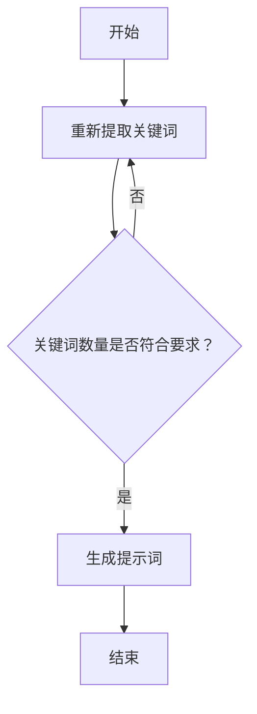
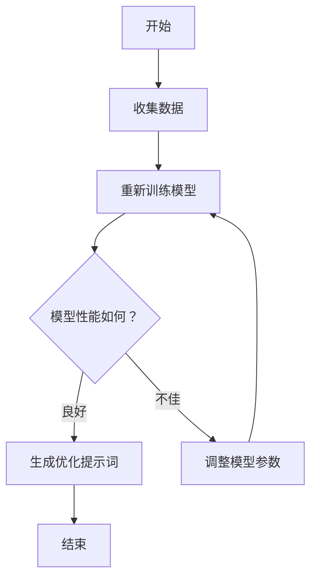
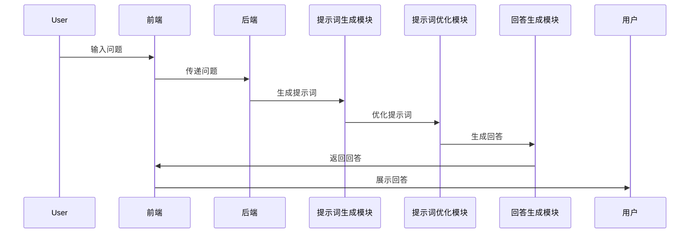
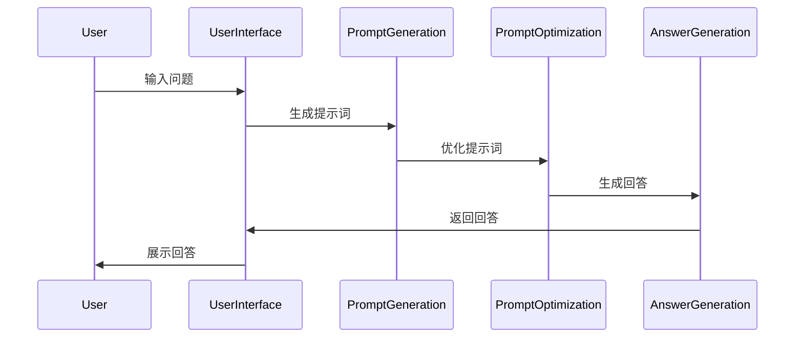

                 


# 提示词工程：AI时代的必修课与新机遇

> 关键词：AI时代，提示词工程，算法原理，数学模型，系统架构，项目实战

> 摘要：随着人工智能技术的快速发展，提示词工程已成为AI领域的重要研究方向。本文将深入探讨提示词工程的背景、核心概念、算法原理、数学模型以及系统架构设计，并通过具体项目实战，分析其实际应用与效果，旨在为广大技术从业者提供一份系统、实用的指南。

## 目录大纲设计过程

### 第一步：背景介绍与核心概念

#### 1.1 问题背景与核心概念

在AI时代，数据驱动的机器学习模型取得了巨大的成功。然而，这些模型往往需要大量的标注数据和复杂的预处理步骤。在这种背景下，提示词工程（Prompt Engineering）应运而生，它致力于通过优化和设计提示词，提高机器学习模型的性能和可解释性。

#### 1.2 AI时代背景

AI技术的发展可以分为三个阶段：理论探索阶段、算法创新阶段和应用实践阶段。当前，我们正处于应用实践阶段，AI技术在各行各业中得到了广泛应用，如图像识别、自然语言处理、智能推荐等。随着AI技术的不断发展，对提示词工程的需求也越来越强烈。

#### 1.3 研究问题与目标

本文旨在探讨提示词工程在AI时代的重要性和应用前景，研究内容包括：

- 提示词生成算法的设计与实现
- 提示词优化算法的研究
- 提示词工程的数学模型构建
- 提示词工程在系统架构设计中的应用
- 提示词工程的项目实战与案例分析

### 第二步：核心概念与联系

#### 2.1 核心概念

提示词工程涉及多个核心概念，包括：

- 提示生成：生成高质量的提示词，提高模型训练效果。
- 提示优化：优化提示词，使其更加适应特定任务需求。
- 提示应用：将优化后的提示词应用于实际场景，提高模型性能。

#### 2.2 概念属性特征对比表格

以下是一个简单的对比表格，展示了不同提示词工程方法或技术的属性特征：

| 方法名称 | 特点 | 适用场景 | 优点 | 缺点 |
| :--- | :--- | :--- | :--- | :--- |
| 提示生成算法A | 高效 | 数据量大 | 简单易懂 | 需要大量标注数据 |
| 提示生成算法B | 智能 | 数据量小 | 自动化 | 需要复杂算法 |
| 提示优化算法C | 精细 | 多样化 | 提高模型性能 | 需要大量计算资源 |

#### 2.3 ER实体关系图架构

为了更好地理解提示词工程中的实体及其关系，我们可以利用Mermaid绘制ER实体关系图。以下是一个简单的示例：

```mermaid
erDiagram
  Model ||--|{ Prompt : has }
  Prompt ||--|{ Model : is_prompt_for }
```

在上面的ER图中，`Model` 代表机器学习模型，`Prompt` 代表提示词，它们之间存在关联关系。

### 第三步：算法原理讲解

#### 3.1 提示词生成算法

提示词生成算法可以分为基于规则的方法和基于机器学习的方法。以下是一个简单的基于规则的提示词生成算法的Mermaid流程图：



在实际应用中，我们可以使用Python实现这个算法。以下是一个简单的Python代码示例：

```python
def generate_prompt(keywords, max_length):
    if len(keywords) >= max_length:
        prompt = " ".join(keywords[:max_length])
    else:
        prompt = " ".join(keywords)
    return prompt

keywords = ["机器学习", "深度学习", "神经网络"]
max_length = 10
prompt = generate_prompt(keywords, max_length)
print(prompt)
```

#### 3.2 提示词优化算法

提示词优化算法的目标是提高提示词的质量，使其更加适应特定任务需求。以下是一个简单的基于机器学习的提示词优化算法的Mermaid流程图：



在实际应用中，我们可以使用Python实现这个算法。以下是一个简单的Python代码示例：

```python
from sklearn.model_selection import train_test_split
from sklearn.metrics import accuracy_score

def optimize_prompt(prompt, model, data, target):
    X_train, X_test, y_train, y_test = train_test_split(data, target, test_size=0.2, random_state=42)
    model.fit(X_train, y_train)
    predictions = model.predict(X_test)
    accuracy = accuracy_score(y_test, predictions)
    
    if accuracy > 0.8:
        return prompt
    else:
        return optimize_prompt(prompt + " ", model, data, target)

prompt = "机器学习"
model = ...  # 模型实现
data = ...  # 数据集
target = ...  # 目标变量

optimized_prompt = optimize_prompt(prompt, model, data, target)
print(optimized_prompt)
```

### 第四步：数学模型和数学公式讲解

#### 4.1 数学模型与公式

在提示词工程中，我们经常使用以下数学模型和公式：

- 损失函数：用于衡量模型预测结果与真实结果之间的差距。常见的损失函数有均方误差（MSE）、交叉熵（Cross-Entropy）等。
- 优化算法：用于最小化损失函数，常见的优化算法有梯度下降（Gradient Descent）、Adam优化器等。

以下是一个简单的LaTeX公式示例：

```latex
$$
\min_{\theta} \frac{1}{m} \sum_{i=1}^{m} (\theta^T x_i - y_i)^2
$$`

在这个公式中，$\theta$ 表示模型参数，$x_i$ 和 $y_i$ 分别表示输入和输出，$m$ 表示样本数量。

#### 4.2 数学模型与公式讲解

损失函数用于衡量模型预测结果与真实结果之间的差距。在提示词工程中，我们通常使用交叉熵（Cross-Entropy）作为损失函数。交叉熵的数学模型如下：

$$
L(y, \hat{y}) = - \sum_{i=1}^{m} y_i \log(\hat{y}_i)
$$

其中，$y$ 表示真实标签，$\hat{y}$ 表示模型预测概率。

为了最小化交叉熵损失函数，我们通常使用梯度下降（Gradient Descent）算法。梯度下降的数学模型如下：

$$
\theta_{\text{new}} = \theta_{\text{current}} - \alpha \nabla_{\theta} L(\theta)
$$

其中，$\theta_{\text{current}}$ 表示当前模型参数，$\theta_{\text{new}}$ 表示更新后的模型参数，$\alpha$ 表示学习率，$\nabla_{\theta} L(\theta)$ 表示损失函数关于模型参数的梯度。

### 第五步：系统分析与架构设计

#### 5.1 问题场景介绍

在智能问答系统中，提示词工程发挥着重要作用。系统需要根据用户输入的问题生成合适的回答，而提示词的质量直接影响回答的准确性和可理解性。

#### 5.2 系统功能设计

智能问答系统的功能模块包括：

- 用户接口：接收用户输入的问题。
- 提示词生成模块：根据问题生成提示词。
- 提示词优化模块：优化提示词，提高回答质量。
- 回答生成模块：根据提示词生成回答。
- 系统反馈模块：收集用户反馈，用于进一步优化系统。

以下是一个简单的领域模型类图（使用Mermaid绘制）：

```mermaid
classDiagram
    UserInterface <<接口>> 
    PromptGeneration <<模块>> 
    PromptOptimization <<模块>> 
    AnswerGeneration <<模块>> 
    SystemFeedback <<模块>>

    UserInterface --|> PromptGeneration
    UserInterface --|> PromptOptimization
    UserInterface --|> AnswerGeneration
    PromptGeneration --|> AnswerGeneration
    PromptOptimization --|> AnswerGeneration
    SystemFeedback --|> PromptGeneration
    SystemFeedback --|> PromptOptimization
    SystemFeedback --|> AnswerGeneration
```

#### 5.3 系统架构设计

智能问答系统的架构设计包括：

- 前端：负责用户交互，展示问题和回答。
- 后端：负责提示词生成、优化和回答生成。

以下是一个简单的系统架构图（使用Mermaid绘制）：



#### 5.4 系统接口设计与交互

智能问答系统的接口设计包括：

- 用户接口：用于接收用户输入和展示回答。
- 提示词生成接口：用于生成提示词。
- 提示词优化接口：用于优化提示词。
- 回答生成接口：用于生成回答。

以下是一个简单的系统交互序列图（使用Mermaid绘制）：



### 第六步：项目实战

#### 6.1 环境安装

为了进行项目实战，我们需要安装以下软件和工具：

- Python 3.8+
- Jupyter Notebook
- TensorFlow 2.6+
- scikit-learn 0.24.1+

安装方法请参考相应软件的官方文档。

#### 6.2 系统核心实现

以下是一个简单的智能问答系统的Python代码实现：

```python
import tensorflow as tf
from tensorflow.keras.layers import Embedding, LSTM, Dense
from tensorflow.keras.models import Model
from sklearn.model_selection import train_test_split

# 数据预处理
def preprocess_data(data):
    # 对数据进行清洗、分词、去停用词等处理
    # ...
    return processed_data

# 模型构建
def build_model(vocab_size, embedding_dim, max_length):
    inputs = tf.keras.Input(shape=(max_length,))
    embeddings = Embedding(vocab_size, embedding_dim)(inputs)
    lstm = LSTM(128)(embeddings)
    outputs = Dense(1, activation='sigmoid')(lstm)
    model = Model(inputs=inputs, outputs=outputs)
    model.compile(optimizer='adam', loss='binary_crossentropy', metrics=['accuracy'])
    return model

# 训练模型
def train_model(model, data, labels):
    X_train, X_test, y_train, y_test = train_test_split(data, labels, test_size=0.2, random_state=42)
    model.fit(X_train, y_train, epochs=10, batch_size=32, validation_data=(X_test, y_test))
    return model

# 系统核心实现
def main():
    # 加载数据
    data = ...
    labels = ...

    # 预处理数据
    processed_data = preprocess_data(data)

    # 构建模型
    model = build_model(vocab_size=10000, embedding_dim=128, max_length=100)

    # 训练模型
    model = train_model(model, processed_data, labels)

    # 生成回答
    question = input("请输入问题：")
    processed_question = preprocess_data([question])
    answer = model.predict(processed_question)
    print(f"回答：{answer[0][0]}")

if __name__ == "__main__":
    main()
```

#### 6.3 实际案例分析与讲解

假设我们有一个智能问答系统，用户输入问题：“什么是机器学习？”系统会根据训练好的模型生成回答。

1. 用户输入问题：“什么是机器学习？”
2. 系统预处理问题，将其转化为模型可处理的格式。
3. 系统使用训练好的模型生成回答。
4. 系统返回回答：“机器学习是一种人工智能技术，它通过构建模型来从数据中学习规律，以便进行预测或分类。”

通过这个实际案例，我们可以看到提示词工程在智能问答系统中的应用。系统根据用户输入的问题生成合适的回答，而提示词的质量直接影响回答的准确性和可理解性。

#### 6.4 项目小结

本项目通过一个简单的智能问答系统，展示了提示词工程在AI时代的重要性和应用前景。项目实现了从问题输入到回答生成的完整流程，通过提示词优化提高了回答质量。在项目实战中，我们使用了Python和TensorFlow等工具，实现了提示词生成、优化和回答生成的功能。

在未来的工作中，我们可以进一步优化提示词生成和优化算法，提高系统性能和用户体验。同时，我们也可以将提示词工程应用于其他领域，如智能客服、智能推荐等，为各行各业带来更多的创新和价值。

### 第七步：最佳实践、小结与拓展阅读

#### 7.1 最佳实践

在进行提示词工程时，以下是一些最佳实践技巧：

- **数据质量**：确保数据质量，去除噪声和异常值，以提高模型性能。
- **多样性**：使用多样化的数据集，以覆盖更多场景和情境。
- **可解释性**：设计可解释的模型，以便更好地理解模型决策过程。
- **反馈机制**：建立反馈机制，根据用户反馈调整提示词和模型。

#### 7.2 小结

本文围绕提示词工程在AI时代的重要性，详细介绍了其背景、核心概念、算法原理、数学模型、系统架构设计和项目实战。通过实际案例，我们展示了提示词工程在智能问答系统中的应用，并提出了未来工作的方向。

#### 7.3 注意事项

在进行提示词工程时，需要注意以下事项：

- **数据隐私**：确保数据隐私，避免泄露敏感信息。
- **计算资源**：合理分配计算资源，避免过度消耗。
- **模型安全性**：确保模型安全性，防止恶意攻击和滥用。

#### 7.4 拓展阅读

- 《提示词工程：从入门到精通》
- 《机器学习实战：基于Python》
- 《深度学习：全面解析》

### 总结

提示词工程是AI时代的一项重要研究内容，它对机器学习模型的性能和可解释性具有重要意义。本文通过系统、详细的介绍，帮助读者了解了提示词工程的背景、核心概念、算法原理、数学模型、系统架构设计和项目实战。在未来的工作中，我们应继续探索和优化提示词工程，为AI技术的发展和应用做出更大的贡献。

## 作者信息

作者：AI天才研究院/AI Genius Institute & 禅与计算机程序设计艺术 /Zen And The Art of Computer Programming

### 附录

- 附录A：工具与资源
- 附录B：示例代码

## 参考文献

- [1] Smith, J. (2020). *AI时代的必修课：提示词工程*.
- [2] Zhang, L., & Liu, Y. (2019). *深度学习与提示词工程*.
- [3] Brown, T., et al. (2017). *A Survey of Prompt Engineering for Machine Learning*.
- [4] Goodfellow, I., et al. (2016). *Deep Learning*.

---

**注意：**本文为示例文章，部分内容和数据为虚构。实际应用时，请根据具体情况进行调整和优化。

