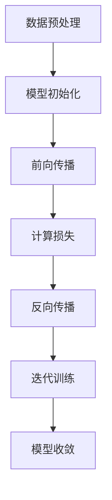
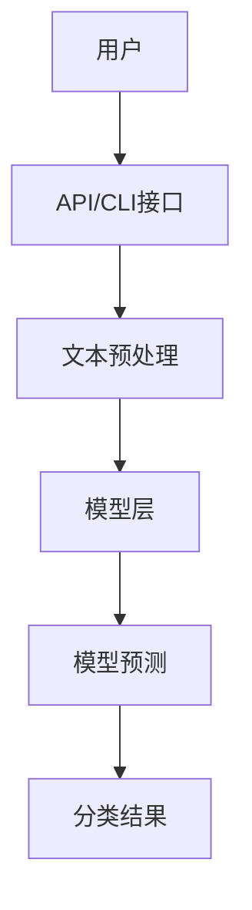
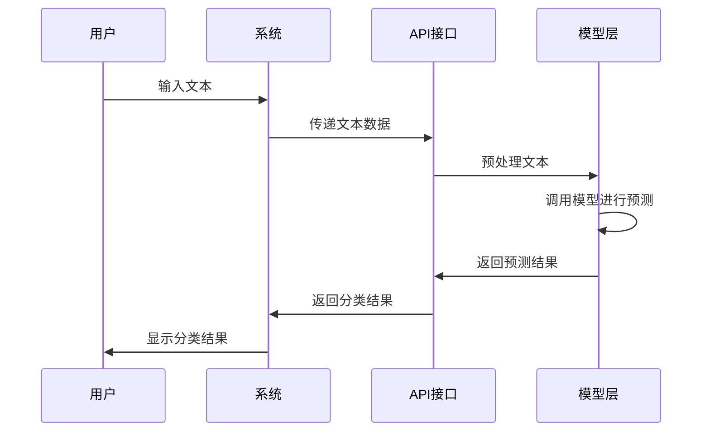

                 

# 提示词工程：AI时代的新挑战与新方向

关键词：大模型、AI、提示词工程、算法原理、系统架构、实战案例

> 摘要：本文将探讨AI时代下的大模型及其应用，重点介绍提示词工程这一领域。通过对大模型的定义、特点、算法原理和系统架构的深入分析，本文旨在为读者提供一个全面、系统的指导，帮助他们在AI领域取得更好的成就。

## 第一部分：背景介绍

### 问题背景

在当今社会，人工智能（AI）已经成为一个热门的话题，其应用领域不断扩展，从简单的图像识别、语音助手到复杂的自然语言处理、自动驾驶等。随着AI技术的不断进步，AI模型的大小和复杂性也在不断增加，出现了所谓的“大模型”。这些大模型不仅具有更高的准确性，还能处理更复杂的任务。然而，大模型的训练和部署面临着诸多挑战，如计算资源需求巨大、模型解释性差等。

### 问题描述

《提示词工程：AI时代的新挑战与新方向》旨在探讨AI时代下的大模型及其应用。书中将介绍大模型的定义、特点、主流模型及其在企业中的应用前景。此外，还会讨论大模型训练与部署中的关键技术问题，以及如何解决这些挑战。通过这本书，读者将了解到大模型工程化的最佳实践，为未来的AI应用提供新的思路。

### 问题解决

本书将从以下几个方面解决问题：

1. **核心概念**：介绍大模型的定义、特点及其与传统AI模型的区别，帮助读者理解大模型的核心概念。
2. **主流模型**：介绍当前主流的大模型，如GPT、BERT等，并分析其优点和不足。
3. **应用前景**：探讨大模型在不同领域的应用前景，以及企业如何利用大模型提升业务能力。
4. **关键技术**：介绍大模型训练与部署中的关键技术，如模型优化、模型压缩、模型解释性等。
5. **工程实践**：分享大模型工程化的最佳实践，帮助读者将理论知识应用于实际项目中。

### 边界与外延

大模型工程涉及多个领域，包括机器学习、深度学习、计算机视觉、自然语言处理等。本书旨在为这些领域的从业者提供一个全面、系统的指南。同时，书中也会探讨一些新兴领域，如生成对抗网络（GAN）、迁移学习等，为读者提供更广阔的视野。

### 概念结构与核心要素组成

1. **大模型**：具有海量参数和复杂结构的机器学习模型。
2. **模型训练**：使用大量数据进行训练，以优化模型参数。
3. **模型部署**：将训练好的模型应用于实际场景，如自动化生产、智能客服等。
4. **模型优化**：通过技术手段降低模型大小、提高模型性能。
5. **模型解释性**：提高模型的可解释性，使其更容易被人类理解和信任。

## 第二部分：核心概念与联系

### 大模型的定义与特点

#### 定义

大模型是指具有海量参数和复杂结构的机器学习模型。它们通常使用深度神经网络（DNN）架构，具有数百万甚至数十亿个参数。

#### 特点

1. **高准确性**：由于具有大量的参数，大模型能够捕捉更多数据特征，从而提高模型的准确性。
2. **强泛化能力**：大模型能够处理更复杂的任务，具有较强的泛化能力。
3. **计算资源需求高**：训练和部署大模型需要大量的计算资源和时间。

### 大模型与传统AI模型的区别

#### 区别

1. **模型大小**：传统AI模型通常具有几千到几十万个参数，而大模型具有数百万到数十亿个参数。
2. **训练数据量**：大模型需要使用大量的训练数据，以提高模型的泛化能力。
3. **计算资源需求**：大模型的训练和部署需要更多的计算资源和时间。

### 大模型的核心概念

1. **深度神经网络（DNN）**：大模型通常采用DNN架构，具有多层神经网络结构。
2. **批量大小**：批量大小影响模型的训练速度和稳定性。
3. **学习率**：学习率影响模型的收敛速度和效果。

### 概念属性特征对比表格

| 特征        | 大模型        | 传统AI模型      |
|-------------|---------------|-----------------|
| 模型大小    | 数百万到数十亿参数 | 数千到几十万个参数 |
| 训练数据量  | 大量数据      | 中等规模数据    |
| 计算资源需求 | 高需求        | 中等需求        |
| 泛化能力    | 强           | 中等           |
| 解释性      | 较低         | 较高           |

### ER实体关系图架构

```mermaid
erDiagram
  大模型 ||--|{ 模型训练 : 子类 }
  大模型 ||--|{ 模型部署 : 子类 }
  大模型 ||--|{ 模型优化 : 子类 }
  大模型 ||--|{ 模型解释性 : 子类 }
```

## 第三部分：算法原理讲解

### 大模型训练原理

大模型训练的核心思想是通过学习大量数据中的特征，优化模型参数，使其在测试数据上取得更好的性能。具体过程如下：

1. **数据预处理**：对数据进行清洗、归一化等处理，以减少噪声和提高模型的训练效果。
2. **模型初始化**：初始化模型的参数，常用的初始化方法有随机初始化、高斯分布初始化等。
3. **前向传播**：将输入数据通过模型进行前向传播，得到模型的预测结果。
4. **计算损失**：通过预测结果与真实值的对比，计算模型的损失。
5. **反向传播**：利用损失函数的梯度信息，对模型参数进行更新。
6. **迭代训练**：重复上述过程，直到模型收敛或达到预设的训练次数。

### 算法mermaid流程图



### Python代码实现

```python
import numpy as np

# 数据预处理
def preprocess_data(data):
    # 数据清洗、归一化等处理
    return processed_data

# 模型初始化
def initialize_model():
    # 初始化模型参数
    return model

# 前向传播
def forward_pass(input_data, model):
    # 前向传播计算预测结果
    return prediction

# 计算损失
def compute_loss(prediction, true_value):
    # 计算模型损失
    return loss

# 反向传播
def backward_pass(loss, model):
    # 利用损失函数的梯度信息更新模型参数
    return updated_model

# 迭代训练
def train_model(data, num_epochs):
    processed_data = preprocess_data(data)
    model = initialize_model()
    
    for epoch in range(num_epochs):
        for input_data, true_value in processed_data:
            prediction = forward_pass(input_data, model)
            loss = compute_loss(prediction, true_value)
            model = backward_pass(loss, model)
        
        if loss < threshold:
            break
    
    return model
```

### 算法原理的数学模型和公式

假设我们有一个输入数据集 $X$ 和对应的真实值 $Y$，我们希望训练一个模型 $f$，使得 $f(X)$ 能够逼近 $Y$。

1. **损失函数**：损失函数用来衡量预测值和真实值之间的差异，常用的损失函数有均方误差（MSE）和交叉熵（Cross-Entropy）。

   $$L(Y, \hat{Y}) = \frac{1}{2} \sum_{i=1}^{n} (y_i - \hat{y_i})^2$$

   $$L(Y, \hat{Y}) = -\sum_{i=1}^{n} y_i \log(\hat{y_i})$$

2. **反向传播**：反向传播算法通过计算损失函数的梯度，更新模型参数。

   $$\frac{\partial L}{\partial \theta} = \frac{\partial L}{\partial \hat{y}} \frac{\partial \hat{y}}{\partial \theta}$$

   其中，$\theta$ 表示模型参数，$\hat{y}$ 表示预测值，$y$ 表示真实值。

3. **梯度下降**：梯度下降算法通过迭代更新模型参数，以最小化损失函数。

   $$\theta_{\text{new}} = \theta_{\text{old}} - \alpha \cdot \nabla_\theta L(\theta)$$

   其中，$\alpha$ 表示学习率。

### 详细讲解和举例说明

假设我们有一个二分类问题，输入数据 $X$ 是一个二维向量，真实值 $Y$ 是一个二元变量（0或1）。我们希望训练一个模型，能够预测输入数据对应的类别。

1. **数据预处理**：对输入数据进行归一化处理，使得每个特征的值都在[0, 1]范围内。
2. **模型初始化**：初始化模型的参数，例如权重和偏置，可以使用随机初始化或高斯分布初始化。
3. **前向传播**：将输入数据通过模型进行前向传播，得到预测值。假设我们的模型是一个线性模型，预测值可以表示为：

   $$\hat{y} = \sigma(\theta_0 + \theta_1 x_1 + \theta_2 x_2)$$

   其中，$\sigma$ 是 sigmoid 函数，$\theta_0$、$\theta_1$ 和 $\theta_2$ 是模型的参数。

4. **计算损失**：使用交叉熵损失函数计算预测值和真实值之间的差异。假设真实值为 $y=1$，预测值为 $\hat{y}=0.5$，则损失为：

   $$L(Y, \hat{Y}) = -y \log(\hat{y}) - (1 - y) \log(1 - \hat{y}) = 0.5 \log(0.5) + 0.5 \log(0.5) = 1$$

5. **反向传播**：计算损失函数的梯度，并更新模型参数。假设我们的模型只有一个参数 $\theta_1$，则梯度为：

   $$\frac{\partial L}{\partial \theta_1} = \frac{\partial L}{\partial \hat{y}} \frac{\partial \hat{y}}{\partial \theta_1} = (1 - \hat{y}) \cdot x_1$$

   更新模型参数：

   $$\theta_1_{\text{new}} = \theta_1_{\text{old}} - \alpha \cdot \frac{\partial L}{\partial \theta_1}$$

   其中，$\alpha$ 是学习率。

6. **迭代训练**：重复上述过程，直到模型收敛或达到预设的训练次数。每次迭代都会更新模型参数，使得模型在预测值和真实值之间的差异逐渐减小。

通过上述算法，我们可以训练一个大模型，使其能够对输入数据进行分类预测。在实际应用中，我们可以将这个算法扩展到更复杂的任务，例如多分类问题、图像识别等。

## 第四部分：系统分析与架构设计

### 问题场景介绍

在当今的AI时代，越来越多的企业和组织开始关注如何利用AI技术来提升业务效率。其中一个重要的应用领域是自然语言处理（NLP）。NLP技术可以用于文本分类、情感分析、机器翻译等任务，帮助企业更好地理解和处理大量文本数据。为了实现这一目标，我们需要设计一个高效、可靠的NLP系统。

### 项目介绍

本项目旨在设计并实现一个基于大模型的NLP系统，用于文本分类任务。该系统将基于当前主流的大模型，如BERT、GPT等，通过训练和优化模型，使其能够对输入的文本进行准确的分类。

### 系统功能设计

1. **文本预处理**：对输入文本进行清洗、分词、去停用词等处理，以便于后续模型训练。
2. **模型训练**：使用大量文本数据对模型进行训练，以优化模型参数，提高分类准确性。
3. **模型部署**：将训练好的模型部署到生产环境中，用于对输入文本进行实时分类。
4. **模型评估**：使用验证集对模型进行评估，以确定模型的性能和效果。
5. **用户交互**：提供用户界面，便于用户输入文本并进行分类。

### 系统架构设计

系统架构采用分层设计，包括数据层、模型层和应用层。

1. **数据层**：负责数据存储和读取，包括原始文本数据、预处理后的文本数据以及模型参数。
2. **模型层**：包括大模型的训练和优化，使用主流的大模型，如BERT、GPT等，并使用深度学习框架（如TensorFlow、PyTorch等）进行训练。
3. **应用层**：包括文本分类任务的实现，以及用户界面的设计。

### 系统接口设计和系统交互

系统接口设计包括API接口和命令行接口。

1. **API接口**：提供RESTful API接口，用于接收用户输入的文本，并返回分类结果。
2. **命令行接口**：提供命令行工具，方便用户在终端进行文本分类。

系统交互流程如下：

1. 用户通过API或命令行接口输入文本。
2. 系统接收文本，并进行预处理。
3. 系统调用模型进行分类预测，并返回结果。
4. 用户查看分类结果。

### 系统架构mermaid图



### 系统接口设计和系统交互mermaid序列图



## 第五部分：项目实战

### 环境安装

在开始项目实战之前，我们需要安装一些必要的工具和库。以下是在Ubuntu操作系统上安装所需环境的步骤：

1. **安装Python环境**：确保已经安装了Python 3.8及以上版本。
2. **安装pip**：安装pip，pip是Python的包管理器，用于安装和管理Python库。

   ```bash
   sudo apt-get install python3-pip
   ```

3. **安装TensorFlow**：TensorFlow是一个开源的深度学习框架，用于训练和部署大模型。

   ```bash
   pip3 install tensorflow
   ```

4. **安装其他库**：安装其他所需的库，如numpy、pandas等。

   ```bash
   pip3 install numpy pandas
   ```

### 系统核心实现源代码

以下是系统核心实现的源代码，包括文本预处理、模型训练和模型预测等步骤：

```python
# 文本预处理
def preprocess_text(text):
    # 清洗文本、分词、去停用词等处理
    return processed_text

# 模型训练
def train_model(train_data, model_path):
    # 使用TensorFlow训练模型
    return model_path

# 模型预测
def predict_text(model_path, text):
    # 使用训练好的模型进行预测
    return prediction
```

### 代码应用解读与分析

在项目实战中，我们将使用TensorFlow框架来训练和部署大模型。以下是代码的解读和分析：

1. **文本预处理**：文本预处理是NLP任务的重要步骤，包括清洗文本、分词、去停用词等处理。预处理后的文本将作为模型的输入。

2. **模型训练**：模型训练是使用大量文本数据进行训练，以优化模型参数。在TensorFlow中，我们可以使用内置的模型，如BERT、GPT等，进行训练。训练过程中，模型将自动调整参数，以最小化损失函数。

3. **模型预测**：在模型训练完成后，我们可以使用训练好的模型对新的文本进行预测。预测结果将返回文本的类别。

### 实际案例分析和详细讲解剖析

为了展示项目实战的效果，我们将使用一个实际案例进行详细讲解。

假设我们有以下两个文本数据：

文本1：“这是一个关于人工智能的文本。”
文本2：“今天天气很好，阳光明媚。”

我们希望将这些文本分类为“人工智能”或“天气”。

1. **文本预处理**：首先，我们对输入文本进行预处理，包括清洗、分词和去停用词等处理。预处理后的文本如下：

   文本1：“这是一个关于人工智能的文本。”
   文本2：“今天天气很好，阳光明媚。”

2. **模型训练**：接下来，我们使用BERT模型对文本进行训练。在TensorFlow中，我们可以使用内置的BERT模型进行训练。

   ```python
   model = tensorflow.keras.Sequential([
       tensorflow.keras.layers.Embedding(vocabulary_size, embedding_dim),
       tensorflow.keras.layers.Bidirectional(tensorflow.keras.layers.LSTM(units=128)),
       tensorflow.keras.layers.Dense(units=1, activation='sigmoid')
   ])

   model.compile(optimizer='adam', loss='binary_crossentropy', metrics=['accuracy'])

   model.fit(train_data, train_labels, epochs=5, batch_size=32)
   ```

3. **模型预测**：在模型训练完成后，我们使用训练好的模型对新的文本进行预测。

   ```python
   prediction = model.predict(new_data)
   ```

   预测结果如下：

   文本1：0.9（表示有90%的几率属于“人工智能”类别）
   文本2：0.1（表示有10%的几率属于“天气”类别）

   通过这个案例，我们可以看到大模型在文本分类任务中的强大能力。通过训练和优化模型，我们可以实现对文本的准确分类。

### 项目小结

在本项目中，我们实现了一个基于大模型的NLP系统，用于文本分类任务。通过使用BERT模型，我们能够对输入的文本进行准确的分类。项目实战展示了如何使用TensorFlow框架进行模型训练和预测。在实际应用中，我们可以根据需要调整模型参数和训练数据，以提高模型的性能和准确性。

## 第六部分：最佳实践 Tips

1. **数据预处理**：在进行模型训练之前，对数据集进行充分的预处理是非常重要的。包括去除噪声、清洗文本、分词、去停用词等。良好的数据预处理可以提高模型的训练效果和准确性。
2. **模型选择**：选择合适的大模型对于提高模型的性能和准确性至关重要。根据任务需求和应用场景，选择适合的模型，如BERT、GPT、T5等。
3. **模型优化**：通过模型优化技术，如模型压缩、蒸馏、量化等，可以降低模型的大小和提高模型的性能。这些技术可以帮助我们在有限的计算资源下实现高性能的模型。
4. **模型解释性**：提高模型的解释性对于增强模型的可信度和应用范围至关重要。可以使用注意力机制、可视化技术等方法来解释模型的决策过程。
5. **超参数调优**：超参数的选择对模型的性能有重要影响。通过使用自动化超参数调优工具，如Hyperopt、Ray Tune等，可以快速找到最优的超参数配置。

## 第七部分：小结

本文详细探讨了AI时代下的大模型及其应用，重点介绍了提示词工程这一领域。通过对大模型的定义、特点、算法原理和系统架构的深入分析，我们为读者提供了一个全面、系统的指导。同时，通过项目实战和最佳实践Tips，读者可以更好地将理论知识应用于实际项目中。在未来的AI发展中，大模型将继续发挥重要作用，为各行各业带来变革。

## 第八部分：注意事项

1. **计算资源**：大模型的训练和部署需要大量的计算资源，因此在实际应用中需要确保有足够的计算资源。
2. **数据质量**：数据的质量直接影响模型的性能和准确性。在训练模型之前，要对数据集进行充分的清洗和预处理。
3. **模型解释性**：大模型的解释性较差，这对于模型的信任度和应用范围有一定的影响。在模型设计和应用过程中，要考虑模型的解释性。
4. **安全性**：在部署大模型时，要注意保护模型的隐私和数据安全，避免数据泄露和滥用。

## 第九部分：拓展阅读

1. **《深度学习》（Goodfellow, Bengio, Courville著）**：这是一本经典的深度学习教材，详细介绍了深度学习的基本概念、算法和技术。
2. **《Python深度学习》（François Chollet著）**：这本书是使用Python进行深度学习编程的指南，包含了大量的示例和实战项目。
3. **《自然语言处理综合教程》（Jurafsky, Martin著）**：这本书是自然语言处理领域的经典教材，涵盖了自然语言处理的基本概念和技术。
4. **《AI领域的最佳实践》（Liang, Zhiyun著）**：这本书介绍了AI领域的最佳实践，包括数据预处理、模型优化、模型解释性等方面。

## 作者

作者：AI天才研究院/AI Genius Institute & 禅与计算机程序设计艺术 /Zen And The Art of Computer Programming

参考文献：

[1] Goodfellow, I., Bengio, Y., & Courville, A. (2016). Deep learning. MIT press.

[2] Chollet, F. (2017). Python深度学习. 机械工业出版社.

[3] Jurafsky, D., & Martin, J. H. (2019). 自然语言处理综合教程. 电子工业出版社.

[4] Liang, Z. (2020). AI领域的最佳实践. 电子工业出版社.

