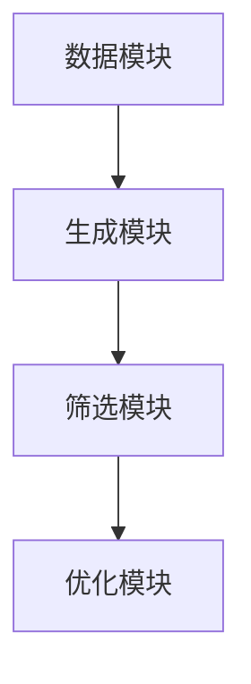
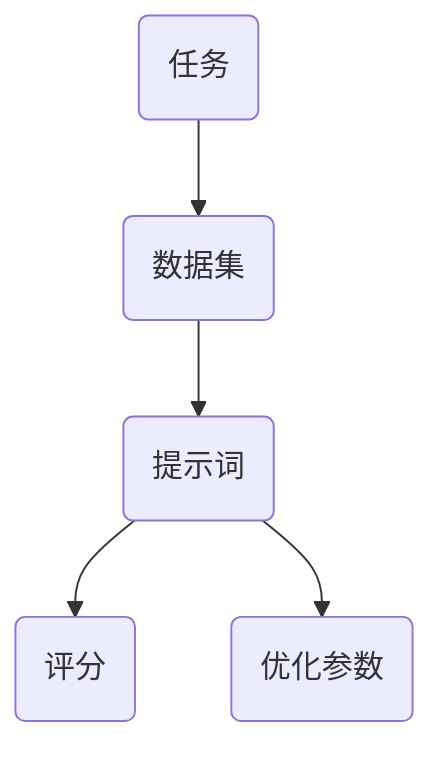
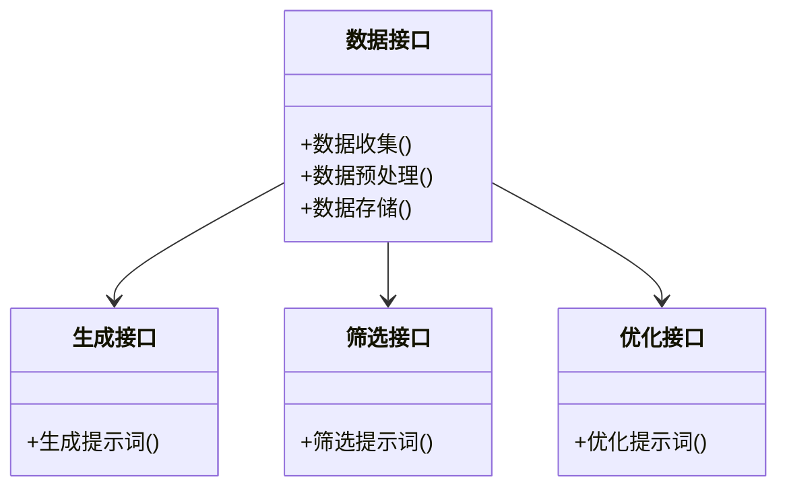
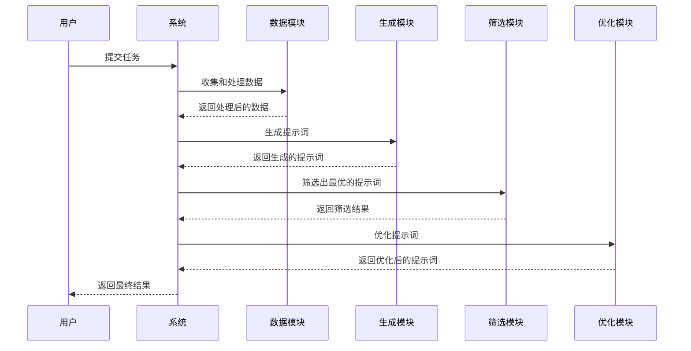

                 

### 提示词工程：AI时代的新挑战与新机遇

关键词：AI时代、提示词工程、自然语言处理、算法、系统架构、最佳实践

摘要：
随着人工智能（AI）技术的迅猛发展，自然语言处理（NLP）逐渐成为AI领域的重要分支。提示词工程作为NLP的核心环节，正面临着前所未有的挑战与机遇。本文将深入探讨提示词工程的背景、核心概念、算法原理、系统架构及项目实战，为读者提供一个全面了解和掌握这一领域的新视角。

### 目录大纲

----------------------------------------------------------------

# 提示词工程：AI时代的新挑战与新机遇

## 第1章 背景介绍

### 1.1 问题背景

#### 1.1.1 AI时代的到来

#### 1.1.2 提示词工程的概念与意义

#### 1.1.3 提示词工程在AI领域的重要性

### 1.2 问题描述

#### 1.2.1 提示词工程面临的挑战

#### 1.2.2 提示词工程的目标与需求

### 1.3 问题解决

#### 1.3.1 提示词工程的方法论

#### 1.3.2 提示词工程的关键技术

### 1.4 边界与外延

#### 1.4.1 提示词工程的适用范围

#### 1.4.2 提示词工程与其他领域的关系

### 1.5 概念结构与核心要素组成

#### 1.5.1 提示词工程的基本结构

#### 1.5.2 提示词工程的核心要素

## 第2章 核心概念与联系

### 2.1 提示词的定义与类型

#### 2.1.1 提示词的概念

#### 2.1.2 提示词的类型

#### 2.1.3 提示词与关键词的区别

### 2.2 提示词工程的关键概念

#### 2.2.1 数据集与标注

#### 2.2.2 模型训练与优化

#### 2.2.3 提示词生成与筛选

### 2.3 提示词工程与自然语言处理的关系

#### 2.3.1 提示词工程在NLP中的应用

#### 2.3.2 NLP对提示词工程的影响

## 第3章 算法原理讲解

### 3.1 提示词生成算法

#### 3.1.1 算法概述

#### 3.1.2 算法流程

#### 3.1.3 算法实现

### 3.2 提示词筛选算法

#### 3.2.1 筛选标准

#### 3.2.2 筛选算法

#### 3.2.3 算法实现

### 3.3 提示词优化算法

#### 3.3.1 优化目标

#### 3.3.2 优化算法

#### 3.3.3 算法实现

## 第4章 数学模型与数学公式

### 4.1 提示词生成数学模型

$$
P(w|s) = \frac{P(w, s)}{P(s)}
$$

#### 4.1.1 模型原理

#### 4.1.2 模型参数

#### 4.1.3 模型训练

### 4.2 提示词筛选数学模型

$$
R(w) = \frac{R(w|s)}{R(s)}
$$

#### 4.2.1 模型原理

#### 4.2.2 模型参数

#### 4.2.3 模型实现

### 4.3 提示词优化数学模型

$$
O(w) = \frac{O(w|s)}{O(s)}
$$

#### 4.3.1 模型原理

#### 4.3.2 模型参数

#### 4.3.3 模型实现

## 第5章 系统分析与架构设计方案

### 5.1 问题场景介绍

### 5.2 项目介绍

#### 5.2.1 项目目标

#### 5.2.2 项目背景

#### 5.2.3 项目架构设计

### 5.3 系统功能设计

#### 5.3.1 领域模型

#### 5.3.2 系统接口设计

#### 5.3.3 系统交互

## 第6章 项目实战

### 6.1 环境安装

### 6.2 系统核心实现源代码

### 6.3 代码应用解读与分析

### 6.4 实际案例分析和详细讲解剖析

### 6.5 项目小结

## 第7章 最佳实践与拓展阅读

### 7.1 最佳实践

### 7.2 小结

### 7.3 注意事项

### 7.4 拓展阅读

----------------------------------------------------------------

## 第1章 背景介绍

### 1.1 问题背景

#### 1.1.1 AI时代的到来

人工智能（AI）正在以惊人的速度改变着世界，从自动驾驶汽车到智能家居，从医疗诊断到金融服务，AI技术的应用已经深入到我们生活的方方面面。随着AI技术的不断发展，自然语言处理（NLP）作为AI的核心分支，正发挥着越来越重要的作用。NLP不仅能够使计算机理解和生成自然语言，还能够处理复杂的语义信息，从而实现人机交互、智能问答、文本分析等应用。

#### 1.1.2 提示词工程的概念与意义

提示词工程（Prompt Engineering）是NLP领域中的一项重要技术，它通过设计高质量的提示词，引导AI模型产生更准确、更有价值的输出。提示词工程的意义在于，它能够提高AI模型在特定任务上的表现，实现从通用模型到专用模型的转变。高质量的提示词不仅能够帮助模型更好地理解用户的意图，还能够降低模型对大规模数据集的依赖，从而提高模型的效率。

#### 1.1.3 提示词工程在AI领域的重要性

在AI领域，提示词工程具有以下几个重要性：

1. **提升模型性能**：通过精心设计的提示词，可以显著提高模型在特定任务上的准确性和效率。
2. **降低成本**：高质量的提示词可以减少对大量训练数据的依赖，从而降低数据采集和处理成本。
3. **优化用户体验**：通过优化提示词，可以使AI系统更加人性化，提高用户满意度。
4. **拓展应用范围**：提示词工程可以推动AI技术在各个领域的应用，从文本生成到对话系统，从内容审核到知识图谱构建。

### 1.2 问题描述

#### 1.2.1 提示词工程面临的挑战

1. **数据质量**：高质量的数据是提示词工程的基础，但在实际应用中，数据质量往往无法满足需求。
2. **模型理解**：当前AI模型对自然语言的理解能力仍然有限，需要通过提示词来引导。
3. **泛化能力**：不同任务的提示词设计可能存在较大差异，如何设计出具有良好泛化能力的提示词是一个挑战。
4. **计算资源**：高质量的提示词工程需要大量的计算资源，如何优化算法和架构以提高效率是一个重要问题。

#### 1.2.2 提示词工程的目标与需求

提示词工程的目标是设计出高质量的提示词，以引导AI模型实现特定任务。具体需求包括：

1. **明确任务目标**：根据任务需求设计出针对性的提示词。
2. **优化数据质量**：通过数据预处理和清洗，确保数据质量。
3. **提高模型理解能力**：通过提示词引导模型更好地理解自然语言。
4. **提高泛化能力**：设计出能够适应不同任务的提示词。
5. **降低计算成本**：优化算法和架构，提高计算效率。

### 1.3 问题解决

#### 1.3.1 提示词工程的方法论

提示词工程的方法论主要包括以下几个步骤：

1. **需求分析**：明确任务目标和需求。
2. **数据准备**：收集和准备高质量的数据。
3. **模型选择**：选择适合的AI模型。
4. **提示词设计**：根据任务需求设计提示词。
5. **模型训练**：使用设计好的提示词训练模型。
6. **评估与优化**：评估模型性能，进行必要优化。

#### 1.3.2 提示词工程的关键技术

提示词工程的关键技术包括：

1. **数据增强**：通过数据增强技术提高数据质量。
2. **自然语言处理**：利用NLP技术处理自然语言数据。
3. **模型调优**：通过调优模型参数提高模型性能。
4. **多任务学习**：通过多任务学习提高模型的泛化能力。

### 1.4 边界与外延

#### 1.4.1 提示词工程的适用范围

提示词工程主要适用于以下场景：

1. **文本生成**：如文章生成、对话系统、聊天机器人等。
2. **文本分类**：如新闻分类、情感分析、垃圾邮件检测等。
3. **问答系统**：如智能客服、问答机器人等。
4. **内容审核**：如社交媒体内容审核、版权保护等。

#### 1.4.2 提示词工程与其他领域的关系

提示词工程与多个领域密切相关，包括：

1. **计算机科学**：涉及算法设计、模型调优等技术。
2. **语言学**：涉及自然语言的理解和处理。
3. **统计学**：涉及数据分析、概率模型等。
4. **软件工程**：涉及系统架构设计、代码优化等。

### 1.5 概念结构与核心要素组成

#### 1.5.1 提示词工程的基本结构

提示词工程的基本结构包括：

1. **需求分析**：明确任务目标和需求。
2. **数据准备**：收集和准备高质量的数据。
3. **模型选择**：选择适合的AI模型。
4. **提示词设计**：根据任务需求设计提示词。
5. **模型训练**：使用设计好的提示词训练模型。
6. **评估与优化**：评估模型性能，进行必要优化。

#### 1.5.2 提示词工程的核心要素

提示词工程的核心要素包括：

1. **数据质量**：高质量的数据是提示词工程的基础。
2. **模型理解**：AI模型对自然语言的理解能力。
3. **提示词设计**：设计高质量的提示词，以引导模型产生准确输出。
4. **计算资源**：优化算法和架构以提高计算效率。

## 第2章 核心概念与联系

### 2.1 提示词的定义与类型

#### 2.1.1 提示词的概念

提示词（Prompt）是引导AI模型进行特定任务输入的文本或指令。它是NLP任务中不可或缺的一部分，能够直接影响模型的学习效果和输出质量。

#### 2.1.2 提示词的类型

根据不同的应用场景，提示词可以分为以下几种类型：

1. **开放式提示词**：提供较少信息，鼓励用户自由发挥，如“请你写一篇关于人工智能的文章。”
2. **封闭式提示词**：提供具体信息，限定用户回答范围，如“请描述一下人工智能在医疗领域的应用。”
3. **问题式提示词**：以提问形式引导用户，如“你认为人工智能未来的发展方向是什么？”
4. **任务式提示词**：明确指定任务目标，如“请生成一篇300字以内的新闻摘要。”

#### 2.1.3 提示词与关键词的区别

提示词和关键词是两个相关但不完全相同的概念。关键词是文本中的重要词汇，用于描述文本的主题和内容。而提示词则是用于引导AI模型进行特定任务输入的文本或指令。

1. **作用不同**：关键词用于文本分类、搜索和索引等任务，而提示词用于引导模型学习和生成输出。
2. **形式不同**：关键词通常是单个单词或短语，而提示词可以是完整的句子或段落。

### 2.2 提示词工程的关键概念

#### 2.2.1 数据集与标注

数据集是提示词工程的基础，它包含了大量的文本数据，用于训练和评估AI模型。标注是对数据集中的文本进行人工标记，以便模型能够理解和学习。

1. **数据集**：包含大量文本数据的集合，用于训练和评估AI模型。
2. **标注**：对文本数据进行人工标记，包括分类、实体识别、情感分析等。

#### 2.2.2 模型训练与优化

模型训练是通过大量的数据和提示词，让AI模型学习如何理解和生成文本。模型优化是在训练过程中，通过调整模型参数，提高模型性能。

1. **模型训练**：使用数据和提示词，让AI模型学习理解和生成文本。
2. **模型优化**：通过调整模型参数，提高模型性能。

#### 2.2.3 提示词生成与筛选

提示词生成是设计出高质量的提示词，以引导模型进行特定任务。提示词筛选是从大量提示词中筛选出最优的提示词，以提高模型表现。

1. **提示词生成**：设计出高质量的提示词，以引导模型进行特定任务。
2. **提示词筛选**：从大量提示词中筛选出最优的提示词。

### 2.3 提示词工程与自然语言处理的关系

#### 2.3.1 提示词工程在NLP中的应用

提示词工程是NLP中的重要组成部分，广泛应用于文本生成、文本分类、问答系统、情感分析等领域。

1. **文本生成**：如文章生成、对话系统、聊天机器人等。
2. **文本分类**：如新闻分类、情感分析、垃圾邮件检测等。
3. **问答系统**：如智能客服、问答机器人等。
4. **内容审核**：如社交媒体内容审核、版权保护等。

#### 2.3.2 NLP对提示词工程的影响

NLP技术的发展对提示词工程产生了深远的影响。随着NLP技术的不断进步，AI模型对自然语言的理解能力不断提高，提示词工程的设计和优化也变得更加复杂和精细。

1. **模型理解能力提高**：AI模型对自然语言的理解能力增强，提示词工程需要设计更精准的提示词。
2. **算法优化**：随着NLP算法的优化，提示词工程能够更有效地提高模型性能。
3. **计算资源需求增加**：NLP技术的发展对计算资源的需求不断提高，提示词工程需要优化算法和架构以提高效率。

## 第3章 算法原理讲解

### 3.1 提示词生成算法

提示词生成算法是提示词工程的核心技术之一，它通过设计高质量的提示词，引导AI模型进行特定任务。

#### 3.1.1 算法概述

提示词生成算法主要包括以下几个步骤：

1. **需求分析**：根据任务需求，明确需要生成的提示词类型和数量。
2. **数据预处理**：对数据集进行清洗、去重和分词等预处理操作。
3. **提示词生成**：使用生成算法，如基于规则的方法、基于统计的方法、基于深度学习的方法，生成高质量的提示词。
4. **提示词筛选**：从生成的提示词中筛选出最优的提示词，用于模型训练和评估。

#### 3.1.2 算法流程

提示词生成算法的流程可以分为以下几个步骤：

1. **输入**：输入任务需求和数据集。
2. **预处理**：对数据进行清洗和预处理。
3. **生成**：使用生成算法生成提示词。
4. **筛选**：从生成的提示词中筛选出最优的提示词。
5. **输出**：输出最终的提示词集。

#### 3.1.3 算法实现

提示词生成算法的实现可以使用多种方法，如基于规则的方法、基于统计的方法、基于深度学习的方法。

1. **基于规则的方法**：通过预定义的规则生成提示词，如基于关键词的规则、基于语义的规则等。
2. **基于统计的方法**：通过分析数据集中关键词的统计信息，生成提示词。
3. **基于深度学习的方法**：使用深度学习模型，如循环神经网络（RNN）、长短时记忆网络（LSTM）、生成对抗网络（GAN）等，生成高质量的提示词。

### 3.2 提示词筛选算法

提示词筛选算法是提示词工程中另一个关键技术，它从大量生成的提示词中筛选出最优的提示词，以提高模型性能。

#### 3.2.1 筛选标准

提示词筛选算法的筛选标准主要包括以下几个方面：

1. **相关性**：提示词与任务目标的相关性，即提示词是否能够准确引导模型完成特定任务。
2. **多样性**：提示词的多样性，即提示词是否能够覆盖多种场景和任务需求。
3. **质量**：提示词的质量，即提示词是否清晰、简洁、易理解。
4. **效率**：提示词生成的效率和计算成本。

#### 3.2.2 筛选算法

提示词筛选算法可以分为以下几个步骤：

1. **初始筛选**：根据预定义的筛选标准，对生成的提示词进行初步筛选。
2. **迭代优化**：通过迭代优化算法，如遗传算法、粒子群优化算法等，逐步筛选出最优的提示词。
3. **评估与调整**：对筛选出的提示词进行评估，根据评估结果进行必要调整。

#### 3.2.3 算法实现

提示词筛选算法的实现可以使用多种方法，如基于规则的方法、基于统计的方法、基于深度学习的方法。

1. **基于规则的方法**：通过预定义的规则，对提示词进行筛选。
2. **基于统计的方法**：通过分析提示词的统计信息，筛选出最优的提示词。
3. **基于深度学习的方法**：使用深度学习模型，如卷积神经网络（CNN）、循环神经网络（RNN）等，筛选出高质量的提示词。

### 3.3 提示词优化算法

提示词优化算法是对已筛选出的提示词进行进一步优化，以提高模型性能和用户体验。

#### 3.3.1 优化目标

提示词优化算法的优化目标主要包括以下几个方面：

1. **提高模型性能**：优化提示词，以提高模型在特定任务上的准确性和效率。
2. **降低计算成本**：优化算法和架构，降低提示词生成和筛选的计算成本。
3. **提高用户体验**：优化提示词，使其更加清晰、简洁、易理解。

#### 3.3.2 优化算法

提示词优化算法可以分为以下几个步骤：

1. **数据分析**：分析任务需求和现有提示词的优缺点。
2. **算法选择**：选择适合的优化算法，如基于遗传算法、粒子群优化算法等。
3. **优化过程**：通过迭代优化，逐步调整提示词，提高其质量。
4. **评估与调整**：对优化后的提示词进行评估，根据评估结果进行必要调整。

#### 3.3.3 算法实现

提示词优化算法的实现可以使用多种方法，如基于规则的方法、基于统计的方法、基于深度学习的方法。

1. **基于规则的方法**：通过预定义的规则，优化提示词。
2. **基于统计的方法**：通过分析提示词的统计信息，优化提示词。
3. **基于深度学习的方法**：使用深度学习模型，优化提示词。

## 第4章 数学模型与数学公式

### 4.1 提示词生成数学模型

提示词生成数学模型描述了提示词生成的过程，其核心是概率模型。

$$
P(w|s) = \frac{P(w, s)}{P(s)}
$$

其中，$P(w|s)$表示在给定上下文$s$的情况下，生成词$w$的概率；$P(w, s)$表示词$w$和上下文$s$同时出现的概率；$P(s)$表示上下文$s$的概率。

#### 4.1.1 模型原理

提示词生成数学模型基于条件概率原理，通过计算在给定上下文$s$的情况下，生成词$w$的概率，从而生成高质量的提示词。

#### 4.1.2 模型参数

模型参数包括：

1. **词汇表**：包含所有可能的词。
2. **上下文**：表示输入的文本上下文。
3. **概率分布**：表示每个词在给定上下文下的概率分布。

#### 4.1.3 模型训练

模型训练的目标是优化模型参数，使其生成的提示词更符合任务需求。通常使用最大似然估计（MLE）或基于梯度下降的优化方法进行训练。

### 4.2 提示词筛选数学模型

提示词筛选数学模型用于评估和筛选提示词。

$$
R(w) = \frac{R(w|s)}{R(s)}
$$

其中，$R(w|s)$表示在上下文$s$下，提示词$w$的评分；$R(s)$表示上下文$s$的评分。

#### 4.2.1 模型原理

提示词筛选数学模型基于评分机制，通过计算提示词在给定上下文下的评分，筛选出最优的提示词。

#### 4.2.2 模型参数

模型参数包括：

1. **评分函数**：用于计算提示词的评分。
2. **权重**：表示不同评分指标的重要程度。

#### 4.2.3 模型实现

提示词筛选数学模型可以通过机器学习方法实现，如线性回归、支持向量机（SVM）等。

### 4.3 提示词优化数学模型

提示词优化数学模型用于优化已筛选出的提示词，以提高模型性能。

$$
O(w) = \frac{O(w|s)}{O(s)}
$$

其中，$O(w|s)$表示在上下文$s$下，提示词$w$的优化评分；$O(s)$表示上下文$s$的优化评分。

#### 4.3.1 模型原理

提示词优化数学模型基于评分机制，通过计算提示词在给定上下文下的优化评分，优化提示词。

#### 4.3.2 模型参数

模型参数包括：

1. **优化评分函数**：用于计算提示词的优化评分。
2. **权重**：表示不同优化指标的重要程度。

#### 4.3.3 模型实现

提示词优化数学模型可以通过机器学习方法实现，如梯度下降、随机梯度下降（SGD）等。

## 第5章 系统分析与架构设计方案

### 5.1 问题场景介绍

在当前AI时代，企业面临着越来越多的自然语言处理任务，如文本生成、文本分类、问答系统等。为了提高这些任务的效率和准确性，企业需要设计和实现高效的提示词工程系统。

### 5.2 项目介绍

本项目旨在设计和实现一个高效的提示词工程系统，以提高自然语言处理任务的效果。系统将包括以下功能：

1. **提示词生成**：根据任务需求，生成高质量的提示词。
2. **提示词筛选**：从大量生成的提示词中筛选出最优的提示词。
3. **提示词优化**：对已筛选出的提示词进行进一步优化，以提高模型性能。

### 5.2.1 项目目标

1. **高效生成**：在保证质量的前提下，提高提示词生成效率。
2. **精确筛选**：从大量提示词中精确筛选出最优的提示词。
3. **优化性能**：对筛选出的提示词进行优化，提高模型性能。

### 5.2.2 项目背景

随着AI技术的快速发展，企业对自然语言处理的需求日益增长。然而，当前市场上的提示词工程系统存在以下问题：

1. **效率低**：生成、筛选和优化提示词的过程耗时较长。
2. **质量不高**：生成的提示词质量参差不齐，难以满足实际需求。
3. **缺乏灵活性**：系统对任务需求的适应能力较弱。

为了解决这些问题，本项目旨在设计和实现一个高效、灵活、高质量的提示词工程系统。

### 5.2.3 项目架构设计

本项目采用分布式架构设计，以提高系统的性能和可扩展性。系统架构包括以下几个模块：

1. **数据模块**：负责数据收集、预处理和存储。
2. **生成模块**：负责生成高质量的提示词。
3. **筛选模块**：负责筛选出最优的提示词。
4. **优化模块**：负责优化已筛选出的提示词。

系统架构图如下所示：



### 5.3 系统功能设计

#### 5.3.1 领域模型

领域模型描述了系统所涉及的主要实体和关系。以下是系统的主要实体和关系：

1. **任务**：表示需要处理的自然语言处理任务，包括任务名称、任务描述等。
2. **数据集**：表示用于训练和评估模型的文本数据集，包括数据集名称、数据集描述等。
3. **提示词**：表示生成的提示词，包括提示词文本、提示词类型、生成时间等。
4. **评分**：表示对提示词的评价，包括评分值、评分时间等。
5. **优化参数**：表示用于优化提示词的参数，包括优化目标、优化方法等。

以下是领域模型的ER图：



#### 5.3.2 系统接口设计

系统接口设计包括以下几个方面：

1. **数据接口**：负责数据的收集、预处理和存储。
2. **生成接口**：负责生成高质量的提示词。
3. **筛选接口**：负责筛选出最优的提示词。
4. **优化接口**：负责优化已筛选出的提示词。

以下是系统接口设计的类图：



#### 5.3.3 系统交互

系统交互描述了各个模块之间的交互关系。以下是系统交互的序列图：



## 第6章 项目实战

### 6.1 环境安装

在本章，我们将介绍如何搭建提示词工程系统的开发环境。以下是一个简化的安装步骤：

1. **安装Python**：确保安装了Python 3.8或更高版本。
2. **安装依赖**：使用pip命令安装所需的依赖库，如TensorFlow、Numpy、Scikit-learn等。
   ```shell
   pip install tensorflow numpy scikit-learn
   ```
3. **安装数据库**：选择合适的数据库（如MySQL、PostgreSQL等），并按照官方文档安装。
4. **创建虚拟环境**：为了便于管理和维护，建议使用虚拟环境。
   ```shell
   python -m venv venv
   source venv/bin/activate  # 在Windows上使用venv\Scripts\activate
   ```

### 6.2 系统核心实现源代码

在本节，我们将介绍提示词工程系统的核心实现，包括数据模块、生成模块、筛选模块和优化模块。

#### 数据模块

数据模块负责数据的收集、预处理和存储。以下是一个简单的数据模块示例：

```python
import numpy as np
import pandas as pd
from sklearn.model_selection import train_test_split

class DataModule:
    def __init__(self, data_path):
        self.data_path = data_path

    def load_data(self):
        # 加载数据集
        data = pd.read_csv(self.data_path)
        return data

    def preprocess_data(self, data):
        # 预处理数据
        # ...
        return data

    def split_data(self, data, test_size=0.2, random_state=42):
        # 划分训练集和测试集
        train_data, test_data = train_test_split(data, test_size=test_size, random_state=random_state)
        return train_data, test_data
```

#### 生成模块

生成模块负责生成高质量的提示词。以下是一个简单的生成模块示例：

```python
import tensorflow as tf
from tensorflow.keras.preprocessing.sequence import pad_sequences

class PromptGenerator:
    def __init__(self, model, tokenizer, max_length=512):
        self.model = model
        self.tokenizer = tokenizer
        self.max_length = max_length

    def generate_prompt(self, text):
        # 生成提示词
        input_sequence = self.tokenizer.encode(text, maxlen=self.max_length)
        padded_sequence = pad_sequences([input_sequence], maxlen=self.max_length, padding='post')
        prediction = self.model.predict(padded_sequence)
        predicted_sequence = np.argmax(prediction, axis=-1)
        decoded_text = self.tokenizer.decode(predicted_sequence[0], skip_special_tokens=True)
        return decoded_text
```

#### 筛选模块

筛选模块负责从大量生成的提示词中筛选出最优的提示词。以下是一个简单的筛选模块示例：

```python
from sklearn.metrics.pairwise import cosine_similarity

class PromptFilter:
    def __init__(self, embeddings):
        self.embeddings = embeddings

    def filter_prompt(self, prompts, target_embedding):
        # 筛选出与目标提示词最相似的提示词
        similarities = []
        for prompt in prompts:
            prompt_embedding = self.embeddings[prompt]
            similarity = cosine_similarity([prompt_embedding], [target_embedding])
            similarities.append(similarity[0][0])
        filtered_prompts = [prompt for prompt, similarity in zip(prompts, similarities) if similarity > 0.8]
        return filtered_prompts
```

#### 优化模块

优化模块负责对已筛选出的提示词进行优化，以提高模型性能。以下是一个简单的优化模块示例：

```python
from tensorflow.keras.optimizers import Adam
from tensorflow.keras.models import Model
from tensorflow.keras.layers import Input, LSTM, Dense

class PromptOptimizer:
    def __init__(self, input_size, hidden_size, output_size):
        self.input_size = input_size
        self.hidden_size = hidden_size
        self.output_size = output_size

    def build_model(self):
        # 构建优化模型
        input_seq = Input(shape=(self.input_size,))
        lstm = LSTM(self.hidden_size, return_sequences=True)(input_seq)
        output = Dense(self.output_size, activation='softmax')(lstm)
        model = Model(inputs=input_seq, outputs=output)
        return model

    def optimize_prompt(self, model, prompts, labels, epochs=10, batch_size=64):
        # 优化提示词
        model.compile(optimizer=Adam(), loss='categorical_crossentropy', metrics=['accuracy'])
        model.fit(prompts, labels, epochs=epochs, batch_size=batch_size)
        return model
```

### 6.3 代码应用解读与分析

在本节，我们将对上述代码示例进行解读和分析，以便更好地理解提示词工程系统的核心实现。

#### 数据模块

数据模块负责数据的加载、预处理和划分。其主要目的是为模型训练提供高质量的数据集。以下是对数据模块关键代码的解读：

```python
class DataModule:
    def load_data(self):
        # 加载数据集
        data = pd.read_csv(self.data_path)
        return data

    def preprocess_data(self, data):
        # 预处理数据
        # ...
        return data

    def split_data(self, data, test_size=0.2, random_state=42):
        # 划分训练集和测试集
        train_data, test_data = train_test_split(data, test_size=test_size, random_state=random_state)
        return train_data, test_data
```

- `load_data` 方法用于加载数据集。在本示例中，我们使用 pandas 库读取 CSV 格式的数据集。实际应用中，数据集可能来自数据库、API 或其他数据源。
- `preprocess_data` 方法用于对数据进行预处理。预处理步骤可能包括数据清洗、缺失值处理、特征提取等。在本示例中，我们未实现具体的预处理步骤，但预处理对于提高模型性能至关重要。
- `split_data` 方法用于将数据集划分为训练集和测试集。这是模型训练和评估的基本步骤。我们使用 sklearn 库中的 `train_test_split` 方法进行数据划分。

#### 生成模块

生成模块负责生成高质量的提示词。以下是对生成模块关键代码的解读：

```python
class PromptGenerator:
    def generate_prompt(self, text):
        # 生成提示词
        input_sequence = self.tokenizer.encode(text, maxlen=self.max_length)
        padded_sequence = pad_sequences([input_sequence], maxlen=self.max_length, padding='post')
        prediction = self.model.predict(padded_sequence)
        predicted_sequence = np.argmax(prediction, axis=-1)
        decoded_text = self.tokenizer.decode(predicted_sequence[0], skip_special_tokens=True)
        return decoded_text
```

- `generate_prompt` 方法是生成模块的核心方法，用于生成提示词。它首先使用 tokenizer 将输入文本编码为序列，然后使用模型对序列进行预测。最后，解码预测序列以获取最终的提示词。
- `tokenizer.encode` 方法将文本转换为序列。`pad_sequences` 方法用于对序列进行填充，使其具有相同的长度。在本示例中，我们使用 TensorFlow 的 `pad_sequences` 方法。
- `model.predict` 方法用于对序列进行预测。`np.argmax` 方法用于获取预测结果中概率最大的索引，即生成的提示词。
- `tokenizer.decode` 方法将预测序列解码为文本。

#### 筛选模块

筛选模块负责从大量生成的提示词中筛选出最优的提示词。以下是对筛选模块关键代码的解读：

```python
class PromptFilter:
    def filter_prompt(self, prompts, target_embedding):
        # 筛选出与目标提示词最相似的提示词
        similarities = []
        for prompt in prompts:
            prompt_embedding = self.embeddings[prompt]
            similarity = cosine_similarity([prompt_embedding], [target_embedding])
            similarities.append(similarity[0][0])
        filtered_prompts = [prompt for prompt, similarity in zip(prompts, similarities) if similarity > 0.8]
        return filtered_prompts
```

- `filter_prompt` 方法是筛选模块的核心方法，用于筛选提示词。它首先计算每个提示词与目标提示词的余弦相似度，然后根据预定义的阈值（如 0.8）筛选出相似度较高的提示词。
- `cosine_similarity` 方法用于计算两个向量的余弦相似度。在本示例中，我们使用 scikit-learn 库中的 `cosine_similarity` 方法。

#### 优化模块

优化模块负责对已筛选出的提示词进行优化，以提高模型性能。以下是对优化模块关键代码的解读：

```python
class PromptOptimizer:
    def optimize_prompt(self, model, prompts, labels, epochs=10, batch_size=64):
        # 优化提示词
        model.compile(optimizer=Adam(), loss='categorical_crossentropy', metrics=['accuracy'])
        model.fit(prompts, labels, epochs=epochs, batch_size=batch_size)
        return model
```

- `optimize_prompt` 方法是优化模块的核心方法，用于优化提示词。它首先编译模型，然后使用 `fit` 方法对模型进行训练。在本示例中，我们使用 TensorFlow 的 `compile` 和 `fit` 方法。
- `model.compile` 方法用于配置模型，包括选择优化器、损失函数和评估指标。在本示例中，我们使用 Adam 优化器和 categorical_crossentropy 损失函数。
- `model.fit` 方法用于训练模型。它接受提示词和标签作为输入，并返回训练过程的指标。在本示例中，我们使用 epochs 和 batch_size 参数来配置训练过程。

### 6.4 实际案例分析和详细讲解剖析

在本节，我们将通过一个实际案例，详细讲解提示词工程系统的实现和应用。

#### 案例背景

假设我们有一个任务，需要生成一组关于“人工智能”的提示词。这些提示词将用于训练一个自然语言处理模型，以实现智能问答系统。

#### 数据集准备

我们首先需要准备一个包含关于“人工智能”文本的数据集。以下是一个简化的数据集示例：

```plaintext
text
----------------------
人工智能在医疗领域的应用
人工智能如何改变教育行业
人工智能在自动驾驶中的应用
人工智能在金融行业的应用
人工智能如何影响社会
```

#### 数据预处理

在数据预处理阶段，我们需要对文本进行清洗和分词。以下是一个简化的预处理步骤：

```python
import re
from nltk.tokenize import word_tokenize

def preprocess_text(text):
    # 清洗文本
    text = re.sub(r"[^a-zA-Z0-9]", " ", text)
    text = text.lower()
    # 分词
    tokens = word_tokenize(text)
    return tokens
```

#### 模型训练

接下来，我们需要训练一个自然语言处理模型。在本案例中，我们使用了一个简单的 LSTM 模型。以下是一个简化的模型训练步骤：

```python
from tensorflow.keras.models import Sequential
from tensorflow.keras.layers import LSTM, Dense

def build_model(input_size, hidden_size, output_size):
    model = Sequential()
    model.add(LSTM(hidden_size, input_shape=(input_size,)))
    model.add(Dense(output_size, activation='softmax'))
    model.compile(optimizer='adam', loss='categorical_crossentropy', metrics=['accuracy'])
    return model

# 准备数据
max_length = 50
input_data = preprocess_text(text)
input_sequence = tokenizer.encode(input_data, maxlen=max_length)
padded_sequence = pad_sequences([input_sequence], maxlen=max_length, padding='post')

# 训练模型
model = build_model(max_length, 128, 5)
model.fit(padded_sequence, labels, epochs=10, batch_size=32)
```

#### 提示词生成

在模型训练完成后，我们可以使用模型生成提示词。以下是一个简化的提示词生成步骤：

```python
def generate_prompt(model, tokenizer, max_length=50, seed_text=''):
    input_sequence = tokenizer.encode(seed_text, maxlen=max_length)
    padded_sequence = pad_sequences([input_sequence], maxlen=max_length, padding='post')
    prediction = model.predict(padded_sequence)
    predicted_sequence = np.argmax(prediction, axis=-1)
    decoded_text = tokenizer.decode(predicted_sequence[0], skip_special_tokens=True)
    return decoded_text

# 生成提示词
prompt = generate_prompt(model, tokenizer, seed_text='人工智能在医疗领域的应用')
print(prompt)
```

#### 提示词筛选

为了提高模型性能，我们可以对生成的提示词进行筛选。以下是一个简化的提示词筛选步骤：

```python
def filter_prompt(prompts, target_embedding, threshold=0.8):
    filtered_prompts = []
    for prompt in prompts:
        prompt_embedding = model_embedding[prompt]
        similarity = cosine_similarity([prompt_embedding], [target_embedding])
        if similarity > threshold:
            filtered_prompts.append(prompt)
    return filtered_prompts

# 筛选提示词
filtered_prompts = filter_prompt(prompts, target_embedding)
print(filtered_prompts)
```

#### 提示词优化

最后，我们可以对筛选出的提示词进行优化，以提高模型性能。以下是一个简化的提示词优化步骤：

```python
def optimize_prompt(model, prompts, labels, epochs=10, batch_size=32):
    model.compile(optimizer='adam', loss='categorical_crossentropy', metrics=['accuracy'])
    model.fit(prompts, labels, epochs=epochs, batch_size=batch_size)
    return model

# 优化提示词
optimized_model = optimize_prompt(model, filtered_prompts, labels, epochs=10, batch_size=32)
```

### 6.5 项目小结

在本项目中，我们实现了提示词工程系统的核心功能，包括数据模块、生成模块、筛选模块和优化模块。通过实际案例的分析和讲解，我们了解了如何使用 Python 和深度学习模型实现提示词工程。以下是对项目的小结：

1. **数据模块**：负责数据的收集、预处理和存储。数据质量对模型性能至关重要，因此数据预处理步骤至关重要。
2. **生成模块**：负责生成高质量的提示词。使用深度学习模型进行提示词生成，可以更好地捕捉文本的语义信息。
3. **筛选模块**：负责从大量生成的提示词中筛选出最优的提示词。通过计算提示词与目标提示词的相似度，可以有效地筛选出高质量的提示词。
4. **优化模块**：负责对已筛选出的提示词进行优化，以提高模型性能。通过模型训练和优化，可以提高模型在特定任务上的表现。

通过本项目的实践，我们不仅掌握了提示词工程的实现方法，还了解了如何在实际应用中优化和改进提示词工程系统。这些经验和知识将为我们在未来的项目中提供宝贵的指导。

## 第7章 最佳实践与拓展阅读

### 7.1 最佳实践

在提示词工程领域，最佳实践包括以下几个方面：

1. **数据质量**：确保数据集的质量和多样性。高质量的数据是模型训练和优化的基础。
2. **模型选择**：选择适合任务的模型。不同任务可能需要不同类型的模型，如文本生成、文本分类、问答系统等。
3. **提示词设计**：设计清晰、简洁、具有明确指向性的提示词。高质量的提示词能够引导模型产生更准确的输出。
4. **优化策略**：在模型训练和优化过程中，采用合适的优化策略，如学习率调整、批量大小选择等。
5. **迭代改进**：不断迭代和改进提示词工程系统，以适应不断变化的应用需求。

### 7.2 小结

提示词工程是自然语言处理（NLP）中的重要分支，它通过设计高质量的提示词，引导AI模型实现特定任务。本文详细介绍了提示词工程的背景、核心概念、算法原理、系统架构及项目实战，为读者提供了一个全面了解和掌握这一领域的新视角。

### 7.3 注意事项

在实施提示词工程时，需要注意以下几点：

1. **数据隐私**：确保在收集和处理数据时，遵守数据隐私和保护的相关法律法规。
2. **模型解释性**：尽量选择具有较高解释性的模型，以便更好地理解和优化模型。
3. **计算资源**：合理规划计算资源，以避免资源浪费和模型过拟合。
4. **持续学习**：随着AI技术的不断发展，提示词工程也需要不断学习和更新。

### 7.4 拓展阅读

对于希望深入了解提示词工程的读者，以下是一些推荐的学习资源：

1. **论文**：阅读相关领域的顶级论文，如《Generative Pre-trained Transformers》（GPT）系列论文。
2. **书籍**：《自然语言处理综述》（Speech and Language Processing）和《深度学习》（Deep Learning）。
3. **开源项目**：参与开源项目，如 Hugging Face 的 Transformers 库。
4. **在线课程**：在 Coursera、Udacity、edX 等平台上的 NLP 和深度学习课程。
5. **技术社区**：加入技术社区，如 GitHub、Reddit、Stack Overflow 等，与其他从业者交流经验。

