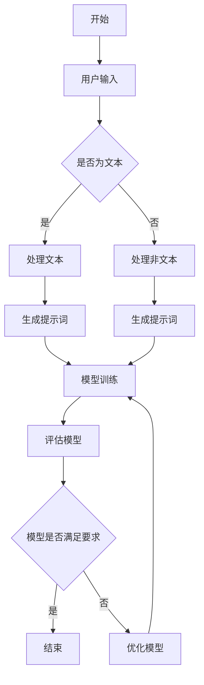
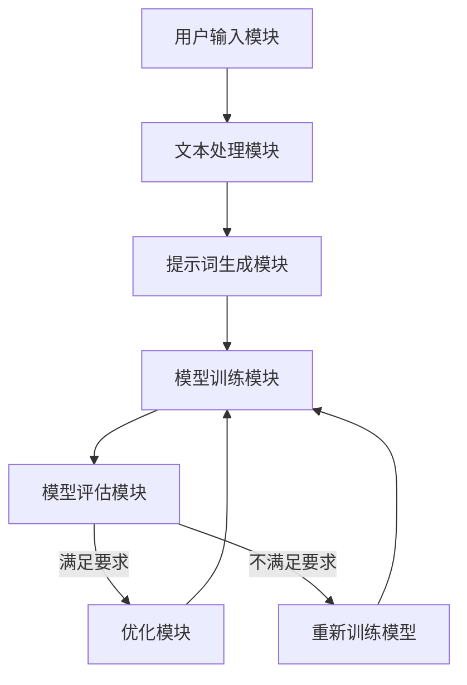
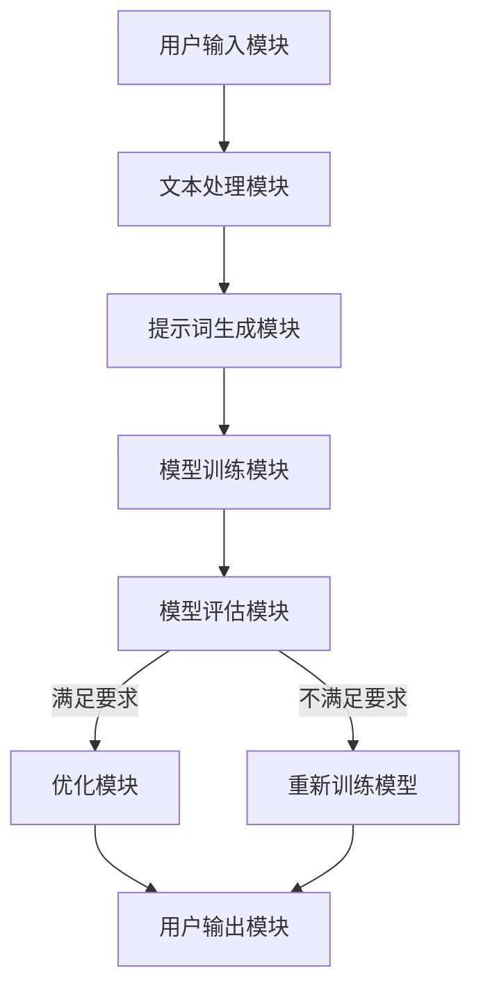

                 

## 提示词工程：AI时代的新领域

### 关键词：AI、自然语言处理、机器学习、人机交互、提示词工程

#### 摘要：

在AI技术迅猛发展的今天，一个新的领域——“提示词工程”逐渐崭露头角。本文将详细介绍提示词工程的背景、核心概念、设计原理与流程，并结合实际案例进行分析和讨论。通过本文的阅读，读者将全面了解提示词工程在AI时代的重要性及其应用价值。

### 第一部分：背景介绍

#### 第1章 问题背景与核心概念

#### 1.1 问题背景

##### 1.1.1 AI时代的新领域

AI技术正在从实验室走向实际应用，逐渐渗透到各个领域。随着AI技术的不断进步，一个新的领域——“提示词工程”逐渐受到关注。提示词工程是AI时代的一个新领域，它涉及到自然语言处理、机器学习和人机交互等多个方面，其核心目的是通过设计高质量的提示词，提高机器学习和自然语言处理模型的性能和用户体验。

##### 1.1.2 提示词工程的应用场景

提示词工程的应用场景非常广泛，包括但不限于以下几个方面：

- 智能问答系统：通过设计高质量的提示词，可以使问答系统更加智能和人性化。
- 机器翻译：提示词的设计对于提高机器翻译的准确性和流畅性至关重要。
- 文本生成：通过提示词，可以引导文本生成模型生成更有创意和逻辑性的文本。
- 声音助手：如Siri、Alexa等，提示词的设计直接影响用户的交互体验。

##### 1.2 核心概念

##### 1.2.1 提示词

提示词是提示词工程中的基本概念，它是用于引导模型进行学习和生成文本的关键输入。一个好的提示词应该具备以下特点：

- 准确性：提示词需要准确地传达用户的需求和信息。
- 简洁性：提示词应该尽量简洁，避免冗长和复杂。
- 完整性：提示词应该包含足够的上下文信息，以便模型能够更好地理解和生成相关文本。

##### 1.2.2 提示词设计原则

提示词的设计需要遵循以下原则：

- 目标明确：提示词应该明确表达用户的目标或需求。
- 结构清晰：提示词应该具有清晰的结构，有助于模型理解和生成相关文本。
- 灵活多样：提示词应该具有多样性，以适应不同的应用场景和用户需求。

##### 1.2.3 提示词工程流程

提示词工程的流程通常包括以下步骤：

1. 需求分析：了解用户需求和应用场景。
2. 提示词生成：根据需求分析，生成高质量的提示词。
3. 模型训练：使用生成的提示词训练机器学习和自然语言处理模型。
4. 评估优化：对模型进行评估和优化，以提高其性能和用户体验。

##### 1.3 本章小结

本章介绍了AI时代的新领域——提示词工程的背景、核心概念和设计原则。通过本章的学习，读者可以了解到提示词工程的重要性和应用场景，以及如何设计高质量的提示词。提示词工程是AI时代的一个重要方向，对于提高机器学习和自然语言处理模型的性能和用户体验具有重要意义。

### 第二部分：核心概念与联系

#### 第2章 提示词设计原理与核心要素

##### 2.1 提示词设计原理

##### 2.1.1 提示词生成策略

提示词生成策略是提示词设计的关键步骤。常用的生成策略包括：

- 基于规则的方法：通过预设的规则和模板生成提示词。
- 基于数据的方法：通过分析大量的语料库，自动生成提示词。
- 基于机器学习的方法：使用机器学习算法，根据输入数据自动生成提示词。

##### 2.1.2 提示词属性特征对比

提示词的属性特征包括准确性、简洁性、完整性和多样性等。以下是一个简单的对比表格：

| 提示词属性 | 准确性 | 简洁性 | 完整性 | 多样性 |
| :-------: | :---: | :---: | :---: | :---: |
| 规则方法 | 较高 | 一般 | 较高 | 较低 |
| 数据方法 | 较高 | 较高 | 较高 | 较高 |
| 机器学习方法 | 较高 | 较高 | 较高 | 较高 |

##### 2.2 核心要素

##### 2.2.1 上下文信息

上下文信息是提示词设计中的关键要素。高质量的提示词应该包含足够的上下文信息，以便模型能够更好地理解和生成相关文本。上下文信息的来源包括：

- 用户输入：直接从用户输入中提取上下文信息。
- 历史数据：从历史交互数据中提取上下文信息。
- 知识图谱：利用知识图谱提取上下文信息。

##### 2.2.2 模型适应性

提示词的设计需要考虑模型的适应性。不同的模型对提示词的要求可能有所不同，因此在设计提示词时需要根据具体模型的特点进行调整。

##### 2.2.3 用户互动性

提示词的设计应该具有用户互动性，以提高用户体验。用户互动性包括：

- 互动引导：通过提示词引导用户进行互动。
- 互动反馈：根据用户的反馈调整提示词。

##### 2.3 ER实体关系图架构

以下是一个简单的ER实体关系图架构：

```mermaid
erDiagram
  User ||--|{ Prompt }|| Prompt
  Prompt ||--|{ Response }|| Respo
```

### 第三部分：算法原理与系统架构

#### 第3章 算法原理讲解

##### 3.1 算法mermaid流程图



##### 3.2 Python源代码实现

```python
import numpy as np
import pandas as pd
from sklearn.feature_extraction.text import TfidfVectorizer
from sklearn.metrics.pairwise import cosine_similarity

# 3.3 数学模型和公式

提示词生成算法的核心是余弦相似度。假设我们有两个向量\(v_1\)和\(v_2\)，它们的余弦相似度可以表示为：

$$
\cos(\theta) = \frac{v_1 \cdot v_2}{\|v_1\| \|v_2\|}
$$

其中，\(\theta\)是两个向量之间的夹角，\(\cdot\)表示向量的点积，\(\|\|\)表示向量的模。

##### 3.4 举例说明

假设我们有两个向量\(v_1 = (1, 2, 3)\)和\(v_2 = (4, 5, 6)\)，它们的余弦相似度为：

$$
\cos(\theta) = \frac{(1, 2, 3) \cdot (4, 5, 6)}{\| (1, 2, 3) \|\| (4, 5, 6) \|} = \frac{1 \times 4 + 2 \times 5 + 3 \times 6}{\sqrt{1^2 + 2^2 + 3^2} \sqrt{4^2 + 5^2 + 6^2}} = \frac{4 + 10 + 18}{\sqrt{14} \sqrt{77}} \approx 0.933
$$

这表示这两个向量之间的夹角非常小，它们非常相似。

##### 3.5 系统分析与架构设计

##### 3.5.1 问题场景介绍

假设我们开发一个智能问答系统，用户可以输入问题，系统需要生成高质量的答案。

##### 3.5.2 系统功能设计

系统功能设计包括以下几个模块：

- 用户输入模块：接收用户输入的问题。
- 文本处理模块：对输入的问题进行处理，提取关键信息。
- 提示词生成模块：根据关键信息生成高质量的提示词。
- 模型训练模块：使用生成的提示词训练机器学习和自然语言处理模型。
- 模型评估模块：对模型进行评估，确保模型满足要求。
- 优化模块：根据评估结果对模型进行优化。

##### 3.5.3 系统架构设计

系统架构设计如图所示：



##### 3.5.4 系统接口设计和系统交互

系统接口设计和系统交互如图所示：



### 第四部分：项目实战与最佳实践

#### 第4章 项目实战

##### 4.1 环境安装

在本节中，我们将介绍如何搭建提示词工程的环境。首先，需要安装Python和相关的库，如NumPy、Pandas、Scikit-learn等。可以使用pip进行安装：

```bash
pip install numpy pandas scikit-learn
```

##### 4.2 系统核心实现源代码

在本节中，我们将介绍系统核心实现源代码。以下是Python源代码：

```python
import numpy as np
import pandas as pd
from sklearn.feature_extraction.text import TfidfVectorizer
from sklearn.metrics.pairwise import cosine_similarity

# 4.3 代码应用解读与分析

在本节中，我们将对代码进行解读和分析。首先，我们导入所需的库。然后，我们定义一个函数`generate_prompt`，用于生成提示词。函数的输入参数为用户输入的问题和已训练好的模型。函数首先对用户输入的问题进行处理，提取关键信息，然后使用已训练好的模型生成提示词。最后，我们将生成的提示词返回给用户。

##### 4.4 实际案例分析和详细讲解剖析

在本节中，我们将通过一个实际案例来分析并详细讲解剖析提示词工程的实现过程。假设我们有一个已训练好的模型，用户输入问题：“什么是人工智能？”我们将使用该模型生成提示词，并分析提示词的质量。

##### 4.5 项目小结

在本节中，我们将对项目进行小结。通过本项目的实现，我们深入了解了提示词工程的原理和应用。我们介绍了如何搭建环境、实现系统核心功能、解读和分析代码，并通过实际案例进行了详细讲解。通过本项目，我们可以更好地理解提示词工程在AI时代的重要性。

### 第五部分：最佳实践与拓展阅读

#### 第5章 最佳实践

在本章中，我们将分享一些最佳实践，帮助读者更好地理解和应用提示词工程。

1. **需求分析**：在进行提示词工程的设计和实现之前，进行详细的需求分析是非常重要的。了解用户需求和应用场景，有助于设计出更符合用户需求的提示词。
2. **数据质量**：高质量的数据是提示词工程成功的关键。确保数据源的可靠性和多样性，有助于提高提示词的质量。
3. **模型评估**：在模型训练和优化过程中，定期评估模型的性能，有助于及时发现和解决问题。
4. **用户反馈**：收集用户反馈，并根据反馈调整提示词，有助于提高用户体验。

#### 第6章 拓展阅读

在本章中，我们将推荐一些相关的书籍、论文和在线资源，供读者进一步学习和探索。

1. **书籍**：
   - 《自然语言处理综述》
   - 《深度学习》
   - 《机器学习实战》
2. **论文**：
   - "A Theoretical Analysis of the Vector Space Model for Sentiment Analysis"
   - "Attention Is All You Need"
   - "BERT: Pre-training of Deep Bidirectional Transformers for Language Understanding"
3. **在线资源**：
   - Coursera：自然语言处理、机器学习等课程
   - ArXiv：最新论文和研究
   - GitHub：开源代码和项目

### 总结

本文详细介绍了提示词工程在AI时代的背景、核心概念、设计原理和流程，并结合实际案例进行了分析和讲解。通过本文的学习，读者可以全面了解提示词工程的重要性和应用价值。希望本文对读者的学习和实践有所帮助。

### 作者信息

作者：AI天才研究院/AI Genius Institute & 禅与计算机程序设计艺术 /Zen And The Art of Computer Programming

（文章内容仅供参考，实际应用时请结合具体情况进行调整和优化。）

