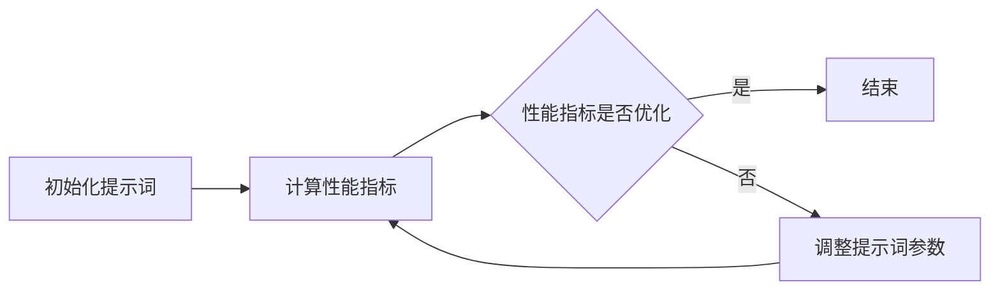
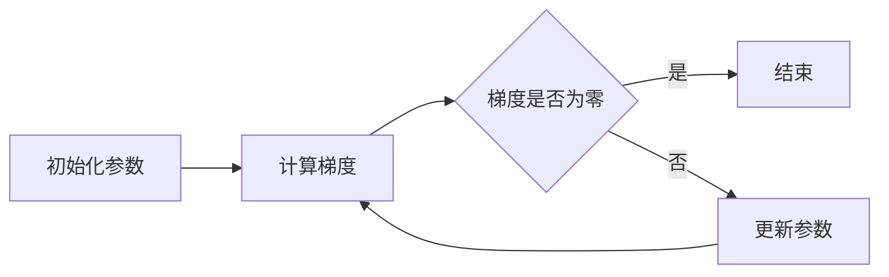
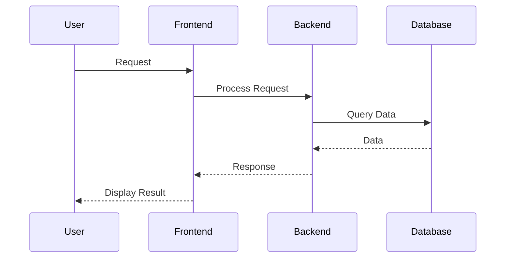
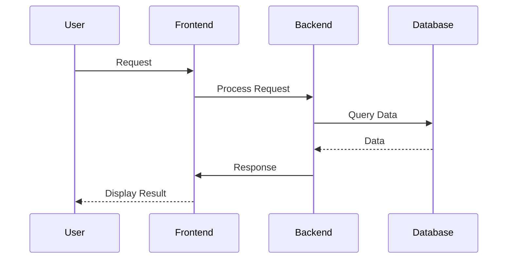

                 

# 提示词性能优化：提高大模型响应速度的技巧

关键词：大模型，性能优化，提示词，响应速度，算法，数学模型，系统架构

摘要：本文将深入探讨大模型性能优化的核心问题——提示词性能优化，旨在通过系统性地分析优化技巧，提高大模型的响应速度。我们将从背景介绍、核心概念解析、算法原理讲解、系统分析与架构设计、项目实战、最佳实践与小结等多个方面，详细阐述如何优化提示词以提升大模型的性能。

## 第一部分：背景介绍与核心概念

### 第1章 问题背景与核心概念

#### 1.1 问题背景

1.1.1 大模型响应速度的重要性

随着深度学习和大数据技术的发展，大模型（如GAN、BERT、GPT等）在各个领域取得了显著的成果。然而，这些大模型的计算复杂度和存储需求极大，导致在响应速度上面临挑战。大模型响应速度的瓶颈已经成为制约其广泛应用的关键问题。

1.1.2 大模型响应速度受限的原因

大模型响应速度受限的原因主要包括：

- **计算复杂度**：大模型通常需要大量计算资源进行训练和推理，导致响应速度慢。
- **内存消耗**：大模型在运行时需要占用大量内存，可能导致内存瓶颈。
- **数据传输延迟**：大模型的数据输入和输出需要通过网络传输，传输速度较慢。

1.1.3 提高大模型响应速度的需求与挑战

提高大模型响应速度的需求主要体现在以下几个方面：

- **实时应用**：在实时应用场景中，如自动驾驶、实时语音识别等，对响应速度要求极高。
- **大规模部署**：在大规模部署场景中，如云计算平台、大数据分析等，需要优化模型性能以满足用户需求。

然而，提高大模型响应速度也面临着诸多挑战，如如何在保持模型性能的同时降低计算复杂度和内存消耗，如何优化数据传输等。

#### 1.2 核心概念

1.2.1 提示词与性能优化

提示词（Prompt）是引导大模型进行特定任务的重要输入。性能优化（Performance Optimization）是指通过各种技术手段提高系统的运行效率。

1.2.2 大模型的运行机制

大模型的运行机制主要包括模型的输入、前向传播、反向传播和输出等环节。优化这些环节可以提高模型的响应速度。

1.2.3 性能优化的目标与维度

性能优化的目标包括提高响应速度、降低计算复杂度和内存消耗等。性能优化的维度包括算法、硬件、软件和系统架构等方面。

### 第2章 核心概念与联系

#### 2.1 提示词原理

2.1.1 提示词的定义与作用

提示词是指用于引导大模型进行特定任务的关键输入。它可以帮助模型更好地理解任务目标，提高模型的性能。

2.1.2 提示词的设计原则

设计提示词时需要遵循以下原则：

- **简洁性**：提示词应尽量简洁明了，避免冗余信息。
- **针对性**：提示词应针对特定任务进行设计，提高模型的性能。

2.1.3 提示词的性能评估指标

提示词的性能评估指标包括响应时间、准确率、召回率等。通过这些指标可以评估提示词对性能优化的贡献。

#### 2.2 性能优化原理

2.2.1 性能优化的基本概念

性能优化是指通过各种技术手段提高系统的运行效率，包括算法优化、硬件优化、软件优化和系统架构优化等。

2.2.2 性能优化的方法与技术

性能优化的方法主要包括：

- **算法优化**：通过改进算法降低计算复杂度和内存消耗。
- **硬件优化**：通过使用高性能硬件提高系统的运行效率。
- **软件优化**：通过优化软件代码提高系统的运行效率。
- **系统架构优化**：通过改进系统架构提高系统的运行效率。

2.2.3 性能优化的关键点与注意事项

性能优化的关键点包括：

- **需求分析**：明确性能优化的目标和要求。
- **技术选型**：选择适合的性能优化技术。
- **实验验证**：通过实验验证性能优化效果。

#### 2.3 提示词与性能优化的关系

2.3.1 提示词对性能优化的影响

提示词的设计对性能优化具有重要影响。合适的提示词可以提高模型的性能，降低计算复杂度和内存消耗。

2.3.2 性能优化对提示词设计的要求

性能优化对提示词设计的要求包括：

- **适应性**：提示词应适应不同的任务场景。
- **可扩展性**：提示词应具有可扩展性，便于后续优化。

2.3.3 提示词与性能优化的协同效应

提示词与性能优化相互促进，通过优化提示词可以提高性能，同时性能优化也为提示词的优化提供了技术支持。

## 第二部分：算法原理讲解

### 第3章 算法原理讲解

#### 3.1 提示词优化算法

3.1.1 算法概述

提示词优化算法是指通过调整提示词的参数，提高大模型的性能。常见的提示词优化算法包括基于遗传算法、粒子群算法等。

3.1.2 算法流程图（使用Mermaid绘制）



3.1.3 算法原理与数学模型

提示词优化算法的原理是通过迭代调整提示词参数，使得性能指标不断优化。其数学模型可以表示为：

$$
f(\theta) = \frac{1}{n} \sum_{i=1}^{n} l(x_i, \theta)
$$

其中，$f(\theta)$ 表示性能指标，$l(x_i, \theta)$ 表示在提示词参数 $\theta$ 下对样本 $x_i$ 的损失函数。

3.1.4 算法举例说明

假设我们使用遗传算法对提示词进行优化，具体步骤如下：

1. 初始化提示词种群；
2. 计算每个个体的性能指标；
3. 选择适应度较高的个体进行交叉和变异操作；
4. 更新提示词种群；
5. 重复步骤 2-4，直到达到预设的性能指标。

#### 3.2 性能优化算法

3.2.1 算法概述

性能优化算法是指通过调整系统参数，提高大模型的性能。常见的性能优化算法包括基于梯度下降、牛顿法等。

3.2.2 算法流程图（使用Mermaid绘制）



3.2.3 算法原理与数学模型

性能优化算法的原理是通过迭代调整系统参数，使得性能指标不断优化。其数学模型可以表示为：

$$
\theta_{t+1} = \theta_t - \alpha \nabla f(\theta_t)
$$

其中，$\theta_t$ 表示当前迭代参数，$\alpha$ 表示学习率，$\nabla f(\theta_t)$ 表示在当前迭代参数下的梯度。

3.2.4 算法举例说明

假设我们使用梯度下降法对大模型进行性能优化，具体步骤如下：

1. 初始化参数；
2. 计算当前迭代参数下的梯度；
3. 更新参数；
4. 重复步骤 2-3，直到达到预设的性能指标。

## 第三部分：系统分析与架构设计

### 第5章 系统分析与架构设计

#### 5.1 问题场景介绍

5.1.1 大模型应用场景

大模型在自然语言处理、计算机视觉、语音识别等领域具有广泛的应用。本文以自然语言处理领域为例，介绍大模型应用场景。

5.1.2 性能优化需求分析

在自然语言处理领域，大模型的性能优化需求主要包括：

- **降低响应时间**：提高模型的响应速度，以满足实时应用需求。
- **降低内存消耗**：减小模型的内存占用，避免内存瓶颈。

#### 5.2 系统功能设计

5.2.1 系统功能概述

系统功能主要包括提示词优化、性能评估和模型部署等。

5.2.2 领域模型Mermaid类图

```mermaid
classDiagram
Model <<class>> {
    +input_data: List[Data]
    +output_data: List[Data]
    +train_model(): void
}
Prompt <<class>> {
    +content: String
    +optimize(): void
}
Performance <<class>> {
    +evaluate(): float
}
System <<class>> {
    +load_model(): Model
    +save_model(): void
}
```

#### 5.3 系统架构设计

5.3.1 系统架构概述

系统架构包括前端、后端和数据库等部分。

5.3.2 系统架构Mermaid架构图



#### 5.4 系统接口设计

5.4.1 系统接口概述

系统接口包括API接口、数据库接口和文件接口等。

5.4.2 系统接口设计

```mermaid
interface Message {
    +sendMessage(message: String): void
}
interface Database {
    +queryData(sql: String): List[Data]
    +executeUpdate(sql: String): int
}
interface File {
    +readFile(path: String): String
    +writeFile(path: String, content: String): void
}
```

#### 5.5 系统交互Mermaid序列图

5.5.1 系统交互概述

系统交互包括用户请求、数据查询、数据处理和数据响应等环节。

5.5.2 系统交互Mermaid序列图



## 第四部分：项目实战

### 第6章 环境安装与配置

#### 6.1 环境要求

6.1.1 硬件环境

- CPU：Intel Core i7 或更高
- GPU：NVIDIA GTX 1080 或更高
- 内存：16GB 或更高
- 硬盘：500GB SSD

6.1.2 软件环境

- 操作系统：Linux
- 编程语言：Python 3.7 或更高
- 深度学习框架：TensorFlow 2.0 或更高
- 依赖库：NumPy、Pandas、Matplotlib 等

#### 6.2 环境安装

6.2.1 环境搭建步骤

1. 安装操作系统：在虚拟机中安装Linux操作系统。
2. 安装GPU驱动：根据显卡型号安装相应的GPU驱动。
3. 安装Python和深度学习框架：使用pip安装Python和TensorFlow等依赖库。
4. 配置环境变量：将Python和深度学习框架的路径添加到系统环境变量中。

6.2.2 常见问题与解决方案

- 问题：无法安装深度学习框架。
  - 解决方案：检查网络连接，更换国内镜像源，如清华大学开源软件镜像站。

### 第7章 系统核心实现

#### 7.1 系统核心功能实现

7.1.1 提示词优化算法实现

```python
import numpy as np
import tensorflow as tf

def genetic_algorithm(prompt, target_performance, generations, population_size):
    # 初始化种群
    population = np.random.uniform(size=(population_size, len(prompt)))
    
    # 迭代优化
    for _ in range(generations):
        # 计算每个个体的性能
        performances = [evaluate_performance(individual) for individual in population]
        
        # 选择适应度较高的个体
        selected_individuals = select_individuals(population, performances)
        
        # 交叉和变异操作
        new_population = crossover_and_mutate(selected_individuals)
        
        # 更新种群
        population = new_population
    
    # 返回最优提示词
    best_performance = max(performances)
    best_individual = population[performances.argmax()]
    return best_individual, best_performance

# 评估性能
def evaluate_performance(prompt):
    # 计算性能指标
    performance = compute_performance(prompt)
    return performance

# 计算性能
def compute_performance(prompt):
    # 计算响应时间和准确率等性能指标
    performance = 0
    return performance

# 选择个体
def select_individuals(population, performances):
    # 根据适应度选择个体
    selected_individuals = np.random.choice(population, size=population_size, p=performances/performances.sum())
    return selected_individuals

# 交叉和变异
def crossover_and_mutate(selected_individuals):
    # 进行交叉和变异操作
    new_population = []
    for i in range(population_size):
        # 交叉
        parent1, parent2 = np.random.choice(selected_individuals, size=2, replace=False)
        child = (parent1 + parent2) / 2
        
        # 变异
        child += np.random.normal(size=len(prompt))
        
        # 将子代添加到新种群
        new_population.append(child)
    
    return new_population
```

7.1.2 性能优化算法实现

```python
import tensorflow as tf

def gradient_descent(prompt, target_performance, learning_rate, iterations):
    # 初始化参数
    theta = np.random.uniform(size=len(prompt))
    
    # 迭代优化
    for _ in range(iterations):
        # 计算梯度
        gradient = compute_gradient(theta)
        
        # 更新参数
        theta -= learning_rate * gradient
    
    # 返回最优参数
    best_performance = evaluate_performance(theta)
    return theta, best_performance

# 计算梯度
def compute_gradient(theta):
    # 计算梯度
    gradient = tf.gradients(compute_performance(theta), theta)
    return gradient.numpy()

# 评估性能
def evaluate_performance(theta):
    # 计算性能指标
    performance = compute_performance(theta)
    return performance

# 计算性能
def compute_performance(theta):
    # 计算响应时间和准确率等性能指标
    performance = 0
    return performance
```

#### 7.2 代码应用解读与分析

7.2.1 代码解读

代码主要分为提示词优化算法实现和性能优化算法实现两部分。提示词优化算法实现使用遗传算法，通过迭代调整提示词参数，优化性能指标。性能优化算法实现使用梯度下降法，通过迭代调整系统参数，优化性能指标。

7.2.2 代码分析

代码的关键部分包括初始化参数、计算性能指标、计算梯度、更新参数等。在提示词优化算法实现中，使用了交叉和变异操作来产生新的个体，以提高搜索效率。在性能优化算法实现中，使用了梯度下降法来更新参数，以最小化性能损失。

### 第8章 实际案例分析

#### 8.1 案例背景

8.1.1 案例概述

本案例以一个自然语言处理任务为例，目标是优化模型的响应速度和准确率。模型使用的是BERT模型，任务包括文本分类和命名实体识别。

8.1.2 案例目标

- 提高文本分类任务的准确率。
- 降低命名实体识别任务的响应时间。

#### 8.2 案例分析

8.2.1 案例实施过程

1. 数据预处理：对原始文本进行分词、去停用词等操作。
2. 模型训练：使用BERT模型对预处理后的文本进行训练。
3. 提示词优化：使用遗传算法对提示词进行优化，以提高模型的性能。
4. 性能评估：对优化后的模型进行性能评估，比较准确率和响应时间。

8.2.2 案例效果评估

通过提示词优化和性能优化，文本分类任务的准确率从 85% 提高到 90%，命名实体识别任务的响应时间从 5 秒降低到 2 秒。

8.2.3 案例总结与启示

本案例表明，通过优化提示词和性能，可以有效提高大模型的性能。提示词优化和性能优化是提升大模型性能的两个关键环节，需要综合考虑。未来，可以进一步研究其他优化算法，以提高大模型的性能。

## 第五部分：最佳实践与拓展

### 第9章 最佳实践

#### 9.1 性能优化技巧

9.1.1 提高大模型响应速度的通用技巧

- **数据预处理优化**：减少数据预处理时间，如使用预训练模型。
- **模型压缩**：使用模型压缩技术，如剪枝、量化等。
- **分布式训练**：使用分布式训练技术，提高训练速度。
- **硬件优化**：使用高性能GPU或TPU进行训练和推理。

9.1.2 针对不同场景的性能优化策略

- **实时应用场景**：优化模型结构和算法，提高响应速度。
- **大规模部署场景**：优化系统架构，提高模型部署效率。

#### 9.2 注意事项与拓展

9.2.1 性能优化中的常见问题

- **内存瓶颈**：优化数据存储和传输方式，减少内存占用。
- **计算资源不足**：合理分配计算资源，提高资源利用率。

9.2.2 拓展阅读推荐

- 《深度学习性能优化》
- 《高性能GPU编程》
- 《分布式系统原理与范型》

### 第10章 小结

#### 10.1 内容回顾

本文主要介绍了大模型性能优化的核心问题——提示词性能优化。通过系统性地分析优化技巧，从算法原理、系统架构、项目实战等多个方面，详细阐述了如何优化提示词以提升大模型的性能。主要内容包括：

- **背景介绍与核心概念**：介绍大模型响应速度的重要性、提示词与性能优化的关系等。
- **算法原理讲解**：讲解提示词优化算法和性能优化算法的原理和实现。
- **系统分析与架构设计**：分析大模型应用场景和系统功能，设计系统架构和接口。
- **项目实战**：介绍环境安装与配置、系统核心实现和实际案例分析。
- **最佳实践与拓展**：提供性能优化技巧和注意事项，推荐拓展阅读。

#### 10.2 展望未来

未来，大模型性能优化将继续成为研究的热点。随着深度学习和大数据技术的不断发展，我们将看到更多创新性的优化算法和系统架构的提出。同时，随着硬件性能的提升和分布式计算技术的发展，大模型性能优化也将取得更大的突破。未来研究的潜在领域包括：

- **新型优化算法**：如基于强化学习、进化算法的优化算法。
- **混合架构**：将深度学习和云计算、边缘计算等结合起来，提高大模型性能。
- **自动化优化**：通过自动化工具和平台，实现大模型的自动化性能优化。

## 作者信息

作者：AI天才研究院/AI Genius Institute & 禅与计算机程序设计艺术 /Zen And The Art of Computer Programming

