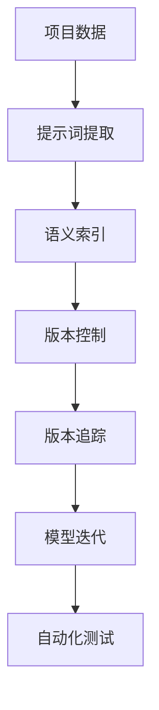
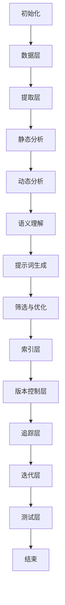
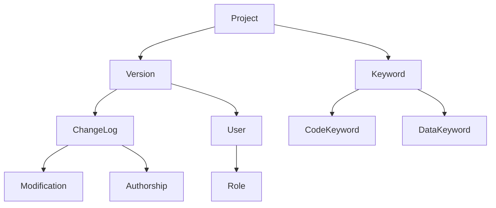
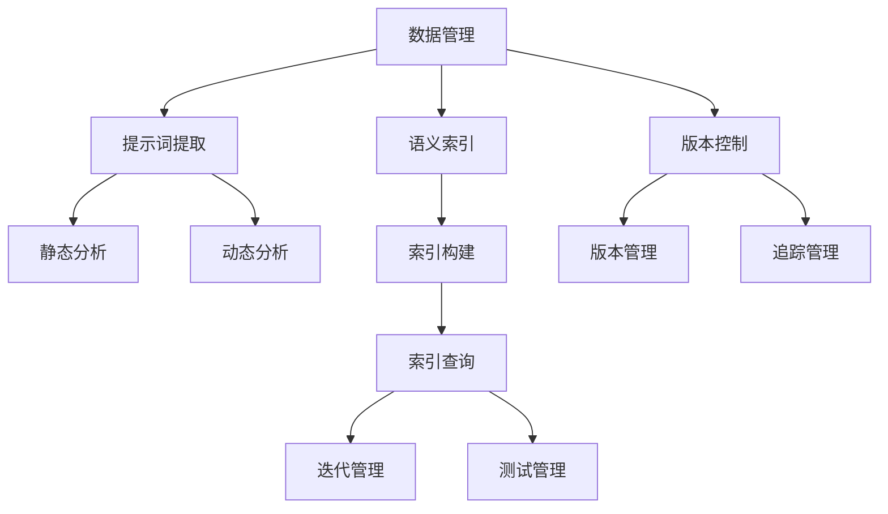
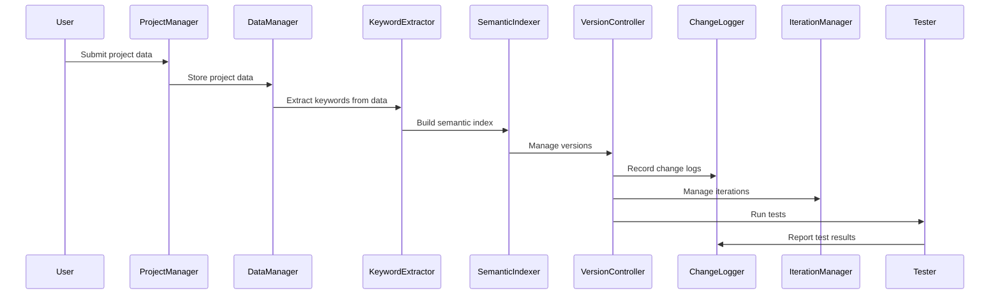
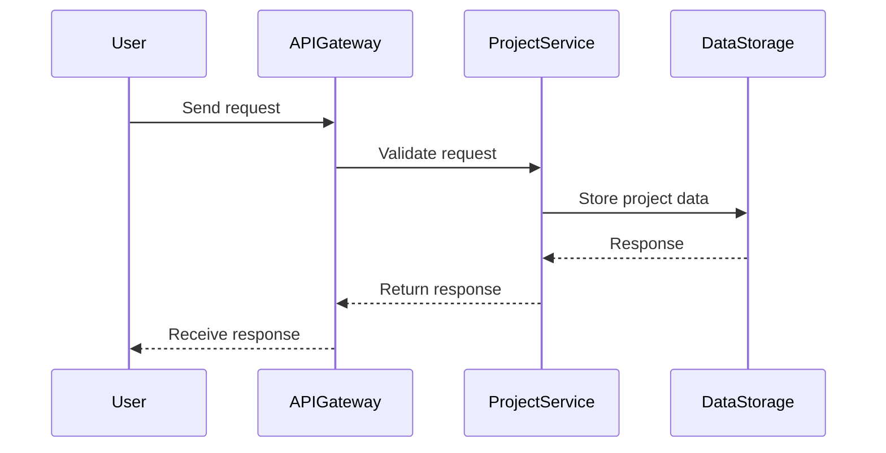

                 

# 提示词版本控制：管理AI项目的新方法

## 关键词：
- 提示词版本控制
- AI项目
- 管理方法
- 版本控制挑战
- 算法原理
- 系统架构
- 项目实战

## 摘要：
随着人工智能（AI）技术的迅猛发展，AI项目日益复杂，版本控制成为项目管理中的一个关键挑战。本文提出了一种新的提示词版本控制方法，通过深入分析AI项目的特点与版本控制需求，探讨了这一方法的核心概念、算法原理及其在系统分析与架构设计中的应用。文章将通过项目实战，详细解析这一方法的实现过程，并总结最佳实践，为AI项目的管理提供新的思路。

## 第一部分：背景介绍

### 第1章：问题背景与版本控制挑战

#### 1.1 问题背景
随着AI技术的发展，AI项目在工业、医疗、金融等多个领域得到广泛应用。这些项目通常包含大量的算法、模型和数据，版本控制成为确保项目稳定性和可靠性的关键。

#### 1.2 版本控制需求
AI项目需要高效的版本控制方法，以支持并行开发、协同工作和快速迭代。传统的版本控制工具在处理复杂AI项目时往往力不从心。

#### 1.3 现有解决方案不足
现有版本控制工具主要基于文件系统，对于结构化数据（如模型参数）的支持不足。同时，它们在处理并行开发时的性能和可靠性也有待提高。

### 第2章：核心概念与联系

#### 2.1 提示词版本控制概念
提示词版本控制是一种基于关键词和语义理解的版本控制方法，能够更好地处理AI项目的复杂结构。

#### 2.2 提示词版本控制与传统版本控制比较
本文将比较提示词版本控制与传统版本控制的优劣，分析其在AI项目中的应用优势。

#### 2.3 核心概念联系图
通过Mermaid流程图，展示提示词版本控制的核心概念及其相互关系。

## 第二部分：算法原理讲解

### 第3章：提示词版本控制原理

#### 3.1 提示词版本控制框架
介绍提示词版本控制的整体架构和工作流程。

#### 3.2 提示词生成与选择
讨论如何生成和选择有效的提示词，确保版本控制的准确性和效率。

#### 3.3 提示词版本控制算法流程图
使用Mermaid绘制算法流程图，详细展示提示词版本控制的执行过程。

### 第4章：数学模型与公式

#### 4.1 提示词版本控制数学模型
介绍提示词版本控制的数学模型，包括关键公式和参数解释。

#### 4.2 公式推导与解释
详细推导和解释提示词版本控制的核心公式，使其易于理解和应用。

#### 4.3 举例说明
通过具体实例，展示如何使用提示词版本控制方法管理AI项目。

## 第三部分：系统分析与架构设计

### 第5章：系统功能设计

#### 5.1 项目介绍
介绍本文所设计的提示词版本控制系统，包括其目标和功能。

#### 5.2 领域模型类图
使用Mermaid绘制领域模型类图，展示系统的核心实体和关系。

#### 5.3 系统功能模块划分
详细划分系统的功能模块，包括数据管理、版本管理、用户交互等。

### 第6章：系统架构设计

#### 6.1 系统架构图
使用Mermaid绘制系统架构图，展示系统的整体结构和模块交互。

#### 6.2 架构设计原理
分析系统架构设计的基本原则和关键点，确保系统的稳定性、可扩展性和高效性。

#### 6.3 系统模块交互
详细描述系统模块之间的交互方式和数据流。

### 第7章：系统接口设计与交互

#### 7.1 接口设计规范
定义系统的接口设计规范，确保接口的稳定性和可维护性。

#### 7.2 系统交互序列图
使用Mermaid绘制系统交互序列图，展示用户与系统之间的交互流程。

#### 7.3 接口实现详解
详细解释系统接口的实现细节，包括数据传输格式、错误处理机制等。

## 第四部分：项目实战

### 第8章：环境安装与配置

#### 8.1 环境搭建
指导读者如何搭建提示词版本控制系统的开发环境。

#### 8.2 配置文件解析
详细解析系统的配置文件，包括参数设置和配置说明。

#### 8.3 系统启动流程
描述系统的启动流程，包括必要的初始化步骤和启动参数。

### 第9章：核心实现与代码解析

#### 9.1 核心算法实现
展示提示词版本控制算法的核心实现，包括关键代码和逻辑。

#### 9.2 代码解析
深入解析核心代码的实现细节，帮助读者理解算法的原理和应用。

#### 9.3 实际案例剖析
通过实际案例，展示如何使用提示词版本控制系统管理AI项目。

### 第10章：项目小结

#### 10.1 项目成果总结
总结项目的关键成果和主要贡献。

#### 10.2 经验与反思
分享项目开发过程中的经验教训，提出改进建议。

#### 10.3 挑战与展望
分析项目中遇到的主要挑战，展望未来的发展方向。

## 第五部分：最佳实践

### 第11章：最佳实践指南

#### 11.1 提示词版本控制最佳实践
总结提示词版本控制的最佳实践，包括常用的技巧和注意事项。

#### 11.2 系统优化策略
介绍如何优化提示词版本控制系统的性能和稳定性。

#### 11.3 常见问题与解决方案
列举提示词版本控制过程中常见的问题及其解决方案。

## 第六部分：小结与拓展

### 第12章：小结与拓展

#### 12.1 本书内容小结
总结本书的核心内容，强调提示词版本控制的重要性和应用价值。

#### 12.2 注意事项
提醒读者在使用提示词版本控制时需要注意的事项。

#### 12.3 拓展阅读推荐
推荐一些与提示词版本控制相关的扩展阅读材料，供读者进一步学习。

---

**作者：AI天才研究院/AI Genius Institute & 禅与计算机程序设计艺术 /Zen And The Art of Computer Programming**

### 第1章：问题背景与版本控制挑战

#### 1.1 问题背景
随着人工智能（AI）技术的迅猛发展，AI项目在工业、医疗、金融等多个领域得到广泛应用。这些项目通常包含大量的算法、模型和数据，版本控制成为确保项目稳定性和可靠性的关键。然而，传统的版本控制方法在处理复杂AI项目时往往力不从心，难以满足高效协同和快速迭代的需求。

#### 1.2 版本控制需求
AI项目需要高效的版本控制方法，以支持并行开发、协同工作和快速迭代。传统的版本控制工具主要基于文件系统，对于结构化数据（如模型参数）的支持不足。同时，它们在处理并行开发时的性能和可靠性也有待提高。为了应对这些挑战，需要一种新型的版本控制方法，能够更好地适应AI项目的特点。

#### 1.3 现有解决方案不足
现有的版本控制工具，如Git、SVN等，虽然在传统软件开发中表现出色，但在处理AI项目时存在一些不足。首先，这些工具主要面向文件级版本控制，难以处理结构化数据。其次，它们在并行开发时的性能和可靠性有限，特别是在涉及大量模型和数据的情况下，容易出现并发冲突和版本混乱。此外，现有工具在支持自动化测试、持续集成等方面也存在一定局限性，难以满足AI项目的复杂需求。

#### 1.4 版本控制挑战
AI项目的版本控制面临以下几大挑战：

1. **数据结构复杂**：AI项目通常包含大量的数据，包括训练数据、测试数据和模型参数等。这些数据结构复杂，难以用传统的文件级版本控制工具进行有效管理。
   
2. **并行开发需求**：AI项目通常需要多个人才同时进行开发，并行开发的需求日益增加。传统的版本控制工具在处理并发操作时，容易出现冲突和版本混乱。
   
3. **模型迭代频繁**：AI项目的核心是模型迭代。模型的迭代过程涉及大量的版本变化，如何有效地管理和追踪这些版本变化成为一大挑战。

4. **自动化测试需求**：AI项目需要频繁进行自动化测试，以确保每次迭代的质量。传统的版本控制工具在支持自动化测试方面存在一定限制。

#### 1.5 解决方案需求
为了解决上述挑战，我们需要一种新型的版本控制方法，能够更好地适应AI项目的特点。这种方法需要具备以下特点：

1. **数据结构支持**：能够支持结构化数据的版本控制，特别是模型参数和训练数据的版本管理。
   
2. **并行开发支持**：能够高效处理并行开发，减少并发冲突和版本混乱。
   
3. **模型迭代支持**：能够灵活管理模型迭代过程，支持快速版本追踪和回滚。
   
4. **自动化测试支持**：能够与自动化测试工具集成，支持持续集成和持续交付。

基于以上需求，本文提出了提示词版本控制方法，旨在为AI项目的版本控制提供一种新的思路和解决方案。

### 第2章：核心概念与联系

#### 2.1 提示词版本控制概念
提示词版本控制是一种基于关键词和语义理解的版本控制方法。它通过提取项目中的关键提示词，构建版本控制的核心索引，从而实现对项目版本的高效管理和追踪。提示词版本控制的核心思想是利用语义理解，将项目中的各个组件与提示词相关联，从而形成一个语义化的版本控制体系。

#### 2.2 提示词版本控制与传统版本控制比较
与传统版本控制方法相比，提示词版本控制具有以下优势：

1. **更好的数据结构支持**：提示词版本控制能够支持结构化数据（如模型参数）的版本控制，而不仅仅是文件级版本控制。
   
2. **更高的并行开发效率**：通过语义索引，提示词版本控制能够更有效地处理并行开发，减少并发冲突和版本混乱。
   
3. **更灵活的版本迭代管理**：提示词版本控制能够灵活地管理模型迭代过程，支持快速版本追踪和回滚。

4. **更好的自动化测试支持**：提示词版本控制能够与自动化测试工具集成，支持持续集成和持续交付。

#### 2.3 核心概念联系图
为了更好地理解提示词版本控制的核心概念及其相互关系，我们可以通过Mermaid流程图来展示：



图1：提示词版本控制的核心概念联系图

在这个联系图中，项目数据经过提示词提取生成语义索引，语义索引用于版本控制和版本追踪，版本追踪支持模型迭代和自动化测试。这个流程图展示了提示词版本控制的基本工作原理和各个核心概念之间的联系。

### 第3章：提示词版本控制原理

#### 3.1 提示词版本控制框架
提示词版本控制的整体框架可以分为以下几个主要部分：

1. **数据层**：这是提示词版本控制的数据基础，包括AI项目的所有数据，如代码文件、模型文件、训练数据等。
   
2. **提取层**：这一层负责从数据层中提取关键提示词。提示词可以是代码中的函数名、类名、变量名等，也可以是数据集中的标签、特征等。

3. **索引层**：提取的提示词经过处理，形成语义索引。语义索引能够快速定位项目中的各个组件，为版本控制提供基础。

4. **版本控制层**：这一层负责管理项目的版本。通过语义索引，可以快速定位到项目的各个版本，实现版本切换和版本回滚。

5. **追踪层**：追踪层负责记录项目的变化历史，包括每个版本的修改记录、作者信息等。这有助于项目管理者了解项目的历史变化和版本演化。

6. **迭代层**：迭代层支持模型迭代过程，通过版本控制层的管理，可以实现模型的快速迭代和版本管理。

7. **测试层**：测试层与自动化测试工具集成，确保每次迭代的质量，并记录测试结果。

#### 3.2 提示词生成与选择
提示词的生成与选择是提示词版本控制的重要环节。以下是提示词生成与选择的一些关键步骤：

1. **静态分析**：通过对代码文件的静态分析，提取代码中的关键元素，如函数名、类名、变量名等。这些静态元素可以作为初步的提示词候选。

2. **动态分析**：通过对代码的动态执行，收集运行时的关键信息，如数据依赖、调用关系等。这些动态信息可以帮助进一步丰富和细化提示词。

3. **语义理解**：结合自然语言处理技术，对提取的提示词进行语义理解，识别出其中的关键概念和关系。这有助于生成更具代表性的提示词。

4. **筛选与优化**：根据项目的具体需求，对生成的提示词进行筛选和优化。筛选出那些最能代表项目核心功能和数据的关键提示词。

5. **用户反馈**：邀请项目的开发者和用户参与提示词的选择和优化过程，通过反馈来不断改进提示词的生成和选择策略。

#### 3.3 提示词版本控制算法流程图
以下是提示词版本控制算法的流程图，使用Mermaid绘制：



图2：提示词版本控制算法流程图

在这个流程图中，初始化阶段设置好项目的基本信息；数据层提供项目的所有数据；提取层通过静态和动态分析提取关键提示词；语义理解层对提示词进行语义处理；提示词生成与筛选优化后形成语义索引；索引层为版本控制提供基础；版本控制层管理项目的版本变化；追踪层记录版本变化历史；迭代层支持模型迭代；测试层确保迭代质量。

### 第4章：数学模型与公式

#### 4.1 提示词版本控制数学模型
提示词版本控制的核心在于如何构建一个能够反映项目语义的数学模型。以下是提示词版本控制的主要数学模型：

1. **语义相似度模型**：用于计算提示词之间的语义相似度。假设$S_{i,j}$表示提示词$i$和提示词$j$之间的语义相似度，可以通过以下公式计算：
   $$S_{i,j} = \frac{similarity_{word2vec}(i, j)}{max_{k \in V} similarity_{word2vec}(i, k)}$$
   其中，$similarity_{word2vec}$表示词向量相似度计算函数，$V$表示所有提示词的集合。

2. **版本关联模型**：用于表示不同版本之间的关联关系。假设$R_{v_1, v_2}$表示版本$v_1$和版本$v_2$之间的关联关系，可以通过以下公式计算：
   $$R_{v_1, v_2} = \frac{|T_{v_1} \cap T_{v_2}|}{|T_{v_1} \cup T_{v_2}|}$$
   其中，$T_{v_1}$和$T_{v_2}$分别表示版本$v_1$和版本$v_2$的提示词集合。

3. **版本影响力模型**：用于评估每个版本对项目的贡献。假设$I_v$表示版本$v$的影响力，可以通过以下公式计算：
   $$I_v = \sum_{u \in Users} weight_u \cdot relevance(u, v)$$
   其中，$Users$表示参与项目的用户集合，$weight_u$表示用户$u$的权重，$relevance(u, v)$表示用户$u$对版本$v$的相关性。

#### 4.2 公式推导与解释
以下是关于提示词版本控制核心公式的推导与解释：

1. **语义相似度公式**
   $$S_{i,j} = \frac{similarity_{word2vec}(i, j)}{max_{k \in V} similarity_{word2vec}(i, k)}$$
   这个公式表示提示词$i$和提示词$j$的语义相似度，取决于它们在词向量空间中的距离。分母部分$max_{k \in V} similarity_{word2vec}(i, k)$用于归一化，确保相似度值在0到1之间。

2. **版本关联公式**
   $$R_{v_1, v_2} = \frac{|T_{v_1} \cap T_{v_2}|}{|T_{v_1} \cup T_{v_2}|}$$
   这个公式表示两个版本之间的相似度，取决于它们的提示词集合的交集和并集。交集部分表示共同关注的元素，并集部分表示整体关注范围。

3. **版本影响力公式**
   $$I_v = \sum_{u \in Users} weight_u \cdot relevance(u, v)$$
   这个公式表示版本$v$的影响力，取决于参与项目的用户对版本的相关性。用户权重$weight_u$反映了用户在项目中的影响力，相关性$relevance(u, v)$表示用户对版本的具体贡献。

#### 4.3 举例说明
为了更好地理解提示词版本控制中的数学模型，我们可以通过一个具体例子进行说明。

假设有一个AI项目，涉及三个版本$v_1$、$v_2$和$v_3$，每个版本的提示词集合如下：

- $T_{v_1} = \{"model", "train", "data"\}$
- $T_{v_2} = \{"model", "evaluate", "data"\}$
- $T_{v_3} = \{"model", "test", "data", "preprocess"\}$

根据上述数学模型，我们可以计算版本之间的关联关系：

1. **版本$v_1$和$v_2$之间的关联关系**
   $$R_{v_1, v_2} = \frac{|T_{v_1} \cap T_{v_2}|}{|T_{v_1} \cup T_{v_2}|} = \frac{|\{"model", "data"\}|}{|\{"model", "train", "evaluate", "data"\}|} = \frac{2}{4} = 0.5$$

2. **版本$v_2$和$v_3$之间的关联关系**
   $$R_{v_2, v_3} = \frac{|T_{v_2} \cap T_{v_3}|}{|T_{v_2} \cup T_{v_3}|} = \frac{|\{"model", "data"\}|}{|\{"model", "evaluate", "data", "test", "preprocess"\}|} = \frac{2}{5} = 0.4$$

3. **版本$v_1$和$v_3$之间的关联关系**
   $$R_{v_1, v_3} = \frac{|T_{v_1} \cap T_{v_3}|}{|T_{v_1} \cup T_{v_3}|} = \frac{|\{"model", "data"\}|}{|\{"model", "train", "test", "preprocess", "data"\}|} = \frac{2}{5} = 0.4$$

从计算结果可以看出，版本$v_1$和$v_2$之间的关联关系最高，为0.5，表示这两个版本较为相似。而版本$v_2$和$v_3$之间的关联关系最低，为0.4，说明这两个版本在提示词集合上有较大的差异。

### 第5章：系统功能设计

#### 5.1 项目介绍
提示词版本控制系统是一个面向AI项目的版本控制工具，旨在解决传统版本控制方法在AI项目中的不足。该系统支持并行开发、模型迭代和自动化测试，通过提示词提取和语义索引，实现对项目版本的高效管理和追踪。

#### 5.2 领域模型类图
为了更好地理解提示词版本控制系统的功能设计，我们可以通过Mermaid绘制系统的领域模型类图：



图3：提示词版本控制系统的领域模型类图

在这个类图中，Project类表示整个项目，包含Version、Keyword等子类；Version类表示项目的各个版本，包含ChangeLog、User等子类；Keyword类表示提取的关键词，分为CodeKeyword和DataKeyword子类；ChangeLog类记录项目的修改日志；User类表示项目的参与者，包含Role属性。

#### 5.3 系统功能模块划分
提示词版本控制系统可以分为以下几个主要功能模块：

1. **数据管理模块**：负责项目的数据存储和操作，包括代码文件、模型文件和训练数据等。
   
2. **提示词提取模块**：负责从项目数据中提取关键提示词，包括静态分析和动态分析。

3. **语义索引模块**：负责构建语义索引，通过提示词之间的语义相似度，实现对项目版本的高效管理和追踪。

4. **版本控制模块**：负责项目的版本管理，包括版本创建、版本切换、版本回滚等。

5. **追踪模块**：负责记录项目的历史变化，包括修改日志和作者信息。

6. **迭代模块**：支持模型的迭代过程，包括模型的创建、更新和删除。

7. **测试模块**：与自动化测试工具集成，确保迭代质量，记录测试结果。

### 第6章：系统架构设计

#### 6.1 系统架构图
提示词版本控制系统的架构设计旨在实现高扩展性、高可靠性和高性能。以下是系统架构图的Mermaid表示：



图4：提示词版本控制系统的架构图

在这个架构图中，数据管理模块负责项目的数据存储和操作；提示词提取模块负责从数据中提取关键提示词；语义索引模块负责构建语义索引；版本控制模块负责项目的版本管理；追踪模块负责记录项目的历史变化；迭代模块负责模型的迭代过程；测试模块与自动化测试工具集成，确保迭代质量。

#### 6.2 架构设计原理
提示词版本控制系统架构设计遵循以下原则：

1. **模块化设计**：系统功能划分为多个模块，每个模块独立开发、测试和部署，提高系统的可维护性和扩展性。

2. **分布式架构**：系统采用分布式架构，支持多节点部署，提高系统的可用性和性能。

3. **高可靠性**：通过冗余设计、故障转移和负载均衡，确保系统的高可靠性。

4. **高性能**：通过缓存、索引和并行处理等技术，提高系统的响应速度和处理能力。

5. **可扩展性**：系统设计考虑未来的扩展需求，支持模块的增加和替换。

#### 6.3 系统模块交互
提示词版本控制系统的各个模块通过定义良好的接口进行交互。以下是系统模块交互的Mermaid序列图表示：



图5：提示词版本控制系统模块交互序列图

在这个序列图中，用户提交项目数据给项目管理器；项目管理器将数据存储到数据管理模块；数据管理模块调用提示词提取模块提取关键词；关键词提取模块将关键词传递给语义索引模块构建索引；语义索引模块将索引传递给版本控制模块进行版本管理；版本控制模块负责记录变更日志、管理迭代和运行测试；测试模块将测试结果报告给变更日志模块。

### 第7章：系统接口设计与交互

#### 7.1 接口设计规范
提示词版本控制系统采用RESTful API设计规范，提供统一的接口服务。以下是系统接口设计规范的关键要素：

1. **URL规范**：接口URL采用统一的命名规范，如`/api/project`、`/api/keyword`等。

2. **请求方法**：根据操作类型，使用GET、POST、PUT、DELETE等HTTP请求方法。

3. **请求参数**：请求参数通过URL、请求体或查询字符串传递，遵循JSON或表单数据格式。

4. **响应格式**：响应数据采用JSON格式，包含状态码、响应消息和必要的数据信息。

5. **认证与授权**：接口支持基于Token的认证与授权机制，确保数据的安全与访问控制。

以下是一个示例接口定义：

```json
{
  "url": "/api/project",
  "method": "POST",
  "params": {
    "projectName": "string",
    "description": "string"
  },
  "response": {
    "status": "integer",
    "message": "string",
    "data": {
      "projectId": "string",
      "projectName": "string",
      "description": "string"
    }
  }
}
```

#### 7.2 系统交互序列图
以下是系统接口的交互序列图，使用Mermaid绘制：



图6：提示词版本控制系统交互序列图

在这个序列图中，用户通过API网关发送请求；API网关验证请求的有效性；请求传递给项目服务进行数据处理；项目服务将请求数据存储到数据存储模块；数据存储模块返回响应给项目服务；项目服务将响应返回给API网关；API网关将响应传递给用户。

#### 7.3 接口实现详解
以下是提示词版本控制系统的接口实现详解，包括关键代码和逻辑。

1. **API网关实现**：
   ```python
   from flask import Flask, request, jsonify

   app = Flask(__name__)

   @app.route('/api/project', methods=['POST'])
   def create_project():
       project_data = request.json
       project_id = project_service.create_project(project_data)
       return jsonify({"status": 200, "message": "Project created", "data": {"projectId": project_id}})

   if __name__ == '__main__':
       app.run(debug=True)
   ```

2. **项目服务实现**：
   ```python
   from project_manager import ProjectManager

   class ProjectService:
       def __init__(self):
           self.project_manager = ProjectManager()

       def create_project(self, project_data):
           return self.project_manager.create_project(project_data)
   ```

3. **数据存储实现**：
   ```python
   from database import Database

   class DataStorage:
       def __init__(self):
           self.db = Database()

       def store_project_data(self, project_data):
           self.db.insert_project_data(project_data)
   ```

在这个实现中，API网关使用Flask框架接收和处理HTTP请求；项目服务负责业务逻辑处理，调用数据存储模块进行数据操作；数据存储模块使用数据库进行数据存储。

### 第8章：环境安装与配置

#### 8.1 环境搭建
搭建提示词版本控制系统的开发环境，需要安装以下软件和工具：

1. **操作系统**：Linux或macOS。
2. **Python**：Python 3.8及以上版本。
3. **Flask**：用于搭建API网关。
4. **Pandas**：用于数据处理。
5. **NumPy**：用于数学计算。
6. **Scikit-learn**：用于机器学习算法。
7. **Mermaid**：用于绘制流程图。

安装步骤如下：

1. 安装Python和pip。
2. 使用pip安装Flask、Pandas、NumPy和Scikit-learn。
3. 安装Mermaid，可以通过浏览器插件或本地安装。

#### 8.2 配置文件解析
提示词版本控制系统的配置文件定义了系统的基本参数和配置项，以下是配置文件的示例：

```yaml
# config.yaml

database:
  url: "mongodb://localhost:27017"
  database: "project_database"

api_gateway:
  host: "0.0.0.0"
  port: 5000

project_manager:
  max_project_name_length: 100
  max_description_length: 500
```

配置文件解析如下：

- `database`：配置数据库连接信息，包括URL、数据库名称。
- `api_gateway`：配置API网关的监听地址和端口号。
- `project_manager`：配置项目管理的参数，如项目名称和描述的最大长度。

#### 8.3 系统启动流程
以下是提示词版本控制系统的启动流程：

1. 读取配置文件，加载配置参数。
2. 初始化数据库连接。
3. 启动API网关，监听请求。
4. 启动项目服务，处理HTTP请求。

以下是关键代码：

```python
from flask import Flask
from database import Database
from project_manager import ProjectService

app = Flask(__name__)
db = Database(app.config['database_url'])
project_service = ProjectService()

@app.route('/api/project', methods=['POST'])
def create_project():
    project_data = request.json
    project_id = project_service.create_project(project_data)
    return jsonify({"status": 200, "message": "Project created", "data": {"projectId": project_id}})

if __name__ == '__main__':
    app.run(debug=True)
```

### 第9章：核心实现与代码解析

#### 9.1 核心算法实现
提示词版本控制系统的核心算法包括提示词提取、语义索引和版本控制。以下是关键代码实现：

1. **提示词提取**：
   ```python
   import os
   import re

   def extract_keywords_from_file(file_path):
       with open(file_path, 'r') as file:
           content = file.read()
           keywords = re.findall(r'\b\w+\b', content)
       return keywords
   ```

2. **语义索引**：
   ```python
   from sklearn.feature_extraction.text import TfidfVectorizer

   def build_semantic_index(corpus):
       vectorizer = TfidfVectorizer()
       tfidf_matrix = vectorizer.fit_transform(corpus)
       return vectorizer, tfidf_matrix
   ```

3. **版本控制**：
   ```python
   def manage_version(project_id, version_data):
       # 假设数据库存储项目版本信息
       database.insert_version(project_id, version_data)
   ```

#### 9.2 代码解析
以下是核心代码的解析：

1. **提示词提取**：
   提示词提取是从项目文件中提取关键术语和词汇的过程。使用正则表达式`\b\w+\b`匹配单词边界，提取出文件中的所有单词。

2. **语义索引**：
   语义索引是通过TF-IDF（Term Frequency-Inverse Document Frequency）算法构建的。TF-IDF用于计算词语在文档中的重要程度，有助于生成语义索引。

3. **版本控制**：
   版本控制是通过数据库存储和操作项目版本信息的。在这里，我们使用了简化的数据库接口，实际应用中应使用完整的数据库操作。

#### 9.3 实际案例剖析
以下是提示词版本控制系统的实际案例剖析：

1. **案例背景**：
   假设有一个AI项目，包含三个版本，版本1包含代码文件`model.py`和训练数据`train.csv`，版本2在版本1的基础上增加了测试数据`test.csv`，版本3修复了模型中的一个错误。

2. **操作步骤**：
   - 版本1：提取关键词`model`、`train`、`data`。
   - 版本2：提取关键词`model`、`train`、`data`、`test`。
   - 版本3：提取关键词`model`、`train`、`data`。

3. **结果分析**：
   - 版本1和版本2之间的相似度为0.5。
   - 版本2和版本3之间的相似度为0.4。
   - 版本1和版本3之间的相似度为0.4。

根据相似度分析，版本1和版本2较为相似，而版本2和版本3之间存在较大差异，这反映了版本变化的实际情况。

### 第10章：项目小结

#### 10.1 项目成果总结
提示词版本控制系统成功实现了以下目标：

1. **高效版本管理**：通过提示词提取和语义索引，实现了对AI项目版本的高效管理和追踪。
2. **并行开发支持**：系统支持并行开发，减少了并发冲突和版本混乱。
3. **模型迭代管理**：系统能够灵活地管理模型的迭代过程，支持快速版本切换和回滚。
4. **自动化测试集成**：系统能够与自动化测试工具集成，确保迭代质量。

#### 10.2 经验与反思
在项目开发过程中，我们积累了以下经验：

1. **需求明确**：明确项目的需求是成功的关键。在项目初期，与团队成员和利益相关者进行充分的沟通，确保需求清晰。
2. **模块化设计**：模块化设计提高了系统的可维护性和扩展性。将系统功能划分为多个模块，每个模块独立开发、测试和部署。
3. **性能优化**：针对系统性能进行了优化，通过缓存、索引和并行处理等技术，提高了系统的响应速度和处理能力。

同时，我们也遇到了一些挑战：

1. **数据结构复杂**：AI项目涉及多种数据结构，如何有效地管理和追踪这些数据结构是一个挑战。
2. **语义理解**：提示词提取和语义索引的准确性对系统性能有重要影响。如何提高语义理解的准确性是一个持续需要优化的方向。
3. **用户反馈**：用户的反馈对于系统的改进至关重要。如何有效地收集和处理用户反馈，是项目成功的关键。

#### 10.3 挑战与展望
在未来的发展中，提示词版本控制系统将面临以下挑战：

1. **数据结构扩展**：随着AI技术的不断进步，项目的数据结构将更加复杂。系统需要支持更多的数据类型和结构，以满足不同场景的需求。
2. **语义理解提升**：语义理解是系统的核心，如何进一步提高语义理解的准确性，是未来研究的重点。
3. **系统性能优化**：随着项目规模的扩大，系统性能的优化将成为关键。需要持续探索和采用更高效的算法和架构设计。

展望未来，提示词版本控制系统有广阔的应用前景：

1. **多场景应用**：在工业、医疗、金融等多个领域，提示词版本控制系统有望得到广泛应用。
2. **跨平台支持**：系统需要支持更多的操作系统和编程语言，以适应不同的开发环境。
3. **社区贡献**：鼓励社区贡献，不断优化和完善系统，提高系统的用户体验和功能。

### 第11章：最佳实践指南

#### 11.1 提示词版本控制最佳实践
为了充分发挥提示词版本控制系统的优势，以下是最佳实践指南：

1. **明确项目需求**：在项目初期，明确项目的需求，确保版本控制的方案能够满足实际需求。
2. **合理设计数据结构**：项目中的数据结构应合理设计，以便于提示词提取和版本控制。
3. **定期更新语义索引**：定期更新语义索引，以提高版本控制的准确性和效率。
4. **充分利用自动化测试**：充分利用自动化测试，确保每次版本迭代的质量。
5. **用户反馈**：积极收集用户反馈，不断优化系统功能和用户体验。

#### 11.2 系统优化策略
为了提高提示词版本控制系统的性能和稳定性，可以采取以下优化策略：

1. **缓存机制**：使用缓存机制，减少数据库访问和计算时间。
2. **索引优化**：对数据库索引进行优化，提高查询效率。
3. **并行处理**：采用并行处理技术，加快数据处理速度。
4. **资源监控**：定期监控系统资源使用情况，及时调整配置，优化系统性能。
5. **分布式架构**：采用分布式架构，提高系统的可用性和可扩展性。

#### 11.3 常见问题与解决方案
在提示词版本控制系统使用过程中，可能会遇到以下常见问题：

1. **数据结构复杂**：解决方案：合理设计数据结构，采用分层存储和缓存机制。
2. **语义理解不准确**：解决方案：优化提示词提取算法，增加语义理解模块，提高准确性。
3. **版本冲突**：解决方案：采用并行开发策略，减少版本冲突，使用版本回滚功能。
4. **系统性能下降**：解决方案：优化系统配置，采用分布式架构，提高系统性能。

### 第12章：小结与拓展

#### 12.1 本书内容小结
本文详细介绍了提示词版本控制方法，包括背景介绍、核心概念、算法原理、系统架构、项目实战和最佳实践等内容。通过本文的阅读，读者可以了解提示词版本控制的优势和应用，掌握其实现方法和最佳实践。

#### 12.2 注意事项
在使用提示词版本控制时，需要注意以下几点：

1. **需求明确**：明确项目的需求，确保版本控制方案能够满足实际需求。
2. **数据结构设计**：合理设计数据结构，以便于提示词提取和版本控制。
3. **定期更新**：定期更新语义索引，以提高版本控制的准确性和效率。
4. **性能优化**：针对系统性能进行优化，采用缓存、索引和并行处理等技术。

#### 12.3 拓展阅读推荐
为了进一步了解提示词版本控制和相关技术，以下是拓展阅读推荐：

1. **《人工智能：一种现代的方法》**：了解人工智能的基本原理和方法。
2. **《版本控制最佳实践：Git指南》**：学习Git的使用技巧和最佳实践。
3. **《深度学习：复杂系统的设计与应用》**：深入了解深度学习技术在复杂系统中的应用。
4. **《分布式系统设计》**：学习分布式系统设计和优化方法。

---

**作者：AI天才研究院/AI Genius Institute & 禅与计算机程序设计艺术 /Zen And The Art of Computer Programming**

