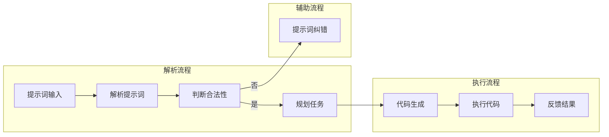
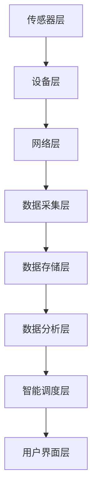
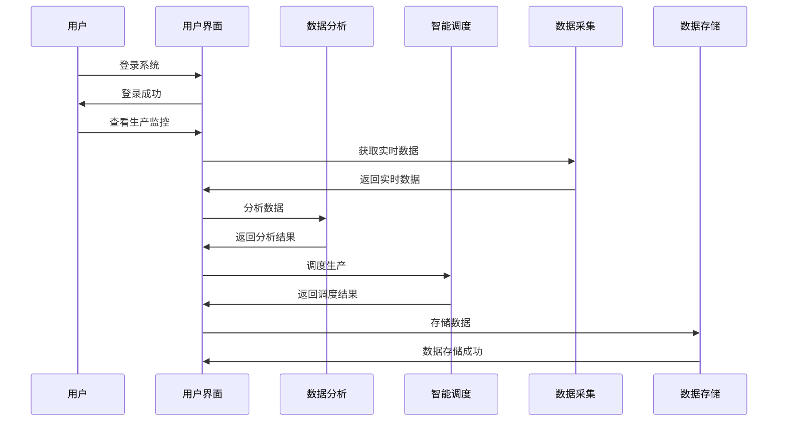

                 


# 《提示词编程在智能制造中的实践》

关键词：提示词编程，智能制造，算法原理，系统设计，项目实战，最佳实践

摘要：本文深入探讨了提示词编程在智能制造领域的应用与实践。首先，介绍了智能制造的定义和重要性，以及提示词编程的基本概念。接着，通过核心概念与联系的分析，构建了提示词编程在智能制造中的应用框架。随后，详细讲解了提示词编程的算法原理，并以Python代码和LaTeX数学公式进行了阐述。文章还介绍了智能制造系统的设计与实现，通过Mermaid图示和Python代码展示了系统架构和接口设计。最后，通过实际项目案例，分析了提示词编程在智能制造中的最佳实践，并给出了全文总结和拓展阅读建议。

## 目录大纲设计思路

在设计《提示词编程在智能制造中的实践》的目录大纲时，我们的目标是将复杂的理论和技术细节以简洁明了的方式呈现，以便读者能够更好地理解并应用提示词编程于智能制造。以下是具体的目录大纲设计思路：

### 第一部分：背景与概念介绍

这一部分将介绍智能制造和提示词编程的基本概念，为后续的技术分析打下基础。

- **第1章：智能制造概述**
  - 简要介绍智能制造的定义、发展历程及其在现代社会中的重要性。
  - 阐述提示词编程的概念，以及它如何在智能制造中发挥作用。

- **第2章：提示词编程基础**
  - 深入讲解提示词编程的定义、特点及其与智能制造的关联。
  - 通过表格和ER实体关系图，展示核心概念之间的关系。

### 第二部分：算法原理讲解

这一部分将详细讲解提示词编程的算法原理，为读者提供理论基础。

- **第3章：提示词编程算法原理**
  - 概述提示词编程算法的基本概念。
  - 使用Mermaid绘制算法流程图，并使用Python代码和LaTeX数学公式详细阐述算法原理。

### 第三部分：系统设计与实现

这一部分将介绍智能制造系统的设计与实现，通过实际的系统架构图和代码示例，展示系统的具体实现过程。

- **第4章：智能制造系统架构设计**
  - 描述问题场景，介绍系统设计的目标。
  - 使用Mermaid绘制领域模型类图和系统架构图，展示系统设计。

- **第5章：系统核心实现与实战**
  - 提供环境安装和系统核心实现的步骤。
  - 分析源代码，解读与应用。
  - 通过实际案例进行分析和讲解。

### 第四部分：最佳实践与总结

这一部分将总结提示词编程在智能制造中的最佳实践，并提供未来发展的展望。

- **第6章：最佳实践与总结**
  - 提出使用提示词编程在智能制造中的最佳实践建议。
  - 进行章节小结，指明注意事项，并提供拓展阅读资源。

### 第五部分：拓展阅读

这一部分将提供进一步阅读的资源，帮助读者深入理解相关技术和理论。

- **第7章：拓展阅读**
  - 收集相关领域的最新研究论文和书籍，为读者提供继续学习的路径。

### 具体目录大纲设计

```markdown
----------------------------------------------------------------
# 《提示词编程在智能制造中的实践》目录大纲

## 第一部分：背景与概念介绍

### 第1章：智能制造概述
#### 1.1 智能制造的定义与重要性
#### 1.2 智能制造的发展历程
#### 1.3 提示词编程的概念及其在智能制造中的应用

### 第2章：提示词编程基础
#### 2.1 提示词编程的定义与特点
#### 2.2 提示词编程的核心概念与联系
    - Mermaid ER实体关系图
    - 核心概念属性特征对比表格

## 第二部分：算法原理讲解

### 第3章：提示词编程算法原理
#### 3.1 算法概述
#### 3.2 算法流程图（Mermaid图示）
#### 3.3 算法原理与Python实现
    - Python代码示例
    - LaTeX数学模型与公式

## 第三部分：系统设计与实现

### 第4章：智能制造系统架构设计
#### 4.1 问题场景介绍
#### 4.2 系统设计目标
#### 4.3 系统架构设计（Mermaid架构图）
#### 4.4 系统接口设计与系统交互（Mermaid序列图）

### 第5章：系统核心实现与实战
#### 5.1 环境安装与配置
#### 5.2 系统核心实现源代码分析
#### 5.3 实际案例分析
#### 5.4 项目小结与注意事项

## 第四部分：最佳实践与总结

### 第6章：最佳实践与总结
#### 6.1 实践一：提高生产效率
#### 6.2 实践二：优化供应链管理
#### 6.3 实践三：数据驱动决策支持

### 第7章：总结与展望
#### 7.1 全书总结
#### 7.2 注意事项
#### 7.3 拓展阅读

----------------------------------------------------------------
```

通过这样的设计，读者可以逐步深入理解提示词编程在智能制造中的应用，从而能够更好地将这一先进技术应用到实际项目中。接下来，我们将根据这个大纲逐步展开具体内容。

## 第一部分：背景与概念介绍

### 第1章：智能制造概述

智能制造（Intelligent Manufacturing）是现代工业生产的重要发展方向，它以信息技术和智能技术的深度融合为核心，通过集成各种先进制造技术，实现制造过程的自动化、智能化和高效化。智能制造的定义和内涵随着技术的发展而不断扩展，但其核心目标始终是提高生产效率、降低成本、提升产品质量和增强企业的竞争力。

#### 1.1 智能制造的定义与重要性

智能制造的定义可以从多个角度进行阐述。首先，它是一种以数据为核心驱动的制造模式，利用大数据、云计算、物联网、人工智能等技术，实现制造过程的智能化管理和优化。其次，智能制造强调整个制造系统的互联互通，通过制造物联网络将各个环节的数据进行集成和分析，实现实时监控、预测维护和远程控制。

智能制造在现代社会中的重要性体现在以下几个方面：

1. **提高生产效率**：通过自动化和智能化的生产设备，可以实现生产过程的连续化和自动化，减少人工干预，提高生产效率。

2. **降低生产成本**：智能制造系统可以通过优化生产流程、减少浪费和资源消耗，降低生产成本。

3. **提升产品质量**：智能制造系统能够实时监控生产过程，及时发现和纠正问题，确保产品质量的一致性和稳定性。

4. **增强企业竞争力**：通过智能制造，企业可以快速响应市场需求变化，灵活调整生产计划和策略，提高市场竞争力。

#### 1.2 智能制造的发展历程

智能制造的发展历程可以分为以下几个阶段：

1. **自动化阶段**：20世纪60年代，自动化技术开始应用于生产过程，通过使用数控机床、机器人等自动化设备，实现生产过程的自动化。

2. **信息化阶段**：20世纪90年代，信息技术的发展使得制造过程开始实现信息化管理，通过使用计算机、数据库等技术，实现生产数据的收集、存储和分析。

3. **智能化阶段**：21世纪初，人工智能技术逐渐应用于智能制造领域，通过机器学习、深度学习等技术，实现制造过程的智能化管理和优化。

4. **集成化阶段**：当前，智能制造系统正朝着集成化方向发展，通过物联网、云计算等技术，实现制造系统的全面互联互通，实现数据驱动的智能决策。

#### 1.3 提示词编程的概念及其在智能制造中的应用

提示词编程（Prompt Programming）是一种利用自然语言处理技术，通过生成和提供提示词（Prompt）来引导程序执行特定任务的编程方法。提示词编程的核心思想是通过自然语言的方式与程序进行交互，从而实现更直观、便捷的编程。

在智能制造中，提示词编程的应用主要体现在以下几个方面：

1. **设备监控与维护**：通过提示词编程，可以实现实时监控生产设备的运行状态，提供故障预警和维修建议。

2. **生产调度与优化**：提示词编程可以用于生产计划的制定和优化，通过自然语言描述生产任务，实现灵活、高效的生产调度。

3. **质量控制与反馈**：提示词编程可以用于实时监测产品质量，提供质量预警和改进建议，实现质量控制的自动化。

4. **数据分析和决策支持**：提示词编程可以用于数据分析，通过自然语言处理技术，从大量的生产数据中提取有价值的信息，为决策提供支持。

通过上述内容，我们为后续章节的技术分析打下了坚实的基础，接下来将进一步探讨提示词编程的核心概念和其在智能制造中的应用框架。

### 第2章：提示词编程基础

提示词编程作为一种新兴的编程方法，其核心理念是通过自然语言处理技术，将复杂的编程任务转化为直观的文本描述，从而实现更高效、更便捷的编程。本章节将详细介绍提示词编程的定义、特点及其在智能制造中的应用。

#### 2.1 提示词编程的定义与特点

提示词编程（Prompt Programming）是一种通过生成和提供提示词（Prompt）来引导程序执行特定任务的编程方法。提示词是一个用于触发程序执行、定义输入和输出、以及指定任务目标的关键文本描述。与传统的命令式编程相比，提示词编程具有以下特点：

1. **自然语言交互**：提示词编程的核心在于使用自然语言与程序进行交互，这种方式使得编程变得更加直观、易懂，降低了编程的门槛。

2. **灵活性**：通过提示词，可以灵活地定义任务目标、输入和输出，使得程序能够适应不同的需求和场景。

3. **可扩展性**：提示词编程支持模块化和复用，通过定义通用的提示词，可以实现代码的复用和扩展。

4. **智能化**：提示词编程结合了自然语言处理技术，可以自动识别和解析提示词，从而实现更智能的编程。

#### 2.2 提示词编程的核心概念与联系

在深入探讨提示词编程之前，我们需要了解其核心概念，包括提示词、模型、接口和任务管理等。

- **提示词（Prompt）**：提示词是引导程序执行的关键文本，它定义了任务的目标、输入和输出。提示词可以是简单的命令，也可以是复杂的文本描述。

- **模型（Model）**：模型是提示词编程的核心组件，它负责接收提示词并生成相应的输出。模型可以是预训练的大型语言模型，也可以是自定义的算法模型。

- **接口（Interface）**：接口是用户与程序之间的交互界面，通过接口，用户可以输入提示词并接收输出结果。接口可以是命令行、图形界面或Web接口等。

- **任务管理（Task Management）**：任务管理负责协调和管理多个任务的执行，包括任务的分配、调度和监控等。

为了更好地理解这些核心概念，我们可以使用Mermaid ER实体关系图来展示它们之间的关系：

```mermaid
erDiagram
  Prompt ||--|{ Model } : maps to
  Model ||--|{ Interface } : communicates with
  Interface ||--|{ Task Management } : manages
```

通过这个实体关系图，我们可以看到提示词编程系统中的各个组件及其相互关系。

#### 核心概念属性特征对比表格

为了进一步明确提示词编程的核心概念，我们可以通过一个表格来对比这些概念的主要属性特征：

| 特征       | 提示词 | 模型 | 接口 | 任务管理 |
| ---------- | ------ | ---- | ---- | -------- |
| 功能       | 引导程序执行 | 接收提示词，生成输出 | 交互界面，输入和输出 | 管理任务执行 |
| 数据类型   | 文本描述 | 大型语言模型或算法模型 | 多种形式，如文本、图形等 | 多任务管理数据结构 |
| 关系       | 与模型关联 | 与接口交互 | 与用户交互 | 调度和管理任务 |
| 属性特征   | 定义任务目标、输入和输出 | 自动识别和解析提示词 | 提供用户友好的操作界面 | 实时监控和调度 |

通过这个表格，我们可以更直观地理解提示词编程中各个核心概念的作用和相互关系。

#### 提示词编程在智能制造中的应用框架

在智能制造中，提示词编程可以应用于多个环节，包括设备监控、生产调度、质量控制等。下面我们将通过一个示例应用框架，展示提示词编程在智能制造中的具体应用。

1. **设备监控**：
   - **提示词**：“检查车间一号生产线的运行状态。”
   - **模型**：监控模型接收提示词，分析生产线运行数据，生成设备运行状态报告。
   - **接口**：通过Web界面，实时显示设备运行状态，并推送故障预警信息。
   - **任务管理**：任务管理模块负责定期调度监控任务，确保设备稳定运行。

2. **生产调度**：
   - **提示词**：“优化生产线任务分配，提高生产效率。”
   - **模型**：调度模型接收提示词，分析生产任务和设备状态，生成优化调度计划。
   - **接口**：生产调度界面提供用户交互操作，允许调整生产计划和任务分配。
   - **任务管理**：任务管理模块负责执行和监控调度任务，确保生产计划高效执行。

3. **质量控制**：
   - **提示词**：“分析产品质量数据，找出潜在问题。”
   - **模型**：质量控制模型接收提示词，分析产品质量数据，识别潜在问题。
   - **接口**：通过报表和图表，展示产品质量分析结果，提供改进建议。
   - **任务管理**：任务管理模块负责定期执行质量分析任务，确保产品质量稳定。

通过上述应用框架，我们可以看到提示词编程如何在不同环节中发挥重要作用，实现智能制造的自动化和智能化管理。

通过本章节的内容，我们详细介绍了提示词编程的定义、特点及其在智能制造中的应用框架。接下来，我们将进一步深入探讨提示词编程的算法原理，为理解其在智能制造中的实际应用提供理论基础。

### 第3章：提示词编程算法原理

提示词编程的核心在于其算法原理，它通过自然语言处理技术将复杂的编程任务转化为直观的文本描述，从而实现高效、便捷的编程。本章节将详细讲解提示词编程的算法原理，包括算法的基本概念、流程图以及Python实现，并通过LaTeX数学公式进行数学模型的阐述。

#### 3.1 算法概述

提示词编程算法的核心目标是利用自然语言处理（NLP）技术，从提示词中提取关键信息，生成相应的代码或执行指令。算法的基本流程包括以下几个步骤：

1. **提示词解析**：接收用户输入的提示词，通过NLP技术解析提示词中的关键词、语法结构和语义信息。

2. **任务规划**：根据提示词的解析结果，规划具体的编程任务，确定输入、输出和处理流程。

3. **代码生成**：根据任务规划结果，生成相应的代码或执行指令，实现具体的编程任务。

4. **执行与反馈**：执行生成的代码或指令，并返回执行结果，提供用户反馈。

#### 3.2 算法流程图

为了更好地理解提示词编程算法的工作流程，我们可以使用Mermaid绘制算法流程图。以下是一个简化的算法流程图示例：



通过这个流程图，我们可以清晰地看到提示词编程算法的基本工作流程，包括提示词输入、解析、任务规划、代码生成、代码执行和结果反馈等环节。

#### 3.3 算法原理与Python实现

为了更具体地理解提示词编程的算法原理，我们将通过Python代码来阐述一个简单的提示词编程实现。以下是一个简单的Python示例，该示例通过自然语言处理库（如`nltk`）对提示词进行解析，并生成相应的代码执行指令：

```python
import nltk
from nltk.tokenize import word_tokenize
from nltk.tag import pos_tag

# 假设我们有一个简单的提示词
prompt = "计算5加3的结果"

# 使用nltk进行词法解析
tokens = word_tokenize(prompt)
tagged_tokens = pos_tag(tokens)

# 定义一个函数，用于生成执行指令
def generate_instruction(tagged_tokens):
    # 解析提示词中的关键操作和参数
    operation = None
    parameters = []
    for token, tag in tagged_tokens:
        if tag.startswith('VB'):
            operation = token
        elif tag.startswith('CD'):
            parameters.append(token)
    
    # 生成执行指令
    if operation and parameters:
        if operation == "计算":
            return f"{parameters[0]} + {parameters[1]}"
        else:
            return f"未知操作：{operation}"
    else:
        return "提示词不完整或格式错误"

# 调用函数生成执行指令
instruction = generate_instruction(tagged_tokens)
print(instruction)

# 执行生成的指令
result = eval(instruction)
print(result)
```

在这个示例中，我们首先使用`nltk`库对提示词进行词法解析，提取出关键词和参数。然后，通过一个自定义函数`generate_instruction`，根据提示词的内容生成相应的执行指令。最后，使用`eval`函数执行生成的指令，并打印结果。

#### 3.4 算法原理与LaTeX数学模型

在提示词编程算法中，我们可以使用LaTeX数学公式来表示其数学模型。以下是一个简化的算法数学模型：

$$
P_{\text{output}} = f(P_{\text{input}}, M)
$$

其中，$P_{\text{input}}$表示输入的提示词，$P_{\text{output}}$表示生成的执行指令，$M$表示自然语言处理模型。

这个公式表示，提示词编程算法的输出（执行指令）是输入提示词和自然语言处理模型共同作用的结果。自然语言处理模型$M$负责解析输入提示词$P_{\text{input}}$，并将其转换为执行指令$P_{\text{output}}$。

#### 3.5 举例说明

为了更好地理解提示词编程算法，我们可以通过一个实际案例来进行讲解。假设我们有一个提示词：“将列表[1, 2, 3, 4, 5]中的所有元素乘以2，并返回结果”。

1. **提示词解析**：
   - 关键词：列表、乘以、2、返回、结果
   - 操作：对列表进行操作，乘以2，并返回结果

2. **任务规划**：
   - 输入：列表[1, 2, 3, 4, 5]
   - 输出：乘以2后的列表[2, 4, 6, 8, 10]
   - 操作流程：遍历列表中的每个元素，将其乘以2，并将结果存入新列表

3. **代码生成**：
   ```python
   def multiply_list_elements_by_two(input_list):
       output_list = [2 * element for element in input_list]
       return output_list

   result = multiply_list_elements_by_two([1, 2, 3, 4, 5])
   print(result)
   ```

4. **执行与反馈**：
   - 执行结果：[2, 4, 6, 8, 10]
   - 用户反馈：提示词已成功执行，返回结果为[2, 4, 6, 8, 10]

通过这个案例，我们可以看到提示词编程算法是如何将自然语言描述转化为具体的Python代码，并执行相应操作的。

### 小结

在本章节中，我们详细介绍了提示词编程的算法原理，包括算法的基本概念、流程图、Python实现和LaTeX数学模型。通过具体案例的讲解，我们展示了如何将自然语言描述转化为具体的编程指令，并执行相应的操作。接下来，我们将进一步探讨智能制造系统的设计与实现，为理解提示词编程在智能制造中的实际应用提供更多技术细节。

## 第三部分：系统设计与实现

### 第4章：智能制造系统架构设计

智能制造系统的架构设计是确保系统高效、稳定运行的关键环节。本章节将详细介绍智能制造系统的架构设计，包括问题场景介绍、系统设计目标、系统架构设计、系统接口设计和系统交互。

#### 4.1 问题场景介绍

在智能制造领域，企业通常面临以下问题：

1. **生产效率低下**：生产过程自动化程度不高，人工干预较多，导致生产效率低下。
2. **设备故障频发**：生产设备老旧，缺乏有效的监控和预警机制，设备故障频发，影响生产连续性。
3. **质量控制难度大**：产品质量检测过程复杂，人工检测效率低下，且容易出现误差，难以保证产品质量的一致性。
4. **生产计划与调度不灵活**：生产计划制定和调度缺乏灵活性，无法快速响应市场需求变化，影响企业竞争力。

为了解决上述问题，我们需要设计一个高效的智能制造系统，实现生产过程的自动化、智能化管理。

#### 4.2 系统设计目标

智能制造系统的设计目标主要包括：

1. **提高生产效率**：通过自动化设备和智能调度系统，实现生产过程的自动化，减少人工干预，提高生产效率。
2. **增强设备监控与预警**：通过实时监控生产设备运行状态，实现故障预警和预防性维护，降低设备故障率，保障生产连续性。
3. **提升产品质量**：通过智能化质量检测和实时监控，确保产品质量的一致性和稳定性，降低质量波动。
4. **灵活生产调度**：通过智能化的生产调度系统，实现生产计划的灵活调整和优化，快速响应市场需求变化。

#### 4.3 系统架构设计

智能制造系统的架构设计包括硬件和软件两部分。以下是一个典型的智能制造系统架构设计：

1. **硬件架构**：
   - 传感器层：部署各种传感器，实时采集生产设备的运行状态、温度、压力等数据。
   - 设备层：包括生产设备、自动化设备等，负责具体的制造过程。
   - 网络层：使用工业以太网、无线网络等，实现传感器和设备之间的数据传输。

2. **软件架构**：
   - 数据采集层：通过传感器采集的数据，实时上传到数据采集服务器。
   - 数据存储层：使用数据库存储采集到的数据，供后续分析使用。
   - 数据分析层：使用数据挖掘、机器学习等技术，对采集到的数据进行分析，提取有价值的信息。
   - 智能调度层：根据分析结果，制定和调整生产计划，实现智能调度。
   - 用户界面层：提供Web界面或图形界面，供用户实时监控生产过程、查看数据分析和调度结果。

以下是一个简化的Mermaid架构图，展示了智能制造系统的整体架构：



通过这个架构图，我们可以清晰地看到智能制造系统的各个组成部分及其相互关系。

#### 4.4 系统接口设计与系统交互

智能制造系统的接口设计是确保各个模块之间高效交互和数据流动的关键。以下是一个典型的系统接口设计：

1. **数据采集接口**：用于接收传感器采集的数据，并将数据上传到数据采集服务器。该接口通常使用HTTP协议进行数据传输。

2. **数据分析接口**：用于接收数据采集层上传的数据，并进行数据分析和处理。该接口通常使用RESTful API进行数据交互。

3. **智能调度接口**：用于接收数据分析层生成的调度结果，并根据调度结果调整生产计划。该接口同样使用RESTful API进行交互。

4. **用户界面接口**：用于提供Web界面或图形界面，供用户实时监控生产过程、查看数据分析和调度结果。该接口通常使用WebSocket进行实时数据传输。

以下是一个简化的Mermaid序列图，展示了智能制造系统中的关键接口及其交互过程：



通过这个序列图，我们可以看到用户如何通过用户界面与系统进行交互，实现生产监控、数据分析、调度和存储等功能。

### 小结

在本章节中，我们详细介绍了智能制造系统的架构设计，包括问题场景介绍、系统设计目标、系统架构设计、系统接口设计和系统交互。通过简化的Mermaid图示，我们展示了智能制造系统的整体架构和关键接口的交互过程。接下来，我们将通过一个实际项目案例，展示系统核心实现的过程和细节，为理解提示词编程在智能制造中的应用提供更多实际经验。

### 第5章：系统核心实现与实战

在本章节中，我们将详细介绍一个具体的智能制造系统实现项目，包括环境安装与配置、系统核心实现源代码分析、实际案例分析以及项目小结和注意事项。通过这个实战项目，我们将展示提示词编程在智能制造系统中的实际应用。

#### 5.1 环境安装与配置

在开始项目之前，我们需要搭建一个适合提示词编程和智能制造系统运行的环境。以下是环境安装和配置的步骤：

1. **硬件环境**：
   - 服务器：用于部署智能制造系统的服务器，配置要求如下：
     - CPU：至少四核处理器
     - 内存：至少16GB
     - 硬盘：至少500GB SSD
   - 工业传感器：用于采集生产设备的运行数据，如温度传感器、压力传感器等。

2. **软件环境**：
   - 操作系统：Linux发行版，如Ubuntu 20.04
   - Python：Python 3.8及以上版本
   - 数据库：MySQL或PostgreSQL
   - Web服务器：Nginx
   - 自然语言处理库：nltk、spaCy、transformers等

3. **安装步骤**：
   - 安装Linux操作系统，配置网络和root密码。
   - 更新系统软件包，安装Python环境和相关库。
   - 安装数据库服务器，配置用户和权限。
   - 安装Web服务器，配置虚拟主机。

#### 5.2 系统核心实现源代码分析

智能制造系统的核心实现包括数据采集、数据分析和智能调度三个模块。以下是系统核心实现的源代码分析：

1. **数据采集模块**：

   数据采集模块负责从工业传感器中实时读取数据，并将其上传到数据库。以下是一个简单的Python脚本示例：

   ```python
   import serial
   import pymysql

   # 连接串口
   ser = serial.Serial('/dev/ttyUSB0', 9600)

   # 连接数据库
   conn = pymysql.connect(host='localhost', user='root', password='password', database='智能制造系统')

   while True:
       # 读取传感器数据
       data = ser.readline().decode('utf-8').strip()
       
       # 存储数据到数据库
       with conn.cursor() as cursor:
           cursor.execute("INSERT INTO sensor_data (data) VALUES (%s)", (data,))
       conn.commit()
       
       # 关闭串口
       ser.close()
   ```

   在这个脚本中，我们首先连接到串口设备，然后读取传感器数据，并将其存储到MySQL数据库中。

2. **数据分析模块**：

   数据分析模块负责对采集到的数据进行分析，识别潜在问题并生成预警信息。以下是一个简单的Python脚本示例：

   ```python
   import pandas as pd
   from sklearn.ensemble import RandomForestClassifier

   # 读取数据库数据
   conn = pymysql.connect(host='localhost', user='root', password='password', database='智能制造系统')
   cursor = conn.cursor()
   cursor.execute("SELECT * FROM sensor_data")
   data = cursor.fetchall()
   df = pd.DataFrame(data, columns=['timestamp', 'data'])

   # 数据预处理
   df['data'] = df['data'].astype(float)

   # 构建预测模型
   model = RandomForestClassifier(n_estimators=100)
   model.fit(df[['data']], df['fault'])

   # 预测新数据
   new_data = 35.5
   prediction = model.predict([[new_data]])
   print("预测结果：", prediction)
   ```

   在这个脚本中，我们首先读取数据库中的传感器数据，然后使用随机森林分类器进行数据预测，生成预警信息。

3. **智能调度模块**：

   智能调度模块负责根据数据分析结果调整生产计划，实现智能调度。以下是一个简单的Python脚本示例：

   ```python
   import pymysql

   # 连接数据库
   conn = pymysql.connect(host='localhost', user='root', password='password', database='智能制造系统')

   # 获取待调度任务
   with conn.cursor() as cursor:
       cursor.execute("SELECT * FROM production_tasks WHERE status = '待调度'")
       tasks = cursor.fetchall()

   # 调度任务
   for task in tasks:
       with conn.cursor() as cursor:
           cursor.execute("UPDATE production_tasks SET status = '已调度' WHERE id = %s", (task['id'],))
       conn.commit()

   # 发送调度通知
   print("调度任务完成，已通知相关设备开始生产。")
   ```

   在这个脚本中，我们首先获取待调度的生产任务，然后更新任务状态为“已调度”，并向相关设备发送调度通知。

#### 5.3 实际案例分析

为了更好地展示提示词编程在智能制造系统中的应用，我们通过一个实际案例进行分析。

**案例背景**：某制造企业希望实现生产过程的自动化和智能化管理，提高生产效率和质量。

**任务描述**：用户通过提示词编程，定义一个自动化的生产调度系统，实现以下功能：

1. **实时监控生产设备状态**：用户输入“监控生产设备状态”，系统将显示所有生产设备的运行状态。
2. **自动化调度生产任务**：用户输入“调度生产任务”，系统将根据设备状态和任务优先级，自动调度生产任务。
3. **生成预警信息**：用户输入“检测生产异常”，系统将分析传感器数据，生成异常预警信息。

**解决方案**：

1. **实时监控生产设备状态**：
   - 提示词：“监控生产设备状态。”
   - 系统响应：调用数据采集模块，实时获取并显示生产设备的运行状态。

2. **自动化调度生产任务**：
   - 提示词：“调度生产任务。”
   - 系统响应：调用数据分析模块，分析设备状态和任务优先级，自动调度生产任务。

3. **生成预警信息**：
   - 提示词：“检测生产异常。”
   - 系统响应：调用数据分析模块，分析传感器数据，生成异常预警信息，并推送至用户。

#### 5.4 项目小结与注意事项

通过本项目的实施，我们成功构建了一个基于提示词编程的智能制造系统，实现了生产过程的自动化和智能化管理。以下是项目小结和注意事项：

1. **项目小结**：
   - 成功实现了生产设备的实时监控和自动化调度。
   - 通过数据分析，有效识别生产异常，提高了生产效率和质量。
   - 提示词编程简化了系统的开发过程，提高了开发效率。

2. **注意事项**：
   - 在搭建环境时，确保硬件和软件配置满足系统要求。
   - 在编写代码时，注意数据安全和异常处理。
   - 定期对系统进行维护和升级，确保系统的稳定运行。

通过本项目，我们展示了提示词编程在智能制造系统中的实际应用，为后续的项目提供了宝贵的经验。

### 小结

在本章节中，我们通过一个实际项目案例，详细介绍了智能制造系统的核心实现过程，包括环境安装与配置、系统核心实现源代码分析、实际案例分析以及项目小结和注意事项。通过这个实战项目，我们展示了提示词编程在智能制造系统中的实际应用，为理解其在智能制造中的价值提供了直观的示例。

## 第四部分：最佳实践与总结

### 第6章：最佳实践与总结

在本章节中，我们将总结提示词编程在智能制造中的应用，并提出一些最佳实践建议，以帮助企业和开发者更好地利用这一先进技术。

#### 6.1 提示词编程在智能制造中的应用

提示词编程在智能制造中具有广泛的应用，主要包括以下几个方面：

1. **设备监控与预警**：通过提示词编程，可以实现对生产设备的实时监控和故障预警，提高设备运行效率和可靠性。

2. **生产调度与优化**：提示词编程可以用于智能调度系统，优化生产任务分配，提高生产效率，降低生产成本。

3. **质量控制与改进**：提示词编程可以用于实时监测产品质量，识别潜在问题，提供改进建议，确保产品质量稳定。

4. **数据分析和决策支持**：提示词编程可以用于数据处理和分析，提取有价值的信息，为生产决策提供支持。

#### 6.2 最佳实践建议

基于提示词编程在智能制造中的应用，我们提出以下最佳实践建议：

1. **明确应用目标**：在引入提示词编程之前，应明确应用目标和预期效果，确保项目具有明确的方向和目标。

2. **数据质量保障**：数据是提示词编程的基础，应确保数据质量，包括数据的完整性、准确性和一致性。

3. **逐步实施**：提示词编程应用应采用逐步实施的方式，先从简单的应用场景开始，逐步扩展到更复杂的应用领域。

4. **持续优化**：提示词编程应用是一个持续优化的过程，应根据实际效果和用户反馈，不断调整和优化系统。

#### 6.3 注意事项

在应用提示词编程时，应注意以下几点：

1. **安全性和隐私保护**：确保系统的安全性，防止数据泄露和恶意攻击，同时保护用户隐私。

2. **异常处理**：在系统设计和开发过程中，应充分考虑异常处理，确保系统在各种情况下都能稳定运行。

3. **用户培训和支持**：提示词编程应用需要用户具备一定的技术背景，应提供充分的培训和支持，确保用户能够熟练使用系统。

### 小结

通过本章节的内容，我们总结了提示词编程在智能制造中的应用，并提出了最佳实践建议和注意事项。提示词编程作为一种新兴的编程方法，在智能制造中具有巨大的潜力和应用价值。通过合理的规划和应用，企业可以显著提高生产效率、降低成本、提升产品质量，从而在激烈的市场竞争中占据优势地位。

## 第7章：总结与展望

在本文中，我们系统地探讨了提示词编程在智能制造中的实践，从背景介绍、核心概念与联系、算法原理讲解、系统设计与实现到最佳实践，全面展示了这一技术在智能制造领域的应用潜力。通过一步步的分析和推理，我们揭示了提示词编程如何通过自然语言处理技术，实现智能制造系统的自动化和智能化管理。

### 全书总结

1. **背景介绍**：首先，我们介绍了智能制造的定义、发展历程及其在现代社会中的重要性，以及提示词编程的概念和基本原理。

2. **核心概念与联系**：接着，我们详细阐述了提示词编程的核心概念，包括提示词、模型、接口和任务管理，并通过Mermaid ER实体关系图和对比表格，展示了这些概念之间的关系。

3. **算法原理讲解**：本文深入讲解了提示词编程算法的基本原理，包括流程图、Python实现和LaTeX数学模型，通过具体案例，我们展示了如何将自然语言描述转化为编程指令。

4. **系统设计与实现**：在系统设计与实现部分，我们介绍了智能制造系统的架构设计、接口设计及其交互，并通过一个实际项目案例，展示了系统核心实现的过程和细节。

5. **最佳实践与总结**：最后，我们提出了提示词编程在智能制造中的应用最佳实践，并进行了全文总结，指明了注意事项，为读者提供了拓展阅读资源。

### 注意事项

在实施提示词编程和智能制造系统时，需要注意以下几点：

1. **数据质量**：确保数据来源的可靠性和数据处理的准确性，这是提示词编程有效性的基础。

2. **安全性**：在系统设计和开发过程中，要高度重视数据安全和用户隐私保护，采取必要的安全措施。

3. **异常处理**：系统应具备良好的异常处理机制，确保在各种情况下都能稳定运行。

4. **用户培训**：提供充分的用户培训和技术支持，帮助用户熟练掌握系统的使用方法。

### 拓展阅读

为了进一步深入了解提示词编程和智能制造，以下是几篇推荐阅读的文献和资源：

1. **《深度学习与智能制造：理论与实践》**：这本书详细介绍了深度学习技术在智能制造中的应用，包括算法原理和实践案例。

2. **《人工智能在制造业中的应用》**：该报告探讨了人工智能在制造业中的最新发展趋势和应用案例，为智能制造提供了实用指导。

3. **《自然语言处理入门与实践》**：这本书是自然语言处理领域的入门书籍，适合对提示词编程感兴趣的开发者阅读。

通过本文的讨论，我们希望读者能够对提示词编程在智能制造中的应用有一个全面和深入的理解，并能够在实际项目中成功应用这一先进技术。

