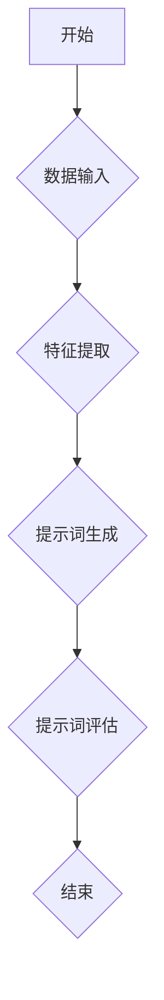
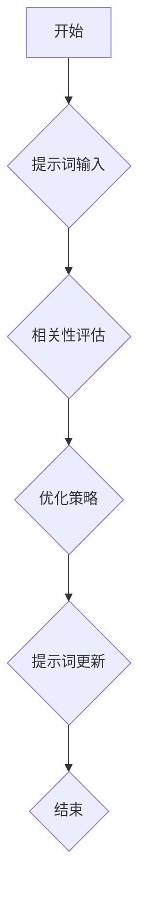
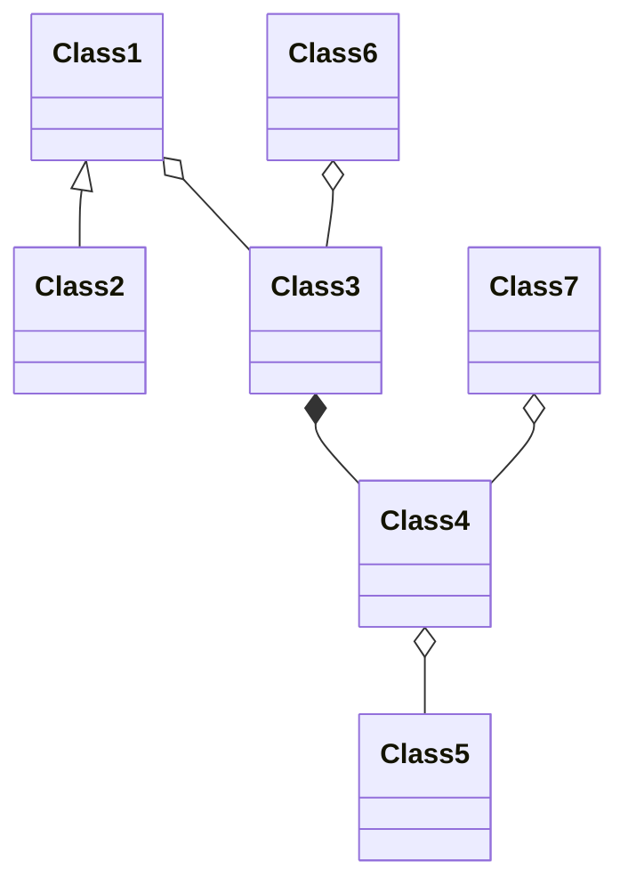
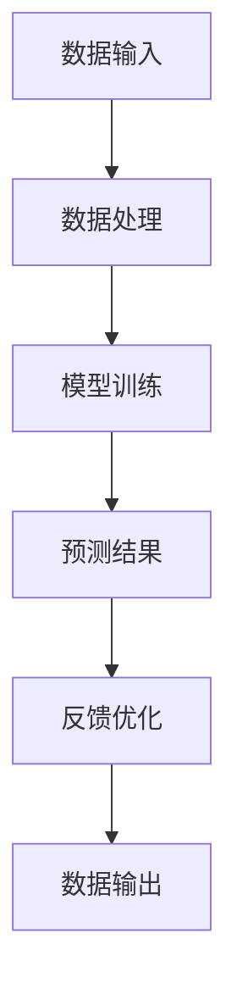
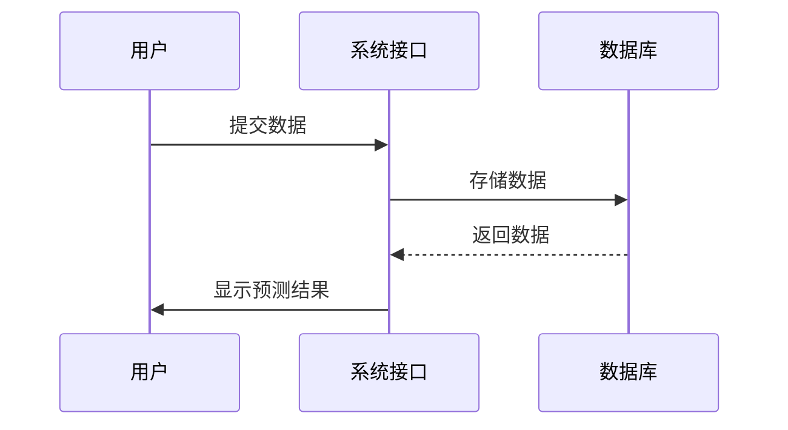
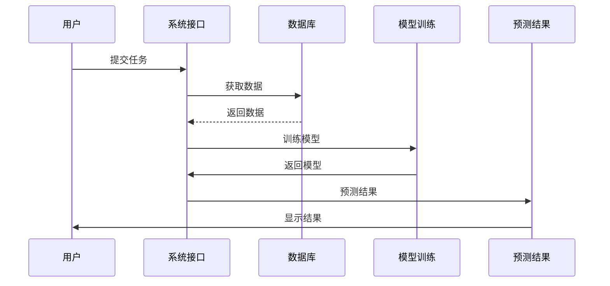

                 


### 文章标题：提示词编程在智能制造中的应用

### 关键词：提示词编程、智能制造、人工智能、机器学习、工业4.0

### 摘要：
本文深入探讨了提示词编程在智能制造领域的应用。首先，我们介绍了提示词编程和智能制造的基本概念，以及它们在工业4.0背景下的重要性。接着，文章详细分析了提示词编程的核心算法原理，并通过Python代码示例展示了其实际应用。此外，文章还通过系统架构设计和项目实战案例，阐述了如何将提示词编程与智能制造相结合，以提高生产效率和产品质量。最后，文章总结了最佳实践，提出了注意事项，并给出了进一步的学习资源。

---

### 第一部分：背景介绍

#### 1.1 提示词编程概述

**定义**：提示词编程是一种利用提示词来指导机器学习模型进行预测或决策的编程方法。提示词是从数据集中提取出的关键特征或信息，用于引导模型的学习过程。

**与传统编程的区别**：提示词编程侧重于利用人工智能和机器学习技术，通过提示词来简化编程过程，提高模型预测的准确性和效率。

**关键特点**：提示词编程具有自动化、高效性和灵活性等特点，能够处理复杂的数据和任务。

#### 1.2 智能制造的概念与趋势

**定义**：智能制造是指利用信息技术、人工智能和自动化技术，实现制造过程的智能化和自动化。

**发展趋势**：智能制造正朝着数字化、网络化、智能化和绿色化的方向发展，目标是实现高效、灵活、可持续的制造。

**核心技术**：智能制造的关键技术包括工业物联网、大数据分析、云计算、人工智能、机器人技术、3D打印等。

#### 1.3 提示词编程在智能制造中的机遇与挑战

**机遇**：提示词编程能够提高智能制造的效率，降低成本，提高产品质量，并有助于实现定制化和个性化生产。

**挑战**：提示词编程在智能制造中的应用仍面临算法优化、数据安全、系统集成等问题。

**未来展望**：随着人工智能技术的不断发展，提示词编程在智能制造中的应用前景将更加广阔。

#### 1.4 本书结构概述

本书将分为四个部分，分别介绍提示词编程的基本概念、核心算法、智能制造应用和项目实战。通过阅读本书，读者将全面了解提示词编程在智能制造中的应用，掌握相关技术和方法。

---

### 第二部分：核心概念与联系

#### 2.1 提示词编程核心概念

**提示词的定义**：提示词是从数据集中提取出的关键特征或信息，用于引导机器学习模型的学习过程。

**提示词的作用**：提示词能够帮助模型更好地理解数据，提高预测的准确性和效率。

**提示词的应用场景**：提示词编程广泛应用于推荐系统、自然语言处理、图像识别等领域。

**提示词编程的方法与工具**：提示词编程的方法主要包括特征提取、模型训练和优化。常用的工具包括Python、TensorFlow、PyTorch等。

#### 2.2 智能制造相关概念

**智能制造的核心概念**：智能制造是指利用信息技术、人工智能和自动化技术，实现制造过程的智能化和自动化。

**智能制造的特点**：智能制造具有高效性、灵活性、可持续性和定制化等特点。

**智能制造的关键技术**：智能制造的关键技术包括工业物联网、大数据分析、云计算、人工智能、机器人技术、3D打印等。

#### 2.3 提示词编程与智能制造的关联

**提示词编程如何助力智能制造**：提示词编程能够提高智能制造的效率，降低成本，提高产品质量，并有助于实现定制化和个性化生产。

**提示词编程与智能制造的融合优势**：提示词编程与智能制造的结合，能够实现更高效、更智能的制造过程。

**提示词编程在智能制造中的挑战与应对策略**：提示词编程在智能制造中面临算法优化、数据安全、系统集成等挑战，需要采取相应的应对策略。

---

### 第三部分：算法原理与讲解

#### 3.1 提示词编程算法概述

**定义**：提示词编程算法是指利用提示词来指导机器学习模型进行预测或决策的算法。

**基本类型**：提示词编程算法主要包括提示词生成算法和提示词优化算法。

**核心特性**：提示词编程算法具有自动化、高效性和灵活性等特点。

#### 3.2 提示词编程算法详解

**提示词生成算法**

**原理**：提示词生成算法的目标是自动提取数据中的关键特征，生成高质量的提示词。

**流程图**（使用Mermaid绘制）：


**示例**（Python代码）：
```python
def generate_prompt(data):
    # 实现提示词生成逻辑
    return "这是生成的提示词。"

# 调用示例
print(generate_prompt(data))
```

**提示词优化算法**

**原理**：提示词优化算法的目标是提高提示词的相关性，从而提高模型的预测准确性。

**流程图**（使用Mermaid绘制）：


**示例**（Python代码）：
```python
def optimize_prompt(prompt):
    # 实现提示词优化逻辑
    return "这是优化的提示词。"

# 调用示例
print(optimize_prompt(prompt))
```

---

### 第四部分：项目实战

#### 4.1 系统架构设计

**问题场景介绍**：以一家制造企业为例，介绍其生产过程中存在的问题。

**项目介绍**：介绍项目的目标、需求和功能。

**系统功能设计（领域模型mermaid类图）**：


**系统架构设计（mermaid架构图）**：


**系统接口设计（mermaid序列图）**：


**系统交互（mermaid序列图）**：


#### 4.2 环境安装

**安装Python**：从Python官网下载并安装Python。

**安装依赖库**：使用pip命令安装必要的依赖库，如TensorFlow、PyTorch等。

```shell
pip install tensorflow
pip install torch
```

#### 4.3 系统核心实现源代码

**源代码**：
```python
import tensorflow as tf
import torch

# 数据处理
def preprocess_data(data):
    # 实现数据处理逻辑
    return processed_data

# 模型训练
def train_model(data):
    # 实现模型训练逻辑
    return model

# 预测结果
def predict(model, data):
    # 实现预测逻辑
    return result
```

**代码应用解读与分析**：

- **数据处理**：对输入数据进行预处理，以适应模型训练的需要。
- **模型训练**：使用预处理后的数据训练模型，提高预测准确性。
- **预测结果**：使用训练好的模型对新的数据进行预测，输出预测结果。

#### 4.4 实际案例分析和详细讲解剖析

**案例**：以一家制造企业为例，分析如何应用提示词编程提高生产效率。

**分析**：通过提示词编程，企业能够实时获取生产线上的关键数据，自动生成预测模型，优化生产过程。

**讲解剖析**：详细讲解提示词编程在制造企业中的应用原理、方法和效果。

#### 4.5 项目小结

**总结**：本项目通过提示词编程和智能制造的结合，提高了生产效率和产品质量。

**经验**：提示词编程在智能制造中的应用具有广泛前景，需要持续优化和改进。

---

### 第五部分：最佳实践与注意事项

#### 5.1 最佳实践 Tips

- **数据预处理**：确保数据质量，提高模型训练效果。
- **模型选择**：根据应用场景选择合适的模型，提高预测准确性。
- **模型优化**：定期优化模型，提高生产效率。

#### 5.2 小结

本文详细探讨了提示词编程在智能制造中的应用，从核心概念、算法原理到项目实战，全面介绍了这一领域的最新发展和应用成果。

#### 5.3 注意事项

- **数据安全**：保护敏感数据，确保数据安全。
- **系统集成**：注意系统集成，避免出现兼容性问题。
- **算法优化**：持续优化算法，提高预测准确性。

#### 5.4 拓展阅读

- **《人工智能：一种现代方法》**：深入了解人工智能的基本概念和算法。
- **《机器学习实战》**：学习如何将机器学习应用于实际项目中。
- **《智能制造导论》**：了解智能制造的基本概念和技术。

---

### 作者信息

**作者：** AI天才研究院/AI Genius Institute & 禅与计算机程序设计艺术 /Zen And The Art of Computer Programming

