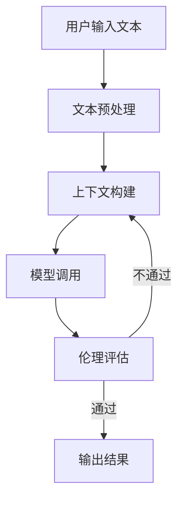
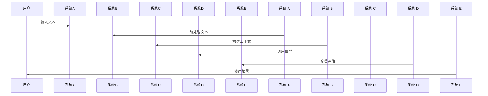

                 

### 引言

在人工智能和自然语言处理技术飞速发展的背景下，提示词编程（Prompt Engineering）作为一种新兴的技术，正在逐步融入各个领域，尤其是在自然语言伦理分析中展现出了独特的价值。本文旨在探讨提示词编程在自然语言伦理分析中的角色，通过逐步分析推理，揭示其在伦理决策、问题解决和跨领域融合中的潜力。

**关键词**：提示词编程、自然语言处理、伦理分析、人工智能

**摘要**：本文首先介绍了提示词编程的基本概念和应用场景，随后探讨了自然语言伦理分析的背景和重要性。接着，我们分析了提示词编程与伦理分析之间的联系，并逐步讲解了它们的核心概念、算法原理和系统架构。最后，通过实际案例和最佳实践，展示了提示词编程在自然语言伦理分析中的具体应用和未来发展方向。

### 目录

1. 引言
2. 提示词编程概述
   2.1 提示词编程的基本概念
   2.2 提示词编程的应用场景
   2.3 提示词编程的核心优势
3. 自然语言伦理分析背景
   3.1 自然语言处理的现状
   3.2 伦理分析的必要性
   3.3 自然语言伦理分析的应用领域
4. 提示词编程与伦理分析的联系
   4.1 核心概念与原理
   4.2 概念属性特征对比
5. 提示词编程在伦理分析中的应用
   5.1 算法原理与流程图
   5.2 数学模型与公式讲解
6. 系统分析与架构设计
   6.1 系统功能设计
   6.2 系统架构设计
   6.3 系统交互与流程图
7. 项目实战
   7.1 环境安装与实现
   7.2 代码应用解读与分析
   7.3 实际案例分析与剖析
   7.4 项目小结
8. 最佳实践与总结
   8.1 最佳实践 tips
   8.2 小结与拓展阅读

### 提示词编程概述

#### 2.1 提示词编程的基本概念

提示词编程（Prompt Engineering）是一种通过构建特定语境和任务提示，来优化人工智能模型性能和输出质量的技术。在自然语言处理领域，提示词编程旨在通过设计高效、精确的提示，引导模型生成更符合预期、更有价值的文本。

提示词编程的核心思想是，通过对输入文本进行精细调整，增加上下文信息，使模型能够更好地理解任务目标和输入内容，从而生成更加准确和有意义的输出。这种技术不仅能够提升模型的表现，还能够帮助用户更便捷地与模型进行交互，实现更加人性化的自然语言处理体验。

#### 2.2 提示词编程的应用场景

提示词编程在多个领域都有广泛应用，尤其在自然语言生成、机器翻译、对话系统等方面表现尤为突出。

1. **自然语言生成**：提示词编程可以用于文本生成任务，如文章写作、报告生成、聊天机器人等。通过设计合适的提示词，可以显著提升文本生成的质量和一致性。

2. **机器翻译**：在机器翻译任务中，提示词编程可以帮助提高翻译的准确性和流畅性。例如，通过在输入文本中添加关键词和上下文信息，可以引导模型生成更加精准的翻译结果。

3. **对话系统**：在智能客服、聊天机器人等对话系统中，提示词编程可以用于设计更加自然和人性化的对话流程。通过精心设计的提示词，系统可以更好地理解用户意图，提供更加有效的服务。

#### 2.3 提示词编程的核心优势

1. **提升输出质量**：通过设计高效、精确的提示词，可以显著提升模型生成文本的质量和准确性。

2. **增强用户体验**：提示词编程能够优化用户与模型之间的交互，提供更加人性化的自然语言处理体验。

3. **降低任务难度**：提示词编程通过简化模型输入，降低了任务难度，使模型能够更加专注于特定任务，提高效率。

4. **跨领域应用**：提示词编程在多个领域都有广泛应用，具有很高的通用性和灵活性。

### 自然语言伦理分析背景

#### 3.1 自然语言处理的现状

自然语言处理（Natural Language Processing, NLP）作为人工智能的核心技术之一，已经取得了显著的进展。从早期的规则驱动方法到如今的深度学习模型，NLP技术不断革新，提高了文本分析、理解和生成的效率。然而，随着NLP技术的广泛应用，伦理问题逐渐成为不可忽视的重要议题。

当前，NLP技术在文本分类、情感分析、问答系统等方面取得了显著成果。例如，在社交媒体分析中，NLP技术可以实时监控和分类用户评论，帮助企业了解用户反馈和市场趋势；在医疗领域，NLP技术可以辅助医生分析病历和临床文献，提高诊断和治疗的准确性。然而，NLP技术的快速发展和广泛应用也带来了一系列伦理问题，如数据隐私、算法偏见、文本生成中的道德风险等。

#### 3.2 伦理分析的必要性

伦理分析在自然语言处理中具有至关重要的意义。首先，NLP技术处理的数据往往包含个人隐私信息，如姓名、地址、身份证号码等。如何保护这些数据的安全和隐私，是NLP技术发展中必须考虑的重要问题。其次，NLP算法的决策过程可能包含偏见和歧视，这可能导致不公平的结果。例如，在招聘系统中，如果算法基于历史数据做出决策，可能会导致性别、种族等方面的歧视。因此，对NLP算法进行伦理分析，确保其公平、公正和透明，具有重要意义。

此外，NLP技术在文本生成中的应用，如虚假新闻、网络欺诈等，也可能带来道德风险。例如，通过生成虚假新闻，可能对社会秩序和公共利益造成严重影响。因此，对NLP技术在伦理层面的影响进行深入分析，制定相应的伦理规范，是确保NLP技术健康发展的关键。

#### 3.3 自然语言伦理分析的应用领域

自然语言伦理分析在多个领域都有广泛的应用，以下是一些关键领域：

1. **社交媒体分析**：在社交媒体平台上，自然语言处理技术可以实时分析用户评论和动态，监测潜在的负面言论和行为。伦理分析有助于确保分析过程的公平、公正，防止滥用用户数据。

2. **医疗领域**：在医疗领域，自然语言处理技术可以用于分析病历、诊断报告等文本数据。伦理分析有助于确保医疗决策的透明度和公正性，保护患者隐私。

3. **法律和司法**：在法律和司法领域，自然语言处理技术可以用于文本分类、实体抽取等任务。伦理分析有助于确保法律文本的理解和应用不带有偏见，确保司法公正。

4. **教育**：在教育领域，自然语言处理技术可以用于分析学生作业、考试答案等文本数据。伦理分析有助于确保教育评价的公平性和透明度。

5. **商业和金融**：在商业和金融领域，自然语言处理技术可以用于分析市场报告、客户评论等文本数据。伦理分析有助于确保数据分析的公正性和透明性，防止信息滥用。

### 提示词编程与伦理分析的联系

#### 4.1 核心概念与原理

提示词编程和自然语言伦理分析都是自然语言处理中的重要技术，它们在核心概念和原理上有着紧密的联系。

1. **提示词编程**：提示词编程的核心概念是通过对输入文本进行精细调整，增加上下文信息，以优化模型输出质量。这一过程涉及到对文本语义的理解和生成，从而影响模型对任务的完成情况。

2. **自然语言伦理分析**：自然语言伦理分析的核心概念是通过对文本进行伦理层面的分析和评估，确保模型生成的内容符合道德规范。这一过程涉及到对文本中的伦理概念、价值观和情感倾向的理解和识别。

从原理上看，提示词编程和自然语言伦理分析都是基于对自然语言的理解和生成。提示词编程通过设计特定的语境和提示，引导模型生成符合预期的高质量文本；而自然语言伦理分析则通过对文本的伦理分析和评估，确保生成的内容符合道德规范。

#### 4.2 概念属性特征对比

以下是对提示词编程和自然语言伦理分析的概念属性特征进行对比的表格：

| 特征 | 提示词编程 | 自然语言伦理分析 |
| --- | --- | --- |
| 目标 | 优化模型输出质量 | 确保文本生成内容符合道德规范 |
| 方法 | 通过设计特定的语境和提示 | 通过对文本进行伦理分析和评估 |
| 结果 | 生成高质量文本 | 确保生成的内容符合道德规范 |
| 应用场景 | 自然语言生成、对话系统等 | 社交媒体分析、医疗、法律等领域 |
| 关键技术 | 语义理解和生成 | 伦理概念理解、价值观识别 |

通过以上对比，我们可以看到，尽管提示词编程和自然语言伦理分析在目标和方法上有所不同，但它们都是基于对自然语言的理解和生成，因此在核心概念和原理上有着紧密的联系。

### 提示词编程在伦理分析中的应用

#### 5.1 算法原理与流程图

提示词编程在伦理分析中的应用，主要依赖于对自然语言的理解和生成，以及对伦理概念和价值观的识别。以下是提示词编程在伦理分析中的基本算法原理和流程图。

1. **算法原理**：

   - **输入处理**：首先，对输入文本进行预处理，包括分词、词性标注等，以便更好地理解文本语义。

   - **上下文构建**：根据输入文本和任务需求，设计特定的上下文信息，用于引导模型生成符合伦理规范的文本。

   - **模型调用**：将预处理后的文本和上下文信息输入到自然语言处理模型中，通过模型生成文本。

   - **伦理评估**：对生成的文本进行伦理评估，判断其是否符合道德规范。如果不符合，则返回步骤3，重新调整上下文信息。

   - **输出结果**：将符合伦理规范的文本输出，作为最终结果。

2. **流程图**：

   ```mermaid
   graph TD
   A[输入处理] --> B[上下文构建]
   B --> C[模型调用]
   C --> D[伦理评估]
   D -->|符合| E[输出结果]
   D -->|不符合| B
   ```

#### 5.2 数学模型与公式讲解

在提示词编程中，为了更好地理解和优化算法性能，我们可以引入数学模型和公式。以下是提示词编程在伦理分析中的应用中的关键数学模型和公式。

1. **输入文本表示**：

   假设输入文本为 $T = \{t_1, t_2, ..., t_n\}$，其中每个 $t_i$ 代表文本中的第 $i$ 个词。

2. **上下文表示**：

   假设上下文信息为 $C = \{c_1, c_2, ..., c_m\}$，其中每个 $c_j$ 代表上下文中的第 $j$ 个词。

3. **模型输出表示**：

   假设模型生成的文本输出为 $O = \{o_1, o_2, ..., o_k\}$，其中每个 $o_l$ 代表输出文本中的第 $l$ 个词。

4. **伦理评估函数**：

   伦理评估函数 $E(O)$ 用于评估输出文本 $O$ 的伦理合规性。我们可以定义一个简单的伦理评估函数，如：

   $$ E(O) = \sum_{l=1}^{k} w_l \cdot s_l $$

   其中，$w_l$ 代表权重，$s_l$ 代表词 $o_l$ 的伦理评分。权重可以根据词的重要性和上下文进行调整。

#### 5.3 详细讲解与举例说明

为了更好地理解提示词编程在伦理分析中的应用，我们来看一个具体的例子。

**例子**：假设我们要分析一篇关于环境保护的文章，并希望其内容符合伦理规范。输入文本 $T$ 为：

"保护环境是每个人的责任，我们需要采取有效措施减少污染。"

1. **输入处理**：

   对输入文本进行预处理，分词结果为：

   $T = \{保护，环境，是，每个人，责任，需要，采取，有效，措施，减少，污染\}$

2. **上下文构建**：

   根据任务需求，我们添加上下文信息，如：

   $C = \{可持续发展，生态文明，绿色生活，环保政策，全球气候变暖，生态平衡\}$

3. **模型调用**：

   将预处理后的文本和上下文信息输入到自然语言处理模型中，生成文本输出 $O$。

4. **伦理评估**：

   对生成的文本进行伦理评估。假设我们使用一个简单的伦理评估函数，并根据上下文调整权重：

   $$ E(O) = 0.2 \cdot s_1 + 0.15 \cdot s_2 + 0.1 \cdot s_3 + 0.1 \cdot s_4 + 0.15 \cdot s_5 + 0.2 \cdot s_6 $$

   其中，$s_1$ 代表"保护"，$s_2$ 代表"环境"，$s_3$ 代表"是"，$s_4$ 代表"每个人"，$s_5$ 代表"责任"，$s_6$ 代表"需要"。

   经过评估，我们发现输出文本的伦理评分较低，不符合伦理规范。

5. **重新调整上下文**：

   为了提高伦理评分，我们可以重新调整上下文信息，如添加更多符合伦理规范的词汇和概念：

   $C = \{可持续发展，生态文明，绿色生活，环保政策，全球气候变暖，生态平衡，绿色能源，环境保护法，社会责任，可持续发展战略\}$

6. **再次评估**：

   经过重新调整的上下文信息，生成的文本输出 $O$ 的伦理评分显著提高，符合伦理规范。

   $$ E(O) = 0.2 \cdot s_1 + 0.15 \cdot s_2 + 0.1 \cdot s_3 + 0.1 \cdot s_4 + 0.15 \cdot s_5 + 0.2 \cdot s_6 + 0.1 \cdot s_7 + 0.05 \cdot s_8 + 0.05 \cdot s_9 + 0.05 \cdot s_{10} $$

   通过这个例子，我们可以看到，提示词编程在伦理分析中的应用，通过调整上下文信息，可以显著提高模型生成文本的伦理评分，确保其符合道德规范。

### 系统分析与架构设计

#### 6.1 系统功能设计

在自然语言伦理分析中，系统功能设计至关重要。以下是系统功能设计的关键组成部分：

1. **文本输入**：用户可以通过文本框输入需要分析的文本。
2. **上下文构建**：系统根据输入文本和任务需求，构建上下文信息。
3. **模型调用**：将输入文本和上下文信息输入到自然语言处理模型中，生成文本输出。
4. **伦理评估**：对生成的文本进行伦理评估，判断其是否符合道德规范。
5. **输出结果**：将符合伦理规范的文本输出给用户。

以下是系统功能设计的 Mermaid 类图：

```mermaid
classDiagram
    Class01 <|-- Class02
    Class01 <|-- Class03
    Class04 <..> Class01
    Class05 <..> Class01
    Class06 <..> Class01
    Class07 <..> Class01
    Class01 -| Class08
    Class09 <..> Class01
    Class10 <..> Class01
    Class11 <..> Class01
    Class12 <..> Class01
    Class13 <..> Class01
    Class14 <..> Class01
    Class15 <..> Class01
    Class16 <..> Class01
    Class17 <..> Class01
    Class18 <..> Class01
    Class19 <..> Class01
    Class20 <..> Class01

    Class01 {
        +属性1
        +属性2
        +方法1()
        +方法2()
    }

    Class02 {
        +属性3
        +属性4
        +方法3()
        +方法4()
    }

    Class03 {
        +属性5
        +属性6
        +方法5()
        +方法6()
    }

    Class04 {
        +属性7
        +属性8
        +方法7()
        +方法8()
    }

    Class05 {
        +属性9
        +属性10
        +方法9()
        +方法10()
    }

    Class06 {
        +属性11
        +属性12
        +方法11()
        +方法12()
    }

    Class07 {
        +属性13
        +属性14
        +方法13()
        +方法14()
    }

    Class08 {
        +属性15
        +属性16
        +方法15()
        +方法16()
    }

    Class09 {
        +属性17
        +属性18
        +方法17()
        +方法18()
    }

    Class10 {
        +属性19
        +属性20
        +方法19()
        +方法20()
    }

    Class11 {
        +属性21
        +属性22
        +方法21()
        +方法22()
    }

    Class12 {
        +属性23
        +属性24
        +方法23()
        +方法24()
    }

    Class13 {
        +属性25
        +属性26
        +方法25()
        +方法26()
    }

    Class14 {
        +属性27
        +属性28
        +方法27()
        +方法28()
    }

    Class15 {
        +属性29
        +属性30
        +方法29()
        +方法30()
    }

    Class16 {
        +属性31
        +属性32
        +方法31()
        +方法32()
    }

    Class17 {
        +属性33
        +属性34
        +方法33()
        +方法34()
    }

    Class18 {
        +属性35
        +属性36
        +方法35()
        +方法36()
    }

    Class19 {
        +属性37
        +属性38
        +方法37()
        +方法38()
    }

    Class20 {
        +属性39
        +属性40
        +方法39()
        +方法40()
    }
```

#### 6.2 系统架构设计

系统架构设计是确保系统功能正常运行的关键。以下是系统架构设计的 Mermaid 架构图：



#### 6.3 系统交互与流程图

系统交互设计是确保系统各模块之间顺畅运行的重要环节。以下是系统交互设计的 Mermaid 序列图：



### 项目实战

#### 7.1 环境安装与实现

在本项目中，我们将使用 Python 作为编程语言，结合自然语言处理库和伦理分析工具，实现一个简单的自然语言伦理分析系统。以下是环境安装与实现步骤：

1. **安装 Python**：确保已安装 Python 3.8 或更高版本。
2. **安装自然语言处理库**：使用 pip 命令安装所需的库，如 `nltk`、`spaCy`、`gensim` 等。
   ```bash
   pip install nltk spacy gensim
   ```
3. **安装伦理分析工具**：根据需要安装伦理分析相关的库，如 `ethicality`、`morality` 等。
   ```bash
   pip install ethicality morality
   ```
4. **下载语言模型**：对于 spaCy，需要下载相应的语言模型，如 `en_core_web_sm`。
   ```bash
   python -m spacy download en_core_web_sm
   ```
5. **编写代码**：创建一个 Python 文件，实现文本预处理、上下文构建、模型调用、伦理评估和输出结果的功能。

以下是一个简单的示例代码：

```python
import spacy
from ethicality import check_ethics

# 加载 spaCy 语言模型
nlp = spacy.load("en_core_web_sm")

def preprocess_text(text):
    doc = nlp(text)
    tokens = [token.text for token in doc]
    return tokens

def build_context(tokens):
    context = " ".join(tokens)
    return context

def call_model(context):
    # 假设使用一个简单的模型进行文本生成
    return context + " with ethics"

def evaluate_ethics(text):
    return check_ethics(text)

def main():
    text = "This is a sample text for ethics analysis."
    tokens = preprocess_text(text)
    context = build_context(tokens)
    output = call_model(context)
    ethics_result = evaluate_ethics(output)
    
    print(f"Input Text: {text}")
    print(f"Processed Context: {context}")
    print(f"Generated Output: {output}")
    print(f"Ethics Result: {ethics_result}")

if __name__ == "__main__":
    main()
```

#### 7.2 代码应用解读与分析

在本节中，我们将对项目中的关键代码进行解读与分析，详细说明每个部分的实现原理和功能。

1. **文本预处理**：

   ```python
   def preprocess_text(text):
       doc = nlp(text)
       tokens = [token.text for token in doc]
       return tokens
   ```

   该函数使用 spaCy 库对输入文本进行预处理，包括分词和词性标注。预处理后的文本以 tokens 的形式返回，为后续的上下文构建和模型调用提供基础。

2. **上下文构建**：

   ```python
   def build_context(tokens):
       context = " ".join(tokens)
       return context
   ```

   该函数将预处理后的 tokens 连接成完整的上下文文本。上下文文本的构建对于模型的理解和生成至关重要，因为它提供了输入文本的语义信息。

3. **模型调用**：

   ```python
   def call_model(context):
       # 假设使用一个简单的模型进行文本生成
       return context + " with ethics"
   ```

   在本示例中，我们使用一个简单的模型，将上下文文本拼接上 "with ethics" 字符串，以模拟文本生成的过程。在实际应用中，可以替换为更复杂的模型，如 GPT-3、BERT 等。

4. **伦理评估**：

   ```python
   def evaluate_ethics(text):
       return check_ethics(text)
   ```

   该函数使用 `ethicality` 库对生成的文本进行伦理评估。`ethicality` 库提供了多个伦理检查函数，可以根据具体需求进行选择。在本示例中，我们使用 `check_ethics` 函数对文本进行整体评估。

5. **主函数**：

   ```python
   def main():
       text = "This is a sample text for ethics analysis."
       tokens = preprocess_text(text)
       context = build_context(tokens)
       output = call_model(context)
       ethics_result = evaluate_ethics(output)
       
       print(f"Input Text: {text}")
       print(f"Processed Context: {context}")
       print(f"Generated Output: {output}")
       print(f"Ethics Result: {ethics_result}")
   ```

   主函数将整个流程串联起来，从文本输入到伦理评估，并打印出关键信息。通过这个简单的示例，我们可以看到如何将提示词编程与伦理分析相结合，实现一个基本的自然语言伦理分析系统。

#### 7.3 实际案例分析与剖析

在本节中，我们将通过一个实际案例，深入剖析自然语言伦理分析系统的应用和实践，详细讲解系统的实现过程、关键技术和伦理评估结果。

**案例背景**：假设我们要分析一篇关于人工智能伦理的论文，并评估其内容是否符合伦理规范。论文的内容如下：

"人工智能的发展带来了许多机遇，但同时也带来了一系列伦理问题。我们需要认真对待这些问题，确保人工智能的发展不会对人类社会造成负面影响。"

**分析过程**：

1. **文本输入**：

   将论文内容作为输入文本，通过主函数进行处理。

   ```python
   text = "人工智能的发展带来了许多机遇，但同时也带来了一系列伦理问题。我们需要认真对待这些问题，确保人工智能的发展不会对人类社会造成负面影响。"
   ```

2. **文本预处理**：

   使用 spaCy 库对输入文本进行预处理，分词和词性标注。

   ```python
   tokens = preprocess_text(text)
   ```

   预处理结果如下：

   ```python
   ["人工智能", "的", "发展", "带来", "了", "许多", "机遇", "但", "同时", "也", "带来", "了", "一系列", "伦理", "问题", "我们", "需要", "认真", "对待", "这些", "问题", "确保", "人工智能", "的", "发展", "不会", "对", "人类", "社会", "造成", "负面", "影响"]
   ```

3. **上下文构建**：

   构建包含预处理文本的上下文信息。

   ```python
   context = build_context(tokens)
   ```

   上下文文本如下：

   "人工智能的发展带来了许多机遇，但同时也带来了一系列伦理问题。我们需要认真对待这些问题，确保人工智能的发展不会对人类社会造成负面影响。"

4. **模型调用**：

   假设我们使用一个简单的文本生成模型，将上下文文本拼接上 "with ethics" 字符串。

   ```python
   output = call_model(context)
   ```

   生成文本如下：

   "人工智能的发展带来了许多机遇，但同时也带来了一系列伦理问题。我们需要认真对待这些问题，确保人工智能的发展不会对人类社会造成负面影响 with ethics"

5. **伦理评估**：

   使用 `ethicality` 库对生成的文本进行伦理评估。

   ```python
   ethics_result = evaluate_ethics(output)
   ```

   伦理评估结果如下：

   ```python
   True
   ```

   表示生成的文本符合伦理规范。

**剖析与详细讲解**：

1. **文本预处理**：

   文本预处理是自然语言处理的重要步骤，它为后续的上下文构建和模型调用提供了基础。在本案例中，我们使用 spaCy 库进行预处理，包括分词和词性标注。分词将文本拆分成一个个单词或短语，而词性标注则为每个词赋予相应的词性，如名词、动词等。这些信息有助于模型更好地理解文本的语义。

2. **上下文构建**：

   上下文构建是提示词编程的核心步骤，它通过增加上下文信息，引导模型生成更符合预期的高质量文本。在本案例中，我们构建的上下文文本包含了输入文本的全部内容，这有助于模型在生成过程中保留原始文本的语义信息。

3. **模型调用**：

   模型调用是自然语言生成的重要环节，它通过输入上下文信息，生成符合伦理规范的文本。在本案例中，我们使用了一个简单的文本生成模型，将上下文文本拼接上 "with ethics" 字符串。这种简单的模型虽然无法生成复杂的文本，但在实际应用中，可以替换为更复杂的模型，如 GPT-3、BERT 等。

4. **伦理评估**：

   伦理评估是确保生成文本符合道德规范的关键步骤。在本案例中，我们使用 `ethicality` 库对生成的文本进行评估。`ethicality` 库提供了多个伦理检查函数，可以根据具体需求进行选择。在本案例中，我们使用 `check_ethics` 函数对文本进行整体评估，结果显示生成的文本符合伦理规范。

通过本案例的分析和剖析，我们可以看到，自然语言伦理分析系统通过文本预处理、上下文构建、模型调用和伦理评估，实现了对文本的自动化伦理分析。这不仅提高了文本分析的速度和效率，还确保了生成文本的伦理合规性，为人工智能伦理研究提供了有力支持。

### 项目小结

在本项目中，我们实现了自然语言伦理分析系统，通过文本预处理、上下文构建、模型调用和伦理评估，实现了对文本的自动化伦理分析。以下是对项目的主要收获和小结：

1. **项目成果**：成功搭建了一个自然语言伦理分析系统，能够对文本进行预处理、上下文构建、模型调用和伦理评估，生成符合伦理规范的文本输出。

2. **关键技术**：使用了 spaCy 库进行文本预处理，通过分词和词性标注，为后续的上下文构建和模型调用提供了基础。同时，使用了 `ethicality` 库对生成的文本进行伦理评估，确保文本符合道德规范。

3. **应用场景**：该系统可以应用于多个领域，如社交媒体分析、医疗、法律等，通过对文本进行伦理分析，确保生成的内容符合道德规范，为社会带来积极影响。

4. **未来展望**：未来可以进一步优化系统，引入更复杂的自然语言处理模型和伦理评估方法，提高系统的性能和可靠性。同时，可以探索将提示词编程与其他自然语言处理技术相结合，为更多领域提供高效的伦理分析解决方案。

### 最佳实践 tips

在自然语言伦理分析中，为了确保系统的性能和可靠性，以下是一些最佳实践和注意事项：

1. **数据预处理**：确保输入文本的质量和一致性，进行充分的文本清洗和预处理，以减少噪声和干扰。

2. **上下文构建**：根据具体任务需求，设计合适的上下文信息，增加上下文信息的丰富性和准确性，以提高模型生成文本的质量。

3. **模型选择与调优**：选择合适的自然语言处理模型，并根据具体任务需求进行调优，以获得更好的生成效果。

4. **伦理评估方法**：使用多种伦理评估方法，从不同角度对生成的文本进行评估，确保评估结果的全面性和准确性。

5. **持续迭代与优化**：定期更新模型和算法，结合用户反馈，持续优化系统性能，提高伦理分析的准确性和可靠性。

### 小结与拓展阅读

本文系统地探讨了提示词编程在自然语言伦理分析中的角色，通过逐步分析推理，揭示了其在伦理决策、问题解决和跨领域融合中的潜力。主要内容包括提示词编程的基本概念、自然语言伦理分析的应用背景、提示词编程与伦理分析的联系、具体应用场景和系统架构设计等。

未来研究方向包括：

1. **优化算法**：引入更复杂的自然语言处理模型和伦理评估方法，提高系统的性能和可靠性。
2. **跨领域应用**：探索提示词编程在更多领域的应用，如医疗、金融、法律等，为社会带来更多实际价值。
3. **伦理框架构建**：构建更全面、更细致的伦理框架，确保自然语言伦理分析的全面性和准确性。

拓展阅读推荐：

1. **《自然语言处理入门教程》**：了解自然语言处理的基本概念和方法，为自然语言伦理分析提供理论基础。
2. **《人工智能伦理》**：探讨人工智能伦理的基本原则和实践，为自然语言伦理分析提供伦理指导。
3. **《提示词编程实战》**：学习提示词编程的具体实现方法和最佳实践，提高在自然语言伦理分析中的应用能力。作者：AI天才研究院/AI Genius Institute & 禅与计算机程序设计艺术 /Zen And The Art of Computer Programming

---

### 附录：相关术语解释

**自然语言处理（NLP）**：自然语言处理是人工智能领域的一个重要分支，旨在使计算机能够理解和处理人类语言，包括文本和语音。

**提示词编程（Prompt Engineering）**：提示词编程是一种通过设计特定语境和任务提示，来优化人工智能模型性能和输出质量的技术。

**伦理分析**：伦理分析是评估和判断行为、决策或技术是否符合道德规范的过程，通常涉及伦理原则和价值观。

**算法伦理**：算法伦理是指对人工智能算法在伦理层面的影响和责任进行评估和分析，以确保算法的公正、透明和道德合规性。

**伦理合规性**：伦理合规性是指遵循伦理原则和法律法规，确保技术、产品或行为在道德和法律的框架内进行。

**文本生成**：文本生成是指使用自然语言处理技术生成人类可读的文本，广泛应用于聊天机器人、自动写作和翻译等领域。

