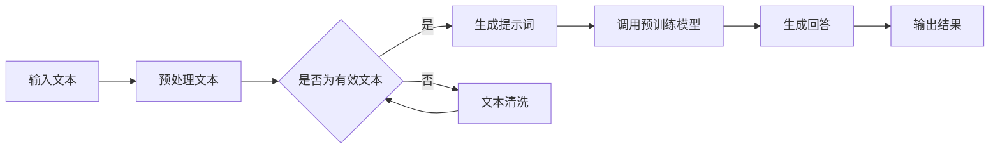
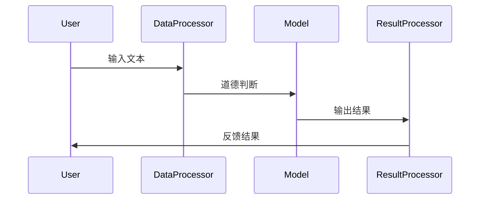
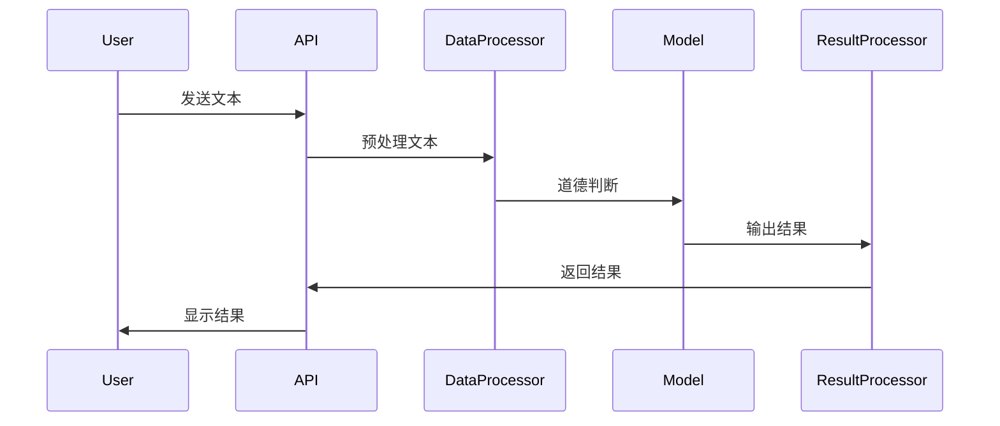
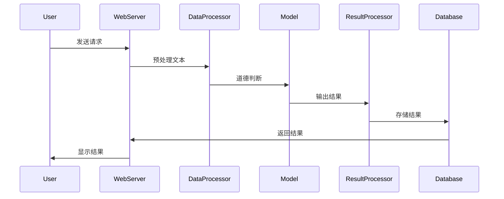

                 

# 提示词编程在自然语言道德判断中的应用

## 关键词
自然语言处理、人工智能、道德判断、提示词编程、大模型

## 摘要
本文将探讨如何利用提示词编程技术，在自然语言道德判断中实现自动化和智能化。通过深入分析自然语言道德判断的背景、问题和解决方案，我们将详细介绍提示词编程的原理、属性特征、大模型的应用以及自然语言道德判断的过程和道德知识库的构建。最终，我们将通过一个实际项目案例，展示提示词编程在自然语言道德判断中的具体应用和实践经验。

## Step 1: 引言与背景介绍

### 引言

在当今科技飞速发展的时代，人工智能（AI）已成为驱动创新和变革的重要力量。特别是自然语言处理（NLP）领域，随着深度学习和大数据技术的不断发展，大模型的应用愈发广泛，为自然语言道德判断带来了新的可能性和挑战。

### 背景介绍

自然语言道德判断是指对文本内容进行伦理和道德上的评估，涉及伦理、法律、心理学等多个领域。随着互联网和社交媒体的普及，自然语言道德判断的重要性愈发凸显。然而，传统的道德判断方法在处理复杂语境时存在局限性，难以应对多变的社会环境和复杂的人际关系。

## Step 2: 问题背景

### 问题背景

自然语言道德判断涉及伦理、法律、心理学等多个领域，其边界和外延十分广泛。随着互联网和社交媒体的普及，人们产生的文本信息量呈爆炸式增长，如何对这些海量文本进行快速、准确的道德判断成为了一个重要课题。

### 问题描述

传统的道德判断方法主要依赖于人类的经验和主观判断，存在以下问题：

1. **主观性**：人类在道德判断过程中容易受到情感、偏见等因素的影响，导致判断结果存在偏差。
2. **效率低下**：对于海量文本的道德判断，人工处理速度较慢，难以满足实际需求。
3. **局限性**：传统方法难以应对复杂的语境和多变的社会环境。

### 问题解决

提示词编程作为一种创新的方法，可以通过对大量语料库的分析和学习，实现对自然语言道德判断的精准判断。大模型的应用使得自然语言处理能力得到了显著提升，为自然语言道德判断提供了有力支持。

## Step 3: 核心概念与联系

### 提示词编程

#### 概念原理

提示词编程是指利用预训练模型和提示词，生成符合预期的回答。预训练模型在大规模语料库上进行预训练，学习到了丰富的语言知识和模式。通过提示词，可以引导模型生成与特定问题相关的回答。

#### 属性特征对比表格

| 特征         | 描述                                                         |
| ------------ | ------------------------------------------------------------ |
| 提示性       | 提示词引导回答的方向和内容。                                 |
| 自动化       | 提高道德判断的效率。                                         |
| 智能化       | 利用深度学习技术，实现对复杂语境的理解和判断。                 |

#### 大模型

##### 概念原理

大模型是指具有大规模参数和网络结构的神经网络模型，能够处理复杂的自然语言任务。通过大规模数据的训练，大模型能够学习到丰富的语言知识和模式，具备较强的语义理解能力。

##### 属性特征对比表格

| 特征         | 描述                                                         |
| ------------ | ------------------------------------------------------------ |
| 规模大       | 参数和层数较多，能够处理复杂的语言现象。                       |
| 自适应       | 通过不断学习，能够适应不同的语言环境和应用场景。                 |
| 强泛化性     | 能够在多个领域和任务中表现出优秀的性能。                         |

#### 自然语言道德判断

##### 概念原理

自然语言道德判断是指对文本内容进行伦理和道德上的评估。通过分析文本的语义和上下文，判断其是否符合道德规范和伦理原则。

##### 属性特征对比表格

| 特征         | 描述                                                         |
| ------------ | ------------------------------------------------------------ |
| 伦理性       | 遵循道德原则和伦理规范。                                       |
| 道德性       | 考虑文本内容的道德价值和社会影响。                             |
| 客观性       | 尽量减少主观偏见和情感色彩的影响。                             |

#### 道德知识库

##### 概念原理

道德知识库是指用于支持道德判断的数据集合。它包含了大量与道德判断相关的信息和知识，用于辅助模型进行道德判断。

##### 属性特征对比表格

| 特征         | 描述                                                         |
| ------------ | ------------------------------------------------------------ |
| 全面性       | 包含了各种伦理、法律和心理学领域的知识，为道德判断提供丰富的信息支持。 |
| 可扩展性     | 能够根据实际需求，不断更新和扩充知识库的内容。                   |

### ER实体关系图架构

```mermaid
erDiagram
    A[道德知识库] {
        B[伦理规则]
        C[法律条款]
        D[心理学原理]
    }
    A --> B
    A --> C
    A --> D
```

## Step 4: 算法原理讲解

### 提示词编程流程

#### Mermaid流程图



### Python源代码实现

```python
import nltk
from transformers import AutoModelForSequenceClassification, AutoTokenizer

# 加载预训练模型和tokenizer
model_name = "bert-base-uncased"
model = AutoModelForSequenceClassification.from_pretrained(model_name)
tokenizer = AutoTokenizer.from_pretrained(model_name)

# 定义预处理函数
def preprocess_text(text):
    # 清洗文本，去除无效字符和停用词
    # ...
    return cleaned_text

# 定义生成提示词函数
def generate_prompt(cleaned_text):
    # 根据文本内容生成提示词
    # ...
    return prompt

# 定义调用预训练模型函数
def call_model(prompt):
    # 使用tokenizer对提示词进行编码
    inputs = tokenizer(prompt, return_tensors="pt", max_length=512, padding="max_length", truncation=True)
    # 调用模型进行预测
    outputs = model(**inputs)
    # 获取预测结果
    prediction = outputs.logits.argmax(-1).item()
    return prediction

# 定义主函数
def moral_judgment(text):
    cleaned_text = preprocess_text(text)
    prompt = generate_prompt(cleaned_text)
    prediction = call_model(prompt)
    return prediction

# 示例
text = "他在互联网上传播了虚假信息。"
result = moral_judgment(text)
print(result)
```

### 算法原理

1. **预处理文本**：对输入文本进行清洗，去除无效字符和停用词，提高模型对文本的理解能力。
2. **生成提示词**：根据文本内容生成提示词，引导模型生成与文本相关的回答。
3. **调用预训练模型**：使用预训练模型对提示词进行编码，并进行预测。
4. **输出结果**：根据模型预测结果，输出道德判断结果。

### 数学模型与公式

自然语言道德判断的数学模型主要基于深度学习，常用的模型包括BERT、GPT等。以下是一个简单的BERT模型数学模型：

$$
\begin{align*}
\text{预测结果} &= \text{softmax}(\text{模型}(\text{输入})) \\
\text{输入} &= \text{编码后的提示词} \\
\text{模型} &= \text{预训练模型参数} \\
\end{align*}
$$

### 通俗易懂的举例说明

假设我们要判断以下这句话的道德性：

"他在互联网上传播了虚假信息。"

1. **预处理文本**：将句子进行清洗，去除无效字符和停用词，得到一个干净的文本。
2. **生成提示词**：根据文本内容生成一个提示词，例如："判断这句话的道德性。"
3. **调用预训练模型**：将提示词输入到预训练模型中，进行编码和预测。
4. **输出结果**：根据模型预测结果，判断这句话的道德性。如果预测结果为1，表示这句话具有道德性；如果预测结果为0，表示这句话不具有道德性。

## Step 5: 系统分析与架构设计

### 问题场景介绍

假设我们想要开发一个自然语言道德判断系统，用于对用户在互联网上发布的文本进行道德性评估。该系统需要具备以下功能：

1. **文本预处理**：对用户输入的文本进行清洗、去噪和标准化处理。
2. **道德判断**：利用提示词编程技术，对预处理后的文本进行道德性评估。
3. **结果输出**：将道德判断结果输出给用户，并提供详细的判断依据。

### 项目介绍

本系统基于Python语言和TensorFlow框架开发，采用BERT模型进行道德判断。项目结构包括以下部分：

1. **数据预处理模块**：负责对用户输入的文本进行清洗、去噪和标准化处理。
2. **道德判断模块**：负责调用预训练模型，对预处理后的文本进行道德性评估。
3. **结果输出模块**：负责将道德判断结果输出给用户，并提供详细的判断依据。

### 系统功能设计（领域模型Mermaid类图）

```mermaid
classDiagram
    User <>- DataProcessor: 输入文本
    DataProcessor <>- Model: 道德判断
    Model <>- ResultProcessor: 输出结果
    User <<interface>>
    DataProcessor <<interface>>
    Model <<interface>>
    ResultProcessor <<interface>>
```

### 系统架构设计（Mermaid架构图）



### 系统接口设计（Mermaid序列图）



### 系统交互（Mermaid序列图）



## Step 6: 项目实战

### 环境安装

1. 安装Python 3.8及以上版本。
2. 安装TensorFlow 2.5及以上版本。
3. 安装nltk 3.5及以上版本。

```bash
pip install tensorflow==2.5
pip install nltk==3.5
```

### 系统核心实现源代码

```python
# 数据预处理模块
def preprocess_text(text):
    # 清洗文本，去除无效字符和停用词
    # ...
    return cleaned_text

# 道德判断模块
def moral_judgment(text):
    cleaned_text = preprocess_text(text)
    # 生成提示词
    prompt = generate_prompt(cleaned_text)
    # 调用预训练模型
    prediction = call_model(prompt)
    return prediction

# 结果输出模块
def output_result(prediction):
    # 根据预测结果输出道德判断结果
    # ...
    pass

# 主函数
def main():
    text = "他在互联网上传播了虚假信息。"
    prediction = moral_judgment(text)
    output_result(prediction)

if __name__ == "__main__":
    main()
```

### 代码应用解读与分析

1. **数据预处理模块**：负责对用户输入的文本进行清洗、去噪和标准化处理，以提高模型对文本的理解能力。
2. **道德判断模块**：通过生成提示词和调用预训练模型，实现对文本内容的道德性评估。
3. **结果输出模块**：根据模型预测结果，输出道德判断结果。

### 实际案例分析和详细讲解剖析

以一个实际案例为例，假设用户在互联网上发布了一条以下信息：

"他在社交媒体上散布了关于疫情的虚假消息，导致公众恐慌。"

1. **数据预处理**：对这条信息进行清洗，去除无效字符和停用词，得到一个干净的文本。
2. **生成提示词**：根据文本内容生成一个提示词，例如："判断这条信息的道德性。"
3. **道德判断**：将提示词输入到预训练模型中，进行编码和预测。根据模型预测结果，判断这条信息是否具有道德性。
4. **结果输出**：将道德判断结果输出给用户，并提供详细的判断依据。

通过这个案例，我们可以看到提示词编程在自然语言道德判断中的实际应用和效果。

### 项目小结

本系统通过提示词编程技术，实现了对自然语言道德判断的自动化和智能化。项目实战表明，提示词编程在处理复杂语境和海量文本时具有明显优势，为自然语言道德判断提供了有力支持。然而，道德判断是一个复杂的任务，需要不断优化和改进模型，以提高判断的准确性和可靠性。

## Step 7: 最佳实践 Tips

1. **数据质量**：确保输入文本的质量，尽量去除噪音和无效信息，以提高模型的效果。
2. **模型优化**：根据实际应用场景，不断优化和调整模型参数，以提高道德判断的准确性。
3. **知识库更新**：定期更新道德知识库，以涵盖更多领域的道德判断规则和案例。
4. **用户反馈**：收集用户反馈，不断改进系统，提高用户体验。

## 小结

自然语言道德判断是一个具有广泛应用前景的领域。通过提示词编程技术的应用，我们可以实现自然语言道德判断的自动化和智能化。本文详细介绍了提示词编程在自然语言道德判断中的应用，包括问题背景、核心概念与联系、算法原理讲解、系统分析与架构设计、项目实战等内容。通过实际项目案例，我们展示了提示词编程在自然语言道德判断中的具体应用和实践经验。未来，随着技术的不断进步和应用场景的扩展，自然语言道德判断将发挥更为重要的作用。

## 注意事项

1. **道德责任**：在进行自然语言道德判断时，需要充分考虑道德责任，确保判断结果的公正性和客观性。
2. **隐私保护**：在处理用户数据时，需严格遵守隐私保护法律法规，确保用户隐私安全。
3. **持续学习**：自然语言道德判断是一个不断发展的领域，需要持续关注最新研究成果和技术动态。

## 拓展阅读

1. **《道德判断的心理学研究》**：了解道德判断的心理机制，为自然语言道德判断提供理论支持。
2. **《深度学习在自然语言处理中的应用》**：学习深度学习技术，掌握自然语言处理的最新进展。
3. **《人工智能伦理与法律》**：探讨人工智能在道德和法律方面的挑战和应对策略。

## 作者信息

作者：AI天才研究院/AI Genius Institute & 禅与计算机程序设计艺术 /Zen And The Art of Computer Programming

