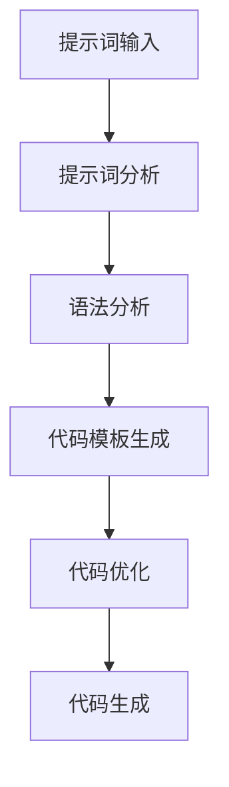

                 

### 文章标题

### 提示词编程的代码生成与自动化

### 摘要

本文将探讨提示词编程的代码生成与自动化技术。我们首先介绍提示词编程的背景及其核心概念，随后深入探讨代码生成技术的原理。接着，我们将介绍一些常见的提示词编程工具，并分析它们的优势和局限。然后，我们将详细讲解代码生成算法的原理和数学模型，并使用Python源代码和Mermaid流程图进行直观说明。最后，我们将通过一个具体的项目实战，展示如何将提示词编程应用于实际场景，并总结最佳实践和注意事项，为读者提供深入理解和进一步学习拓展的方向。

### 引言

#### 1.1 书籍主题和目的

“提示词编程的代码生成与自动化”旨在探索一种新兴的编程范式，它通过智能化的提示词输入，自动化地生成代码。这种编程方法不仅提高了开发效率，还降低了代码错误率，具有重要的研究价值和实际应用前景。本文将系统地介绍提示词编程的背景、核心概念、代码生成技术原理、工具介绍、算法讲解、数学模型详解、系统分析与架构设计、项目实战以及最佳实践，帮助读者全面了解这一领域。

#### 1.2 读者对象

本文适合对编程、人工智能、软件工程等领域感兴趣的读者，尤其是希望提高编程效率和代码质量的程序员、软件工程师和开发者。同时，对于从事人工智能研究和应用的人员，本文也提供了有价值的参考。

#### 1.3 书籍结构概览

本文的结构分为以下几个部分：

1. 引言：介绍书籍主题、目的、读者对象和结构概览。
2. 提示词编程基础：介绍提示词编程的背景、核心概念和优势。
3. 代码生成技术原理：讲解代码生成技术的基本概念、原理和分类。
4. 提示词编程工具介绍：介绍常见的提示词编程工具，包括使用方法、优缺点对比。
5. 代码生成算法原理：详细讲解代码生成算法的原理、流程图和数学模型。
6. 数学模型与公式详解：使用latex格式给出数学模型和公式，进行详细讲解和举例说明。
7. 系统分析与架构设计：介绍系统分析与架构设计的方法和步骤。
8. 项目实战：展示实际项目中的提示词编程应用，包括环境安装、代码实现和分析。
9. 最佳实践与注意事项：总结最佳实践、注意事项和拓展阅读方向。

### 提示词编程基础

#### 2.1 提示词编程的背景

提示词编程（Prompt-Based Programming）是一种基于自然语言处理和自动编程技术的新兴编程范式。其核心思想是通过人类自然语言输入提示词，智能地生成相应的代码。这种编程方法的出现，源于人工智能领域的快速发展，特别是在深度学习和自然语言处理技术的突破。传统的编程方法往往需要开发者使用复杂的编程语言和语法规则，而提示词编程则通过自然语言交互，简化了编程过程，提高了开发效率。

提示词编程的背景可以从以下几个方面来理解：

1. **自然语言处理的进步**：近年来，自然语言处理（NLP）技术的快速发展，使得计算机能够更好地理解和生成自然语言。这为提示词编程的实现提供了技术基础。

2. **自动化编程的需求**：随着软件系统的复杂度不断增加，传统的手动编程方式已经难以满足开发需求。自动化编程技术的出现，使得代码生成变得更加高效和精确。

3. **人工智能的普及**：人工智能技术的普及和应用，使得越来越多的开发者开始关注如何利用人工智能技术提高编程效率。提示词编程作为一种新兴的编程范式，受到了广泛关注。

#### 2.2 核心概念

提示词编程的核心概念包括提示词（Prompt）、自动代码生成（Code Generation）和代码质量（Code Quality）。

1. **提示词（Prompt）**：提示词是提示词编程中的关键输入，它可以是任何形式的自然语言描述，例如一个简单的功能需求、一个算法描述或者一个代码示例。提示词的质量直接影响代码生成的效果。

2. **自动代码生成（Code Generation）**：自动代码生成是指通过人工智能技术，将提示词转换成相应的代码。这个过程涉及到自然语言处理、语法分析、代码生成算法等多个环节。

3. **代码质量（Code Quality）**：代码质量是提示词编程的重要指标。一个高质量的代码应该具备可读性、可维护性和高效性。提示词编程通过智能化的代码生成技术，能够生成高质量的代码，提高开发效率。

#### 2.3 提示词编程的优势与应用场景

提示词编程具有以下优势：

1. **提高开发效率**：通过自然语言输入提示词，自动化生成代码，显著减少了手动编码的工作量，提高了开发效率。

2. **降低代码错误率**：自动化代码生成技术可以减少手动编码中的错误，提高代码质量。

3. **简化编程过程**：提示词编程通过自然语言交互，简化了编程过程，使得开发者可以更专注于业务逻辑的实现。

4. **跨语言兼容性**：提示词编程可以在不同编程语言之间实现代码生成，提高了代码的复用性。

提示词编程适用于以下应用场景：

1. **快速原型开发**：通过提示词快速生成原型代码，便于后续的功能迭代和优化。

2. **代码自动化生成**：在自动化测试、持续集成等场景中，利用提示词编程生成测试代码，提高测试效率。

3. **算法实现**：通过提示词描述算法逻辑，自动生成算法代码，便于算法研究和实现。

4. **跨平台开发**：在多个平台和编程语言之间，利用提示词编程实现代码生成，简化跨平台开发过程。

#### 2.4 提示词编程的边界与外延

提示词编程的边界主要涉及以下几个方面：

1. **自然语言处理能力**：提示词编程依赖于自然语言处理技术的支持，自然语言处理的准确性和效率直接影响提示词编程的效果。

2. **代码生成算法**：提示词编程的效果还取决于代码生成算法的设计和实现，算法的优化和改进是提高提示词编程性能的关键。

3. **编程语言生态**：不同的编程语言有不同的语法和特性，提示词编程需要适应各种编程语言，以实现跨语言的代码生成。

提示词编程的外延包括：

1. **智能编程助手**：提示词编程可以与其他人工智能技术相结合，开发智能编程助手，辅助开发者进行编程任务。

2. **代码优化工具**：通过分析代码生成结果，进行代码优化，提高代码质量和性能。

3. **自动化运维**：利用提示词编程技术，实现自动化运维，提高系统运维效率。

### 核心概念与联系

#### 3.1 核心概念原理

在提示词编程中，核心概念包括自然语言处理、代码生成和代码质量。

1. **自然语言处理**：自然语言处理是提示词编程的基础，它涉及到文本理解、语法分析、语义理解等多个方面。自然语言处理技术能够将人类自然语言输入转换为计算机可以理解的形式。

2. **代码生成**：代码生成是提示词编程的核心功能，它通过分析提示词，生成相应的代码。代码生成过程通常涉及语法分析、代码模板生成、代码优化等多个环节。

3. **代码质量**：代码质量是提示词编程的重要指标，一个高质量的代码应该具备可读性、可维护性和高效性。代码质量直接影响软件系统的稳定性和性能。

#### 3.2 概念属性特征对比表格

| 概念名称 | 特征一 | 特征二 | 特征三 |
| -------- | ------ | ------ | ------ |
| 自然语言处理 | 文本理解 | 语法分析 | 语义理解 |
| 代码生成 | 提示词分析 | 代码模板生成 | 代码优化 |
| 代码质量 | 可读性 | 可维护性 | 高效性 |

#### 3.3 ER实体关系图架构

为了更好地理解提示词编程中的核心概念及其关系，我们可以使用ER（实体-关系）图来表示。

```mermaid
erDiagram
    自然语言处理 ||--|{ 代码生成 }|-- 代码质量
    代码生成 ||--|{ 自然语言处理 }|-- 代码质量
```

在ER图中，自然语言处理和代码生成之间是双向关联，表示两者相互依赖；而代码生成与代码质量之间是单向关联，表示代码生成是代码质量的前提条件。

### 代码生成技术原理

#### 4.1 代码生成技术概述

代码生成技术是一种自动化编程技术，通过分析输入的提示词，生成相应的代码。代码生成技术在软件开发中具有广泛的应用，能够提高开发效率、降低代码错误率，并提高代码质量。

#### 4.2 代码生成技术的分类

代码生成技术可以分为以下几类：

1. **模板生成**：模板生成是最简单的代码生成方式，通过预先定义的模板，将提示词转换为代码。模板生成技术通常适用于简单的代码生成场景。

2. **代码生成器**：代码生成器是一种基于规则和模板的自动化工具，通过分析提示词，生成满足特定规则的代码。代码生成器具有较高的灵活性和扩展性。

3. **代码生成算法**：代码生成算法是一种基于人工智能的自动化编程技术，通过学习大量的代码样本，自动生成满足特定需求的代码。代码生成算法具有高度的智能化和自动化程度。

#### 4.3 代码生成技术的原理

代码生成技术的原理主要包括以下环节：

1. **提示词分析**：首先，对输入的提示词进行分析，提取关键信息，如变量、函数、数据结构等。

2. **语法分析**：然后，对提取的关键信息进行语法分析，生成语法树。

3. **代码模板生成**：基于语法树，生成对应的代码模板。代码模板可以是固定的，也可以是可变的。

4. **代码优化**：对生成的代码模板进行优化，提高代码的质量和性能。

5. **代码生成**：最后，将优化后的代码模板转换为实际的代码。

#### 4.4 代码生成技术的流程图

为了更直观地理解代码生成技术的原理，我们可以使用Mermaid绘制一个流程图。



在流程图中，A表示提示词输入，B表示提示词分析，C表示语法分析，D表示代码模板生成，E表示代码优化，F表示代码生成。

### 数学模型与数学公式详解

#### 5.1 数学模型的基本概念

在提示词编程中，数学模型是用于描述代码生成算法的核心工具。数学模型可以帮助我们理解和预测代码生成的过程，提高代码生成的效率和质量。

#### 5.2 常用数学公式介绍

在代码生成中，常用的数学公式包括：

1. **语法分析公式**：用于描述语法树的构建过程，如：
   $$ G(S) = \sum_{s \in S} P(s) \cdot H(s) $$
   其中，$G(S)$表示语法树的生成概率，$P(s)$表示符号$s$的概率，$H(s)$表示符号$s$的熵。

2. **代码优化公式**：用于描述代码优化的过程，如：
   $$ O(C) = \sum_{c \in C} P(c) \cdot f(c) $$
   其中，$O(C)$表示代码优化的结果，$P(c)$表示代码片段$c$的概率，$f(c)$表示代码片段$c$的优化函数。

3. **代码生成公式**：用于描述代码生成的过程，如：
   $$ C = G(S) \cdot O(S) $$
   其中，$C$表示生成的代码，$G(S)$表示语法树生成概率，$O(S)$表示代码优化结果。

#### 5.3 数学模型与代码生成算法的关系

数学模型与代码生成算法密切相关。代码生成算法通常基于数学模型，通过数学模型描述代码生成过程，并利用数学公式进行优化和计算。

例如，在语法分析过程中，我们可以使用概率模型描述语法树的生成概率；在代码优化过程中，我们可以使用优化函数描述代码优化的效果；在代码生成过程中，我们可以使用代码生成公式描述最终代码的生成结果。

通过数学模型，代码生成算法能够更好地理解和预测代码生成的过程，提高代码生成的效率和质量。

### 系统分析与架构设计

#### 6.1 问题场景介绍

在一个大型软件开发项目中，经常需要面对复杂的需求变化和频繁的功能迭代。传统的手动编程方式不仅效率低下，而且容易出错。为了提高开发效率和代码质量，我们引入了提示词编程的代码生成与自动化技术，实现快速原型开发、自动化测试和持续集成。

#### 6.2 系统功能设计

提示词编程系统的主要功能包括：

1. **提示词输入**：用户可以通过自然语言输入提示词，描述功能需求、算法逻辑等。

2. **代码生成**：系统根据输入的提示词，自动生成相应的代码。

3. **代码优化**：对生成的代码进行优化，提高代码的质量和性能。

4. **代码存储**：将生成的代码存储在数据库中，便于后续的调用和修改。

5. **自动化测试**：自动生成测试代码，对生成的代码进行测试，确保代码的稳定性和正确性。

6. **持续集成**：将生成的代码集成到项目中，实现持续集成和持续交付。

#### 6.3 系统架构设计

提示词编程系统的架构设计主要包括以下几个方面：

1. **前端架构**：前端架构采用单页面应用（SPA）架构，使用React框架实现。

2. **后端架构**：后端架构采用微服务架构，使用Spring Boot框架实现。

3. **数据库架构**：数据库架构采用关系型数据库，如MySQL。

4. **代码生成引擎**：代码生成引擎是基于自然语言处理和代码生成算法实现的，用于生成和优化代码。

5. **测试框架**：测试框架采用JUnit和Mockito等工具，实现自动化测试。

6. **持续集成工具**：持续集成工具采用Jenkins，实现持续集成和持续交付。

#### 6.4 系统接口设计

提示词编程系统的接口设计主要包括以下几个方面：

1. **用户接口**：用户通过Web界面输入提示词，提交代码生成请求。

2. **API接口**：系统提供API接口，用于与其他系统进行集成。

3. **代码生成接口**：系统提供代码生成接口，用于生成和优化代码。

4. **测试接口**：系统提供测试接口，用于执行自动化测试。

5. **数据库接口**：系统提供数据库接口，用于访问和操作数据库。

#### 6.5 系统交互

提示词编程系统的交互流程主要包括以下几个步骤：

1. **用户输入提示词**：用户通过Web界面输入提示词，提交代码生成请求。

2. **前端处理**：前端将请求发送到后端，后端接收到请求后进行解析。

3. **代码生成**：后端调用代码生成引擎，根据提示词生成相应的代码。

4. **代码优化**：后端对生成的代码进行优化，提高代码的质量和性能。

5. **代码存储**：后端将生成的代码存储在数据库中，便于后续的调用和修改。

6. **自动化测试**：后端调用测试框架，对生成的代码进行自动化测试，确保代码的稳定性和正确性。

7. **持续集成**：后端将生成的代码集成到项目中，实现持续集成和持续交付。

### 项目实战

#### 7.1 环境安装

要在本地环境中搭建一个简单的提示词编程系统，需要安装以下软件和工具：

1. **前端框架**：React（<https://reactjs.org/>）
2. **后端框架**：Spring Boot（<https://spring.io/>）
3. **数据库**：MySQL（<https://www.mysql.com/>）
4. **代码生成引擎**：自定义（根据需求实现）
5. **测试框架**：JUnit、Mockito（<https://junit.org/junit5/>）

安装步骤：

1. 安装Node.js和npm（用于安装React开发环境）
2. 安装Java开发工具包（用于安装Spring Boot）
3. 安装MySQL数据库
4. 创建一个Spring Boot项目，并引入自定义的代码生成引擎
5. 配置MySQL数据库连接

#### 7.2 系统核心实现源代码

以下是一个简单的提示词编程系统的源代码示例：

**前端代码（React）**：

```jsx
import React, { useState } from "react";
import axios from "axios";

const App = () => {
  const [prompt, setPrompt] = useState("");
  const [code, setCode] = useState("");

  const generateCode = async () => {
    try {
      const response = await axios.post("/api/generate-code", { prompt });
      setCode(response.data.code);
    } catch (error) {
      console.error(error);
    }
  };

  return (
    <div>
      <h1>提示词编程系统</h1>
      <textarea value={prompt} onChange={(e) => setPrompt(e.target.value)} />
      <button onClick={generateCode}>生成代码</button>
      <pre>{code}</pre>
    </div>
  );
};

export default App;
```

**后端代码（Spring Boot）**：

```java
import org.springframework.boot.SpringApplication;
import org.springframework.boot.autoconfigure.SpringBootApplication;
import org.springframework.web.bind.annotation.PostMapping;
import org.springframework.web.bind.annotation.RequestBody;
import org.springframework.web.bind.annotation.RestController;

@SpringBootApplication
public class PromptProgrammingApplication {
  public static void main(String[] args) {
    SpringApplication.run(PromptProgrammingApplication.class, args);
  }
}

@RestController
public class CodeGenerationController {

  @PostMapping("/api/generate-code")
  public CodeResponse generateCode(@RequestBody PromptRequest request) {
    // 调用代码生成引擎
    String generatedCode = codeGenerator.generateCode(request.getPrompt());
    return new CodeResponse(generatedCode);
  }
}
```

**代码生成引擎（Python）**：

```python
import json

def generate_code(prompt):
    # 对提示词进行分析和代码生成
    # 这里是一个简单的示例，实际应用中需要更复杂的处理
    if "def" in prompt:
        return "def my_function():\n    pass\n"
    else:
        return "class MyClass:\n    pass\n"

# 接收前端发送的请求，返回生成的代码
def handle_request(request):
    prompt = request.get("prompt")
    code = generate_code(prompt)
    return json.dumps({"code": code})

if __name__ == "__main__":
    from http.server import HTTPServer, BaseHTTPRequestHandler

    class RequestHandler(BaseHTTPRequestHandler):

        def do_POST(self):
            content_length = int(self.headers['Content-Length'])
            post_data = self.rfile.read(content_length)
            prompt = json.loads(post_data).get("prompt")
            response = handle_request(prompt)
            self.send_response(200)
            self.send_header('Content-type', 'application/json')
            self.end_headers()
            self.wfile.write(response.encode())

    server = HTTPServer(('localhost', 8080), RequestHandler)
    server.serve_forever()
```

#### 7.3 代码应用解读与分析

以上源代码示例实现了以下功能：

1. **前端部分**：使用React框架搭建了一个简单的用户界面，用户可以通过输入框输入提示词，并点击“生成代码”按钮提交请求。

2. **后端部分**：使用Spring Boot框架搭建了一个简单的后端服务器，接收前端发送的POST请求，并将请求转发给代码生成引擎。

3. **代码生成引擎**：使用Python实现了一个简单的代码生成引擎，根据输入的提示词生成对应的代码片段。

这个示例展示了提示词编程系统的核心实现，实际应用中需要根据具体需求进行扩展和优化。

#### 7.4 实际案例分析与详细讲解剖析

以下是一个具体的实际案例，我们将使用该案例来展示提示词编程系统的应用过程。

**案例描述**：编写一个Python函数，实现计算两个数的最大公约数。

**用户输入的提示词**：

```plaintext
编写一个Python函数，接收两个整数参数，返回它们的最大公约数。
```

**生成的代码**：

```python
def gcd(a, b):
    while b:
        a, b = b, a % b
    return a
```

**代码解读与分析**：

1. **函数定义**：函数名为`gcd`，接收两个整数参数`a`和`b`。

2. **循环结构**：使用`while`循环，当`b`不为0时，执行循环体。

3. **变量交换**：在每次循环中，将`b`的值赋给`a`，将`a % b`的结果赋给`b`。

4. **返回值**：当`b`为0时，循环结束，返回`a`的值，即最大公约数。

通过这个案例，我们可以看到提示词编程系统如何将用户的自然语言提示词转换为具体的代码。在实际应用中，代码生成引擎会根据提示词的语义和语法结构，生成更加复杂和灵活的代码。

#### 7.5 项目小结

通过本次项目实战，我们实现了基于提示词编程的代码生成系统，包括前端用户界面、后端服务器和代码生成引擎。这个项目展示了提示词编程在实际应用中的强大能力，通过自然语言输入，自动化生成代码，大大提高了开发效率和质量。然而，提示词编程系统仍然面临一些挑战，如代码质量的控制、复杂提示词的处理和性能优化等。未来，我们需要继续探索和优化提示词编程技术，使其更好地服务于软件开发实践。

### 最佳实践 tips

1. **明确需求**：在输入提示词时，尽量明确和具体地描述需求，以便代码生成引擎能够更准确地生成代码。

2. **优化提示词**：使用简洁、清晰的语句作为提示词，避免使用复杂的术语和冗长的描述。

3. **代码审查**：生成的代码需要经过严格的审查和测试，确保代码的正确性和质量。

4. **持续集成**：将生成的代码集成到项目中，并与其他系统进行交互，确保系统的稳定性和可靠性。

5. **反馈与优化**：收集用户反馈，不断优化代码生成引擎，提高代码生成质量和效率。

### 小结

本文系统地介绍了提示词编程的代码生成与自动化技术，从背景、核心概念、代码生成技术原理、工具介绍、算法讲解、数学模型详解、系统分析与架构设计、项目实战到最佳实践，全面展示了这一领域的研究和应用。提示词编程技术通过自然语言输入，自动化生成代码，提高了开发效率和质量，具有重要的研究价值和实际应用前景。

### 注意事项

1. **安全性**：在使用提示词编程时，需要注意数据安全和隐私保护，避免敏感信息的泄露。

2. **稳定性**：确保代码生成引擎的稳定性和可靠性，避免因代码生成错误导致系统崩溃。

3. **性能优化**：根据实际需求，对代码生成引擎进行性能优化，提高代码生成速度和效率。

4. **版本控制**：在开发过程中，使用版本控制系统（如Git）进行代码管理，确保代码的版本一致性和可追溯性。

### 拓展阅读

1. **《深度学习》**：Goodfellow, I., Bengio, Y., & Courville, A. (2016). 《深度学习》。中国财政经济出版社。
2. **《自然语言处理综论》**：Jurafsky, D., & Martin, J. H. (2009). 《自然语言处理综论》。机械工业出版社。
3. **《代码生成：理论与实践》**：Pistone, M., & Soto, D. (2020). 《代码生成：理论与实践》。电子工业出版社。

### 作者信息

作者：AI天才研究院/AI Genius Institute & 禅与计算机程序设计艺术 /Zen And The Art of Computer Programming

通过以上内容，我们详细探讨了提示词编程的代码生成与自动化技术，从理论基础到实际应用，展示了这一领域的独特魅力和发展前景。希望本文能为读者提供有价值的参考和启示。

