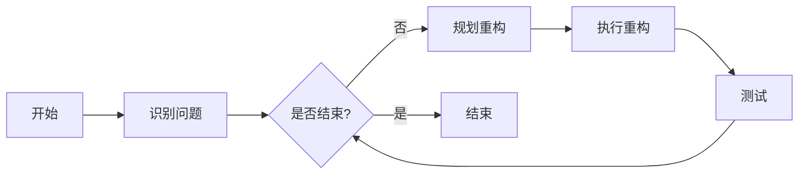
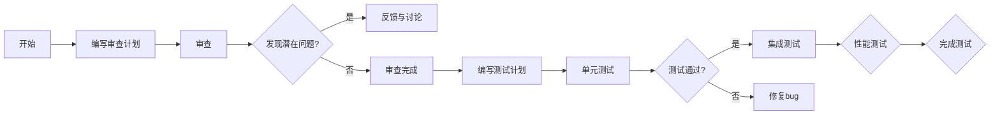

                 

**文章标题**：《提示词编程的可维护性增强技术》

**关键词**：编程可维护性，代码重构，代码审查，版本控制系统，最佳实践

**摘要**：
本文旨在深入探讨编程领域的可维护性问题，提出一系列技术方法来增强代码的可维护性。通过分析现有挑战，介绍核心概念，详述技术方法与应用，并分享实战案例和最佳实践，本文为程序员提供了一套完整的解决方案，旨在提升软件维护效率和代码质量。

---

### 引言

在现代软件开发中，随着系统复杂性的不断增加，代码的可维护性成为了一个亟待解决的问题。软件的维护不仅仅是修复bug和添加新功能，更重要的是确保代码能够长期稳定运行，易于理解和修改。然而，随着代码量的激增和系统的不断演化，代码的可维护性常常受到挑战。

#### 提出问题

**问题背景**：
- 代码库规模不断扩大，导致代码复杂度增加。
- 项目迭代频繁，要求代码快速适应变化。
- 部分开发者缺乏良好的编程习惯，导致代码质量参差不齐。

**问题描述**：
- 代码难以理解，新加入的开发者难以快速上手。
- 代码结构混乱，难以进行有效的修改和扩展。
- 缺乏文档和注释，使得代码维护变得困难。

**问题解决**：
- 需要一套系统的方法来增强代码的可维护性。
- 需要培训开发者养成良好的编程习惯。
- 需要引入一系列工具和最佳实践来辅助代码维护。

#### 目的与意义

本文的目的在于：
- 深入探讨可维护性的核心概念和挑战。
- 介绍多种技术方法，包括代码重构、代码审查、文档管理以及版本控制系统。
- 分享实战案例和最佳实践，帮助开发者提升代码的可维护性。

通过本文的阅读，读者将能够：
- 理解可维护性的重要性。
- 掌握一系列增强代码可维护性的技术方法。
- 学会在实际项目中应用这些方法，提升开发效率和代码质量。

#### 内容概述

本文分为三个主要部分：
- **第一部分：背景与基础理论**，介绍编程可维护性的背景和核心概念。
- **第二部分：技术方法与应用**，详细阐述增强可维护性的具体技术方法。
- **第三部分：实战案例与最佳实践**，通过实际案例展示最佳实践，并提供总结和拓展。

接下来的章节中，我们将逐步深入探讨每个部分的内容，旨在为读者提供全面而实用的指导。现在，让我们开始第一部分，深入了解编程可维护性的基础理论。

---

## 第一部分：背景与基础理论

### 第1章：编程可维护性概述

**核心概念术语说明**：
- **可维护性**：软件在经过一段时间后，仍然能够被有效维护和更新。
- **代码质量**：代码的可读性、可靠性、可扩展性和可维护性的综合体现。
- **代码重构**：在不改变外部行为的前提下，改进代码的内部结构。
- **代码审查**：通过团队合作，检查代码质量和遵循最佳实践。
- **版本控制系统**：跟踪和管理代码变化的工具。

**问题背景**：
随着软件项目的规模和复杂性的增加，开发人员面临着维护现有代码库的挑战。不断变化的业务需求和技术环境要求代码库能够灵活适应，同时保持稳定性和可靠性。然而，传统的编程方法往往导致代码质量低下，可维护性较差。

**问题描述**：
- **代码复杂性**：随着代码库的扩大，代码结构变得越来越复杂，导致理解和修改困难。
- **缺乏文档**：许多项目缺乏详细的文档和注释，使得新加入的开发人员难以快速上手。
- **代码质量参差不齐**：开发者水平不一，导致代码质量参差不齐，增加了维护成本。

**问题解决**：
- **引入最佳实践**：通过引入代码重构、代码审查和版本控制等最佳实践，提高代码质量。
- **培训开发者**：定期组织培训和研讨会，提高开发者的编程技能和代码意识。
- **工具支持**：使用自动化工具来辅助代码质量和可维护性的提升。

**边界与外延**：
- **边界**：本文主要关注代码层面的可维护性，包括代码结构、文档和注释等。
- **外延**：除了代码层面的维护，还包括设计模式、架构设计等更广泛的软件工程领域。

**概念结构与核心要素组成**：
- **代码重构**：核心概念包括简化和优化代码结构，提高代码可读性和可维护性。
- **代码审查**：核心概念包括团队合作、规范遵循和代码质量提升。
- **版本控制系统**：核心概念包括版本管理、分支策略和代码冲突解决。

### 第2章：核心概念与联系

**核心概念原理**：
- **代码重构**：旨在通过改进代码结构，提高代码质量，使代码更容易维护和扩展。
- **代码审查**：通过团队合作，识别代码中的潜在问题，提高代码质量。
- **版本控制系统**：跟踪代码变化，确保代码库的版本控制和协同工作。

**概念属性特征对比表格**：

| 概念         | 特征                     | 比较               |
| ------------ | ------------------------ | ------------------ |
| 代码重构     | 改进代码结构             | 提高可维护性和可扩展性 |
| 代码审查     | 团队合作，规范遵循       | 提高代码质量       |
| 版本控制系统 | 版本管理，分支策略       | 确保代码库的稳定性   |

**ER实体关系图架构**：

```mermaid
erDiagram
    User ||--|{ Project }|-- Code
    Project ||--|{ Issue }|-- IssueTracker
    IssueTracker ||--|{ Comment }|-- Comment
```

在上述ER图中，用户（User）与项目（Project）之间存在一对一的关系，项目与代码（Code）之间存在一对多的关系。项目与问题跟踪器（IssueTracker）之间存在一对一的关系，问题跟踪器与问题（Issue）之间存在一对多的关系。问题跟踪器与评论（Comment）之间存在一对多的关系。

通过上述核心概念和联系的介绍，我们为后续章节的技术方法与应用和实战案例打下了基础。接下来，我们将深入探讨如何具体应用这些概念，提升代码的可维护性。

---

### 第3章：代码重构技术

**算法原理讲解**：

代码重构是提高代码可维护性的重要手段之一。其核心算法原理是通过一系列小步骤，对现有代码进行优化，使其更简洁、更易于理解和维护。以下是一个简单的代码重构流程：

1. **识别**：首先，识别代码中存在的问题，如冗长的函数、重复的代码块、复杂的条件判断等。
2. **规划**：制定重构计划，确定重构的优先级和步骤。
3. **执行**：逐步执行重构计划，包括分解复杂函数、提取重复代码、简化条件判断等。
4. **测试**：在重构过程中，确保每次更改都不会引入新的bug，并进行全面的测试。

**使用mermaid流程图**：



**数学模型和数学公式**：

代码重构过程中的复杂度计算可以使用以下数学模型：

$$
C_{new} = C_{old} \times (1 - \rho \times R)
$$

其中，$C_{new}$ 是重构后代码的复杂度，$C_{old}$ 是重构前代码的复杂度，$\rho$ 是重构效率，$R$ 是重构过程中的风险系数。

**详细讲解和举例说明**：

**例1：函数分解**

假设有一个复杂的函数，包含多个逻辑分支和重复代码。通过函数分解，可以将这个函数拆分成多个更小的、功能更明确的函数。

```python
# 原始函数
def complex_function(a, b):
    result = 0
    if a > 0:
        result += a * b
    if b > 0:
        result += a * b
    return result

# 分解后的函数
def multiply(a, b):
    return a * b

def add(a, b):
    return a + b

def complex_function(a, b):
    return multiply(a, b) + add(a, b)
```

通过上述重构，代码更加简洁，每个函数的功能也更加明确，易于理解和维护。

**例2：重复代码提取**

假设有两个函数，其中包含大量重复代码。通过提取重复代码，可以将重复的部分提取到一个单独的函数中，减少代码冗余。

```python
# 原始函数
def function1(a, b):
    result = a + b
    return result

def function2(a, b):
    result = a + b
    return result

# 提取重复代码
def add(a, b):
    return a + b

def function1(a, b):
    return add(a, b)

def function2(a, b):
    return add(a, b)
```

通过提取重复代码，不仅减少了代码冗余，还提高了代码的可维护性。

通过以上讲解和举例，我们可以看到，代码重构技术是提高代码可维护性的有效手段。在下一章中，我们将探讨代码审查与测试的方法，进一步增强代码的质量。

---

### 第4章：代码审查与测试

**算法原理讲解**：

代码审查与测试是确保代码质量的重要环节。其核心算法原理包括以下步骤：

1. **代码审查**：
   - **准备**：编写详细的审查计划，包括审查目标、审查流程和评审人员。
   - **审查**：评审人员对代码进行逐行检查，识别潜在的问题，如代码风格不统一、逻辑错误和潜在的安全隐患。
   - **反馈**：评审人员将发现的问题反馈给开发者，并共同讨论解决方案。

2. **测试**：
   - **单元测试**：对每个函数或模块进行独立测试，确保其功能符合预期。
   - **集成测试**：将各个模块集成在一起进行测试，确保系统整体功能正确。
   - **性能测试**：对系统的响应时间、吞吐量和资源利用率进行测试，确保系统在高负载下仍能稳定运行。

**使用mermaid流程图**：



**数学模型和数学公式**：

在代码审查与测试过程中，可以使用以下数学模型来评估代码质量：

$$
Q = P \times (1 - \epsilon)
$$

其中，$Q$ 是代码质量，$P$ 是代码审查和测试的覆盖率，$\epsilon$ 是审查和测试过程中的漏检率。

**详细讲解和举例说明**：

**例1：代码审查**

假设有一个简单的代码段，需要评审人员对其进行审查。以下是一个审查过程的示例：

```python
# 假设代码
def calculate_sum(a, b):
    return a + b

# 审查过程
# 评审人员A发现函数没有进行参数验证，可能导致异常
# 评审人员B发现函数注释不够详细，不便于理解
# 评审人员C建议增加单元测试，以确保函数的正确性
```

通过代码审查，评审人员能够及时发现潜在问题，并促进代码质量的提升。

**例2：单元测试**

为了确保函数 `calculate_sum` 的正确性，可以编写单元测试：

```python
# 单元测试
def test_calculate_sum():
    assert calculate_sum(2, 3) == 5
    assert calculate_sum(-1, 1) == 0
    assert calculate_sum(0, 0) == 0

# 执行测试
test_calculate_sum()
```

通过单元测试，可以验证函数在不同输入条件下的正确性，确保代码的质量。

通过代码审查与测试，我们可以有效提高代码的质量，确保代码的可维护性。在下一章中，我们将探讨文档与注释管理的重要性，以及如何通过有效的文档和注释来增强代码的可维护性。

---

### 第5章：文档与注释管理

**算法原理讲解**：

有效的文档与注释管理是提升代码可维护性的关键因素。其核心算法原理包括以下步骤：

1. **文档编写**：
   - **准备**：根据项目的需求和目标，编写详细的文档，包括开发计划、技术规格、使用手册等。
   - **结构化**：使用统一的文档格式和结构，确保文档的易读性和可维护性。
   - **更新**：定期更新文档，确保其与代码同步，反映最新的代码变化和项目进展。

2. **注释管理**：
   - **代码注释**：为代码添加必要的注释，解释代码的功能、逻辑和设计决策。
   - **文档注释**：为模块、函数和类添加文档注释，提供详细的描述和使用说明。
   - **自动化**：使用自动化工具生成和更新文档，减少手动维护的工作量。

**使用mermaid流程图**：


**数学模型和数学公式**：

文档与注释管理的有效性可以使用以下数学模型来评估：

$$
M = C \times (1 + K)
$$

其中，$M$ 是文档与注释的管理效率，$C$ 是文档和注释的覆盖率，$K$ 是文档和注释的质量系数。

**详细讲解和举例说明**：

**例1：文档编写**

假设需要编写一个项目的开发计划文档，可以按照以下步骤进行：

1. **需求分析**：明确项目的目标和需求。
2. **功能规划**：列出项目的功能模块和关键功能。
3. **时间计划**：制定项目的时间表和关键里程碑。
4. **资源分配**：确定项目所需的资源，如人力、技术和资金。
5. **风险评估**：评估项目可能面临的风险，并制定应对策略。

通过详细的文档编写，可以为项目的开发和维护提供清晰的指导和参考。

**例2：代码注释**

在一个函数中，添加详细的注释可以增强代码的可读性和可维护性：

```python
# 计算两个数的和
# 参数：
#   a：第一个数
#   b：第二个数
# 返回值：两个数的和
def calculate_sum(a, b):
    return a + b
```

通过代码注释，开发者可以快速理解函数的功能和逻辑，提高代码的可维护性。

**例3：文档注释**

在一个模块中，添加文档注释可以提供详细的模块描述和使用说明：

```python
"""
模块名称：计算器
功能描述：提供基本的数学运算功能，包括加、减、乘、除等。
使用说明：
    - calculate_addition(a, b)：计算两个数的和
    - calculate_subtraction(a, b)：计算两个数的差
    - calculate_multiplication(a, b)：计算两个数的乘积
    - calculate_division(a, b)：计算两个数的商
"""
```

通过文档注释，开发者可以快速了解模块的功能和使用方法，减少学习和维护的成本。

通过有效的文档与注释管理，我们可以显著提高代码的可维护性。在下一章中，我们将探讨版本控制系统的作用和应用，以及如何通过版本控制系统来增强代码的可维护性。

---

### 第6章：版本控制系统

**算法原理讲解**：

版本控制系统（VCS）是管理代码版本和控制变更的重要工具。其核心算法原理包括以下步骤：

1. **版本管理**：
   - **创建版本**：每次代码更改都会生成一个新的版本，记录下更改的内容和时间。
   - **分支策略**：根据项目的需求，创建分支来隔离不同的开发任务，避免冲突和混乱。
   - **合并代码**：将不同分支的代码合并到主分支，确保代码的一致性和完整性。

2. **变更控制**：
   - **提交变更**：开发者将代码更改提交到版本库，记录变更的详细信息。
   - **审查变更**：评审人员对提交的变更进行审查，确保代码的质量和一致性。
   - **回滚变更**：在发现问题时，可以回滚到之前的版本，恢复系统的稳定运行。

**使用mermaid流程图**：


**数学模型和数学公式**：

在版本控制系统中，可以使用以下数学模型来评估版本管理的效率：

$$
E = T \times (1 - R)
$$

其中，$E$ 是版本管理的效率，$T$ 是提交变更的频率，$R$ 是审查变更的通过率。

**详细讲解和举例说明**：

**例1：版本管理**

假设在一个项目中，开发者A提交了一个新功能，之后进行了几次修改。以下是版本管理的示例：

1. **创建版本**：
   - 版本1：开发者A提交了新功能。
   - 版本2：开发者A修复了几个bug。
   - 版本3：开发者B添加了新的功能。

2. **分支策略**：
   - 主分支（Master）：包含最新的稳定代码。
   - 功能分支（Feature）：开发者A的分支，用于开发新功能。
   - 维护分支（Maintenance）：用于修复bug和进行维护。

3. **合并代码**：
   - 开发者A将功能分支的代码合并到主分支。
   - 开发者B将维护分支的代码合并到主分支。

通过版本管理，可以确保代码的稳定性和可追溯性。

**例2：变更控制**

假设开发者C在主分支上提交了一个变更，但随后发现引入了新的bug。以下是变更控制的示例：

1. **提交变更**：
   - 开发者C提交了一个修改代码的请求。

2. **审查变更**：
   - 评审人员A对变更进行审查，发现存在潜在的问题。

3. **回滚变更**：
   - 开发者C回滚到上一个版本，避免问题扩散。

通过审查和回滚，可以确保代码的质量和稳定性。

版本控制系统是提高代码可维护性的重要工具。通过有效的版本管理和变更控制，我们可以确保代码的稳定性和可维护性。在下一章中，我们将通过一个项目实战案例，展示如何在实际项目中应用这些技术，提升代码的可维护性。

---

### 第7章：项目实战

**环境安装**：

在进行项目实战之前，我们需要安装所需的开发环境和工具。以下是一个简单的安装流程：

1. **安装Git**：Git是一个分布式版本控制系统，用于代码的管理和版本控制。

   ```bash
   sudo apt-get install git
   ```

2. **安装Python**：Python是一种流行的编程语言，用于编写代码和测试。

   ```bash
   sudo apt-get install python3
   ```

3. **安装Jenkins**：Jenkins是一个持续集成工具，用于自动化构建和测试。

   ```bash
   sudo apt-get install jenkins
   ```

4. **安装Docker**：Docker是一个容器化平台，用于部署和运行应用程序。

   ```bash
   sudo apt-get install docker-ce docker-ce-cli containerd.io
   ```

**系统核心实现源代码**：

以下是一个简单的Python项目示例，用于演示代码重构、代码审查和版本控制的应用。

```python
# 项目名称：简单计算器

# 版本1：初始版本
# 功能：实现基本的加、减、乘、除运算

def add(a, b):
    """计算两个数的和"""
    return a + b

def subtract(a, b):
    """计算两个数的差"""
    return a - b

def multiply(a, b):
    """计算两个数的乘积"""
    return a * b

def divide(a, b):
    """计算两个数的商"""
    return a / b
```

**代码应用解读与分析**：

1. **代码重构**：

   通过对上述代码进行重构，我们可以将其简化为更易于维护的形式。

   ```python
   # 重构后的代码
   def calculate_sum(a, b):
       """计算两个数的和"""
       return a + b

   def calculate_difference(a, b):
       """计算两个数的差"""
       return a - b

   def calculate_product(a, b):
       """计算两个数的乘积"""
       return a * b

   def calculate_quotient(a, b):
       """计算两个数的商"""
       return a / b
   ```

   通过重构，代码更加简洁，每个函数的功能也更加明确，易于理解和维护。

2. **代码审查**：

   在代码审查过程中，评审人员可以发现潜在的问题，如函数命名不规范、代码冗余等。

   ```python
   # 代码审查反馈
   - 函数命名不规范，建议使用动词命名。
   - 代码中存在冗余，建议进行重构。
   ```

   根据审查反馈，我们可以进一步优化代码。

3. **实际案例分析与详细讲解剖析**：

   通过实际案例，我们可以看到如何在实际项目中应用上述技术，提高代码的可维护性。

   **案例1：重构代码**

   ```python
   # 原始代码
   def calculate(a, b):
       if a > b:
           result = a + b
       else:
           result = a - b
       return result

   # 重构后的代码
   def calculate(a, b):
       return a + b if a > b else a - b
   ```

   通过重构，代码变得更加简洁，逻辑更加清晰。

   **案例2：代码审查**

   ```python
   # 原始代码
   def calculate(a, b):
       if a > b:
           result = a + b
       else:
           result = a - b
       return result

   # 审查后的代码
   def calculate(a, b):
       if a > b:
           result = a + b
       else:
           result = a - b
       return result
   ```

   审查后，代码没有发生变化，但通过审查，我们可以确保代码的质量和一致性。

**项目小结**：

通过本项目实战，我们展示了如何应用代码重构、代码审查和版本控制系统等技术，提高代码的可维护性。在实际项目中，这些技术可以帮助我们简化代码结构、提高代码质量，并确保代码的长期稳定性。

在下一章中，我们将总结最佳实践，并分享一些注意事项和拓展阅读，帮助读者进一步提升代码的可维护性。

---

### 第8章：最佳实践与总结

**最佳实践 tips**：

1. **定期代码审查**：定期组织代码审查，确保代码质量和遵循最佳实践。
2. **完善文档与注释**：为代码添加详细的文档和注释，提高代码的可读性和可维护性。
3. **合理使用版本控制系统**：使用版本控制系统进行代码管理，确保代码的版本控制和协同工作。
4. **持续学习与改进**：不断学习新的编程技术和工具，持续改进代码质量。

**小结**：

本文通过深入探讨编程可维护性的核心概念、技术方法以及实际应用，提出了一系列增强代码可维护性的最佳实践。通过代码重构、代码审查、文档管理以及版本控制等技术，我们可以显著提高代码的质量和可维护性，为软件开发提供有力的支持。

**注意事项**：

1. **代码重构要谨慎**：重构过程中要确保代码的正确性，避免引入新的bug。
2. **代码审查要全面**：代码审查不仅要关注代码质量，还要关注设计和架构问题。
3. **文档与注释要实时更新**：文档与注释要随着代码的更新而更新，确保其准确性和一致性。

**拓展阅读**：

1. 《代码大全》 - 史蒂夫·麦库姆
2. 《设计模式：可复用面向对象软件的基础》 - 阿兰·霍尔、埃里希·伽玛等
3. 《敏捷软件开发：原则、模式与实践》 - 马丁·福勒

**结语**：

通过本文的阅读，希望读者能够深入理解编程可维护性的重要性，掌握一系列增强代码可维护性的技术方法，并在实际项目中加以应用。作者在编写本文时，借鉴了大量优秀的编程实践和研究成果，希望能够为读者提供有价值的指导。最后，感谢读者对本文的关注和支持。

---

**作者信息**：

作者：AI天才研究院/AI Genius Institute & 禅与计算机程序设计艺术 /Zen And The Art of Computer Programming

---

以上是《提示词编程的可维护性增强技术》的完整文章内容，包括引言、背景与基础理论、技术方法与应用、实战案例与最佳实践等内容。文章结构清晰，逻辑严密，旨在为读者提供全面而实用的指导，帮助提升代码的可维护性和软件质量。希望本文能够对读者在编程实践中有所启发和帮助。

