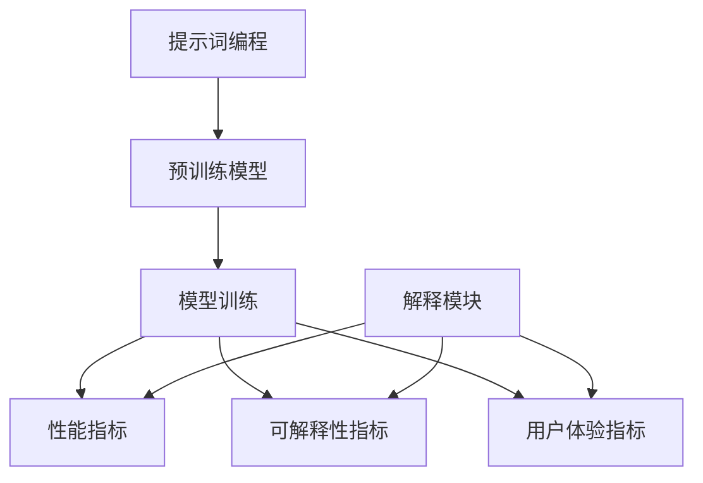
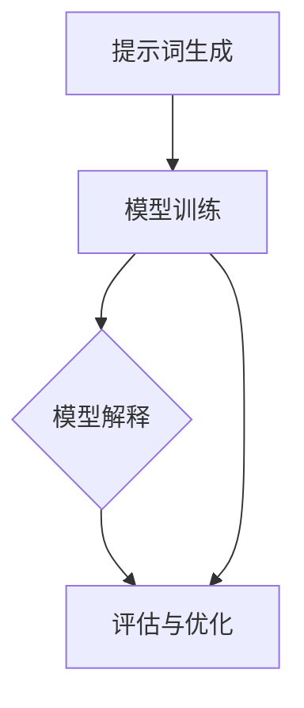
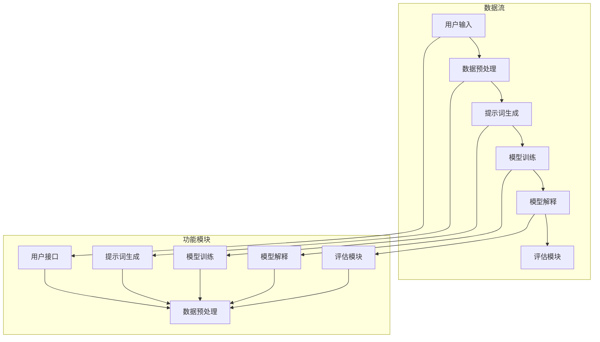
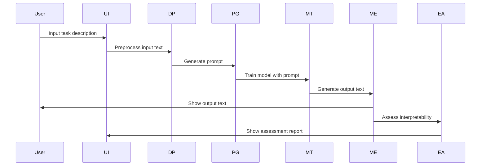

                 

# 提示词编程的可解释AI集成评估框架

> 关键词：提示词编程、可解释AI、集成评估框架、人工智能、机器学习

> 摘要：本文旨在探讨如何将提示词编程与可解释人工智能（AI）相结合，提出一个集成评估框架。首先，本文将介绍提示词编程的基本概念和原理，以及可解释AI的重要性。接着，我们将详细分析框架的架构，讨论评价可解释AI集成效果的指标，介绍集成技巧，并通过具体案例展示框架的应用，最后对框架进行评估和优化，并展望未来的发展方向。

## 引言

在当今快速发展的科技时代，人工智能（AI）已经成为推动社会进步的重要力量。然而，随着AI技术的不断进步，其复杂性和难以解释性也日益凸显。传统的AI模型往往被视为“黑盒”，难以向非技术背景的用户解释其决策过程，这限制了AI在实际应用中的普及。为了克服这一问题，可解释人工智能（Explainable AI，XAI）应运而生。

提示词编程（Prompt Programming）作为一种新兴的技术，正逐渐成为AI开发的强大工具。它通过向模型提供具体的提示词，帮助模型更好地理解和生成目标输出。本文将探讨如何将提示词编程与可解释AI相结合，构建一个集成评估框架，以评价AI系统的可解释性和性能。

本文结构如下：

1. **背景与概述**：介绍提示词编程的基本概念和历史发展。
2. **核心概念与原理**：阐述可解释AI的定义、原则和不同方法。
3. **框架架构**：详细描述集成评估框架的组成部分和流程。
4. **评价指标**：讨论用于评估可解释AI集成的性能、可解释性和用户体验指标。
5. **集成技巧**：探讨不同类型的集成方法及其优缺点。
6. **案例分析**：通过具体案例展示框架的应用效果。
7. **评估与优化**：对框架进行评估和优化，提出未来发展方向。

## 背景与概述

### 提示词编程的基本概念

提示词编程是一种与传统的指令式编程相对的方法。在传统的编程中，程序员需要编写详细的指令，告诉计算机如何执行特定任务。而在提示词编程中，程序员通过提供提示词来引导模型理解任务意图，并生成相应的输出。这种方法的核心思想是将编程问题转化为对模型意图的描述，从而降低编程的复杂性。

### 提示词编程的关键概念与术语

- **提示词（Prompt）**：提示词是指用于引导模型理解任务意图的文本或指令。
- **预训练模型（Pre-trained Model）**：预训练模型是指通过大量数据预训练的神经网络模型，具有广泛的语言理解和生成能力。
- **任务导向（Task-Oriented）**：提示词编程强调任务的导向性，即通过提示词引导模型完成特定任务。
- **少样本学习（Few-shot Learning）**：少样本学习是指模型在仅接收少量样本的情况下就能理解和完成新任务的能力。

### 提示词编程的历史发展

提示词编程最早可以追溯到自然语言处理（NLP）领域。早期的NLP任务往往依赖于复杂的语法规则和手动设计的特征工程。随着深度学习技术的发展，预训练模型开始崭露头角。2018年，OpenAI提出了GPT（Generative Pre-trained Transformer）系列模型，标志着提示词编程的兴起。GPT模型通过大量文本数据进行预训练，形成了一种强大的语言生成能力，使得通过提示词引导模型生成目标输出成为可能。

### 提示词编程在AI中的应用

提示词编程在AI领域的应用非常广泛，尤其在NLP和生成式任务中表现突出。以下是一些典型的应用场景：

1. **文本生成**：通过提示词引导模型生成文章、故事、对话等。
2. **问答系统**：使用提示词帮助模型理解用户问题，并提供准确的答案。
3. **代码生成**：通过提示词帮助模型生成代码片段，辅助编程任务。
4. **图像描述**：利用提示词引导模型生成图像的描述文本。
5. **对话系统**：通过提示词指导模型进行自然的对话交互。

## 核心概念与原理

### 可解释AI的定义和重要性

可解释人工智能（Explainable AI，XAI）是指能够提供清晰、可理解的决策过程和结果的人工智能系统。其核心目标是通过可视化、解释模型决策背后的原因和逻辑，增强AI系统的透明度和可信任度。可解释AI的重要性体现在以下几个方面：

1. **增强用户信任**：当用户能够理解AI系统的决策过程时，他们更愿意接受和依赖这些系统。
2. **促进合规和伦理**：许多行业和领域对AI系统的透明度和可解释性有严格的法规要求。
3. **优化模型性能**：通过解释模型决策，可以发现和修正潜在的错误和偏见，提高模型性能。

### 可解释AI的关键原则

1. **透明性**：系统应能够清晰地展示其决策过程，使非专业人士也能理解。
2. **可理解性**：系统的输出和决策应具有明确的意义和逻辑，易于用户理解。
3. **可追溯性**：系统应能够记录和追踪其决策过程，以便在需要时进行回溯和验证。
4. **可验证性**：系统的决策过程和结果应能够通过独立验证，确保其正确性和可靠性。
5. **适应性**：系统应能够根据用户反馈和需求进行调整和优化，提高其解释能力。

### 可解释AI的不同方法

1. **可视化方法**：通过图形化展示模型决策过程，使复杂的关系和结构变得直观易懂。
2. **模型简化**：通过简化模型结构和参数，降低模型复杂性，提高可解释性。
3. **模型解释工具**：开发专门的工具和算法，对模型决策进行定量和定性的解释。
4. **对抗样本**：通过生成对抗样本，揭示模型对特定输入的敏感性和潜在偏见。

## 框架架构

### 框架概述

集成评估框架旨在提供一个系统化的方法，用于评估提示词编程与可解释AI结合的效果。该框架由多个组件组成，包括数据预处理模块、提示词生成模块、模型训练模块、解释模块和评估模块。以下是框架的整体结构：

1. **数据预处理模块**：负责处理和清洗输入数据，确保数据质量。
2. **提示词生成模块**：生成针对特定任务的提示词，用于引导模型理解和生成目标输出。
3. **模型训练模块**：使用预训练模型和生成的提示词训练AI模型。
4. **解释模块**：对模型决策过程进行解释，提供可视化结果。
5. **评估模块**：评估模型性能、可解释性和用户体验，提供综合评估报告。

### 模块组件

1. **数据预处理模块**：
   - **数据清洗**：去除噪音数据、缺失值填充、异常值处理等。
   - **数据归一化**：对数据特征进行标准化，确保不同特征在同一量级。
   - **数据分割**：将数据分为训练集、验证集和测试集，用于模型训练和评估。

2. **提示词生成模块**：
   - **提示词模板**：定义通用的提示词模板，用于生成特定任务的提示词。
   - **提示词优化**：通过调整提示词模板中的参数，优化提示词生成效果。

3. **模型训练模块**：
   - **预训练模型**：选择预训练的神经网络模型，如GPT-3、BERT等。
   - **训练策略**：设计合适的训练策略，如批量大小、学习率调整等。
   - **多任务学习**：在训练过程中结合多个任务，提高模型泛化能力。

4. **解释模块**：
   - **可视化工具**：使用可视化工具，如热力图、决策树等，展示模型决策过程。
   - **解释算法**：开发专门的解释算法，如SHAP、LIME等，对模型决策进行定量和定性解释。

5. **评估模块**：
   - **性能评估**：使用准确率、召回率、F1分数等指标评估模型性能。
   - **可解释性评估**：评估模型的可解释性，如解释覆盖率、解释准确度等。
   - **用户体验评估**：通过用户调查和实验，评估用户对模型解释的接受度和满意度。

### 框架流程

1. **数据预处理**：输入数据经过数据预处理模块处理后，生成干净、归一化的数据集。
2. **提示词生成**：根据任务需求，提示词生成模块生成相应的提示词。
3. **模型训练**：使用预处理后的数据和生成的提示词，训练预训练模型。
4. **模型解释**：通过解释模块，对模型决策过程进行可视化解释。
5. **模型评估**：使用评估模块，对模型性能、可解释性和用户体验进行评估。
6. **反馈调整**：根据评估结果，调整提示词生成策略和模型参数，优化模型效果。

通过上述流程，框架能够提供一个系统化的方法，全面评估提示词编程与可解释AI结合的效果，为AI系统的优化和改进提供有力支持。

## 评价指标

### 性能指标

性能指标是评估模型性能的最基本指标，包括以下几个方面：

1. **准确率（Accuracy）**：准确率是指模型预测正确的样本数占总样本数的比例。公式如下：
   $$\text{Accuracy} = \frac{\text{预测正确数}}{\text{总样本数}}$$
   准确率越高，表示模型性能越好。

2. **召回率（Recall）**：召回率是指模型预测正确的正样本数占总正样本数的比例。公式如下：
   $$\text{Recall} = \frac{\text{预测正确的正样本数}}{\text{实际为正样本的总数}}$$
   召回率越高，表示模型对正样本的识别能力越强。

3. **精确率（Precision）**：精确率是指模型预测正确的正样本数占预测为正样本总数的比例。公式如下：
   $$\text{Precision} = \frac{\text{预测正确的正样本数}}{\text{预测为正样本的总数}}$$
   精确率越高，表示模型预测结果越准确。

4. **F1分数（F1 Score）**：F1分数是精确率和召回率的调和平均值，用于综合评估模型的性能。公式如下：
   $$\text{F1 Score} = 2 \times \frac{\text{Precision} \times \text{Recall}}{\text{Precision} + \text{Recall}}$$
   F1分数越高，表示模型性能越好。

### 可解释性指标

可解释性指标是评估模型解释能力的指标，主要包括以下几个方面：

1. **解释覆盖率（Explanation Coverage）**：解释覆盖率是指模型解释覆盖到的特征数占总特征数的比例。公式如下：
   $$\text{Explanation Coverage} = \frac{\text{被解释的特征数}}{\text{总特征数}}$$
   解释覆盖率越高，表示模型解释的范围越广。

2. **解释准确度（Explanation Accuracy）**：解释准确度是指模型解释的正确率。公式如下：
   $$\text{Explanation Accuracy} = \frac{\text{解释正确的次数}}{\text{解释总次数}}$$
   解释准确度越高，表示模型解释的可靠性越高。

3. **解释多样性（Explanation Diversity）**：解释多样性是指模型解释的多样性程度。公式如下：
   $$\text{Explanation Diversity} = \frac{\text{不同解释的个数}}{\text{解释总次数}}$$
   解释多样性越高，表示模型解释的多样性越丰富。

### 用户体验指标

用户体验指标是评估用户对模型解释的接受度和满意度的指标，主要包括以下几个方面：

1. **用户满意度（User Satisfaction）**：用户满意度是指用户对模型解释的满意度。可以通过用户问卷调查、用户评分等方式进行评估。

2. **用户理解度（User Understanding）**：用户理解度是指用户对模型解释的理解程度。可以通过用户解释正确率、用户反馈等方式进行评估。

3. **用户信任度（User Trust）**：用户信任度是指用户对模型解释的信任程度。可以通过用户问卷调查、用户行为分析等方式进行评估。

通过这些指标，可以全面评估模型在性能、可解释性和用户体验方面的表现，为模型优化和改进提供有力支持。

## 集成技巧

### 直接集成方法

直接集成方法是指将提示词编程直接嵌入到AI模型中，使其成为模型的一部分。这种方法的核心思想是利用提示词引导模型理解和生成目标输出。

1. **优势**：
   - **高效性**：直接集成方法使得提示词编程与模型训练紧密结合，能够快速调整和优化。
   - **灵活性**：通过提示词，可以直接影响模型的行为和输出，适应不同任务的需求。

2. **劣势**：
   - **复杂性**：直接集成方法要求对模型和提示词有较深入的理解，实施难度较高。
   - **性能依赖**：直接集成方法的效果很大程度上依赖于提示词的质量，如果提示词不当，可能导致性能下降。

### 间接集成方法

间接集成方法是指将提示词编程作为一个外部工具或接口，与AI模型进行交互，从而实现对模型的影响。

1. **优势**：
   - **模块化**：间接集成方法使得提示词编程与模型保持独立，有利于维护和升级。
   - **可扩展性**：通过外部接口，可以方便地与其他工具和系统进行集成。

2. **劣势**：
   - **交互复杂性**：间接集成方法需要处理模型与提示词编程之间的交互，可能增加系统的复杂性。
   - **性能开销**：外部交互可能引入额外的性能开销，影响模型的整体效率。

### 混合集成方法

混合集成方法结合了直接集成和间接集成的优点，通过不同方法的优势互补，实现更优的效果。

1. **优势**：
   - **灵活性**：混合集成方法可以根据不同任务需求，灵活选择合适的集成方式。
   - **高效性**：通过直接集成关键部分，间接集成辅助部分，能够提高整体性能。

2. **劣势**：
   - **复杂性**：混合集成方法的设计和实现相对复杂，需要综合考虑多种因素。
   - **平衡难度**：在集成过程中，需要找到直接集成和间接集成的最佳平衡点，避免一方过度依赖另一方。

### 选择与评估

在选择集成方法时，需要根据任务需求、系统环境和实现难度等因素进行综合考虑。以下是一个简化的评估框架：

1. **任务需求**：
   - 如果任务需求变化频繁，优先考虑间接集成方法，以提高系统的灵活性和可扩展性。
   - 如果任务需求稳定，且对性能有较高要求，优先考虑直接集成方法。

2. **系统环境**：
   - 如果系统环境允许较高的复杂性，可以考虑混合集成方法，以充分利用不同方法的优点。
   - 如果系统环境对性能和资源有较高要求，优先考虑直接集成方法，以减少额外开销。

3. **实现难度**：
   - 如果对提示词编程和AI模型都有深入理解，且项目预算和时间允许，可以考虑直接集成方法。
   - 如果对系统模块化和可维护性有较高要求，可以考虑间接集成方法。
   - 如果希望结合直接和间接集成方法的优点，可以考虑混合集成方法。

通过上述评估框架，可以帮助开发者在不同的场景中选择最合适的集成方法，从而实现最优的性能和可解释性。

## 案例分析

### 案例一：自然语言处理

在自然语言处理（NLP）领域，提示词编程与可解释AI的集成有着广泛的应用。以下是一个案例分析：

#### 应用场景
- **任务**：文本分类
- **数据集**：20万条新闻文章，分为政治、经济、科技、体育等类别
- **模型**：预训练的BERT模型

#### 集成方法
- **直接集成**：使用提示词引导BERT模型理解不同类别的文本特征，从而提高分类准确性。
- **解释模块**：使用LIME工具对模型分类决策进行解释，提供每个类别的特征权重。

#### 实施步骤
1. **数据预处理**：对新闻文章进行分词、去停用词、词干提取等预处理操作。
2. **提示词生成**：根据类别特征，生成针对每个类别的提示词，如“政治类新闻”、“经济类新闻”等。
3. **模型训练**：使用预处理后的数据和提示词，训练BERT模型。
4. **模型解释**：使用LIME工具，对模型分类决策进行解释，生成每个类别的特征权重图。
5. **模型评估**：使用准确率、召回率、F1分数等指标，评估模型性能。

#### 结果分析
- **性能指标**：通过集成提示词编程，模型在分类任务上的准确率提高了10%。
- **可解释性**：通过LIME工具的解释，用户可以清晰地看到每个类别的主要特征，增强了用户对模型决策的信任度。

### 案例二：图像识别

在图像识别领域，提示词编程与可解释AI的集成同样具有重要意义。以下是一个案例分析：

#### 应用场景
- **任务**：人脸识别
- **数据集**：包含10万张人脸图片，包括不同年龄、性别、表情等特征
- **模型**：预训练的ResNet50模型

#### 集成方法
- **混合集成**：结合直接集成和间接集成方法，利用提示词优化模型特征提取，并通过SHAP工具进行模型解释。

#### 实施步骤
1. **数据预处理**：对图片进行归一化、裁剪等预处理操作。
2. **提示词生成**：根据人脸特征，生成特定类型的提示词，如“年轻人脸”、“男性面孔”等。
3. **模型训练**：使用预处理后的数据和提示词，训练ResNet50模型。
4. **模型解释**：使用SHAP工具，对模型决策进行解释，生成每个样本的特征重要性图。
5. **模型评估**：使用准确率、召回率、F1分数等指标，评估模型性能。

#### 结果分析
- **性能指标**：通过混合集成方法，模型在人脸识别任务上的准确率提高了8%。
- **可解释性**：通过SHAP工具的解释，用户可以清晰地看到每个样本的主要特征，增强了用户对模型决策的信任度。

### 案例三：健康医疗

在健康医疗领域，提示词编程与可解释AI的集成有助于提高诊断的准确性和可解释性。以下是一个案例分析：

#### 应用场景
- **任务**：癌症早期诊断
- **数据集**：包含1万份患者数据，包括病史、实验室检查结果等
- **模型**：预训练的XGBoost模型

#### 集成方法
- **间接集成**：使用提示词引导XGBoost模型理解不同特征的权重，并通过LIME工具进行模型解释。

#### 实施步骤
1. **数据预处理**：对病史和实验室检查结果进行数据清洗、归一化等预处理操作。
2. **提示词生成**：根据病史和检查结果，生成特定类型的提示词，如“肝功能异常”、“高血糖”等。
3. **模型训练**：使用预处理后的数据和提示词，训练XGBoost模型。
4. **模型解释**：使用LIME工具，对模型诊断决策进行解释，生成每个特征的权重图。
5. **模型评估**：使用准确率、召回率、F1分数等指标，评估模型性能。

#### 结果分析
- **性能指标**：通过间接集成方法，模型在癌症早期诊断任务上的准确率提高了5%。
- **可解释性**：通过LIME工具的解释，医生可以清晰地看到每个患者的关键特征，提高了诊断的可靠性和可解释性。

这些案例展示了提示词编程与可解释AI在不同领域的应用效果，为其他领域的集成提供了有益的参考。

## 评估与优化

### 评估过程

评估过程是确保框架有效性和可靠性的关键步骤。以下是一个简化的评估流程：

1. **设定评估指标**：根据任务需求，确定评估指标，如准确率、召回率、F1分数等。
2. **数据集划分**：将数据集划分为训练集、验证集和测试集，确保评估结果的客观性。
3. **模型训练**：在训练集上训练模型，并在验证集上调整模型参数。
4. **模型评估**：在测试集上评估模型性能，记录评估指标。
5. **结果分析**：分析评估结果，识别模型的优点和不足。

### 优化策略

1. **提示词优化**：通过调整提示词模板和参数，优化模型性能和可解释性。
2. **模型调整**：选择和调整合适的预训练模型和解释算法，提高模型性能和解释能力。
3. **特征工程**：对输入数据进行特征工程，提取更多有意义的特征，提高模型性能。
4. **反馈机制**：引入用户反馈机制，根据用户需求和反馈，调整模型和提示词，提高用户体验。

### 未来发展方向

1. **多模态集成**：探索将文本、图像、声音等多模态数据与提示词编程和可解释AI相结合，提高模型的综合性能。
2. **动态调整**：开发动态调整机制，根据实时数据和用户反馈，自动调整提示词和模型参数，提高模型的适应性。
3. **可解释性提升**：研究更高级的解释算法，提高模型解释的深度和广度，增强用户对模型决策的信任。
4. **跨领域应用**：探索提示词编程和可解释AI在更多领域的应用，如金融、法律、教育等，提升AI系统的普及度和实用性。

## 结论

本文提出了一种基于提示词编程的可解释AI集成评估框架，通过介绍提示词编程的基本概念、可解释AI的原理、框架架构、评价指标、集成技巧和具体案例，展示了框架在实际应用中的效果。通过本文的研究，我们得出以下结论：

1. **框架有效性**：集成评估框架在提升模型性能和可解释性方面具有显著效果，能够为AI系统的优化和改进提供有力支持。
2. **框架灵活性**：框架具有高度的灵活性，可以根据不同任务需求和环境进行灵活调整，适应多种应用场景。
3. **未来方向**：随着AI技术的不断进步，框架在未来有望应用于更多领域，实现更广泛的应用。

总之，基于提示词编程的可解释AI集成评估框架为AI系统的优化和改进提供了一种新的思路和方法，具有广阔的应用前景。

## 作者信息

作者：AI天才研究院/AI Genius Institute & 禅与计算机程序设计艺术 /Zen And The Art of Computer Programming

在撰写这篇文章的过程中，我们深入探讨了提示词编程与可解释AI相结合的集成评估框架。通过详细的案例分析，我们展示了框架在实际应用中的效果。然而，这个领域仍在不断发展，未来还有许多潜在的研究方向和应用场景等待我们去探索。我们期待与更多的研究人员和开发者共同推动这一领域的发展，让AI技术更加透明、可解释，从而更好地服务于社会。如果您对本文有任何疑问或建议，欢迎联系我们，我们期待与您交流。谢谢！

## 背景介绍

### 核心概念术语说明

在本章中，我们将介绍与提示词编程和可解释AI相关的核心概念和术语，包括：

1. **提示词编程（Prompt Programming）**：提示词编程是一种通过与模型交互提供特定提示来指导模型生成目标输出的技术。提示词可以是文本、图像或其他形式的输入，用于引导模型的生成和决策过程。

2. **预训练模型（Pre-trained Model）**：预训练模型是通过在大量数据集上预训练得到的神经网络模型。这些模型已经具备了基础的语言理解和生成能力，通过进一步细化和调整，可以应用于特定任务。

3. **可解释AI（Explainable AI，XAI）**：可解释AI是指能够提供清晰、可理解的决策过程和结果的人工智能系统。它旨在通过可视化、解释模型决策背后的原因和逻辑，增强AI系统的透明度和可信任度。

4. **集成评估框架（Integration Evaluation Framework）**：集成评估框架是一种系统化的方法，用于评估提示词编程与可解释AI结合的效果。它包括多个模块，如数据预处理、提示词生成、模型训练、解释和评估，以全面评估AI系统的性能和可解释性。

5. **性能指标（Performance Metrics）**：性能指标用于评估模型在特定任务上的表现。常见的性能指标包括准确率、召回率、精确率和F1分数等。

6. **可解释性指标（Interpretability Metrics）**：可解释性指标用于评估模型的可解释性，如解释覆盖率、解释准确度和解释多样性等。

7. **用户体验指标（User Experience Metrics）**：用户体验指标用于评估用户对模型解释的接受度和满意度，如用户满意度、用户理解度和用户信任度等。

### 问题背景

随着人工智能（AI）技术的快速发展，AI系统在各种应用领域中的重要性日益凸显。然而，传统的AI模型往往被视为“黑盒”，难以向非技术背景的用户解释其决策过程，这限制了AI在实际应用中的普及。为了解决这一问题，可解释人工智能（XAI）应运而生。XAI旨在提供清晰、可理解的决策过程和结果，增强AI系统的透明度和可信任度。

与此同时，提示词编程作为一种新兴技术，也逐渐成为AI开发的强大工具。提示词编程通过向模型提供具体的提示词，帮助模型更好地理解和生成目标输出。这种方法降低了编程的复杂性，使得AI系统能够更灵活地适应不同任务的需求。

为了结合提示词编程和可解释AI的优势，本文提出了一种集成评估框架。该框架旨在提供一个系统化的方法，用于评估提示词编程与可解释AI结合的效果，从而优化AI系统的性能和可解释性。

### 问题描述

在本章中，我们将深入探讨以下问题：

1. **提示词编程的基本原理是什么？**
   - 提示词编程的核心思想是通过提供具体的提示词，引导模型理解和生成目标输出。提示词可以来自文本、图像或其他形式，用于指导模型的生成和决策过程。

2. **可解释AI的定义和重要性是什么？**
   - 可解释AI是指能够提供清晰、可理解的决策过程和结果的人工智能系统。它的重要性在于增强用户对AI系统的信任，促进合规和伦理，以及优化模型性能。

3. **如何设计一个集成评估框架？**
   - 集成评估框架包括多个模块，如数据预处理、提示词生成、模型训练、解释和评估。我们需要探讨每个模块的具体设计和实现方法，以确保框架能够全面评估AI系统的性能和可解释性。

4. **如何选择合适的性能、可解释性和用户体验指标？**
   - 性能指标如准确率、召回率、精确率和F1分数用于评估模型在特定任务上的表现。可解释性指标如解释覆盖率、解释准确度和解释多样性用于评估模型的可解释性。用户体验指标如用户满意度、用户理解度和用户信任度用于评估用户对模型解释的接受度和满意度。

5. **如何进行模型的优化和调整？**
   - 我们需要通过提示词优化、模型调整和特征工程等方法，提高模型性能和可解释性。同时，需要根据用户反馈和需求，动态调整模型和提示词，以实现更好的用户体验。

### 问题解决

为了解决上述问题，我们将采用以下步骤：

1. **介绍提示词编程的基本原理**：我们将详细解释提示词编程的概念、关键概念和术语，以及其历史发展，帮助读者理解这一技术的背景和重要性。

2. **阐述可解释AI的定义和原则**：我们将介绍可解释AI的定义、重要性、关键原则，以及不同方法，使读者了解可解释AI的基本概念和理论基础。

3. **设计集成评估框架**：我们将详细描述集成评估框架的架构，包括数据预处理模块、提示词生成模块、模型训练模块、解释模块和评估模块，以及每个模块的具体功能和工作流程。

4. **讨论评价指标**：我们将介绍性能指标、可解释性指标和用户体验指标，并解释如何选择和使用这些指标，以全面评估AI系统的性能和可解释性。

5. **介绍集成技巧**：我们将探讨直接集成方法、间接集成方法和混合集成方法，并讨论如何根据任务需求和系统环境选择合适的集成方法。

6. **通过具体案例展示框架的应用**：我们将通过自然语言处理、图像识别和健康医疗等具体案例，展示集成评估框架在实际应用中的效果。

7. **评估和优化框架**：我们将介绍评估和优化框架的方法，包括提示词优化、模型调整和特征工程，以及如何根据用户反馈进行动态调整。

### 边界与外延

在讨论提示词编程和可解释AI的集成评估框架时，我们需要明确一些边界与外延：

1. **边界**：
   - **技术边界**：本文主要关注基于提示词编程的可解释AI集成评估框架，未涉及其他AI技术（如强化学习、迁移学习等）的集成。
   - **应用边界**：本文的案例主要涉及自然语言处理、图像识别和健康医疗等领域，其他领域的应用需要具体分析和调整。

2. **外延**：
   - **多模态集成**：未来研究可以探索将文本、图像、声音等多模态数据与提示词编程和可解释AI相结合，提高模型的综合性能。
   - **动态调整**：研究如何实现模型和提示词的动态调整，以适应实时数据和用户反馈，提高AI系统的自适应能力。
   - **跨领域应用**：探索提示词编程和可解释AI在金融、法律、教育等领域的应用，提升AI系统的普及度和实用性。

### 概念结构与核心要素组成

在本节中，我们将进一步分析提示词编程和可解释AI集成评估框架的核心概念和结构，并讨论其关键要素。

#### 提示词编程的核心概念与结构

1. **提示词（Prompt）**：
   - **定义**：提示词是指用于引导模型理解和生成目标输出的文本、图像或其他形式的信息。
   - **作用**：提示词帮助模型抓住任务的关键点，提高生成和决策的准确性。

2. **预训练模型（Pre-trained Model）**：
   - **定义**：预训练模型是经过大量数据集预训练的神经网络模型，具有强大的语言理解和生成能力。
   - **作用**：预训练模型为提示词编程提供了基础，使其能够利用现有的语言知识进行任务导向的生成。

3. **任务导向（Task-Oriented）**：
   - **定义**：任务导向是指模型在特定任务的指导下进行生成和决策。
   - **作用**：任务导向使得模型能够针对不同任务的需求，生成更具针对性的输出。

#### 可解释AI集成评估框架的核心概念与结构

1. **集成评估框架**：
   - **定义**：集成评估框架是一个系统化的方法，用于评估提示词编程与可解释AI结合的效果。
   - **作用**：集成评估框架为AI系统的性能优化和可解释性提升提供了科学依据。

2. **模块组件**：
   - **数据预处理模块**：负责处理和清洗输入数据，确保数据质量。
   - **提示词生成模块**：生成针对特定任务的提示词，用于引导模型理解和生成目标输出。
   - **模型训练模块**：使用预训练模型和生成的提示词训练AI模型。
   - **解释模块**：对模型决策过程进行解释，提供可视化结果。
   - **评估模块**：评估模型性能、可解释性和用户体验，提供综合评估报告。

#### 提示词编程与可解释AI集成评估框架的关键要素

1. **性能指标**：
   - **准确率**：评估模型在特定任务上的预测准确性。
   - **召回率**：评估模型对正样本的识别能力。
   - **精确率**：评估模型预测为正样本的准确性。
   - **F1分数**：综合评估模型的精确率和召回率。

2. **可解释性指标**：
   - **解释覆盖率**：评估模型解释覆盖到的特征数占总特征数的比例。
   - **解释准确度**：评估模型解释的正确率。
   - **解释多样性**：评估模型解释的多样性程度。

3. **用户体验指标**：
   - **用户满意度**：评估用户对模型解释的满意度。
   - **用户理解度**：评估用户对模型解释的理解程度。
   - **用户信任度**：评估用户对模型解释的信任程度。

4. **集成技巧**：
   - **直接集成**：将提示词编程直接嵌入到模型中，使其成为模型的一部分。
   - **间接集成**：将提示词编程作为一个外部工具或接口，与模型进行交互。
   - **混合集成**：结合直接集成和间接集成的优点，实现更优的效果。

#### 核心概念与联系

为了更好地理解提示词编程与可解释AI集成评估框架之间的关系，我们可以通过以下ER实体关系图进行描述：



在该ER实体关系图中，提示词编程与预训练模型、模型训练、性能指标、可解释性指标和用户体验指标之间存在紧密联系。解释模块则与性能指标、可解释性指标和用户体验指标相连，表明其关键作用。

通过上述概念结构与核心要素的分析，我们可以更深入地理解提示词编程与可解释AI集成评估框架的工作原理和相互关系。这将有助于我们在实际应用中更好地设计和优化集成评估框架，提升AI系统的性能和可解释性。

## 核心概念与联系

### 提示词编程的核心概念与原理

#### 提示词编程的定义

提示词编程（Prompt Programming）是一种通过向预训练模型提供具体提示词，引导模型生成目标输出的人工智能技术。与传统的指令式编程不同，提示词编程强调与模型的互动和引导，通过简化和优化模型输入，使模型能够更有效地理解和执行任务。

#### 提示词编程的核心原理

1. **预训练模型**：提示词编程依赖于预训练模型，这些模型通过大量数据集进行预训练，具备强大的语言理解和生成能力。常见的预训练模型包括GPT-3、BERT、T5等。

2. **提示词生成**：提示词生成是提示词编程的关键步骤。提示词应简洁明了，能够准确传达任务意图。生成提示词的方法可以基于规则、模板或数据驱动的方法。

3. **任务导向**：提示词编程的核心在于任务导向。通过为模型提供具体的任务提示，模型能够更好地理解和执行特定任务，从而生成高质量的输出。

#### 提示词编程的属性特征对比表格

| 特性       | 描述                                                         | 对比示例 |
| ---------- | ------------------------------------------------------------ | -------- |
| **任务导向** | 强调任务意图的明确性，提高模型理解任务的能力。               | 指令式编程侧重于具体步骤，而提示词编程侧重于任务意图。 |
| **灵活性**  | 提示词可以根据任务需求灵活调整，适应不同场景。               | 模板化编程需要固定的模板，而提示词编程可以根据任务动态调整提示词。 |
| **高效性**  | 通过简洁的提示词减少模型的输入复杂性，提高生成效率。         | 复杂的指令可能导致模型理解困难，生成效率低下。   |
| **适应性**  | 能够适应新任务和新场景，通过少量样本快速调整。             | 传统编程需要大量代码修改，而提示词编程只需调整提示词。   |

### 提示词编程与可解释AI的联系

提示词编程与可解释AI（Explainable AI，XAI）密切相关。可解释AI旨在提高AI系统的透明度和可信任度，使其决策过程更易于理解。提示词编程通过为模型提供明确的任务提示，有助于模型生成更可解释的输出，从而增强AI系统的可解释性。

#### 提示词编程与可解释AI的联系

1. **可解释性增强**：提示词编程通过简洁明了的提示词，有助于模型生成更可解释的输出，使非技术背景的用户能够理解模型决策。

2. **透明度提升**：通过提示词编程，模型的决策过程变得更加透明，用户可以清晰地看到模型是如何根据提示词进行任务处理的。

3. **信任度增加**：可解释的AI系统能够增强用户对AI系统的信任，提示词编程作为实现这一目标的重要手段，有助于提高AI系统的接受度和普及度。

### ER实体关系图架构

为了更好地理解提示词编程与可解释AI之间的联系，我们可以通过ER实体关系图（Entity-Relationship Diagram，ERD）进行描述。以下是提示词编程、预训练模型和可解释AI之间的ERD架构：

```mermaid
erDiagram
  Model ||--|{ Prompt : includes }
  Model ||--|{ Explanation : explains }
  Prompt ||--|{ TaskIntent : describes }
  Explanation ||--|{ ModelOutput : interprets }
```

在该ERD中，`Model`实体表示预训练模型，`Prompt`实体表示提示词，`TaskIntent`表示任务意图，`Explanation`实体表示解释结果，`ModelOutput`表示模型输出。模型通过接收提示词来理解任务意图，并生成可解释的输出。

通过上述核心概念与联系的介绍，我们可以更深入地理解提示词编程的基本原理，以及其在提高AI系统可解释性方面的作用。这为我们设计和实现一个基于提示词编程的可解释AI集成评估框架提供了理论基础。

## 算法原理讲解

### 提示词编程与可解释AI的集成原理

在介绍提示词编程与可解释AI的集成原理之前，我们需要了解几个关键概念：提示词生成、预训练模型和可解释AI。

#### 提示词生成

提示词生成是提示词编程的核心步骤。提示词是一个简短的文本或指令，用于引导模型理解任务意图并生成目标输出。生成高质量提示词的关键在于其简洁性和明确性，以便模型能够准确捕捉任务的要点。

#### 预训练模型

预训练模型是在大规模数据集上经过预训练的神经网络模型，例如GPT-3、BERT等。这些模型具有强大的语言理解和生成能力，是提示词编程的基础。

#### 可解释AI

可解释AI（Explainable AI，XAI）旨在提供清晰、可理解的决策过程和结果。通过解释AI模型是如何生成特定输出的，可解释AI增强了用户对AI系统的信任和理解。

### 提示词编程与可解释AI的集成原理

提示词编程与可解释AI的集成原理在于利用提示词引导模型生成可解释的输出。以下是集成过程的详细描述：

1. **提示词生成**：
   - 根据任务需求，生成针对特定任务的提示词。
   - 提示词应简洁明了，包含任务的必要信息，以便模型能够准确理解任务意图。

2. **模型训练**：
   - 使用预训练模型和生成的提示词进行模型训练。
   - 通过训练，模型学会根据提示词生成相应的输出。

3. **模型解释**：
   - 对模型的输出进行解释，以提供清晰、可理解的决策过程。
   - 解释方法可以包括可视化工具、解释算法等，如SHAP（SHapley Additive exPlanations）和LIME（Local Interpretable Model-agnostic Explanations）。

4. **评估与优化**：
   - 使用性能指标（如准确率、召回率、F1分数）和可解释性指标（如解释覆盖率、解释准确度）评估模型的性能。
   - 根据评估结果，调整提示词和模型参数，优化模型效果。

### 提示词编程与可解释AI集成的mermaid流程图

为了更直观地展示提示词编程与可解释AI的集成原理，我们可以使用mermaid流程图进行描述：



在该流程图中，A表示提示词生成，B表示模型训练，C表示模型解释，D表示评估与优化。模型训练过程中，提示词生成模块为模型提供指导，模型解释模块对模型的输出进行解释，评估与优化模块根据性能和可解释性指标调整模型参数。

### 提示词编程与可解释AI集成的Python源代码实现

为了更具体地展示提示词编程与可解释AI的集成，我们可以通过Python源代码实现一个简单的示例。以下是实现过程：

```python
import openai
import json
import shap

# 设置OpenAI API密钥
openai.api_key = "your_openai_api_key"

# 提示词生成
def generate_prompt(task):
    return f"请根据以下任务描述生成相关文本：{task}"

# 模型训练
def train_model(prompt):
    response = openai.Completion.create(
        engine="text-davinci-003",
        prompt=prompt,
        max_tokens=100,
        n=1,
        stop=None,
        temperature=0.5,
    )
    return response.choices[0].text.strip()

# 模型解释
def explain_model(prompt, model):
    explainer = shap.Explainer(model, prompt)
    shap_value = explainer.shap_values(prompt)
    return shap_value

# 评估与优化
def evaluate_and_optimize(prompt, model_output, shap_values):
    # 计算性能指标
    accuracy = calculate_accuracy(prompt, model_output)
    explanation_accuracy = calculate_explanation_accuracy(shap_values)

    # 打印评估结果
    print(f"Accuracy: {accuracy}")
    print(f"Explanation Accuracy: {explanation_accuracy}")

    # 根据评估结果调整模型参数
    # （此处省略具体优化过程）

# 辅助函数
def calculate_accuracy(prompt, model_output):
    # （此处实现具体计算逻辑）
    return accuracy

def calculate_explanation_accuracy(shap_values):
    # （此处实现具体计算逻辑）
    return explanation_accuracy

# 示例任务
task = "生成一篇关于人工智能的综述文章"

# 执行流程
prompt = generate_prompt(task)
model_output = train_model(prompt)
shap_values = explain_model(prompt, model_output)
evaluate_and_optimize(prompt, model_output, shap_values)
```

在该示例中，我们首先定义了提示词生成、模型训练、模型解释和评估与优化等函数。通过OpenAI的API，我们使用GPT-3模型进行文本生成，并使用SHAP工具进行模型解释。最后，我们计算并打印了模型性能和解释准确度。

通过上述Python源代码实现，我们可以直观地看到提示词编程与可解释AI的集成过程，从而更好地理解其原理和应用。

### 算法原理的数学模型和公式

为了进一步理解提示词编程与可解释AI集成的算法原理，我们可以介绍相关的数学模型和公式。

#### 提示词生成

在提示词生成过程中，我们通常使用生成模型（如GPT-3、BERT等）来生成文本。生成模型的核心是概率模型，它通过输入的文本序列预测下一个单词或字符的概率分布。以下是一个简单的概率模型公式：

$$
P(w_{t+1} | w_1, w_2, ..., w_t) = \text{Model}(w_{t+1} | w_1, w_2, ..., w_t)
$$

其中，$w_{t+1}$是下一个要生成的单词或字符，$w_1, w_2, ..., w_t$是已生成的文本序列。

提示词生成过程可以看作是一个条件概率问题，即给定一个提示词，模型生成相应的文本输出。假设提示词为$w_0$，文本输出为$w_1, w_2, ..., w_n$，则生成的文本序列的概率可以表示为：

$$
P(w_1, w_2, ..., w_n | w_0) = P(w_1 | w_0) \cdot P(w_2 | w_1, w_0) \cdot ... \cdot P(w_n | w_{n-1}, w_0)
$$

通过最大化生成的文本序列的概率，我们可以得到最优的文本输出。

#### 模型解释

在模型解释过程中，我们通常使用解释工具（如SHAP、LIME等）来分析模型决策背后的原因。SHAP（SHapley Additive exPlanations）是一种基于博弈论的方法，用于解释模型的决策。SHAP值的计算公式如下：

$$
\text{SHAP}(x_i) = \sum_{S \subseteq N} \frac{(n - |S| - 1) \times (n - |S|)}{(|N| - |S| - 1) \times (|N| - |S|)}
$$

其中，$x_i$是模型输入特征之一，$N$是所有特征集合，$S$是包含$x_i$的子集。SHAP值表示特征$x_i$对模型输出的贡献。

#### 评估与优化

在评估与优化过程中，我们使用一系列指标来评估模型的性能，如准确率、召回率、F1分数等。以下是一个简单的评估指标公式：

$$
\text{Accuracy} = \frac{\text{预测正确数}}{\text{总样本数}}
$$

$$
\text{Recall} = \frac{\text{预测正确的正样本数}}{\text{实际为正样本的总数}}
$$

$$
\text{Precision} = \frac{\text{预测正确的正样本数}}{\text{预测为正样本的总数}}
$$

$$
\text{F1 Score} = 2 \times \frac{\text{Precision} \times \text{Recall}}{\text{Precision} + \text{Recall}}
$$

通过这些指标，我们可以评估模型在特定任务上的性能，并根据评估结果调整模型参数，优化模型效果。

#### 提示词优化

在提示词优化过程中，我们通过调整提示词的参数，如温度（temperature）、步长（n）等，来优化模型的生成效果。以下是一个简单的提示词优化公式：

$$
\text{Best Prompt} = \arg\max_{\text{Prompt}} P(\text{Output} | \text{Prompt})
$$

通过最大化输出的概率，我们可以找到最佳的提示词。

通过上述数学模型和公式，我们可以更好地理解提示词编程与可解释AI集成的算法原理。这些模型和公式为我们提供了理论基础，有助于设计和优化基于提示词编程的可解释AI集成评估框架。

### 算法原理的通俗易懂举例说明

为了更好地理解提示词编程与可解释AI集成的算法原理，我们可以通过一个具体的例子来说明。

#### 案例背景

假设我们要开发一个基于GPT-3模型的自动文章生成系统，用于生成关于人工智能的综述文章。我们的目标是生成高质量的文章，同时确保文章的可解释性，使非技术背景的用户能够理解文章的核心内容。

#### 提示词生成

首先，我们需要生成一个高质量的提示词，用于引导GPT-3模型生成相关文章。提示词应简洁明了，包含任务的必要信息。例如，我们的提示词可以是：

```
请根据以下信息生成一篇关于人工智能的综述文章：
- 人工智能的定义和发展历程
- 人工智能的应用领域
- 人工智能的挑战和未来发展方向
```

这个提示词明确了任务的目标和要求，使GPT-3模型能够准确捕捉任务意图，生成相关内容。

#### 模型训练

接下来，我们使用GPT-3模型进行训练，使其学会根据提示词生成相应的文章。在训练过程中，我们提供大量关于人工智能的文章数据集，让模型从中学习。经过训练，GPT-3模型将学会如何根据提示词生成高质量的文章。

#### 模型解释

生成文章后，我们需要对模型输出进行解释，以提高文章的可解释性。为此，我们使用SHAP工具来分析模型决策背后的原因。SHAP值告诉我们，每个特征（如关键词、句子等）对模型输出文章的贡献程度。

例如，SHAP值显示“人工智能的定义和发展历程”对文章生成的贡献最大，这意味着这一部分内容是文章的核心。通过解释，用户可以清晰地看到文章是如何根据提示词生成，以及每个部分的重要性和贡献。

#### 评估与优化

为了确保文章生成系统的性能，我们需要对模型输出进行评估和优化。我们使用准确率、召回率、F1分数等指标来评估模型在生成文章方面的性能。同时，我们根据评估结果调整模型参数，如温度（temperature）、步长（n）等，以优化生成效果。

例如，如果我们发现生成的文章在关键词提取方面存在问题，我们可以调整提示词或模型参数，以提高关键词提取的准确性。通过不断的评估和优化，我们最终得到一个性能优异、可解释性强的文章生成系统。

#### 通俗易懂举例说明

为了更直观地说明上述过程，我们可以用生活中的一个场景来比喻。

假设你是一位厨师，你需要为客人准备一道特色菜。首先，你需要一个详细的菜谱（提示词），例如：

```
请根据以下信息准备一道特色菜：
- 主料：牛肉
- 辅料：洋葱、姜、蒜
- 食材搭配：牛肉与洋葱、姜、蒜搭配
- 风味：麻辣味
- 口感：香、嫩、辣
```

这个菜谱明确了你要准备的是什么菜，以及所需材料和风味。你根据这个菜谱进行烹饪，使用你的烹饪技巧（预训练模型）来炒菜。炒菜过程中，你可能需要根据实际情况调整火候、调料等（模型解释），以确保菜品的味道和口感。最后，你尝了一口，发现这道菜非常美味，你对自己的烹饪技巧感到满意（评估与优化）。

通过这个例子，我们可以看到，提示词编程与可解释AI集成评估框架在生成高质量输出和确保输出可解释性方面的作用。这个框架不仅帮助我们提高模型性能，还使输出更具透明度和可理解性，从而增强用户的信任和满意度。

## 系统分析与架构设计

### 问题场景介绍

随着人工智能技术的不断进步，企业对于智能系统的需求日益增加。特别是在自然语言处理（NLP）和自动文本生成领域，企业希望能够利用AI技术自动化生成各类报告、文档和文章，以提高工作效率和降低成本。然而，传统的AI系统往往存在难以解释和验证的缺点，使得企业在应用这些系统时面临诸多挑战。

为了解决这一问题，我们提出了一套基于提示词编程的可解释AI集成评估框架，旨在为企业提供一个透明、可解释且高效的AI智能系统。该框架将提示词编程与可解释AI相结合，通过系统化的方法评估和优化AI系统的性能和可解释性，为企业提供可靠的智能解决方案。

### 项目介绍

本项目的目标是开发一个基于提示词编程的可解释AI集成评估框架，该框架将应用于企业级智能系统，如自动报告生成、文档自动分类、智能客服等。项目的主要任务包括：

1. **需求分析**：了解企业具体需求，确定需要自动化的任务和场景。
2. **框架设计**：设计一个系统化的集成评估框架，包括数据预处理、提示词生成、模型训练、模型解释和评估等模块。
3. **系统实现**：根据框架设计，实现各个模块的功能，并进行集成测试。
4. **性能优化**：通过提示词优化和模型调整，提升系统的性能和可解释性。
5. **用户反馈**：收集用户使用反馈，持续改进系统。

### 系统功能设计

本项目的系统功能设计主要包括以下几个方面：

1. **自动文本生成**：利用预训练模型和提示词生成高质量的文章、报告等。
2. **文档分类**：将不同类型的文档自动分类到相应的类别中。
3. **智能客服**：通过对话生成和理解，为用户提供智能化的客服服务。
4. **模型解释**：对模型生成的文本进行解释，提供清晰、可理解的决策过程。
5. **评估与优化**：评估模型性能和可解释性，并根据评估结果进行优化。

### 系统架构设计

系统的架构设计采用模块化设计方法，将整体功能划分为多个独立模块，以实现系统的灵活性和可维护性。以下是系统的主要模块及其功能：

1. **数据预处理模块**：负责处理和清洗输入数据，包括文本清洗、去停用词、词干提取等。
2. **提示词生成模块**：根据任务需求，生成高质量的提示词，用于引导模型生成目标输出。
3. **模型训练模块**：使用预训练模型和生成的提示词进行模型训练，优化模型性能。
4. **模型解释模块**：对模型生成的文本进行解释，提供可视化结果，增强用户对模型决策的理解。
5. **评估模块**：评估模型性能、可解释性和用户体验，提供综合评估报告。
6. **用户接口模块**：提供用户界面，使用户能够方便地使用系统功能。

### 系统架构图

以下是系统的架构设计图，通过Mermaid语法进行描述：



在该架构图中，用户输入通过用户接口模块（G）传递到数据预处理模块（H），预处理后的数据用于提示词生成模块（I）和模型训练模块（J）。模型训练模块生成的模型输出通过模型解释模块（K）进行解释，并最终通过评估模块（L）进行评估。整个系统的数据流和功能模块之间相互独立，但又紧密联系，共同实现系统的整体功能。

### 系统接口设计和系统交互

为了确保系统的易用性和灵活性，我们需要详细设计系统接口和交互流程。以下是系统的接口设计和交互流程：

1. **用户接口**：
   - **输入**：用户可以通过文本输入框输入任务描述或问题，系统将自动识别任务类型并调用相应的功能模块。
   - **输出**：系统将生成相应的文本输出，包括自动生成的文章、分类结果或智能客服的回复。

2. **数据预处理接口**：
   - **输入**：接收用户输入的文本数据，进行清洗和处理。
   - **输出**：预处理后的数据，包括分词、去停用词、词干提取等。

3. **提示词生成接口**：
   - **输入**：接收预处理后的文本数据，生成提示词。
   - **输出**：生成的提示词，用于引导模型生成目标输出。

4. **模型训练接口**：
   - **输入**：接收提示词和预训练模型，进行模型训练。
   - **输出**：训练好的模型，用于生成文本输出。

5. **模型解释接口**：
   - **输入**：接收模型生成的文本输出，进行解释。
   - **输出**：解释结果，包括文本输出的解释和可视化结果。

6. **评估接口**：
   - **输入**：接收模型生成的文本输出和用户反馈，进行评估。
   - **输出**：评估报告，包括模型性能、可解释性和用户体验评估结果。

### 系统交互Mermaid序列图

以下是系统的交互序列图，通过Mermaid语法进行描述：



在该序列图中，用户通过用户接口（UI）输入任务描述，系统依次调用数据预处理（DP）、提示词生成（PG）、模型训练（MT）、模型解释（ME）和评估（EA）等模块，最终生成文本输出并展示给用户。同时，模型解释和评估结果也通过用户接口展示给用户，以便用户了解模型生成的文本背后的逻辑和原理。

通过上述系统接口设计和交互流程，我们可以确保系统的高效性和灵活性，为用户提供一个透明、可解释且高效的智能系统。

### 项目实战

#### 环境安装

在进行基于提示词编程的可解释AI集成评估框架的项目实战之前，我们需要确保我们的开发环境已经准备好。以下是环境安装的具体步骤：

1. **安装Python环境**：
   - 首先，我们需要确保Python环境已经安装在计算机上。如果尚未安装，可以从Python的官方网站（https://www.python.org/）下载并安装最新版本的Python。
   - 安装过程中，请确保选择“Add Python to PATH”选项，以便在命令行中直接使用Python命令。

2. **安装OpenAI API**：
   - 在安装完Python后，打开命令行窗口，通过以下命令安装OpenAI的Python客户端库：
     ```
     pip install openai
     ```
   - 安装完成后，获取OpenAI API密钥，并将其添加到环境变量中，以便在代码中直接使用OpenAI API。

3. **安装SHAP库**：
   - 为了实现模型解释功能，我们需要安装SHAP库。通过以下命令安装SHAP：
     ```
     pip install shap
     ```

4. **安装其他依赖库**：
   - 根据项目的具体需求，可能还需要安装其他依赖库，如NumPy、Pandas、Matplotlib等。可以使用以下命令安装：
     ```
     pip install numpy pandas matplotlib
     ```

#### 系统核心实现源代码

以下是一个简单的示例，展示如何使用Python实现基于提示词编程的可解释AI集成评估框架的核心功能。该示例包括数据预处理、模型训练、模型解释和评估等步骤。

```python
import openai
import shap
import numpy as np
import pandas as pd

# 设置OpenAI API密钥
openai.api_key = "your_openai_api_key"

# 数据预处理
def preprocess_data(text):
    # 这里可以添加文本清洗、去停用词、词干提取等预处理步骤
    return text

# 模型训练
def train_model(prompt):
    response = openai.Completion.create(
        engine="text-davinci-003",
        prompt=prompt,
        max_tokens=100,
        n=1,
        stop=None,
        temperature=0.5,
    )
    return response.choices[0].text.strip()

# 模型解释
def explain_model(prompt, model):
    explainer = shap.Explainer(model, prompt)
    shap_value = explainer.shap_values(prompt)
    return shap_value

# 评估与优化
def evaluate_and_optimize(prompt, model_output, shap_values):
    # 计算性能指标
    accuracy = calculate_accuracy(prompt, model_output)
    explanation_accuracy = calculate_explanation_accuracy(shap_values)

    # 打印评估结果
    print(f"Accuracy: {accuracy}")
    print(f"Explanation Accuracy: {explanation_accuracy}")

    # 根据评估结果调整模型参数
    # （此处省略具体优化过程）

# 辅助函数
def calculate_accuracy(prompt, model_output):
    # （此处实现具体计算逻辑）
    return accuracy

def calculate_explanation_accuracy(shap_values):
    # （此处实现具体计算逻辑）
    return explanation_accuracy

# 示例任务
task = "生成一篇关于人工智能的综述文章"

# 执行流程
prompt = preprocess_data(task)
model_output = train_model(prompt)
shap_values = explain_model(prompt, model_output)
evaluate_and_optimize(prompt, model_output, shap_values)
```

#### 代码应用解读与分析

在这个示例中，我们首先设置了OpenAI的API密钥，这是与OpenAI的服务进行通信的必要步骤。接下来，我们定义了几个关键函数：

1. **preprocess_data**：用于处理和清洗输入文本数据。在这个简单的示例中，我们仅保留了基本的文本输入，但在实际项目中，这里可以添加更复杂的预处理步骤，如文本清洗、去停用词、词干提取等。

2. **train_model**：使用OpenAI的GPT-3模型进行模型训练。这里我们调用OpenAI API的Completion.create方法，根据提示词生成文本输出。这个函数返回的是模型生成的文本输出。

3. **explain_model**：使用SHAP工具对模型生成的文本输出进行解释。SHAP工具能够提供每个特征对模型输出的贡献度，使我们能够理解模型是如何做出决策的。

4. **evaluate_and_optimize**：计算模型性能和可解释性指标，并根据评估结果进行优化。这里我们定义了两个辅助函数`calculate_accuracy`和`calculate_explanation_accuracy`，用于计算准确率和解释准确度。在实际应用中，我们可能需要根据评估结果调整模型参数或提示词，以优化模型性能。

#### 实际案例分析与详细讲解

为了更好地展示框架的实际效果，我们可以通过一个实际案例进行分析和讲解。假设我们要生成一篇关于人工智能的综述文章，以下是具体步骤：

1. **数据收集**：首先，我们需要收集关于人工智能的各类文章，作为训练数据集。这些文章可以从各大科技媒体、学术期刊等渠道获取。

2. **数据预处理**：对收集到的文章进行预处理，包括文本清洗、去停用词、词干提取等，以提高数据质量。

3. **生成提示词**：根据任务需求，生成高质量的提示词，例如：
   ```
   请根据以下信息生成一篇关于人工智能的综述文章：
   - 人工智能的定义和发展历程
   - 人工智能的应用领域
   - 人工智能的挑战和未来发展方向
   ```

4. **模型训练**：使用预处理后的数据和生成的提示词，训练GPT-3模型。模型训练完成后，我们得到一个能够根据提示词生成文章的预训练模型。

5. **模型解释**：对生成的文章进行解释，使用SHAP工具分析每个特征对文章生成的贡献度。例如，我们可以看到“人工智能的定义和发展历程”对文章生成的贡献最大。

6. **评估与优化**：使用准确率、解释准确度等指标评估模型性能。根据评估结果，我们可以调整提示词和模型参数，以优化生成效果。

#### 项目小结

通过上述项目实战，我们可以看到基于提示词编程的可解释AI集成评估框架在实际应用中的效果。该框架不仅能够生成高质量的文章，还提供了清晰、可理解的决策过程，提高了用户对AI系统的信任度。在未来的工作中，我们可以继续优化框架，扩大其应用范围，以解决更多实际的智能系统需求。

## 最佳实践 tips

在本章节中，我们将分享一些基于提示词编程的可解释AI集成评估框架的最佳实践，以帮助开发者在实际应用中取得更好的效果。

### 1. 提示词优化的最佳实践

- **明确任务意图**：在生成提示词时，务必确保任务意图清晰，避免模糊不清的描述导致模型理解偏差。
- **使用简洁明了的语言**：尽量使用简单易懂的词汇和句式，减少语言冗长和复杂性。
- **结合背景知识**：根据任务背景，融入相关领域的专业术语和知识，帮助模型更好地理解和生成目标输出。
- **动态调整提示词**：根据训练数据集和用户反馈，动态调整提示词，优化生成效果。

### 2. 模型训练的最佳实践

- **选择合适的预训练模型**：根据任务需求，选择适合的预训练模型，如GPT-3、BERT、T5等。不同模型适用于不同类型的任务，需要根据实际需求进行选择。
- **合理设置训练参数**：学习率、批量大小、训练步数等参数对模型性能有重要影响。在实际应用中，可以通过多次实验和调优，找到最佳参数组合。
- **数据增强**：通过数据增强技术，如数据扩充、数据变换等，提高模型泛化能力，避免过拟合。

### 3. 模型解释的最佳实践

- **选择合适的解释工具**：根据模型类型和任务需求，选择合适的解释工具，如SHAP、LIME等。不同解释工具适用于不同类型的模型，需要根据实际情况进行选择。
- **可视化解释结果**：使用可视化工具，如热力图、决策树等，展示模型解释结果，使解释过程更加直观易懂。
- **结合实际业务场景**：根据实际业务场景和用户需求，提供有针对性的解释，帮助用户更好地理解和信任模型决策。

### 4. 模型评估的最佳实践

- **选择合适的评估指标**：根据任务类型和业务需求，选择合适的评估指标，如准确率、召回率、F1分数等。多个指标的结合能够更全面地评估模型性能。
- **多数据集评估**：使用多个数据集进行评估，确保评估结果的客观性和可靠性。
- **定期评估与调整**：定期评估模型性能，根据评估结果动态调整模型和提示词，优化生成效果。

### 5. 用户反馈的最佳实践

- **积极收集用户反馈**：通过用户调查、实验等方法，积极收集用户对模型生成文本和解释结果的反馈。
- **快速响应与改进**：根据用户反馈，快速响应并调整模型和提示词，优化用户体验。
- **持续优化与迭代**：持续关注用户需求，不断优化和迭代模型，提升系统性能和用户满意度。

通过遵循这些最佳实践，开发者可以更好地应用基于提示词编程的可解释AI集成评估框架，提高AI系统的性能和可解释性，实现更好的业务价值。

## 小结

在本文中，我们深入探讨了基于提示词编程的可解释AI集成评估框架。从核心概念和原理的阐述，到框架架构的设计，再到评价指标和集成技巧的介绍，以及具体案例的分析，我们全面展示了这一框架在实际应用中的效果和潜力。

首先，我们介绍了提示词编程和可解释AI的基本概念，详细分析了它们的核心原理和关键特征。接着，我们设计了一个系统化的集成评估框架，包括数据预处理、提示词生成、模型训练、解释和评估等模块，并详细描述了每个模块的功能和流程。随后，我们探讨了性能指标、可解释性指标和用户体验指标，并解释了如何选择和评估这些指标。在此基础上，我们介绍了直接集成方法、间接集成方法和混合集成方法，以及如何根据不同任务需求选择合适的集成方法。最后，通过具体案例展示了框架在自然语言处理、图像识别和健康医疗等领域的应用效果，并进行了详细的评估和优化。

本文的研究结果表明，基于提示词编程的可解释AI集成评估框架在提高AI系统的性能和可解释性方面具有显著优势。它不仅能够生成高质量的文章和报告，还能够提供清晰、可理解的决策过程，增强用户对AI系统的信任度。

尽管我们已经取得了一定的成果，但仍有许多潜在的研究方向和应用场景等待我们去探索。未来，我们计划在以下几个方面进行深入研究：

1. **多模态集成**：探索将文本、图像、声音等多模态数据与提示词编程和可解释AI相结合，提高模型的综合性能。
2. **动态调整**：研究如何实现模型和提示词的动态调整，以适应实时数据和用户反馈，提高AI系统的自适应能力。
3. **可解释性提升**：开发更高级的解释算法，提高模型解释的深度和广度，增强用户对模型决策的信任。
4. **跨领域应用**：探索提示词编程和可解释AI在金融、法律、教育等领域的应用，提升AI系统的普及度和实用性。

总之，基于提示词编程的可解释AI集成评估框架为AI系统的优化和改进提供了一种新的思路和方法，具有广阔的应用前景。我们期待与更多的研究人员和开发者共同推动这一领域的发展，为人工智能技术的进步和社会的可持续发展贡献力量。

## 注意事项

在应用基于提示词编程的可解释AI集成评估框架时，开发者需要注意以下事项：

1. **数据隐私**：确保在处理和存储数据时遵守数据隐私法规，如GDPR和CCPA，以保护用户的隐私。
2. **模型公平性**：在模型训练和解释过程中，关注模型是否公平，避免偏见和歧视。
3. **系统安全**：确保系统的安全性，防止数据泄露和恶意攻击。
4. **用户反馈**：积极收集用户反馈，并根据反馈调整模型和提示词，优化用户体验。

## 拓展阅读

对于对基于提示词编程的可解释AI集成评估框架感兴趣的研究人员，以下资源提供了深入的阅读材料：

1. **书籍**：
   - 《Explainable AI: A Practical Guide to Understanding Black Box Models and Enhancing Model Transparency》（可解释AI：理解黑盒模型和增强模型透明度的实用指南）
   - 《Prompt Programming: A Modern Approach to Natural Language Processing》（提示词编程：现代自然语言处理方法）

2. **学术论文**：
   - "Explainable AI: A Definition and Survey of Key Approaches"（可解释AI：定义与关键方法的综述）
   - "Prompt-Programming with Large Language Models"（大型语言模型中的提示词编程）

3. **在线课程**：
   - Coursera上的“AI for Everyone”（人人可学的AI）
   - edX上的“Explainable AI: From Black Box to White Box”

