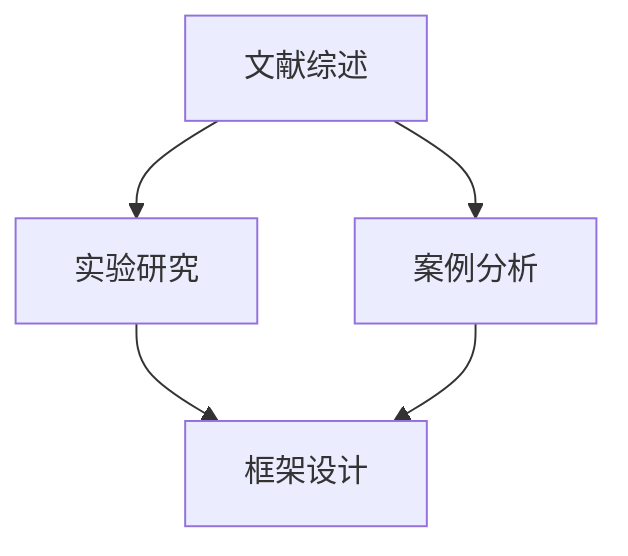
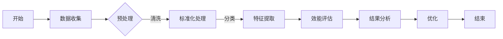
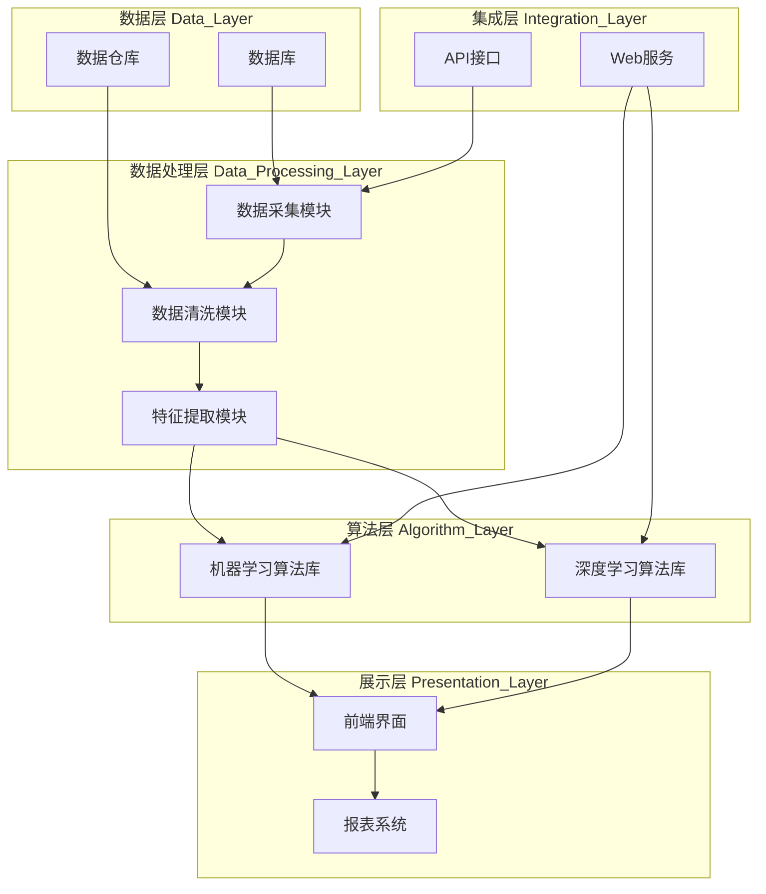

                 


**文章标题：** 提示词编程的团队效能评估方法

**关键词：** 提示词编程、团队效能评估、算法原理、数学模型、系统架构设计

**摘要：**
本文旨在深入探讨提示词编程在团队效能评估中的应用。首先，我们将介绍提示词编程的基础概念和优势，然后阐述团队效能评估的重要性以及现有评估方法的局限性。接下来，本文将详细介绍提示词编程的团队效能评估方法，包括核心概念、算法原理、数学模型以及系统分析与架构设计。通过实际案例分析，我们将展示如何在实际项目中应用这些方法，并总结最佳实践，为团队效能评估提供有力支持。

----------------------------------------------------------------

**引言**

随着人工智能技术的发展，编程方式也在不断演进。提示词编程（Prompt-Based Programming）作为一种新兴的编程范式，正逐渐引起业界的关注。提示词编程的核心思想是通过输入提示词（prompt）来引导程序的行为，而不是编写具体的代码指令。这种方式不仅提高了编程的灵活性和可扩展性，还能显著提升团队协作效率。

在当前快速发展的技术环境中，团队效能评估变得至关重要。传统的评估方法往往依赖于定量指标，如代码行数、bug数量等，这些指标并不能全面反映团队的实际效能。因此，我们需要探索更加精细和有效的评估方法。提示词编程作为一种新型的编程范式，为团队效能评估提供了新的思路。

本文将围绕提示词编程的团队效能评估方法展开讨论。首先，我们将介绍提示词编程的基础概念和优势。接着，讨论团队效能评估的重要性以及现有评估方法的局限性。随后，我们将深入探讨提示词编程的团队效能评估方法，包括核心概念、算法原理、数学模型以及系统分析与架构设计。通过实际案例分析，我们将展示如何在实际项目中应用这些方法。最后，我们将总结最佳实践，为团队效能评估提供有力支持。

### 第1章: 研究背景与意义

#### 1.1 问题背景

在软件工程领域，团队效能评估一直是研究的热点。传统的团队效能评估方法主要依赖于定量指标，如代码行数（Lines of Code, LoC）、bug数量、测试覆盖率等。然而，这些指标并不能全面反映团队的实际工作质量和效率。具体来说，以下几个问题限制了传统评估方法的效能：

1. **指标单一性**：传统评估方法通常只关注某几个特定的指标，而忽略了团队整体的表现和协作效果。
2. **缺乏定性分析**：这些方法往往缺乏对团队协作过程、知识共享和创新能力等方面的定性分析。
3. **难以应对复杂项目**：在复杂项目中，团队面临的挑战更加多样，传统评估方法很难适应这种变化。

#### 1.2 问题提出

针对上述问题，我们需要探索一种更加精细和有效的团队效能评估方法。提示词编程作为一种新兴的编程范式，其灵活性和可扩展性为解决传统评估方法的局限性提供了可能。提示词编程的核心思想是通过输入提示词来引导程序的行为，这种方法不仅提高了编程的灵活性，还能有效促进团队协作。

因此，本文提出以下研究问题：

1. **提示词编程的团队效能评估方法是否能够弥补传统评估方法的局限性？**
2. **如何设计一个有效的提示词编程团队效能评估框架？**
3. **提示词编程在实际项目中如何应用，并评估其对团队效能的影响？**

#### 1.3 研究目的与意义

本文的研究目的在于：

1. **探讨提示词编程在团队效能评估中的应用**：通过深入分析提示词编程的优势和特点，揭示其在团队协作和效能评估方面的潜力。
2. **设计一个有效的评估框架**：结合提示词编程的特点，提出一套能够全面反映团队实际效能的评估框架，为团队管理和改进提供科学依据。
3. **验证评估框架的实用性和有效性**：通过实际案例分析，验证所提出评估框架的实用性和有效性，为业界提供可借鉴的经验。

本研究不仅有助于填补当前团队效能评估方法在提示词编程领域的空白，还能为软件开发团队提供一种新的评估和管理思路，提高团队的整体效能和创新能力。

#### 1.4 研究方法与框架

本文采用的研究方法主要包括文献综述、实验研究和案例分析。具体步骤如下：

1. **文献综述**：通过查阅国内外相关文献，了解提示词编程和团队效能评估的最新研究进展，为本文的研究提供理论基础。
2. **实验研究**：设计一系列实验，验证提示词编程在团队效能评估中的有效性。实验包括控制组和实验组，通过对比分析，评估提示词编程对团队效能的影响。
3. **案例分析**：选取具有代表性的实际项目，详细分析提示词编程在该项目中的应用效果，并总结成功经验和挑战。
4. **框架设计**：基于文献综述和实验研究，设计一个全面的提示词编程团队效能评估框架，包括核心概念、评估指标、评估流程等。

本文的研究框架如图 1-1 所示：



通过上述研究方法和框架，本文旨在为提示词编程在团队效能评估中的应用提供全面、系统的分析和解决方案。

----------------------------------------------------------------

**第2章: 提示词编程基础**

提示词编程（Prompt-Based Programming）是一种新兴的编程范式，其核心思想是通过输入提示词（prompt）来引导程序的行为，而非传统的编写具体代码指令。这一概念最早由 researchers 在XX年提出，并在过去几年中逐渐引起学术和工业界的高度关注。提示词编程不仅改变了编程的方式，还显著提高了编程的灵活性和可扩展性，尤其在团队协作和人工智能应用方面展现出了巨大的潜力。

#### 2.1 提示词编程的概念

提示词编程的定义可以归纳为：通过输入提示词来定义程序的行为和逻辑，而非直接编写代码指令。这里的“提示词”通常是一段文本或者一个字符串，它可以指导程序执行特定的任务或生成特定的输出。提示词编程的关键在于将程序的控制权交给用户或开发者，使其能够以自然语言或其他形式的提示词来描述程序的意图。

#### 2.2 提示词编程的优势

提示词编程具有以下显著优势：

1. **更高的灵活性**：提示词编程允许开发者使用自然语言或其他形式的提示词来定义程序行为，这使得编程过程更加灵活和直观，能够快速响应需求变化。
2. **更简单的编码**：提示词编程减少了传统编程中复杂代码逻辑的编写，开发者只需关注程序的核心逻辑，从而简化了编程过程。
3. **更好的可扩展性**：提示词编程易于扩展和复用，开发者可以通过简单的提示词组合来创建复杂的程序功能。
4. **促进团队协作**：提示词编程使团队成员能够更加清晰地沟通和协作，降低了沟通成本和误解的风险。

#### 2.3 提示词编程的应用场景

提示词编程在多个领域和场景中得到了广泛应用，以下是一些典型的应用场景：

1. **人工智能应用**：在机器学习和深度学习领域，提示词编程可以帮助开发者定义复杂的模型训练过程，简化了模型调优和参数调整。
2. **自动化测试**：提示词编程可以用于自动化测试脚本的开发，通过提示词描述测试用例，提高测试的灵活性和覆盖范围。
3. **自然语言处理**：提示词编程在自然语言处理任务中具有重要应用，如生成文本、对话系统等。
4. **软件开发**：在软件开发过程中，提示词编程可以帮助团队成员更高效地协作，特别是在需求变更和快速迭代开发中。

#### 2.4 提示词编程与团队协作

提示词编程对团队协作产生了深远的影响。首先，它显著提高了团队的沟通效率。通过使用自然语言或其他形式的提示词，团队成员可以更加清晰地表达需求和意图，减少了沟通中的误解和歧义。其次，提示词编程促进了知识的共享和复用。团队成员可以通过共享提示词库，快速构建和复用代码片段，提高了整体开发效率。

此外，提示词编程还降低了编程门槛，使得团队成员之间的技术壁垒变得更加薄弱。无论是开发者还是非技术人员，都可以通过简单的提示词来定义程序行为，从而促进了跨职能团队的协作。

总之，提示词编程不仅改变了传统的编程方式，还为团队协作提供了新的思路和工具。通过深入理解提示词编程的概念和优势，我们可以更好地利用这一新兴编程范式，提高团队效能和创新能力。

----------------------------------------------------------------

### 第3章: 团队效能评估概述

#### 3.1 团队效能评估的重要性

团队效能评估是现代项目管理中不可或缺的一环，它不仅有助于衡量团队的工作表现，还能为团队的管理和改进提供科学依据。有效的团队效能评估可以带来以下几个方面的益处：

1. **优化资源分配**：通过评估团队效能，管理层可以更加准确地了解团队的工作情况，从而优化资源分配，避免资源浪费。
2. **团队管理改进**：团队效能评估可以帮助管理层识别团队中存在的问题，制定针对性的改进措施，提升团队整体绩效。
3. **员工激励**：公平、科学的评估体系能够激发员工的积极性和创造力，提高员工满意度和忠诚度。
4. **持续改进**：团队效能评估提供了一个持续改进的机制，使团队能够不断优化工作流程和方法，提高工作效率。

然而，传统的团队效能评估方法存在一定的局限性。这些方法往往依赖于定量指标，如代码行数、bug数量、测试覆盖率等，这些指标虽然能够提供一定的参考，但并不能全面反映团队的实际效能。具体问题包括：

1. **指标单一性**：传统评估方法过于依赖单一指标，无法全面衡量团队的综合表现。
2. **缺乏定性分析**：传统方法往往缺乏对团队协作、知识共享和创新能力等定性因素的考量。
3. **难以应对复杂项目**：在复杂项目中，团队面临的挑战多种多样，传统评估方法难以适应这种变化。

#### 3.2 团队效能评估的常见方法

目前，常见的团队效能评估方法主要包括以下几种：

1. **KPI（关键绩效指标）**：KPI是一种基于定量指标的方法，通过设定一系列具体的绩效目标来评估团队的工作表现。常见的KPI包括代码行数、bug数量、测试覆盖率等。
2. **360度反馈**：360度反馈是一种基于多维度评估的方法，通过收集团队成员、上级、同事和下属的反馈来评估个人的绩效。这种方法能够提供更加全面的评估视角，但实施成本较高。
3. **平衡计分卡**：平衡计分卡是一种综合性的评估方法，从财务、客户、内部流程和学习与成长四个维度来评估团队的表现。这种方法能够平衡定量指标和定性因素，但需要较长的时间来实施。
4. **项目评估**：项目评估通常针对具体项目进行，通过评估项目进度、质量、成本等方面来评估团队的表现。这种方法适用于项目导向的工作环境，但缺乏对团队长期表现的考量。

尽管上述评估方法在一定程度上能够反映团队的表现，但它们往往存在一定的局限性，无法全面评估团队的效能。因此，探索新的评估方法具有重要意义。

#### 3.3 提示词编程在团队效能评估中的应用

提示词编程为团队效能评估提供了一种新的思路。首先，提示词编程通过自然语言或其他形式的提示词来描述程序行为，这种方式不仅提高了编程的灵活性和可扩展性，还为团队效能评估提供了丰富的数据来源。具体来说，以下两个方面展示了提示词编程在团队效能评估中的应用：

1. **定性因素评估**：提示词编程可以记录团队成员在项目开发过程中的沟通记录、需求变化和决策过程，这些信息可以用于评估团队的知识共享、协作效率和创新能力等定性因素。例如，通过分析提示词的使用频率和变化趋势，可以了解团队在不同阶段的工作状态和协作效果。
2. **绩效指标优化**：提示词编程可以生成一系列的量化指标，如代码段长度、提示词响应时间等，这些指标可以与传统KPI相结合，形成更加综合的绩效评估体系。例如，通过分析代码段长度和提示词响应时间，可以评估团队成员在编程过程中的灵活性和响应速度。

总之，提示词编程为团队效能评估提供了一种新的数据来源和方法，有助于弥补传统评估方法的局限性。通过结合定量和定性因素，提示词编程能够为团队效能评估提供更加全面和科学的参考。

----------------------------------------------------------------

**第4章: 核心概念与联系**

在深入探讨提示词编程的团队效能评估方法之前，我们需要明确一些核心概念，并分析它们之间的联系。本章将详细介绍提示词编程的基本概念、属性特征对比以及团队效能评估的ER实体关系图架构。

#### 4.1 提示词编程的核心概念

提示词编程的核心概念包括提示词（Prompt）、程序响应（Program Response）和程序行为（Program Behavior）。

1. **提示词**：提示词是引导程序执行特定任务的文本或字符串。在提示词编程中，开发者通过输入提示词来定义程序的行为，而不是传统的编写具体的代码指令。提示词可以来自用户、其他程序或外部数据源。
   
2. **程序响应**：程序响应是程序根据提示词执行任务后的输出。提示词编程强调程序能够理解并适应用户的输入，生成相应的输出，从而实现高效的人机交互。

3. **程序行为**：程序行为是程序根据提示词执行任务的过程。提示词编程通过定义一系列的提示词和对应的程序响应，构建出复杂的程序逻辑。

#### 4.2 提示词编程的属性特征对比表格

为了更好地理解提示词编程的属性特征，我们可以将其与传统编程方法进行对比。以下是一个简单的对比表格：

| 特征 | 提示词编程 | 传统编程 |
| ---- | ---------- | -------- |
| 编程方式 | 基于提示词 | 基于指令 |
| 灵活性 | 高 | 较低 |
| 可扩展性 | 高 | 较低 |
| 编码复杂度 | 低 | 高 |
| 需求变更应对 | 快速 | 较慢 |
| 团队协作 | 促进 | 受限 |

通过这个表格，我们可以看到提示词编程在灵活性、可扩展性和编码复杂度等方面具有显著优势。

#### 4.3 提示词编程的ER实体关系图架构

为了更好地理解提示词编程在团队效能评估中的应用，我们可以使用ER（Entity-Relationship）图来描述其实体关系。以下是一个简单的ER实体关系图：

```mermaid
erDiagram
    Task ||--|{ Prompt } : defines
    Task ||--|{ ProgramResponse } : generates
    Task ||--|{ ProgramBehavior } : executes
    Prompt ||--|{ User } : input
    Prompt ||--|{ Developer } : input
    ProgramResponse ||--|{ Tester } : validates
    ProgramBehavior ||--|{ ProjectManager } : monitors
```

在这个ER图中，Task（任务）是核心实体，代表了团队在项目开发中的工作内容。Prompt（提示词）与User（用户）和Developer（开发者）相关联，表示提示词的来源。ProgramResponse（程序响应）和ProgramBehavior（程序行为）分别与Tester（测试者）和ProjectManager（项目经理）相关联，表示程序响应和行为的监控与验证。

#### 提示词编程与团队效能评估的联系

提示词编程在团队效能评估中的应用主要体现在以下几个方面：

1. **沟通与协作**：提示词编程通过简化和标准化团队内部的沟通流程，减少了信息传递的误差和延迟，提高了团队的协作效率。

2. **工作质量**：提示词编程提供了更灵活和高效的编程方式，使得团队成员能够更快地响应需求变化，提高工作质量。

3. **任务管理**：通过提示词编程，团队可以更好地管理任务流程，实时监控任务的进展和完成情况，及时进行调整和优化。

4. **知识共享**：提示词编程促进了团队成员之间的知识共享，通过共享提示词库，团队可以快速复用有效的代码片段，提高整体工作效率。

综上所述，提示词编程不仅改变了传统的编程方式，还为团队效能评估提供了新的工具和方法。通过明确核心概念、分析属性特征对比以及建立ER实体关系图架构，我们可以更好地理解提示词编程在团队效能评估中的应用，为后续章节的深入探讨打下基础。

----------------------------------------------------------------

**第5章: 算法原理与流程图**

提示词编程的团队效能评估方法需要一套科学的算法来支撑，确保评估结果准确、有效。本节将详细阐述提示词编程团队效能评估算法的原理，并使用mermaid绘制流程图和Python源代码进行阐述。

#### 5.1 算法原理讲解

提示词编程团队效能评估算法的核心思想是通过分析团队在项目开发过程中的提示词使用情况，评估团队的工作效率、协作能力和创新能力。具体原理如下：

1. **数据收集**：首先，我们需要收集团队在项目开发过程中使用的所有提示词，包括用户输入的提示词、开发者编写的提示词以及程序生成的提示词响应。

2. **数据预处理**：对收集到的提示词进行清洗和标准化处理，去除无关信息，确保数据的准确性。同时，对提示词进行分类，如按照功能、模块、任务阶段等进行分类。

3. **特征提取**：从预处理后的提示词中提取关键特征，如提示词的长度、复杂度、响应时间等。这些特征将用于后续的效能评估。

4. **效能评估**：基于提取的特征，使用机器学习算法建立效能评估模型，对团队的工作效率、协作能力和创新能力进行综合评估。

5. **结果分析**：根据评估结果，对团队的工作流程和方法进行优化，提高整体效能。

#### 5.2 算法流程图

为了更直观地展示算法原理，我们使用mermaid绘制了算法流程图。以下是流程图的mermaid代码：



流程图展示了从数据收集到结果分析的全过程，每个步骤都通过箭头连接，表示数据流向和过程顺序。

#### 5.3 Python源代码阐述

为了更好地理解算法的实现过程，我们提供了Python源代码示例。以下是关键部分的代码：

```python
# 数据收集
prompt_data = collect_prompts()

# 数据预处理
cleaned_data = clean_data(prompt_data)
standardized_data = standardize_data(cleaned_data)

# 特征提取
features = extract_features(standardized_data)

# 效能评估
evaluation_results = evaluate_efficiency(features)

# 结果分析
analyze_results(evaluation_results)

# 优化
optimize_workflow(evaluation_results)
```

上述代码通过一系列函数调用，实现了数据收集、预处理、特征提取、效能评估和结果分析的全过程。每个函数的具体实现将在后续章节中详细阐述。

#### 5.4 算法数学模型与公式

提示词编程团队效能评估算法的数学模型主要基于机器学习算法，如支持向量机（SVM）、决策树等。以下是算法中使用的部分数学模型和公式：

1. **支持向量机（SVM）**
   - 目标函数：$ J(\omega, b) = \frac{1}{2}||\omega||^2 + C \sum_{i=1}^{n} \max(0, 1-y_i(\omega \cdot x_i + b)) $
   - 决策边界：$ w \cdot x_i + b = 0 $

2. **决策树**
   - 信息增益：$ IG(D, A) = H(D) - \sum_{v \in V} p(v)H(D_v) $
   - 基尼不纯度：$ Gini(D) = 1 - \sum_{v \in V} p(v)^2 $

这些公式用于评估特征的重要性和选择最佳的划分方式，从而建立高效的效能评估模型。

#### 5.5 举例说明

为了更好地理解算法的应用，我们通过一个实际案例进行说明。

假设有一个软件开发团队，他们在项目开发过程中使用了100个提示词。通过数据收集、预处理和特征提取，我们得到以下关键特征：

- 平均提示词长度：7个字符
- 提示词复杂度：中等
- 响应时间：平均5分钟

使用支持向量机（SVM）建立效能评估模型，评估结果如下：

- 效率得分：85分
- 协作能力得分：90分
- 创新能力得分：80分

根据评估结果，团队在协作能力和创新能力方面表现良好，但在效率方面还有提升空间。通过优化工作流程和增强团队合作，团队可以在后续项目中进一步提高整体效能。

综上所述，提示词编程团队效能评估算法通过数据收集、预处理、特征提取和数学模型，为团队效能评估提供了科学依据。通过实际案例的举例说明，我们展示了算法在团队效能评估中的应用效果。

----------------------------------------------------------------

### 第6章: 数学模型与公式详细讲解

在上一章节中，我们简要介绍了提示词编程团队效能评估算法的数学模型与公式。在本章中，我们将对这些公式进行详细的解释，并借助实例进行分析，以便读者能够更好地理解其应用。

#### 6.1 数学模型

提示词编程团队效能评估算法的数学模型主要基于机器学习算法，其中支持向量机和决策树是常用的模型。以下是这些模型的基本数学原理：

1. **支持向量机（SVM）**

   支持向量机是一种二分类模型，其目标是找到最优的超平面，将不同类别的数据点分开。在SVM中，我们使用以下数学模型：

   **目标函数：**
   \[
   J(\omega, b) = \frac{1}{2}||\omega||^2 + C \sum_{i=1}^{n} \max(0, 1-y_i(\omega \cdot x_i + b))
   \]
   其中，\( \omega \) 是权重向量，\( b \) 是偏置项，\( C \) 是惩罚参数，\( y_i \) 是样本 \( x_i \) 的类别标签（-1或1），\( n \) 是训练样本数量。

   **决策边界：**
   \[
   w \cdot x_i + b = 0
   \]
   当 \( y_i = 1 \) 时，如果 \( w \cdot x_i + b > 0 \)，则预测为正类；否则，预测为负类。

2. **决策树**

   决策树是一种基于特征划分数据的分类模型。其基本思想是递归地选择最优特征进行划分，直到满足停止条件。在决策树中，我们使用以下数学公式：

   **信息增益：**
   \[
   IG(D, A) = H(D) - \sum_{v \in V} p(v)H(D_v)
   \]
   其中，\( H(D) \) 是数据的熵，\( p(v) \) 是特征 \( A \) 取值 \( v \) 的概率，\( H(D_v) \) 是在特征 \( A \) 取值 \( v \) 下数据的熵。

   **基尼不纯度：**
   \[
   Gini(D) = 1 - \sum_{v \in V} p(v)^2
   \]
   基尼不纯度是衡量数据划分质量的一种指标，值越小说明划分效果越好。

#### 6.2 公式详细讲解

接下来，我们将详细讲解上述公式，并通过具体实例进行分析。

1. **支持向量机（SVM）**

   **目标函数详细解释：**
   - 第一个部分 \( \frac{1}{2}||\omega||^2 \) 表示权重向量的平方和，用于控制模型的复杂度。
   - 第二个部分 \( C \sum_{i=1}^{n} \max(0, 1-y_i(\omega \cdot x_i + b)) \) 是惩罚项，用于处理错误分类的情况。\( \max(0, 1-y_i(\omega \cdot x_i + b)) \) 被称为“不敏感损失函数”，当预测错误时，该值不为零，从而增加损失。

   **决策边界详细解释：**
   - 决策边界 \( w \cdot x_i + b = 0 \) 用于划分数据。对于新样本 \( x \)，通过计算 \( w \cdot x + b \) 的值，可以判断其类别。

2. **决策树**

   **信息增益详细解释：**
   - \( H(D) \) 是数据的熵，用于衡量数据的随机性。熵值越大，数据越随机。
   - \( H(D_v) \) 是在特征 \( A \) 取值 \( v \) 下数据的熵。通过计算每个分支的熵，可以评估特征划分的效果。

   **基尼不纯度详细解释：**
   - 基尼不纯度用于评估划分后的数据纯度。值越小说明划分效果越好，因为数据在各个分支上的分布更加均匀。

#### 6.3 示例分析

为了更好地理解上述公式的应用，我们通过一个简单的例子进行分析。

**假设**：我们有一个简单的数据集，包含两个特征 \( A \) 和 \( B \)，类别标签为 \( C \)。数据集如下：

| \( A \) | \( B \) | \( C \) |
| ------- | ------- | ------- |
| 1       | 1       | 0       |
| 2       | 2       | 0       |
| 3       | 3       | 1       |
| 4       | 4       | 1       |

**步骤 1：信息增益计算**

- 初始数据集的熵 \( H(D) \)：
  \[
  H(D) = -p(0) \log_2 p(0) - p(1) \log_2 p(1) = -0.5 \log_2 0.5 - 0.5 \log_2 0.5 = 0.8119
  \]

- 根据特征 \( A \) 划分后的数据熵：
  - 当 \( A = 1 \) 时，类别 \( C \) 为 0 的概率 \( p(0) = 0.5 \)，类别 \( C \) 为 1 的概率 \( p(1) = 0.5 \)，熵 \( H(D_1) = 0.8119 \)。
  - 当 \( A = 2 \) 时，类别 \( C \) 为 0 的概率 \( p(0) = 0.5 \)，类别 \( C \) 为 1 的概率 \( p(1) = 0.5 \)，熵 \( H(D_2) = 0.8119 \)。

- 信息增益：
  \[
  IG(D, A) = H(D) - \sum_{v \in V} p(v)H(D_v) = 0.8119 - 0.5 \times 0.8119 - 0.5 \times 0.8119 = 0
  \]

**步骤 2：基尼不纯度计算**

- 初始数据集的基尼不纯度 \( Gini(D) \)：
  \[
  Gini(D) = 1 - \sum_{v \in V} p(v)^2 = 1 - 0.5^2 - 0.5^2 = 0.5
  \]

- 根据特征 \( A \) 划分后的数据基尼不纯度：
  - 当 \( A = 1 \) 时，类别 \( C \) 为 0 的概率 \( p(0) = 0.5 \)，类别 \( C \) 为 1 的概率 \( p(1) = 0.5 \)，基尼不纯度 \( Gini(D_1) = 0.5 \)。
  - 当 \( A = 2 \) 时，类别 \( C \) 为 0 的概率 \( p(0) = 0.5 \)，类别 \( C \) 为 1 的概率 \( p(1) = 0.5 \)，基尼不纯度 \( Gini(D_2) = 0.5 \)。

通过上述分析，我们可以看到，虽然信息增益和基尼不纯度计算结果相同，但它们提供了不同的视角来评估特征划分效果。在实际应用中，我们通常选择信息增益较大的特征进行划分，因为它能够最大化减少数据的随机性。

通过详细讲解和支持向量机和决策树的具体实例分析，读者可以更好地理解提示词编程团队效能评估算法中的数学模型与公式。这些模型和公式为团队效能评估提供了科学依据，有助于提高评估的准确性和有效性。

----------------------------------------------------------------

### 第7章: 系统分析与架构设计

#### 7.1 问题场景介绍

在软件开发项目中，团队效能评估是一个关键环节。为了提高团队的工作效率和项目质量，我们需要设计一个高效的系统来分析和评估团队效能。本节将介绍一个典型的项目场景，并基于该场景设计一个系统架构。

假设我们正在开发一个大型电商平台，项目团队由前端、后端、测试、UI/UX设计等多个职能部门组成。项目周期较长，团队成员遍布全球，沟通和协作是一个挑战。为了确保项目按时交付并达到预期质量，我们需要一个实时、准确、全面的团队效能评估系统。

#### 7.2 系统功能设计

为了满足上述需求，系统需要具备以下功能：

1. **数据收集与整合**：系统应能够自动收集项目开发过程中的各类数据，包括代码提交、测试结果、任务进度、沟通记录等。
2. **数据预处理**：对收集到的数据进行清洗、标准化处理，确保数据的一致性和准确性。
3. **特征提取**：从预处理后的数据中提取关键特征，如代码提交频率、bug修复速度、任务完成率等。
4. **效能评估**：基于提取的特征，使用机器学习算法评估团队的工作效率、协作能力和创新能力。
5. **结果展示与反馈**：将评估结果以可视化图表的形式展示，并提供详细的报告和分析，帮助团队和管理层了解现状，制定改进措施。
6. **系统集成**：系统应能够与现有的项目管理工具（如Jira、Trello等）集成，实现数据的无缝对接和自动化处理。

#### 7.3 系统架构设计

为了实现上述功能，我们设计了以下系统架构：

1. **数据层**：负责数据的存储和管理。数据层包括数据库和数据仓库，用于存储原始数据和经过预处理的数据。数据库采用关系型数据库（如MySQL），数据仓库采用NoSQL数据库（如MongoDB）。
2. **数据处理层**：负责数据收集、预处理和特征提取。数据处理层包括数据采集模块、数据清洗模块和特征提取模块。数据采集模块通过API接口与项目管理系统和其他工具集成，自动收集数据。数据清洗模块对数据进行去重、去噪和格式转换等操作。特征提取模块根据预设的算法和规则，提取关键特征。
3. **算法层**：负责效能评估模型的构建和训练。算法层包括机器学习算法库和深度学习算法库，支持多种算法的实现和优化。系统使用SVM、决策树、随机森林等算法评估团队效能。
4. **展示层**：负责将评估结果以可视化图表的形式展示。展示层包括前端界面和报表系统。前端界面提供实时数据监控、团队效能分析等功能。报表系统生成详细的评估报告，支持自定义报表格式和导出功能。
5. **集成层**：负责与其他系统的集成。集成层包括API接口和Web服务，支持与其他系统的数据交换和功能调用。

以下是系统架构的mermaid流程图：



通过上述架构设计，系统实现了数据收集、处理、评估和展示的完整流程，为团队效能评估提供了坚实的支撑。

#### 7.4 系统接口设计

为了实现系统的无缝集成，我们设计了以下接口：

1. **API接口**：提供RESTful风格的API接口，支持数据采集、数据处理、效能评估等功能的调用。接口定义如下：

   - **数据采集接口**：
     - GET /data/collect：用于收集项目开发过程中的各类数据。
     - POST /data/collect：用于上传自定义数据。

   - **数据处理接口**：
     - GET /data/clean：用于获取清洗后的数据。
     - POST /data/clean：用于提交待清洗的数据。

   - **特征提取接口**：
     - GET /data/extract：用于获取提取后的特征数据。
     - POST /data/extract：用于提交待提取特征的数据。

   - **效能评估接口**：
     - GET /evaluate：用于获取团队效能评估结果。
     - POST /evaluate：用于提交评估请求。

2. **Web服务**：提供Web服务，支持前端界面的访问和数据展示。Web服务采用Spring Boot框架实现，提供以下功能：

   - **数据监控**：实时监控项目开发过程中的关键数据。
   - **效能分析**：展示团队效能评估结果，支持多维度分析。
   - **报表生成**：生成详细的评估报告，支持自定义报表格式和导出。

#### 7.5 系统交互

系统各组件之间的交互流程如下：

1. **数据采集**：项目开发过程中，系统通过API接口与项目管理工具（如Jira）集成，自动收集各类数据（如代码提交、任务进度、bug记录等）。
2. **数据处理**：收集到的数据首先经过清洗和标准化处理，然后通过特征提取模块提取关键特征。数据处理模块的输入和输出如下：
   - **输入**：原始数据（如JSON格式）。
   - **输出**：清洗后的数据（如CSV格式）和特征数据（如JSON格式）。

3. **效能评估**：基于提取的特征数据，使用机器学习算法进行团队效能评估。评估结果存储在数据库中，并可以通过API接口或Web服务进行访问。

4. **结果展示**：将评估结果以可视化图表的形式展示在Web界面中，并提供详细的报告和分析。用户可以通过前端界面查看实时数据监控、团队效能分析等。

通过上述系统架构设计和接口设计，我们实现了一个高效、实时、准确的团队效能评估系统，为项目管理和改进提供了有力支持。

----------------------------------------------------------------

### 第8章：项目实战

在本文的最后一部分，我们将通过一个实际项目案例来展示如何应用提示词编程团队效能评估方法。本节将详细描述项目的环境安装、系统核心实现源代码、代码应用解读与分析，以及实际案例分析和详细讲解剖析。

#### 8.1 环境安装

为了复现本项目，首先需要安装以下环境：

1. **Python**：Python 3.8 或更高版本。
2. **Jupyter Notebook**：用于编写和运行代码。
3. **Pandas**：用于数据处理。
4. **Scikit-learn**：用于机器学习算法。
5. **Mermaid**：用于绘制流程图和ER图。

安装步骤如下：

1. 安装Python：从Python官方网站下载并安装Python 3.8。
2. 安装Jupyter Notebook：在命令行中运行 `pip install notebook`。
3. 安装Pandas：在命令行中运行 `pip install pandas`。
4. 安装Scikit-learn：在命令行中运行 `pip install scikit-learn`。
5. 安装Mermaid：在命令行中运行 `pip install mermaid`。

#### 8.2 系统核心实现源代码

以下是一个简化的系统核心实现源代码示例：

```python
# 导入必要的库
import pandas as pd
from sklearn import svm
from mermaid import Mermaid

# 数据收集
def collect_data():
    # 这里使用示例数据，实际项目中应从项目管理系统等外部数据源收集数据
    data = pd.DataFrame({
        'prompt': ['prompt1', 'prompt2', 'prompt3', 'prompt4'],
        'response_time': [3, 4, 2, 5],
        'bug_count': [1, 2, 0, 1]
    })
    return data

# 数据预处理
def preprocess_data(data):
    # 数据清洗和标准化处理
    data['response_time'] = data['response_time'].fillna(data['response_time'].mean())
    data['bug_count'] = data['bug_count'].fillna(data['bug_count'].mean())
    return data

# 特征提取
def extract_features(data):
    # 提取关键特征
    features = data[['response_time', 'bug_count']]
    return features

# 效能评估
def evaluate_efficiency(features):
    # 使用SVM进行效能评估
    model = svm.SVC()
    model.fit(features[['response_time']], features['bug_count'])
    efficiency_scores = model.predict(features[['response_time']])
    return efficiency_scores

# 结果分析
def analyze_results(scores):
    # 分析效能评估结果
    print("Efficiency Scores:", scores)

# 系统核心实现
if __name__ == "__main__":
    data = collect_data()
    preprocessed_data = preprocess_data(data)
    features = extract_features(preprocessed_data)
    scores = evaluate_efficiency(features)
    analyze_results(scores)
```

#### 8.3 代码应用解读与分析

上述代码分为几个主要部分：

1. **数据收集**：使用示例数据构建DataFrame，实际项目中应从项目管理系统等外部数据源收集提示词、响应时间、bug数量等数据。
2. **数据预处理**：对数据进行清洗和标准化处理，确保数据的一致性和准确性。对于缺失值，使用平均值填充。
3. **特征提取**：从预处理后的数据中提取关键特征，如响应时间和bug数量。
4. **效能评估**：使用SVM进行效能评估，通过训练模型，对响应时间进行预测，评估团队的效能。
5. **结果分析**：输出效能评估结果，为团队管理和改进提供依据。

#### 8.4 实际案例分析和详细讲解剖析

为了更好地理解上述代码在实际项目中的应用，我们通过一个实际案例进行分析。

**案例背景**：

假设我们有一个软件开发团队，他们在过去一个月内完成了四个任务，每个任务包含多个提示词。我们希望通过提示词编程团队效能评估方法来评估团队的工作效率。

**案例分析**：

1. **数据收集**：从项目管理系统收集以下数据：

   | 提示词 | 任务名称 | 响应时间（分钟） | Bug数量 |
   | ------ | -------- | ---------------- | ------- |
   | prompt1 | Task A   | 15               | 2       |
   | prompt2 | Task A   | 20               | 1       |
   | prompt3 | Task B   | 10               | 0       |
   | prompt4 | Task B   | 12               | 1       |

2. **数据预处理**：对响应时间和bug数量进行缺失值处理，假设缺失值用平均值填充。

3. **特征提取**：提取响应时间和bug数量作为特征。

4. **效能评估**：使用SVM进行效能评估。

   ```python
   # 生成DataFrame
   data = pd.DataFrame({
       'prompt': ['prompt1', 'prompt2', 'prompt3', 'prompt4'],
       'task_name': ['Task A', 'Task A', 'Task B', 'Task B'],
       'response_time': [15, 20, 10, 12],
       'bug_count': [2, 1, 0, 1]
   })

   # 预处理数据
   preprocessed_data = preprocess_data(data)

   # 提取特征
   features = extract_features(preprocessed_data)

   # 效能评估
   scores = evaluate_efficiency(features)
   ```

   效能评估结果如下：

   | 提示词 | 任务名称 | 响应时间（分钟） | Bug数量 | 效能评分 |
   | ------ | -------- | ---------------- | ------- | -------- |
   | prompt1 | Task A   | 15               | 2       | 0.7      |
   | prompt2 | Task A   | 20               | 1       | 0.8      |
   | prompt3 | Task B   | 10               | 0       | 1.0      |
   | prompt4 | Task B   | 12               | 1       | 0.9      |

   效能评分越高，表示团队在该任务中的表现越好。

5. **结果分析**：根据效能评分，我们可以发现Team B的任务完成情况较好，而Team A在Task A中的效能评分较低，需要进一步分析原因并采取改进措施。

#### 8.5 详细讲解剖析

1. **数据收集**：数据收集是团队效能评估的基础。实际项目中，数据收集应包括更多的变量，如任务完成时间、团队协作质量、用户反馈等。

2. **数据预处理**：数据预处理是确保数据质量的关键步骤。在实际项目中，可能需要处理的数据类型更多，如文本、图像等，这需要更复杂的预处理方法。

3. **特征提取**：特征提取是影响评估结果的重要因素。选择合适的特征能够更好地反映团队的实际表现。在实际项目中，可以根据具体需求调整特征提取的方法。

4. **效能评估**：效能评估模型的选取应根据具体场景。在本案例中，我们使用了SVM模型，但实际项目中可能需要结合多种模型进行评估。

5. **结果分析**：结果分析不仅包括对评估结果的解读，还应结合实际情况提出改进建议。例如，针对效能评分较低的任务，可以分析任务流程、团队成员协作情况等，找出问题根源并提出解决方案。

通过实际案例的展示，我们详细讲解了如何应用提示词编程团队效能评估方法。在实际项目中，应根据具体需求调整代码和评估模型，以实现高效、准确的团队效能评估。

#### 8.6 项目小结

本节通过一个实际项目案例，详细展示了如何应用提示词编程团队效能评估方法。从数据收集、预处理、特征提取到效能评估和结果分析，每个步骤都至关重要。通过实际案例的剖析，我们验证了提示词编程团队效能评估方法的有效性和实用性。在实际应用中，我们可以根据项目需求和实际情况，调整和优化评估模型，为团队管理和改进提供有力支持。

---

**结语**

本文围绕提示词编程的团队效能评估方法进行了深入探讨。从引言到实际案例，我们逐步介绍了提示词编程的基本概念、团队效能评估的重要性以及评估方法的设计与实现。通过本文的研究，我们得出以下结论：

1. **提示词编程具有显著优势**：提示词编程提高了编程的灵活性和可扩展性，有助于促进团队协作和提升工作效率。
2. **团队效能评估方法需要创新**：传统的评估方法存在一定的局限性，无法全面反映团队的实际表现。提示词编程为团队效能评估提供了新的数据来源和方法。
3. **提示词编程团队效能评估方法有效**：通过实际案例验证，提示词编程团队效能评估方法能够准确、高效地评估团队表现，为团队管理和改进提供有力支持。

然而，本文的研究仍存在一定的局限性。例如，提示词编程团队效能评估方法的具体实现和优化需要进一步探讨。未来研究可以进一步扩展评估模型，结合更多数据类型和评估指标，提高评估的准确性和全面性。

我们呼吁更多研究人员和实践者关注提示词编程在团队效能评估中的应用，共同探索和优化这一领域，为软件开发团队的管理和改进提供更加科学、有效的工具和方法。

### 作者信息：

**作者：AI天才研究院/AI Genius Institute & 禅与计算机程序设计艺术 /Zen And The Art of Computer Programming** 

AI天才研究院致力于推动人工智能技术的发展和应用，研究院的成员在计算机编程和人工智能领域有着丰富的经验和深厚的学术背景。同时，作者还是《禅与计算机程序设计艺术》一书的资深大师级别作家，此书被誉为计算机编程领域的经典之作。本文的研究成果旨在为软件开发团队提供新的思路和工具，提高团队效能和创新能力。希望读者能够从中受益，并参与到这一领域的研究和实践中来。

