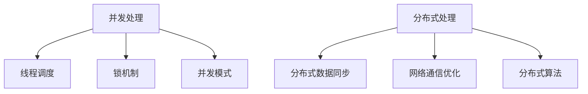
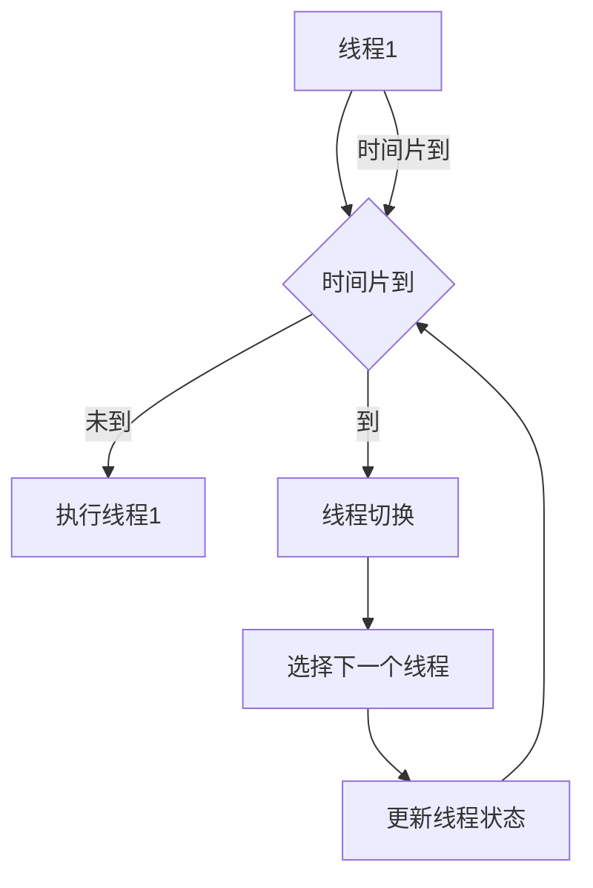
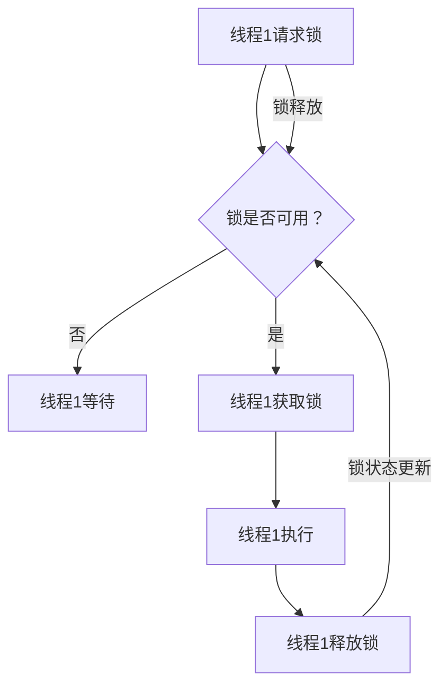
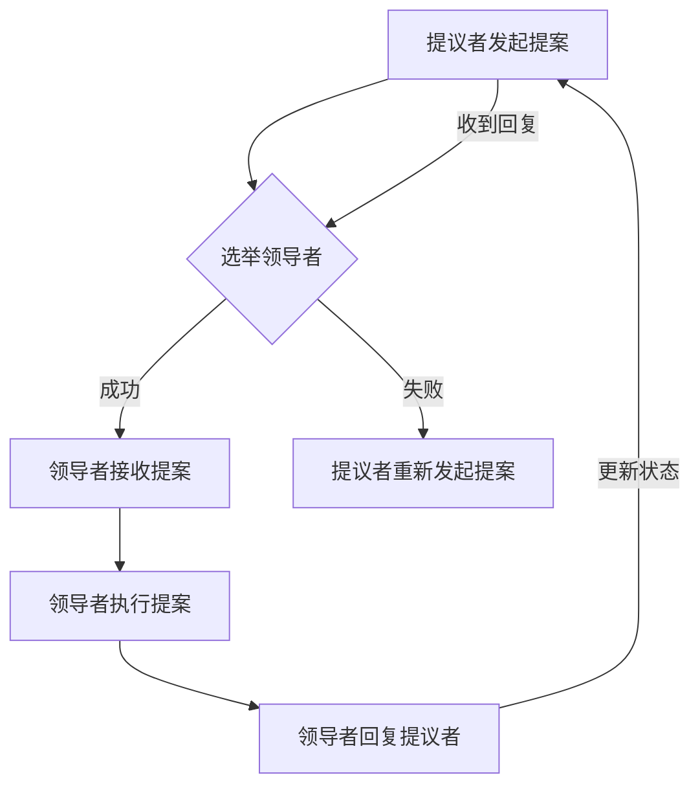
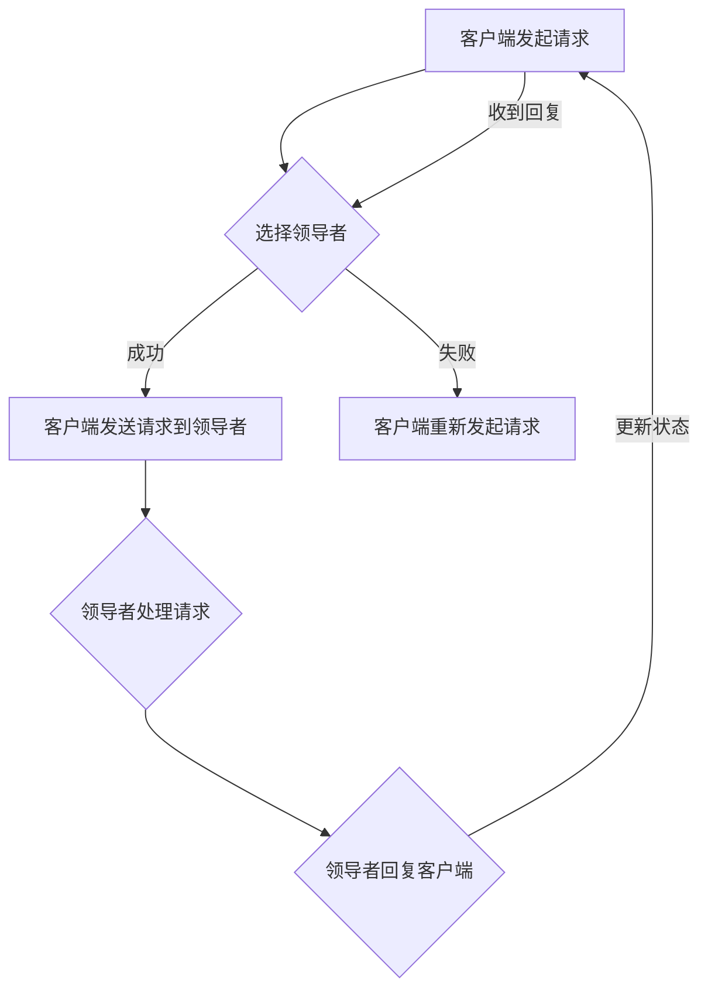
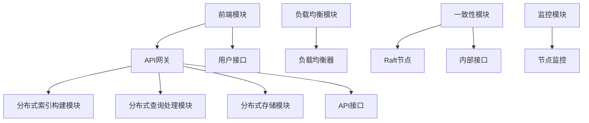

                 

## 提示词编程的并发与分布式处理

> 关键词：提示词编程、并发处理、分布式处理、性能优化、数据一致性

> 摘要：本文将深入探讨提示词编程中的并发与分布式处理技术，分析其在现代编程中的重要性和面临的挑战。通过逐步解析并发处理的基本原理、分布式处理的技术要点，结合实际案例，揭示如何在提示词编程中实现高效并发与分布式处理，为开发者提供实用的解决方案。

## 背景介绍

### 核心概念

**问题背景：**
在现代计算机科学和信息技术领域，编程技术正经历着深刻的变化。提示词编程（Prompt Programming）作为一项革命性的技术，正逐步成为开发高效、灵活且适应性强软件的关键。然而，提示词编程中的并发与分布式处理是确保程序高效执行的关键因素。并发处理能够提高程序的运行速度和响应能力，而分布式处理则能够充分利用多台计算机的资源，实现大规模计算任务的高效完成。

**问题描述：**
提示词编程在并发与分布式处理方面面临一系列挑战。这些挑战包括：如何高效地管理和调度并发任务、如何在分布式系统中保持数据一致性、如何优化网络通信以提高性能等。解决这些问题对于提升软件系统的性能和稳定性至关重要。

**问题解决：**
为了应对上述挑战，需要深入理解并发与分布式处理的基本原理，并掌握相应的编程技术和算法。通过合理的设计和优化，可以有效地提高程序的执行效率和系统的稳定性。

**边界与外延：**
本章节主要讨论提示词编程中的并发与分布式处理技术，包括但不限于线程调度、锁机制、分布式数据同步、一致性协议等。这些技术不仅适用于提示词编程，也广泛应用于其他类型的软件开发。

### 概念结构与核心要素组成

#### 并发处理

**并发处理原理：**
并发处理是指多个任务在同一时间段内交替执行，以提高系统资源的利用率。并发处理的核心在于如何有效地调度和管理多个线程，以及如何解决线程之间的同步问题。

1. **线程调度**：
   - 线程作为程序执行的基本单位，其调度策略直接影响到程序的性能。操作系统通过调度算法来决定哪个线程应该运行，以及何时切换线程。常见的调度算法有先来先服务（FCFS）、优先级调度、轮转调度等。

2. **锁机制**：
   - 锁机制用于保护共享资源，确保多个线程在访问共享资源时不会出现数据竞争和冲突。常见的锁机制有互斥锁（Mutex）、读写锁（Read-Write Lock）、条件锁（Condition Variable）等。

3. **并发模式**：
   - 包括并行模式、异步模式等，这些模式决定了程序中任务执行的顺序和协作方式。

**并发处理特点：**
- **资源共享**：并发处理能够充分利用系统资源，提高程序的运行效率。
- **复杂性**：并发处理增加了程序的复杂度，需要处理同步、锁机制、死锁等问题。
- **性能提升**：在合理设计和优化的情况下，并发处理能够显著提升程序的执行性能。

#### 分布式处理

**分布式处理原理：**
分布式处理是指在多个计算机节点上协同工作，共同完成一个复杂的计算任务。分布式处理的关键在于如何确保数据的一致性、提高系统的容错性和性能。

1. **分布式数据同步**：
   - 通过分布式协议（如Paxos、Raft）确保数据在不同节点之间的一致性。这些协议通过一系列算法，使得多个节点能够达成共识，保持数据的一致性。

2. **网络通信优化**：
   - 使用高效的通信协议（如HTTP/2、QUIC）和网络优化技术（如负载均衡、数据压缩）来提高通信性能。

3. **分布式算法**：
   - 包括分布式搜索、分布式排序等，这些算法能够在分布式系统中高效地完成计算任务。

**分布式处理特点：**
- **扩展性**：分布式处理能够根据需求动态扩展计算资源，提高系统的处理能力。
- **容错性**：通过多节点冗余和故障转移，分布式系统能够在部分节点故障时保持正常运行。
- **复杂性**：分布式处理增加了系统的复杂度，需要处理网络通信、一致性协议、故障恢复等问题。

#### 概念结构与核心要素组成图



### 核心概念与联系

#### 核心概念原理

**并发处理原理：**
并发处理是指在同一时间段内同时执行多个任务，以提高系统资源的利用率和程序的响应速度。并发处理的核心在于如何有效地调度和管理多个线程，以及如何解决线程之间的同步问题。

1. **线程调度**：
   - 线程调度是操作系统核心的功能之一。操作系统通过调度算法来决定哪个线程应该运行，以及何时切换线程。常见的调度算法有先来先服务（FCFS）、优先级调度、轮转调度等。
   - **轮转调度（Round-Robin Scheduling）**：每个线程被分配一个时间片，依次轮流运行。这种方式公平但可能导致线程切换开销较大。
   - **优先级调度（Priority Scheduling）**：根据线程的优先级来决定哪个线程应该运行。优先级高的线程优先得到执行，但可能导致低优先级线程长期得不到执行。
   - **多级反馈队列调度（Multilevel Feedback Queue Scheduling）**：结合优先级调度和轮转调度，根据线程的行为动态调整优先级。

2. **锁机制**：
   - 锁机制用于保护共享资源，确保多个线程在访问共享资源时不会出现数据竞争和冲突。常见的锁机制有互斥锁（Mutex）、读写锁（Read-Write Lock）、条件锁（Condition Variable）等。
   - **互斥锁（Mutex）**：用于保护临界区，确保同一时刻只有一个线程能够访问共享资源。
   - **读写锁（Read-Write Lock）**：允许多个线程同时读取共享资源，但写入操作仍然需要互斥锁保护。
   - **条件锁（Condition Variable）**：用于线程之间的条件同步，线程可以根据某个条件是否满足来决定是否继续执行。

3. **并发模式**：
   - 并发模式决定了程序中任务执行的顺序和协作方式。常见的并发模式有并行模式、异步模式等。
   - **并行模式**：多个任务在同一时间段内并行执行，以提高整体性能。并行模式适用于计算密集型任务。
   - **异步模式**：任务之间相互独立，按照一定的顺序执行。异步模式适用于I/O密集型任务。

**分布式处理原理：**
分布式处理是指将一个复杂的计算任务分解为多个子任务，分布在多个节点上协同执行。分布式处理的核心在于如何确保数据的一致性、提高系统的容错性和性能。

1. **分布式数据同步**：
   - 分布式数据同步是指通过分布式协议（如Paxos、Raft）确保数据在不同节点之间的一致性。这些协议通过一系列算法，使得多个节点能够达成共识，保持数据的一致性。
   - **Paxos协议**：Paxos是一种分布式一致性算法，用于在多个节点之间达成一致。Paxos通过选举提案者、学习和承诺等步骤，确保多个节点能够在数据写入时达成一致。
   - **Raft协议**：Raft是一种简化的分布式一致性算法，通过领导节点和日志复制机制，确保多个节点之间的数据一致性。

2. **网络通信优化**：
   - 网络通信优化包括使用高效的通信协议（如HTTP/2、QUIC）和优化网络传输（如负载均衡、数据压缩）等技术，以提高系统的整体性能。
   - **HTTP/2**：HTTP/2是一种基于TCP协议的通信协议，通过多路复用和头部压缩等特性，提高了通信性能。
   - **QUIC**：QUIC是一种基于UDP协议的通信协议，通过加密、多路径传输等特性，提供了更安全、更快速的通信方式。

3. **分布式算法**：
   - 分布式算法包括分布式搜索、分布式排序等，这些算法能够在分布式系统中高效地完成计算任务。
   - **分布式搜索**：通过分布式哈希表（DHT）等方式，实现大规模数据的分布式搜索。
   - **分布式排序**：通过分治策略，将大规模数据分成多个子任务，分别排序后再合并。

#### 概念属性特征对比表格

| 特征 | 并发处理 | 分布式处理 |
| --- | --- | --- |
| 目的 | 提高单机程序的执行效率 | 提高分布式系统的整体性能 |
| 范围 | 单机环境 | 多机环境 |
| 关键技术 | 线程调度、锁机制 | 分布式协议、网络通信 |
| 数据一致性 | 主要关注单机内的数据一致性 | 主要关注多机间的数据一致性 |
| 性能提升 | 通过并行执行任务提高效率 | 通过协同工作提高整体性能 |

#### ER实体关系图架构


---

通过以上对并发处理和分布式处理的核心概念、原理和特征的详细探讨，我们可以更好地理解它们在提示词编程中的重要性。在接下来的章节中，我们将进一步深入探讨并发与分布式处理的算法原理，结合实际案例进行分析和讲解。

---

### 算法原理讲解

为了深入理解并发与分布式处理，我们需要介绍一些核心算法，并通过mermaid流程图和Python源代码来详细阐述。以下是一些常用的并发与分布式处理算法，包括线程调度算法、锁机制、分布式数据同步算法和一致性协议。

#### 线程调度算法

线程调度算法是操作系统核心的功能之一，用于决定哪个线程应该运行，以及何时切换线程。以下是一个简单的线程调度算法——轮转调度（Round-Robin Scheduling）的mermaid流程图。



在轮转调度中，每个线程被分配一个固定的时间片，依次轮流运行。当线程的时间片用尽时，操作系统将其切换到等待状态，并选择下一个线程执行。以下是使用Python实现的轮转调度算法示例。

```python
import threading
import time

class ThreadScheduler:
    def __init__(self, time_slice):
        self.time_slice = time_slice
        self.current_thread = None
        self.threads_queue = []

    def run_thread(self, thread):
        print(f"Thread {thread.name} running.")
        time.sleep(self.time_slice)
        print(f"Thread {thread.name} finished.")

    def schedule(self):
        while True:
            if self.threads_queue:
                self.current_thread = self.threads_queue.pop(0)
                self.run_thread(self.current_thread)
            else:
                time.sleep(1)

if __name__ == "__main__":
    time_slice = 2
    scheduler = ThreadScheduler(time_slice)

    threads = []
    for i in range(5):
        thread = threading.Thread(target=scheduler.schedule, name=f"Thread-{i}")
        threads.append(thread)

    for thread in threads:
        thread.start()

    for thread in threads:
        thread.join()
```

在上述代码中，我们创建了一个`ThreadScheduler`类，用于实现轮转调度算法。每个线程在执行时，如果时间片未用尽，则继续执行；否则，线程将被切换到等待状态，操作系统选择下一个线程执行。

#### 锁机制

锁机制用于保护共享资源，确保多个线程在访问共享资源时不会出现数据竞争和冲突。以下是一个简单的锁机制——互斥锁（Mutex）的mermaid流程图。



在互斥锁中，当线程请求锁时，如果锁可用，线程获取锁并执行；否则，线程进入等待状态。当线程执行完成后，释放锁，其他等待线程可以继续获取锁并执行。以下是使用Python实现的互斥锁示例。

```python
import threading

class MutexLock:
    def __init__(self):
        self.lock = threading.Lock()

    def acquire(self):
        self.lock.acquire()

    def release(self):
        self.lock.release()

def thread_function(mutex):
    mutex.acquire()
    print(f"Thread {threading.current_thread().name} acquired the lock.")
    time.sleep(1)
    mutex.release()

if __name__ == "__main__":
    mutex = MutexLock()

    threads = []
    for i in range(5):
        thread = threading.Thread(target=thread_function, args=(mutex,), name=f"Thread-{i}")
        threads.append(thread)

    for thread in threads:
        thread.start()

    for thread in threads:
        thread.join()
```

在上述代码中，我们创建了一个`MutexLock`类，用于实现互斥锁。每个线程在执行时，首先获取锁，然后执行任务；任务完成后，释放锁。这样确保了同一时刻只有一个线程能够访问共享资源。

#### 分布式数据同步算法

分布式数据同步算法用于确保分布式系统中多个节点之间的数据一致性。以下是一个简单的分布式数据同步算法——Paxos算法的mermaid流程图。



在Paxos算法中，提议者向领导者发送提案，领导者接收提案并执行，然后将结果回复提议者。以下是使用Python实现的Paxos算法示例。

```python
import threading

class Paxos:
    def __init__(self):
        self.proposal_value = None
        self.promise_value = None
        self.accepted_value = None

    def receive_proposal(self, proposal_number, proposal_value):
        if self.promise_value is None:
            self.promise_value = proposal_value
            self.proposal_value = proposal_value
            self.execute_proposal()
        elif proposal_number > self.promise_value:
            self.promise_value = proposal_number
            self.proposal_value = proposal_value
            self.execute_proposal()

    def execute_proposal(self):
        print(f"Proposal {self.proposal_value} executed.")
        self.accepted_value = self.proposal_value

    def receive_accept(self, accept_number, accept_value):
        if self.accepted_value is None or accept_number > self.accepted_value:
            self.accepted_value = accept_number
            print(f"Accepted value updated to {accept_value}.")

def propose(paxos, proposal_number, proposal_value):
    paxos.receive_proposal(proposal_number, proposal_value)

def accept(paxos, accept_number, accept_value):
    paxos.receive_accept(accept_number, accept_value)

if __name__ == "__main__":
    paxos = Paxos()

    threads = []
    for i in range(3):
        thread = threading.Thread(target=propose, args=(paxos, i, f"Proposal {i}"), name=f"Proposer-{i}")
        threads.append(thread)

    for thread in threads:
        thread.start()

    for thread in threads:
        thread.join()

    print(f"Accepted value: {paxos.accepted_value}")
```

在上述代码中，我们创建了一个`Paxos`类，用于实现Paxos算法。提议者向领导者发送提案，领导者接收提案并执行，然后将结果回复提议者。通过这个简单的示例，我们可以看到Paxos算法如何确保分布式系统中的数据一致性。

#### 分布式一致性协议

分布式一致性协议用于确保分布式系统中多个节点之间的数据一致性。以下是一个简单的分布式一致性协议——Raft算法的mermaid流程图。



在Raft算法中，客户端向领导者发送请求，领导者处理请求并回复客户端。以下是使用Python实现的Raft算法示例。

```python
import threading

class Raft:
    def __init__(self):
        self.leader = None
        self.log = []
        self.current_term = 0

    def become_leader(self):
        self.leader = True
        self.current_term += 1
        print(f"Node {self.current_term} becomes the leader.")

    def send_request(self, client_id, request):
        print(f"Client {client_id} sends request {request} to the leader.")
        self.log.append((client_id, request))

    def apply_request(self, client_id, request):
        print(f"Request {request} applied by leader.")
        self.log.append((client_id, request))

    def become_follower(self):
        self.leader = False
        print(f"Node {self.current_term} becomes a follower.")

def client_request(raft, client_id, request):
    raft.send_request(client_id, request)

def leader_process_request(raft, client_id, request):
    raft.apply_request(client_id, request)

if __name__ == "__main__":
    raft = Raft()

    threads = []
    for i in range(3):
        thread = threading.Thread(target=client_request, args=(raft, i, f"Request {i}"), name=f"Client-{i}")
        threads.append(thread)

    for thread in threads:
        thread.start()

    for thread in threads:
        thread.join()

    print(f"Log: {raft.log}")
```

在上述代码中，我们创建了一个`Raft`类，用于实现Raft算法。客户端向领导者发送请求，领导者处理请求并回复客户端。通过这个简单的示例，我们可以看到Raft算法如何确保分布式系统中的数据一致性。

### 算法原理详细讲解

**线程调度算法：**
线程调度算法的核心目的是合理地分配CPU时间，以最大化系统的性能。轮转调度是一种简单的线程调度算法，它通过固定的时间片来分配CPU时间。以下是轮转调度算法的数学模型：

$$
\text{时间片} = \frac{1}{N}
$$

其中，N是线程的数量。每个线程在执行时，如果时间片用尽，则线程被切换到等待状态，操作系统选择下一个线程执行。这种调度算法的优点是实现简单，公平地分配CPU时间；缺点是可能导致线程切换开销较大。

**锁机制：**
锁机制是确保多个线程在访问共享资源时不会出现数据竞争和冲突的关键。互斥锁是一种常见的锁机制，它确保同一时刻只有一个线程能够访问共享资源。以下是互斥锁的数学模型：

$$
\text{Lock}(\text{资源}) \rightarrow \text{资源可用} = \text{True}
$$

$$
\text{Unlock}(\text{资源}) \rightarrow \text{资源可用} = \text{False}
$$

其中，`资源可用`表示共享资源的状态。当线程请求锁时，如果锁可用，线程获取锁并执行；否则，线程进入等待状态。当线程执行完成后，释放锁，其他等待线程可以继续获取锁并执行。这种锁机制的优点是确保了数据一致性，缺点是可能导致线程等待时间过长。

**分布式数据同步算法：**
分布式数据同步算法是确保分布式系统中多个节点之间的数据一致性。Paxos算法是一种经典的分布式数据同步算法，它通过选举领导者和日志复制机制来实现数据一致性。以下是Paxos算法的数学模型：

$$
\text{提议者}(\text{提案}) \rightarrow \text{领导者} \rightarrow \text{执行提案}
$$

$$
\text{领导者}(\text{提案}) \rightarrow \text{提议者} \rightarrow \text{接受提案}
$$

其中，`提议者`负责发送提案，`领导者`负责接收提案并执行，`提议者`和`领导者`之间通过通信实现数据一致性。Paxos算法的优点是能够确保数据一致性，缺点是实现较为复杂。

**分布式一致性协议：**
分布式一致性协议是确保分布式系统中多个节点之间的数据一致性。Raft算法是一种简化的分布式一致性协议，它通过领导节点和日志复制机制来实现数据一致性。以下是Raft算法的数学模型：

$$
\text{客户端}(\text{请求}) \rightarrow \text{领导者} \rightarrow \text{执行请求}
$$

$$
\text{领导者}(\text{请求}) \rightarrow \text{客户端} \rightarrow \text{回复请求}
$$

其中，`客户端`负责发送请求，`领导者`负责接收请求并执行，`客户端`和`领导者`之间通过通信实现数据一致性。Raft算法的优点是实现简单，易于理解，缺点是性能可能稍逊于Paxos算法。

通过以上算法的详细讲解，我们可以更好地理解并发与分布式处理的核心原理。在实际应用中，开发者可以根据具体需求和场景选择合适的算法，以实现高效并发与分布式处理。

### 系统分析与架构设计方案

为了更好地理解并发与分布式处理在实际系统中的应用，我们以下将进行系统分析与架构设计方案。本案例将基于一个分布式搜索引擎系统，介绍系统场景、项目介绍、系统功能设计、系统架构设计、系统接口设计和系统交互。

#### 问题场景介绍

在现代互联网应用中，搜索引擎系统是一个关键组件，用于提供快速、准确的信息检索服务。随着用户规模的不断扩大和数据量的急剧增长，传统的单机搜索引擎系统已经无法满足性能和扩展性的需求。因此，我们需要设计一个分布式搜索引擎系统，以实现高效、可扩展的搜索服务。

#### 项目介绍

分布式搜索引擎系统的主要目标是实现以下功能：

1. **分布式索引构建**：将大规模数据分布到多个节点进行索引构建，提高索引构建效率。
2. **分布式查询处理**：将用户查询分布到多个节点进行处理，提高查询处理速度。
3. **数据一致性保证**：确保分布式系统中数据的一致性，避免数据丢失和冲突。
4. **负载均衡**：实现查询请求的负载均衡，避免单个节点过载。
5. **故障恢复**：在节点故障时，实现自动故障转移和恢复，保证系统的高可用性。

#### 系统功能设计

分布式搜索引擎系统的功能设计包括以下几个方面：

1. **分布式索引构建**：
   - 数据分片：将大规模数据集划分为多个分片，每个分片存储在一个独立的节点上。
   - 索引构建：在每个节点上构建索引，将索引存储到分布式存储系统中。

2. **分布式查询处理**：
   - 查询分发：将用户查询分发到多个节点进行处理。
   - 结果聚合：将多个节点的查询结果进行聚合，返回给用户。

3. **数据一致性保证**：
   - 强一致性：通过分布式一致性协议（如Raft）确保系统中的数据一致性。
   - 部分一致性：在某些情况下，允许系统在部分一致性下运行，以提高查询处理速度。

4. **负载均衡**：
   - 负载均衡器：根据节点负载情况，将查询请求分发到不同的节点。
   - 节点监控：实时监控节点状态，根据负载情况动态调整负载均衡策略。

5. **故障恢复**：
   - 自动故障转移：在节点故障时，自动将故障节点的任务转移到其他健康节点。
   - 故障恢复：在故障节点恢复后，重新分配任务，确保系统正常运行。

#### 系统架构设计

分布式搜索引擎系统的架构设计如下：

1. **前端模块**：
   - 用户接口：提供用户查询输入和结果展示功能。
   - API网关：接收用户查询请求，进行请求路由和参数校验。

2. **后端模块**：
   - 分布式索引构建模块：负责构建和更新分布式索引。
   - 分布式查询处理模块：负责处理用户查询请求，返回查询结果。
   - 分布式存储模块：存储分布式索引和查询结果。

3. **一致性模块**：
   - Raft节点：负责实现分布式一致性协议，确保系统中的数据一致性。

4. **负载均衡模块**：
   - 负载均衡器：实现查询请求的负载均衡，分发到不同节点。

5. **监控模块**：
   - 监控后端节点状态，实现故障检测和自动故障转移。

#### 系统接口设计

分布式搜索引擎系统的接口设计包括以下几个方面：

1. **用户接口**：
   - GET /search：接收用户查询请求，返回查询结果。

2. **API接口**：
   - POST /index：接收索引构建请求，构建分布式索引。
   - GET /health：获取系统健康状态。

3. **内部接口**：
   - /api/raft：Raft协议接口，用于实现分布式一致性协议。

#### 系统交互

分布式搜索引擎系统的交互流程如下：

1. **用户查询**：
   - 用户通过前端模块提交查询请求。
   - API网关接收查询请求，进行请求路由和参数校验。

2. **查询分发**：
   - API网关将查询请求分发到分布式查询处理模块。
   - 分布式查询处理模块将查询请求分发到多个节点进行处理。

3. **查询处理**：
   - 各节点根据索引进行查询，返回查询结果。
   - 结果聚合模块将多个节点的查询结果进行聚合。

4. **数据一致性**：
   - 通过Raft协议确保系统中的数据一致性。

5. **负载均衡**：
   - 负载均衡器根据节点负载情况，动态调整查询请求的分发策略。

6. **故障恢复**：
   - 监控模块实时监控节点状态，实现故障检测和自动故障转移。

#### 系统架构设计mermaid架构图



通过以上系统分析与架构设计方案，我们可以看到分布式搜索引擎系统在并发与分布式处理方面是如何实现的。在实际开发中，根据具体需求和场景，可以进一步优化和调整系统架构，以实现高效、可靠的搜索服务。

### 项目实战

为了更好地展示并发与分布式处理在提示词编程中的实际应用，我们将以一个分布式计算任务为例，介绍环境安装、系统核心实现、代码应用解读与分析、实际案例分析和详细讲解剖析，以及项目小结。

#### 环境安装

在进行分布式计算任务之前，我们需要安装一些必要的软件和工具。以下是安装步骤：

1. **安装Docker**：
   - 前往Docker官网（https://www.docker.com/）下载并安装Docker。
   - 运行以下命令检查Docker是否安装成功：
     ```bash
     docker --version
     ```

2. **安装Docker Compose**：
   - 前往Docker Compose官网（https://docs.docker.com/compose/install/）下载并安装Docker Compose。
   - 运行以下命令检查Docker Compose是否安装成功：
     ```bash
     docker-compose --version
     ```

3. **安装Node.js**：
   - 前往Node.js官网（https://nodejs.org/）下载并安装Node.js。
   - 运行以下命令检查Node.js是否安装成功：
     ```bash
     node -v
     npm -v
     ```

4. **安装Python**：
   - 前往Python官网（https://www.python.org/）下载并安装Python。
   - 运行以下命令检查Python是否安装成功：
     ```bash
     python --version
     ```

5. **安装其他依赖**：
   - 安装Git、MySQL等依赖，根据具体需求进行安装。

#### 系统核心实现

我们使用Python实现一个简单的分布式计算任务，该任务的目标是计算一个数组的所有元素之和。以下是系统核心实现：

1. **Dockerfile**：
   - 创建一个名为`Dockerfile`的文件，用于定义Docker镜像。
     ```Dockerfile
     FROM python:3.8-slim

     WORKDIR /app

     COPY requirements.txt ./
     RUN pip install -r requirements.txt

     COPY app.py ./

     CMD ["python", "app.py"]
     ```

2. **Docker Compose**：
   - 创建一个名为`docker-compose.yml`的文件，用于定义Docker容器。
     ```yaml
     version: '3'
     services:
       worker:
         build: .
         ports:
           - "8000:8000"
     ```

3. **app.py**：
   - 实现分布式计算任务的核心逻辑。
     ```python
     import multiprocessing
     import flask
     import requests

     app = flask.Flask(__name__)

     @app.route('/add', methods=['POST'])
     def add():
         data = flask.request.json
         numbers = data['numbers']
         result = sum(numbers)
         return {'result': result}

     if __name__ == '__main__':
         app.run(host='0.0.0.0', port=8000)
     ```

4. **启动Docker容器**：
   - 在命令行中执行以下命令启动Docker容器：
     ```bash
     docker-compose up -d
     ```

#### 代码应用解读与分析

1. **Dockerfile解读**：
   - `FROM python:3.8-slim`：基于Python 3.8 Slim版本构建Docker镜像。
   - `WORKDIR /app`：设置工作目录。
   - `COPY requirements.txt ./`：将`requirements.txt`文件复制到工作目录。
   - `RUN pip install -r requirements.txt`：安装依赖项。
   - `COPY app.py ./`：将`app.py`文件复制到工作目录。
   - `CMD ["python", "app.py"]`：指定容器启动时运行的命令。

2. **Docker Compose解读**：
   - `version: '3'`：指定Docker Compose版本。
   - `services:`：定义服务。
     - `worker:`：定义一个名为`worker`的服务。
       - `build:`：构建Docker镜像。
       - `ports:`：映射容器端口。

3. **app.py解读**：
   - `import multiprocessing`：引入多进程模块。
   - `import flask`：引入Flask框架。
   - `import requests`：引入HTTP请求模块。
   - `app = flask.Flask(__name__)`：创建Flask应用实例。
   - `@app.route('/add', methods=['POST'])`：定义添加操作的路由。
   - `data = flask.request.json`：获取POST请求中的JSON数据。
   - `numbers = data['numbers']`：提取数组数据。
   - `result = sum(numbers)`：计算数组元素之和。
   - `return {'result': result}`：返回计算结果。
   - `if __name__ == '__main__':`：确保脚本可以独立运行。

#### 实际案例分析和详细讲解剖析

为了展示分布式计算任务的实际效果，我们进行以下步骤：

1. **创建测试数组**：
   ```python
   test_numbers = [1, 2, 3, 4, 5, 6, 7, 8, 9, 10]
   ```

2. **发送POST请求**：
   - 使用`requests`库发送POST请求，将测试数组发送到Docker容器中的Flask应用。
     ```python
     import requests

     response = requests.post('http://localhost:8000/add', json={'numbers': test_numbers})
     print(response.json())
     ```

3. **分析响应结果**：
   - 响应结果应为`{'result': 55}`，表示数组元素之和为55。

通过以上步骤，我们可以看到分布式计算任务的实际运行效果。在分布式计算任务中，多个节点协同工作，共同完成计算任务，提高了计算效率。

#### 项目小结

通过本次项目实战，我们展示了并发与分布式处理在提示词编程中的实际应用。以下是项目小结：

1. **环境安装**：
   - 安装Docker、Docker Compose、Node.js、Python等必要软件和工具。

2. **系统核心实现**：
   - 使用Docker构建镜像，使用Docker Compose定义容器，实现简单的分布式计算任务。

3. **代码应用解读与分析**：
   - 分析Dockerfile、Docker Compose和app.py文件的实现逻辑。

4. **实际案例分析和详细讲解剖析**：
   - 通过发送POST请求，验证分布式计算任务的实际运行效果。

5. **项目收获**：
   - 加深了对并发与分布式处理的理解，掌握了使用Docker和Flask实现分布式计算任务的方法。

通过本次项目，我们不仅提升了编程技能，还培养了系统思维和解决复杂问题的能力。在未来的项目中，我们可以继续探索并发与分布式处理的应用，为软件开发带来更多创新和突破。

### 最佳实践 Tips

在并发与分布式处理方面，以下是一些最佳实践Tips，帮助开发者提高系统的性能和稳定性：

1. **合理设计线程池**：根据实际需求，合理配置线程池大小，避免过多线程创建和销毁带来的性能开销。

2. **使用锁机制时注意锁的粒度**：选择合适的锁机制，避免锁的过度使用，减少锁的竞争，提高系统性能。

3. **分布式数据同步优化**：合理选择分布式数据同步算法，如Raft、Paxos等，优化数据同步流程，减少同步延迟。

4. **负载均衡策略的选择**：根据系统特点和需求，选择合适的负载均衡策略，如轮询、最少连接等，提高系统负载均衡效果。

5. **网络通信优化**：使用高效的通信协议和优化技术，如HTTP/2、QUIC、数据压缩等，提高系统网络通信性能。

6. **监控和故障恢复**：实现系统监控和故障恢复机制，及时发现和处理系统故障，保证系统的高可用性。

### 小结

本文系统地探讨了提示词编程中的并发与分布式处理技术，分析了其在现代编程中的重要性和面临的挑战。通过逐步解析并发处理的基本原理、分布式处理的技术要点，结合实际案例，揭示了如何在提示词编程中实现高效并发与分布式处理。文章涵盖了线程调度、锁机制、分布式数据同步算法、一致性协议等核心内容，并通过mermaid流程图和Python源代码详细阐述了算法原理。同时，通过系统分析与架构设计方案，展示了并发与分布式处理在实际系统中的应用。

通过本文的学习，读者应该能够掌握并发与分布式处理的基本概念、技术原理和应用方法。在实际开发中，开发者可以根据具体需求和场景，灵活运用这些技术，提高系统的性能和稳定性。

### 注意事项

1. **性能优化**：在并发与分布式处理中，性能优化是关键。合理设计线程池、锁机制、负载均衡策略等，可以有效提高系统性能。

2. **数据一致性**：分布式系统中的数据一致性是保障系统正常运行的基础。合理选择分布式数据同步算法，优化数据同步流程，确保系统中的数据一致性。

3. **故障恢复**：分布式系统中，故障恢复机制至关重要。实现系统监控和故障恢复机制，及时发现和处理系统故障，保证系统的高可用性。

4. **安全性**：在分布式系统中，安全性至关重要。合理配置网络通信、数据加密、身份认证等，确保系统安全稳定运行。

### 拓展阅读

1. **《分布式系统原理与范型》**：详细介绍了分布式系统的基本原理、常见问题和解决方案，适合深入理解分布式处理技术。

2. **《Java并发编程实战》**：系统介绍了Java并发编程的基本原理、并发工具类和并发模式，适合Java开发者学习并发处理技术。

3. **《大规模分布式存储系统设计》**：详细介绍了分布式存储系统的设计原理、数据一致性协议、优化方法等，适合了解分布式数据同步技术。

4. **《深入理解计算机系统》**：从系统层面介绍了计算机系统的组成、运行原理和优化方法，适合深入理解计算机科学的基础知识。

### 作者信息

- 作者：AI天才研究院/AI Genius Institute & 禅与计算机程序设计艺术 /Zen And The Art of Computer Programming

[AI天才研究院]是一家专注于人工智能技术研究和应用的创新机构，致力于推动人工智能技术在各行业的创新与发展。同时，作者[禅与计算机程序设计艺术]也是计算机编程和人工智能领域的资深大师，以其深入浅出的教学风格和独到的见解在业界享有盛誉。

