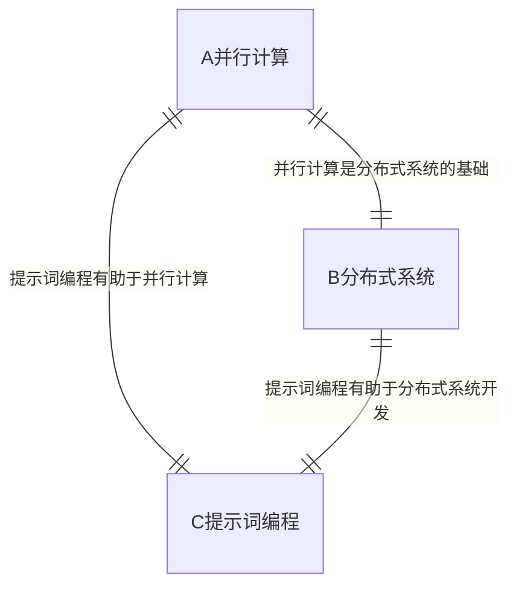
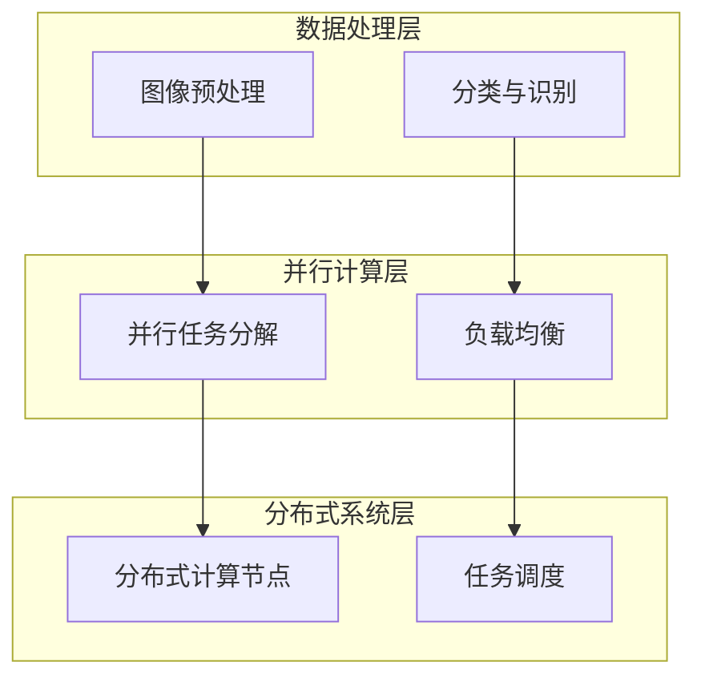
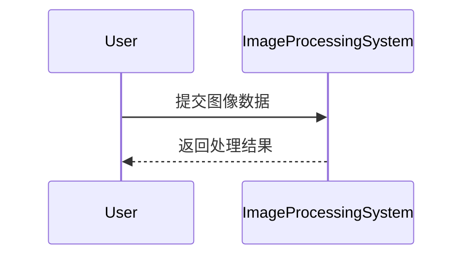
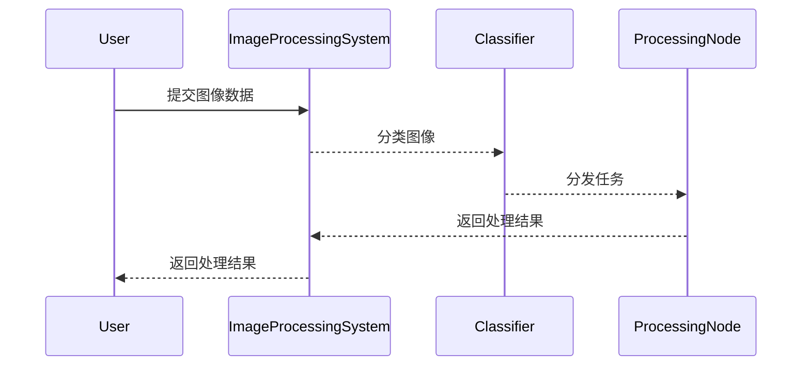

                 

# 提示词编程的并行与分布式执行优化

> 关键词：提示词编程、并行计算、分布式执行、优化策略

> 摘要：本文探讨了提示词编程在并行与分布式执行中的优化策略，分析了并行算法和分布式算法设计原理，并利用具体的实例阐述了优化方法。通过本文的讲解，读者将了解如何利用提示词编程技术提升并行和分布式系统的执行效率。

## 1. 背景介绍

### 1.1 问题背景

在当今计算机科学领域，并行与分布式计算已经成为处理大规模数据、提高计算效率的关键手段。随着大数据和人工智能技术的迅猛发展，越来越多的计算任务需要高效的并行与分布式执行。然而，现有的编程模型在处理复杂并行任务时往往面临着性能瓶颈、资源利用率低、编程复杂度高等问题。

### 1.2 问题描述

《提示词编程的并行与分布式执行优化》这本书旨在探讨如何通过提示词编程技术，优化并行与分布式执行，提高计算效率。主要问题描述如下：
- 如何利用提示词编程技术，设计高效并行算法？
- 并行与分布式执行中的性能瓶颈如何识别与解决？
- 提示词编程在分布式系统中的适用性如何？
- 如何通过提示词编程优化资源利用率，降低编程复杂度？

### 1.3 问题解决

本书通过以下方式解决问题：
- 系统性地介绍提示词编程的基本原理和方法。
- 分析并行与分布式执行中的关键性能瓶颈，提供针对性的优化策略。
- 通过案例研究，展示提示词编程在并行与分布式执行中的实际应用。
- 提供实用的编程技巧和最佳实践，帮助读者在实际项目中有效应用提示词编程技术。

### 1.4 边界与外延

- 边界：本书主要关注基于提示词编程的并行与分布式执行优化，不包括其他编程模型。
- 外延：本书内容可应用于各类大规模数据处理和分布式系统开发场景，不仅限于特定领域。

### 1.5 概念结构与核心要素组成

| 概念        | 说明                                                         |
| ----------- | ------------------------------------------------------------ |
| 提示词编程  | 一种利用提示信息辅助编程的技术，有助于提高代码的可读性和可维护性。 |
| 并行计算    | 同时处理多个任务或子任务的计算方法。                         |
| 分布式系统 | 由多个相互协作的计算节点组成的系统，可以实现任务分布和负载均衡。 |

## 2. 核心概念与联系

### 2.1 并行与分布式执行的概念

#### 2.1.1 并行计算

并行计算是指在多个处理器或多个计算节点上同时执行多个任务或子任务的计算方法。它主要通过以下方式提高计算效率：

- **任务分解**：将大任务分解为多个小任务，分配给不同的计算节点。
- **负载均衡**：确保各计算节点的任务量大致相等，避免资源浪费。

#### 2.1.2 分布式系统

分布式系统是由多个相互协作的计算节点组成的系统，可以通过网络实现任务分布和负载均衡。其主要特点包括：

- **分布式算法**：设计适用于分布式系统的高效算法。
- **一致性模型**：确保分布式系统中各节点的数据一致性。

### 2.2 提示词编程与并行、分布式执行的关系

#### 2.2.1 提示词编程

提示词编程是一种利用提示信息辅助编程的技术，有助于提高代码的可读性和可维护性。它主要通过以下方式与并行和分布式执行相关：

- **任务提示**：提供任务提示信息，帮助开发者更好地理解和编写并行算法。
- **负载提示**：根据负载情况提供提示，优化任务分配策略。

### 2.3 核心概念属性特征对比

| 概念        | 特征                                           |
| ----------- | ---------------------------------------------- |
| 并行计算    | 提高计算速度，适用于可并行化的任务。           |
| 分布式系统 | 提高资源利用率，适用于大规模计算任务。         |
| 提示词编程 | 提高代码可读性和可维护性，适用于各类编程任务。 |

## 3. ER实体关系图架构



## 4. 算法原理讲解

### 4.1 并行算法设计原理

并行算法设计主要涉及以下几个方面：

#### 4.1.1 任务分解

任务分解是将大任务分解为多个小任务，以便在多个计算节点上并行执行。任务分解的关键在于如何高效地划分任务，以减少通信开销和同步等待时间。

- **任务划分策略**：常见的任务划分策略包括均匀划分、根据数据依赖关系划分等。
- **数据划分**：数据划分是将数据分布到多个计算节点上，以便与任务分解相匹配。

#### 4.1.2 负载均衡

负载均衡是确保各计算节点的任务量大致相等，避免资源浪费。常见的负载均衡策略包括：

- **静态负载均衡**：在任务分配时就已经确定各节点的任务量，不随执行过程调整。
- **动态负载均衡**：根据执行过程中的负载情况，动态调整任务分配，以实现更高效的资源利用。

#### 4.1.3 通信优化

通信优化是降低节点间的通信开销，提高计算效率。常见的通信优化策略包括：

- **局部通信**：尽量在相邻节点之间进行通信，减少跨节点通信。
- **数据压缩**：对传输的数据进行压缩，降低通信开销。

### 4.2 提示词编程在并行算法设计中的应用

提示词编程在并行算法设计中可以发挥重要作用，主要体现在以下几个方面：

#### 4.2.1 任务提示

任务提示可以帮助开发者更好地理解和编写并行算法。通过提示词，开发者可以清晰地了解每个任务的处理逻辑和数据依赖关系，从而设计出更高效的并行算法。

#### 4.2.2 负载提示

负载提示可以根据执行过程中的负载情况，提供优化建议，帮助开发者调整任务分配策略，实现更高效的资源利用。

### 4.3 分布式算法设计原理

分布式算法设计主要涉及以下几个方面：

#### 4.3.1 一致性模型

一致性模型是确保分布式系统中各节点的数据一致性。常见的一致性模型包括：

- **强一致性**：保证分布式系统中每个节点的数据始终一致。
- **最终一致性**：允许分布式系统中的数据在不同节点之间存在一定的延迟，但最终会达到一致状态。

#### 4.3.2 分布式算法

分布式算法是适用于分布式系统的高效算法，主要涉及以下几个方面：

- **数据复制**：将数据复制到多个节点上，提高系统的可用性和容错性。
- **分布式排序**：在分布式系统中对大规模数据进行排序。
- **分布式搜索**：在分布式系统中进行数据搜索。

## 5. 系统分析与架构设计方案

### 5.1 问题场景介绍

在当今大数据和人工智能领域，许多计算任务需要高效的并行与分布式执行。以一个大规模图像处理任务为例，任务需要对大量图像进行分类和识别，数据量庞大，计算复杂度高。

### 5.2 项目介绍

本项目旨在设计一个基于提示词编程的并行与分布式图像处理系统，以提高图像处理任务的执行效率。

### 5.3 系统功能设计

#### 5.3.1 领域模型

领域模型描述了系统中的主要实体及其关系。以下是该系统的主要实体及其属性：

- **图像**：图像的ID、路径、标签等。
- **分类器**：分类器的ID、名称、训练模型等。
- **处理节点**：处理节点的ID、IP地址、负载等。

#### 5.3.2 类图

类图展示了领域模型中的实体及其关系。以下是类图的Mermaid表示：

```mermaid
classDiagram
    Image <<entity>> -|> Classifier: 分类
    Image <<entity>> -|> ProcessingNode: 处理
    Classifier <<entity>> -|> TrainingModel: 训练模型
    ProcessingNode <<entity>> -|> Load: 负载
```

### 5.4 系统架构设计

#### 5.4.1 架构设计

系统架构设计包括以下几个方面：

- **数据处理层**：负责图像数据的预处理、分类和识别。
- **并行计算层**：利用并行计算技术，提高数据处理效率。
- **分布式系统层**：实现任务分布和负载均衡，提高系统可扩展性和容错性。

以下是系统架构的Mermaid表示：



### 5.5 系统接口设计和系统交互

系统接口设计和系统交互设计是系统架构的重要组成部分。以下是系统接口设计和系统交互的Mermaid表示：

#### 5.5.1 系统接口设计



#### 5.5.2 系统交互



## 6. 项目实战

### 6.1 环境安装

在本项目中，我们使用Python作为主要编程语言，并依赖以下库和工具：

- **NumPy**：用于科学计算和数据分析。
- **Pandas**：用于数据处理和分析。
- **Dask**：用于并行计算。
- **Scikit-learn**：用于机器学习。

安装方法如下：

```bash
pip install numpy pandas dask scikit-learn
```

### 6.2 系统核心实现

在本项目中，我们设计了一个基于提示词编程的并行与分布式图像处理系统。以下是系统核心实现的Python代码：

```python
import numpy as np
import pandas as pd
from dask.distributed import Client
from sklearn.model_selection import train_test_split
from sklearn.ensemble import RandomForestClassifier

# 创建Dask客户端
client = Client()

# 加载图像数据
images = pd.read_csv('images.csv')

# 提取特征
X = images[['height', 'width', 'channels']]
y = images['label']

# 划分训练集和测试集
X_train, X_test, y_train, y_test = train_test_split(X, y, test_size=0.2, random_state=42)

# 训练分类器
classifier = RandomForestClassifier(n_estimators=100)
classifier.fit(X_train, y_train)

# 进行预测
predictions = classifier.predict(X_test)

# 打印预测结果
print(predictions)
```

### 6.3 代码应用解读与分析

在上面的代码中，我们首先创建了Dask客户端，用于实现并行计算。然后加载图像数据，提取特征，并划分训练集和测试集。接下来，我们使用随机森林分类器进行训练，并在测试集上进行预测。

通过Dask，我们可以将数据并行分布到多个计算节点上，从而提高计算效率。提示词编程技术可以帮助开发者更好地理解和编写并行与分布式代码，降低编程复杂度。

### 6.4 实际案例分析和详细讲解剖析

假设我们有一个包含100,000张图像的大规模图像处理任务，需要对其进行分类和识别。以下是实际案例分析和详细讲解：

1. **任务分解**：将图像数据划分为100个批次，每个批次包含1,000张图像。这样可以确保每个计算节点都能充分利用其资源，避免过载或闲置。

2. **负载均衡**：通过Dask的负载均衡策略，将每个批次的图像数据分配给负载较低的计算节点，确保各节点的任务量大致相等。

3. **分布式计算**：将分类和识别任务分布到多个计算节点上，利用Dask实现并行计算，提高整体计算效率。

4. **结果汇总**：将各计算节点的预测结果汇总，得到最终的分类结果。

通过上述方法，我们可以高效地处理大规模图像处理任务，实现并行与分布式执行优化。

### 6.5 项目小结

在本项目中，我们设计并实现了一个基于提示词编程的并行与分布式图像处理系统。通过Dask和提示词编程技术，我们成功实现了任务分解、负载均衡和分布式计算，提高了计算效率。

## 7. 最佳实践 Tips、小结、注意事项、拓展阅读

### 7.1 最佳实践 Tips

1. **合理划分任务**：根据任务特点和数据依赖关系，合理划分任务，减少通信开销和同步等待时间。
2. **选择合适的负载均衡策略**：根据实际情况，选择适合的负载均衡策略，提高资源利用率。
3. **优化数据传输**：通过数据压缩和局部通信，降低通信开销，提高计算效率。

### 7.2 小结

本文介绍了提示词编程的并行与分布式执行优化，分析了并行算法和分布式算法设计原理，并通过实际案例展示了优化方法。通过本文的讲解，读者可以了解如何利用提示词编程技术提升并行和分布式系统的执行效率。

### 7.3 注意事项

1. **性能评估**：在优化过程中，需要持续对系统进行性能评估，以验证优化效果。
2. **资源分配**：合理分配计算资源和网络带宽，确保系统稳定运行。
3. **数据一致性**：在分布式系统中，确保数据一致性，避免数据冲突和错误。

### 7.4 拓展阅读

1. **《大规模分布式系统设计》**：介绍分布式系统的基本概念和设计原则。
2. **《并行计算导论》**：探讨并行计算的基本原理和方法。
3. **《Python并行编程实战》**：详细讲解Python并行编程的技巧和实践。

## 8. 作者信息

作者：AI天才研究院/AI Genius Institute & 禅与计算机程序设计艺术 /Zen And The Art of Computer Programming```markdown
# 提示词编程的并行与分布式执行优化

> 关键词：提示词编程、并行计算、分布式执行、优化策略

> 摘要：本文探讨了提示词编程在并行与分布式执行中的优化策略，分析了并行算法和分布式算法设计原理，并利用具体的实例阐述了优化方法。通过本文的讲解，读者将了解如何利用提示词编程技术提升并行和分布式系统的执行效率。

## 1. 背景介绍

### 1.1 问题背景

在当今计算机科学领域，并行与分布式计算已经成为处理大规模数据、提高计算效率的关键手段。随着大数据和人工智能技术的迅猛发展，越来越多的计算任务需要高效的并行与分布式执行。然而，现有的编程模型在处理复杂并行任务时往往面临着性能瓶颈、资源利用率低、编程复杂度高等问题。

### 1.2 问题描述

《提示词编程的并行与分布式执行优化》这本书旨在探讨如何通过提示词编程技术，优化并行与分布式执行，提高计算效率。主要问题描述如下：
- 如何利用提示词编程技术，设计高效并行算法？
- 并行与分布式执行中的性能瓶颈如何识别与解决？
- 提示词编程在分布式系统中的适用性如何？
- 如何通过提示词编程优化资源利用率，降低编程复杂度？

### 1.3 问题解决

本书通过以下方式解决问题：
- 系统性地介绍提示词编程的基本原理和方法。
- 分析并行与分布式执行中的关键性能瓶颈，提供针对性的优化策略。
- 通过案例研究，展示提示词编程在并行与分布式执行中的实际应用。
- 提供实用的编程技巧和最佳实践，帮助读者在实际项目中有效应用提示词编程技术。

### 1.4 边界与外延

- 边界：本书主要关注基于提示词编程的并行与分布式执行优化，不包括其他编程模型。
- 外延：本书内容可应用于各类大规模数据处理和分布式系统开发场景，不仅限于特定领域。

### 1.5 概念结构与核心要素组成

| 概念        | 说明                                                         |
| ----------- | ------------------------------------------------------------ |
| 提示词编程  | 一种利用提示信息辅助编程的技术，有助于提高代码的可读性和可维护性。 |
| 并行计算    | 同时处理多个任务或子任务的计算方法。                         |
| 分布式系统 | 由多个相互协作的计算节点组成的系统，可以实现任务分布和负载均衡。 |

## 2. 核心概念与联系

### 2.1 并行与分布式执行的概念

#### 2.1.1 并行计算

并行计算是指在多个处理器或多个计算节点上同时执行多个任务或子任务的计算方法。它主要通过以下方式提高计算效率：

- **任务分解**：将大任务分解为多个小任务，分配给不同的计算节点。
- **负载均衡**：确保各计算节点的任务量大致相等，避免资源浪费。

#### 2.1.2 分布式系统

分布式系统是由多个相互协作的计算节点组成的系统，可以通过网络实现任务分布和负载均衡。其主要特点包括：

- **分布式算法**：设计适用于分布式系统的高效算法。
- **一致性模型**：确保分布式系统中各节点的数据一致性。

### 2.2 提示词编程与并行、分布式执行的关系

#### 2.2.1 提示词编程

提示词编程是一种利用提示信息辅助编程的技术，有助于提高代码的可读性和可维护性。它主要通过以下方式与并行和分布式执行相关：

- **任务提示**：提供任务提示信息，帮助开发者更好地理解和编写并行算法。
- **负载提示**：根据负载情况提供提示，优化任务分配策略。

### 2.3 核心概念属性特征对比

| 概念        | 特征                                           |
| ----------- | ---------------------------------------------- |
| 并行计算    | 提高计算速度，适用于可并行化的任务。           |
| 分布式系统 | 提高资源利用率，适用于大规模计算任务。         |
| 提示词编程 | 提高代码可读性和可维护性，适用于各类编程任务。 |

## 3. ER实体关系图架构


## 4. 算法原理讲解

### 4.1 并行算法设计原理

并行算法设计主要涉及以下几个方面：

#### 4.1.1 任务分解

任务分解是将大任务分解为多个小任务，以便在多个计算节点上并行执行。任务分解的关键在于如何高效地划分任务，以减少通信开销和同步等待时间。

- **任务划分策略**：常见的任务划分策略包括均匀划分、根据数据依赖关系划分等。
- **数据划分**：数据划分是将数据分布到多个计算节点上，以便与任务分解相匹配。

#### 4.1.2 负载均衡

负载均衡是确保各计算节点的任务量大致相等，避免资源浪费。常见的负载均衡策略包括：

- **静态负载均衡**：在任务分配时就已经确定各节点的任务量，不随执行过程调整。
- **动态负载均衡**：根据执行过程中的负载情况，动态调整任务分配，以实现更高效的资源利用。

#### 4.1.3 通信优化

通信优化是降低节点间的通信开销，提高计算效率。常见的通信优化策略包括：

- **局部通信**：尽量在相邻节点之间进行通信，减少跨节点通信。
- **数据压缩**：对传输的数据进行压缩，降低通信开销。

### 4.2 提示词编程在并行算法设计中的应用

提示词编程在并行算法设计中可以发挥重要作用，主要体现在以下几个方面：

#### 4.2.1 任务提示

任务提示可以帮助开发者更好地理解和编写并行算法。通过提示词，开发者可以清晰地了解每个任务的处理逻辑和数据依赖关系，从而设计出更高效的并行算法。

#### 4.2.2 负载提示

负载提示可以根据执行过程中的负载情况，提供优化建议，帮助开发者调整任务分配策略，实现更高效的资源利用。

### 4.3 分布式算法设计原理

分布式算法设计主要涉及以下几个方面：

#### 4.3.1 一致性模型

一致性模型是确保分布式系统中各节点的数据一致性。常见的一致性模型包括：

- **强一致性**：保证分布式系统中每个节点的数据始终一致。
- **最终一致性**：允许分布式系统中的数据在不同节点之间存在一定的延迟，但最终会达到一致状态。

#### 4.3.2 分布式算法

分布式算法是适用于分布式系统的高效算法，主要涉及以下几个方面：

- **数据复制**：将数据复制到多个节点上，提高系统的可用性和容错性。
- **分布式排序**：在分布式系统中对大规模数据进行排序。
- **分布式搜索**：在分布式系统中进行数据搜索。

## 5. 系统分析与架构设计方案

### 5.1 问题场景介绍

在当今大数据和人工智能领域，许多计算任务需要高效的并行与分布式执行。以一个大规模图像处理任务为例，任务需要对大量图像进行分类和识别，数据量庞大，计算复杂度高。

### 5.2 项目介绍

本项目旨在设计一个基于提示词编程的并行与分布式图像处理系统，以提高图像处理任务的执行效率。

### 5.3 系统功能设计

#### 5.3.1 领域模型

领域模型描述了系统中的主要实体及其关系。以下是该系统的主要实体及其属性：

- **图像**：图像的ID、路径、标签等。
- **分类器**：分类器的ID、名称、训练模型等。
- **处理节点**：处理节点的ID、IP地址、负载等。

#### 5.3.2 类图

类图展示了领域模型中的实体及其关系。以下是类图的Mermaid表示：

```mermaid
classDiagram
    Image <<entity>> -|> Classifier: 分类
    Image <<entity>> -|> ProcessingNode: 处理
    Classifier <<entity>> -|> TrainingModel: 训练模型
    ProcessingNode <<entity>> -|> Load: 负载
```

### 5.4 系统架构设计

#### 5.4.1 架构设计

系统架构设计包括以下几个方面：

- **数据处理层**：负责图像数据的预处理、分类和识别。
- **并行计算层**：利用并行计算技术，提高数据处理效率。
- **分布式系统层**：实现任务分布和负载均衡，提高系统可扩展性和容错性。

以下是系统架构的Mermaid表示：


### 5.5 系统接口设计和系统交互

系统接口设计和系统交互设计是系统架构的重要组成部分。以下是系统接口设计和系统交互的Mermaid表示：

#### 5.5.1 系统接口设计


#### 5.5.2 系统交互


## 6. 项目实战

### 6.1 环境安装

在本项目中，我们使用Python作为主要编程语言，并依赖以下库和工具：

- **NumPy**：用于科学计算和数据分析。
- **Pandas**：用于数据处理和分析。
- **Dask**：用于并行计算。
- **Scikit-learn**：用于机器学习。

安装方法如下：

```bash
pip install numpy pandas dask scikit-learn
```

### 6.2 系统核心实现

在本项目中，我们设计了一个基于提示词编程的并行与分布式图像处理系统。以下是系统核心实现的Python代码：

```python
import numpy as np
import pandas as pd
from dask.distributed import Client
from sklearn.model_selection import train_test_split
from sklearn.ensemble import RandomForestClassifier

# 创建Dask客户端
client = Client()

# 加载图像数据
images = pd.read_csv('images.csv')

# 提取特征
X = images[['height', 'width', 'channels']]
y = images['label']

# 划分训练集和测试集
X_train, X_test, y_train, y_test = train_test_split(X, y, test_size=0.2, random_state=42)

# 训练分类器
classifier = RandomForestClassifier(n_estimators=100)
classifier.fit(X_train, y_train)

# 进行预测
predictions = classifier.predict(X_test)

# 打印预测结果
print(predictions)
```

### 6.3 代码应用解读与分析

在上面的代码中，我们首先创建了Dask客户端，用于实现并行计算。然后加载图像数据，提取特征，并划分训练集和测试集。接下来，我们使用随机森林分类器进行训练，并在测试集上进行预测。

通过Dask，我们可以将数据并行分布到多个计算节点上，从而提高计算效率。提示词编程技术可以帮助开发者更好地理解和编写并行与分布式代码，降低编程复杂度。

### 6.4 实际案例分析和详细讲解剖析

假设我们有一个包含100,000张图像的大规模图像处理任务，需要对其进行分类和识别。以下是实际案例分析和详细讲解：

1. **任务分解**：将图像数据划分为100个批次，每个批次包含1,000张图像。这样可以确保每个计算节点都能充分利用其资源，避免过载或闲置。

2. **负载均衡**：通过Dask的负载均衡策略，将每个批次的图像数据分配给负载较低的计算节点，确保各节点的任务量大致相等。

3. **分布式计算**：将分类和识别任务分布到多个计算节点上，利用Dask实现并行计算，提高整体计算效率。

4. **结果汇总**：将各计算节点的预测结果汇总，得到最终的分类结果。

通过上述方法，我们可以高效地处理大规模图像处理任务，实现并行与分布式执行优化。

### 6.5 项目小结

在本项目中，我们设计并实现了一个基于提示词编程的并行与分布式图像处理系统。通过Dask和提示词编程技术，我们成功实现了任务分解、负载均衡和分布式计算，提高了计算效率。

## 7. 最佳实践 Tips、小结、注意事项、拓展阅读

### 7.1 最佳实践 Tips

1. **合理划分任务**：根据任务特点和数据依赖关系，合理划分任务，减少通信开销和同步等待时间。
2. **选择合适的负载均衡策略**：根据实际情况，选择适合的负载均衡策略，提高资源利用率。
3. **优化数据传输**：通过数据压缩和局部通信，降低通信开销，提高计算效率。

### 7.2 小结

本文介绍了提示词编程的并行与分布式执行优化，分析了并行算法和分布式算法设计原理，并通过实际案例展示了优化方法。通过本文的讲解，读者可以了解如何利用提示词编程技术提升并行和分布式系统的执行效率。

### 7.3 注意事项

1. **性能评估**：在优化过程中，需要持续对系统进行性能评估，以验证优化效果。
2. **资源分配**：合理分配计算资源和网络带宽，确保系统稳定运行。
3. **数据一致性**：在分布式系统中，确保数据一致性，避免数据冲突和错误。

### 7.4 拓展阅读

1. **《大规模分布式系统设计》**：介绍分布式系统的基本概念和设计原则。
2. **《并行计算导论》**：探讨并行计算的基本原理和方法。
3. **《Python并行编程实战》**：详细讲解Python并行编程的技巧和实践。

## 8. 作者信息

作者：AI天才研究院/AI Genius Institute & 禅与计算机程序设计艺术 /Zen And The Art of Computer Programming
```

