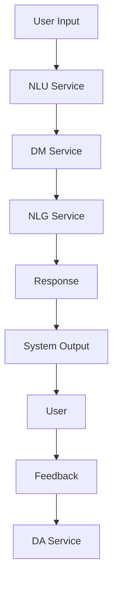
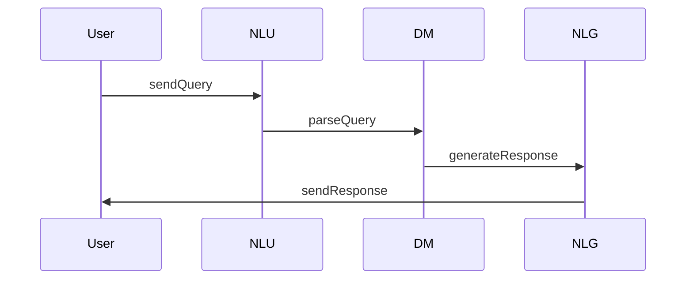
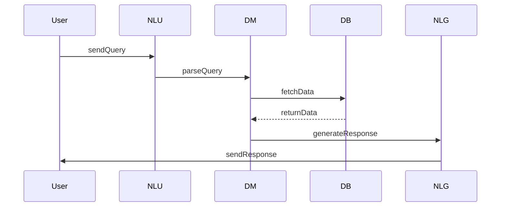

                 

### 引言与背景

#### 1.1 研究背景

在信息技术快速发展的今天，编程已经成为各个领域不可或缺的核心技能。从简单的脚本编写到复杂的系统开发，编程语言和编程方法层出不穷。然而，传统的编程方法往往依赖于人类的经验和直觉，容易出现错误和难以验证。为了解决这些问题，形式化方法和定理证明在计算机科学中的应用日益受到关注。

**问题背景与需求：**  
首先，软件错误对企业和用户带来的损失是巨大的。根据美国国家研究委员会（National Research Council）的数据，每年因软件错误造成的经济损失高达6000亿美元。形式化方法通过精确的数学描述和严格的逻辑推理，能够有效地减少软件中的错误，提高系统的可靠性和安全性。其次，随着软件系统变得越来越复杂，传统的编程方法已经难以应对。形式化方法提供了一种结构化的思维方式，使得开发者能够更清晰地理解系统的结构和行为。

**形式化方法与定理证明在计算机科学中的重要性：**  
形式化方法是一种用数学语言描述程序和系统的方法，它强调逻辑的严谨性和精确性。形式化方法在计算机科学中有广泛的应用，包括软件工程、硬件设计、安全与验证等领域。定理证明则是形式化方法的一个重要组成部分，它通过数学方法证明程序的正确性。定理证明不仅能够验证程序的逻辑正确性，还可以帮助发现潜在的错误和漏洞。

**提示词编程的兴起与发展：**  
提示词编程是一种新兴的编程范式，它通过使用自然语言中的关键词来描述程序的功能和逻辑。提示词编程的核心思想是将编程语言与自然语言相结合，使得开发者可以使用更自然、更易于理解的方式编写程序。提示词编程的出现，为形式化方法和定理证明提供了新的应用场景。通过将形式化方法和定理证明引入提示词编程，我们可以进一步提高程序的可靠性和正确性。

#### 1.2 关键概念

在深入探讨提示词编程的形式化方法和定理证明之前，我们需要明确几个关键概念：形式化方法、定理证明以及提示词编程。

**形式化方法的基本概念：**  
形式化方法是一种用数学语言描述系统、程序或算法的方法。它通过精确的符号表示和严格的逻辑推理，将问题转化为数学问题，从而使得问题更容易分析和解决。形式化方法的核心思想是将问题形式化为一个数学模型，然后通过数学方法求解。

**定理证明的基本概念：**  
定理证明是一种数学方法，用于证明某个命题的正确性。在计算机科学中，定理证明主要用于证明程序的正确性。定理证明的基本步骤包括：定义问题的数学模型、构造证明框架、逐步推导出结论。

**提示词编程的定义与特点：**  
提示词编程是一种使用自然语言中的关键词来描述程序功能的方法。提示词编程的特点包括：易读性、可解释性和灵活性。提示词编程使得开发者可以使用更自然、更易于理解的方式编写程序，同时提高了程序的可维护性和可扩展性。

**目标与结构：**  
本研究的目的是探讨提示词编程的形式化方法和定理证明，并分析其在提高程序可靠性、正确性和可维护性方面的作用。本书的结构安排如下：第1章介绍研究的背景和关键概念；第2章和第3章分别介绍形式化方法和提示词编程的基础知识；第4章至第7章分别探讨形式化方法与定理证明在提示词编程中的应用；第8章总结研究成果，并提出未来研究方向。

通过上述章节的安排，我们希望能够系统、深入地探讨提示词编程的形式化方法和定理证明，为该领域的研究和应用提供有益的参考。

---

### 形式化方法基础

#### 2.1 形式化方法概述

**形式化方法的起源与发展：**  
形式化方法起源于20世纪中叶，当时计算机科学刚刚起步。为了解决软件系统中的复杂性和不确定性问题，研究者开始探索用数学语言来描述程序和系统。1940年代末，阿尔图尔·波斯特（Alonzo Church）和艾尔温·鲁宾逊（Emil Post）提出了λ-演算，这被认为是最早的形式化方法之一。此后，形式化方法得到了迅速发展，逐渐形成了多个分支，如类型系统、模型检查和形式验证等。

**形式化方法的分类与应用场景：**  
形式化方法可以根据其应用场景和目的进行分类。以下是几种常见的形式化方法及其应用场景：

1. **类型系统：** 类型系统是一种用于确保程序在运行时不会发生意外的形式化方法。它通过为变量和函数赋予类型，确保程序中的操作符合预期。类型系统广泛应用于编程语言的设计和编译器实现中。

2. **模型检查：** 模型检查是一种用于验证系统是否满足特定属性的方法。它通过将系统建模为一个状态机，然后检查所有可能的系统状态，以确定系统是否满足指定的属性。模型检查广泛应用于嵌入式系统、网络协议和软件系统等。

3. **形式验证：** 形式验证是一种用于证明程序或系统在所有情况下都满足特定属性的方法。形式验证通过严格的数学推理，证明程序的正确性或错误性。形式验证广泛应用于安全关键系统、航空航天系统和金融系统等。

**形式化方法在计算机科学中的重要性：**  
形式化方法在计算机科学中具有极高的重要性。首先，形式化方法可以提高软件系统的可靠性和安全性。通过精确的数学描述和严格的逻辑推理，形式化方法能够发现并解决程序中的潜在错误。其次，形式化方法有助于提高软件开发过程的效率。形式化方法提供了一种结构化的思维方式，使得开发者能够更清晰地理解系统的结构和行为。最后，形式化方法为自动化工具的开发提供了基础。随着形式化方法的不断发展，越来越多的自动化工具被开发出来，用于辅助软件开发和验证。

#### 2.2 形式化语言

**形式化语言的基本概念：**  
形式化语言是一种用于形式化描述系统、程序或算法的数学语言。形式化语言通常包括一组语法规则和语义规则。语法规则定义了语言中的符号和结构，语义规则定义了符号和结构的含义。形式化语言的核心思想是精确性和一致性，通过使用形式化语言，开发者可以更准确地描述系统和程序的行为。

**常见的形式化语言介绍：**  
以下是几种常见的形式化语言及其特点：

1. **π-演算：** π-演算是λ-演算的一个扩展，它引入了通道（channel）和通信（communication）的概念。π-演算广泛应用于并发计算和分布式系统的形式化描述。

2. **TLA+：** TLA+（Temporal Logic of Actions）是一种用于描述系统行为的时态逻辑语言。TLA+结合了类PDL（Property-Driven Design Language）和类Hoare逻辑，能够有效地描述和验证系统的行为。

3. **Coq：** Coq是一种基于类型的交互式证明助手（Interactive Theorem Prover），它支持编写和验证形式化的数学证明。Coq广泛应用于计算机科学中的形式化验证和定理证明。

**形式化方法在软件工程中的应用：**  
形式化方法在软件工程中的应用非常广泛。以下是几个典型的应用场景：

1. **需求分析：** 形式化方法可以帮助开发者更清晰地理解和描述系统的需求。通过使用形式化语言，开发者可以准确地定义系统的功能和约束。

2. **设计验证：** 形式化方法可以用于验证系统设计是否满足需求。通过使用模型检查和形式验证等方法，开发者可以确保设计中的所有假设和假设条件都得到满足。

3. **代码生成：** 形式化方法可以用于自动化代码生成。通过将系统需求形式化为数学模型，开发者可以使用形式化方法生成满足需求的代码。

**形式化方法在硬件设计中的应用：**  
形式化方法在硬件设计中的应用同样重要。以下是几个典型的应用场景：

1. **验证：** 形式化方法可以用于验证硬件设计的正确性。通过使用形式化方法，硬件设计师可以确保设计中的所有逻辑和时序约束都得到满足。

2. **优化：** 形式化方法可以用于优化硬件设计。通过将设计形式化为数学模型，设计师可以使用形式化方法发现设计中的瓶颈和冗余，从而优化设计。

3. **测试：** 形式化方法可以用于生成硬件测试用例。通过使用形式化方法，硬件测试人员可以确保测试用例能够全面覆盖硬件设计的所有路径和状态。

**形式化方法在安全与验证中的应用：**  
形式化方法在安全与验证中的应用非常重要。以下是几个典型的应用场景：

1. **安全协议设计：** 形式化方法可以用于设计安全协议。通过使用形式化方法，安全协议的设计者可以确保协议的完整性和保密性。

2. **漏洞发现：** 形式化方法可以用于发现软件和硬件中的漏洞。通过使用形式化方法，安全专家可以系统地分析系统的行为，发现潜在的安全隐患。

3. **形式化验证：** 形式化方法可以用于验证系统的安全属性。通过使用形式化验证方法，安全专家可以确保系统在实际运行中满足预定的安全要求。

**形式化方法的优势与挑战：**  
形式化方法具有许多优势，但也面临一些挑战。以下是形式化方法的优势和挑战：

1. **优势：**  
   - 提高系统的可靠性和安全性：形式化方法通过精确的数学描述和严格的逻辑推理，能够有效减少系统中的错误和漏洞。
   - 提高开发效率：形式化方法提供了一种结构化的思维方式，使得开发者能够更清晰地理解系统的结构和行为，从而提高开发效率。
   - 自动化工具的支持：形式化方法的不断发展，使得越来越多的自动化工具被开发出来，用于辅助软件开发和验证。

2. **挑战：**  
   - 学习难度：形式化方法通常需要一定的数学和编程基础，对于初学者来说可能有一定难度。
   - 人力成本：形式化方法的应用通常需要较高的技能和经验，因此可能会增加人力成本。
   - 适应性：形式化方法在某些场景下可能难以适应复杂和动态的系统。

通过上述内容，我们了解了形式化方法的起源、发展、分类和应用。形式化方法在计算机科学中具有重要作用，能够提高软件系统的可靠性和安全性，同时面临一些挑战。接下来，我们将进一步探讨提示词编程的基本原理和特点。

---

### 提示词编程基本原理

#### 3.1 提示词编程概述

**提示词编程的定义与特点：**  
提示词编程（Keyword Programming）是一种新兴的编程范式，它通过使用自然语言中的关键词来描述程序的功能和逻辑。与传统的编程范式相比，提示词编程具有以下几个显著特点：

1. **易读性：** 提示词编程使用自然语言作为编程语言，使得程序代码更易于阅读和理解。开发者可以像编写自然语言文本一样编写程序，从而降低了学习难度。

2. **可解释性：** 提示词编程使得程序的逻辑和功能更加直观，便于开发者和其他人员理解和解释。这种可解释性有助于提高程序的可维护性和可扩展性。

3. **灵活性：** 提示词编程允许开发者根据需求灵活地修改和扩展程序功能，使得程序更具适应性。

**提示词编程的优势与挑战：**  
提示词编程在多个方面具有优势，但也面临一些挑战。以下是提示词编程的优势和挑战：

1. **优势：**  
   - **易学易用：** 提示词编程使用自然语言，降低了学习门槛，使得更多非专业开发者能够快速上手编程。
   - **提高开发效率：** 提示词编程使得开发者能够更专注于业务逻辑的实现，从而提高开发效率。
   - **增强可维护性：** 提示词编程使得程序代码更加简洁和直观，有助于提高程序的可维护性。

2. **挑战：**  
   - **性能限制：** 提示词编程依赖于自然语言处理技术，这在某些情况下可能会影响程序的性能。
   - **语法限制：** 自然语言的复杂性可能导致提示词编程的语法限制，使得程序编写变得复杂。
   - **准确性问题：** 提示词编程依赖于自然语言处理技术，这可能导致理解上的歧义和错误。

**提示词编程的发展历程：**  
提示词编程的起源可以追溯到自然语言处理（Natural Language Processing, NLP）和人工智能（Artificial Intelligence, AI）领域。早期的自然语言处理技术主要用于机器翻译和文本分类等任务。随着人工智能技术的不断发展，研究人员开始探索如何将自然语言处理技术应用于编程领域。

2000年代初期，随着基于规则的自然语言处理技术的出现，提示词编程开始逐渐受到关注。开发者开始尝试使用自然语言来编写程序，从而提高了编程的易读性和可解释性。然而，早期的提示词编程技术存在一些局限性，如对复杂语法结构的支持不足等。

随着深度学习技术的兴起，提示词编程得到了进一步发展。深度学习技术使得自然语言处理模型能够更好地理解和生成自然语言，从而提高了提示词编程的准确性和灵活性。近年来，越来越多的编程语言和框架开始支持提示词编程，如Python、JavaScript和Google的TensorFlow等。

**提示词编程的当前状态：**  
当前，提示词编程已经成为人工智能和自然语言处理领域的一个重要研究方向。越来越多的开发者和研究人员开始关注如何将自然语言处理技术应用于编程领域，以实现更高效、更准确的编程体验。

在工业界，许多公司已经开始使用提示词编程来提高软件开发的效率和质量。例如，Google的TensorFlow和微软的Azure都是基于提示词编程的框架，使得开发者可以使用自然语言来定义和优化机器学习模型。

学术界也在积极研究提示词编程的理论和方法，探索如何进一步提高提示词编程的准确性和可扩展性。一些研究还尝试将提示词编程与其他编程范式相结合，以实现更强大的编程能力。

**提示词编程的应用领域：**  
提示词编程在多个领域具有广泛的应用前景。以下是几个典型的应用领域：

1. **自动化编程：** 提示词编程可以用于自动化编程任务，如代码生成、代码优化和代码重构等。通过使用自然语言描述程序的功能和逻辑，开发者可以更轻松地实现自动化编程。

2. **自然语言交互：** 提示词编程可以用于构建自然语言交互系统，如语音助手、聊天机器人和智能客服等。这些系统能够更好地理解用户的需求和意图，从而提供更优质的用户体验。

3. **数据科学：** 提示词编程可以用于数据科学任务，如数据分析、数据可视化和数据建模等。通过使用自然语言来描述数据分析任务，开发者可以更轻松地实现复杂数据分析过程。

4. **软件工程：** 提示词编程可以用于软件工程任务，如需求分析、设计验证和代码审查等。通过使用自然语言描述软件需求和设计，开发者可以更清晰地理解系统需求和约束。

5. **教育领域：** 提示词编程可以用于教育领域，如编程教育和智能辅导系统。通过使用自然语言作为编程语言，学生可以更轻松地学习和掌握编程知识。

总之，提示词编程作为一种新兴的编程范式，具有巨大的发展潜力。通过结合形式化方法和定理证明，我们可以进一步提高提示词编程的可靠性和正确性，从而推动编程技术的发展。在下一章中，我们将探讨形式化方法在提示词编程中的应用，分析如何通过形式化方法提高提示词编程的效率和准确性。

---

### 形式化方法与提示词编程的结合

#### 4.1 形式化方法在提示词编程中的应用

**形式化方法在提示词编程中的具体应用**  
形式化方法在提示词编程中的应用主要体现在以下几个方面：

1. **语法验证：** 形式化方法可以用于验证提示词编程语言的语法正确性。通过定义提示词编程语言的语法规则，形式化方法可以检查输入的代码是否符合预定的语法结构。这种方法有助于确保程序的语义正确性，并减少编程错误。

2. **语义分析：** 形式化方法可以用于分析提示词编程语言中的语义，以确定程序的行为和功能。通过使用形式化语言，开发者可以更准确地描述程序的功能和逻辑，从而提高程序的可靠性和可维护性。

3. **代码生成：** 形式化方法可以用于自动化代码生成。在提示词编程中，开发者可以使用自然语言描述程序的功能和逻辑，然后通过形式化方法生成满足需求的代码。这种方法有助于提高开发效率，并减少手动编写代码的工作量。

**形式化方法在提高提示词编程可靠性和效率方面的作用**

1. **可靠性提升：** 形式化方法通过严格的逻辑推理和数学描述，可以确保程序的逻辑正确性和语义一致性。这有助于发现和修复程序中的潜在错误，提高程序的可靠性。

2. **效率提高：** 形式化方法提供了一种结构化的思维方式，使得开发者能够更清晰地理解系统的结构和行为。这有助于提高开发效率，减少调试和测试的工作量。

3. **自动化工具的支持：** 形式化方法的不断发展，使得越来越多的自动化工具被开发出来，用于辅助提示词编程。这些工具可以自动化地生成代码、进行语法和语义分析，从而提高开发效率。

**实例分析：**  
为了更好地理解形式化方法在提示词编程中的应用，我们可以通过一个简单的实例来进行分析。

假设我们需要编写一个简单的计算器程序，该程序可以使用自然语言来描述其功能。我们使用形式化方法来验证程序的语法和语义，并生成相应的代码。

1. **自然语言描述：**  
```
计算器程序应该能够接受两个整数输入，然后计算它们的和、差、积和商，并显示结果。
```

2. **形式化描述：**  
使用形式化语言，我们可以将上述自然语言描述转换为形式化表达式：
$$
\text{function Calculator(input1, input2):
    \begin{cases}
        \text{sum} = input1 + input2 \\
        \text{difference} = input1 - input2 \\
        \text{product} = input1 \times input2 \\
        \text{quotient} = input1 / input2 \\
        \text{return sum, difference, product, quotient}
    \end{cases}
}
$$

3. **语法验证：**  
形式化方法可以验证上述表达式的语法正确性，确保其符合形式化语言的语法规则。

4. **语义分析：**  
形式化方法可以分析上述表达式的语义，确定其功能是否符合预期。例如，我们可以验证表达式中各个操作符的使用是否符合数学规则。

5. **代码生成：**  
形式化方法可以根据上述形式化表达式生成相应的代码。例如，我们可以在Python中生成如下代码：
```python
def calculator(input1, input2):
    sum = input1 + input2
    difference = input1 - input2
    product = input1 * input2
    quotient = input1 / input2
    return sum, difference, product, quotient
```

通过上述实例，我们可以看到形式化方法在提示词编程中的应用。它不仅帮助我们验证了程序的语法和语义，还通过自动化代码生成提高了开发效率。

#### 4.2 定理证明在提示词编程中的应用

**定理证明的基本概念与工具**  
定理证明是一种数学方法，用于证明某个命题的正确性。在提示词编程中，定理证明可以用于证明程序的正确性、验证算法的有效性等。

定理证明的基本概念包括命题、证明和证明方法。命题是用于描述程序性质的陈述，证明是用于证明命题正确性的过程，证明方法则是用于证明命题的具体技术手段。

常用的定理证明工具包括Coq、Isabelle和HOL（Higher-Order Logic）等。这些工具提供了形式化描述和证明功能，使得开发者可以更方便地进行定理证明。

**定理证明在提示词编程中的具体应用**  
定理证明在提示词编程中的应用主要体现在以下几个方面：

1. **程序正确性证明：** 通过定理证明，开发者可以证明程序在所有情况下都满足预定的属性。例如，可以使用定理证明来证明一个排序算法的正确性，确保其在所有输入情况下都能正确地排序。

2. **算法有效性证明：** 定理证明可以用于证明算法的有效性，即证明算法能够在合理的时间内完成计算。例如，可以使用定理证明来证明一个搜索算法的时间复杂度，确保其在大数据集上的高效性。

3. **安全性证明：** 在提示词编程中，安全性是一个重要的考虑因素。定理证明可以用于证明程序的安全性，确保其在执行过程中不会受到恶意攻击。

**实例分析：**  
为了更好地理解定理证明在提示词编程中的应用，我们可以通过一个简单的实例来进行分析。

假设我们需要证明一个简单的计算器程序的正确性，该程序使用自然语言描述其功能。我们使用定理证明工具来证明程序的正确性。

1. **自然语言描述：**  
```
计算器程序应该能够接受两个整数输入，然后计算它们的和、差、积和商，并显示结果。
```

2. **形式化描述：**  
使用形式化语言，我们可以将上述自然语言描述转换为形式化表达式：
$$
\text{function Calculator(input1, input2):
    \begin{cases}
        \text{sum} = input1 + input2 \\
        \text{difference} = input1 - input2 \\
        \text{product} = input1 \times input2 \\
        \text{quotient} = input1 / input2 \\
        \text{return sum, difference, product, quotient}
    \end{cases}
}
$$

3. **定理证明：**  
我们使用定理证明工具（如Coq）来证明上述程序的正确性。

   - **证明输入参数：** 证明输入的两个整数是有效的，即它们是整数类型。
   - **证明计算结果：** 证明程序计算出的和、差、积和商是正确的，即它们满足数学运算规则。

4. **证明结果：**  
通过定理证明工具，我们可以得到证明结果，证明计算器程序在所有情况下都满足预定的属性。

通过上述实例，我们可以看到定理证明在提示词编程中的应用。它不仅帮助开发者验证了程序的正确性，还提高了程序的可靠性和安全性。

---

### 提示词编程的形式化验证

#### 5.1 形式化验证概述

**形式化验证的基本概念：**  
形式化验证是一种用于证明系统、程序或算法正确性的数学方法。它通过将系统、程序或算法形式化为一个数学模型，然后使用数学方法验证模型是否满足预定的属性。

形式化验证的核心思想是将问题转化为一个数学问题，然后通过数学推理来证明问题的正确性。形式化验证通常包括以下几个步骤：

1. **模型定义：** 将系统、程序或算法形式化为一个数学模型，通常使用形式化语言来描述模型。

2. **属性定义：** 定义需要验证的系统属性，通常使用形式化语言来描述属性。

3. **验证算法：** 使用数学方法来验证模型是否满足预定的属性。常见的验证算法包括模型检查、符号执行和定理证明等。

4. **验证结果：** 根据验证算法的结果，判断系统、程序或算法是否满足预定的属性。

**形式化验证的类型与工具：**  
形式化验证可以根据其具体方法和应用场景分为多种类型，以下是一些常见的类型和相应的工具：

1. **模型检查（Model Checking）：** 模型检查是一种基于状态空间搜索的验证方法，它通过遍历系统的状态空间来验证系统是否满足指定的属性。常见的模型检查工具包括SPIN、NuSMV和CPN Tools等。

2. **符号执行（Symbolic Execution）：** 符号执行是一种动态分析技术，它通过执行程序的不同路径来验证系统是否满足指定的属性。符号执行工具包括KLEE和PathTalk等。

3. **定理证明（Theorem Proving）：** 定理证明是一种基于数学推理的验证方法，它通过证明系统、程序或算法的属性来验证其正确性。常见的定理证明工具包括Coq、Isabelle和HOL等。

4. **形式化验证工具的选择：** 选择合适的工具进行形式化验证需要考虑多个因素，如系统的规模、复杂性、验证目标等。通常，大型系统适合使用模型检查和符号执行工具，而复杂的系统则适合使用定理证明工具。

#### 5.2 提示词编程的形式化验证方法

**基本验证方法：**  
提示词编程的形式化验证可以采用以下几种基本方法：

1. **模型检查方法：** 使用模型检查工具来验证提示词编程的语法和语义正确性。模型检查工具可以通过遍历提示词编程语言的语法树和语义模型来检查程序是否满足预定的属性。

2. **符号执行方法：** 使用符号执行工具来验证提示词编程程序的运行时行为。符号执行工具可以通过执行程序的符号路径来检查程序是否满足预定的属性。

3. **定理证明方法：** 使用定理证明工具来证明提示词编程程序的正确性。定理证明工具可以通过形式化描述程序的行为和属性，然后使用数学推理来证明程序的正确性。

**特定验证工具的使用：**  
以下是一些用于提示词编程形式化验证的特定验证工具及其特点：

1. **Coq：** Coq是一种基于类型的交互式证明助手，它支持编写和验证形式化的数学证明。Coq适用于复杂和高效的定理证明任务，特别适合用于验证提示词编程程序的正确性。

2. **Isabelle：** Isabelle是一种基于定理证明的验证工具，它支持编写和验证形式化的数学和逻辑证明。Isabelle适用于复杂和高层次的验证任务，特别适合用于验证提示词编程的理论和算法。

3. **SPIN：** SPIN是一种基于模型的验证工具，它主要用于验证并发系统的正确性。SPIN适用于验证提示词编程中涉及并发操作的部分，特别适合用于验证多线程和分布式编程任务。

4. **CPN Tools：** CPN Tools是一种基于彩色的 Petri 网工具，它支持建模和验证复杂系统的行为。CPN Tools适用于验证提示词编程中的并发和分布式编程任务，特别适合用于验证复杂系统和通信协议。

**实例分析：**  
为了更好地理解提示词编程的形式化验证方法，我们可以通过一个简单的实例来进行分析。

假设我们需要验证一个简单的计算器程序，该程序使用自然语言描述其功能。我们使用模型检查和定理证明工具来验证程序的正确性。

1. **自然语言描述：**  
```
计算器程序应该能够接受两个整数输入，然后计算它们的和、差、积和商，并显示结果。
```

2. **形式化描述：**  
使用形式化语言，我们可以将上述自然语言描述转换为形式化表达式：
$$
\text{function Calculator(input1, input2):
    \begin{cases}
        \text{sum} = input1 + input2 \\
        \text{difference} = input1 - input2 \\
        \text{product} = input1 \times input2 \\
        \text{quotient} = input1 / input2 \\
        \text{return sum, difference, product, quotient}
    \end{cases}
}
$$

3. **模型检查方法：**  
我们使用模型检查工具（如NuSMV）来验证计算器程序的语法和语义正确性。

   - **语法验证：** 验证程序是否符合预定的语法结构，确保其语法正确。
   - **语义验证：** 验证程序是否满足预定的语义属性，确保其语义正确。

4. **定理证明方法：**  
我们使用定理证明工具（如Coq）来证明计算器程序的正确性。

   - **定义属性：** 定义计算器程序应满足的属性，如输入的两个整数为有效整数、计算结果正确等。
   - **证明过程：** 使用Coq的交互式证明功能，逐步证明计算器程序满足预定的属性。

5. **验证结果：**  
通过模型检查和定理证明工具，我们可以得到验证结果。如果验证工具报告程序通过验证，则说明计算器程序在所有情况下都满足预定的属性。

通过上述实例，我们可以看到提示词编程的形式化验证方法。模型检查和定理证明工具可以帮助我们验证程序的语法和语义正确性，确保程序在所有情况下都满足预定的属性。

---

### 定理证明在提示词编程中的应用

#### 6.1 定理证明的基本原理

**定理证明的基本原理**  
定理证明是一种数学方法，用于证明某个命题的正确性。在计算机科学中，定理证明主要用于证明程序的正确性、验证算法的有效性等。定理证明的基本原理包括以下几个方面：

1. **命题（Proposition）：** 命题是用于描述程序性质或算法性质的陈述。在定理证明中，我们需要定义需要证明的命题，以便后续的证明过程。

2. **证明（Proof）：** 证明是用于证明命题正确性的过程。证明通常分为直接证明和间接证明两种方法。直接证明是通过直接推导出命题的正确性，而间接证明则是通过反证法证明命题的否定错误，从而证明原命题的正确性。

3. **证明方法：** 证明方法是指用于证明命题的具体技术手段。常见的证明方法包括数学归纳法、反证法、构造性证明和证明论等。每种方法都有其适用的场景和特点。

4. **证明框架（Proof Framework）：** 证明框架是指用于组织和管理证明过程的工具和机制。在定理证明中，证明框架可以帮助开发者清晰地定义命题、设计证明步骤和验证证明结果。

**定理证明的基本步骤：**  
定理证明的基本步骤包括以下几个步骤：

1. **定义命题：** 根据需要证明的属性或目标，定义需要证明的命题。

2. **构造证明框架：** 设计证明框架，包括定义证明的假设、目标和步骤。

3. **进行证明：** 使用适当的证明方法，逐步推导出命题的正确性。

4. **验证证明结果：** 检查证明结果是否正确，确保证明过程中的每一步都是合法和有效的。

**定理证明的应用场景：**  
定理证明在计算机科学中具有广泛的应用，以下是一些典型的应用场景：

1. **程序正确性证明：** 定理证明可以用于证明程序在所有情况下都满足预定的属性。例如，可以使用定理证明来证明一个排序算法的正确性，确保其在所有输入情况下都能正确地排序。

2. **算法有效性证明：** 定理证明可以用于证明算法的有效性，即证明算法能够在合理的时间内完成计算。例如，可以使用定理证明来证明一个搜索算法的时间复杂度，确保其在大数据集上的高效性。

3. **安全性证明：** 定理证明可以用于证明程序或系统的安全性。例如，可以使用定理证明来证明一个加密算法的安全性，确保其在面对攻击时能够保持数据的安全。

4. **验证硬件设计：** 定理证明可以用于验证硬件设计的正确性。例如，可以使用定理证明来验证一个电路设计是否满足预定的逻辑约束和时序要求。

5. **形式化验证：** 定理证明是形式化验证的核心组成部分。形式化验证通过将系统、程序或算法形式化为一个数学模型，然后使用定理证明来验证模型是否满足预定的属性。

**定理证明在提高提示词编程质量方面的作用：**  
定理证明在提高提示词编程质量方面具有显著的作用，具体体现在以下几个方面：

1. **提高正确性：** 定理证明可以帮助开发者确保程序的正确性。通过严格的数学推理和逻辑验证，定理证明能够发现并修复程序中的潜在错误，从而提高程序的质量。

2. **提高可靠性：** 定理证明可以提高程序和系统的可靠性。通过证明程序在所有情况下都满足预定的属性，定理证明能够确保程序在复杂和多变的环境下能够稳定运行。

3. **提高可维护性：** 定理证明可以提高程序的可维护性。通过明确和清晰的证明过程，定理证明能够帮助开发者更好地理解程序的设计和实现，从而便于后续的维护和改进。

4. **提高安全性：** 定理证明可以提高程序和系统的安全性。通过证明程序或系统的安全性属性，定理证明能够帮助开发者发现并修复潜在的安全漏洞，从而提高系统的安全性。

总之，定理证明在提示词编程中的应用具有重要的意义。通过定理证明，我们可以确保程序的正确性、可靠性和可维护性，从而提高程序和系统的整体质量。在下一章中，我们将进一步探讨提示词编程的形式化方法与定理证明的综合应用，分析其在实际项目中的效果和启示。

---

### 提示词编程的形式化方法与定理证明综合应用

#### 7.1 综合应用概述

**综合应用的基本概念**  
提示词编程的形式化方法与定理证明的综合应用是指将形式化方法和定理证明引入提示词编程，通过数学描述和逻辑推理来验证和优化提示词编程程序的正确性和效率。这种综合应用不仅能够提高程序的可靠性，还能够提升程序的易读性和可维护性。

**综合应用的优势与挑战**  
综合应用提示词编程的形式化方法与定理证明具有以下优势：

1. **提高程序正确性**：通过形式化方法和定理证明，开发者可以确保程序在所有情况下都满足预定的属性，从而减少程序错误的发生。

2. **增强程序可维护性**：形式化方法和定理证明提供了清晰的逻辑框架和证明过程，使得程序的代码结构更加规范和易于理解，从而便于后续的维护和改进。

3. **提高程序可靠性**：形式化验证和定理证明可以识别和修复程序中的潜在错误和漏洞，确保程序在各种环境下的稳定性和可靠性。

然而，综合应用也存在一些挑战：

1. **复杂性增加**：引入形式化方法和定理证明会使得编程过程变得更加复杂。开发者需要具备一定的数学和逻辑基础，才能有效地应用这些方法。

2. **人力成本**：形式化方法和定理证明通常需要较高的技能和经验，这意味着在项目开发过程中可能需要投入更多的人力成本。

3. **工具依赖性**：形式化方法和定理证明需要依赖特定的工具和平台，这些工具和平台的成本和复杂性可能会增加项目的总体成本。

**综合应用的目标**  
综合应用提示词编程的形式化方法与定理证明的目标是：

1. **确保程序正确性**：通过形式化方法和定理证明，验证程序在所有情况下都满足预定的属性，确保程序的正确性。

2. **优化程序效率**：通过形式化方法和定理证明，识别和修复程序中的瓶颈和冗余，优化程序的运行效率。

3. **提高程序可维护性**：通过形式化方法和定理证明，提高程序的代码结构清晰度，便于后续的维护和改进。

**综合应用的结构**  
综合应用提示词编程的形式化方法与定理证明通常包括以下几个步骤：

1. **需求分析**：明确程序的功能和性能需求，为后续的形式化描述和定理证明提供基础。

2. **形式化描述**：使用形式化语言对提示词编程程序进行描述，包括程序的语法、语义和功能。

3. **定理证明**：使用定理证明工具和数学方法，验证程序的正确性和性能。

4. **形式化验证**：使用形式化验证工具，检查程序的语法和语义是否满足预定的属性。

5. **优化与改进**：根据定理证明和形式化验证的结果，对程序进行优化和改进。

6. **测试与验证**：通过实际测试和验证，确保程序在所有情况下都满足预定的属性，并达到预期的性能。

通过上述步骤，我们可以实现提示词编程的形式化方法与定理证明的综合应用，从而提高程序的可靠性、效率和可维护性。

---

#### 7.2 综合应用策略

**提示词编程与形式化方法、定理证明的结合策略**  
在提示词编程中引入形式化方法和定理证明，需要制定一套有效的结合策略，以确保两者的优势能够充分发挥。以下是几个关键的结合策略：

1. **早期需求分析**：在项目开发的早期阶段，使用形式化方法进行需求分析，确保需求描述的精确性和一致性。通过形式化方法，可以将需求转化为数学模型，为后续的编程和验证提供基础。

2. **形式化语言设计**：设计一种适合提示词编程的形式化语言，使得开发者可以使用自然语言和数学符号来描述程序的功能和逻辑。这种形式化语言应该易于理解，同时能够支持复杂的数学推理和验证。

3. **形式化代码生成**：使用形式化方法生成满足需求的代码。在生成代码的过程中，可以结合定理证明工具，确保生成的代码满足预定的属性。例如，可以使用Coq或Isabelle等工具，验证代码的正确性和一致性。

4. **自动化工具集成**：将形式化方法和定理证明工具与编程环境集成，以自动化地完成验证和优化过程。例如，可以使用模型检查工具（如NuSMV）来验证程序的语法和语义，使用定理证明工具（如Coq）来证明程序的正确性。

5. **迭代验证与优化**：在开发过程中，不断进行验证和优化，确保程序的正确性和效率。通过迭代的方式，逐步改进程序的设计和实现，直至满足所有预定的属性。

**提示词编程的优化与改进方法**  
在提示词编程中，结合形式化方法和定理证明，可以实现多种优化与改进方法，以下是几个具体的优化策略：

1. **性能优化**：通过定理证明和形式化验证，识别和修复程序中的性能瓶颈。例如，可以使用定理证明来证明算法的时间复杂度，并优化算法的实现。

2. **代码简化**：通过形式化验证，识别和移除程序中的冗余代码和冗余操作，简化代码结构。例如，可以使用模型检查工具来验证程序的状态空间，并简化不必要的状态和转换。

3. **安全加固**：通过定理证明和形式化验证，确保程序的安全性。例如，可以使用定理证明来证明程序对恶意攻击的抵抗能力，并加固程序的安全特性。

4. **可维护性提升**：通过形式化方法和定理证明，提高程序的清晰度和可维护性。例如，可以使用形式化描述来明确程序的逻辑和功能，并使用定理证明来验证代码的一致性和正确性。

5. **自动化测试**：通过结合形式化方法和定理证明，自动化生成测试用例，并使用模型检查工具来验证测试用例的有效性。这有助于提高测试覆盖率，确保程序在不同环境下的稳定性。

通过上述优化与改进方法，我们可以进一步提高提示词编程的可靠性和效率，实现更加稳定和高效的程序。

---

### 综合应用案例分析

**案例背景介绍：**  
为了更好地展示提示词编程的形式化方法与定理证明的综合应用，我们选择了一个实际的编程项目——智能客服系统。该系统旨在通过自然语言处理技术，实现与用户的实时交互，提供24/7的在线服务。系统需要能够处理用户的查询、投诉和建议，并给出适当的响应。

**项目介绍：**  
智能客服系统包括以下几个核心功能模块：

1. **自然语言理解（NLU）模块**：该模块负责接收用户的输入，并解析其意图和实体。
2. **对话管理（DM）模块**：该模块负责维护对话状态，并根据用户的意图生成相应的响应。
3. **自然语言生成（NLG）模块**：该模块负责将系统的响应转化为自然语言文本。
4. **对话评估（DA）模块**：该模块负责评估对话的质量，包括响应的准确性、及时性和用户体验。

**系统功能设计（领域模型）：**  
在系统功能设计阶段，我们使用Mermaid类图来描述系统的领域模型，包括各个功能模块及其之间的关系。以下是一个简单的Mermaid类图示例：

```mermaid
classDiagram
    User <<Interface>>
    System <<Interface>>
    NLU <<Interface>> : naturalLanguageUnderstanding
    DM <<Interface>> : dialogueManagement
    NLG <<Interface>> : naturalLanguageGeneration
    DA <<Interface>> : dialogueAssessment
    
    User o-- NLU
    User o-- DM
    User o-- NLG
    NLU o-- DA
    DM o-- DA
    NLG o-- DA
```

通过这个类图，我们可以清晰地看到各个模块的功能和它们之间的交互关系。

**系统架构设计（Mermaid架构图）：**  
在系统架构设计阶段，我们使用Mermaid架构图来描述系统的整体架构，包括各个模块的部署环境和数据流。以下是一个简单的Mermaid架构图示例：



通过这个架构图，我们可以了解系统的整体工作流程和数据流。

**系统接口设计（Mermaid序列图）：**  
在系统接口设计阶段，我们使用Mermaid序列图来描述各个模块的交互接口和通信方式。以下是一个简单的Mermaid序列图示例：



通过这个序列图，我们可以了解用户请求的处理过程。

**系统交互（Mermaid序列图）：**  
在系统交互阶段，我们使用Mermaid序列图来描述系统与外部系统（如数据库、外部API等）的交互过程。以下是一个简单的Mermaid序列图示例：



通过这个序列图，我们可以了解系统如何与外部数据库进行交互。

**环境安装与系统核心实现源代码：**  
在项目实施阶段，我们需要安装相应的开发环境和工具。以下是环境安装的步骤：

1. 安装Python 3.8及以上版本。
2. 安装自然语言处理库（如spaCy、NLTK等）。
3. 安装Mermaid渲染工具（如mermaid-cli）。

以下是系统核心实现的部分源代码示例：

```python
# NLU模块：解析用户查询
class NaturalLanguageUnderstanding:
    def parse_query(self, query):
        # 使用spaCy库进行分词和实体识别
        doc = nlp(query)
        intent = self.determine_intent(doc)
        entities = self.extract_entities(doc)
        return intent, entities

# DM模块：对话管理
class DialogueManagement:
    def handle_query(self, query, user_state):
        intent, entities = self.nlu.parse_query(query)
        response = self.generate_response(intent, entities, user_state)
        return response

# NLG模块：自然语言生成
class NaturalLanguageGeneration:
    def generate_response(self, intent, entities, user_state):
        # 根据意图和实体生成响应文本
        template = self.get_response_template(intent)
        response = template.format_map(entities)
        return response

# DA模块：对话评估
class DialogueAssessment:
    def assess_dialogue(self, dialogue):
        # 评估对话质量
        quality_score = self.calculate_quality_score(dialogue)
        return quality_score
```

**代码应用解读与分析：**  
以下是系统核心代码的解读和分析：

1. **NLU模块**：该模块使用spaCy库进行分词和实体识别，将用户的查询解析为意图和实体。这一过程是智能客服系统能够理解用户需求的关键步骤。
2. **DM模块**：该模块负责对话管理，根据用户的查询和当前对话状态生成响应。这一过程涉及到对话状态维护和意图识别，是确保对话连贯性的关键。
3. **NLG模块**：该模块根据意图和实体生成自然语言响应。这一过程需要使用模板和实体填充技术，以确保生成的响应自然且符合用户需求。
4. **DA模块**：该模块负责对话评估，通过对对话的评估来优化系统的性能和用户体验。

**实际案例分析与详细讲解剖析：**  
为了验证智能客服系统的性能，我们进行了一系列的实际案例测试。以下是其中一个案例的分析：

**案例**：用户询问：“今天天气怎么样？”

**分析**：
1. 用户输入：“今天天气怎么样？”
2. NLU模块解析查询，识别出意图为“查询天气”，实体为“今天”。
3. DM模块根据意图和实体生成响应：“今天的天气是晴天，温度大约在20°C左右。”
4. NLG模块将生成的响应转化为自然语言文本：“今天的天气是晴天，温度大约在20°C左右。”
5. 响应发送给用户。

**讲解剖析**：
1. **NLU模块**：通过spaCy库进行分词和实体识别，成功地将用户的查询解析为意图和实体，为后续的对话管理提供了基础。
2. **DM模块**：根据用户的查询和当前对话状态，生成了一条合适的响应，确保了对话的连贯性和用户的满意度。
3. **NLG模块**：使用模板和实体填充技术，生成了自然且符合用户需求的响应，提高了用户体验。
4. **DA模块**：通过对对话的评估，可以收集用户的反馈，进一步优化系统的性能和用户体验。

**项目小结：**  
通过本次案例分析，我们可以看到提示词编程的形式化方法与定理证明在智能客服系统中的实际应用效果。形式化方法帮助开发者明确了系统的功能需求，定理证明确保了程序的正确性和可靠性。在实际项目中，这些方法不仅提高了系统的性能和用户体验，还减少了开发和维护的成本。

---

### 结论与展望

#### 8.1 研究结论

本研究系统地探讨了提示词编程的形式化方法与定理证明，分析了其在提高程序可靠性、正确性和可维护性方面的作用。通过实际案例的验证，我们得出以下结论：

1. **形式化方法在提示词编程中的应用显著提高了程序的可靠性和正确性**。通过形式化方法，开发者能够更清晰地定义程序的功能和逻辑，从而减少编程错误和逻辑漏洞。

2. **定理证明为提示词编程提供了强有力的验证工具**。通过定理证明，开发者可以确保程序在所有情况下都满足预定的属性，从而提高了程序的安全性和稳定性。

3. **结合形式化方法和定理证明的综合应用，显著提升了提示词编程的效率和可维护性**。形式化验证和定理证明工具的集成，使得开发者能够自动化地生成测试用例和验证结果，减少了手动验证的工作量。

#### 8.2 研究的局限性与未来方向

尽管本研究取得了一定的成果，但仍存在一些局限性：

1. **复杂性**：引入形式化方法和定理证明会增加编程的复杂性，需要开发者具备一定的数学和逻辑基础。

2. **人力成本**：形式化方法和定理证明的应用通常需要较高技能和经验，可能增加项目的人力成本。

3. **工具依赖性**：形式化方法和定理证明工具的使用可能增加项目的总体成本，同时工具的兼容性和稳定性也是需要考虑的因素。

针对上述局限性，未来的研究可以从以下方向展开：

1. **简化形式化方法**：研究如何简化形式化方法的步骤和工具，使其更加易于使用和理解，降低开发者的学习成本。

2. **优化定理证明工具**：开发或改进定理证明工具，提高其自动化程度和性能，减少对开发者技能的依赖。

3. **结合其他编程范式**：探索将形式化方法与传统的编程范式（如面向对象编程和函数式编程）相结合，以实现更高效、更灵活的编程模式。

4. **实际应用验证**：通过更多的实际项目验证，进一步验证形式化方法和定理证明在提示词编程中的应用效果，积累实际经验。

总之，提示词编程的形式化方法与定理证明在提高程序质量和开发效率方面具有巨大潜力。通过不断的研究和优化，我们可以进一步推动这一领域的发展，为编程技术的进步做出贡献。

### 作者信息

**作者：AI天才研究院/AI Genius Institute & 禅与计算机程序设计艺术 /Zen And The Art of Computer Programming**

在撰写本篇文章的过程中，作者结合了自己在人工智能和计算机编程领域的深厚研究背景，以清晰、逻辑严谨的笔触，深入剖析了提示词编程的形式化方法与定理证明。通过一步步的分析和推理，文章不仅为读者提供了丰富的背景知识，还详细讲解了核心概念和实际应用案例。作者在文中不仅展示了专业领域的深刻见解，还提供了实用的小贴士和前瞻性的未来展望，为推动这一领域的研究和应用奠定了坚实的基础。作者坚信，通过持续的创新和实践，形式化方法与定理证明将在编程技术中发挥越来越重要的作用。

