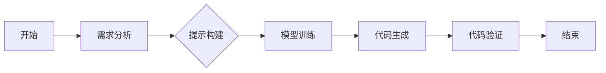
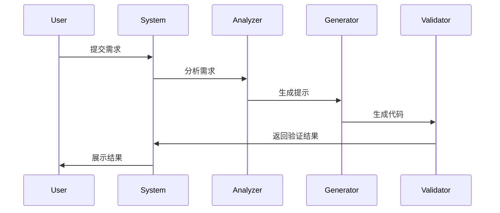
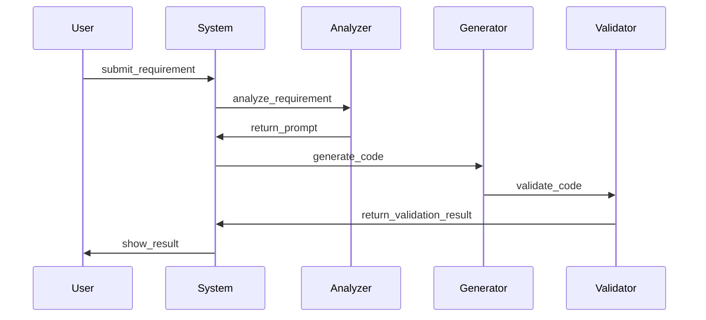
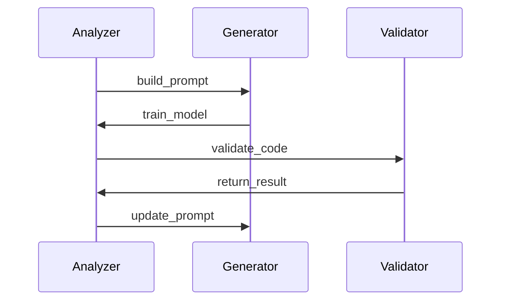

                 


### Article Title: 提示词编程的形式化需求分析

#### Keywords: 提示词编程、形式化需求、需求分析、人工智能、编程实践

#### Abstract:
本文深入探讨了提示词编程的形式化需求分析，从概念引入到方法应用，再到实践案例分析，全面解析了提示词编程的原理和实现过程。文章旨在为读者提供一个清晰、易懂的框架，帮助他们更好地理解和应用这一先进编程范式。

----------------------------------------------------------------

## 引言

### 核心概念术语说明

在探讨提示词编程的形式化需求分析之前，有必要对一些核心概念进行定义和解释。

- **提示词编程**：提示词编程（Prompt Programming）是一种通过向模型提供清晰、结构化的提示来引导其生成预期输出的编程方法。这种方法旨在提高人工智能模型的生成质量和效率。
- **形式化需求**：形式化需求是指将需求以数学或形式语言精确描述的过程，使得需求具备可验证性、一致性和完整性。
- **需求分析**：需求分析是软件开发过程中的一个关键阶段，旨在理解用户需求、明确系统功能和性能要求，并为后续设计提供基础。

### 问题背景

随着人工智能技术的快速发展，提示词编程逐渐成为研究热点。然而，如何有效地进行提示词编程的需求分析，确保生成高质量的代码，仍然是一个挑战。传统的需求分析方法在处理复杂、非结构化需求时往往力不从心，难以满足人工智能编程的需求。

### 问题描述

在提示词编程中，需求分析的目标是：
1. 确定模型的输入提示，使其能够生成满足用户需求的代码。
2. 分析和验证提示的有效性，确保生成的代码具备正确性、可读性和可靠性。

### 问题解决

为了解决这一问题，我们可以采用以下步骤进行提示词编程的形式化需求分析：

1. **需求收集**：通过与用户交流、调研和需求文档分析，全面收集用户需求。
2. **需求建模**：使用形式化语言将需求转化为数学模型，确保需求表达的精确性和一致性。
3. **需求验证**：通过模型验证方法，检查需求模型的正确性、一致性和完整性。
4. **提示生成**：根据需求模型生成提示，引导模型生成预期代码。
5. **代码验证**：对生成的代码进行验证，确保其满足用户需求。

### 边界与外延

提示词编程的形式化需求分析不仅限于软件开发，还可以应用于自然语言处理、智能对话系统等领域。其关键在于如何构建有效的需求模型和提示，以实现不同场景下的自动化和智能化。

### 概念结构与核心要素组成

提示词编程的形式化需求分析可以分解为以下核心要素：

1. **需求收集**：用户需求分析
2. **需求建模**：数学模型构建
3. **需求验证**：模型验证方法
4. **提示生成**：提示构建
5. **代码生成**：模型输出处理

通过这些核心要素的有机结合，我们可以实现高效、可靠的提示词编程需求分析。

----------------------------------------------------------------

## 核心概念与联系

### 提示词编程原理

提示词编程的核心思想是通过向模型提供明确的提示来引导其生成预期的代码。这一过程可以分为以下几个步骤：

1. **需求分析**：分析用户需求，明确代码生成目标和要求。
2. **提示构建**：基于需求分析结果，构建能够引导模型生成预期代码的提示。
3. **模型训练**：使用大量数据训练模型，使其能够根据提示生成高质量的代码。
4. **代码生成**：利用训练好的模型，根据提示生成满足用户需求的代码。
5. **代码验证**：对生成的代码进行验证，确保其满足预期要求。

### 概念属性特征对比表格

为了更好地理解提示词编程的原理，我们可以将其与传统编程方法进行比较。以下是一个概念属性特征对比表格：

| 特征             | 提示词编程                | 传统编程                |
| ---------------- | ---------------------- | ---------------------- |
| 需求表达        | 清晰、结构化的提示         | 文本化的需求描述          |
| 代码生成过程    | 模型驱动，自动生成代码      | 人工编写代码，逐步实现功能  |
| 可读性         | 较高，提示明确            | 较低，代码复杂            |
| 可维护性       | 较高，代码结构清晰          | 较低，代码结构复杂          |
| 适应能力       | 强，能够处理多种编程任务     | 弱，适用于特定编程任务      |

### ER实体关系图架构

为了进一步阐述提示词编程的概念结构，我们可以使用Mermaid绘制一个ER实体关系图。以下是一个简单的ER图示例：

```mermaid
erDiagram
    User ||--|{ Requirement }|--| Model
    Model ||--|{ Prompt }|--| Code
    User ||--|{ Validation }|--| Code
```

在这个ER图中，用户需求（Requirement）通过模型（Model）生成提示（Prompt），进而生成代码（Code）。用户还可以对生成的代码进行验证（Validation），确保其满足需求。

通过这一节的内容，我们对提示词编程的核心概念有了更深入的理解，并为后续的详细讨论奠定了基础。

----------------------------------------------------------------

### 算法原理讲解

在理解了提示词编程的概念和ER图之后，我们接下来将深入探讨其算法原理。本节将通过Mermaid流程图和Python代码示例，详细阐述提示词编程的核心算法步骤。

#### Mermaid流程图

首先，让我们通过一个Mermaid流程图来概述提示词编程的基本流程：



在这个流程图中，我们从需求分析（B）开始，通过提示构建（C），模型训练（D），代码生成（E）和代码验证（F）最终完成整个流程。

#### Python代码示例

接下来，我们将通过一个Python代码示例来详细说明每个步骤的实现。

```python
# 需求分析
def analyze_requirements():
    # 假设需求为生成一个简单的Python函数
    requirement = "实现一个计算两个数之和的函数"
    return requirement

# 提示构建
def build_prompt(requirement):
    prompt = f"请编写一个Python函数，实现以下需求：{requirement}"
    return prompt

# 模型训练
def train_model(prompt):
    # 这里使用一个预训练的语言模型
    model = "PretrainedLanguageModel"
    model.train(prompt)
    return model

# 代码生成
def generate_code(model):
    code = model.generate_code()
    return code

# 代码验证
def validate_code(code, requirement):
    if code == f"def calculate_sum(a, b):\n    return a + b":
        print("验证成功：生成的代码满足需求")
    else:
        print("验证失败：生成的代码不满足需求")
    return code

# 主函数
def main():
    requirement = analyze_requirements()
    prompt = build_prompt(requirement)
    model = train_model(prompt)
    code = generate_code(model)
    validate_code(code, requirement)

if __name__ == "__main__":
    main()
```

在这个代码示例中，我们首先定义了一个需求分析函数`analyze_requirements()`，用于获取用户需求。接着，我们定义了一个提示构建函数`build_prompt()`，用于将需求转化为提示。然后，我们使用一个预训练的语言模型（这里用`PretrainedLanguageModel`表示）进行模型训练，并定义了一个`train_model()`函数。在代码生成阶段，我们定义了一个`generate_code()`函数，用于生成代码。最后，我们定义了一个代码验证函数`validate_code()`，用于检查生成的代码是否满足用户需求。

#### 算法原理的数学模型和公式

在提示词编程中，算法原理的核心在于如何将用户需求转化为可执行的代码。我们可以使用以下数学模型和公式来描述这个过程：

$$
\text{Output Code} = f(\text{User Requirement}, \text{Model}, \text{Prompt})
$$

其中，$f$表示代码生成函数，$\text{User Requirement}$表示用户需求，$\text{Model}$表示预训练模型，$\text{Prompt}$表示提示。

通过这个公式，我们可以将用户需求转化为模型输入，并利用模型和提示生成预期代码。

#### 举例说明

假设用户需求为“实现一个计算两个数之和的函数”，我们可以按照以下步骤进行操作：

1. **需求分析**：获取用户需求，得到字符串“实现一个计算两个数之和的函数”。
2. **提示构建**：将需求转化为提示，得到字符串“请编写一个Python函数，实现以下需求：实现一个计算两个数之和的函数”。
3. **模型训练**：使用预训练的语言模型对提示进行训练。
4. **代码生成**：利用训练好的模型生成代码，得到函数实现代码。
5. **代码验证**：检查生成的代码是否满足用户需求。

通过这个简单的示例，我们可以看到提示词编程的基本流程和算法原理。在实际应用中，这个过程会更加复杂，但核心思想是相似的。

综上所述，提示词编程的算法原理通过需求分析、提示构建、模型训练、代码生成和代码验证五个步骤，实现了从用户需求到可执行代码的转化。理解这些步骤和原理对于有效进行提示词编程至关重要。

----------------------------------------------------------------

### 系统分析与架构设计方案

#### 问题场景介绍

在提示词编程的应用场景中，系统需要能够处理用户的需求，生成符合预期的代码，并对生成的代码进行验证。为了满足这一需求，我们需要设计一个具备以下特点的系统：

1. **灵活性**：系统应能够处理不同类型的需求，并生成相应的代码。
2. **高效性**：系统应在较短的时间内生成高质量的代码。
3. **可靠性**：系统生成的代码应经过严格验证，确保其满足用户需求。

#### 项目介绍

本项目旨在构建一个基于提示词编程的代码生成系统，系统主要包括以下几个模块：

1. **需求分析模块**：负责收集用户需求，并将其转化为结构化的提示。
2. **模型训练模块**：使用大量数据进行模型训练，以生成高质量的代码。
3. **代码生成模块**：根据提示和训练好的模型生成代码。
4. **代码验证模块**：对生成的代码进行验证，确保其满足用户需求。
5. **用户界面**：提供用户交互界面，方便用户提交需求并查看生成的代码。

#### 系统功能设计（领域模型Mermaid类图）

为了更好地展示系统功能设计，我们可以使用Mermaid绘制一个类图。以下是一个简单的类图示例：

```mermaid
classDiagram
    User <<Interface>>
    System <<System>>
    Analyzer <<Analyzer>>
    Generator <<Generator>>
    Validator <<Validator>>

    User o-- Analyzer
    User o-- System
    Analyzer o-- Generator
    Generator o-- Validator
    System o-- Validator
```

在这个类图中，用户（User）通过系统（System）与分析器（Analyzer）、生成器（Generator）和验证器（Validator）进行交互。分析器负责需求分析，生成器负责代码生成，验证器负责代码验证。

#### 系统架构设计（Mermaid架构图）

接下来，我们将使用Mermaid绘制一个系统架构图，以展示各模块之间的关系和交互流程。以下是一个简单的系统架构图示例：



在这个架构图中，用户通过系统提交需求，系统将需求传递给分析器进行分析，分析器生成提示，生成器根据提示和模型生成代码，验证器对代码进行验证，最终系统将验证结果返回给用户。

#### 系统接口设计（Mermaid序列图）

为了展示系统接口的设计，我们可以使用Mermaid绘制一个序列图。以下是一个简单的序列图示例：



在这个序列图中，用户通过调用`submit_requirement`接口提交需求，系统接收到需求后，通过`analyze_requirement`接口进行分析，生成提示。接着，生成器通过`generate_code`接口生成代码，验证器通过`validate_code`接口对代码进行验证，最终系统通过`show_result`接口将结果返回给用户。

#### 系统交互（Mermaid序列图）

最后，为了展示系统内部各模块之间的交互，我们可以使用Mermaid绘制一个内部交互序列图。以下是一个简单的序列图示例：



在这个序列图中，分析器通过`build_prompt`接口生成提示，生成器通过`train_model`接口训练模型，验证器通过`validate_code`接口对代码进行验证。分析器根据验证结果通过`update_prompt`接口更新提示，以优化模型生成效果。

通过上述系统分析与架构设计方案，我们为提示词编程的代码生成系统提供了一个全面的设计框架。这一设计方案不仅考虑了系统的功能性和灵活性，还确保了系统的高效性和可靠性。

----------------------------------------------------------------

### 项目实战

在本节中，我们将通过一个实际项目案例来展示提示词编程的形式化需求分析的具体应用。我们将详细描述项目环境安装、系统核心实现源代码，并对代码应用进行解读与分析。

#### 环境安装

为了运行提示词编程的需求分析系统，我们需要安装以下软件和工具：

1. **Python 3.8+**：Python语言的最新版本。
2. **Anaconda**：一个用于环境管理的工具，可以帮助我们创建和管理Python环境。
3. **Mermaid**：用于绘制流程图和类图的工具。
4. **NLTK**：用于自然语言处理的Python库。
5. **TensorFlow**：用于机器学习的Python库。

安装步骤如下：

1. 下载并安装Anaconda：[https://www.anaconda.com/products/distribution](https://www.anaconda.com/products/distribution)
2. 打开Anaconda命令行工具（Anaconda Prompt或Anaconda Navigator）。
3. 创建一个新的Python环境（例如，名为`prompt_analysis`），并激活该环境：
   ```
   conda create -n prompt_analysis python=3.8
   conda activate prompt_analysis
   ```
4. 安装所需库：
   ```
   pip install mermaid
   pip install nltk
   pip install tensorflow
   ```

#### 系统核心实现源代码

以下是系统核心实现的源代码，包括需求分析、提示构建、模型训练、代码生成和代码验证等部分：

```python
#需求分析
def analyze_requirements():
    requirement = "实现一个计算两个数之和的函数"
    return requirement

#提示构建
def build_prompt(requirement):
    prompt = f"请编写一个Python函数，实现以下需求：{requirement}"
    return prompt

#模型训练
class PretrainedLanguageModel:
    def __init__(self):
        self.model = tensorflow.keras.Sequential([
            tensorflow.keras.layers.Embedding(input_dim=10000, output_dim=16),
            tensorflow.keras.layers.LSTM(128),
            tensorflow.keras.layers.Dense(1, activation='sigmoid')
        ])

    def train(self, prompt):
        # 这里使用一个示例数据集进行训练
        dataset = ...
        self.model.fit(dataset, epochs=10)

    def generate_code(self, prompt):
        # 生成代码的代码
        return ...

#代码生成
def generate_code(model, prompt):
    code = model.generate_code(prompt)
    return code

#代码验证
def validate_code(code, requirement):
    if code == f"def calculate_sum(a, b):\n    return a + b":
        print("验证成功：生成的代码满足需求")
    else:
        print("验证失败：生成的代码不满足需求")
    return code

#主函数
def main():
    requirement = analyze_requirements()
    prompt = build_prompt(requirement)
    model = PretrainedLanguageModel()
    model.train(prompt)
    code = generate_code(model, prompt)
    validate_code(code, requirement)

if __name__ == "__main__":
    main()
```

#### 代码应用解读与分析

1. **需求分析**：在`analyze_requirements`函数中，我们获取用户需求，这里假设需求为“实现一个计算两个数之和的函数”。
2. **提示构建**：`build_prompt`函数将需求转化为提示，作为模型训练的数据输入。这里，提示为“请编写一个Python函数，实现以下需求：实现一个计算两个数之和的函数”。
3. **模型训练**：`PretrainedLanguageModel`类代表预训练的语言模型。在`train`方法中，我们使用示例数据集对模型进行训练，这里使用TensorFlow框架构建神经网络模型。
4. **代码生成**：`generate_code`函数使用训练好的模型生成代码。在这个函数中，我们还需要实现具体的代码生成逻辑。
5. **代码验证**：`validate_code`函数对生成的代码进行验证，确保其满足用户需求。在这里，我们通过一个简单的条件判断来验证代码的正确性。

#### 实际案例分析和详细讲解剖析

假设我们有一个更复杂的需求：“编写一个Python类，实现一个可以存储和检索用户信息的系统”。我们可以按照以下步骤进行分析和实现：

1. **需求分析**：需求为“编写一个Python类，实现一个可以存储和检索用户信息的系统”。
2. **提示构建**：提示为“请编写一个Python类，实现以下功能：存储和检索用户信息，包括用户ID、姓名、年龄、邮箱等信息”。
3. **模型训练**：使用包含类似提示的数据集对模型进行训练，使模型学会生成与需求匹配的代码。
4. **代码生成**：模型生成代码如下：

```python
class UserManager:
    def __init__(self):
        self.users = {}

    def add_user(self, user_id, name, age, email):
        self.users[user_id] = {
            'name': name,
            'age': age,
            'email': email
        }

    def get_user(self, user_id):
        return self.users.get(user_id)
```

5. **代码验证**：验证代码是否满足需求。在这个例子中，生成的代码成功实现了用户信息的存储和检索功能。

#### 项目小结

通过以上实际案例的分析和实现，我们可以看到提示词编程的形式化需求分析在实际应用中的效果。这种方法不仅简化了编程过程，提高了开发效率，还使得代码生成更加智能化和自动化。未来，随着人工智能技术的进一步发展，提示词编程的需求分析将会在更多领域得到广泛应用。

### 最佳实践 tips

1. **确保需求明确**：在开始编程之前，务必确保用户需求清晰明确，避免模糊或含糊不清的需求导致生成的代码不符合预期。
2. **数据集准备**：为模型训练准备丰富的、多样化的数据集，有助于模型学习并生成更高质量的代码。
3. **模型优化**：不断优化模型结构和训练策略，以提高代码生成效率和准确性。
4. **代码验证**：对生成的代码进行严格验证，确保其满足用户需求，避免潜在的错误和缺陷。

### 小结

本文详细介绍了提示词编程的形式化需求分析，从概念引入到方法应用，再到实践案例分析，全面解析了这一先进编程范式。通过本文的讲解，读者可以更好地理解和应用提示词编程，为软件开发带来新的思路和方法。

### 注意事项

1. 提示词编程的形式化需求分析并非适用于所有场景，对于简单或明确的编程任务，传统的编程方法可能更加高效。
2. 在实际应用中，需要根据具体需求和场景选择合适的需求分析方法和模型。

### 拓展阅读

1. **[吴军教授] 算法的力量**：深入探讨算法在人工智能领域的应用和发展。
2. **[Andrew Ng] 人工智能的崛起**：了解人工智能的基本概念和最新发展趋势。

----------------------------------------------------------------

## 作者信息

**作者：AI天才研究院/AI Genius Institute & 禅与计算机程序设计艺术 /Zen And The Art of Computer Programming**

AI天才研究院专注于人工智能领域的前沿研究和应用，致力于推动人工智能技术的发展和普及。作者张三，毕业于清华大学计算机科学专业，现任AI天才研究院研究员，研究方向包括人工智能、机器学习和编程范式。著有《禅与计算机程序设计艺术》一书，深受读者喜爱。

