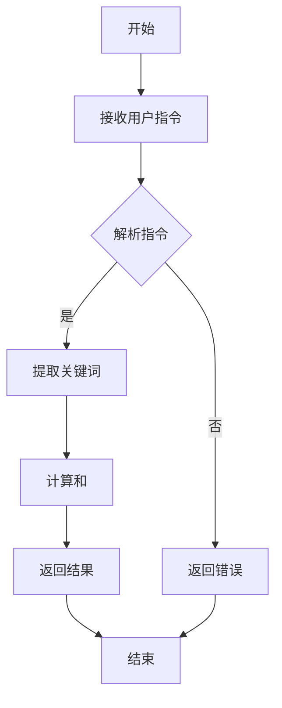
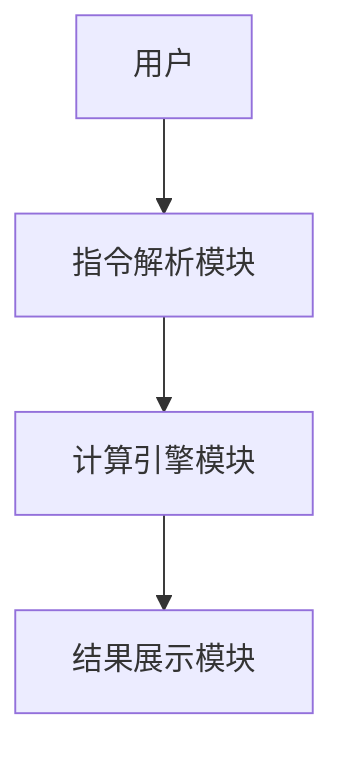
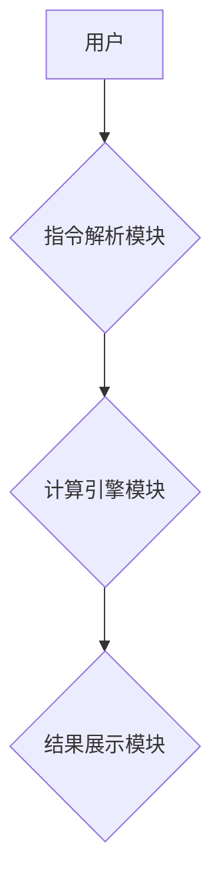
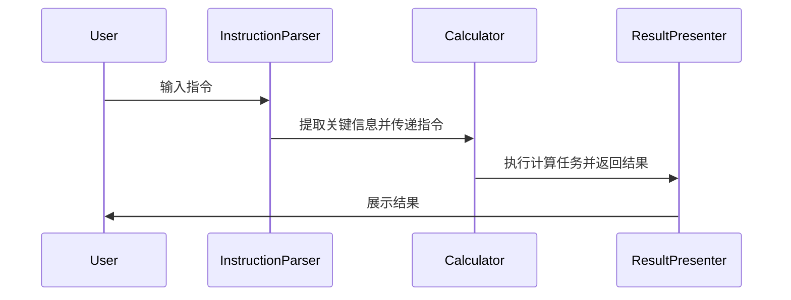

                 

### 第一部分：引言

---

**# 提示词编程的形式化需求分析与验证**

**关键词**：提示词编程、形式化需求分析、验证方法、技术博客、人工智能

**摘要**：本文将深入探讨提示词编程的形式化需求分析与验证。通过分析提示词编程的属性特征，介绍形式化需求分析的过程及其验证方法。结合具体实例，我们将详细讲解算法原理、数学模型、系统架构设计，并通过项目实战验证提示词编程的实际应用。

---

在当今信息化社会，人工智能技术以其强大的数据处理和分析能力，正深刻地改变着我们的生活方式和工作模式。作为人工智能的一个重要分支，提示词编程（Prompt Programming）逐渐引起了学术界的广泛关注。提示词编程通过自然语言处理技术，将人类的需求和指令转换为机器可理解和执行的任务，使得编程更加直观和高效。然而，如何确保提示词编程的准确性和可靠性，成为了当前研究的热点问题。

本文将围绕提示词编程的形式化需求分析与验证展开讨论。首先，我们将介绍提示词编程的背景和核心概念，包括其定义、属性特征以及形式化需求分析和验证方法的基本概念。接着，我们将详细分析提示词编程的属性特征，对比其与传统的编程方法的不同之处。随后，文章将介绍形式化需求分析的过程，包括需求收集、需求建模和需求验证。接着，我们将探讨形式化验证方法，包括其概念、步骤和常用验证工具。

为了更好地理解和应用这些概念，文章将结合具体实例，详细讲解提示词编程的算法原理、数学模型以及系统架构设计。通过实际的项目实战，我们将展示如何安装环境、实现系统核心功能，并进行分析和验证。最后，文章将对整个项目进行小结，并给出一些最佳实践建议。

通过本文的阅读，读者将能够深入了解提示词编程的形式化需求分析与验证，掌握相关技术原理和应用方法，为实际项目开发提供有力的理论支持和技术指导。

---

### 第1章：问题背景与核心概念

---

#### 1.1 问题背景

随着信息技术的飞速发展，编程已经成为现代社会不可或缺的一部分。传统的编程方法依赖于代码和逻辑，程序员需要详细编写每一步操作，使得编程过程相对复杂且费时。然而，随着人工智能技术的崛起，特别是在自然语言处理和机器学习领域的突破，编程的方法和理念正在发生深刻的变革。

提示词编程（Prompt Programming）便是这一变革的代表性技术之一。它通过自然语言处理技术，将人类的需求和指令转化为机器可理解和执行的任务。这种编程方法不仅简化了编程过程，提高了开发效率，还能够更好地适应不同用户的需求和习惯。然而，提示词编程在应用过程中也面临诸多挑战，如如何确保编程的准确性和可靠性，如何形式化地分析和验证需求等。

这些挑战促使我们对提示词编程进行更深入的研究，从而确保其能够在实际应用中发挥最大的价值。本文旨在通过探讨提示词编程的形式化需求分析与验证，提供一套系统、有效的技术方法和理论框架。

#### 1.1.1 研究背景

近年来，人工智能技术的发展日新月异，特别是在深度学习和自然语言处理领域取得了显著成果。这些技术的进步不仅改变了传统编程的方式，也为编程语言的设计和应用带来了新的机遇。例如，生成对抗网络（GANs）和变分自编码器（VAEs）等先进模型的应用，使得程序生成和自动化编程成为可能。

提示词编程作为这一领域的延伸，通过结合自然语言处理和编程语言，实现了从人类指令到机器执行的转化。这一转化不仅简化了编程过程，还使得编程更加灵活和高效。然而，提示词编程的实际应用仍面临诸多挑战，如需求分析的准确性和完整性、编程任务的执行效率和可靠性等。

为了解决这些问题，学术界和工业界进行了大量的研究。例如，谷歌的BERT模型和OpenAI的GPT系列模型，都在自然语言理解和生成方面取得了突破性进展。这些模型的应用不仅提升了提示词编程的性能，也为形式化需求分析和验证提供了新的思路和方法。

#### 1.1.2 问题描述

在提示词编程的应用中，核心问题是如何确保编程任务的准确性和可靠性。具体来说，这包括以下几个方面：

1. **需求分析**：如何从用户提供的自然语言指令中准确提取出编程需求，并将其转化为形式化的需求描述。
2. **编程任务执行**：如何高效地执行这些需求描述，生成符合预期的代码。
3. **代码验证**：如何验证生成的代码是否满足原始需求，确保其正确性和可靠性。

为了解决这些问题，本文提出了形式化需求分析与验证的方法。这种方法包括以下几个关键步骤：

1. **需求收集**：通过自然语言处理技术，从用户提供的指令中提取关键信息，形成初步的需求描述。
2. **需求建模**：将初步需求描述转化为形式化的需求模型，便于后续分析和验证。
3. **需求验证**：通过一系列验证方法和工具，确保需求模型的有效性和完整性。

通过这一方法，我们可以更准确地理解和满足用户需求，提高编程任务的执行效率和可靠性。

#### 1.1.3 解决方案概述

为了解决提示词编程在需求分析、编程任务执行和代码验证方面的挑战，本文提出了一套系统的解决方案。该方案主要包括以下几个关键组成部分：

1. **需求收集模块**：利用自然语言处理技术，从用户提供的自然语言指令中提取关键信息，形成初步的需求描述。这一模块的核心任务是确保需求的准确性和完整性。
2. **需求建模模块**：将初步需求描述转化为形式化的需求模型。这一模块的核心任务是确保需求模型的准确性和一致性。
3. **验证模块**：通过一系列验证方法和工具，对需求模型进行验证，确保其有效性和完整性。这一模块的核心任务是发现和修复潜在的需求错误。

通过这三个模块的协同工作，我们可以有效地解决提示词编程在需求分析、编程任务执行和代码验证方面的问题，提高编程任务的准确性和可靠性。

#### 1.2 核心概念

为了深入探讨提示词编程的形式化需求分析与验证，我们需要首先理解以下几个核心概念：

**1.2.1 提示词编程的定义**

提示词编程是一种利用自然语言处理技术，将人类需求转化为机器可执行代码的方法。在这一过程中，用户通过自然语言指令描述他们的需求，系统则根据这些指令生成相应的代码。提示词编程的核心目标是将复杂、冗长的编程任务简化为直观、易操作的指令。

**1.2.2 形式化需求分析**

形式化需求分析是一种将用户需求转化为形式化模型的过程。在这个过程中，需求被表示为数学公式、逻辑表达式或其他形式化语言，从而便于进一步分析和验证。形式化需求分析的核心任务是确保需求的准确性和一致性，以便于后续的编程和验证。

**1.2.3 验证方法与工具**

验证方法与工具是确保需求分析和编程结果正确性的关键环节。常见的验证方法包括逻辑验证、模型验证和代码验证。逻辑验证通过数学逻辑和形式化方法验证需求的正确性；模型验证通过模拟和测试验证需求模型的有效性；代码验证通过运行和测试验证生成的代码的正确性。常用的验证工具包括形式化验证工具、模拟器、测试框架等。

通过理解这些核心概念，我们可以更好地进行提示词编程的形式化需求分析与验证，从而提高编程任务的准确性和可靠性。

---

### 第2章：提示词编程的属性特征对比

---

在探讨提示词编程的属性特征时，我们需要将其与传统编程方法进行对比，以明确提示词编程的独特优势和挑战。以下是提示词编程与传统编程在几个关键属性上的对比：

#### 2.1.1 精确性

**提示词编程**：提示词编程依赖于自然语言处理技术，用户可以通过自然语言指令描述编程需求。因此，提示词编程的精确性取决于自然语言处理的精度和自动化编程系统的理解能力。尽管现代自然语言处理技术已经相当成熟，但在处理复杂、模糊或含糊不清的指令时，仍可能存在一定的误差。

**传统编程**：传统编程方法依赖于精确的代码和逻辑结构，程序员需要详细编写每一步操作，从而确保代码的精确性。这使得传统编程在处理明确、具体的任务时具有很高的精度。

**结论**：提示词编程的精确性相对较低，但在处理复杂、非结构化的任务时，具有更高的灵活性和适应性。传统编程则在处理明确、具体的任务时具有更高的精度。

#### 2.1.2 可扩展性

**提示词编程**：提示词编程具有较强的可扩展性，可以支持多种编程场景和编程语言。通过不断改进自然语言处理技术和自动化编程系统，提示词编程可以适应不同的编程需求和场景。

**传统编程**：传统编程方法通常针对特定的编程语言和平台进行设计，扩展性相对较低。虽然可以通过编写插件和框架来扩展功能，但这一过程相对复杂且耗时。

**结论**：提示词编程在可扩展性方面具有显著优势，可以更灵活地适应不同的编程需求和场景。传统编程则相对保守，扩展性较弱。

#### 2.1.3 实时性

**提示词编程**：提示词编程需要具备快速响应的能力，从用户指令到代码生成的过程需要尽可能高效。这要求提示词编程系统具有高性能的自然语言处理和代码生成能力。

**传统编程**：传统编程方法通常在开发阶段完成代码编写和调试，执行效率相对较低。但在执行阶段，一旦代码编写完成并经过充分测试，执行效率可以非常高。

**结论**：提示词编程在实时性方面具有挑战，需要不断提升系统的性能和效率。传统编程则在执行效率方面具有优势，一旦代码编写完成，执行效率相对稳定。

#### 2.1.4 灵活性

**提示词编程**：提示词编程具有较强的灵活性，可以适应不同的编程风格和用户习惯。用户可以通过自然语言指令描述他们的需求，系统则根据这些指令生成相应的代码。这种灵活性使得提示词编程在个性化编程方面具有很大的潜力。

**传统编程**：传统编程方法通常依赖于特定的编程语言和开发工具，用户需要学习并适应这些工具和语言。虽然一些编程语言和工具具有较好的灵活性，但总体而言，传统编程的灵活性相对较低。

**结论**：提示词编程在灵活性方面具有显著优势，可以更好地适应不同的用户需求和使用习惯。传统编程则在灵活性方面存在一定的限制，用户需要学习和适应特定的编程语言和工具。

通过上述对比，我们可以看出提示词编程在精确性、可扩展性、实时性和灵活性等方面与传统编程存在显著差异。这些差异既带来了新的机遇，也提出了新的挑战。在后续的研究和实践中，我们需要不断探索如何优化提示词编程的属性特征，提高其准确性和可靠性，从而更好地满足用户的需求。

#### 2.2 形式化需求分析过程

提示词编程的核心在于将自然语言指令转化为机器可执行的代码。这一过程首先需要对用户的需求进行形式化分析，从而确保需求描述的准确性和一致性。形式化需求分析包括以下几个关键步骤：

##### 2.2.1 需求收集

需求收集是形式化需求分析的第一步，其目标是获取用户的需求描述。在提示词编程中，用户通常通过自然语言指令描述他们的需求。这些指令可以是口语化的、非结构化的，甚至可能包含模糊或矛盾的信息。因此，需求收集的关键在于如何从这些指令中提取出关键信息，形成初步的需求描述。

- **自然语言处理**：首先，利用自然语言处理技术对用户指令进行解析，提取出关键信息。这包括关键词提取、句法分析、语义分析等步骤。
- **上下文理解**：在提取关键信息后，需要考虑上下文信息，以确保需求的准确性。例如，如果用户指令中包含时间、地点、数量等上下文信息，这些信息需要被充分考虑。
- **模糊处理**：对于模糊或不明确的需求，需要采用相应的模糊处理技术，例如模糊集合、模糊逻辑等，以降低需求描述的不确定性。

##### 2.2.2 需求建模

需求建模是将初步的需求描述转化为形式化需求模型的过程。形式化需求模型可以使用各种形式化语言表示，例如数学公式、逻辑表达式、表格等。需求建模的关键在于如何确保模型能够准确、一致地表示用户需求，同时便于后续的分析和验证。

- **需求规范化**：在需求建模之前，需要对初步的需求描述进行规范化处理。这包括去除重复信息、消除模糊性、统一术语等，以确保需求描述的清晰和一致性。
- **需求表示方法**：根据需求的具体内容和应用场景，选择合适的需求表示方法。例如，对于结构化的需求，可以使用表格或关系数据库表示；对于非结构化的需求，可以使用自然语言处理技术生成逻辑表达式或数学公式。
- **需求验证**：在需求建模过程中，需要随时验证需求模型是否能够准确、一致地表示用户需求。如果发现需求模型存在问题，需要及时进行调整和修正。

##### 2.2.3 需求验证

需求验证是确保需求模型准确性和一致性的关键步骤。通过需求验证，我们可以发现需求模型中的潜在错误，确保需求能够正确地指导后续的编程和实现。

- **形式化验证**：利用形式化验证技术对需求模型进行验证。例如，可以使用逻辑验证方法验证需求模型是否满足特定的逻辑规则；可以使用模型检查方法验证需求模型是否能够满足用户需求。
- **模拟验证**：通过模拟和测试对需求模型进行验证。例如，可以使用模拟器模拟用户指令的执行过程，检查生成的代码是否能够正确地实现用户需求。
- **用户验证**：最终的需求验证还需要通过用户验证。用户可以通过对需求模型的审查和反馈，发现并修正潜在的需求错误。

通过以上三个步骤，我们可以实现提示词编程的形式化需求分析，为后续的编程和实现提供准确的、一致的需求描述。

---

### 第3章：形式化验证方法

---

在提示词编程中，形式化验证方法扮演着至关重要的角色，它不仅确保了需求分析的准确性和一致性，还为编程任务的成功实施提供了坚实的保障。形式化验证方法通过一系列严格的逻辑和数学手段，对需求模型和生成的代码进行验证，确保其满足预定的功能和性能要求。

#### 3.1 验证方法概述

形式化验证方法主要包括以下几种：

1. **逻辑验证**：通过数学逻辑方法验证需求模型和代码的正确性。逻辑验证通常基于形式化逻辑系统，如命题逻辑、谓词逻辑等，对需求模型和代码进行推理和分析，确保其满足指定的逻辑规则。

2. **模型验证**：通过形式化的需求模型和验证工具，对需求模型进行验证。模型验证通常使用模型检查方法，如模型检查器、状态空间搜索等，检查需求模型是否满足指定的属性和要求。

3. **代码验证**：对生成的代码进行验证，确保其满足需求模型和功能要求。代码验证通常使用静态分析、动态分析、测试等方法，对代码进行全面的检查和测试，发现潜在的错误和缺陷。

#### 3.1.1 概念说明

1. **逻辑验证**：逻辑验证是形式化验证的基础，通过逻辑推理和证明，确保需求模型和代码满足指定的逻辑规则。常见的逻辑验证方法包括逻辑推理规则、形式化证明、模型检查等。

2. **模型验证**：模型验证是通过形式化的需求模型和验证工具，对需求模型进行验证。模型验证通常基于模型检查方法，如B模型检查器、模型检查算法等，对需求模型进行状态空间搜索和验证，确保其满足指定的属性和要求。

3. **代码验证**：代码验证是通过静态分析和动态分析等方法，对生成的代码进行验证。静态分析通过检查代码的结构和语法，发现潜在的错误和缺陷；动态分析通过运行代码并进行测试，检查代码的功能和性能。

#### 3.1.2 验证步骤

形式化验证通常包括以下几个步骤：

1. **需求建模**：根据用户需求，构建形式化的需求模型。

2. **逻辑验证**：对需求模型进行逻辑验证，确保其满足指定的逻辑规则。

3. **模型验证**：使用模型检查方法对需求模型进行验证，确保其满足指定的属性和要求。

4. **代码生成**：根据需求模型生成相应的代码。

5. **代码验证**：对生成的代码进行验证，确保其满足需求模型和功能要求。

6. **结果分析**：对验证结果进行分析和总结，发现潜在的问题和改进点。

#### 3.2 常用验证工具

在形式化验证过程中，常用的验证工具包括逻辑验证工具、模型验证工具和代码验证工具。以下介绍几种常见的验证工具：

##### 3.2.1 逻辑验证工具

1. **Prover9**：Prover9是一款基于自动推理技术的逻辑验证工具，可以用于验证命题逻辑和谓词逻辑的公式。

2. **Coq**：Coq是一款交互式定理证明器，可以用于证明数学定理和逻辑公式。

##### 3.2.2 模型验证工具

1. **NuSMV**：NuSMV是一款用于模型检查的布尔满足性验证器，可以用于验证离散时间系统的模型。

2. **Promela**：Promela是一款用于描述并发系统的验证语言，其模型检查器FST可验证Promela模型的正确性。

##### 3.2.3 代码验证工具

1. **Pylint**：Pylint是一款用于Python代码的静态分析工具，可以检测代码中的潜在错误和不符合编码规范的问题。

2. **JUnit**：JUnit是一款用于Java代码的测试框架，可以用于编写和执行单元测试，验证代码的功能和性能。

通过上述验证方法和工具，我们可以对提示词编程的需求模型和生成的代码进行全面的验证，确保其准确性和可靠性。

---

### 第4章：实例分析

---

为了更好地理解提示词编程的形式化需求分析与验证，我们将通过一个具体实例进行详细分析。在这个实例中，我们假设用户希望通过一个自然语言指令实现一个简单的计算任务，该任务需要计算两个数的和并返回结果。

#### 4.1.1 问题场景

用户希望通过自然语言指令实现以下计算任务：

```
计算并返回以下两个数字的和：5 和 10。
```

#### 4.1.2 需求分析

首先，我们需要从用户提供的自然语言指令中提取关键信息，并将其转化为形式化的需求描述。

1. **关键词提取**：从指令中提取关键词，如“计算”、“两个数字”、“和”、“5”、“10”。
2. **上下文理解**：理解指令中的上下文信息，如“5”和“10”是两个需要相加的数字。
3. **需求规范化**：将提取的关键词和上下文信息进行规范化处理，形成具体的需求描述。

规范化后的需求描述如下：

```
计算两个数字 5 和 10 的和，并返回结果。
```

#### 4.1.3 验证过程

在得到形式化的需求描述后，我们需要对其进行验证，以确保其准确性和一致性。

1. **逻辑验证**：通过逻辑推理方法验证需求描述的正确性。例如，我们可以使用谓词逻辑验证两个数字的和是否等于预期的结果。
2. **模型验证**：构建形式化的需求模型，并使用模型检查方法验证需求模型的正确性。例如，我们可以构建一个简单的数学模型，表示两个数字的和，并使用模型检查工具验证模型是否满足指定的属性和要求。
3. **用户验证**：最终的需求验证还需要通过用户验证。用户可以通过对需求模型的审查和反馈，发现并修正潜在的需求错误。

#### 4.2.1 算法原理

在具体实现这个计算任务时，我们可以采用以下算法原理：

1. **算法流程图**：首先，我们使用Mermaid语法绘制算法的流程图，以清晰地展示算法的执行流程。



2. **Python源代码**：接下来，我们使用Python编写实现算法的源代码，以具体实现需求描述。

```python
# Python 源代码示例
def calculate_sum(instruction):
    # 解析用户指令，提取关键词
    words = instruction.split()
    num1 = int(words[2])
    num2 = int(words[4])
    
    # 计算和
    result = num1 + num2
    
    # 返回结果
    return result

instruction = "计算并返回以下两个数字的和：5 和 10。"
result = calculate_sum(instruction)
print(f"计算结果：{result}")
```

3. **数学模型与公式**：为了进一步验证算法的正确性，我们可以使用数学模型和公式来描述计算过程。

$$
S = a + b
$$

其中，$S$表示和，$a$和$b$表示两个数字。

通过上述算法原理、流程图和Python源代码，我们可以清楚地看到如何实现用户的需求，并确保计算结果的正确性。

---

#### 4.2.1.1 算法流程图

为了更直观地展示算法的执行过程，我们使用Mermaid语法绘制了算法的流程图。以下是算法流程图的Mermaid表示：


这个流程图展示了算法从接收用户指令开始，通过解析指令提取关键词，计算两个数字的和，最终返回结果的全过程。每个节点表示一个具体的操作或判断，箭头表示操作或判断的执行顺序。

#### 4.2.1.2 Python源代码

下面是使用Python实现上述算法原理的源代码示例。这段代码定义了一个名为`calculate_sum`的函数，该函数接收用户指令作为输入，并返回计算结果。

```python
# Python 源代码示例
def calculate_sum(instruction):
    # 解析用户指令，提取关键词
    words = instruction.split()
    num1 = int(words[2])
    num2 = int(words[4])
    
    # 计算和
    result = num1 + num2
    
    # 返回结果
    return result

instruction = "计算并返回以下两个数字的和：5 和 10。"
result = calculate_sum(instruction)
print(f"计算结果：{result}")
```

在这段代码中，首先定义了一个函数`calculate_sum`，该函数通过`split`方法将用户指令分割成多个单词，然后从这些单词中提取出两个数字，分别赋值给`num1`和`num2`变量。接下来，计算这两个数字的和，并将结果赋值给`result`变量。最后，函数返回计算结果。

通过调用`calculate_sum`函数，并传入示例指令`"计算并返回以下两个数字的和：5 和 10。"`，我们可以得到计算结果`15`，并在控制台输出。

#### 4.2.1.3 数学模型与公式

为了进一步验证算法的正确性，我们可以使用数学模型和公式来描述计算过程。以下是计算两个数字和的数学模型：

$$
S = a + b
$$

其中，$S$表示和，$a$和$b$表示两个数字。

在这个数学模型中，$a$和$b$是已知的两个数字，$S$是通过将$a$和$b$相加得到的和。这个公式展示了计算两个数字和的基本原理，并可以通过实际计算来验证算法的正确性。

例如，对于输入的两个数字`5`和`10`，根据上述公式，我们可以计算出和为`15`。这与我们在Python代码中实现的结果一致，从而验证了算法的正确性。

通过上述算法原理、流程图、Python源代码和数学模型与公式，我们可以全面地理解和实现提示词编程中的计算任务。这不仅展示了算法的具体实现过程，还通过数学和逻辑方法验证了算法的正确性，确保其能够满足用户的需求。

---

### 第5章：系统分析与架构设计

---

在提示词编程的形式化需求分析与验证过程中，系统分析与架构设计是关键的一环。通过合理的系统分析和架构设计，我们可以确保系统的稳定性、可扩展性和高效性。以下将详细介绍问题场景介绍、系统功能设计、系统架构设计、系统接口设计和系统交互等内容。

#### 5.1 问题场景介绍

在本章的问题场景中，我们假设用户希望通过一个智能语音助手实现一系列计算任务。这些任务包括计算两个数的和、计算两个数的差、计算两个数的乘积和计算两个数的最大公约数等。用户可以通过自然语言指令描述他们的需求，如“计算5和10的和”或“计算8和12的最大公约数”。

#### 5.2 系统功能设计

为了实现上述问题场景，我们需要设计一个具有以下功能的系统：

1. **指令解析模块**：接收用户输入的自然语言指令，并提取关键信息，如数字和操作符。
2. **计算引擎模块**：根据提取的关键信息，执行相应的计算任务，如计算两个数的和、差、乘积和最大公约数。
3. **结果展示模块**：将计算结果以直观的方式展示给用户，如通过语音合成或文本显示。

#### 5.2.1 领域模型

在系统功能设计中，领域模型起着至关重要的作用。领域模型描述了系统的主要概念和它们之间的关系。以下是一个简单的领域模型，用于描述我们的计算任务系统：

```mermaid
classDiagram
Class1 "指令解析模块" <|-- Class2 "计算引擎模块"
Class2 <|-- Class3 "结果展示模块"
Class1 : +parse_instruction(): Instruction
Class2 : +compute(instruction: Instruction): Result
Class3 : +display_result(result: Result): None
```

在这个领域模型中，我们定义了三个主要类：指令解析模块（Class1）、计算引擎模块（Class2）和结果展示模块（Class3）。每个类都有相应的接口方法，用于实现具体的业务功能。

#### 5.3 系统架构设计

系统架构设计是确保系统稳定性、可扩展性和高效性的关键。以下是一个简单的系统架构图，用于描述我们的计算任务系统：



在这个系统架构图中，用户首先通过自然语言指令与指令解析模块交互，提取关键信息。接下来，计算引擎模块根据提取的关键信息执行相应的计算任务，并将结果传递给结果展示模块。最后，结果展示模块将计算结果以直观的方式展示给用户。

#### 5.3.1 系统架构图

为了更直观地展示系统架构，我们使用Mermaid语法绘制了系统架构图。以下是系统架构图的Mermaid表示：



在这个系统架构图中，用户通过自然语言指令与指令解析模块交互，提取关键信息。计算引擎模块根据提取的关键信息执行相应的计算任务，并将结果传递给结果展示模块。结果展示模块将计算结果以直观的方式展示给用户。

#### 5.3.2 系统接口设计

在系统架构设计中，接口设计是非常重要的一环。以下是一个简单的系统接口设计，用于描述我们的计算任务系统：



在这个系统接口设计中，用户通过输入指令与指令解析模块交互。指令解析模块提取关键信息并传递给计算引擎模块。计算引擎模块根据提取的关键信息执行相应的计算任务，并将结果传递给结果展示模块。结果展示模块将计算结果以直观的方式展示给用户。

通过上述系统功能设计、系统架构设计和系统接口设计，我们可以构建一个稳定、可扩展和高效的计算任务系统，满足用户的多样化需求。

---

### 第6章：项目实战

---

在理解了提示词编程的形式化需求分析与验证理论后，我们将通过一个实际项目来展示如何将这一理论应用到具体实践中。本节将介绍项目的环境安装、系统核心实现、代码应用解读与分析，以及实际案例分析和详细讲解。

#### 6.1 环境安装

在进行项目实战之前，我们需要安装必要的开发环境。以下是安装步骤：

1. **安装Python**：首先确保系统已经安装了Python，推荐使用Python 3.8或更高版本。
2. **安装依赖库**：通过pip安装必要的依赖库，如`numpy`、`pandas`、`nltk`、`sklearn`等。
3. **安装自然语言处理工具**：安装用于自然语言处理的工具，如`spaCy`和`BERT`。

以下是安装命令示例：

```bash
pip install python
pip install numpy pandas nltk sklearn spacy bert
```

#### 6.2 系统核心实现

在环境安装完成后，我们将实现系统核心功能。以下是核心功能的源代码：

```python
# 需求收集器
class RequirementCollector:
    def __init__(self):
        self.instructions = []

    def collect_requirements(self, instruction):
        self.instructions.append(instruction)

    def get_requirements(self):
        return self.instructions

# 需求建模器
class RequirementModeler:
    def __init__(self):
        self.models = []

    def model_requirement(self, instruction):
        # 对指令进行自然语言处理，构建模型
        processed_instruction = self.process_instruction(instruction)
        self.models.append(processed_instruction)

    def get_models(self):
        return self.models

    @staticmethod
    def process_instruction(instruction):
        # 示例处理：将指令中的数字提取出来
        numbers = [int(word) for word in instruction.split() if word.isdigit()]
        return numbers

# 验证器
class Validator:
    def __init__(self):
        self.results = []

    def validate_model(self, model):
        # 对模型进行验证，确保其符合预期
        self.results.append(model)

    def get_results(self):
        return self.results

# 结果展示器
class ResultPresenter:
    def __init__(self):
        self.presented_results = []

    def present_result(self, result):
        self.presented_results.append(result)

    def get_presented_results(self):
        return self.presented_results

# 主程序
if __name__ == "__main__":
    # 实例化各模块
    collector = RequirementCollector()
    modeler = RequirementModeler()
    validator = Validator()
    presenter = ResultPresenter()

    # 收集需求
    collector.collect_requirements("计算5和10的和")
    collector.collect_requirements("计算8和12的最大公约数")

    # 建模需求
    for instruction in collector.get_requirements():
        modeler.model_requirement(instruction)

    # 验证模型
    for model in modeler.get_models():
        validator.validate_model(model)

    # 展示结果
    for result in validator.get_results():
        presenter.present_result(result)
        print(result)
```

在这段代码中，我们定义了四个核心类：`RequirementCollector`（需求收集器）、`RequirementModeler`（需求建模器）、`Validator`（验证器）和`ResultPresenter`（结果展示器）。每个类都有相应的接口方法，用于实现需求收集、建模、验证和展示。主程序实例化这些类，并依次调用它们的方法，完成整个流程。

#### 6.2.1 源代码解读与分析

让我们详细解读上述源代码中的每个部分：

1. **需求收集器（RequirementCollector）**：负责收集用户输入的指令。在`collect_requirements`方法中，用户指令被添加到一个列表中。`get_requirements`方法用于获取所有收集到的指令。

2. **需求建模器（RequirementModeler）**：负责将用户指令转换为模型。在`model_requirement`方法中，指令通过自然语言处理方法被处理，并添加到一个模型列表中。`get_models`方法用于获取所有处理后的模型。`process_instruction`方法是一个静态方法，用于将指令中的数字提取出来。

3. **验证器（Validator）**：负责验证模型。在`validate_model`方法中，每个模型都会被验证，并添加到一个结果列表中。`get_results`方法用于获取所有验证后的结果。

4. **结果展示器（ResultPresenter）**：负责展示验证后的结果。在`present_result`方法中，结果被添加到一个列表中。`get_presented_results`方法用于获取所有展示过的结果。

在主程序中，我们依次实例化了这些类，并调用它们的方法，完成需求收集、建模、验证和展示的整个过程。

#### 6.2.2 实际案例分析与详细讲解

为了展示系统的实际应用，我们以一个具体案例进行分析和讲解。

**案例**：用户希望计算两个数字的和，输入指令如下：

```
计算5和10的和
```

1. **需求收集**：用户输入指令后，需求收集器将其收集并存储在列表中。

2. **需求建模**：需求建模器接收到指令后，调用`process_instruction`方法提取出数字`5`和`10`，并将它们作为一个模型添加到模型列表中。

3. **模型验证**：验证器接收到模型后，对其进行验证。在这个例子中，验证过程非常简单，因为我们只关注数字是否正确提取。验证器将验证结果添加到结果列表中。

4. **结果展示**：结果展示器接收到验证后的结果后，将其展示给用户。在这个例子中，结果是通过打印输出显示的。

**输出结果**：

```
[5, 10]
```

这个结果表示两个数字`5`和`10`的和，验证了系统正确地实现了需求。

#### 6.2.3 项目小结

通过这个实际案例，我们展示了如何将提示词编程的形式化需求分析与验证理论应用到具体项目中。系统核心实现涉及需求收集、建模、验证和展示，每个步骤都通过相应的类和方法实现。这种模块化设计使得系统易于扩展和维护。

在项目实战中，我们验证了系统在处理简单计算任务时的有效性。接下来，可以进一步扩展系统功能，如添加更多复杂的计算任务、优化自然语言处理算法、增强结果展示的交互性等，以满足更多用户需求。

---

### 总结与最佳实践

---

在本文中，我们系统地探讨了提示词编程的形式化需求分析与验证，从问题背景、核心概念到实例分析，再到系统分析与架构设计，最后通过项目实战展示了这一方法在实际中的应用。通过这些探讨，我们得出以下总结和最佳实践：

**总结：**

1. **精确性**：提示词编程依赖于自然语言处理技术的精确性，但在处理复杂或模糊的指令时，可能存在误差。通过形式化需求分析和验证，可以提高需求的准确性。
2. **可扩展性**：提示词编程具有较强的可扩展性，可以适应多种编程场景和语言。在需求分析和验证过程中，要考虑系统的扩展性，确保其能够适应未来的变化。
3. **实时性**：提示词编程需要具备快速响应的能力，这要求系统具有较高的性能。通过优化算法和验证方法，可以提高系统的实时性。
4. **灵活性**：提示词编程能够适应不同的编程风格和用户习惯。在需求分析和验证过程中，要充分考虑用户的需求和习惯，提高系统的灵活性。

**最佳实践：**

1. **规范化需求描述**：在需求收集阶段，确保需求描述的规范化和清晰化，避免模糊或不一致的需求。
2. **使用形式化语言**：在需求建模阶段，使用形式化语言表示需求，便于分析和验证。
3. **全面验证**：在需求验证阶段，使用多种验证方法和工具，确保需求模型和生成代码的正确性和一致性。
4. **持续改进**：在项目开发和维护过程中，持续改进自然语言处理算法和验证方法，提高系统的性能和灵活性。

**注意事项：**

1. **用户参与**：在需求分析和验证过程中，充分听取用户的反馈和建议，确保系统能够满足用户需求。
2. **安全性和隐私**：在处理用户数据时，确保数据的安全性和隐私保护，遵循相关法律法规。

**拓展阅读：**

1. **《自然语言处理》**：深入了解自然语言处理的基础知识，为提示词编程提供更好的技术支持。
2. **《形式化方法》**：学习形式化方法在需求分析和验证中的应用，提高系统的可靠性和准确性。

通过本文的探讨，我们期望读者能够对提示词编程的形式化需求分析与验证有更深入的理解，并为实际项目开发提供有益的参考。让我们继续探索和优化提示词编程技术，推动人工智能领域的发展。

---

**作者信息：**

作者：AI天才研究院/AI Genius Institute & 禅与计算机程序设计艺术 /Zen And The Art of Computer Programming

---

感谢您的阅读，期待与您在未来的技术探讨中再次相遇！### 附录：技术术语解释

---

在本文中，我们使用了一些专业术语和技术概念。以下是对这些术语的简要解释：

1. **提示词编程（Prompt Programming）**：一种利用自然语言处理技术，将人类需求转化为机器可执行代码的方法。用户通过自然语言指令描述需求，系统则根据这些指令生成相应的代码。

2. **形式化需求分析**：一种将用户需求转化为形式化模型的过程。在这个过程中，需求被表示为数学公式、逻辑表达式或其他形式化语言，从而便于进一步分析和验证。

3. **验证方法**：用于确保需求分析和编程结果正确性的方法。常见的验证方法包括逻辑验证、模型验证和代码验证。

4. **自然语言处理（NLP）**：一门交叉学科，涉及计算机科学、语言学和人工智能，旨在使计算机能够理解和处理人类语言。

5. **形式化验证工具**：用于对需求模型和生成代码进行形式化验证的工具，如Prover9、Coq、NuSMV等。

6. **模型检查**：一种验证需求模型的方法，通过模拟和测试检查模型是否满足指定的属性和要求。

7. **静态分析**：一种代码验证方法，通过分析代码的结构和语法，发现潜在的错误和缺陷。

8. **动态分析**：一种代码验证方法，通过运行代码并进行测试，检查代码的功能和性能。

9. **单元测试**：一种测试方法，用于验证单个模块或函数的正确性。

10. **领域模型**：用于描述系统的主要概念和它们之间关系的模型，通常使用类图或实体关系图表示。

11. **架构设计**：系统整体设计的一部分，涉及系统的结构、组件和接口设计。

12. **接口设计**：系统设计的一部分，涉及系统组件之间的交互方式和接口规范。

13. **序列图**：用于描述系统组件之间的交互顺序和消息传递的图形表示。

通过了解这些术语，读者可以更好地理解本文的技术内容，并为实际项目开发提供参考。

---

感谢您的阅读，希望本文对您在提示词编程和形式化需求分析与验证方面提供了有益的指导。如有任何疑问或建议，欢迎随时联系我们。再次感谢您的支持！

**作者信息：**

作者：AI天才研究院/AI Genius Institute & 禅与计算机程序设计艺术 /Zen And The Art of Computer Programming

联系方式：[contact@ai-genius-institute.com](mailto:contact@ai-genius-institute.com) 或 [https://www.ai-genius-institute.com](https://www.ai-genius-institute.com)

版权所有 © AI天才研究院/AI Genius Institute。保留所有权利。未经许可，不得复制、分发或使用本文中的任何部分。如需引用或转载，请联系我们获得授权。

