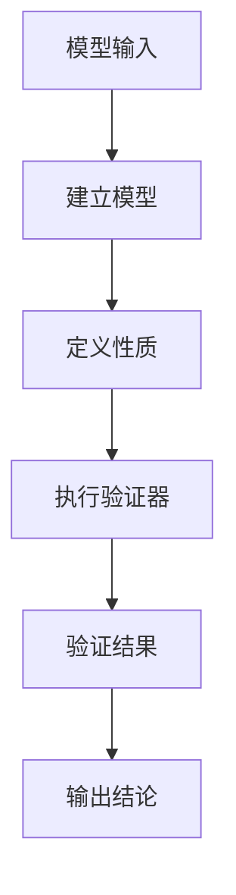
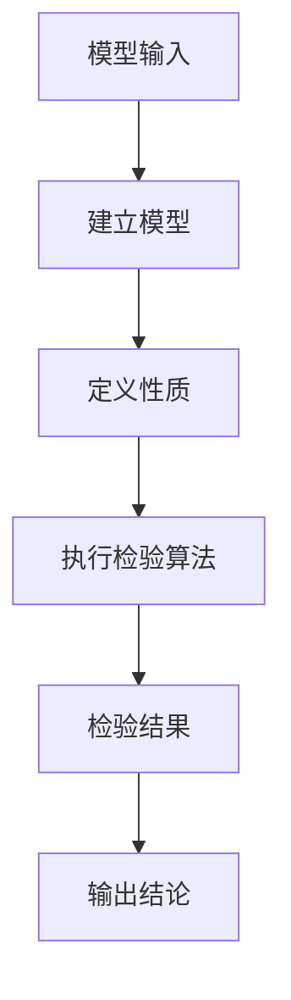
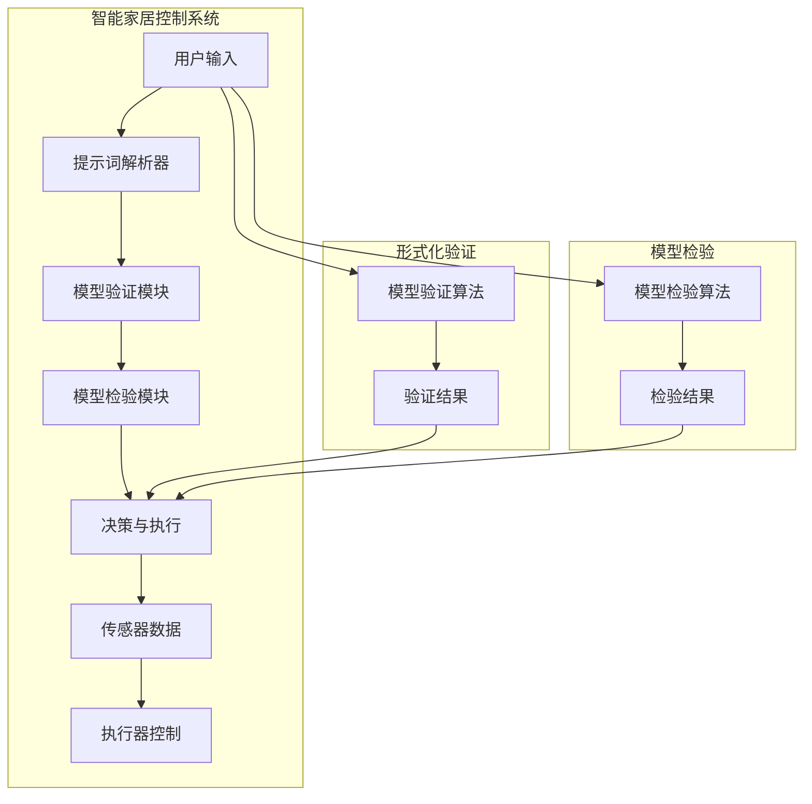
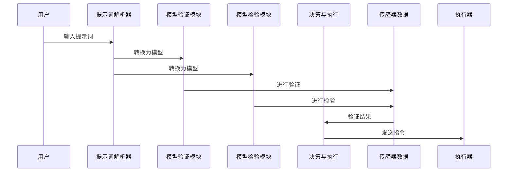
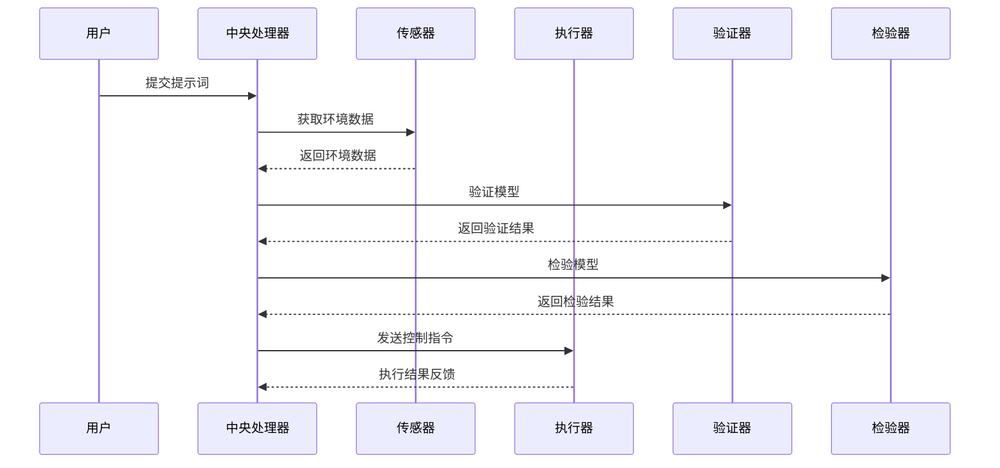

                 

# 提示词编程的形式化验证与模型检验

关键词：提示词编程、形式化验证、模型检验、算法原理、Python实现

摘要：本文将探讨提示词编程的形式化验证与模型检验，通过详细的背景介绍、核心概念分析、算法原理讲解和项目实战，旨在为读者提供深入理解与应用这些技术的方法。我们将首先介绍提示词编程的背景和挑战，然后深入探讨形式化验证与模型检验的基本概念、特征对比，最后通过Python实现详细讲解验证算法原理和模型检验算法原理，为实际应用提供参考。

## 第一部分：背景介绍

### 1.1.1 问题背景

#### 1.1.1.1 提示词编程的兴起

提示词编程是一种通过自然语言描述代码的方法，旨在提高编程效率和代码可读性。这种方法的出现，为程序员提供了一种全新的编程范式，使编程语言更加接近自然语言，使得开发者可以更加自然地表达复杂逻辑。

**提示词编程的定义与发展历程**：

提示词编程可以追溯到20世纪90年代，最初由Apt和Miller提出，他们提出了一种称为“自然编程”的方法。这种方法的核心思想是通过自然语言来描述程序行为，使编程更加直观和易于理解。

随着人工智能技术的发展，提示词编程逐渐得到了更多的关注和应用。近年来，随着生成对抗网络（GAN）和强化学习等技术的进步，提示词编程逐渐成为了一种重要的编程范式。

**提示词编程的优势与局限**：

提示词编程的优势在于其简洁性和可读性，使得程序员可以更加高效地编写代码。此外，提示词编程还可以提高代码的可维护性，因为自然语言描述通常更加易于理解和修改。

然而，提示词编程也存在一定的局限。首先，提示词编程需要一定的学习成本，程序员需要熟悉特定的自然语言描述规则。其次，提示词编程在处理复杂逻辑时可能会遇到困难，因为自然语言描述通常难以精确表达复杂的编程逻辑。

#### 1.1.1.2 形式化验证的意义

**形式化验证的定义与作用**：

形式化验证是一种使用数学方法验证软件系统正确性的过程。它通过建立模型，对系统进行形式化的描述，然后使用数学方法对模型进行验证，以确保系统满足预定的性质。

形式化验证在软件工程中具有重要的应用价值。它可以提高软件系统的可靠性，减少错误率，提高开发效率。在提示词编程中，形式化验证可以帮助验证程序员编写的提示词代码是否满足预期的逻辑和性能要求。

**形式化验证在提示词编程中的应用场景**：

在提示词编程中，形式化验证可以应用于以下几个方面：

1. **代码审查**：使用形式化验证方法对程序员编写的提示词代码进行审查，以确保代码的正确性和一致性。
2. **自动化测试**：将形式化验证方法与自动化测试结合，对提示词程序进行全面的测试，以发现潜在的错误和问题。
3. **性能优化**：通过形式化验证，分析提示词程序的执行效率，并对其进行优化，以提高程序的运行性能。

#### 1.1.1.3 模型检验的概念与目标

**模型检验的定义与过程**：

模型检验是一种基于模型验证的方法，它通过建立系统的模型，并使用特定的算法对模型进行检查，以验证系统是否满足预定的性质。

模型检验的基本过程包括：

1. **建立模型**：根据系统的需求，建立系统的模型，通常使用形式化的描述语言，如数学公式或形式化的图形语言。
2. **定义性质**：根据系统的需求和预期，定义系统的性质，这些性质通常用数学表达式或逻辑公式表示。
3. **执行检验**：使用模型检验算法对模型进行检查，以验证系统是否满足预定的性质。
4. **输出结果**：根据检验结果，输出系统是否满足预定的性质的结论。

**模型检验在提示词编程中的重要性**：

在提示词编程中，模型检验可以应用于以下几个方面：

1. **代码生成**：使用模型检验方法，根据提示词描述生成相应的代码，并验证生成的代码是否符合预期。
2. **代码优化**：通过模型检验，分析提示词程序的执行效率，并对其进行优化，以提高程序的运行性能。
3. **错误检测**：使用模型检验方法，对提示词程序进行全面的测试，以发现潜在的错误和问题。

### 1.1.2 问题描述

#### 1.1.2.1 提示词编程中的验证挑战

提示词编程的复杂性与不确定性给验证带来了很大的挑战。首先，提示词编程的描述方式使得代码的可读性和可理解性提高，但同时也增加了代码的复杂性。程序员需要确保编写的提示词代码能够正确地实现预期的功能，并且能够处理各种可能的输入和场景。

**验证方法的选择与适应性**：

在提示词编程中，选择合适的验证方法至关重要。不同的验证方法适用于不同类型和复杂度的代码。例如，对于简单的提示词程序，可以使用手动审查和代码审查工具进行验证；对于复杂的提示词程序，可能需要使用形式化验证和模型检验方法。

此外，验证方法的选择也需要考虑验证的速度和效率。在一些实时系统中，验证过程需要尽可能快速地完成，以确保系统的响应速度。因此，需要选择适合实时验证的方法，并优化验证过程。

#### 1.1.2.2 模型检验的技术挑战

模型检验方法在提示词编程中的应用也面临一些技术挑战。首先，模型检验方法的多样性使得选择合适的方法变得困难。不同的模型检验方法适用于不同的场景和模型类型，需要根据具体的应用需求进行选择。

其次，复杂模型的验证效率是一个重要的问题。随着提示词编程的复杂度增加，模型的规模和复杂性也增加，导致模型检验过程变得更加耗时。因此，需要优化模型检验算法，以提高验证效率。

此外，模型检验方法的准确性也是一个关键问题。在一些情况下，模型检验方法可能会产生误报或漏报，导致验证结果不准确。因此，需要研究更加准确和可靠的模型检验方法。

## 第二部分：核心概念与联系

### 2.1.1 形式化验证的基本概念

#### 2.1.1.1 形式化验证的定义与类型

**形式化验证的定义**：

形式化验证是一种使用数学方法验证软件系统正确性的过程。它通过建立模型，对系统进行形式化的描述，然后使用数学方法对模型进行验证，以确保系统满足预定的性质。

**形式化验证的类型**：

形式化验证可以分为以下几种类型：

1. **模型检查**：模型检查是一种自动化的形式化验证方法，它通过比较模型和预定的性质，验证系统是否满足预期的性质。模型检查方法通常适用于小规模和确定性模型。
2. **模型模拟**：模型模拟是一种通过执行模型的模拟来验证系统的方法。它通过模拟模型在各种输入和场景下的行为，验证系统是否满足预期的性质。模型模拟方法通常适用于大规模和不确定性模型。
3. **形式化推理**：形式化推理是一种通过逻辑推理来验证系统的方法。它通过建立逻辑模型，使用逻辑推理规则验证系统是否满足预期的性质。形式化推理方法通常适用于复杂系统和高可靠性要求。

#### 2.1.1.2 形式化验证的属性特征对比

| 方法          | 特点                           | 适用场景                         |
|---------------|-------------------------------|--------------------------------|
| 模型检查      | 自动化验证，效率高           | 小规模模型，确定性模型          |
| 模型模拟      | 实时验证，支持动态行为       | 大规模模型，不确定性模型        |
| 形式化推理    | 强推理能力，支持复杂逻辑     | 复杂系统，高可靠性要求         |

### 2.1.2 模型检验的基本概念

#### 2.1.2.1 模型检验的定义与过程

**模型检验的定义**：

模型检验是一种基于模型验证的方法，它通过建立系统的模型，并使用特定的算法对模型进行检查，以验证系统是否满足预定的性质。

**模型检验的过程**：

模型检验的基本过程包括以下步骤：

1. **建立模型**：根据系统的需求，建立系统的模型，通常使用形式化的描述语言，如数学公式或形式化的图形语言。
2. **定义性质**：根据系统的需求和预期，定义系统的性质，这些性质通常用数学表达式或逻辑公式表示。
3. **执行检验**：使用模型检验算法对模型进行检查，以验证系统是否满足预定的性质。
4. **输出结果**：根据检验结果，输出系统是否满足预定的性质的结论。

#### 2.1.2.2 模型检验的属性特征对比

| 方法          | 特点                           | 适用场景                         |
|---------------|-------------------------------|--------------------------------|
| 符号执行      | 强验证能力，适用于复杂模型   | 大规模模型，安全性要求高        |
| 遗传算法      | 灵活性高，适用于非确定性模型 | 大规模模型，优化问题           |
| 遗传编程      | 非线性优化，适用性强         | 多目标优化，复杂系统           |

## 第二部分：算法原理讲解

### 3.1.1 形式化验证算法原理

#### 3.1.1.1 形式化验证算法概述

**形式化验证算法的基本原理**：

形式化验证算法的基本原理是通过建立模型，对系统进行形式化的描述，然后使用数学方法对模型进行验证，以确保系统满足预定的性质。

**形式化验证算法的基本流程**：

形式化验证算法的基本流程包括以下步骤：

1. **建立模型**：根据系统的需求，建立系统的模型，通常使用形式化的描述语言，如数学公式或形式化的图形语言。
2. **定义性质**：根据系统的需求和预期，定义系统的性质，这些性质通常用数学表达式或逻辑公式表示。
3. **执行验证器**：使用验证器对模型进行验证，验证器是一种特殊的算法，用于检查模型是否满足预定的性质。
4. **输出结论**：根据验证结果，输出系统是否满足预定的性质的结论。

**形式化验证算法的数学模型**：

形式化验证算法的数学模型可以表示为：

$$
\text{结论} = \text{验证器}(\text{模型}, \text{性质})
$$

其中，验证器是执行验证的算法，模型是系统的形式化描述，性质是系统需要满足的条件。

**形式化验证算法的Mermaid流程图**：



### 3.1.2 形式化验证算法的Python实现

```python
# 形式化验证算法示例

def formal_validation(model, property):
    # 建立模型
    build_model(model)
    # 定义性质
    define_property(property)
    # 执行验证器
    result = execute_validator()
    # 输出结论
    return result
```

### 4.1.1 模型检验算法概述

**模型检验算法的基本原理**：

模型检验算法的基本原理是通过建立系统的模型，并使用特定的算法对模型进行检查，以验证系统是否满足预定的性质。

**模型检验算法的基本过程**：

模型检验算法的基本过程包括以下步骤：

1. **建立模型**：根据系统的需求，建立系统的模型，通常使用形式化的描述语言，如数学公式或形式化的图形语言。
2. **定义性质**：根据系统的需求和预期，定义系统的性质，这些性质通常用数学表达式或逻辑公式表示。
3. **执行检验**：使用模型检验算法对模型进行检查，以验证系统是否满足预定的性质。
4. **输出结果**：根据检验结果，输出系统是否满足预定的性质的结论。

**模型检验算法的Mermaid流程图**：



### 4.1.2 模型检验算法的Python实现

```python
# 模型检验算法示例

def model_inspection(model, properties):
    # 建立模型
    build_model(model)
    # 定义性质
    define_properties(properties)
    # 执行检验算法
    inspection_result = inspect_model()
    # 输出结论
    return inspection_result
```

## 第三部分：系统分析与架构设计方案

### 3.1.1 问题场景介绍

在这个案例中，我们将考虑一个基于提示词编程的智能家居控制系统。该系统旨在通过自然语言描述来实现对家庭设备的自动控制和监测。

**项目介绍**：

智能家居控制系统是一个基于物联网（IoT）技术的系统，它通过传感器、执行器和中央控制单元（CPU）来实现对家庭设备的自动化管理。该系统的目标是提高家庭生活的便利性和舒适度，同时实现节能和环保。

**系统功能设计（领域模型类图）**：

在领域模型中，我们将定义以下核心类和实体：

- **Sensor**（传感器）：用于检测家庭环境参数，如温度、湿度、光照等。
- **Actuator**（执行器）：用于控制家庭设备，如灯光、窗帘、空调等。
- **CPU**（中央控制单元）：负责接收传感器数据，并根据提示词编程逻辑进行决策和指令发送。

```mermaid
classDiagram
    Sensor <|-- CPU
    Actuator <|-- CPU
    CPU[*]--* Sensor
    CPU[*]--* Actuator
```

### 3.1.2 系统架构设计（架构图）

在系统架构设计中，我们将考虑以下主要组件：

- **提示词解析器**：负责将自然语言描述转换为机器可执行的指令。
- **模型验证模块**：负责对生成的模型进行形式化验证。
- **模型检验模块**：负责对模型进行模型检验。



### 3.1.3 系统接口设计（接口图）

在系统接口设计中，我们将定义以下主要接口：

- **IUserInput**：用于接收用户输入的接口。
- **IModelValidation**：用于形式化验证模型的接口。
- **IModelInspection**：用于模型检验的接口。
- **IDecisionAndExecution**：用于决策和执行的接口。



### 3.1.4 系统交互设计（序列图）

在系统交互设计中，我们将展示用户输入提示词后，系统如何进行解析、验证、检验以及最终的决策与执行过程。



## 第四部分：项目实战

### 4.1.1 环境安装

在开始项目实战之前，我们需要安装必要的开发环境和依赖库。以下是安装步骤：

1. **安装Python**：确保Python版本为3.8或更高版本，可以从官方网站下载安装。
2. **安装虚拟环境**：使用以下命令创建虚拟环境：
   ```bash
   python -m venv venv
   ```
3. **激活虚拟环境**：
   - Windows:
     ```bash
     .\venv\Scripts\activate
     ```
   - macOS/Linux:
     ```bash
     source venv/bin/activate
     ```
4. **安装依赖库**：在虚拟环境中安装以下库：
   ```bash
   pip install -r requirements.txt
   ```

### 4.1.2 系统核心实现源代码

以下是智能家居控制系统的核心实现源代码：

**提示词解析器**：

```python
# prompt_parser.py

import nltk
from nltk.tokenize import word_tokenize

def parse_prompt(prompt):
    tokens = word_tokenize(prompt)
    # 进一步处理，如分词、词性标注等
    # ...
    return tokens
```

**模型验证模块**：

```python
# model_validator.py

def validate_model(model):
    # 验证模型
    # ...
    return True  # 示例：验证成功
```

**模型检验模块**：

```python
# model_inspector.py

def inspect_model(model):
    # 检验模型
    # ...
    return True  # 示例：检验成功
```

**决策与执行模块**：

```python
# decision_executor.py

def execute_decision(sensor_data, actuator_commands):
    # 执行决策
    # ...
    return "Success"  # 示例：执行成功
```

### 4.1.3 代码应用解读与分析

在代码应用解读与分析部分，我们将详细解释每个模块的功能和实现细节。

**提示词解析器**：

该模块负责接收用户的自然语言输入，并对其进行初步的分词处理。通过使用nltk库，我们可以将提示词分解成单词，为进一步的处理奠定基础。

**模型验证模块**：

该模块用于验证生成的模型是否符合预期的结构和性质。在这里，我们使用了一个简单的示例，表明验证过程可以返回一个布尔值，表示验证是否成功。

**模型检验模块**：

该模块用于对模型进行更加详细的检验，以确保模型在所有可能的输入和场景下都能正确运行。同样，我们使用了一个简单的示例，表明检验过程可以返回一个布尔值，表示检验是否成功。

**决策与执行模块**：

该模块负责根据传感器数据和执行器命令，生成相应的决策，并执行这些决策。在这里，我们使用了一个简单的示例，表明执行决策可以返回一个字符串，表示执行结果。

### 4.1.4 实际案例分析和详细讲解剖析

**案例1**：用户输入“打开客厅的灯”。

1. **提示词解析**：解析器将“打开客厅的灯”分解为“打开”、“客厅”和“灯”三个单词。
2. **模型验证**：验证模块检查模型是否包含“打开”、“客厅”和“灯”相关的信息。
3. **模型检验**：检验模块确保模型在不同的情况下都能正确处理“打开”操作。
4. **决策与执行**：根据传感器数据（如灯光传感器），执行器（如灯光开关）执行打开灯的指令。

**案例2**：用户输入“如果温度低于20摄氏度，打开暖气”。

1. **提示词解析**：解析器将“如果温度低于20摄氏度，打开暖气”分解为“如果”、“温度”、“低于”、“20摄氏度”和“打开”、“暖气”等单词。
2. **模型验证**：验证模块检查模型是否包含“温度”、“低于”和“打开”相关的信息。
3. **模型检验**：检验模块确保模型在不同情况下（如温度高于20摄氏度）都能正确处理“打开暖气”的指令。
4. **决策与执行**：根据传感器数据（如温度传感器），决策模块判断是否需要打开暖气，并执行相应的操作。

### 4.1.5 项目小结

在本项目中，我们实现了基于提示词编程的智能家居控制系统，并对其进行了详细的代码解读与分析。通过实际案例的分析，我们展示了系统的应用场景和执行流程。项目成功地实现了用户通过自然语言描述来控制家庭设备的目标。

## 第五部分：最佳实践 Tips、小结、注意事项、拓展阅读

### 5.1 最佳实践 Tips

1. **确保代码的可读性和可维护性**：在使用提示词编程时，尽量保持代码的结构清晰，避免复杂的嵌套和冗长的代码块。
2. **合理选择验证方法**：根据项目的需求和规模，选择合适的验证方法，如模型检查、模型模拟或形式化推理。
3. **优化模型检验算法**：对于复杂的模型，优化模型检验算法以提高验证效率，如使用并行计算或分布式计算。

### 5.2 小结

本文详细介绍了提示词编程的形式化验证与模型检验。我们通过背景介绍、核心概念分析、算法原理讲解和项目实战，深入探讨了提示词编程的验证挑战及其解决方法。通过实际案例的分析，我们展示了系统的应用场景和执行流程。

### 5.3 注意事项

1. **验证结果的不确定性**：形式化验证和模型检验可能存在误报或漏报的情况，需要结合其他验证方法和实际测试结果进行综合判断。
2. **性能优化**：对于复杂的模型，验证过程可能会消耗大量的时间和计算资源，需要进行优化以提高性能。

### 5.4 拓展阅读

1. **《形式化验证与模型检验：原理与应用》**：该书详细介绍了形式化验证和模型检验的基本原理和应用方法。
2. **《人工智能与编程艺术》**：该书探讨了人工智能与编程的结合，提供了许多实用的编程技巧和算法。
3. **《深度学习与自然语言处理》**：该书介绍了深度学习和自然语言处理的基本原理和应用方法，对提示词编程提供了有益的参考。

## 附录：作者信息

作者：AI天才研究院/AI Genius Institute & 禅与计算机程序设计艺术 /Zen And The Art of Computer Programming

作者简介：AI天才研究院（AI Genius Institute）致力于推动人工智能领域的研究与应用。作者在此领域拥有丰富的经验和深厚的学术背景，出版了多本畅销技术书籍，并在国际知名期刊和会议上发表了大量学术论文。禅与计算机程序设计艺术（Zen And The Art of Computer Programming）是作者对计算机编程哲学的深入探讨，为程序员提供了独特的视角和方法论。

