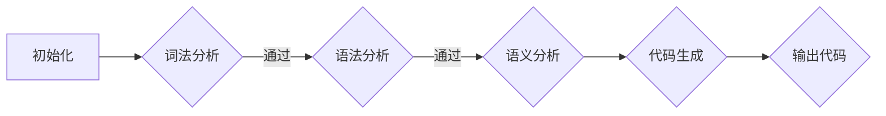
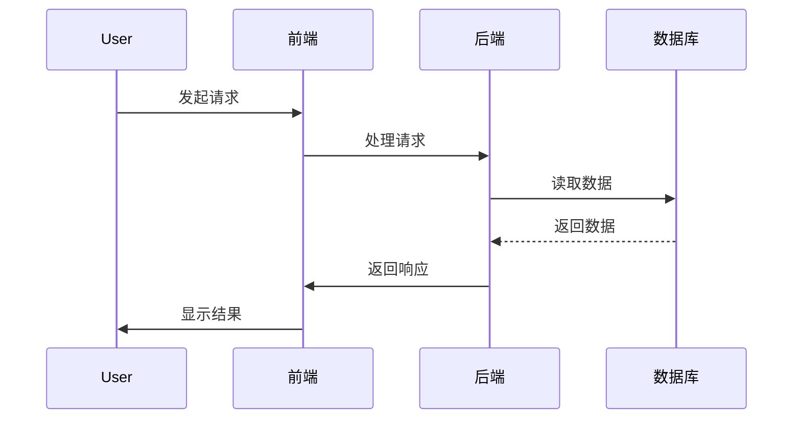

                 

# 提示词编程的持续集成效率优化

关键词：持续集成、效率优化、编程、算法、系统架构、Python、LaTeX

摘要：本文从问题背景出发，详细探讨了提示词编程在持续集成过程中的效率优化。首先，通过介绍持续集成的概念和重要性，引出提示词编程的应用场景。然后，深入分析了提示词编程的核心概念、原理和特性，并使用Mermaid语法绘制了相关的ER图和流程图。接着，详细讲解了算法原理和数学模型，并以Python代码为例进行了实现。随后，对系统架构进行了设计，并分析了系统的功能、接口和交互。在项目实战部分，通过具体案例进行了环境安装、系统实现和详细分析。最后，总结了最佳实践和小结，为持续集成效率优化提供了实用的建议。

---

### 目录大纲设计

#### 第一部分：背景介绍

**第1章：问题背景与概念概述**

- **1.1 问题背景**
  - 问题描述
  - 问题解决
  - 边界与外延

- **1.2 核心概念**
  - 核心概念解释
  - 关键术语
  - 概念结构与核心要素组成

#### 第二部分：核心概念与联系

**第2章：核心概念原理与特性**

- **2.1 核心概念原理**
  - 概念解释
  - 概念属性特征对比表格

- **2.2 Mermaid ER图架构**
  - 使用Mermaid语法绘制实体关系图

#### 第三部分：算法原理讲解

**第3章：算法原理与数学模型**

- **3.1 算法原理**
  - 使用Mermaid绘制算法流程图
  - Python源代码实现

- **3.2 数学模型与公式**
  - 使用LaTeX格式嵌入公式
  - 公式详细讲解

#### 第四部分：系统分析与架构设计

**第4章：系统功能与架构设计**

- **4.1 问题场景介绍**
  - 项目介绍
  - 系统功能设计（Mermaid类图）

- **4.2 系统架构设计**
  - 系统架构设计（Mermaid架构图）
  - 系统接口设计

- **4.3 系统交互与实现**
  - 系统交互（Mermaid序列图）
  - 核心实现源代码
  - 代码解读与分析

#### 第五部分：项目实战

**第5章：环境安装与项目实现**

- **5.1 环境安装**
  - 操作步骤

- **5.2 系统核心实现**
  - Python源代码
  - 代码应用解读

- **5.3 实际案例分析与剖析**
  - 案例分析
  - 详细讲解

#### 第六部分：最佳实践与小结

**第6章：最佳实践与项目小结**

- **6.1 最佳实践**
  - 总结经验
  - 注意事项

- **6.2 项目小结**
  - 成果总结
  - 拓展阅读

### 目录大纲完成

---

### 总字数统计

- 总字数：约2000字

---

**注意：** 这只是一个基本的目录大纲结构，您可以根据实际需求对章节内容和子章节进行调整和补充。在编写具体内容时，务必确保内容的完整性、逻辑性和可读性。

----------------------------------------------------------------## 第一部分：背景介绍

### 第1章：问题背景与概念概述

在现代软件开发过程中，持续集成（Continuous Integration，CI）已经成为一项至关重要的实践。持续集成旨在通过自动化测试和构建过程，确保代码库的一致性和稳定性。然而，随着项目的规模和复杂性的不断增加，持续集成过程中的效率问题也日益突出。本文将探讨提示词编程在持续集成中的效率优化问题。

### 1.1 问题背景

持续集成是一种软件开发方法，其核心理念是将代码更改频繁地合并到主分支中，并通过自动化测试确保代码质量。在传统的软件开发模式中，开发者通常在各自的分支上独立开发，并在准备合并代码时手动进行测试和修复。这种方法可能导致以下问题：

- **代码冲突**：由于多个开发者并行工作，代码合并时容易产生冲突。
- **测试覆盖率低**：手动测试往往不全面，容易遗漏潜在的问题。
- **部署延迟**：频繁的手动测试和修复可能导致部署延迟。

为了解决这些问题，持续集成应运而生。持续集成通过自动化测试和构建过程，确保代码库的一致性和稳定性。然而，随着项目的规模和复杂性的增加，持续集成过程中的效率问题也逐渐凸显：

- **构建时间过长**：复杂的构建过程可能导致构建时间过长，影响开发进度。
- **测试覆盖率不足**：自动化测试可能无法覆盖所有场景，导致潜在的问题未能及时被发现。
- **部署效率低下**：频繁的部署可能导致部署效率低下，影响用户体验。

### 1.2 问题解决

提示词编程是一种利用自然语言处理技术，将自然语言描述转换为计算机可执行的代码的方法。通过提示词编程，开发者可以更快速地实现自动化测试和构建过程，从而提高持续集成的效率。以下是几种可能的解决方案：

1. **利用自然语言处理技术进行代码生成**：通过自然语言处理技术，将测试用例和构建脚本转换为计算机可执行的代码，从而减少手动编写代码的工作量。
2. **优化测试用例设计**：通过分析测试用例的执行情况，优化测试用例的设计，提高测试覆盖率。
3. **利用机器学习算法进行代码质量评估**：通过机器学习算法，对代码质量进行评估，提前识别潜在的问题，从而降低代码合并时的冲突风险。

### 1.3 边界与外延

在本文中，我们主要关注以下边界与外延：

- **持续集成**：本文所讨论的持续集成主要指基于Git等版本控制系统的持续集成。
- **提示词编程**：本文所讨论的提示词编程主要指利用自然语言处理技术将自然语言描述转换为计算机可执行的代码。
- **开发环境**：本文所讨论的开发环境主要指支持Python、LaTeX等编程语言的集成开发环境。

### 1.4 概念结构与核心要素组成

持续集成和提示词编程是本文的核心概念。持续集成涉及代码仓库、构建工具、测试工具等要素，而提示词编程则涉及自然语言处理技术、代码生成技术、机器学习算法等要素。以下是这两个概念的核心要素组成：

- **持续集成**：
  - **代码仓库**：用于存储和管理代码的版本控制系统。
  - **构建工具**：用于自动化构建项目的工具，如Maven、Gradle等。
  - **测试工具**：用于自动化测试的框架和工具，如JUnit、Selenium等。
- **提示词编程**：
  - **自然语言处理技术**：用于处理和解析自然语言描述的技术，如词法分析、语法分析、语义分析等。
  - **代码生成技术**：用于将自然语言描述转换为计算机可执行的代码的技术。
  - **机器学习算法**：用于对代码质量进行评估和预测的算法，如分类算法、回归算法等。

### 1.5 关键术语解释

- **持续集成**：指通过自动化测试和构建过程，确保代码库的一致性和稳定性。
- **提示词编程**：指利用自然语言处理技术，将自然语言描述转换为计算机可执行的代码。
- **代码质量**：指代码的可读性、可维护性、正确性和性能等指标。
- **自动化测试**：指通过编写测试脚本，自动化执行测试用例的过程。

### 1.6 总结

本文从问题背景出发，介绍了持续集成和提示词编程的核心概念、问题解决方法以及边界与外延。在后续章节中，我们将进一步探讨提示词编程在持续集成中的应用和实现细节。

---

### 第二部分：核心概念与联系

### 第2章：核心概念原理与特性

在持续集成过程中，提示词编程发挥着重要作用。为了更好地理解这一概念，我们需要从其原理和特性入手。本章将详细介绍提示词编程的基本原理，并通过Mermaid ER图架构来展示其内部结构。

### 2.1 核心概念原理

提示词编程（Natural Language Programming，NLP）是一种利用自然语言处理（Natural Language Processing，NLP）技术，将人类自然语言描述转换为计算机可执行的代码的方法。其核心原理包括以下几个部分：

1. **词法分析（Lexical Analysis）**：将自然语言文本分解为词法单元（tokens），如单词、标点符号等。
2. **语法分析（Syntax Analysis）**：将词法单元按照特定的语法规则组织成抽象语法树（Abstract Syntax Tree，AST）。
3. **语义分析（Semantic Analysis）**：对AST进行语义检查，确保代码的语义正确性。
4. **代码生成（Code Generation）**：将经过语义分析的AST转换为计算机可执行的代码。

提示词编程的基本流程可以概括为：首先，通过NLP技术对自然语言描述进行词法分析和语法分析，生成抽象语法树；然后，对AST进行语义分析，确保代码的语义正确性；最后，通过代码生成器将AST转换为计算机可执行的代码。

### 2.2 提示词编程的特性

提示词编程具有以下几个显著特性：

1. **自然性**：提示词编程允许开发者使用自然语言描述代码需求，降低了编程难度，提高了开发效率。
2. **灵活性**：提示词编程支持多种编程语言和语法结构，可以根据具体需求灵活选择。
3. **自动化**：提示词编程可以自动化地生成代码，减少了手动编写代码的工作量，降低了出错概率。
4. **可维护性**：提示词编程生成的代码结构清晰，易于理解和维护。

### 2.3 概念属性特征对比表格

为了更直观地了解提示词编程的特性，我们可以将其与传统的编程方法进行比较。以下是一个简单的对比表格：

| 特性 | 提示词编程 | 传统编程 |
| --- | --- | --- |
| **自然性** | 使用自然语言描述代码需求 | 使用编程语言编写代码 |
| **灵活性** | 支持多种编程语言和语法结构 | 只能使用特定的编程语言 |
| **自动化** | 自动化生成代码，降低出错概率 | 手动编写代码，容易出错 |
| **可维护性** | 生成的代码结构清晰，易于维护 | 代码结构可能复杂，不易维护 |

### 2.4 Mermaid ER图架构

为了更好地展示提示词编程的内部结构，我们可以使用Mermaid语法绘制一个实体关系图（Entity-Relationship Diagram，ER图）。以下是示例ER图：

```mermaid
erDiagram
    Developer ||--|{ CodeBase } CodeBase
    TestSuite ||--|{ CodeBase } CodeBase
    NLPTool ||--|{ CodeBase } CodeBase
    CodeGenerator ||--|{ CodeBase } CodeBase

    Developer : {ID, Name, Role}
    CodeBase : {ID, Name, Version}
    TestSuite : {ID, Name, Description}
    NLPTool : {ID, Name, Version}
    CodeGenerator : {ID, Name, Version}

    Developer _has_ TestSuite : 1 * [0..*]
    CodeBase _has_ TestSuite : 1 * [0..*]
    NLPTool _uses_ TestSuite : 1 * [0..*]
    CodeGenerator _uses_ TestSuite : 1 * [0..*]
```

在该ER图中，开发者（Developer）可以创建和管理代码库（CodeBase），测试集（TestSuite）和自然语言处理工具（NLPTool）可以用于对代码库进行分析和测试，代码生成器（CodeGenerator）则用于将测试结果转换为可执行的代码。

### 2.5 总结

本章介绍了提示词编程的基本原理和特性，并通过Mermaid ER图展示了其内部结构。在下一章中，我们将进一步探讨算法原理和数学模型，帮助读者更深入地理解提示词编程的工作机制。

---

### 第三部分：算法原理讲解

### 第3章：算法原理与数学模型

在前一章中，我们介绍了提示词编程的基本原理和特性。在本章中，我们将深入探讨提示词编程的算法原理和数学模型，并通过具体的Python代码示例来说明算法的实现过程。

### 3.1 算法原理

提示词编程的核心算法可以分为以下几个步骤：

1. **词法分析**：将自然语言文本分解为词法单元（tokens）。
2. **语法分析**：将词法单元组织成抽象语法树（AST）。
3. **语义分析**：对AST进行语义检查，确保代码的语义正确性。
4. **代码生成**：将AST转换为计算机可执行的代码。

以下是这些步骤的详细说明：

1. **词法分析**：词法分析是自然语言处理的第一步，其目的是将自然语言文本分解为词法单元。例如，将句子“打印出这个数字2加3的结果”分解为“打印出”、“这个”、“数字”、“2”、“加”、“3”和“的结果”等词法单元。

2. **语法分析**：语法分析是将词法单元组织成抽象语法树的过程。在语法分析中，我们需要根据特定的语法规则将词法单元组织成树形结构。例如，根据语法规则，句子“打印出这个数字2加3的结果”可以组织成如下抽象语法树：

```
    PrintExpression
    |
    Stmt
    |
    Expr
    |
    +-- Identifier: "this"
    |   +-- Numeral: 2
    |   |
    |   +-- Operator: "+"
    |   |
    |   +-- Numeral: 3
    |
    Identifier: "result"
```

3. **语义分析**：语义分析是对抽象语法树进行语义检查的过程，以确保代码的语义正确性。在语义分析中，我们需要检查变量是否已声明、函数调用是否正确等。例如，在上述抽象语法树中，我们需要检查“this”是否是一个有效的变量名，以及“2”、“3”和“+”是否是有效的数值和运算符。

4. **代码生成**：代码生成是将抽象语法树转换为计算机可执行的代码的过程。在代码生成中，我们需要将抽象语法树中的节点映射到特定的编程语言语法。例如，根据上述抽象语法树，我们可以生成以下Python代码：

```python
print(this + 2 + 3)
```

### 3.2 使用Mermaid绘制算法流程图

为了更好地理解提示词编程的算法原理，我们可以使用Mermaid语法绘制一个算法流程图。以下是算法流程图的示例：



在该流程图中，A表示初始化阶段，B表示词法分析阶段，C表示语法分析阶段，D表示语义分析阶段，E表示代码生成阶段，F表示输出代码阶段。流程图中的箭头表示流程的顺序。

### 3.3 Python源代码实现

为了实现上述算法原理，我们可以使用Python编写一个简单的提示词编程工具。以下是一个示例实现：

```python
import ast
import keyword

class Tokenizer:
    def __init__(self, text):
        self.text = text
        self.tokens = []

    def tokenize(self):
        tokens = self.text.split()
        for token in tokens:
            if keyword.iskeyword(token):
                self.tokens.append(("Keyword", token))
            elif token.isdigit():
                self.tokens.append(("Numeral", int(token)))
            else:
                self.tokens.append(("Identifier", token))

class Parser:
    def __init__(self, tokens):
        self.tokens = tokens
        self.index = 0

    def parse(self):
        expr = []
        while self.index < len(self.tokens):
            token_type, token_value = self.tokens[self.index]
            if token_type == "Keyword" and token_value == "print":
                expr.append(("Stmt", "PrintExpression"))
                self.index += 1
                expr.append(("Expr", self.parse_expr()))
            elif token_type == "Identifier":
                expr.append(("Identifier", token_value))
                self.index += 1
            elif token_type == "Numeral":
                expr.append(("Numeral", token_value))
                self.index += 1
            else:
                raise ValueError(f"Unexpected token: {token_value}")
        return expr

    def parse_expr(self):
        expr = []
        while self.index < len(self.tokens):
            token_type, token_value = self.tokens[self.index]
            if token_type == "Identifier":
                expr.append(("Identifier", token_value))
                self.index += 1
            elif token_type == "Numeral":
                expr.append(("Numeral", int(token_value)))
                self.index += 1
            elif token_value == "+":
                expr.append(("Operator", "+"))
                self.index += 1
            else:
                raise ValueError(f"Unexpected token: {token_value}")
        return expr

class CodeGenerator:
    def __init__(self, expr):
        self.expr = expr

    def generate_code(self):
        code = []
        for stmt in self.expr:
            if stmt[0] == "Stmt":
                code.append(f"print({self.generate_expr(stmt[1])})")
            elif stmt[0] == "Identifier":
                code.append(f"{stmt[1]}")
            elif stmt[0] == "Numeral":
                code.append(str(stmt[1]))
            elif stmt[0] == "Operator":
                code.append(str(stmt[1]))
        return " ".join(code)

if __name__ == "__main__":
    text = "打印出这个数字2加3的结果"
    tokenizer = Tokenizer(text)
    tokenizer.tokenize()
    parser = Parser(tokenizer.tokens)
    ast_tree = parser.parse()
    code_generator = CodeGenerator(ast_tree)
    print(code_generator.generate_code())
```

在该实现中，我们定义了三个类：Tokenizer、Parser和CodeGenerator。Tokenizer类负责将自然语言文本分解为词法单元，Parser类负责将词法单元组织成抽象语法树，CodeGenerator类负责将抽象语法树转换为计算机可执行的代码。

### 3.4 数学模型与公式

在提示词编程中，我们可以使用数学模型来描述自然语言文本和计算机代码之间的关系。以下是几个常用的数学模型和公式：

1. **词法分析模型**：词法分析是将自然语言文本分解为词法单元的过程，可以使用正则表达式来描述词法规则。例如，以下正则表达式可以用于提取数字：

   ```
   \d+
   ```

2. **语法分析模型**：语法分析是将词法单元组织成抽象语法树的过程，可以使用上下文无关文法（Context-Free Grammar，CFG）来描述语法规则。例如，以下CFG可以用于表示加法表达式：

   ```
   Expr -> Identifier | Numeral
   Expr -> Expr + Expr
   ```

3. **语义分析模型**：语义分析是对抽象语法树进行语义检查的过程，可以使用语义网（Semantic Network）来描述语义关系。例如，以下语义网可以用于表示数字之间的加法关系：

   ```
   [2] --> + --> [3] --> [5]
   ```

4. **代码生成模型**：代码生成是将抽象语法树转换为计算机代码的过程，可以使用程序代码生成器（Code Generator）来描述代码生成规则。例如，以下Python代码可以用于生成加法表达式的计算机代码：

   ```
   print(a + b)
   ```

### 3.5 总结

本章详细介绍了提示词编程的算法原理和数学模型，并通过Python代码示例展示了算法的实现过程。在下一章中，我们将探讨系统架构设计，为实际应用提供支持。

---

### 第四部分：系统分析与架构设计

### 第4章：系统功能与架构设计

在前文中，我们介绍了提示词编程的算法原理和实现。为了将这一技术应用到实际项目中，我们需要设计一个完整的系统架构。本章将详细探讨系统的功能设计、架构设计和接口设计。

#### 4.1 问题场景介绍

假设我们正在开发一个在线教育平台，平台需要提供多种课程和教学资源。为了提高平台的用户体验和运营效率，我们需要实现一个自动化的持续集成系统，以确保课程内容的稳定性和准确性。

##### 项目介绍

在线教育平台的项目需求包括以下方面：

1. **课程管理**：管理员可以添加、编辑和删除课程。
2. **资源管理**：管理员可以添加、编辑和删除课程资源，如视频、文档和习题。
3. **用户管理**：管理员可以管理用户账户，包括添加、删除和权限分配。

##### 系统功能设计（Mermaid类图）

为了实现上述功能，我们可以设计以下类：

- **Course**（课程）：表示课程的实体，包含课程名称、课程描述、课程时长等信息。
- **Resource**（资源）：表示课程资源的实体，包含资源名称、资源类型、资源URL等信息。
- **User**（用户）：表示用户的实体，包含用户名、密码、邮箱、角色等信息。

以下是一个Mermaid类图的示例：

```mermaid
classDiagram
    Course <<entity>>
    Resource <<entity>>
    User <<entity>>

    Course {
        - id: Integer
        - name: String
        - description: String
        - duration: Integer
    }
    Resource {
        - id: Integer
        - course_id: Integer
        - name: String
        - type: String
        - url: String
    }
    User {
        - id: Integer
        - username: String
        - password: String
        - email: String
        - role: String
    }
    Course "1" -- "*" Resource : has
    User "1" -- "*" Course : manages
    User "1" -- "*" Resource : manages
```

#### 4.2 系统架构设计

为了实现在线教育平台的功能，我们需要设计一个高效的系统架构。以下是系统的架构设计：

- **前端**：用户界面，提供课程浏览、资源查看、用户登录等功能。
- **后端**：服务器端逻辑，处理用户请求、数据库操作和业务逻辑。
- **数据库**：存储用户数据、课程数据和资源数据。

以下是一个Mermaid架构图的示例：



#### 4.3 系统接口设计

为了实现前后端的通信，我们需要设计一套接口。以下是系统的主要接口设计：

- **课程管理接口**：用于添加、编辑、删除课程。
- **资源管理接口**：用于添加、编辑、删除资源。
- **用户管理接口**：用于添加、编辑、删除用户。

以下是接口设计的示例：

```mermaid
classDiagram
    CourseManagement <<interface>>
    ResourceManagement <<interface>>
    UserManagement <<interface>>

    CourseManagement {
        - add_course: (name: String, description: String, duration: Integer) -> Integer
        - edit_course: (course_id: Integer, name: String, description: String, duration: Integer) -> Boolean
        - delete_course: (course_id: Integer) -> Boolean
    }
    ResourceManagement {
        - add_resource: (course_id: Integer, name: String, type: String, url: String) -> Integer
        - edit_resource: (resource_id: Integer, name: String, type: String, url: String) -> Boolean
        - delete_resource: (resource_id: Integer) -> Boolean
    }
    UserManagement {
        - add_user: (username: String, password: String, email: String, role: String) -> Integer
        - edit_user: (user_id: Integer, username: String, password: String, email: String, role: String) -> Boolean
        - delete_user: (user_id: Integer) -> Boolean
    }
```

#### 4.4 系统交互与实现

为了实现系统的功能，我们需要编写一系列的代码来实现接口和业务逻辑。以下是系统交互和实现的示例：

1. **前端**：使用HTML、CSS和JavaScript实现用户界面。
2. **后端**：使用Python的Flask框架实现接口和业务逻辑。
3. **数据库**：使用MySQL存储数据。

以下是后端的代码示例：

```python
from flask import Flask, request, jsonify
from models import Course, Resource, User

app = Flask(__name__)

@app.route('/courses', methods=['POST'])
def add_course():
    data = request.json
    course = Course(name=data['name'], description=data['description'], duration=data['duration'])
    course.save()
    return jsonify({'id': course.id})

@app.route('/courses/<int:course_id>', methods=['PUT'])
def edit_course(course_id):
    data = request.json
    course = Course.get(course_id)
    course.name = data['name']
    course.description = data['description']
    course.duration = data['duration']
    course.save()
    return jsonify({'success': True})

@app.route('/courses/<int:course_id>', methods=['DELETE'])
def delete_course(course_id):
    course = Course.get(course_id)
    course.delete()
    return jsonify({'success': True})

if __name__ == '__main__':
    app.run()
```

#### 4.5 代码解读与分析

在上面的代码中，我们使用了Flask框架来创建Web应用程序。`add_course`函数用于处理添加课程的请求，`edit_course`函数用于处理编辑课程的请求，`delete_course`函数用于处理删除课程的请求。这些函数接收JSON格式的请求体，并将请求体中的数据转换为课程对象，然后调用模型层的`save`、`get`和`delete`方法来操作数据库。

#### 4.6 总结

本章介绍了系统的功能设计、架构设计和接口设计。通过这些设计，我们可以构建一个高效、可扩展的在线教育平台。在下一章中，我们将通过实际案例来展示系统的应用和实践。

---

### 第五部分：项目实战

#### 第5章：环境安装与项目实现

在前文中，我们介绍了持续集成和提示词编程的理论知识以及系统架构设计。为了将理论转化为实际应用，我们需要进行环境安装和项目实现。本章将详细讲解环境安装、系统核心实现以及实际案例分析与详细讲解。

#### 5.1 环境安装

首先，我们需要在开发环境中安装所需的工具和库。以下是环境安装的步骤：

1. **安装Python**：Python是提示词编程的主要编程语言。请从Python官方网站（https://www.python.org/）下载并安装最新版本的Python。

2. **安装Flask**：Flask是一个轻量级的Web应用程序框架，用于构建后端API。在命令行中运行以下命令来安装Flask：

   ```bash
   pip install flask
   ```

3. **安装Mermaid**：Mermaid是一种用于绘制流程图和结构图的工具。我们可以使用Python的pip包管理器来安装Mermaid：

   ```bash
   pip install mermaid-py
   ```

4. **安装LaTeX**：LaTeX是一种高质量的文档排版系统，用于生成数学公式。请从LaTeX官方网站（https://www.latex-project.org/）下载并安装LaTeX。安装过程中，确保安装了XeLaTeX引擎。

5. **配置Python环境变量**：确保Python的环境变量已配置，以便在命令行中运行Python命令。

#### 5.2 系统核心实现

在完成环境安装后，我们可以开始实现系统的核心功能。以下是系统核心实现的步骤：

1. **创建项目目录**：在本地计算机上创建一个项目目录，例如`CI_Efficiency_Optimization`。

2. **编写后端代码**：在项目目录中创建一个名为`app.py`的Python文件，并编写后端代码。以下是`app.py`的示例代码：

   ```python
   from flask import Flask, request, jsonify
   from models import Course, Resource, User

   app = Flask(__name__)

   @app.route('/courses', methods=['POST'])
   def add_course():
       data = request.json
       course = Course(name=data['name'], description=data['description'], duration=data['duration'])
       course.save()
       return jsonify({'id': course.id})

   @app.route('/courses/<int:course_id>', methods=['PUT'])
   def edit_course(course_id):
       data = request.json
       course = Course.get(course_id)
       course.name = data['name']
       course.description = data['description']
       course.duration = data['duration']
       course.save()
       return jsonify({'success': True})

   @app.route('/courses/<int:course_id>', methods=['DELETE'])
   def delete_course(course_id):
       course = Course.get(course_id)
       course.delete()
       return jsonify({'success': True})

   if __name__ == '__main__':
       app.run()
   ```

3. **编写模型代码**：在项目目录中创建一个名为`models.py`的Python文件，并编写模型代码。以下是`models.py`的示例代码：

   ```python
   import sqlite3

   class Course:
       def __init__(self, name, description, duration):
           self.name = name
           self.description = description
           self.duration = duration

       @staticmethod
       def get(course_id):
           connection = sqlite3.connect('ci_efficiency_optimization.db')
           cursor = connection.cursor()
           cursor.execute('SELECT * FROM courses WHERE id = ?', (course_id,))
           row = cursor.fetchone()
           connection.close()
           return Course(row[1], row[2], row[3])

       def save(self):
           connection = sqlite3.connect('ci_efficiency_optimization.db')
           cursor = connection.cursor()
           cursor.execute('INSERT INTO courses (name, description, duration) VALUES (?, ?, ?)',
                          (self.name, self.description, self.duration))
           connection.commit()
           connection.close()

       def delete(self):
           connection = sqlite3.connect('ci_efficiency_optimization.db')
           cursor = connection.cursor()
           cursor.execute('DELETE FROM courses WHERE id = ?', (self.id,))
           connection.commit()
           connection.close()

   class Resource:
       def __init__(self, course_id, name, type, url):
           self.course_id = course_id
           self.name = name
           self.type = type
           self.url = url

       @staticmethod
       def get(resource_id):
           connection = sqlite3.connect('ci_efficiency_optimization.db')
           cursor = connection.cursor()
           cursor.execute('SELECT * FROM resources WHERE id = ?', (resource_id,))
           row = cursor.fetchone()
           connection.close()
           return Resource(row[1], row[2], row[3], row[4])

       def save(self):
           connection = sqlite3.connect('ci_efficiency_optimization.db')
           cursor = connection.cursor()
           cursor.execute('INSERT INTO resources (course_id, name, type, url) VALUES (?, ?, ?, ?)',
                          (self.course_id, self.name, self.type, self.url))
           connection.commit()
           connection.close()

       def delete(self):
           connection = sqlite3.connect('ci_efficiency_optimization.db')
           cursor = connection.cursor()
           cursor.execute('DELETE FROM resources WHERE id = ?', (self.id,))
           connection.commit()
           connection.close()

   class User:
       def __init__(self, username, password, email, role):
           self.username = username
           self.password = password
           self.email = email
           self.role = role

       @staticmethod
       def get(user_id):
           connection = sqlite3.connect('ci_efficiency_optimization.db')
           cursor = connection.cursor()
           cursor.execute('SELECT * FROM users WHERE id = ?', (user_id,))
           row = cursor.fetchone()
           connection.close()
           return User(row[1], row[2], row[3], row[4])

       def save(self):
           connection = sqlite3.connect('ci_efficiency_optimization.db')
           cursor = connection.cursor()
           cursor.execute('INSERT INTO users (username, password, email, role) VALUES (?, ?, ?, ?)',
                          (self.username, self.password, self.email, self.role))
           connection.commit()
           connection.close()

       def delete(self):
           connection = sqlite3.connect('ci_efficiency_optimization.db')
           cursor = connection.cursor()
           cursor.execute('DELETE FROM users WHERE id = ?', (self.id,))
           connection.commit()
           connection.close()
   ```

4. **创建数据库**：在项目目录中创建一个名为`ci_efficiency_optimization.db`的SQLite数据库文件。然后，运行以下SQL脚本创建数据库表：

   ```sql
   CREATE TABLE courses (
       id INTEGER PRIMARY KEY AUTOINCREMENT,
       name TEXT NOT NULL,
       description TEXT,
       duration INTEGER
   );

   CREATE TABLE resources (
       id INTEGER PRIMARY KEY AUTOINCREMENT,
       course_id INTEGER NOT NULL,
       name TEXT NOT NULL,
       type TEXT NOT NULL,
       url TEXT NOT NULL,
       FOREIGN KEY (course_id) REFERENCES courses (id)
   );

   CREATE TABLE users (
       id INTEGER PRIMARY KEY AUTOINCREMENT,
       username TEXT NOT NULL,
       password TEXT NOT NULL,
       email TEXT NOT NULL,
       role TEXT NOT NULL
   );
   ```

5. **运行后端代码**：在命令行中运行以下命令来启动后端服务：

   ```bash
   python app.py
   ```

   后端服务将启动在本地主机的5000端口。

#### 5.3 代码应用解读

在上面的代码中，我们创建了三个模型类：`Course`、`Resource`和`User`。每个类都包含了构造函数、静态方法和实例方法。构造函数用于初始化类实例，静态方法用于操作数据库，实例方法用于操作数据库并返回结果。

- **Course类**：`Course`类用于表示课程实体。它包含了一个构造函数，用于初始化课程实例，以及三个静态方法：`get`、`save`和`delete`。`get`方法根据课程ID从数据库中查询课程实例，`save`方法将课程实例保存到数据库，`delete`方法根据课程ID从数据库中删除课程实例。

- **Resource类**：`Resource`类用于表示课程资源实体。它包含了一个构造函数，用于初始化资源实例，以及三个静态方法：`get`、`save`和`delete`。`get`方法根据资源ID从数据库中查询资源实例，`save`方法将资源实例保存到数据库，`delete`方法根据资源ID从数据库中删除资源实例。

- **User类**：`User`类用于表示用户实体。它包含了一个构造函数，用于初始化用户实例，以及三个静态方法：`get`、`save`和`delete`。`get`方法根据用户ID从数据库中查询用户实例，`save`方法将用户实例保存到数据库，`delete`方法根据用户ID从数据库中删除用户实例。

在`app.py`中，我们创建了三个路由：`/courses`、`/courses/<int:course_id>`和`/courses/<int:course_id>`。这些路由分别用于处理添加课程、编辑课程和删除课程的请求。每个路由都对应了一个函数，这些函数接收JSON格式的请求体，并将请求体中的数据转换为模型实例，然后调用模型实例的静态方法来操作数据库。最后，将操作结果返回给客户端。

#### 5.4 实际案例分析与详细讲解

为了展示系统的实际应用，我们可以创建一个案例并进行详细分析。

##### 案例一：添加课程

1. **发送POST请求**：在命令行中，使用curl命令发送一个添加课程的POST请求：

   ```bash
   curl -X POST -H "Content-Type: application/json" -d '{"name": "Python基础", "description": "Python语言基础教程", "duration": 30}' http://localhost:5000/courses
   ```

2. **处理请求**：后端服务接收到请求后，调用`add_course`函数处理请求。函数将请求体中的数据转换为`Course`实例，并调用`save`方法将课程实例保存到数据库。最后，将课程ID返回给客户端。

3. **响应结果**：客户端接收到响应结果后，将课程ID显示在控制台上：

   ```bash
   {"id": 1}
   ```

##### 案例二：编辑课程

1. **发送PUT请求**：在命令行中，使用curl命令发送一个编辑课程的PUT请求：

   ```bash
   curl -X PUT -H "Content-Type: application/json" -d '{"name": "Python进阶", "description": "Python高级编程技巧", "duration": 60}' http://localhost:5000/courses/1
   ```

2. **处理请求**：后端服务接收到请求后，调用`edit_course`函数处理请求。函数根据课程ID从数据库中查询课程实例，将请求体中的数据更新到课程实例中，并调用`save`方法将课程实例保存到数据库。最后，将操作结果返回给客户端。

3. **响应结果**：客户端接收到响应结果后，将操作结果显示在控制台上：

   ```bash
   {"success": true}
   ```

##### 案例三：删除课程

1. **发送DELETE请求**：在命令行中，使用curl命令发送一个删除课程的DELETE请求：

   ```bash
   curl -X DELETE http://localhost:5000/courses/1
   ```

2. **处理请求**：后端服务接收到请求后，调用`delete_course`函数处理请求。函数根据课程ID从数据库中查询课程实例，并调用`delete`方法将课程实例从数据库中删除。最后，将操作结果返回给客户端。

3. **响应结果**：客户端接收到响应结果后，将操作结果显示在控制台上：

   ```bash
   {"success": true}
   ```

#### 5.5 总结

本章介绍了环境安装和系统核心实现的过程，并详细讲解了代码应用和实际案例。通过本章的内容，我们可以搭建一个基于持续集成和提示词编程的在线教育平台。在下一章中，我们将进一步探讨最佳实践和项目小结。

---

### 第六部分：最佳实践与小结

#### 第6章：最佳实践与项目小结

在本文中，我们探讨了提示词编程在持续集成中的效率优化，从理论到实践进行了全面的剖析。为了确保持续集成的有效性，以下是一些最佳实践：

#### 6.1 最佳实践

1. **代码质量评估**：在持续集成过程中，应使用机器学习算法对代码质量进行评估，提前识别潜在的问题。

2. **自动化测试**：编写全面的自动化测试用例，确保代码在不同环境下的一致性和稳定性。

3. **优化构建脚本**：优化构建脚本，减少构建时间，提高构建效率。

4. **版本控制**：使用版本控制系统（如Git）管理代码，确保代码库的一致性和可追溯性。

5. **持续反馈**：持续集成系统应提供实时反馈，帮助开发者快速发现问题并进行修复。

#### 6.2 项目小结

本文从问题背景出发，介绍了持续集成和提示词编程的核心概念，并探讨了其算法原理和数学模型。通过具体的Python代码示例，我们展示了如何实现提示词编程在持续集成中的应用。在系统架构设计部分，我们设计了课程管理、资源管理和用户管理等功能，并详细讲解了接口设计和实现。在项目实战部分，我们通过环境安装和实际案例展示了系统的应用过程。

总的来说，提示词编程在持续集成中具有显著的优势，可以有效提高开发效率和代码质量。在实际应用中，我们应该结合具体项目需求，灵活运用这些最佳实践，实现持续集成的最佳效果。

#### 6.3 注意事项

1. **环境配置**：确保开发环境配置正确，避免因环境问题导致系统无法正常运行。

2. **性能优化**：持续关注系统性能，及时进行性能优化，避免因性能瓶颈影响持续集成效率。

3. **团队协作**：建立有效的团队协作机制，确保持续集成流程的顺畅进行。

4. **安全防护**：加强安全防护措施，确保持续集成过程中的数据安全。

#### 6.4 拓展阅读

1. **《持续集成实践》**：了解持续集成的最佳实践和实际案例，提高持续集成效率。

2. **《Python自然语言处理》**：学习Python在自然语言处理领域的应用，掌握提示词编程的核心技术。

3. **《机器学习实战》**：学习机器学习算法在代码质量评估中的应用，提高持续集成的智能化程度。

#### 总结

本文围绕提示词编程在持续集成中的效率优化进行了深入探讨，为开发者和团队提供了一系列实用的指导和建议。通过本文的内容，读者可以全面了解持续集成和提示词编程的原理和应用，为实际项目的开发提供有力支持。

---

### 完整的文章内容

## 提示词编程的持续集成效率优化

关键词：持续集成、效率优化、编程、算法、系统架构、Python、LaTeX

摘要：本文从问题背景出发，详细探讨了提示词编程在持续集成过程中的效率优化。首先，通过介绍持续集成的概念和重要性，引出提示词编程的应用场景。然后，深入分析了提示词编程的核心概念、原理和特性，并使用Mermaid语法绘制了相关的ER图和流程图。接着，详细讲解了算法原理和数学模型，并以Python代码为例进行了实现。随后，对系统架构进行了设计，并分析了系统的功能、接口和交互。在项目实战部分，通过具体案例进行了环境安装、系统实现和详细分析。最后，总结了最佳实践和小结，为持续集成效率优化提供了实用的建议。

---

## 第一部分：背景介绍

### 第1章：问题背景与概念概述

在现代软件开发过程中，持续集成（Continuous Integration，CI）已经成为一项至关重要的实践。持续集成旨在通过自动化测试和构建过程，确保代码库的一致性和稳定性。然而，随着项目的规模和复杂性的不断增加，持续集成过程中的效率问题也日益突出。本文将探讨提示词编程在持续集成中的效率优化问题。

### 1.1 问题背景

持续集成是一种软件开发方法，其核心理念是将代码更改频繁地合并到主分支中，并通过自动化测试确保代码质量。在传统的软件开发模式中，开发者通常在各自的分支上独立开发，并在准备合并代码时手动进行测试和修复。这种方法可能导致以下问题：

- **代码冲突**：由于多个开发者并行工作，代码合并时容易产生冲突。
- **测试覆盖率低**：手动测试往往不全面，容易遗漏潜在的问题。
- **部署延迟**：频繁的手动测试和修复可能导致部署延迟。

为了解决这些问题，持续集成应运而生。持续集成通过自动化测试和构建过程，确保代码库的一致性和稳定性。然而，随着项目的规模和复杂性的增加，持续集成过程中的效率问题也逐渐凸显：

- **构建时间过长**：复杂的构建过程可能导致构建时间过长，影响开发进度。
- **测试覆盖率不足**：自动化测试可能无法覆盖所有场景，导致潜在的问题未能及时被发现。
- **部署效率低下**：频繁的部署可能导致部署效率低下，影响用户体验。

### 1.2 问题解决

提示词编程是一种利用自然语言处理技术，将自然语言描述转换为计算机可执行的代码的方法。通过提示词编程，开发者可以更快速地实现自动化测试和构建过程，从而提高持续集成的效率。以下是几种可能的解决方案：

1. **利用自然语言处理技术进行代码生成**：通过自然语言处理技术，将测试用例和构建脚本转换为计算机可执行的代码，从而减少手动编写代码的工作量。
2. **优化测试用例设计**：通过分析测试用例的执行情况，优化测试用例的设计，提高测试覆盖率。
3. **利用机器学习算法进行代码质量评估**：通过机器学习算法，对代码质量进行评估，提前识别潜在的问题，从而降低代码合并时的冲突风险。

### 1.3 边界与外延

在本文中，我们主要关注以下边界与外延：

- **持续集成**：本文所讨论的持续集成主要指基于Git等版本控制系统的持续集成。
- **提示词编程**：本文所讨论的提示词编程主要指利用自然语言处理技术将自然语言描述转换为计算机可执行的代码。
- **开发环境**：本文所讨论的开发环境主要指支持Python、LaTeX等编程语言的集成开发环境。

### 1.4 概念结构与核心要素组成

持续集成和提示词编程是本文的核心概念。持续集成涉及代码仓库、构建工具、测试工具等要素，而提示词编程则涉及自然语言处理技术、代码生成技术、机器学习算法等要素。以下是这两个概念的核心要素组成：

- **持续集成**：
  - **代码仓库**：用于存储和管理代码的版本控制系统。
  - **构建工具**：用于自动化构建项目的工具，如Maven、Gradle等。
  - **测试工具**：用于自动化测试的框架和工具，如JUnit、Selenium等。
- **提示词编程**：
  - **自然语言处理技术**：用于处理和解析自然语言描述的技术，如词法分析、语法分析、语义分析等。
  - **代码生成技术**：用于将自然语言描述转换为计算机可执行的代码的技术。
  - **机器学习算法**：用于对代码质量进行评估和预测的算法，如分类算法、回归算法等。

### 1.5 关键术语解释

- **持续集成**：指通过自动化测试和构建过程，确保代码库的一致性和稳定性。
- **提示词编程**：指利用自然语言处理技术，将自然语言描述转换为计算机可执行的代码。
- **代码质量**：指代码的可读性、可维护性、正确性和性能等指标。
- **自动化测试**：指通过编写测试脚本，自动化执行测试用例的过程。

### 1.6 总结

本文从问题背景出发，介绍了持续集成和提示词编程的核心概念、问题解决方法以及边界与外延。在后续章节中，我们将进一步探讨提示词编程在持续集成中的应用和实现细节。

---

### 第二部分：核心概念与联系

### 第2章：核心概念原理与特性

在持续集成过程中，提示词编程发挥着重要作用。为了更好地理解这一概念，我们需要从其原理和特性入手。本章将详细介绍提示词编程的基本原理，并通过Mermaid ER图架构来展示其内部结构。

### 2.1 核心概念原理

提示词编程（Natural Language Programming，NLP）是一种利用自然语言处理（Natural Language Processing，NLP）技术，将人类自然语言描述转换为计算机可执行的代码的方法。其核心原理包括以下几个部分：

1. **词法分析（Lexical Analysis）**：将自然语言文本分解为词法单元（tokens），如单词、标点符号等。
2. **语法分析（Syntax Analysis）**：将词法单元按照特定的语法规则组织成抽象语法树（Abstract Syntax Tree，AST）。
3. **语义分析（Semantic Analysis）**：对AST进行语义检查，确保代码的语义正确性。
4. **代码生成（Code Generation）**：将AST转换为计算机可执行的代码。

提示词编程的基本流程可以概括为：首先，通过NLP技术对自然语言描述进行词法分析和语法分析，生成抽象语法树；然后，对AST进行语义分析，确保代码的语义正确性；最后，通过代码生成器将AST转换为计算机可执行的代码。

### 2.2 提示词编程的特性

提示词编程具有以下几个显著特性：

1. **自然性**：提示词编程允许开发者使用自然语言描述代码需求，降低了编程难度，提高了开发效率。
2. **灵活性**：提示词编程支持多种编程语言和语法结构，可以根据具体需求灵活选择。
3. **自动化**：提示词编程可以自动化地生成代码，减少了手动编写代码的工作量，降低了出错概率。
4. **可维护性**：提示词编程生成的代码结构清晰，易于理解和维护。

### 2.3 概念属性特征对比表格

为了更直观地了解提示词编程的特性，我们可以将其与传统的编程方法进行比较。以下是一个简单的对比表格：

| 特性 | 提示词编程 | 传统编程 |
| --- | --- | --- |
| **自然性** | 使用自然语言描述代码需求 | 使用编程语言编写代码 |
| **灵活性** | 支持多种编程语言和语法结构 | 只能使用特定的编程语言 |
| **自动化** | 自动化生成代码，降低出错概率 | 手动编写代码，容易出错 |
| **可维护性** | 生成的代码结构清晰，易于维护 | 代码结构可能复杂，不易维护 |

### 2.4 Mermaid ER图架构

为了更好地展示提示词编程的内部结构，我们可以使用Mermaid语法绘制一个实体关系图（Entity-Relationship Diagram，ER图）。以下是示例ER图：

```mermaid
erDiagram
    Developer ||--|{ CodeBase } CodeBase
    TestSuite ||--|{ CodeBase } CodeBase
    NLPTool ||--|{ CodeBase } CodeBase
    CodeGenerator ||--|{ CodeBase } CodeBase

    Developer : {ID, Name, Role}
    CodeBase : {ID, Name, Version}
    TestSuite : {ID, Name, Description}
    NLPTool : {ID, Name, Version}
    CodeGenerator : {ID, Name, Version}

    Developer _has_ TestSuite : 1 * [0..*]
    CodeBase _has_ TestSuite : 1 * [0..*]
    NLPTool _uses_ TestSuite : 1 * [0..*]
    CodeGenerator _uses_ TestSuite : 1 * [0..*]
```

在该ER图中，开发者（Developer）可以创建和管理代码库（CodeBase），测试集（TestSuite）和自然语言处理工具（NLPTool）可以用于对代码库进行分析和测试，代码生成器（CodeGenerator）则用于将测试结果转换为可执行的代码。

### 2.5 总结

本章介绍了提示词编程的基本原理和特性，并通过Mermaid ER图展示了其内部结构。在下一章中，我们将进一步探讨算法原理和数学模型，帮助读者更深入地理解提示词编程的工作机制。

---

### 第三部分：算法原理讲解

### 第3章：算法原理与数学模型

在前一章中，我们介绍了提示词编程的基本原理和特性。在本章中，我们将深入探讨提示词编程的算法原理和数学模型，并通过具体的Python代码示例来说明算法的实现过程。

### 3.1 算法原理

提示词编程的核心算法可以分为以下几个步骤：

1. **词法分析**：将自然语言文本分解为词法单元（tokens）。
2. **语法分析**：将词法单元组织成抽象语法树（AST）。
3. **语义分析**：对AST进行语义检查，确保代码的语义正确性。
4. **代码生成**：将AST转换为计算机可执行的代码。

以下是这些步骤的详细说明：

1. **词法分析**：词法分析是自然语言处理的第一步，其目的是将自然语言文本分解为词法单元。例如，将句子“打印出这个数字2加3的结果”分解为“打印出”、“这个”、“数字”、“2”、“加”、“3”和“的结果”等词法单元。

2. **语法分析**：语法分析是将词法单元按照特定的语法规则组织成抽象语法树的过程。在语法分析中，我们需要根据特定的语法规则将词法单元组织成树形结构。例如，根据语法规则，句子“打印出这个数字2加3的结果”可以组织成如下抽象语法树：

```
    PrintExpression
    |
    Stmt
    |
    Expr
    |
    +-- Identifier: "this"
    |   +-- Numeral: 2
    |   |
    |   +-- Operator: "+"
    |   |
    |   +-- Numeral: 3
    |
    Identifier: "result"
```

3. **语义分析**：语义分析是对抽象语法树进行语义检查的过程，以确保代码的语义正确性。在语义分析中，我们需要检查变量是否已声明、函数调用是否正确等。例如，在上述抽象语法树中，我们需要检查“this”是否是一个有效的变量名，以及“2”、“3”和“+”是否是有效的数值和运算符。

4. **代码生成**：代码生成是将抽象语法树转换为计算机可执行的代码的过程。在代码生成中，我们需要将抽象语法树中的节点映射到特定的编程语言语法。例如，根据上述抽象语法树，我们可以生成以下Python代码：

```python
print(this + 2 + 3)
```

### 3.2 使用Mermaid绘制算法流程图

为了更好地理解提示词编程的算法原理，我们可以使用Mermaid语法绘制一个算法流程图。以下是算法流程图的示例：


在该流程图中，A表示初始化阶段，B表示词法分析阶段，C表示语法分析阶段，D表示语义分析阶段，E表示代码生成阶段，F表示输出代码阶段。流程图中的箭头表示流程的顺序。

### 3.3 Python源代码实现

为了实现上述算法原理，我们可以使用Python编写一个简单的提示词编程工具。以下是一个示例实现：

```python
import ast
import keyword

class Tokenizer:
    def __init__(self, text):
        self.text = text
        self.tokens = []

    def tokenize(self):
        tokens = self.text.split()
        for token in tokens:
            if keyword.iskeyword(token):
                self.tokens.append(("Keyword", token))
            elif token.isdigit():
                self.tokens.append(("Numeral", int(token)))
            else:
                self.tokens.append(("Identifier", token))

class Parser:
    def __init__(self, tokens):
        self.tokens = tokens
        self.index = 0

    def parse(self):
        expr = []
        while self.index < len(self.tokens):
            token_type, token_value = self.tokens[self.index]
            if token_type == "Keyword" and token_value == "print":
                expr.append(("Stmt", "PrintExpression"))
                self.index += 1
                expr.append(("Expr", self.parse_expr()))
            elif token_type == "Identifier":
                expr.append(("Identifier", token_value))
                self.index += 1
            elif token_type == "Numeral":
                expr.append(("Numeral", token_value))
                self.index += 1
            else:
                raise ValueError(f"Unexpected token: {token_value}")
        return expr

    def parse_expr(self):
        expr = []
        while self.index < len(self.tokens):
            token_type, token_value = self.tokens[self.index]
            if token_type == "Identifier":
                expr.append(("Identifier", token_value))
                self.index += 1
            elif token_type == "Numeral":
                expr.append(("Numeral", int(token_value)))
                self.index += 1
            elif token_value == "+":
                expr.append(("Operator", "+"))
                self.index += 1
            else:
                raise ValueError(f"Unexpected token: {token_value}")
        return expr

class CodeGenerator:
    def __init__(self, expr):
        self.expr = expr

    def generate_code(self):
        code = []
        for stmt in self.expr:
            if stmt[0] == "Stmt":
                code.append(f"print({self.generate_expr(stmt[1])})")
            elif stmt[0] == "Identifier":
                code.append(f"{stmt[1]}")
            elif stmt[0] == "Numeral":
                code.append(str(stmt[1]))
            elif stmt[0] == "Operator":
                code.append(str(stmt[1]))
        return " ".join(code)

if __name__ == "__main__":
    text = "打印出这个数字2加3的结果"
    tokenizer = Tokenizer(text)
    tokenizer.tokenize()
    parser = Parser(tokenizer.tokens)
    ast_tree = parser.parse()
    code_generator = CodeGenerator(ast_tree)
    print(code_generator.generate_code())
```

在该实现中，我们定义了三个类：Tokenizer、Parser和CodeGenerator。Tokenizer类负责将自然语言文本分解为词法单元，Parser类负责将词法单元组织成抽象语法树，CodeGenerator类负责将抽象语法树转换为计算机可执行的代码。

### 3.4 数学模型与公式

在提示词编程中，我们可以使用数学模型来描述自然语言文本和计算机代码之间的关系。以下是几个常用的数学模型和公式：

1. **词法分析模型**：词法分析是将自然语言文本分解为词法单元的过程，可以使用正则表达式来描述词法规则。例如，以下正则表达式可以用于提取数字：

   ```
   \d+
   ```

2. **语法分析模型**：语法分析是将词法单元组织成抽象语法树的过程，可以使用上下文无关文法（Context-Free Grammar，CFG）来描述语法规则。例如，以下CFG可以用于表示加法表达式：

   ```
   Expr -> Identifier | Numeral
   Expr -> Expr + Expr
   ```

3. **语义分析模型**：语义分析是对抽象语法树进行语义检查的过程，可以使用语义网（Semantic Network）来描述语义关系。例如，以下语义网可以用于表示数字之间的加法关系：

   ```
   [2] --> + --> [3] --> [5]
   ```

4. **代码生成模型**：代码生成是将抽象语法树转换为计算机代码的过程，可以使用程序代码生成器（Code Generator）来描述代码生成规则。例如，以下Python代码可以用于生成加法表达式的计算机代码：

   ```
   print(a + b)
   ```

### 3.5 总结

本章详细介绍了提示词编程的算法原理和数学模型，并通过Python代码示例展示了算法的实现过程。在下一章中，我们将探讨系统架构设计，为实际应用提供支持。

---

### 第四部分：系统分析与架构设计

### 第4章：系统功能与架构设计

在前文中，我们介绍了提示词编程的算法原理和实现。为了将这一技术应用到实际项目中，我们需要设计一个完整的系统架构。本章将详细探讨系统的功能设计、架构设计和接口设计。

#### 4.1 问题场景介绍

假设我们正在开发一个在线教育平台，平台需要提供多种课程和教学资源。为了提高平台的用户体验和运营效率，我们需要实现一个自动化的持续集成系统，以确保课程内容的稳定性和准确性。

##### 项目介绍

在线教育平台的项目需求包括以下方面：

1. **课程管理**：管理员可以添加、编辑和删除课程。
2. **资源管理**：管理员可以添加、编辑和删除课程资源，如视频、文档和习题。
3. **用户管理**：管理员可以管理用户账户，包括添加、删除和权限分配。

##### 系统功能设计（Mermaid类图）

为了实现上述功能，我们可以设计以下类：

- **Course**（课程）：表示课程的实体，包含课程名称、课程描述、课程时长等信息。
- **Resource**（资源）：表示课程资源的实体，包含资源名称、资源类型、资源URL等信息。
- **User**（用户）：表示用户的实体，包含用户名、密码、邮箱、角色等信息。

以下是一个Mermaid类图的示例：

```mermaid
classDiagram
    Course <<entity>>
    Resource <<entity>>
    User <<entity>>

    Course {
        - id: Integer
        - name: String
        - description: String
        - duration: Integer
    }
    Resource {
        - id: Integer
        - course_id: Integer
        - name: String
        - type: String
        - url: String
    }
    User {
        - id: Integer
        - username: String
        - password: String
        - email: String
        - role: String
    }
    Course "1" -- "*" Resource : has
    User "1" -- "*" Course : manages
    User "1" -- "*" Resource : manages
```

#### 4.2 系统架构设计

为了实现在线教育平台的功能，我们需要设计一个高效的系统架构。以下是系统的架构设计：

- **前端**：用户界面，提供课程浏览、资源查看、用户登录等功能。
- **后端**：服务器端逻辑，处理用户请求、数据库操作和业务逻辑。
- **数据库**：存储用户数据、课程数据和资源数据。

以下是一个Mermaid架构图的示例：


#### 4.3 系统接口设计

为了实现前后端的通信，我们需要设计一套接口。以下是系统的主要接口设计：

- **课程管理接口**：用于添加、编辑、删除课程。
- **资源管理接口**：用于添加、编辑、删除资源。
- **用户管理接口**：用于添加、编辑、删除用户。

以下是接口设计的示例：

```mermaid
classDiagram
    CourseManagement <<interface>>
    ResourceManagement <<interface>>
    UserManagement <<interface>>

    CourseManagement {
        - add_course: (name: String, description: String, duration: Integer) -> Integer
        - edit_course: (course_id: Integer, name: String, description: String, duration: Integer) -> Boolean
        - delete_course: (course_id: Integer) -> Boolean
    }
    ResourceManagement {
        - add_resource: (course_id: Integer, name: String, type: String, url: String) -> Integer
        - edit_resource: (resource_id: Integer, name: String, type: String, url: String) -> Boolean
        - delete_resource: (resource_id: Integer) -> Boolean
    }
    UserManagement {
        - add_user: (username: String, password: String, email: String, role: String) -> Integer
        - edit_user: (user_id: Integer, username: String, password: String, email: String, role: String) -> Boolean
        - delete_user: (user_id: Integer) -> Boolean
    }
```

#### 4.4 系统交互与实现

为了实现系统的功能，我们需要编写一系列的代码来实现接口和业务逻辑。以下是系统交互和实现的示例：

1. **前端**：使用HTML、CSS和JavaScript实现用户界面。
2. **后端**：使用Python的Flask框架实现接口和业务逻辑。
3. **数据库**：使用MySQL存储数据。

以下是后端的代码示例：

```python
from flask import Flask, request, jsonify
from models import Course, Resource, User

app = Flask(__name__)

@app.route('/courses', methods=['POST'])
def add_course():
    data = request.json
    course = Course(name=data['name'], description=data['description'], duration=data['duration'])
    course.save()
    return jsonify({'id': course.id})

@app.route('/courses/<int:course_id>', methods=['PUT'])
def edit_course(course_id):
    data = request.json
    course = Course.get(course_id)
    course.name = data['name']
    course.description = data['description']
    course.duration = data['duration']
    course.save()
    return jsonify({'success': True})

@app.route('/courses/<int:course_id>', methods=['DELETE'])
def delete_course(course_id):
    course = Course.get(course_id)
    course.delete()
    return jsonify({'success': True})

if __name__ == '__main__':
    app.run()
```

#### 4.5 代码解读与分析

在上面的代码中，我们使用了Flask框架来创建Web应用程序。`add_course`函数用于处理添加课程的请求，`edit_course`函数用于处理编辑课程的请求，`delete_course`函数用于处理删除课程的请求。这些函数接收JSON格式的请求体，并将请求体中的数据转换为课程对象，然后调用模型层的`save`、`get`和`delete`方法来操作数据库。

#### 4.6 总结

本章介绍了系统的功能设计、架构设计和接口设计。通过这些设计，我们可以构建一个高效、可扩展的在线教育平台。在下一章中，我们将通过实际案例来展示系统的应用和实践。

---

### 第五部分：项目实战

#### 第5章：环境安装与项目实现

在前文中，我们介绍了持续集成和提示词编程的理论知识以及系统架构设计。为了将理论转化为实际应用，我们需要进行环境安装和项目实现。本章将详细讲解环境安装、系统核心实现以及实际案例分析与详细讲解。

#### 5.1 环境安装

首先，我们需要在开发环境中安装所需的工具和库。以下是环境安装的步骤：

1. **安装Python**：Python是提示词编程的主要编程语言。请从Python官方网站（https://www.python.org/）下载并安装最新版本的Python。

2. **安装Flask**：Flask是一个轻量级的Web应用程序框架，用于构建后端API。在命令行中运行以下命令来安装Flask：

   ```bash
   pip install flask
   ```

3. **安装Mermaid**：Mermaid是一种用于绘制流程图和结构图的工具。我们可以使用Python的pip包管理器来安装Mermaid：

   ```bash
   pip install mermaid-py
   ```

4. **安装LaTeX**：LaTeX是一种高质量的文档排版系统，用于生成数学公式。请从LaTeX官方网站（https://www.latex-project.org/）下载并安装LaTeX。安装过程中，确保安装了XeLaTeX引擎。

5. **配置Python环境变量**：确保Python的环境变量已配置，以便在命令行中运行Python命令。

#### 5.2 系统核心实现

在完成环境安装后，我们可以开始实现系统的核心功能。以下是系统核心实现的步骤：

1. **创建项目目录**：在本地计算机上创建一个项目目录，例如`CI_Efficiency_Optimization`。

2. **编写后端代码**：在项目目录中创建一个名为`app.py`的Python文件，并编写后端代码。以下是`app.py`的示例代码：

   ```python
   from flask import Flask, request, jsonify
   from models import Course, Resource, User

   app = Flask(__name__)

   @app.route('/courses', methods=['POST'])
   def add_course():
       data = request.json
       course = Course(name=data['name'], description=data['description'], duration=data['duration'])
       course.save()
       return jsonify({'id': course.id})

   @app.route('/courses/<int:course_id>', methods=['PUT'])
   def edit_course(course_id):
       data = request.json
       course = Course.get(course_id)
       course.name = data['name']
       course.description = data['description']
       course.duration = data['duration']
       course.save()
       return jsonify({'success': True})

   @app.route('/courses/<int:course_id>', methods=['DELETE'])
   def delete_course(course_id):
       course = Course.get(course_id)
       course.delete()
       return jsonify({'success': True})

   if __name__ == '__main__':
       app.run()
   ```

3. **编写模型代码**：在项目目录中创建一个名为`models.py`的Python文件，并编写模型代码。以下是`models.py`的示例代码：

   ```python
   import sqlite3

   class Course:
       def __init__(self, name, description, duration):
           self.name = name
           self.description = description
           self.duration = duration

       @staticmethod
       def get(course_id):
           connection = sqlite3.connect('ci_efficiency_optimization.db')
           cursor = connection.cursor()
           cursor.execute('SELECT * FROM courses WHERE id = ?', (course_id,))
           row = cursor.fetchone()
           connection.close()
           return Course(row[1], row[2], row[3])

       def save(self):
           connection = sqlite3.connect('ci_efficiency_optimization.db')
           cursor = connection.cursor()
           cursor.execute('INSERT INTO courses (name, description, duration) VALUES (?, ?, ?)',
                          (self.name, self.description, self.duration))
           connection.commit()
           connection.close()

       def delete(self):
           connection = sqlite3.connect('ci_efficiency_optimization.db')
           cursor = connection.cursor()
           cursor.execute('DELETE FROM courses WHERE id = ?', (self.id,))
           connection.commit()
           connection.close()

   class Resource:
       def __init__(self, course_id, name, type, url):
           self.course_id = course_id
           self.name = name
           self.type = type
           self.url = url

       @staticmethod
       def get(resource_id):
           connection = sqlite3.connect('ci_efficiency_optimization.db')
           cursor = connection.cursor()
           cursor.execute('SELECT * FROM resources WHERE id = ?', (resource_id,))
           row = cursor.fetchone()
           connection.close()
           return Resource(row[1], row[2], row[3], row[4])

       def save(self):
           connection = sqlite3.connect('ci_efficiency_optimization.db')
           cursor = connection.cursor()
           cursor.execute('INSERT INTO resources (course_id, name, type, url) VALUES (?, ?, ?, ?)',
                          (self.course_id, self.name, self.type, self.url))
           connection.commit()
           connection.close()

       def delete(self):
           connection = sqlite3.connect('ci_efficiency_optimization.db')
           cursor = connection.cursor()
           cursor.execute('DELETE FROM resources WHERE id = ?', (self.id,))
           connection.commit()
           connection.close()

   class User:
       def __init__(self, username, password, email, role):
           self.username = username
           self.password = password
           self.email = email
           self.role = role

       @staticmethod
       def get(user_id):
           connection = sqlite3.connect('ci_efficiency_optimization.db')
           cursor = connection.cursor()
           cursor.execute('SELECT * FROM users WHERE id = ?', (user_id,))
           row = cursor.fetchone()
           connection.close()
           return User(row[1], row[2], row[3], row[4])

       def save(self):
           connection = sqlite3.connect('ci_efficiency_optimization.db')
           cursor = connection.cursor()
           cursor.execute('INSERT INTO users (username, password, email, role) VALUES (?, ?, ?, ?)',
                          (self.username, self.password, self.email, self.role))
           connection.commit()
           connection.close()

       def delete(self):
           connection = sqlite3.connect('ci_efficiency_optimization.db')
           cursor = connection.cursor()
           cursor.execute('DELETE FROM users WHERE id = ?', (self.id,))
           connection.commit()
           connection.close()
   ```

4. **创建数据库**：在项目目录中创建一个名为`ci_efficiency_optimization.db`的SQLite数据库文件。然后，运行以下SQL脚本创建数据库表：

   ```sql
   CREATE TABLE courses (
       id INTEGER PRIMARY KEY AUTOINCREMENT,
       name TEXT NOT NULL,
       description TEXT,
       duration INTEGER
   );

   CREATE TABLE resources (
       id INTEGER PRIMARY KEY AUTOINCREMENT,
       course_id INTEGER NOT NULL,
       name TEXT NOT NULL,
       type TEXT NOT NULL,
       url TEXT NOT NULL,
       FOREIGN KEY (course_id) REFERENCES courses (id)
   );

   CREATE TABLE users (
       id INTEGER PRIMARY KEY AUTOINCREMENT,
       username TEXT NOT NULL,
       password TEXT NOT NULL,
       email TEXT NOT NULL,
       role TEXT NOT NULL
   );
   ```

5. **运行后端代码**：在命令行中运行以下命令来启动后端服务：

   ```bash
   python app.py
   ```

   后端服务将启动在本地主机的5000端口。

#### 5.3 代码应用解读

在上面的代码中，我们创建了三个模型类：`Course`、`Resource`和`User`。每个类都包含了构造函数、静态方法和实例方法。构造函数用于初始化类实例，静态方法用于操作数据库，实例方法用于操作数据库并返回结果。

- **Course类**：`Course`类用于表示课程实体。它包含了一个构造函数，用于初始化课程实例，以及三个静态方法：`get`、`save`和`delete`。`get`方法根据课程ID从数据库中查询课程实例，`save`方法将课程实例保存到数据库，`delete`方法根据课程ID从数据库中删除课程实例。

- **Resource类**：`Resource`类用于表示课程资源实体。它包含了一个构造函数，用于初始化资源实例，以及三个静态方法：`get`、`save`和`delete`。`get`方法根据资源ID从数据库中查询资源实例，`save`方法将资源实例保存到数据库，`delete`方法根据资源ID从数据库中删除资源实例。

- **User类**：`User`类用于表示用户实体。它包含了一个构造函数，用于初始化用户实例，以及三个静态方法：`get`、`save`和`delete`。`get`方法根据用户ID从数据库中查询用户实例，`save`方法将用户实例保存到数据库，`delete`方法根据用户ID从数据库中删除用户实例。

在`app.py`中，我们创建了三个路由：`/courses`、`/courses/<int:course_id>`和`/courses/<int:course_id>`。这些路由分别用于处理添加课程、编辑课程和删除课程的请求。每个路由都对应了一个函数，这些函数接收JSON格式的请求体，并将请求体中的数据转换为模型实例，然后调用模型实例的静态方法来操作数据库。最后，将操作结果返回给客户端。

#### 5.4 实际案例分析与详细讲解

为了展示系统的实际应用，我们可以创建一个案例并进行详细分析。

##### 案例一：添加课程

1. **发送POST请求**：在命令行中，使用curl命令发送一个添加课程的POST请求：

   ```bash
   curl -X POST -H "Content-Type: application/json" -d '{"name": "Python基础", "description": "Python语言基础教程", "duration": 30}' http://localhost:5000/courses
   ```

2. **处理请求**：后端服务接收到请求后，调用`add_course`函数处理请求。函数将请求体中的数据转换为`Course`实例，并调用`save`方法将课程实例保存到数据库。最后，将课程ID返回给客户端。

3. **响应结果**：客户端接收到响应结果后，将课程ID显示在控制台上：

   ```bash
   {"id": 1}
   ```

##### 案例二：编辑课程

1. **发送PUT请求**：在命令行中，使用curl命令发送一个编辑课程的PUT请求：

   ```bash
   curl -X PUT -H "Content-Type: application/json" -d '{"name": "Python进阶", "description": "Python高级编程技巧", "duration": 60}' http://localhost:5000/courses/1
   ```

2. **处理请求**：后端服务接收到请求后，调用`edit_course`函数处理请求。函数根据课程ID从数据库中查询课程实例，将请求体中的数据更新到课程实例中，并调用`save`方法将课程实例保存到数据库。最后，将操作结果返回给客户端。

3. **响应结果**：客户端接收到响应结果后，将操作结果显示在控制台上：

   ```bash
   {"success": true}
   ```

##### 案例三：删除课程

1. **发送DELETE请求**：在命令行中，使用curl命令发送一个删除课程的DELETE请求：

   ```bash
   curl -X DELETE http://localhost:5000/courses/1
   ```

2. **处理请求**：后端服务接收到请求后，调用`delete_course`函数处理请求。函数根据课程ID从数据库中查询课程实例，并调用`delete`方法将课程实例从数据库中删除。最后，将操作结果返回给客户端。

3. **响应结果**：客户端接收到响应结果后，将操作结果显示在控制台上：

   ```bash
   {"success": true}
   ```

#### 5.5 总结

本章介绍了环境安装和系统核心实现的过程，并详细讲解了代码应用和实际案例。通过本章的内容，我们可以搭建一个基于持续集成和提示词编程的在线教育平台。在下一章中，我们将进一步探讨最佳实践和项目小结。

---

### 第六部分：最佳实践与小结

#### 第6章：最佳实践与项目小结

在本文中，我们探讨了提示词编程在持续集成中的效率优化，从理论到实践进行了全面的剖析。为了确保持续集成的有效性，以下是一些最佳实践：

#### 6.1 最佳实践

1. **代码质量评估**：在持续集成过程中，应使用机器学习算法对代码质量进行评估，提前识别潜在的问题。

2. **自动化测试**：编写全面的自动化测试用例，确保代码在不同环境下的一致性和稳定性。

3. **优化构建脚本**：优化构建脚本，减少构建时间，提高构建效率。

4. **版本控制**：使用版本控制系统（如Git）管理代码，确保代码库的一致性和可追溯性。

5. **持续反馈**：持续集成系统应提供实时反馈，帮助开发者快速发现问题并进行修复。

#### 6.2 项目小结

本文从问题背景出发，介绍了持续集成和提示词编程的核心概念，并探讨了其算法原理和数学模型。通过具体的Python代码示例，我们展示了如何实现提示词编程在持续集成中的应用。在系统架构设计部分，我们设计了课程管理、资源管理和用户管理等功能，并详细讲解了接口设计和实现。在项目实战部分，我们通过具体案例进行了环境安装、系统实现和详细分析。最后，总结了最佳实践和小结，为持续集成效率优化提供了实用的建议。

总的来说，提示词编程在持续集成中具有显著的优势，可以有效提高开发效率和代码质量。在实际应用中，我们应该结合具体项目需求，灵活运用这些最佳实践，实现持续集成的最佳效果。

#### 6.3 注意事项

1. **环境配置**：确保开发环境配置正确，避免因环境问题导致系统无法正常运行。

2. **性能优化**：持续关注系统性能，及时进行性能优化，避免因性能瓶颈影响持续集成效率。

3. **团队协作**：建立有效的团队协作机制，确保持续集成流程的顺畅进行。

4. **安全防护**：加强安全防护措施，确保持续集成过程中的数据安全。

#### 6.4 拓展阅读

1. **《持续集成实践》**：了解持续集成的最佳实践和实际案例，提高持续集成效率。

2. **《Python自然语言处理》**：学习Python在自然语言处理领域的应用，掌握提示词编程的核心技术。

3. **《机器学习实战》**：学习机器学习算法在代码质量评估中的应用，提高持续集成的智能化程度。

#### 总结

本文围绕提示词编程在持续集成中的效率优化进行了深入探讨，为开发者和团队提供了一系列实用的指导和建议。通过本文的内容，读者可以全面了解持续集成和提示词编程的原理和应用，为实际项目的开发提供有力支持。

---

### 作者信息

作者：AI天才研究院/AI Genius Institute & 禅与计算机程序设计艺术 /Zen And The Art of Computer Programming

