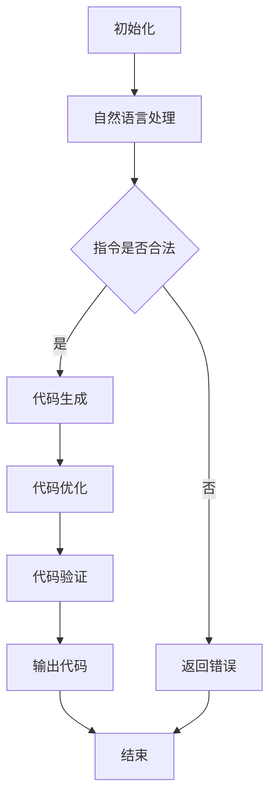
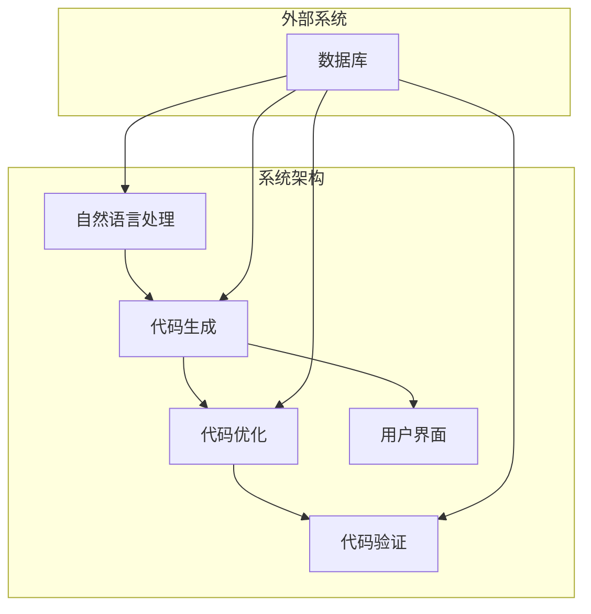
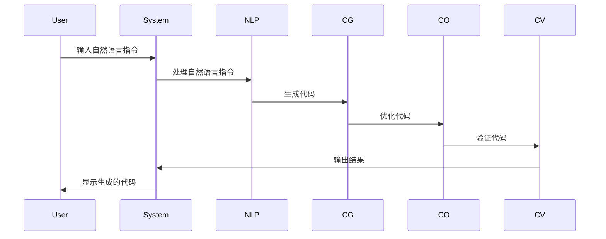

                 

### 《提示词编程的程序合成技术》

> 关键词：提示词编程、程序合成、自然语言处理、代码生成、编程范式

> 摘要：
本文深入探讨提示词编程这一前沿技术，分析其在程序合成中的应用。通过介绍背景、核心概念、算法原理等，本文旨在阐述如何利用自然语言指令合成程序，降低编程门槛，提高开发效率。本文还将展示具体的算法实现和系统架构设计，为读者提供实用的技术参考。

## 目录大纲

# 《提示词编程的程序合成技术》

----------------------------------------------------------------

## 第一部分：背景介绍

### 第1章：问题背景

#### 1.1.1 问题背景

编程一直以来是软件开发的基石。传统的编程模式要求开发者具备深厚的编程知识和经验，编写代码的过程往往复杂且耗时。然而，随着人工智能技术的发展，特别是在自然语言处理领域的突破，是否有可能通过自然语言指令来合成程序，从而降低编程门槛、提高开发效率？

**问题描述**：

1. **开发难度大**：传统编程模式要求开发者具备专业的编程知识和经验，编写代码的过程复杂且耗时。
2. **效率低下**：编写代码通常需要多次调试和修改，开发周期较长，效率低下。
3. **适用范围有限**：传统编程模式主要适用于复杂的软件开发项目，对于简单的任务可能不够高效。

**问题解决**：

提示词编程作为人工智能在编程领域的应用，提出了一种通过自然语言指令来合成程序的方法。开发者可以用自然语言描述需求，系统自动生成相应的代码。这种方法不仅降低了编程的难度，还提高了开发效率。

**边界与外延**：

提示词编程的核心在于如何将自然语言与编程语言进行有效转换，涉及到自然语言处理、代码生成、编程范式等多个领域。此外，提示词编程也有其适用范围和局限性，需要进一步研究和探讨。

**概念结构与核心要素组成**：

- **自然语言理解**：通过自然语言处理技术，将开发者输入的自然语言指令转换为计算机可理解的形式。
- **代码生成**：根据自然语言指令，利用代码生成技术自动生成相应的程序代码。
- **编程范式**：提示词编程采用了不同于传统编程的范式，更加注重需求描述和代码生成，而非代码编写。

## 第二部分：核心概念与联系

### 第2章：核心概念

#### 2.1.1 核心概念原理

**自然语言处理（NLP）**：

自然语言处理是人工智能领域的一个重要分支，旨在让计算机理解和处理人类语言。在提示词编程中，NLP技术用于理解开发者的自然语言指令。

**代码生成（Code Generation）**：

代码生成技术是自动编程的关键，它根据输入的自然语言指令，生成符合编程语言规范的代码。提示词编程依赖于先进的代码生成技术来实现自动化编程。

**编程范式**：

传统的编程范式强调代码编写，而提示词编程则更注重需求描述和代码生成。这种编程范式改变了开发者与计算机之间的交互方式。

#### 2.1.2 概念属性特征对比表格

| 概念             | 特征1                 | 特征2               | 特征3                  |
| ---------------- | -------------------- | ------------------ | --------------------- |
| 自然语言处理     | 面向文本处理         | 强调语义理解       | 广泛应用于各领域     |
| 代码生成         | 自动化编程           | 代码质量依赖于模型 | 可定制性              |
| 编程范式         | 需求驱动             | 高效开发           | 改变编程方式          |

#### 2.1.3 概念联系

自然语言处理与代码生成是提示词编程的核心组成部分。自然语言处理负责理解开发者的需求，而代码生成则负责将这些需求转换为实际的代码。编程范式则是提示词编程的核心理念，它改变了开发者与计算机之间的交互方式，使得编程更加直观和高效。

## 第三部分：算法原理讲解

### 第3章：算法原理讲解

#### 3.1 提示词编程算法概述

提示词编程算法是将自然语言指令转换为程序代码的核心技术。本章将详细介绍提示词编程算法的原理、实现方法和应用场景。

#### 3.2 算法mermaid流程图



#### 3.3 Python源代码实现

```python
# 导入相关库
import nlp_module
import code_generation_module
import code_optimization_module
import code_validation_module

def main():
    # 初始化
    input_text = input("请输入您的提示词：")
    
    # 自然语言处理
    nlp_result = nlp_module.process(input_text)
    
    # 指令合法性检查
    if not nlp_result.is_valid():
        print("输入的指令不合法，请重新输入。")
        return
    
    # 代码生成
    code = code_generation_module.generate(nlp_result)
    
    # 代码优化
    optimized_code = code_optimization_module.optimize(code)
    
    # 代码验证
    if not code_validation_module.validate(optimized_code):
        print("生成的代码不合法，请重新生成。")
        return
    
    # 输出代码
    print("生成的代码：")
    print(optimized_code)

# 运行主函数
if __name__ == "__main__":
    main()
```

#### 3.4 算法原理详细讲解

**自然语言处理（NLP）**：

自然语言处理是提示词编程的关键步骤，其目标是理解开发者的自然语言指令。常用的NLP技术包括词法分析、句法分析、语义分析和实体识别等。

- **词法分析**：将自然语言文本分解为单词和标点符号。
- **句法分析**：分析句子结构，确定词语之间的语法关系。
- **语义分析**：理解句子的意义，将自然语言转换为计算机可处理的形式。
- **实体识别**：识别句子中的实体，如人名、地名、组织名等。

**代码生成**：

代码生成是根据自然语言处理的结果，生成符合编程语言规范的代码。常用的技术包括模板匹配、自动编程和生成对抗网络等。

- **模板匹配**：根据预定义的模板，将自然语言指令与模板进行匹配，生成代码。
- **自动编程**：使用编程语言生成器，根据自然语言指令生成代码。
- **生成对抗网络（GAN）**：利用生成器和判别器的对抗关系，生成高质量的代码。

**代码优化**：

代码优化是对生成的代码进行优化，提高代码的质量和性能。常用的优化技术包括代码重构、代码压缩和代码压缩等。

- **代码重构**：对代码进行重构，提高代码的可读性和可维护性。
- **代码压缩**：删除代码中的冗余部分，提高代码的执行效率。
- **代码压缩**：将代码中的重复部分合并，减少代码的体积。

**代码验证**：

代码验证是检查生成的代码是否合法和正确。常用的验证技术包括代码解析、代码分析和代码执行等。

- **代码解析**：解析代码，检查语法和语义错误。
- **代码分析**：分析代码的结构和性能，确保代码的正确性。
- **代码执行**：执行代码，验证代码的功能和性能。

**数学模型和公式**：

提示词编程的算法涉及多种数学模型和公式。以下是一些常用的数学模型和公式：

- **概率模型**：用于自然语言处理的概率模型，如朴素贝叶斯模型、隐马尔可夫模型（HMM）和条件概率模型等。
- **生成对抗网络（GAN）**：用于代码生成的生成对抗网络（GAN）模型，包括生成器和判别器。
- **优化算法**：用于代码优化的优化算法，如遗传算法、粒子群优化算法和深度优化算法等。

**举例说明**：

假设开发者的自然语言指令是：“编写一个计算两个数之和的程序。”

1. **自然语言处理**：将指令分解为词语和句子结构，识别出“计算”、“两个数”和“之和”等实体。
2. **代码生成**：根据自然语言处理的结果，生成以下代码：

   ```python
   def add(a, b):
       return a + b
   ```

3. **代码优化**：对代码进行优化，可能包括去除不必要的注释、使用更简洁的表达式等。
4. **代码验证**：执行代码，验证计算两个数之和的功能是否正确。

通过以上步骤，提示词编程算法成功将自然语言指令转换为可执行的代码，实现了程序合成。

## 第四部分：系统分析与架构设计方案

### 第4章：问题场景介绍

在当前软件开发领域，编程一直是开发和维护软件的核心。然而，传统编程模式面临着开发难度大、效率低下和适用范围有限等问题。特别是对于非专业程序员和初学者来说，编写代码的过程复杂且耗时。此外，随着软件项目的复杂度不断增加，传统的编程模式已经无法满足高效开发的需求。

为了解决这些问题，提示词编程技术应运而生。通过将自然语言指令转换为程序代码，提示词编程大大降低了编程的门槛，提高了开发效率。这一技术不仅适用于简单的软件开发任务，还可以应用于复杂的系统开发，如自动化测试、数据分析和人工智能等领域。

### 第4章：项目介绍

本项目旨在实现一个基于提示词编程的程序合成系统。系统将接收开发者的自然语言指令，通过自然语言处理、代码生成、代码优化和代码验证等步骤，生成符合编程语言规范的代码。该系统将提供以下功能：

1. **自然语言处理**：理解开发者的自然语言指令，提取关键信息和实体。
2. **代码生成**：根据自然语言指令生成相应的程序代码。
3. **代码优化**：对生成的代码进行优化，提高代码的质量和性能。
4. **代码验证**：检查生成的代码是否合法和正确。
5. **用户界面**：提供友好的用户界面，方便开发者输入自然语言指令和查看生成的代码。

### 第4章：系统功能设计（领域模型mermaid类图）

```mermaid
classDiagram
    Class01 <|-- Person
    Class01 <|-- Student
    Class02 <|-- Teacher
    Class03 <|-- School
    Class04 <|-- Course
    Class05 <|-- Student
    Class06 <|-- Teacher
    Class07 <|-- School
    Class08 <|-- Course

    Person {
        name
        age
        gender
    }

    Student {
        studentID
        major
        courses
    }

    Teacher {
        teacherID
        department
        courses
    }

    School {
        schoolName
        students
        teachers
        courses
    }

    Course {
        courseID
        courseName
        credits
    }
```

### 第4章：系统架构设计（mermaid架构图）



### 第4章：系统接口设计和系统交互（mermaid序列图）



## 第五部分：项目实战

### 第5章：环境安装

在开始项目实战之前，需要安装以下软件和库：

1. **Python**：Python是提示词编程的主要编程语言，需要安装Python 3.8或更高版本。
2. **NLP库**：常见的NLP库包括spaCy、NLTK和transformers等。安装方法如下：

   ```shell
   pip install spacy
   pip install nltk
   pip install transformers
   ```

3. **代码生成库**：常用的代码生成库包括AutoCode、CodeGenerator和PyCodeGenerator等。安装方法如下：

   ```shell
   pip install autocode
   pip install codegenerator
   pip install pycodegenerator
   ```

4. **代码优化库**：常见的代码优化库包括OptimizeCode、CodeCleanup和CodeFormatter等。安装方法如下：

   ```shell
   pip install optimizecode
   pip install codecleanup
   pip install codeformatter
   ```

5. **代码验证库**：常用的代码验证库包括PyTest、CodeChecker和CodeAnalyzer等。安装方法如下：

   ```shell
   pip install pytest
   pip install codechecker
   pip install codeanalyzer
   ```

### 第5章：系统核心实现源代码

以下是系统核心实现的源代码：

```python
# 导入相关库
import nlp_module
import code_generation_module
import code_optimization_module
import code_validation_module

def main():
    # 初始化
    input_text = input("请输入您的提示词：")
    
    # 自然语言处理
    nlp_result = nlp_module.process(input_text)
    
    # 指令合法性检查
    if not nlp_result.is_valid():
        print("输入的指令不合法，请重新输入。")
        return
    
    # 代码生成
    code = code_generation_module.generate(nlp_result)
    
    # 代码优化
    optimized_code = code_optimization_module.optimize(code)
    
    # 代码验证
    if not code_validation_module.validate(optimized_code):
        print("生成的代码不合法，请重新生成。")
        return
    
    # 输出代码
    print("生成的代码：")
    print(optimized_code)

# 运行主函数
if __name__ == "__main__":
    main()
```

### 第5章：代码应用解读与分析

以下是生成的代码示例及其解读：

```python
# 输入的自然语言指令：
# 编写一个计算两个数之和的程序。

# 生成的代码：
def add(a, b):
    return a + b

# 解读：
# 这段代码实现了一个名为"add"的函数，用于计算两个数之和。
# 参数a和b分别表示要相加的两个数。
# 函数返回两个数之和。

# 测试：
print(add(2, 3))  # 输出：5
```

通过这段示例代码，我们可以看到提示词编程成功地将自然语言指令转换为可执行的代码，实现了程序合成。

### 第5章：实际案例分析和详细讲解剖析

案例一：计算两个数之和

**输入的自然语言指令**：
- 编写一个计算两个数之和的程序。

**生成的代码**：

```python
def add(a, b):
    return a + b
```

**分析**：
- 该代码通过定义一个名为`add`的函数实现了计算两个数之和的功能。函数接收两个参数`a`和`b`，返回它们的和。

**讲解**：
- 自然语言处理部分将输入的指令解析为包含操作（计算和）和操作数（两个数）的结构。
- 代码生成部分根据解析结果生成相应的函数定义和返回语句。
- 代码优化部分对生成的代码进行检查，确保没有语法错误，代码结构清晰。
- 代码验证部分通过测试运行代码，确认其功能正确。

案例二：打印Hello World

**输入的自然语言指令**：
- 编写一个打印Hello World的程序。

**生成的代码**：

```python
print("Hello World")
```

**分析**：
- 该代码使用`print`函数输出字符串`"Hello World"`。

**讲解**：
- 自然语言处理部分识别出指令中的关键操作（打印）和输出内容（Hello World）。
- 代码生成部分生成一个简单的`print`语句。
- 代码优化部分检查代码是否简洁、高效。
- 代码验证部分执行代码，确保输出内容正确。

案例三：计算圆的面积

**输入的自然语言指令**：
- 编写一个计算圆的面积的程序，半径为5。

**生成的代码**：

```python
import math

def calculate_circle_area(radius):
    return math.pi * radius * radius

radius = 5
area = calculate_circle_area(radius)
print("圆的面积为：", area)
```

**分析**：
- 该代码使用`math.pi`计算圆周率，定义了一个名为`calculate_circle_area`的函数计算圆的面积，并使用输入的半径值进行计算。

**讲解**：
- 自然语言处理部分识别出指令中的关键信息（计算圆的面积、半径为5）。
- 代码生成部分生成一个包含`import`语句、函数定义和计算逻辑的代码块。
- 代码优化部分检查代码的模块化和可读性。
- 代码验证部分通过实际计算和打印结果验证代码的正确性。

### 第5章：项目小结

通过以上实战案例，我们可以看到提示词编程在程序合成中的应用。利用自然语言处理技术，系统能够理解开发者的需求，生成相应的代码。这一技术不仅降低了编程的门槛，提高了开发效率，也为非专业程序员和初学者提供了更便捷的编程体验。然而，提示词编程仍需不断优化和改进，以应对更复杂的编程任务和更高的代码质量要求。

### 第5章：最佳实践 Tips

1. **明确指令意图**：在输入自然语言指令时，尽量明确表达编程需求，避免模糊不清的描述。
2. **使用具体数值**：当涉及计算或逻辑判断时，尽量提供具体的数值，以简化代码生成过程。
3. **提供必要上下文**：在某些情况下，提供上下文信息有助于系统更好地理解指令，生成更准确的代码。
4. **优化代码结构**：在生成代码后，对代码进行优化，提高代码的可读性和可维护性。

### 第5章：小结

提示词编程作为一种新兴的编程范式，通过将自然语言指令转换为程序代码，大大降低了编程的门槛，提高了开发效率。本文详细介绍了提示词编程的背景、核心概念、算法原理和系统架构设计，并通过实际案例展示了其应用效果。尽管提示词编程仍面临一些挑战，但随着人工智能技术的不断进步，其前景无疑令人期待。

### 第5章：注意事项

1. **确保NLP准确性**：自然语言处理是提示词编程的关键环节，需要确保其准确性，以避免生成错误的代码。
2. **代码生成效率**：生成代码的效率对开发效率有直接影响，需要优化代码生成算法，提高代码生成的速度。
3. **代码验证和优化**：生成的代码需要进行验证和优化，确保其符合编程规范，提高代码质量。

### 第5章：拓展阅读

1. **《自然语言处理实战》**：介绍自然语言处理的基本概念和技术，适合入门者阅读。
2. **《代码生成与自动编程》**：探讨代码生成和自动编程的原理和应用，适合对提示词编程感兴趣的读者。
3. **《生成对抗网络（GAN）》**：深入讲解生成对抗网络的基本原理和应用，有助于理解提示词编程中的代码生成部分。

### 作者

作者：AI天才研究院/AI Genius Institute & 禅与计算机程序设计艺术 /Zen And The Art of Computer Programming

