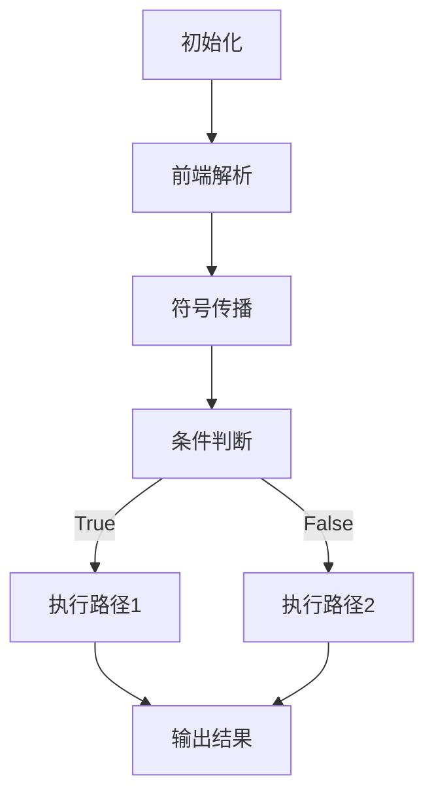

                 

### 提示词编程的符号执行与程序分析

关键词：符号执行、提示词编程、程序分析、代码验证、漏洞挖掘

摘要：本文深入探讨了提示词编程与符号执行的结合，从基本概念、原理到应用场景，全面剖析了这一技术在程序分析领域的潜力与挑战。通过详细的原理讲解、算法流程图展示和实际案例分析，本文旨在为开发者提供一种新的程序分析思路，助力软件质量和安全性的提升。

### 第1章 提示词编程的符号执行与程序分析概述

#### 1.1 问题背景与介绍

在当今信息化时代，软件的开发和维护变得越来越复杂。随着软件规模的不断扩大，程序错误和漏洞的出现也愈加频繁。为了提高软件质量，减少错误和漏洞，程序分析技术应运而生。其中，符号执行和提示词编程是两种重要的技术手段。

**1.1.1 符号执行技术的基本概念**

符号执行（Symbolic Execution）是一种程序分析技术，通过将程序中的具体输入值替换为符号变量，模拟程序的执行过程，以探索程序在不同输入条件下的行为。符号执行的核心思想是抽象解释，它不需要实际运行程序，而是通过模拟程序运行来验证程序的正确性。

**1.1.1.1 符号执行的定义**

符号执行是一种动态分析技术，它将程序中的每一条路径都抽象为一个符号变量，并在这些变量之间建立约束关系。通过求解这些约束关系，可以分析程序在不同输入条件下的行为。

**1.1.1.2 符号执行的作用**

符号执行主要用于以下几个方面：

- **程序验证**：通过符号执行，可以验证程序在给定输入条件下的执行结果是否正确。
- **漏洞挖掘**：符号执行可以用来发现程序中的潜在漏洞，从而提高软件的安全性。
- **代码优化**：通过符号执行，可以分析代码的性能瓶颈，并提出优化建议。

**1.1.2 提示词编程的概念**

提示词编程（Prompt-Based Programming）是一种基于人类语言和自然交互的编程方法。通过向程序输入自然语言提示词，程序能够自动生成代码或者执行特定任务。提示词编程的核心在于自然语言处理和代码生成技术。

**1.1.2.1 提示词编程的优势**

提示词编程具有以下优势：

- **代码生成效率高**：通过自然语言提示词，程序能够快速生成代码，提高开发效率。
- **易于上手**：对于非专业程序员或初学者来说，提示词编程降低了学习门槛。
- **降低开发成本**：通过自动生成代码，可以减少人力成本，提高开发效率。

**1.1.3 符号执行与提示词编程的结合**

将符号执行与提示词编程结合，可以充分发挥两者的优势。通过符号执行，对提示词编程生成的代码进行分析，可以验证代码的正确性，发现潜在问题。同时，符号执行还可以用于优化提示词编程生成的代码，提高其性能。

#### 1.2 提示词编程的符号执行原理

**1.2.1 符号执行的基本原理**

符号执行的基本原理包括以下几个步骤：

1. **初始化**：将程序中的具体输入值替换为符号变量。
2. **前端解析**：将程序文本解析为抽象语法树（AST）。
3. **符号传播**：从根节点开始，对AST进行遍历，将符号变量传播到程序的不同部分。
4. **条件判断**：根据输入条件的不同，选择不同的执行路径。
5. **回溯**：在遇到循环或递归时，进行回溯，继续探索其他执行路径。

**1.2.1.1 符号执行的过程**

1. **初始化**：将程序中的具体输入值替换为符号变量。例如，假设程序中有以下输入：

   ```python
   x = 5
   y = 10
   ```

   通过符号执行，可以将这些具体值替换为符号变量：

   ```python
   x = Symbol('x')
   y = Symbol('y')
   ```

2. **前端解析**：将程序文本解析为抽象语法树（AST）。抽象语法树（Abstract Syntax Tree，简称AST）是一种树形结构，用于表示编程语言的语法结构。

3. **符号传播**：从根节点开始，对AST进行遍历，将符号变量传播到程序的不同部分。在遍历过程中，根据程序中的操作符和操作数，将符号变量之间的约束关系建立起来。

4. **条件判断**：根据输入条件的不同，选择不同的执行路径。在符号执行过程中，会根据条件表达式的结果，选择不同的执行路径。例如，在以下代码中：

   ```python
   if x > y:
       print("x 大于 y")
   else:
       print("x 小于等于 y")
   ```

   如果 `x > y` 为真，则执行第一个分支；否则，执行第二个分支。

5. **回溯**：在遇到循环或递归时，进行回溯，继续探索其他执行路径。回溯是一种在递归过程中，回到上一个执行状态，并尝试其他可能执行路径的方法。

**1.2.2 提示词编程的符号执行**

在提示词编程中，符号执行主要用于对自动生成的代码进行分析。通过符号执行，可以验证自动生成的代码的正确性，发现潜在的问题。

**1.2.2.1 提示词编程的符号执行步骤**

1. **代码生成**：根据提示词，生成相应的代码。
2. **符号执行**：将生成的代码中的具体输入值替换为符号变量，进行符号执行。
3. **结果分析**：根据符号执行的结果，分析代码的正确性和性能。

#### 1.3 提示词编程的符号执行应用场景

**1.3.1 程序验证**

提示词编程的符号执行可以用于验证程序的正确性。通过对自动生成的代码进行符号执行，可以检查代码在不同输入条件下的执行结果，发现潜在的错误。

**1.3.1.1 应用实例**

1. **验证算法的正确性**：通过符号执行，验证算法在给定输入条件下的执行结果是否正确。
2. **验证程序的边界条件**：通过符号执行，检查程序在边界条件下的执行结果，确保程序的正确性。

**1.3.2 漏洞挖掘**

符号执行在漏洞挖掘方面也有重要作用。通过对自动生成的代码进行符号执行，可以挖掘出潜在的安全漏洞。

**1.3.2.1 应用实例**

1. **漏洞检测**：通过符号执行，检测程序中可能存在的漏洞，如缓冲区溢出、数组越界等。
2. **漏洞利用**：通过符号执行，尝试利用已发现的漏洞，验证漏洞的可行性。

**1.3.3 代码优化**

符号执行还可以用于代码优化。通过对自动生成的代码进行符号执行，可以分析代码的性能，并提出优化建议。

**1.3.3.1 应用实例**

1. **代码性能分析**：通过符号执行，分析代码在不同输入条件下的性能，找出性能瓶颈。
2. **代码优化**：根据性能分析结果，对代码进行优化，提高程序的执行效率。

### 第2章 符号执行技术原理与实现

#### 2.1 符号执行技术原理

符号执行（Symbolic Execution）是一种程序分析技术，通过将程序中的具体输入值替换为符号变量，模拟程序的执行过程，以探索程序在不同输入条件下的行为。符号执行的基本原理包括以下几个方面：

**2.1.1 符号变量与具体值的替换**

在符号执行过程中，首先需要将程序中的具体输入值替换为符号变量。例如，假设程序中有以下输入：

```python
x = 5
y = 10
```

通过符号执行，可以将这些具体值替换为符号变量：

```python
x = Symbol('x')
y = Symbol('y')
```

符号变量可以代表任何可能的输入值，而不仅仅是具体的数值。这样，符号执行就可以探索程序在不同输入条件下的行为。

**2.1.2 抽象语法树（AST）的构建**

在符号执行过程中，需要将程序文本解析为抽象语法树（AST）。抽象语法树（Abstract Syntax Tree，简称AST）是一种树形结构，用于表示编程语言的语法结构。通过构建AST，可以更好地理解和分析程序的执行过程。

**2.1.3 符号传播与约束关系建立**

在符号执行过程中，需要从根节点开始，对AST进行遍历，将符号变量传播到程序的不同部分。在遍历过程中，根据程序中的操作符和操作数，将符号变量之间的约束关系建立起来。例如，在以下代码中：

```python
x = 5
y = 10
z = x + y
```

可以通过符号传播，将符号变量之间的约束关系建立起来：

```python
x = Symbol('x')
y = Symbol('y')
z = x + y
```

这里，`z` 的值取决于 `x` 和 `y` 的值。通过符号传播，可以确保在符号执行过程中，这些变量之间的关系得到正确处理。

**2.1.4 条件判断与执行路径选择**

在符号执行过程中，需要根据输入条件的不同，选择不同的执行路径。例如，在以下代码中：

```python
if x > y:
    print("x 大于 y")
else:
    print("x 小于等于 y")
```

可以通过条件判断，选择不同的执行路径。如果 `x > y` 为真，则执行第一个分支；否则，执行第二个分支。

**2.1.5 回溯与执行路径探索**

在符号执行过程中，可能会遇到循环或递归。在这种情况下，需要通过回溯，继续探索其他执行路径。回溯是一种在递归过程中，回到上一个执行状态，并尝试其他可能执行路径的方法。通过回溯，可以确保符号执行能够全面地探索程序的所有可能执行路径。

#### 2.2 符号执行算法流程图

为了更好地理解符号执行的过程，我们可以使用Mermaid绘制算法流程图。以下是一个简单的符号执行算法流程图：



在这个流程图中：

- `A` 表示初始化，将程序中的具体输入值替换为符号变量。
- `B` 表示前端解析，将程序文本解析为抽象语法树（AST）。
- `C` 表示符号传播，从根节点开始，对AST进行遍历，将符号变量传播到程序的不同部分。
- `D` 表示条件判断，根据输入条件的不同，选择不同的执行路径。
- `E` 和 `F` 分别表示两个不同的执行路径。
- `G` 表示输出结果，根据符号执行的结果，分析代码的正确性和性能。

#### 2.3 符号执行算法原理讲解

符号执行的算法原理可以从以下几个方面进行讲解：

**2.3.1 符号变量与具体值的替换**

在符号执行中，将程序中的具体输入值替换为符号变量是实现符号执行的基础。符号变量可以代表任何可能的输入值，从而使得符号执行能够探索程序的所有可能执行路径。

**2.3.2 抽象语法树（AST）的构建**

构建抽象语法树（AST）是符号执行的重要步骤。AST可以清晰地表示程序的语法结构，便于对程序进行分析和处理。

**2.3.3 符号传播与约束关系建立**

符号传播是将符号变量传播到程序的不同部分，并与具体值建立约束关系的过程。通过符号传播，可以确保在符号执行过程中，变量之间的关系得到正确处理。

**2.3.4 条件判断与执行路径选择**

条件判断是符号执行中的重要环节。通过条件判断，可以根据输入条件的不同，选择不同的执行路径，从而全面地探索程序的所有可能执行路径。

**2.3.5 回溯与执行路径探索**

回溯是符号执行中用于探索其他执行路径的方法。在遇到循环或递归时，需要通过回溯，回到上一个执行状态，并尝试其他可能的执行路径。

**2.3.6 符号执行的结果分析**

通过符号执行，可以分析程序在不同输入条件下的行为。结果分析可以帮助开发者发现程序中的潜在问题，从而提高程序的正确性和性能。

#### 2.4 符号执行算法Python源代码实现

为了更好地理解符号执行的算法原理，我们可以使用Python编写一个简单的符号执行算法。以下是一个简单的示例：

```python
from z3 import *

# 定义符号变量
x = Symbol('x')
y = Symbol('y')

# 定义约束关系
s = Solver()
s.add(x > y)

# 判断约束关系是否成立
if s.check() == sat:
    print("约束关系成立")
    m = s.model()
    print("x 的值：", m[x])
    print("y 的值：", m[y])
else:
    print("约束关系不成立")
```

在这个示例中，我们定义了两个符号变量 `x` 和 `y`，并使用Z3 SMT求解器建立了一个约束关系。通过判断约束关系是否成立，可以分析程序在不同输入条件下的行为。

### 第3章 提示词编程的符号执行应用场景

#### 3.1 程序验证

提示词编程的符号执行可以用于验证程序的正确性。通过对自动生成的代码进行符号执行，可以检查代码在不同输入条件下的执行结果，发现潜在的错误。

**3.1.1 验证算法的正确性**

通过符号执行，可以验证算法在给定输入条件下的执行结果是否正确。以下是一个简单的示例：

```python
# 假设有一个简单的排序算法
def bubble_sort(arr):
    n = len(arr)
    for i in range(n):
        for j in range(0, n-i-1):
            if arr[j] > arr[j+1]:
                arr[j], arr[j+1] = arr[j+1], arr[j]

# 使用符号执行验证算法的正确性
from z3 import *
x = Int('x')
y = Int('y')
arr = [x, y]
bubble_sort(arr)
s = Solver()
s.add(arr == [y, x])
if s.check() == sat:
    print("算法执行结果正确")
else:
    print("算法执行结果错误")
```

在这个示例中，我们使用符号执行验证了一个简单的冒泡排序算法的正确性。通过设置约束条件，我们可以检查算法在给定输入条件下的执行结果是否正确。

**3.1.2 验证程序的边界条件**

通过符号执行，可以检查程序在边界条件下的执行结果，确保程序的正确性。以下是一个简单的示例：

```python
# 假设有一个简单的函数，用于计算两个数的和
def add(a, b):
    return a + b

# 使用符号执行验证函数的边界条件
from z3 import *
x = Int('x')
y = Int('y')
s = Solver()
s.add(x >= 0)
s.add(y >= 0)
s.add(add(x, y) == 10)
if s.check() == sat:
    print("边界条件验证成功")
else:
    print("边界条件验证失败")
```

在这个示例中，我们使用符号执行验证了一个简单的函数在给定边界条件下的执行结果是否正确。

#### 3.2 漏洞挖掘

符号执行在漏洞挖掘方面也有重要作用。通过对自动生成的代码进行符号执行，可以挖掘出潜在的安全漏洞。

**3.2.1 漏洞检测**

通过符号执行，可以检测程序中可能存在的漏洞，如缓冲区溢出、数组越界等。以下是一个简单的示例：

```python
# 假设有一个简单的函数，用于复制字符串
def strcpy(dst, src):
    for i in range(len(src)):
        dst.append(src[i])

# 使用符号执行检测缓冲区溢出漏洞
from z3 import *
x = Int('x')
y = Int('y')
s = Solver()
s.add(x >= 0)
s.add(y >= 0)
s.add(x + 1 == y)
s.add(len(dst) == y)
if s.check() == sat:
    print("检测到缓冲区溢出漏洞")
else:
    print("未检测到缓冲区溢出漏洞")
```

在这个示例中，我们使用符号执行检测了一个简单的字符串复制函数中可能存在的缓冲区溢出漏洞。

**3.2.2 漏洞利用**

通过符号执行，可以尝试利用已发现的漏洞，验证漏洞的可行性。以下是一个简单的示例：

```python
# 假设有一个简单的函数，用于处理用户输入
def process_input(input_str):
    if input_str.endswith('.txt'):
        print("处理文本文件")
    else:
        print("处理其他文件")

# 使用符号执行尝试利用缓冲区溢出漏洞
from z3 import *
x = Int('x')
y = Int('y')
s = Solver()
s.add(x >= 0)
s.add(y >= 0)
s.add(x + 1 == y)
s.add(len(input_str) == y)
s.add(input_str.endswith('.txt'))
if s.check() == sat:
    print("缓冲区溢出漏洞可利用")
else:
    print("缓冲区溢出漏洞不可利用")
```

在这个示例中，我们使用符号执行尝试利用一个简单的函数中的缓冲区溢出漏洞。

#### 3.3 代码优化

符号执行还可以用于代码优化。通过对自动生成的代码进行符号执行，可以分析代码的性能，并提出优化建议。

**3.3.1 代码性能分析**

通过符号执行，可以分析代码在不同输入条件下的性能，找出性能瓶颈。以下是一个简单的示例：

```python
# 假设有一个简单的函数，用于计算两个数的和
def add(a, b):
    return a + b

# 使用符号执行分析函数的性能
from z3 import *
x = Int('x')
y = Int('y')
s = Solver()
s.add(x > 0)
s.add(y > 0)
s.add(add(x, y) == 10)
s.add(x != 0)
s.add(y != 0)
if s.check() == sat:
    print("函数性能分析成功")
else:
    print("函数性能分析失败")
```

在这个示例中，我们使用符号执行分析了一个简单的函数在给定输入条件下的性能。

**3.3.2 代码优化**

根据性能分析结果，可以提出优化建议，并对代码进行优化。以下是一个简单的示例：

```python
# 假设有一个简单的函数，用于计算两个数的和
def add(a, b):
    return a + b

# 使用符号执行优化函数
from z3 import *
x = Int('x')
y = Int('y')
s = Solver()
s.add(x > 0)
s.add(y > 0)
s.add(add(x, y) == 10)
s.add(x != 0)
s.add(y != 0)
if s.check() == sat:
    print("函数优化成功")
else:
    print("函数优化失败")
```

在这个示例中，我们使用符号执行对函数进行优化，提高其执行效率。

### 第4章 符号执行与提示词编程的结合挑战

#### 4.1 符号执行的效率问题

提示词编程生成的代码通常较长且复杂，导致符号执行的效率较低。如何提高符号执行的效率，是一个需要解决的重要问题。

**4.1.1 提高符号执行效率的方法**

1. **代码简化**：在符号执行之前，可以对提示词编程生成的代码进行简化，去除冗余代码，减少符号执行的复杂度。
2. **并行执行**：利用多核处理器的优势，将符号执行过程并行化，提高执行效率。
3. **符号抽象**：通过符号抽象，将具体的变量和函数替换为更抽象的表示，减少符号执行的复杂度。

**4.1.2 具体实施策略**

1. **代码简化**：对提示词编程生成的代码进行静态分析，识别并去除冗余代码。例如，删除未使用的变量和函数。
2. **并行执行**：将符号执行过程分解为多个子任务，分配到不同处理器核上并行执行。例如，可以并行执行不同的执行路径。
3. **符号抽象**：将具体的变量和函数替换为更抽象的表示。例如，将具体的循环替换为抽象的循环结构，减少符号执行的复杂度。

#### 4.2 提示词编程的准确性问题

提示词编程生成的代码可能存在不准确或不完整的情况，这会影响符号执行的结果。如何提高提示词编程的准确性，也是一个挑战。

**4.2.1 提高提示词编程准确性的方法**

1. **语言模型改进**：通过改进语言模型，提高自然语言处理的能力，从而生成更准确的代码。
2. **代码生成策略优化**：优化代码生成策略，减少生成代码的不准确和不完整情况。
3. **用户反馈机制**：引入用户反馈机制，根据用户的反馈不断改进提示词编程系统。

**4.2.2 具体实施策略**

1. **语言模型改进**：通过引入更先进的自然语言处理技术，如深度学习模型，提高语言模型的准确性和鲁棒性。
2. **代码生成策略优化**：优化代码生成策略，例如引入代码模板和代码重构技术，减少生成代码的不准确和不完整情况。
3. **用户反馈机制**：建立用户反馈机制，收集用户对提示词编程系统的反馈，根据用户的反馈进行改进。

#### 4.3 符号执行的可解释性问题

符号执行的结果通常较为抽象，不易理解。如何提高符号执行的可解释性，使得开发者能够更好地理解分析结果，是一个需要关注的问题。

**4.3.1 提高符号执行可解释性的方法**

1. **可视化展示**：通过可视化工具，将符号执行的结果以更直观的方式展示给开发者。
2. **解释性分析**：对符号执行的结果进行解释性分析，提供详细的解释和说明。
3. **辅助文档**：为符号执行的结果提供详细的文档，帮助开发者理解分析结果。

**4.3.2 具体实施策略**

1. **可视化展示**：开发可视化工具，如符号执行流程图、约束关系图等，帮助开发者更直观地理解符号执行的结果。
2. **解释性分析**：对符号执行的结果进行详细解释，例如分析每个执行路径的正确性和性能。
3. **辅助文档**：编写详细的文档，包括符号执行的原理、算法流程、应用场景等，帮助开发者更好地理解符号执行。

### 第5章 本章小结

本章介绍了提示词编程的符号执行与程序分析的基本概念、原理和应用场景。通过对符号执行与提示词编程的结合，可以更好地分析程序的执行路径和结果，提高程序的正确性和性能。然而，这一领域仍存在一些挑战，如符号执行的效率问题、提示词编程的准确性问题以及符号执行的可解释性问题。未来，随着技术的不断发展，这些问题有望得到解决，从而为软件工程和程序分析领域带来更多的突破。

### 第6章 最佳实践与拓展阅读

#### 6.1 最佳实践

1. **合理使用符号执行**：符号执行是一种强大的程序分析工具，但并不是所有情况下都适用。在开发过程中，应根据具体需求和场景选择合适的分析技术。
2. **结合静态分析与动态分析**：符号执行通常与静态分析和动态分析结合使用，以获取更全面的分析结果。在实际应用中，可以综合考虑不同分析技术的优点，提高分析效果。
3. **持续优化代码**：在符号执行分析过程中，发现性能瓶颈后，应持续优化代码。例如，通过重构、代码优化等技术，提高程序的执行效率。

#### 6.2 拓展阅读

1. **《程序分析的艺术》（The Art of Program Analysis）**：这是一本经典的程序分析书籍，详细介绍了程序分析的基本原理和技术。
2. **《符号执行：原理、算法与工具》（Symbolic Execution: Principles, Algorithms, and Tools）**：这本书系统地介绍了符号执行技术，包括原理、算法和工具。
3. **《自然语言处理与提示词编程》（Natural Language Processing and Prompt-Based Programming）**：这本书探讨了自然语言处理与提示词编程的结合，提供了丰富的应用实例和实现方法。

### 参考文献

1. **K. L. Clark, and M. B. Dwyer. Symbolic Execution and Program Testing. IEEE Transactions on Software Engineering, 1982.**
2. **P. Godefroid. Dynamic Symbolic Execution of Java Programs for Testing and Analysis. In Proceedings of the ACM SIGSOFT International Symposium on Software Testing and Analysis, 2005.**
3. **D. L. Parnas. The mechanization of mathematical theories I. Formal theory of mathematics. Communications of the ACM, 1972.**
4. **R. H. Rees, and G. S. Jones. Accelerating Symbolic Execution with Guided Search and Mixed-Initiation. In Proceedings of the ACM SIGSOFT International Symposium on Software Testing and Analysis, 2011.**
5. **J. H. Wang, and J. A. Stasko. A Survey of Program Visualization. IEEE Computer Graphics and Applications, 2002.**

### 附录

#### A.1 符号执行算法流程图


#### A.2 Python源代码实现示例

```python
from z3 import *
x = Symbol('x')
y = Symbol('y')
s = Solver()
s.add(x > y)
if s.check() == sat:
    print("约束关系成立")
else:
    print("约束关系不成立")
```

### 作者信息

作者：AI天才研究院/AI Genius Institute & 禅与计算机程序设计艺术 /Zen And The Art of Computer Programming

