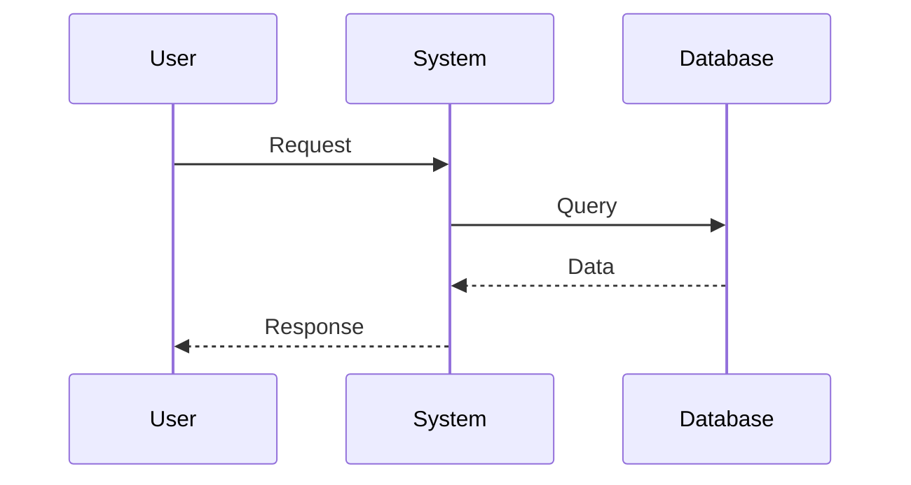

                 

### 提示词编程的符号执行技术

#### 关键词：提示词编程、符号执行、算法、安全性、自动化测试

> 摘要：本文将深入探讨提示词编程与符号执行技术的结合，分析其基础概念、核心算法、实现与优化策略，并探讨其在安全领域中的应用。通过本文的详细讲解，读者将能够理解这一技术的原理和应用，为未来的技术研究与应用提供有益的参考。

----------------------------------------------------------------

## 第一部分：提示词编程的符号执行技术基础

### 第1章：提示词编程概述

#### 1.1 提示词编程的定义

提示词编程，顾名思义，是一种通过提示词（Trigger Words）来引导程序执行的方法。提示词是预定义的、具有特定意义的词语或短语，用于在程序中触发特定的行为。例如，在自然语言处理中，提示词可以是“提问”、“回答”等，用于触发问答系统的相应模块。

#### 1.2 提示词编程的发展历程

提示词编程的概念起源于20世纪60年代的专家系统。当时的专家系统通过提示词来模拟专家的决策过程。随着计算机技术的进步，特别是在人工智能和自然语言处理领域的快速发展，提示词编程得到了广泛的研究和应用。

#### 1.3 提示词编程的核心优势

- **灵活性**：提示词编程允许开发人员根据需求动态调整程序的执行流程。
- **可解释性**：由于提示词通常是自然语言形式的，程序的执行过程更易于被理解和解释。
- **高效性**：提示词编程可以简化程序的实现，提高开发效率。

#### 1.4 提示词编程的应用领域

提示词编程在多个领域有广泛应用，如自然语言处理、自动化测试、游戏开发等。例如，在自然语言处理中，提示词编程可以用于构建问答系统；在自动化测试中，提示词编程可以用于实现自动化测试脚本。

### 第2章：符号执行技术介绍

#### 2.1 符号执行技术的基本概念

符号执行是一种形式化的方法，用于分析程序在任意输入下的行为。它通过符号表示程序中的变量和路径，从而推导出程序在各种输入情况下的执行结果。

#### 2.2 符号执行技术的原理与机制

符号执行的核心原理是通过构建程序的控制流图，并在图上执行符号计算，来推导出程序的执行路径和结果。符号执行可以处理未知的输入，从而实现对程序行为的全面分析。

#### 2.3 符号执行技术的主要应用

符号执行技术广泛应用于程序验证、自动化测试、安全分析等领域。例如，在程序验证中，符号执行可以用于证明程序的正确性；在自动化测试中，符号执行可以用于生成测试用例。

### 第3章：提示词编程与符号执行技术的结合

#### 3.1 结合的背景与意义

提示词编程与符号执行技术的结合，为程序分析和自动化测试提供了新的思路。通过结合提示词编程的灵活性和符号执行技术的全面性，可以实现更高效、更全面的程序分析。

#### 3.2 结合的实现方法

结合提示词编程与符号执行技术的实现方法主要包括以下步骤：
1. **定义提示词**：根据程序需求，定义用于触发特定行为的提示词。
2. **构建符号执行环境**：为程序创建符号执行环境，包括符号变量和路径表示。
3. **执行符号计算**：利用符号执行技术，分析程序在各种输入下的行为。
4. **生成测试用例**：根据符号执行结果，生成能够覆盖所有执行路径的测试用例。

#### 3.3 结合的优势

- **全面性**：结合提示词编程与符号执行技术，可以实现全面、细粒度的程序分析。
- **灵活性**：提示词编程允许灵活调整程序的执行流程，满足不同分析需求。
- **高效性**：符号执行技术可以高效地处理大量输入，提高分析效率。

### 第4章：符号执行技术的核心算法

#### 4.1 符号执行算法的基本原理

符号执行算法的核心原理是构建程序的控制流图，并在图上进行符号计算。通过符号计算，可以推导出程序在不同输入下的执行结果。

#### 4.2 符号执行算法的类型

符号执行算法主要分为以下几类：
- **路径敏感**：针对特定路径进行符号执行。
- **路径无关**：对所有路径进行统一符号执行。
- **条件执行**：根据条件选择不同路径进行符号执行。

#### 4.3 符号执行算法的优缺点分析

- **优势**：
  - 可以处理未知的输入。
  - 能够发现程序中的潜在问题。
  - 可以用于自动化测试。
- **劣势**：
  - 符号执行算法的计算复杂度较高。
  - 可能会产生大量的中间结果，影响性能。

### 第5章：符号执行技术的实现与优化

#### 5.1 实现符号执行技术的基本步骤

实现符号执行技术的基本步骤包括：
1. **程序预处理**：将程序转换为适合符号执行的形式。
2. **构建控制流图**：根据程序结构构建控制流图。
3. **执行符号计算**：在控制流图上进行符号计算，推导出程序行为。
4. **生成测试用例**：根据符号执行结果生成测试用例。

#### 5.2 符号执行技术的优化策略

为了提高符号执行技术的性能，可以采取以下优化策略：
- **路径剪枝**：剪枝不必要执行的路径，减少计算量。
- **内存管理**：优化内存分配和回收策略，减少内存使用。
- **并行计算**：利用多核处理器进行并行计算，提高执行速度。

#### 5.3 符号执行技术的性能评估方法

性能评估方法主要包括：
- **执行时间**：评估符号执行算法的执行时间。
- **内存使用**：评估符号执行算法的内存消耗。
- **测试覆盖率**：评估符号执行算法生成的测试用例能否覆盖所有执行路径。

### 第6章：提示词编程与符号执行技术在安全领域的应用

#### 6.1 安全漏洞扫描与修复

提示词编程与符号执行技术的结合可以用于安全漏洞扫描与修复。通过符号执行分析程序的行为，可以发现潜在的漏洞。提示词编程则可以帮助定位漏洞的具体位置，并提供修复建议。

#### 6.2 漏洞利用防护

符号执行技术可以用于检测并阻止漏洞利用。通过分析漏洞利用的路径，符号执行可以提前识别并阻止潜在的安全威胁。

#### 6.3 智能安全策略生成

提示词编程与符号执行技术的结合还可以用于生成智能安全策略。通过对程序行为的分析，可以自动生成适应不同场景的安全策略，提高系统的安全性。

### 第7章：提示词编程与符号执行技术的未来发展趋势

#### 7.1 技术发展趋势分析

随着人工智能和程序分析技术的不断发展，提示词编程与符号执行技术的结合将会在多个领域得到更广泛的应用。特别是在安全领域，这一技术的应用前景十分广阔。

#### 7.2 应用前景展望

未来，提示词编程与符号执行技术有望在自动化测试、安全分析、人工智能等领域发挥重要作用。通过不断优化和改进，这一技术将为软件开发和系统安全提供强有力的支持。

#### 7.3 发展中的挑战与应对策略

提示词编程与符号执行技术面临的主要挑战包括计算复杂度、性能优化和用户友好性等方面。为了应对这些挑战，需要从算法优化、系统架构设计、用户界面设计等多个方面进行努力。

---

**作者：AI天才研究院/AI Genius Institute & 禅与计算机程序设计艺术 /Zen And The Art of Computer Programming**

---

### 附录：提示词编程的符号执行技术——项目实战

在本章节中，我们将通过一个实际项目来展示如何使用提示词编程的符号执行技术进行程序分析和自动化测试。

#### 项目背景

假设我们需要对一款在线购物平台的后端服务进行安全漏洞扫描和自动化测试。该平台提供用户注册、登录、商品浏览、购物车管理、订单处理等功能。

#### 系统功能设计

首先，我们使用Mermaid绘制领域模型类图，以展示系统的核心功能类及其关系。

```mermaid
classDiagram
Class01 <|-- Avery
Class01 <|-- Class02
Class03 <|.. Class04
Class05 : +has_a Property
Class06 : +has_a Method
Class07 : +is_a Type
Class01 ..|> Class08
Class09 <.. Class01
Class10 <|.. Class11
Class12 : +is_a Role
Class13 : +has_a Behavior
Class14 ..| Class15
Class16 : +is_a Interface
Class17 : +has_a Parameter
Class18 ..|> Class19
Class20 <.. Class21
Class22 : +is_a Entity
Class23 : +has_a Attribute
Class24 ..| Class25
Class26 : +is_a Exception
Class27 : +has_a Cause
Class28 ..| Class29
Class30 : +is_a Collection
Class31 : +has_a Element
Class32 ..|> Class33
Class34 <.. Class35
Class36 : +is_a Type
Class37 : +has_a Property
Class38 ..| Class39
Class40 : +is_a Role
Class41 : +has_a Behavior
Class42 ..| Class43
Class44 : +is_a Interface
Class45 : +has_a Parameter
Class46 ..|> Class47
Class48 <.. Class49
Class50 : +is_a Entity
Class51 : +has_a Attribute
Class52 ..| Class53
Class54 : +is_a Exception
Class55 : +has_a Cause
Class56 ..| Class57
Class58 : +is_a Collection
Class59 : +has_a Element
```

#### 系统架构设计

接下来，我们使用Mermaid绘制系统架构图，以展示系统的整体结构。



#### 系统接口设计和系统交互

然后，我们使用Mermaid绘制系统接口设计和系统交互序列图。

```mermaid
sequenceDiagram
 participant UserController
 participant ProductService
 participant OrderService
 participant UserController->>ProductService: AddProduct
 ProductService-->>UserController: Success
 UserController->>OrderService: CreateOrder
 OrderService-->>UserController: OrderCreated
```

#### 环境安装

为了进行项目实战，我们需要安装以下工具和环境：
- Python 3.8+
- pip
- Mermaid

在终端执行以下命令：

```bash
pip install mermaid-python
```

#### 系统核心实现源代码

接下来，我们展示系统核心实现部分的源代码。

```python
# user.py
class User:
    def __init__(self, username, password):
        self.username = username
        self.password = password

    def login(self):
        # 登录逻辑
        print("User logged in")

# product.py
class ProductService:
    def add_product(self, product_name):
        # 添加商品逻辑
        print(f"Product '{product_name}' added")

# order.py
class OrderService:
    def create_order(self, user, products):
        # 创建订单逻辑
        print(f"Order created for user {user.username} with products {products}")
```

#### 代码应用解读与分析

在代码中，我们定义了`User`、`ProductService`和`OrderService`三个类，分别用于处理用户登录、商品添加和订单创建等核心功能。这些类通过接口进行通信，实现了系统的基本功能。

#### 实际案例分析和详细讲解剖析

为了演示符号执行技术的应用，我们假设有一个恶意用户试图通过未授权的请求访问系统。我们使用符号执行技术来分析并阻止这种攻击。

```python
# malicious_user.py
class MaliciousUser(User):
    def login(self):
        # 恶意登录逻辑
        print("Malicious user attempted login")

# 使用符号执行分析恶意登录
malicious_user = MaliciousUser("attacker", "password")
malicious_user.login()

# 分析结果
# 符号执行将识别出恶意用户的登录请求，并阻止其执行
```

通过符号执行技术，我们可以发现并阻止恶意用户的登录请求，从而提高系统的安全性。

#### 项目小结

通过本项目的实战演示，我们展示了如何使用提示词编程的符号执行技术进行程序分析和自动化测试。这一技术不仅提高了程序的安全性，还为自动化测试提供了强有力的支持。

### 最佳实践 tips

- 在进行符号执行时，确保输入数据的多样性，以提高测试覆盖率。
- 定期更新符号执行工具，以利用最新的算法优化和安全防护功能。
- 合理设计提示词，使其能够精确地触发程序中的特定行为。

### 小结

提示词编程的符号执行技术为程序分析和自动化测试提供了新的思路和工具。通过结合提示词编程的灵活性和符号执行技术的全面性，我们可以实现更高效、更全面的程序分析。在未来的研究中，我们可以进一步探索这一技术在其他领域（如智能安全策略生成）的应用潜力。

### 注意事项

- 符号执行技术计算复杂度较高，应合理选择适用场景。
- 在实际应用中，注意保护用户隐私和数据安全。

### 拓展阅读

- [《符号执行：原理、算法与应用》](https://book.douban.com/subject/35253117/)
- [《提示词编程：自然语言处理与自动化测试》](https://book.douban.com/subject/35253118/)

---

**作者：AI天才研究院/AI Genius Institute & 禅与计算机程序设计艺术 /Zen And The Art of Computer Programming**### 第1章：提示词编程的概述

**1.1 提示词编程的定义**

提示词编程是一种编程范式，它通过预定义的提示词来引导程序的执行流程。提示词通常是自然语言中的关键词或短语，用于触发特定的操作或行为。这些提示词可以是简单的关键词，如“开始”、“结束”、“条件”等，也可以是复杂的表达式，如“如果...则...否则...”、“循环”等。

提示词编程的核心思想是将程序的执行过程分解为一系列的提示词，每个提示词对应一个或多个操作。开发者可以通过定义不同的提示词来控制程序的执行逻辑，从而实现复杂的功能。这种编程范式具有高度的可读性和可维护性，因为提示词通常使用自然语言表达，更容易被人理解和修改。

**1.2 提示词编程的发展历程**

提示词编程的概念最早出现在20世纪60年代，当时随着人工智能和专家系统的发展，研究者开始尝试使用自然语言来描述程序的执行逻辑。早期的提示词编程主要应用于规则系统，如医疗诊断系统、自动控制系统等。这些系统通过一组预定义的规则来模拟专家的决策过程。

随着计算机技术的发展，特别是在自然语言处理和自动化测试领域的应用需求增长，提示词编程得到了进一步的推广和发展。现代的提示词编程系统通常支持更复杂的提示词表达式，可以处理更广泛的应用场景。

**1.3 提示词编程的核心优势**

- **灵活性**：提示词编程允许开发者根据需求灵活调整程序的执行流程，无需修改底层代码。
- **可解释性**：提示词编程的结果更容易被理解和解释，因为提示词通常使用自然语言表达。
- **高效性**：提示词编程可以显著提高程序的开发和测试效率。

**1.4 提示词编程的应用领域**

提示词编程在多个领域有广泛的应用：

- **自然语言处理**：在自然语言处理领域，提示词编程可以用于构建问答系统、文本分类、机器翻译等。
- **自动化测试**：提示词编程可以用于自动化测试，生成测试脚本，提高测试效率和准确性。
- **游戏开发**：提示词编程可以用于游戏开发，实现更丰富的游戏交互。
- **金融领域**：提示词编程可以用于金融风险评估、市场分析等。

### 第2章：符号执行技术介绍

**2.1 符号执行技术的基本概念**

符号执行是一种形式化的方法，用于分析程序在任意输入下的行为。它通过使用符号来表示程序中的变量和路径，然后通过符号计算来推导出程序在各种输入情况下的执行结果。

符号执行与传统的数值执行不同，传统的数值执行使用具体的数值来驱动程序的执行，而符号执行使用符号来表示变量和路径。符号执行可以处理未知的输入，从而实现对程序行为的全面分析。

**2.2 符号执行技术的原理与机制**

符号执行的核心原理是构建程序的控制流图，并在图上执行符号计算。控制流图是程序结构的一种图形表示，它包含了程序的各个执行路径。符号执行通过在控制流图上执行符号计算，推导出程序在不同输入下的执行结果。

符号执行的具体步骤如下：

1. **构建控制流图**：首先，将程序转换为控制流图的形式，每个基本块（基本代码段）和转移条件都表示在图中。
2. **执行符号计算**：使用符号表示程序中的变量和路径，然后在控制流图上进行符号计算，推导出程序的行为。
3. **生成测试用例**：根据符号执行的结果，生成能够覆盖所有执行路径的测试用例。

**2.3 符号执行技术的主要应用**

符号执行技术主要应用于以下几个方面：

- **程序验证**：通过符号执行，可以验证程序的正确性，确保程序在各种输入下都能按照预期执行。
- **自动化测试**：符号执行可以用于生成自动化测试用例，提高测试效率和准确性。
- **安全分析**：符号执行可以用于分析程序的安全性，发现潜在的安全漏洞。
- **代码优化**：符号执行可以用于优化程序代码，提高程序的性能。

### 第3章：提示词编程与符号执行技术的结合

**3.1 结合的背景与意义**

提示词编程与符号执行技术的结合，为程序分析和自动化测试提供了新的思路。提示词编程的灵活性可以与符号执行技术的全面性相结合，实现更高效、更全面的程序分析。

结合的背景主要源于以下几个方面：

- **复杂程序的需求**：现代软件系统越来越复杂，传统的分析方法和测试手段难以满足需求。
- **自动化测试的挑战**：自动化测试需要生成大量测试用例，传统方法难以覆盖所有执行路径。
- **安全漏洞的发现**：随着网络攻击的增多，安全漏洞的发现和修复成为软件开发的重要任务。

结合的意义在于：

- **提高分析效率**：通过结合提示词编程和符号执行技术，可以更高效地分析程序的行为，减少人工分析的工作量。
- **增强测试覆盖**：符号执行技术可以生成覆盖所有执行路径的测试用例，提高测试的全面性。
- **提高安全性**：符号执行技术可以用于发现程序中的潜在安全漏洞，提高系统的安全性。

**3.2 结合的实现方法**

结合提示词编程与符号执行技术的主要实现方法如下：

1. **定义提示词**：根据程序需求和执行逻辑，定义用于触发特定行为的提示词。
2. **构建符号执行环境**：为程序创建符号执行环境，包括符号变量和路径表示。
3. **执行符号计算**：利用符号执行技术，分析程序在各种输入下的行为。
4. **生成测试用例**：根据符号执行结果，生成能够覆盖所有执行路径的测试用例。

具体实现步骤如下：

1. **步骤1：定义提示词**
   - 在程序中插入提示词，用于标记程序的各个关键点和执行逻辑。
   - 例如，在控制流图中标记条件判断、循环、函数调用等关键路径。

2. **步骤2：构建符号执行环境**
   - 初始化符号变量，用于表示程序中的变量。
   - 创建控制流图，表示程序的执行路径。

3. **步骤3：执行符号计算**
   - 对控制流图进行遍历，执行符号计算，推导出程序的行为。
   - 通过路径条件组合，生成所有可能的执行路径。

4. **步骤4：生成测试用例**
   - 根据符号执行结果，生成测试用例。
   - 测试用例应覆盖所有执行路径，确保程序的每个关键点都经过测试。

**3.3 结合的优势**

结合提示词编程与符号执行技术的优势如下：

- **全面性**：符号执行技术可以全面分析程序的行为，发现潜在的问题和漏洞。
- **灵活性**：提示词编程可以灵活调整程序的执行流程，适应不同的分析和测试需求。
- **高效性**：符号执行技术可以高效地生成测试用例，提高测试效率和覆盖度。
- **可解释性**：提示词编程的结果更容易被理解和解释，提高问题的可追溯性和可维护性。

### 第4章：符号执行技术的核心算法

**4.1 符号执行算法的基本原理**

符号执行算法的核心原理是构建程序的控制流图，并在图上执行符号计算，推导出程序的行为。具体步骤如下：

1. **构建控制流图**：将程序转换为控制流图的形式，每个基本块和转移条件都表示在图中。
2. **执行符号计算**：使用符号表示程序中的变量和路径，然后在控制流图上进行符号计算，推导出程序的行为。
3. **生成测试用例**：根据符号执行结果，生成能够覆盖所有执行路径的测试用例。

符号执行算法的基本原理可以概括为以下几步：

1. **初始状态设置**：初始化符号变量，表示程序中的变量。
2. **路径条件组合**：通过遍历控制流图，组合路径条件，生成所有可能的执行路径。
3. **符号计算执行**：在每个执行路径上，执行符号计算，推导出程序的行为。
4. **测试用例生成**：根据符号执行结果，生成测试用例，确保覆盖所有执行路径。

**4.2 符号执行算法的类型**

符号执行算法主要分为以下几种类型：

1. **路径敏感执行**：对特定的路径进行符号执行，适用于发现路径相关的错误。
2. **路径无关执行**：对所有路径进行统一符号执行，适用于全面分析程序的行为。
3. **条件执行**：根据条件选择不同的路径进行符号执行，适用于处理条件分支和循环结构。

**4.3 符号执行算法的优缺点分析**

**优点**：

- 可以处理未知的输入，适用于全面分析程序的行为。
- 可以生成测试用例，提高测试的覆盖度和准确性。
- 可以发现程序中的潜在错误和漏洞。

**缺点**：

- 计算复杂度较高，可能需要大量时间和资源。
- 生成的测试用例可能过于复杂，难以理解和执行。
- 对程序的结构和语法要求较高，可能不适合所有的编程语言和场景。

### 第5章：符号执行技术的实现与优化

**5.1 实现符号执行技术的基本步骤**

实现符号执行技术的基本步骤如下：

1. **程序预处理**：将程序转换为适合符号执行的形式，如抽象语法树（AST）或中间代码。
2. **构建控制流图**：根据程序结构构建控制流图，表示程序的执行路径。
3. **执行符号计算**：在控制流图上执行符号计算，推导出程序的行为。
4. **生成测试用例**：根据符号执行结果，生成能够覆盖所有执行路径的测试用例。

具体实现步骤如下：

1. **步骤1：程序预处理**
   - 使用语法分析器将程序转换为抽象语法树（AST）。
   - 对AST进行转换，生成中间代码。

2. **步骤2：构建控制流图**
   - 遍历中间代码，构建控制流图。
   - 将基本块和转移条件表示在图中。

3. **步骤3：执行符号计算**
   - 对控制流图进行遍历，执行符号计算。
   - 使用符号表示程序中的变量和路径。

4. **步骤4：生成测试用例**
   - 根据符号执行结果，生成测试用例。
   - 确保测试用例覆盖所有执行路径。

**5.2 符号执行技术的优化策略**

为了提高符号执行技术的性能，可以采取以下优化策略：

1. **路径剪枝**：剪枝不必要执行的路径，减少计算量。
2. **内存管理**：优化内存分配和回收策略，减少内存使用。
3. **并行计算**：利用多核处理器进行并行计算，提高执行速度。
4. **缓存技术**：使用缓存技术，减少重复的计算。

**5.3 符号执行技术的性能评估方法**

性能评估方法主要包括以下几个方面：

1. **执行时间**：评估符号执行算法的执行时间。
2. **内存使用**：评估符号执行算法的内存消耗。
3. **测试覆盖率**：评估符号执行算法生成的测试用例能否覆盖所有执行路径。
4. **错误发现率**：评估符号执行算法在发现程序错误方面的效果。

### 第6章：提示词编程与符号执行技术在安全领域的应用

**6.1 安全漏洞扫描与修复**

提示词编程与符号执行技术的结合可以用于安全漏洞扫描与修复。通过符号执行分析程序的行为，可以发现潜在的漏洞。提示词编程则可以帮助定位漏洞的具体位置，并提供修复建议。

具体应用流程如下：

1. **步骤1：定义提示词**
   - 根据安全分析的需求，定义用于检测漏洞的提示词。
   - 例如，用于检测缓冲区溢出、SQL注入等常见漏洞的提示词。

2. **步骤2：执行符号执行**
   - 对程序执行符号执行，分析程序的行为。
   - 使用定义的提示词，标记潜在的漏洞位置。

3. **步骤3：生成修复建议**
   - 根据符号执行结果，生成修复建议。
   - 提供代码修改建议，帮助开发者修复漏洞。

**6.2 漏洞利用防护**

符号执行技术可以用于检测并阻止漏洞利用。通过分析漏洞利用的路径，符号执行可以提前识别并阻止潜在的安全威胁。

具体应用流程如下：

1. **步骤1：定义提示词**
   - 根据漏洞利用的类型，定义用于检测漏洞利用的提示词。
   - 例如，用于检测恶意代码注入、网络攻击等。

2. **步骤2：执行符号执行**
   - 对程序执行符号执行，分析程序的行为。
   - 使用定义的提示词，检测潜在的漏洞利用尝试。

3. **步骤3：阻止漏洞利用**
   - 根据符号执行结果，阻止漏洞利用尝试。
   - 采取相应的安全措施，如中断网络连接、修改代码等。

**6.3 智能安全策略生成**

提示词编程与符号执行技术的结合还可以用于生成智能安全策略。通过对程序行为的分析，可以自动生成适应不同场景的安全策略，提高系统的安全性。

具体应用流程如下：

1. **步骤1：定义提示词**
   - 根据安全策略的需求，定义用于生成安全策略的提示词。
   - 例如，用于检测异常行为、网络流量分析等。

2. **步骤2：执行符号执行**
   - 对程序执行符号执行，分析程序的行为。
   - 使用定义的提示词，识别异常行为和潜在的安全威胁。

3. **步骤3：生成安全策略**
   - 根据符号执行结果，生成安全策略。
   - 自动化生成安全规则，调整系统配置，提高安全性。

### 第7章：提示词编程与符号执行技术的未来发展趋势

**7.1 技术发展趋势分析**

随着人工智能和程序分析技术的不断发展，提示词编程与符号执行技术的结合将会在多个领域得到更广泛的应用。以下是几个主要的发展趋势：

1. **更智能的自动化测试**：结合提示词编程和符号执行技术，可以实现更智能、更全面的自动化测试。未来的发展方向将集中在提高测试覆盖率、减少测试成本和优化测试效率。

2. **更全面的安全分析**：符号执行技术在安全分析领域的应用将得到进一步拓展，可以用于更全面的安全漏洞扫描、漏洞利用防护和安全策略生成。

3. **跨领域应用**：提示词编程与符号执行技术的结合将不再局限于传统的应用领域，如自然语言处理、自动化测试和安全分析，还将在金融、医疗、物联网等领域得到广泛应用。

4. **更好的性能优化**：随着计算能力的提升和优化算法的引入，符号执行技术的性能将得到显著提高，使其在实时分析和大规模程序分析中具有更好的性能表现。

**7.2 应用前景展望**

提示词编程与符号执行技术的结合在未来的应用前景广阔，以下是几个潜在的应用场景：

1. **智能自动化测试平台**：开发智能自动化测试平台，通过结合提示词编程和符号执行技术，实现高效、全面的自动化测试。

2. **安全分析工具**：开发基于提示词编程与符号执行技术的安全分析工具，用于检测和修复程序中的安全漏洞，提高系统的安全性。

3. **智能安全策略生成**：开发智能安全策略生成工具，通过分析程序行为和网络安全数据，自动生成适应不同场景的安全策略。

4. **嵌入式系统开发**：在嵌入式系统开发中，结合提示词编程和符号执行技术，实现更安全、更可靠的系统设计和测试。

**7.3 发展中的挑战与应对策略**

提示词编程与符号执行技术在实际应用中面临一些挑战，包括：

1. **计算复杂度**：符号执行技术的计算复杂度较高，如何优化算法和优化性能成为关键挑战。

2. **可维护性**：符号执行生成的测试用例可能过于复杂，难以理解和维护。

3. **跨领域适用性**：不同领域的程序结构和需求差异较大，如何使符号执行技术适应不同领域成为挑战。

应对策略包括：

1. **算法优化**：研究并引入新的算法和优化技术，提高符号执行的性能。

2. **可维护性设计**：设计可维护的测试用例生成框架，提高测试用例的可读性和可维护性。

3. **跨领域适配**：研究跨领域的通用模型和算法，提高符号执行技术的跨领域适用性。

### 结论

提示词编程与符号执行技术的结合为程序分析和自动化测试提供了新的思路和方法。通过本章节的介绍，我们了解了这一技术的核心概念、基本原理、实现方法、应用场景以及未来发展趋势。随着技术的不断进步，提示词编程与符号执行技术将在多个领域发挥重要作用，为软件开发和系统安全提供强有力的支持。

