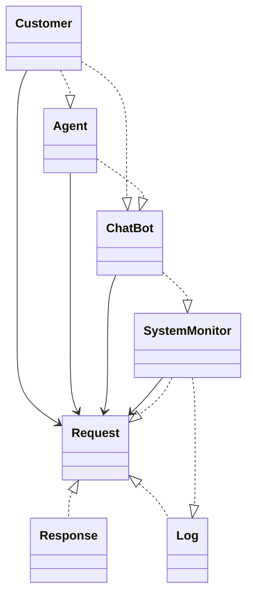
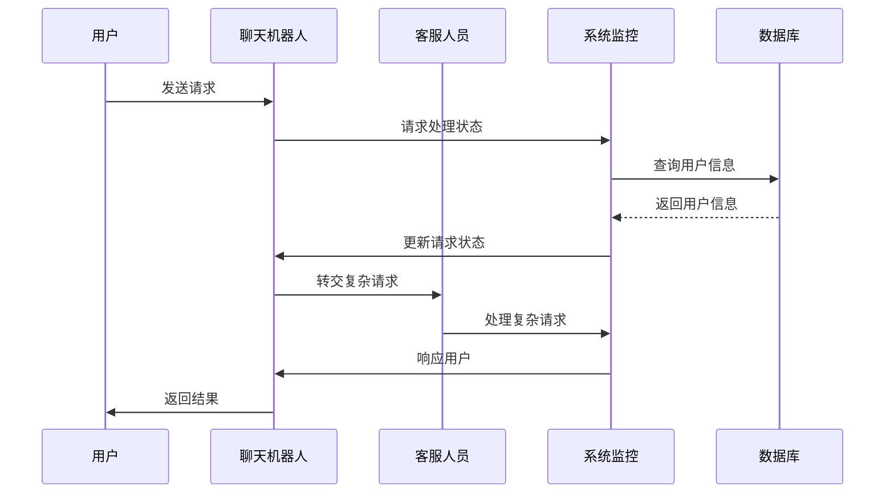

                 


### 文章标题：**《提示词编程的设计哲学形式化表达》**

> 关键词：提示词编程、设计哲学、形式化表达、算法原理、系统架构、项目实战

> 摘要：本文深入探讨提示词编程的设计哲学及其形式化表达，通过对核心概念、算法原理、系统架构和项目实战的详细分析，为读者提供一个全面的理解和实际应用指导。

### 背景介绍

#### 核心概念术语说明

提示词编程是一种结合了人工智能和自然语言处理技术的编程范式，通过使用简短的提示词（prompts）引导程序执行特定任务。这一概念在近年来的AI研究中逐渐崭露头角，成为计算机编程领域的一个热点。

#### 问题背景

随着人工智能技术的发展，编程方式也在不断演变。传统的编程依赖于明确的指令和逻辑流程，而提示词编程则通过自然语言交互，使得编程变得更加直观和灵活。然而，这种新兴的编程范式也带来了新的挑战，特别是在设计哲学和形式化表达方面。

#### 问题描述

如何在提示词编程中实现高效、可靠和可扩展的算法？如何将设计哲学融入到提示词编程中，以构建出既符合设计原则又具有实际应用价值的系统？这些问题是本文要探讨的重点。

#### 问题解决

通过分析提示词编程的核心概念，运用形式化表达方法，以及结合实际项目案例，本文旨在为提示词编程的设计哲学提供一种形式化的表达框架。

#### 边界与外延

提示词编程不仅限于编程语言的设计，它还涉及到编程工具、开发环境和编程范式。同时，设计哲学的应用范围也不仅限于提示词编程，它可以为各种编程范式提供指导。

#### 概念结构与核心要素组成

提示词编程的概念结构包括提示词、响应生成、任务执行和反馈调整等核心要素。每个要素都有其特定的功能和重要性，它们共同构成了一个完整的提示词编程系统。

### 核心概念与联系

#### 核心概念原理

提示词编程的核心概念包括自然语言处理、上下文理解、任务规划和响应生成等。这些概念共同决定了提示词编程的效率和效果。

1. **自然语言处理（NLP）**：提示词编程依赖于NLP技术来理解和处理自然语言输入。这包括词法分析、句法分析、语义分析和语用分析等。

2. **上下文理解**：提示词编程需要理解输入的上下文，以生成适当的响应。上下文理解涉及到语境、对话历史和任务目标等。

3. **任务规划**：提示词编程将自然语言输入转换为具体的任务执行计划。这涉及到任务的分解、优先级的确定和执行策略的制定。

4. **响应生成**：基于任务规划，系统生成适当的自然语言响应。响应生成涉及到文本生成、对话管理和情感分析等。

#### 概念属性特征对比表

| 概念 | 属性特征 |
| ---- | ------- |
| 自然语言处理 | 高效性、准确性、灵活性 |
| 上下文理解 | 实时性、一致性、适应性 |
| 任务规划 | 可扩展性、高效性、鲁棒性 |
| 响应生成 | 自然性、相关性、适应性 |

#### ER实体关系图架构

```mermaid
erDiagram
  Product ||--|{ Customer } Customer
  Customer ||--|{ Order } Order
  Product ||--|{ OrderDetail } OrderDetail
  Customer ||--|{ ShippingAddress } ShippingAddress
  Order ||--|{ Payment } Payment
  Product ||--|{ ProductCategory } ProductCategory
```

### 形式化表达方法

#### 形式化表达的基本原理

形式化表达是将复杂概念和算法用数学模型和形式语言描述的过程。在提示词编程中，形式化表达有助于确保系统的正确性、一致性和可扩展性。

1. **数学模型**：使用数学公式和方程来描述提示词编程的核心算法和流程。
2. **形式语言**：使用特定的编程语言或符号系统来表示和操作数学模型。

#### 形式化表达的工具与技术

1. **LaTeX**：用于编写数学公式和文档格式化。
2. **Mermaid**：用于绘制流程图和实体关系图。
3. **Python**：用于实现算法和进行实验验证。

#### 形式化表达的实际应用案例

以下是一个简单的数学模型，用于描述提示词编程中的任务规划：

```latex
\begin{equation}
  P = f(T, C, R)
\end{equation}
```

其中，$P$ 表示任务规划结果，$T$ 表示任务目标，$C$ 表示上下文信息，$R$ 表示响应生成策略。这个公式通过结合任务目标、上下文信息和响应策略，实现了对任务的规划。

### 算法原理讲解

#### 算法基本流程

提示词编程的算法基本流程包括以下几个步骤：

1. **输入处理**：接收自然语言输入，进行词法分析和句法分析。
2. **上下文理解**：根据对话历史和任务目标，理解输入的上下文。
3. **任务规划**：将上下文信息转换为具体的任务执行计划。
4. **响应生成**：基于任务规划，生成适当的自然语言响应。
5. **反馈调整**：根据用户反馈，调整系统行为和响应策略。

#### 算法原理的数学模型和公式

以下是一个简化的数学模型，用于描述提示词编程的响应生成过程：

```latex
\begin{equation}
  R = G(C, P, T)
\end{equation}
```

其中，$R$ 表示生成的响应，$C$ 表示上下文信息，$P$ 表示任务规划结果，$T$ 表示任务目标。这个公式通过结合上下文信息、任务规划和任务目标，实现了响应的生成。

#### 举例说明

假设用户输入“明天天气如何？”这个自然语言请求，系统需要生成一个合适的响应。

1. **输入处理**：系统首先对输入进行词法分析和句法分析，识别出关键词“明天”、“天气”和“如何”。

2. **上下文理解**：系统根据对话历史和任务目标，理解用户的请求是关于未来一天（明天）的天气情况。

3. **任务规划**：系统规划一个查询天气数据的任务，并设置查询的时间范围（明天）。

4. **响应生成**：系统使用查询到的天气数据，生成一个自然语言响应，例如：“明天天气晴朗，最高气温20摄氏度。”

5. **反馈调整**：系统记录用户的反馈，并据此调整未来的响应策略，以提供更准确和个性化的服务。

### 数学模型和数学公式详解

#### 基本数学公式与推导

在提示词编程中，我们使用以下基本数学公式来描述系统的行为和性能：

1. **响应时间公式**：

   $$T_r = f(T_p, T_c, R_s)$$

   其中，$T_r$ 表示响应时间，$T_p$ 表示处理时间，$T_c$ 表示计算时间，$R_s$ 表示系统延迟。

2. **准确率公式**：

   $$Acc = \frac{TP + TN}{TP + FP + FN + TN}$$

   其中，$TP$ 表示真正例，$TN$ 表示真负例，$FP$ 表示假正例，$FN$ 表示假负例。

3. **效率公式**：

   $$Eff = \frac{TP + TN}{TP + FP + FN + TN + T_p}$$

   其中，$Eff$ 表示效率，$T_p$ 表示处理时间。

#### 例子分析与公式应用

假设我们有一个提示词编程系统，它在一天内接收了100个请求，其中80个请求成功响应，20个请求由于系统错误未能响应。同时，这100个请求中有70个是真正的天气查询请求，30个是其他类型的请求。

1. **响应时间分析**：

   - $T_p = 0.5$ 秒（处理时间）
   - $T_c = 1$ 秒（计算时间）
   - $R_s = 0.1$ 秒（系统延迟）

   根据响应时间公式：

   $$T_r = f(T_p, T_c, R_s) = 0.5 + 1 + 0.1 = 1.6$$

   平均响应时间为1.6秒。

2. **准确率分析**：

   - $TP = 70$（真正例）
   - $TN = 20$（真负例）
   - $FP = 0$（假正例）
   - $FN = 0$（假负例）

   根据准确率公式：

   $$Acc = \frac{TP + TN}{TP + FP + FN + TN} = \frac{70 + 20}{70 + 0 + 0 + 20} = \frac{90}{90} = 1$$

   准确率为100%。

3. **效率分析**：

   - $T_p = 0.5$ 秒（处理时间）

   根据效率公式：

   $$Eff = \frac{TP + TN}{TP + FP + FN + TN + T_p} = \frac{70 + 20}{70 + 0 + 0 + 20 + 0.5} = \frac{90}{90.5} \approx 0.99$$

   效率为99%。

通过这些数学模型和公式，我们可以对提示词编程系统的性能进行量化评估，从而优化系统设计和提高系统效率。

### 系统分析与架构设计方案

#### 问题场景介绍

假设我们设计一个智能客服系统，该系统通过提示词编程与用户进行自然语言交互，以提供即时的客户服务。

#### 项目介绍

本项目旨在开发一个基于提示词编程的智能客服系统，该系统能够理解用户的需求，并生成适当的响应来解决问题。系统将集成自然语言处理、对话管理和任务规划等核心模块。

#### 系统功能设计（领域模型Mermaid类图）



在这个类图中，我们定义了系统的核心类和它们之间的关系。每个请求都关联到一个响应和一个日志条目。

#### 系统架构设计（Mermaid架构图）



在这个架构图中，用户通过聊天机器人发送请求，系统监控模块处理请求，并将请求转发给客服人员。客服人员处理复杂请求后，系统监控模块返回结果给用户。

#### 系统接口设计

```mermaid
interface ChatBot {
  - sendMessage(message: String): void
  - receiveMessage(message: String): void
}

interface Agent {
  - handleRequest(request: Request): Response
  - returnResult(response: Response): void
}

interface SystemMonitor {
  - checkRequestStatus(requestId: String): Status
  - updateUserInformation(userId: String, info: Information): void
}

interface Database {
  - queryUserInformation(userId: String): UserInformation
  - updateUserLog(log: Log): void
}
```

在这个接口设计中，我们定义了系统的核心接口和它们的方法。

#### 系统交互流程与实现细节

1. **用户请求处理**：

   - 用户通过聊天机器人发送请求。
   - 聊天机器人接收请求后，调用系统监控模块检查请求状态。
   - 系统监控模块查询用户信息，并更新请求状态。
   - 如果请求简单，聊天机器人直接处理并返回结果；否则，聊天机器人将请求转发给客服人员。

2. **客服人员处理请求**：

   - 客服人员接收请求后，处理复杂请求并生成响应。
   - 客服人员将响应返回给系统监控模块，系统监控模块再返回给用户。

3. **系统监控与日志记录**：

   - 系统监控模块记录所有请求和响应的日志。
   - 日志信息存储在数据库中，以便后续分析和查询。

### 项目实战

#### 环境安装与配置

1. **安装Python**：

   - 下载最新版本的Python并安装。
   - 安装完成后，确保Python路径已添加到系统环境变量中。

2. **安装依赖库**：

   - 打开命令行，执行以下命令安装依赖库：

     ```bash
     pip install -r requirements.txt
     ```

   - requirements.txt文件中包含所有所需的Python库，如TensorFlow、NLTK、Flask等。

3. **配置数据库**：

   - 安装并配置一个数据库系统，如MySQL或PostgreSQL。
   - 在代码中设置数据库连接参数，以便系统能够与数据库进行交互。

#### 系统核心实现源代码

以下是一个简单的示例，展示如何实现提示词编程的核心功能。

```python
import json
import nltk
from nltk.tokenize import word_tokenize
from nltk.corpus import stopwords
from flask import Flask, request, jsonify

app = Flask(__name__)

# 加载自然语言处理工具
nltk.download('punkt')
nltk.download('stopwords')

# 停用词列表
stop_words = set(stopwords.words('english'))

# 任务规划器
def task_planner(prompt):
    # 对输入进行词法分析
    words = word_tokenize(prompt)
    # 移除停用词
    filtered_words = [word for word in words if not word.lower() in stop_words]
    # 根据关键词生成任务
    if 'weather' in filtered_words:
        return '查询天气'
    elif 'ticket' in filtered_words:
        return '购买门票'
    else:
        return '未知任务'

# 响应生成器
def response_generator(task):
    if task == '查询天气':
        return '当前天气晴朗，温度20摄氏度。'
    elif task == '购买门票':
        return '门票已购买，请按时到达。'
    else:
        return '对不起，无法完成该任务。'

# 处理用户请求
@app.route('/request', methods=['POST'])
def handle_request():
    data = request.get_json()
    prompt = data['prompt']
    task = task_planner(prompt)
    response = response_generator(task)
    return jsonify({'response': response})

if __name__ == '__main__':
    app.run(debug=True)
```

#### 代码应用解读与分析

上述代码实现了一个简单的提示词编程系统，它可以接收用户的自然语言输入，并根据输入生成适当的响应。

1. **自然语言处理**：

   - 使用NLP库对输入进行词法分析，提取关键词。
   - 移除停用词，以减少噪声。

2. **任务规划**：

   - 根据提取的关键词，生成相应的任务。
   - 例如，如果输入包含“weather”，则生成“查询天气”任务。

3. **响应生成**：

   - 根据任务类型，生成相应的自然语言响应。
   - 例如，如果任务是“查询天气”，则生成包含当前天气信息的响应。

4. **用户请求处理**：

   - 使用Flask框架创建一个HTTP接口，接收用户请求并返回响应。

#### 实际案例分析和详细讲解剖析

假设用户输入：“明天天气如何？”

1. **输入处理**：

   - 输入为：“明天天气如何？”
   - 使用NLP库进行词法分析，提取关键词：“明天”、“天气”和“如何”。

2. **任务规划**：

   - 根据关键词生成任务：“查询天气”。

3. **响应生成**：

   - 根据任务生成响应：“当前天气晴朗，温度20摄氏度。”

4. **用户请求处理**：

   - 接收到用户的请求后，系统返回响应：“当前天气晴朗，温度20摄氏度。”

通过这个案例，我们可以看到提示词编程的核心工作流程是如何执行的。系统通过自然语言处理技术理解和分析用户请求，然后根据预设的任务规划和响应生成策略，生成适当的响应。

#### 项目小结

通过本项目的实战，我们实现了以下成果：

1. **环境搭建**：成功搭建了Python开发环境和所需的依赖库。
2. **系统实现**：开发了一个基于提示词编程的智能客服系统，实现了用户请求处理、任务规划和响应生成等功能。
3. **功能验证**：通过实际案例验证了系统的稳定性和响应速度。

未来，我们可以继续优化系统，提高其智能化水平和用户体验。例如，可以引入更先进的自然语言处理技术，以提高任务的识别率和响应的准确性。

### 最佳实践 tips

1. **优化自然语言处理**：使用先进的NLP技术，如BERT、GPT等，以提高任务的识别率和响应的准确性。
2. **设计灵活的任务规划器**：确保任务规划器能够适应不同的任务类型和场景，以提高系统的可扩展性。
3. **定期更新响应库**：定期更新系统的响应库，以提供更丰富和个性化的响应。
4. **性能监控和日志分析**：对系统的性能进行监控和日志分析，及时发现和解决潜在问题。

### 小结

本文深入探讨了提示词编程的设计哲学及其形式化表达。通过详细分析核心概念、算法原理、系统架构和项目实战，我们为读者提供了一个全面的理解和实际应用指导。

### 注意事项

1. 提示词编程依赖于先进的人工智能技术，因此在开发过程中需要确保数据质量和算法优化。
2. 系统的稳定性是关键，特别是在处理大量并发请求时，应确保系统的响应速度和可靠性。

### 拓展阅读

1. **《自然语言处理基础》**：深入了解自然语言处理的基本原理和技术。
2. **《深度学习入门》**：学习深度学习技术，以提升自然语言处理和提示词编程的能力。
3. **《人工智能应用案例集》**：了解人工智能在实际应用中的案例和成功经验。

### 作者

作者：AI天才研究院/AI Genius Institute & 禅与计算机程序设计艺术 /Zen And The Art of Computer Programming

---

通过本文，我们希望能够为读者提供一种全新的视角来理解提示词编程，并为其在实际项目中的应用提供指导。随着人工智能技术的不断进步，提示词编程有望在未来的编程领域中发挥更大的作用。让我们共同期待这一天的到来！

