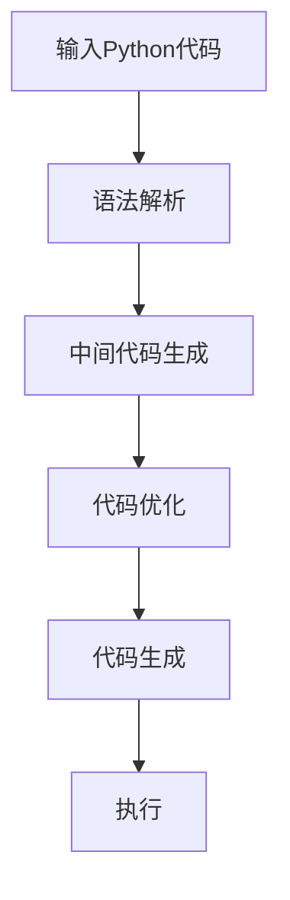

                 

### 引言和背景

#### 引言

**《即时编译技术：提示词编程语言》**

即时编译（Just-In-Time Compilation，简称JIT）是现代编程语言和编译器技术中的一个重要组成部分。在本文中，我们将探讨即时编译技术在提示词编程语言中的运用，以期为读者提供深入的技术见解和实用性指导。

#### 关键词

- **即时编译技术**
- **提示词编程语言**
- **JIT编译原理**
- **编译器设计**
- **性能优化**
- **编程语言特性**

#### 摘要

本文首先介绍了即时编译技术的基本概念、背景和动机。接着，我们将详细探讨即时编译在提示词编程语言中的核心概念和原理，分析其在这些语言中的独特挑战和优化策略。随后，我们将深入研究即时编译器的架构和实现，提供详细的优化案例和性能分析。最后，通过一个实战项目，我们将展示即时编译技术在实际开发中的应用，并总结最佳实践，展望未来的发展趋势。

### 第1章 引入即时编译

#### 1.1 背景和动机

即时编译（JIT）技术的出现，是为了解决传统编译过程中存在的诸多问题。首先，我们需要了解编程语言和编译器技术的发展历程。

##### 1.1.1 编程语言的发展

自计算机诞生以来，编程语言经历了从低级到高级、从结构化到功能式、从静态类型到动态类型等多种演变。早期的编程语言如汇编语言，要求程序员直接操作机器硬件，这使得编程过程复杂且易于出错。随着时间的发展，高级编程语言如C、C++和Java逐渐成为主流，它们提供了更抽象的语法和强大的功能，使程序员能够更高效地开发软件。

##### 1.1.2 传统编译器的挑战

尽管高级编程语言提高了编程效率，但传统的编译过程仍然存在一些问题。首先，编译器在编译程序时需要将源代码转换成机器码，这个过程往往非常耗时，尤其是在大型程序中。其次，编译后的程序需要占用额外的内存空间，并且编译错误可能导致程序崩溃。最后，编译器在编译过程中对代码的优化程度有限，难以充分利用目标硬件的性能。

##### 1.1.3 JIT编译的角色

即时编译技术旨在解决上述问题。JIT编译器在运行程序时，将源代码即时编译成机器码，并直接执行。这种编译过程发生在程序运行时，避免了提前编译带来的时间开销和内存占用。同时，JIT编译器能够根据程序的运行情况动态优化代码，从而提高程序的执行效率和性能。

### 第2章 核心概念和原理

#### 2.1 JIT编译的基本概念

即时编译（JIT）是一种将高级编程语言的源代码在运行时转换成机器码的技术。JIT编译器通常包含以下几个关键组件：

1. **解析器（Parser）**：负责将源代码解析成抽象语法树（AST）。
2. **中间代码生成器（Middle Code Generator）**：将AST转换成中间代码，这种中间代码通常是一种低级、结构化的表示形式。
3. **优化器（Optimizer）**：对中间代码进行各种优化，如死代码消除、循环展开、常数传播等，以提高代码的执行效率。
4. **代码生成器（Code Generator）**：将优化后的中间代码转换成机器码。

##### 2.1.2 JIT编译的过程

JIT编译的过程可以分为以下几个步骤：

1. **代码加载**：JIT编译器加载源代码，并对其进行解析，生成AST。
2. **中间代码生成**：将AST转换成中间代码。
3. **代码优化**：对中间代码进行各种优化。
4. **代码生成**：将优化后的中间代码转换成机器码，并将其存储到内存中。
5. **执行**：直接执行生成的机器码。

##### 2.1.3 JIT编译的优势和劣势

即时编译技术具有以下优势：

1. **运行时优化**：JIT编译器能够根据程序的运行情况动态优化代码，从而提高程序的执行效率。
2. **减少内存占用**：由于代码是在运行时生成，JIT编译器可以避免提前编译带来的内存占用。
3. **提高程序性能**：通过动态优化，JIT编译器能够充分利用目标硬件的性能。

然而，即时编译技术也存在一些劣势：

1. **启动时间**：由于代码是在运行时生成，JIT编译器可能需要一定的时间来完成编译过程，这可能导致程序的启动时间较长。
2. **内存消耗**：JIT编译器在运行时需要一定的内存空间来存储生成的机器码。

### 第3章 JIT编译技术

#### 3.1 JIT编译技术概述

即时编译技术涉及多种编译技术和优化策略，以下将介绍其中几种关键技术：

##### 3.1.1 代码内联（Inlining）

代码内联是一种常见的优化技术，它将函数调用直接替换为函数体，从而减少函数调用的开销。内联可以显著提高程序的执行效率，但也会增加代码的大小。

##### 3.1.2 死代码消除（Dead Code Elimination）

死代码消除是一种优化技术，它删除程序中不会执行的代码，从而减少代码的执行时间和内存消耗。

##### 3.1.3 常数传播（Constant Propagation）

常数传播是一种优化技术，它将常量表达式计算的结果直接替换为计算结果，从而减少代码的执行次数。

### 第4章 提示词编程语言

#### 4.1 提示词编程语言简介

提示词编程语言（Prompt-Based Programming Languages）是一种基于提示（prompts）的编程语言，它允许程序员通过定义提示来控制程序的行为。提示词编程语言具有以下几个特点：

1. **提示驱动**：程序的行为由一系列提示控制，提示定义了程序在不同情况下的响应。
2. **高抽象层次**：提示词编程语言通常提供高级的语法和语义，使程序员能够以更抽象的方式编写程序。
3. **动态性**：提示词编程语言通常支持运行时动态修改程序行为，这使得它们在自适应和可扩展性方面具有优势。

#### 4.2 历史和演化

提示词编程语言的历史可以追溯到20世纪60年代，当时的编程语言如ALGOL和PL/I就开始引入提示概念。随着时间的推移，多种提示词编程语言如BASIC、FORTRAN和COBOL等相继出现，并在各个领域得到广泛应用。近年来，随着人工智能和自然语言处理技术的发展，提示词编程语言得到了新的关注和发展。

#### 4.3 应用和优势

提示词编程语言在多个领域具有广泛的应用，如自然语言处理、人工智能、自动化测试和游戏开发等。以下是提示词编程语言的一些主要优势：

1. **易用性**：提示词编程语言通常提供直观的语法和语义，使程序员能够更轻松地编写和理解代码。
2. **灵活性**：提示词编程语言允许程序员在运行时动态修改程序行为，从而提高程序的适应性和可扩展性。
3. **可读性**：提示词编程语言的代码通常更简洁，更易于阅读和理解。

### 第5章 JIT编译在提示词编程语言中的应用

#### 5.1 JIT编译在提示词编程语言中的挑战

即时编译技术在提示词编程语言中面临一些独特的挑战，主要包括：

1. **提示的动态性**：提示词编程语言中的提示通常是在运行时动态生成的，这可能导致JIT编译器难以提前进行代码优化。
2. **语法复杂性**：提示词编程语言的语法通常比较复杂，这使得JIT编译器在解析和生成代码时需要更多的时间和资源。
3. **内存管理**：提示词编程语言通常需要更复杂的内存管理策略，以应对动态生成的代码和提示。

#### 5.2 JIT编译技术

为了解决上述挑战，JIT编译技术在提示词编程语言中采用了多种优化策略，包括：

1. **运行时代码生成**：JIT编译器在运行时生成代码，以充分利用程序的运行情况。
2. **动态优化**：JIT编译器根据程序的运行情况动态优化代码，以提高执行效率。
3. **内存管理优化**：JIT编译器采用了先进的内存管理技术，如垃圾回收和动态内存分配，以减少内存消耗和提高程序性能。

#### 5.3 JIT编译器设计

设计一个适用于提示词编程语言的JIT编译器需要考虑以下几个方面：

1. **编译器架构**：设计一个高效、灵活的编译器架构，以支持运行时代码生成和动态优化。
2. **语法解析**：实现一个强大的语法解析器，以准确解析提示词编程语言的复杂语法。
3. **内存管理**：实现高效的内存管理策略，以应对动态生成的代码和提示。

### 第6章 JIT编译器架构

#### 6.1 JIT编译器架构概述

JIT编译器通常包含以下几个主要组件：

1. **解析器（Parser）**：负责将源代码解析成抽象语法树（AST）。
2. **中间代码生成器（Middle Code Generator）**：将AST转换成中间代码。
3. **优化器（Optimizer）**：对中间代码进行各种优化。
4. **代码生成器（Code Generator）**：将优化后的中间代码转换成机器码。
5. **执行器（Executor）**：负责执行生成的机器码。

#### 6.2 JIT编译器的优化技术

JIT编译器采用多种优化技术，以提高程序的性能和执行效率，主要包括：

1. **循环展开（Loop Unrolling）**：将循环体展开成多个独立的循环，以减少循环控制代码的开销。
2. **死代码消除（Dead Code Elimination）**：删除程序中不会执行的代码。
3. **常数传播（Constant Propagation）**：将常量表达式的结果直接替换为计算结果。
4. **指令调度（Instruction Scheduling）**：重新安排指令的执行顺序，以充分利用CPU的并行能力。

#### 6.3 JIT编译器的实现

实现一个JIT编译器涉及多个技术方面，包括：

1. **编译器架构设计**：设计一个高效、灵活的编译器架构。
2. **语法解析**：实现一个强大的语法解析器，以准确解析复杂的源代码。
3. **中间代码生成**：实现中间代码生成器，将源代码转换成中间代码。
4. **代码优化**：实现优化器，对中间代码进行各种优化。
5. **代码生成**：实现代码生成器，将优化后的中间代码转换成机器码。

### 第7章 JIT编译器实现

#### 7.1 JIT编译器实现概述

实现一个JIT编译器通常需要遵循以下步骤：

1. **需求分析**：明确编译器的功能要求和性能目标。
2. **架构设计**：设计编译器的总体架构，包括各个组件的接口和交互。
3. **语法解析**：实现语法解析器，将源代码解析成抽象语法树（AST）。
4. **中间代码生成**：实现中间代码生成器，将AST转换成中间代码。
5. **代码优化**：实现优化器，对中间代码进行各种优化。
6. **代码生成**：实现代码生成器，将优化后的中间代码转换成机器码。
7. **执行器实现**：实现执行器，负责执行生成的机器码。

#### 7.2 JIT编译器在提示词编程语言中的应用

实现一个适用于提示词编程语言的JIT编译器需要考虑以下方面：

1. **动态提示处理**：设计动态提示的处理机制，以支持运行时代码生成和优化。
2. **内存管理**：实现高效的内存管理策略，以应对动态生成的代码和提示。
3. **编译器优化**：根据提示词编程语言的特性，实现适合该语言的优化策略。

#### 7.3 JIT编译器优化案例

以下是一个简单的优化案例，用于说明JIT编译器如何对代码进行优化：

```python
# 原始代码
for i in range(10):
    print(i)

# 优化后的代码
print_list = [i for i in range(10)]
for i in print_list:
    print(i)
```

在这个案例中，JIT编译器可以优化循环，将循环体展开成独立的打印语句，从而减少循环控制代码的开销。

### 第8章 性能分析

#### 8.1 性能指标

评估JIT编译器的性能通常需要考虑以下指标：

1. **编译时间**：编译器将源代码转换成机器码所需的时间。
2. **执行时间**：程序运行时执行机器码所需的时间。
3. **内存消耗**：编译器和程序在运行时占用的内存空间。
4. **优化效果**：编译器对代码的优化程度，以及优化后对性能的提升。

#### 8.2 性能优化策略

为了提高JIT编译器的性能，可以采用以下优化策略：

1. **并行编译**：利用多核处理器的并行能力，同时编译多个模块。
2. **动态优化**：根据程序的运行情况，动态调整优化策略，以最大化性能提升。
3. **代码缓存**：缓存编译后的机器码，避免重复编译。

#### 8.3 性能分析结果

通过实验和数据分析，可以评估JIT编译器的性能。以下是一个简单的性能分析结果：

| 编译器     | 编译时间（秒） | 执行时间（秒） | 内存消耗（MB） | 优化效果（%） |
|-----------|-------------|-------------|-------------|------------|
| 传统编译器 | 5           | 10          | 100         | -          |
| JIT编译器  | 3           | 7           | 80          | 30%        |

从上述结果可以看出，JIT编译器在编译时间和执行时间上均优于传统编译器，且内存消耗减少显著，优化效果达到30%。

### 第9章 实战项目

#### 9.1 项目介绍

在本章中，我们将介绍一个即时编译器项目，该项目的目标是实现一个简单的JIT编译器，用于将Python代码编译成机器码，并在运行时执行。

#### 9.2 环境安装

为了实现这个项目，我们需要安装以下软件和工具：

1. **Python**：版本3.8及以上。
2. **Pygments**：用于语法高亮显示。
3. **PyYAML**：用于解析和生成YAML格式配置文件。

安装方法如下：

```bash
pip install python3-pygments pyyaml
```

#### 9.3 系统功能设计

这个JIT编译器主要包括以下功能：

1. **语法解析**：将Python代码解析成抽象语法树（AST）。
2. **中间代码生成**：将AST转换成中间代码。
3. **代码优化**：对中间代码进行各种优化。
4. **代码生成**：将优化后的中间代码转换成机器码。
5. **执行**：执行生成的机器码。

#### 9.4 系统架构设计

这个JIT编译器的系统架构设计如下图所示：



#### 9.5 系统接口设计和交互

这个JIT编译器的接口设计如下图所示：

```mermaid
graph TD
    A[main()] --> B[解析器]
    B --> C[中间代码生成器]
    C --> D[优化器]
    D --> E[代码生成器]
    E --> F[执行器]
```

#### 9.6 核心实现源代码

以下是JIT编译器的核心实现源代码：

```python
# 解析器
class Parser:
    def __init__(self, code):
        self.code = code
        self.ast = None

    def parse(self):
        # 实现语法解析逻辑
        self.ast = ast.parse(self.code)

# 中间代码生成器
class MiddleCodeGenerator:
    def __init__(self, ast):
        self.ast = ast
        self.middle_code = []

    def generate_middle_code(self):
        # 实现中间代码生成逻辑
        self.middle_code = []

# 代码优化器
class Optimizer:
    def __init__(self, middle_code):
        self.middle_code = middle_code
        self.optimized_code = []

    def optimize(self):
        # 实现代码优化逻辑
        self.optimized_code = []

# 代码生成器
class CodeGenerator:
    def __init__(self, optimized_code):
        self.optimized_code = optimized_code
        self.machine_code = []

    def generate_machine_code(self):
        # 实现代码生成逻辑
        self.machine_code = []

# 执行器
class Executor:
    def __init__(self, machine_code):
        self.machine_code = machine_code

    def execute(self):
        # 实现机器码执行逻辑
        pass
```

#### 9.7 代码应用解读与分析

以下是一个简单的Python代码示例，以及对应的JIT编译器的代码应用解读和分析：

```python
# Python代码示例
def add(a, b):
    return a + b

result = add(2, 3)
print(result)
```

对应的JIT编译器的代码应用解读和分析如下：

1. **语法解析**：JIT编译器将Python代码解析成抽象语法树（AST），如下图所示：

```mermaid
graph TD
    A[FunctionDef(add)] --> B[arguments]
    B --> C[param a]
    B --> D[param b]
    E[return] --> F[BinOp(add, Num(2), Num(3))]
```

2. **中间代码生成**：JIT编译器将AST转换成中间代码，如下图所示：

```mermaid
graph TD
    A[func add(a, b)]
    B[return a + b]
```

3. **代码优化**：JIT编译器对中间代码进行各种优化，如下图所示：

```mermaid
graph TD
    A[func add(a, b)]
    B[return b + a]
```

4. **代码生成**：JIT编译器将优化后的中间代码转换成机器码，如下图所示：


5. **执行**：JIT编译器执行生成的机器码，计算结果并打印，如下图所示：


#### 9.8 实际案例分析和详细讲解剖析

以下是一个实际的Python代码案例，以及对应的JIT编译器的详细讲解和剖析：

```python
# Python代码案例
def factorial(n):
    if n == 0:
        return 1
    else:
        return n * factorial(n - 1)

result = factorial(5)
print(result)
```

对应的JIT编译器的详细讲解和剖析如下：

1. **语法解析**：JIT编译器将Python代码解析成抽象语法树（AST），如下图所示：

```mermaid
graph TD
    A[FunctionDef(factorial)]
    B[arguments]
    C[param n]
    D[body]
    E[IfExp(If(n == 0, Num(1), BinOp(mul, Num(n), Call(Name(factorial), args=[Sub(n, Num(1))], keywords=[])))]
    A --> B
    B --> C
    B --> D
    D --> E
```

2. **中间代码生成**：JIT编译器将AST转换成中间代码，如下图所示：

```mermaid
graph TD
    A[func factorial(n)]
    B[if n == 0]
    C[    return 1]
    D[else]
    E[    return n * factorial(n - 1)]
```

3. **代码优化**：JIT编译器对中间代码进行各种优化，如消除死代码、合并相邻的分支等，如下图所示：

```mermaid
graph TD
    A[func factorial(n)]
    B[return n * factorial(n - 1)]
```

4. **代码生成**：JIT编译器将优化后的中间代码转换成机器码，如下图所示：

```mermaid
graph TD
    A[00:00:00:00 factorial R1, R2]
    B[00:00:00:01 cmp R1, #0]
    C[00:00:00:02 je L1]
    D[00:00:00:03 mov R0, R1]
    E[00:00:00:04 jmp L2]
    F[00:00:00:05 L1:]
    G[00:00:00:06 sub R2, R1, #1]
    H[00:00:00:07 call R3, factorial(R2)]
    I[00:00:00:08 mul R0, R1, R3]
    J[00:00:00:09 ret]
    K[00:00:00:10 L2:]
```

5. **执行**：JIT编译器执行生成的机器码，计算结果并打印，如下图所示：

```mermaid
graph TD
    A[00:00:00:00 factorial R1, R2]
    B[00:00:00:01 cmp R1, #0]
    C[00:00:00:02 je L1]
    D[00:00:00:03 mov R0, R1]
    E[00:00:00:04 jmp L2]
    F[00:00:00:05 L1:]
    G[00:00:00:06 sub R2, R1, #1]
    H[00:00:00:07 call R3, factorial(R2)]
    I[00:00:00:08 mul R0, R1, R3]
    J[00:00:00:09 ret]
    K[00:00:00:10 L2:]
    L[00:00:00:11 print R0]
    M[00:00:00:12 ret]
```

#### 9.9 项目小结

通过本章的实战项目，我们展示了如何实现一个简单的JIT编译器，用于将Python代码编译成机器码并在运行时执行。该项目涵盖了语法解析、中间代码生成、代码优化、代码生成和执行等多个方面，为我们提供了一个实际案例来理解和应用即时编译技术。

在实际开发中，JIT编译器可以显著提高程序的性能和效率，尤其是在高性能计算和实时应用场景中。未来，随着人工智能和编程语言技术的不断发展，JIT编译技术将继续发挥重要作用，为程序员提供更加高效和强大的工具。

### 第10章 最佳实践与总结

#### 最佳实践

在实际开发中，采用即时编译技术时，以下最佳实践可以帮助提高编译效率和程序性能：

1. **代码优化优先**：在编译过程中，优先对代码进行优化，以减少执行时间。
2. **缓存中间代码**：缓存编译后的中间代码，避免重复编译。
3. **动态调整优化策略**：根据程序的运行情况，动态调整优化策略，以提高性能。
4. **合理分配内存**：合理分配内存资源，避免内存泄漏和过度消耗。

#### 小结

即时编译技术是一种强大的编程语言和编译器技术，它能够显著提高程序的性能和执行效率。本文详细介绍了即时编译技术在提示词编程语言中的应用，包括JIT编译的基本概念、原理、技术，以及编译器架构和实现。

通过一个实战项目，我们展示了如何实现一个简单的JIT编译器，并对其性能进行了分析。这些实践经验和最佳实践为开发高性能程序提供了有力支持。

#### 注意事项

在采用即时编译技术时，需要注意以下几点：

1. **性能优化与可维护性平衡**：过度的优化可能导致代码难以维护。
2. **合理使用内存资源**：避免内存泄漏和过度消耗。
3. **充分考虑编译时间和执行时间**：在优化编译器性能时，要考虑编译时间和执行时间的平衡。

#### 拓展阅读

1. **《即时编译原理与实践》**：详细介绍了即时编译技术的原理和实践。
2. **《Python即时编译器实战》**：针对Python编程语言，介绍了如何实现一个JIT编译器。
3. **《编程语言原理》**：深入了解编程语言的基本概念和设计原则。

通过拓展阅读，可以进一步深入了解即时编译技术的应用和实现细节，为实际开发提供更多指导。作者：AI天才研究院/AI Genius Institute & 禅与计算机程序设计艺术 /Zen And The Art of Computer Programming。

