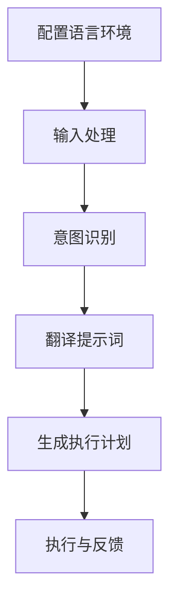
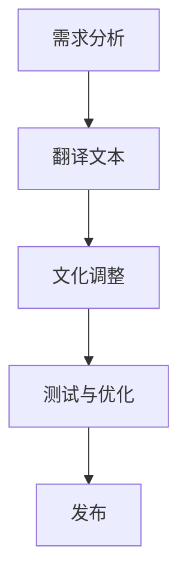

                 


### 提示词编程语言的国际化与本地化

#### 关键词：
1. 提示词编程语言
2. 国际化
3. 本地化
4. 语言处理技术
5. 文化差异
6. 模型架构
7. 实战案例

#### 摘要：
本文旨在探讨提示词编程语言的国际化与本地化问题，分析其核心概念、技术基础、实现细节以及挑战与解决方案。通过实际案例和最佳实践，为开发者提供国际化与本地化的全面指南。

## 引言与背景

### 1.1.1 提示词编程语言的起源与发展

提示词编程语言（Prompt Programming Language，简称PPL）是一种新兴的编程范式，它通过提示词（Prompt）引导程序执行，实现自动化和智能化。PPL的核心思想是将编程任务抽象为自然语言描述，通过分析提示词来确定程序的行为。这种语言的出现源于对自动化编程的需求，尤其是在处理复杂数据分析、机器学习和自然语言处理等任务时，PPL能够显著提高开发效率。

PPL的起源可以追溯到20世纪80年代的专家系统，当时的研究者们尝试通过自然语言来描述复杂的业务逻辑。随着计算机科学和人工智能技术的不断发展，PPL逐渐演变为一种独立的编程范式。近年来，随着深度学习和自然语言处理技术的突破，PPL得到了广泛关注和应用。

### 1.1.2 国际化与本地化的核心概念

国际化（Internationalization）是指使软件能够适应不同国家和地区的语言和文化的过程。国际化的目标是确保软件在不同的环境中都能够正常运行，包括文本翻译、日期格式、货币符号等。

本地化（Localization）是在国际化基础上，针对特定国家和地区进行定制化的过程。本地化不仅涉及语言和文化的转换，还包括对用户界面、功能和服务内容的适应。本地化的目的是提供用户友好的体验，使软件更好地满足当地用户的需求。

### 1.1.3 国际化与本地化的关系与区别

国际化与本地化是紧密相连但有所区别的两个概念。国际化是本地化的前提，没有国际化，本地化就无法进行。国际化关注的是软件的基础结构和代码，确保软件能够支持多种语言和文化。而本地化则是在国际化的基础上，对软件进行具体的文化和语言适配。

例如，一个电商平台需要进行国际化，首先要确保其代码和架构支持多语言，然后再进行本地化，为不同国家的用户提供符合当地文化和习惯的界面和功能。

### 1.1.4 问题背景与描述

随着全球化的推进，越来越多的软件需要支持国际化与本地化。然而，提示词编程语言在这一领域的应用仍然存在许多挑战。例如：

- **语言处理复杂性**：提示词编程语言依赖于自然语言处理技术，不同语言的自然语言处理复杂度不同，如何高效地处理多种语言是一个问题。
- **文化差异**：不同文化对同一事物的表达方式可能截然不同，如何确保提示词编程语言的提示符合不同文化背景的用户需求是一个难题。
- **资源管理**：国际化与本地化需要大量的翻译和测试资源，如何有效地管理这些资源是开发过程中的一大挑战。

### 1.1.5 问题解决与边界外延

为了解决国际化与本地化在提示词编程语言中的应用问题，我们需要从以下几个方面入手：

- **技术优化**：通过改进自然语言处理技术，提高对不同语言的适应性。
- **文化研究**：深入了解不同文化背景下的用户需求，确保提示词的准确性和恰当性。
- **资源优化**：采用智能化的翻译和测试工具，提高资源利用效率。

本文将围绕这些方面，详细探讨提示词编程语言的国际化与本地化问题，提供实用的解决方案和最佳实践。

## 国际化的技术基础

### 2.1.1 语言处理技术

国际化过程中，语言处理技术至关重要。自然语言处理（Natural Language Processing，简称NLP）是一种人工智能技术，旨在让计算机理解和生成人类语言。NLP包括文本分析、文本分类、实体识别、情感分析等多个方面。

在提示词编程语言中，NLP技术用于分析用户输入的提示词，理解其含义和意图。以下是一些关键的语言处理技术：

- **文本分析**：对输入文本进行分词、词性标注、句法分析等操作，提取文本中的关键信息。
- **文本分类**：将文本分为不同的类别，如新闻、科技、娱乐等，用于信息过滤和推荐。
- **实体识别**：识别文本中的特定实体，如人名、地名、组织名等，用于信息抽取和知识图谱构建。
- **情感分析**：判断文本的情感倾向，如正面、负面或中性，用于情感监控和用户反馈分析。

### 2.1.2 文本翻译与处理

文本翻译是国际化的重要环节。机器翻译（Machine Translation，简称MT）是一种自动翻译技术，通过将一种语言的文本转换为另一种语言，实现跨语言交流。

在提示词编程语言中，机器翻译用于将用户输入的提示词翻译为不同语言，确保用户能够使用自己熟悉的语言进行交互。以下是一些常用的机器翻译技术：

- **基于规则的翻译**：通过预定义的翻译规则，将源语言文本转换为目标语言文本。
- **统计机器翻译**：利用大量双语文本数据，通过统计方法生成目标语言文本。
- **神经机器翻译**：利用深度学习技术，特别是序列到序列（Seq2Seq）模型，生成目标语言文本。

除了文本翻译，文本处理还包括文本清洗、文本归一化等步骤，以提高翻译质量。

### 2.1.3 文本分类与标签化

文本分类是将文本分为不同类别的过程，标签化则是为文本分配标签以进行分类和标记。在国际化过程中，文本分类与标签化有助于对用户输入的提示词进行分类和管理。

以下是一些文本分类与标签化的技术：

- **朴素贝叶斯分类器**：基于贝叶斯理论，通过特征概率分布进行文本分类。
- **支持向量机（SVM）**：通过最大化分类边界，将文本分为不同类别。
- **深度学习分类器**：利用神经网络模型，如卷积神经网络（CNN）和循环神经网络（RNN），进行文本分类。

通过文本分类与标签化，我们可以更好地理解用户输入的提示词，为其提供更精准的服务。

## 本地化的技术基础

### 3.1.1 文化差异分析

文化差异是国际化与本地化过程中需要重点考虑的因素。不同国家和地区的人们在语言、行为、价值观等方面存在显著差异，这些差异直接影响软件的本地化效果。

以下是一些主要的文化差异：

- **语言差异**：不同语言的语法、词汇和表达方式不同，影响文本翻译和语义理解。
- **行为差异**：不同文化背景下的人们在礼仪、沟通方式等方面有所不同，影响用户界面的设计。
- **价值观差异**：不同文化对同一事物的看法和评价可能不同，影响功能和服务内容的定制。

了解和尊重这些文化差异，是确保软件本地化成功的关键。

### 3.1.2 本地化流程与工具

本地化流程包括多个阶段，从需求分析、翻译、测试到发布。以下是一个典型的本地化流程：

1. **需求分析**：了解目标市场的需求，确定需要翻译和本地化的内容。
2. **翻译**：将文本翻译为目标语言，确保准确性和流畅性。
3. **本地化**：根据文化差异，对用户界面、功能和服务内容进行调整。
4. **测试**：进行功能测试和用户体验测试，确保本地化后的软件质量。
5. **发布**：将本地化后的软件发布到目标市场。

以下是一些常用的本地化工具：

- **翻译工具**：如谷歌翻译、百度翻译等，用于快速翻译文本。
- **本地化平台**：如翻译管理平台、内容管理系统等，用于管理翻译项目和流程。
- **测试工具**：如自动化测试工具、用户体验测试工具等，用于测试本地化后的软件质量。

### 3.1.3 本地化测试与质量保证

本地化测试是确保软件在不同国家和地区都能正常运行的关键环节。以下是一些本地化测试的方法：

- **功能测试**：测试软件在本地化后的功能是否完整，是否满足用户需求。
- **性能测试**：测试软件在本地化后的性能，如响应时间、资源消耗等。
- **用户体验测试**：通过实际用户的使用反馈，评估本地化后的软件是否友好、易用。

为了确保本地化质量，可以采用以下措施：

- **多语言测试团队**：组建多语言测试团队，确保测试覆盖多个语言和文化。
- **持续集成和部署**：采用持续集成和部署（CI/CD）工具，自动化测试和发布流程。
- **用户反馈机制**：收集用户反馈，及时修复问题和改进本地化效果。

通过本地化测试与质量保证，我们可以确保软件在不同国家和地区都能提供高质量的本地化体验。

## 核心概念与理论

### 4.1.1 提示词编程语言的基本原理

提示词编程语言是一种基于自然语言交互的编程范式，其核心思想是将编程任务转化为自然语言描述。用户通过输入提示词，引导程序执行特定任务。提示词编程语言的基本原理包括以下几个方面：

1. **自然语言处理**：提示词编程语言依赖于自然语言处理技术，如分词、词性标注、句法分析等，以理解用户输入的提示词。
2. **意图识别**：通过分析提示词，识别用户的意图和需求，确定程序的行为。
3. **执行计划生成**：根据用户的意图，生成执行计划，包括调用函数、执行操作等。
4. **执行与反馈**：执行用户指定的任务，并将结果反馈给用户。

### 4.1.2 国际化与本地化的设计原则

国际化与本地化是提示词编程语言设计中的重要原则，确保软件能够适应不同国家和地区。以下是一些国际化与本地化的设计原则：

1. **模块化**：将国际化与本地化功能模块化，确保代码的可维护性和可扩展性。
2. **可配置性**：提供可配置的参数，如语言、日期格式等，以适应不同国家和地区的需求。
3. **多语言支持**：确保软件支持多种语言，为用户提供友好的语言界面。
4. **文化适应性**：根据不同文化背景，调整用户界面、功能和服务内容，确保软件的友好性和易用性。
5. **可测试性**：提供完善的测试方案，确保国际化与本地化后的软件质量。

### 4.1.3 国际化与本地化的数据模型

国际化与本地化涉及大量的数据管理，包括文本、图像、音频等。以下是一个典型的国际化与本地化的数据模型：

1. **文本数据**：包括用户界面文本、提示词、文档等，需要进行翻译和本地化。
2. **资源数据**：包括图像、音频、视频等，需要根据不同文化进行调整。
3. **配置数据**：包括语言设置、日期格式、货币符号等，用于配置软件环境。
4. **用户数据**：包括用户名、密码、偏好设置等，需要根据用户所在地区进行个性化调整。

通过合理的数据模型设计，可以确保国际化与本地化的顺利进行。

## 国际化与本地化的模型架构

### 5.1.1 国际化模型架构

国际化模型架构是提示词编程语言实现国际化功能的核心。以下是一个典型的国际化模型架构：

1. **输入处理模块**：接收用户输入的提示词，进行文本分析，提取关键信息。
2. **意图识别模块**：根据提示词内容和用户历史数据，识别用户的意图。
3. **翻译模块**：将提示词翻译为不同语言，确保用户界面和提示词的多语言支持。
4. **执行计划生成模块**：根据用户的意图和翻译后的提示词，生成执行计划。
5. **执行模块**：执行用户指定的任务，并将结果反馈给用户。
6. **日志记录模块**：记录国际化过程中的关键信息，用于后续分析和优化。

### 5.1.2 本地化模型架构

本地化模型架构是在国际化模型架构的基础上，针对特定国家和地区进行定制化。以下是一个典型的本地化模型架构：

1. **需求分析模块**：了解目标市场的需求，确定需要本地化的内容和功能。
2. **翻译模块**：将文本翻译为目标语言，确保准确性和流畅性。
3. **本地化调整模块**：根据文化差异，调整用户界面、功能和服务内容，确保软件的友好性和易用性。
4. **测试模块**：进行功能测试和用户体验测试，确保本地化后的软件质量。
5. **发布模块**：将本地化后的软件发布到目标市场。

### 5.1.3 模型架构的Mermaid ER图

为了更直观地展示国际化与本地化的模型架构，我们可以使用Mermaid ER图来表示。以下是国际化模型架构的Mermaid ER图：

```mermaid
erDiagram
    A[输入处理模块] ||--|{ B[意图识别模块] }
    B ||--|{ C[翻译模块] }
    C ||--|{ D[执行计划生成模块] }
    D ||--|{ E[执行模块] }
    E ||--|{ F[日志记录模块] }
```

以下是本地化模型架构的Mermaid ER图：

```mermaid
erDiagram
    G[需求分析模块] ||--|{ H[翻译模块] }
    H ||--|{ I[本地化调整模块] }
    I ||--|{ J[测试模块] }
    J ||--|{ K[发布模块] }
```

通过Mermaid ER图，我们可以清晰地看到国际化与本地化模型的组成部分及其关系，有助于理解其实现原理。

## 技术实现与实践

### 6.1.1 提示词编程语言中的国际化处理

国际化处理是提示词编程语言实现多语言支持的关键。以下是一个国际化处理的基本流程：

1. **配置语言环境**：在程序启动时，根据用户设置或系统默认值，配置语言环境。
2. **输入处理**：接收用户输入的提示词，进行文本分析，提取关键信息。
3. **意图识别**：根据提示词内容和用户历史数据，识别用户的意图。
4. **翻译提示词**：将用户输入的提示词翻译为目标语言，确保用户界面和提示词的一致性。
5. **生成执行计划**：根据用户的意图和翻译后的提示词，生成执行计划。
6. **执行与反馈**：执行用户指定的任务，并将结果反馈给用户。

以下是一个简化的国际化处理流程的Mermaid流程图：



### 6.1.2 提示词编程语言中的本地化处理

本地化处理是在国际化处理的基础上，针对特定国家和地区进行定制化。以下是一个本地化处理的基本流程：

1. **需求分析**：了解目标市场的需求，确定需要本地化的内容和功能。
2. **翻译文本**：将用户界面文本、提示词等翻译为目标语言，确保准确性和流畅性。
3. **文化调整**：根据文化差异，调整用户界面、功能和服务内容，确保软件的友好性和易用性。
4. **测试与优化**：进行功能测试和用户体验测试，确保本地化后的软件质量，并进行优化。
5. **发布**：将本地化后的软件发布到目标市场。

以下是一个简化的本地化处理流程的Mermaid流程图：



### 6.1.3 实现细节与代码示例

以下是一个简化的国际化与本地化处理的Python代码示例：

```python
import locale

# 设置语言环境
locale.setlocale(locale.LC_ALL, 'zh_CN.UTF-8')

# 输入处理
def input_handler(prompt):
    print(prompt)
    return input()

# 翻译提示词
def translate(prompt, target_language):
    # 这里使用示例翻译API，实际应用中可以使用如谷歌翻译等第三方服务
    translated_prompt = f"Translated to {target_language}: {prompt}"
    return translated_prompt

# 生成执行计划
def execute_plan(plan):
    print("Executing plan:", plan)

# 主程序
def main():
    prompt = "请输入您的需求："
    user_input = input_handler(prompt)
    
    # 翻译提示词
    translated_prompt = translate(user_input, 'en')
    print(translated_prompt)
    
    # 生成执行计划
    plan = "执行用户需求"
    execute_plan(plan)

# 运行主程序
if __name__ == "__main__":
    main()
```

这个示例展示了如何设置语言环境、处理用户输入、翻译提示词以及生成执行计划。实际应用中，还需要考虑更多细节，如多语言支持、文化调整等。

### 6.1.4 实际应用案例

以下是一个国际化与本地化的实际应用案例：一个跨国的在线购物平台。

1. **国际化**：平台提供多种语言界面，如中文、英语、西班牙语等，用户可以根据自己的语言偏好选择界面语言。
2. **本地化**：平台针对不同国家市场，提供符合当地文化和习惯的界面设计和功能，如不同的货币符号、支付方式、物流服务等。

通过国际化与本地化处理，平台能够为全球用户提供一致、友好和高效的购物体验。

## 实战案例分析

### 7.1.1 案例一：电商平台国际化与本地化

#### 问题描述

一个全球性的电商平台需要支持国际化与本地化，为不同国家和地区的用户提供一致的购物体验。

#### 解决方案

1. **国际化**：平台使用多语言支持框架，如i18n（国际化），为用户提供多种语言界面，确保用户能够使用自己熟悉的语言进行购物。
2. **本地化**：平台根据不同国家的文化和需求，提供本地化的界面设计和功能，如：
   - **语言**：提供多语言界面，如中文、英语、法语、德语等。
   - **货币**：根据用户所在国家，使用当地货币显示价格。
   - **支付方式**：支持不同国家的支付方式，如信用卡、借记卡、PayPal、支付宝等。
   - **物流**：提供本地化的物流服务，如国内快递、国际快递等。

#### 实施细节

1. **技术实现**：
   - 使用i18n框架管理多语言界面，确保界面文本和提示词的多语言支持。
   - 使用支付网关和物流API，实现本地化的支付和物流服务。
2. **测试与优化**：
   - 进行多语言界面测试，确保不同语言的界面准确性和一致性。
   - 进行支付和物流功能测试，确保本地化后的功能正常运行。

#### 项目小结

通过国际化与本地化处理，电商平台能够为全球用户提供一致、友好和高效的购物体验，提高了用户满意度和市场份额。

### 7.1.2 案例二：社交媒体平台国际化与本地化

#### 问题描述

一个社交媒体平台需要支持国际化与本地化，为不同国家和地区的用户提供社交互动和内容分享功能。

#### 解决方案

1. **国际化**：平台使用多语言支持框架，为用户提供多种语言界面，确保用户能够使用自己熟悉的语言进行社交互动。
2. **本地化**：平台根据不同国家的文化和需求，提供本地化的界面设计和功能，如：
   - **语言**：提供多语言界面，如中文、英语、西班牙语、阿拉伯语等。
   - **内容**：根据用户所在国家，推荐本地化的内容，如新闻、娱乐、时事等。
   - **文化差异**：调整用户界面和功能，适应不同文化的社交习惯，如点赞、评论、分享等。

#### 实施细节

1. **技术实现**：
   - 使用i18n框架管理多语言界面，确保界面文本和提示词的多语言支持。
   - 使用内容推荐算法，根据用户地理位置和语言偏好，推荐本地化内容。
2. **测试与优化**：
   - 进行多语言界面测试，确保不同语言的界面准确性和一致性。
   - 进行功能测试，确保本地化后的功能正常运行。

#### 项目小结

通过国际化与本地化处理，社交媒体平台能够为全球用户提供一致、友好和高效的社交互动体验，提高了用户参与度和活跃度。

## 最佳实践与未来趋势

### 8.1.1 最佳实践

在国际化与本地化过程中，以下最佳实践有助于提高软件的质量和用户体验：

1. **统一管理和维护**：使用统一的国际化与本地化管理工具，如i18n框架，确保多语言界面的准确性和一致性。
2. **本地化测试**：进行本地化测试，包括功能测试、性能测试和用户体验测试，确保本地化后的软件质量。
3. **文化研究**：深入研究目标市场的文化差异，确保软件的界面设计和功能符合当地用户的需求和习惯。
4. **用户反馈**：收集用户反馈，及时修复问题和改进本地化效果，提高用户满意度。

### 8.1.2 未来趋势

随着人工智能和自然语言处理技术的发展，国际化与本地化将变得更加智能化和自动化。以下是一些未来趋势：

1. **智能翻译**：利用深度学习和神经网络技术，实现高质量的智能翻译，提高翻译速度和准确性。
2. **个性化本地化**：通过个性化推荐算法，为用户提供定制化的本地化体验，提高用户满意度。
3. **多模态交互**：结合语音、图像、视频等多种模态，实现更自然的用户交互，提高国际化与本地化的用户体验。
4. **区块链技术**：利用区块链技术，确保国际化与本地化数据的可信性和安全性，提高数据管理效率。

通过关注这些最佳实践和未来趋势，我们可以更好地应对国际化与本地化带来的挑战，为全球用户提供高质量的软件体验。

## 小结与拓展阅读

本文探讨了提示词编程语言的国际化与本地化问题，分析了其核心概念、技术基础、实现细节以及挑战与解决方案。通过实际案例和最佳实践，为开发者提供了全面的国际化与本地化指南。

为了深入了解国际化与本地化的具体实现，以下拓展阅读资源将为您提供更多有价值的信息：

1. **《国际化与本地化实践指南》**：一本详细介绍国际化与本地化过程、技术实现和最佳实践的实用指南。
2. **《自然语言处理：现代方法》**：一本全面介绍自然语言处理技术的经典教材，涵盖了文本分析、翻译和情感分析等方面。
3. **《文化差异与跨文化交流》**：一本探讨文化差异和跨文化交流的著作，有助于理解不同文化背景下的用户需求和行为。

通过阅读这些资料，您可以进一步丰富对国际化与本地化的认识，提高软件的国际化与本地化能力。

## 作者信息

作者：AI天才研究院/AI Genius Institute & 禅与计算机程序设计艺术 /Zen And The Art of Computer Programming

