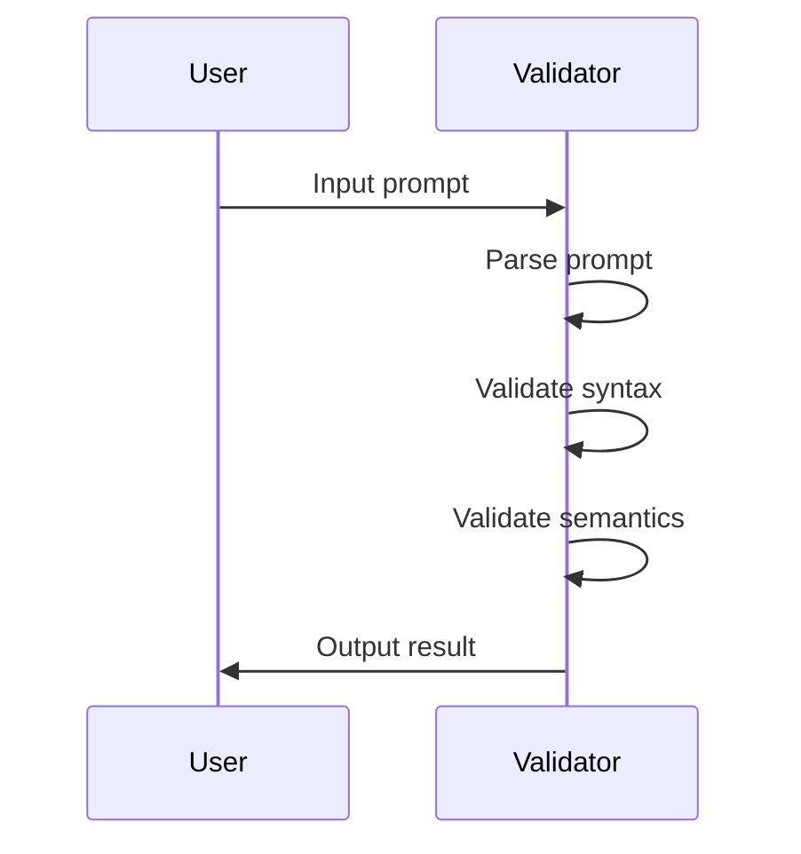
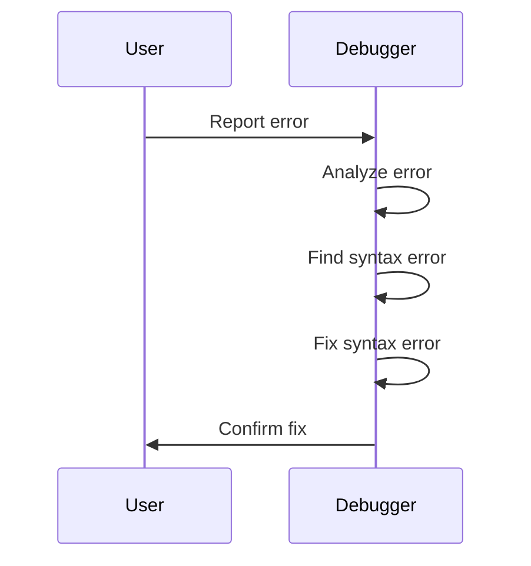
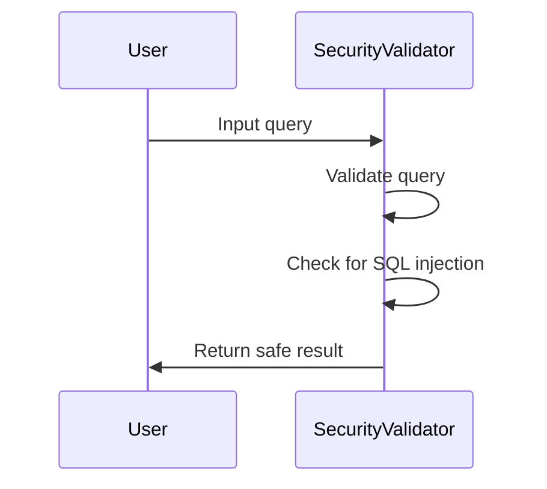
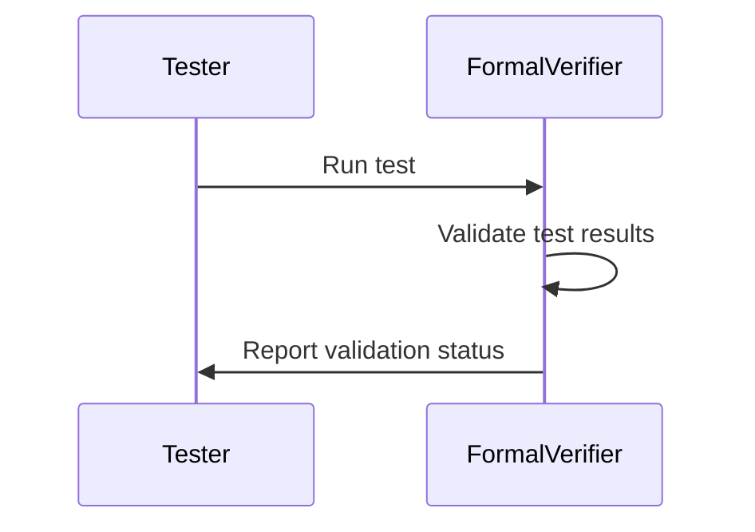
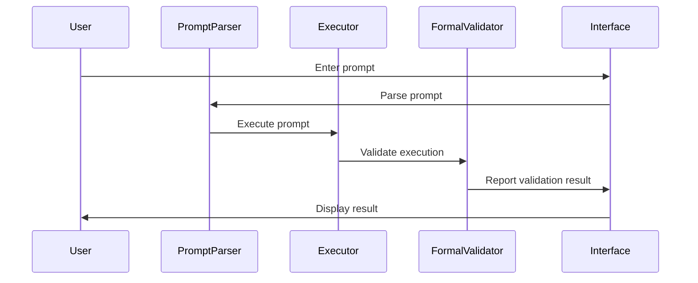

                 

### 提示词编程语言的概念

#### 1.1 提示词编程语言的概念

提示词编程语言（Prompt-Based Programming Language）是一种特殊的编程语言，其核心思想是通过用户输入的提示词（prompts）来引导程序的行为和决策。与传统的编程语言不同，提示词编程语言更加注重人与机器之间的互动和对话。用户通过输入自然语言提示词，程序能够理解并执行相应的操作。

**定义：**
提示词编程语言是一种将自然语言提示与程序执行紧密结合的编程工具，它允许用户通过自然语言描述任务和需求，系统则根据这些提示自动生成代码或执行特定任务。

**起源：**
提示词编程语言起源于自然语言处理（NLP）和人工智能（AI）领域，特别是基于规则系统和模板匹配技术。早期的提示词编程语言如ELIZA，通过简单的模式匹配和预设规则来模拟对话。

**特点：**
- **互动性**：强调人与机器之间的互动，用户可以通过自然语言与程序进行交流。
- **灵活性**：用户可以以自然语言的形式输入复杂的逻辑和条件。
- **可解释性**：提示词编程语言使得程序的执行过程更加透明，易于理解和调试。
- **适用性广**：适用于不同领域，如自动化测试、自然语言生成、智能客服等。

**与编程语言的关系：**
提示词编程语言并不是要替代传统编程语言，而是作为补充，提供一种更加自然和直观的方式与计算机交互。传统编程语言强调代码的结构性和可维护性，而提示词编程语言则更注重用户的需求和表达。

#### 1.2 提示词编程语言的发展历程

**早期发展：**
- **20世纪60年代**：ELIZA的出现标志着提示词编程语言的诞生。由约瑟夫·维津斯基（Joseph Weizenbaum）开发的ELIZA，通过模式匹配和预设的规则与用户进行对话。
- **20世纪70年代**：规则系统（Rule-Based Systems）进一步发展，如KRL（Knowledge Representation Language）和Prodigy，这些语言提供了更加复杂和结构化的规则来处理自然语言输入。

**中期发展：**
- **20世纪80年代**：随着专家系统（Expert Systems）的兴起，基于规则的提示词编程语言如Kappa、Karen和FrauLiSa等，开始广泛应用于实际场景。
- **20世纪90年代**：面向对象编程（Object-Oriented Programming，OOP）和面向消息传递（Message Passing）的编程模型开始融入提示词编程语言中，如IBM的OMlixir。

**近期发展：**
- **21世纪初**：随着深度学习和自然语言处理技术的进步，提示词编程语言开始融入更多先进的算法和技术，如基于神经网络的语言模型和生成对抗网络（GANs）。
- **当今**：AI驱动的提示词编程语言如TensorFlow、PyTorch等，使得用户可以通过自然语言与深度学习模型进行交互，实现更加复杂和智能的任务。

#### 1.3 提示词编程语言的重要性

**提高开发效率：**
提示词编程语言通过自然语言输入，大大简化了编程的复杂性，用户不需要深入了解底层代码和语法，即可实现复杂的编程任务，从而提高了开发效率。

**降低技术门槛：**
传统编程语言需要开发者具备一定的编程基础，而提示词编程语言则通过自然语言交互，降低了入门门槛，使得非专业技术人员也能够参与到软件开发中来。

**增强用户体验：**
提示词编程语言使得计算机能够更好地理解用户的需求和意图，从而提供更加智能化和个性化的服务，提升用户体验。

**促进跨领域应用：**
提示词编程语言不仅适用于软件开发，还可以应用于自然语言处理、人工智能、智能客服等多个领域，促进跨领域的创新和应用。

**推动人工智能发展：**
提示词编程语言作为人工智能的一种重要工具，促进了自然语言处理、机器学习等领域的发展，为人工智能应用提供了更加便捷和高效的方式。

### 1.4 形式化方法的基本概念

**定义：**
形式化方法（Formal Methods）是计算机科学中的一种方法论，旨在通过数学模型和形式语言来描述和验证软件系统的性质和正确性。

**应用领域：**
- **软件工程**：用于验证软件系统的正确性、可靠性和安全性。
- **系统设计**：提供形式化的设计工具和方法，确保系统的正确性和一致性。
- **形式化验证**：通过数学证明和模型检查来验证系统的性质，如安全性、实时性和并发性。
- **形式化规范**：用于编写形式化的规格说明文档，作为软件开发的基础。

**优势与挑战：**
- **优势：**
  - 提高软件系统的可靠性：通过严格的数学模型和验证过程，确保系统在设计和实现过程中的正确性。
  - 提高开发效率：形式化方法可以提前发现和修复潜在的错误，减少后期维护成本。
  - 提高系统可理解性：形式化方法使得系统设计和实现过程更加透明和可理解。

- **挑战：**
  - 技术门槛高：形式化方法需要开发者具备一定的数学和编程基础。
  - 验证复杂性：形式化验证过程通常较为复杂和耗时。
  - 缺乏直观性：形式化方法往往较为抽象，难以直观地理解和应用。

### 1.5 形式化方法在提示词编程语言中的应用

**验证：**
形式化方法可以通过数学证明和模型检查来验证提示词编程语言的正确性和一致性，确保程序在执行过程中不会出现逻辑错误或异常行为。

**优化：**
形式化方法可以帮助优化提示词编程语言的性能和效率，通过数学模型分析来找到最佳算法和策略。

**调试：**
形式化方法可以辅助调试提示词编程语言，通过形式化的验证工具来识别和定位潜在的错误和缺陷。

**安全性：**
形式化方法可以确保提示词编程语言的安全性，通过严格的数学模型来验证系统的安全属性，防止恶意攻击和数据泄露。

**可维护性：**
形式化方法可以提高提示词编程语言的可维护性，通过形式化的规格说明文档来指导软件开发和维护。

### 1.6 提示词编程语言的形式化建模方法

**定义：**
形式化建模（Formal Modeling）是一种使用数学模型和形式语言来描述系统的结构和行为的方法。

**方法：**
- **数学模型：** 使用数学公式和符号来描述系统的性质和行为。
- **形式语言：** 使用形式化的语法和语义来定义编程语言的表达式和规则。

**案例：**
- **状态机模型：** 描述程序的状态和转换关系。
- **进程代数模型：** 描述程序的并发行为和通信机制。
- **形式语义模型：** 描述程序的行为和语义。

### 1.7 形式化方法支持下的提示词编程语言设计与实现

**架构设计：**
形式化方法支持下的提示词编程语言需要具备灵活的架构设计，以适应不同的应用场景和需求。

**语法设计：**
设计直观、易用的语法，以简化用户的编程过程，提高开发效率。

**语义设计：**
定义清晰的语义，确保程序的行为符合预期，并通过形式化验证确保语义的正确性。

### 1.8 实际应用案例分析

**自然语言处理：**
提示词编程语言在自然语言处理（NLP）领域具有广泛的应用，如文本分类、情感分析和语言翻译等。

**人工智能：**
在人工智能领域，提示词编程语言可以用于构建智能对话系统、自动化测试和机器学习模型的训练等。

**其他领域：**
提示词编程语言还可应用于智能客服、智能家居、自动化运维等领域，为各行业提供智能化解决方案。

### 1.9 形式化方法支持下的提示词编程语言的优势

**提高可靠性：**
通过形式化验证，确保程序的正确性和可靠性，降低错误和故障的风险。

**提升效率：**
简化编程过程，提高开发效率和代码可维护性。

**增强安全性：**
通过形式化方法验证系统的安全属性，提高系统的安全性。

**促进创新：**
形式化方法为提示词编程语言提供了强有力的支持，促进了新的应用场景和技术的发展。

### 1.10 总结与展望

本文介绍了提示词编程语言的概念、发展历程、重要性以及形式化方法的基本概念和应用。形式化方法为提示词编程语言提供了强大的支持，提高了可靠性、效率和安全性，促进了新技术的创新和发展。未来，随着人工智能和自然语言处理技术的不断进步，提示词编程语言将在更多领域发挥重要作用。

### 1.11 对研究者和开发者的建议

- **深入理解形式化方法：** 掌握形式化方法的基本概念和工具，提高系统设计和验证的能力。
- **实践与应用：** 将形式化方法应用于实际的提示词编程语言项目中，积累经验，提升技术水平。
- **跨领域合作：** 与其他领域的专家合作，探索形式化方法在提示词编程语言中的跨领域应用。
- **持续创新：** 随着技术的不断发展，不断探索新的形式化方法和应用场景，推动提示词编程语言的创新和发展。

---

以下为第2章的详细内容：

### 第2章：形式化方法的基本概念

#### 2.1 形式化方法的定义

形式化方法（Formal Methods）是一种通过数学模型和逻辑推理来描述和分析软件系统的方法。它强调精确性和严格性，旨在确保软件系统的正确性、可靠性和安全性。与传统的软件开发方法相比，形式化方法更注重理论基础的构建和形式化的验证过程。

**定义：**
形式化方法是一种使用数学模型、形式语言和逻辑推理来描述、分析和验证软件系统的技术。它通过建立数学模型来模拟系统的行为和属性，然后使用逻辑推理和数学证明来验证系统的正确性。

**特点：**
- **数学化描述：** 形式化方法使用数学语言和符号来描述系统的行为和属性，确保描述的精确性和一致性。
- **形式化验证：** 形式化方法通过形式化的验证过程来确保系统的正确性，通常包括模型检查、定理证明和模拟验证等。
- **自动化工具：** 形式化方法通常使用自动化工具来辅助验证和验证过程，如模型检查器、证明助手等。

#### 2.2 形式化方法的应用领域

形式化方法在计算机科学和软件工程中有着广泛的应用，其主要应用领域包括：

- **软件工程：** 用于软件系统的设计和验证，确保系统的正确性和一致性。
- **系统设计：** 提供形式化的设计工具和方法，用于设计和验证复杂的系统。
- **形式化验证：** 通过数学证明和模型检查来验证系统的性质，如安全性、实时性和并发性。
- **形式化规范：** 用于编写形式化的规格说明文档，作为软件开发的基础。
- **硬件设计：** 形式化方法在硬件设计中也有重要应用，如集成电路设计和嵌入式系统设计。

#### 2.3 形式化方法的优势与挑战

**优势：**
- **提高可靠性：** 形式化方法通过严格的数学模型和验证过程，确保系统的正确性和可靠性。
- **减少错误：** 形式化方法可以提前发现和修复潜在的错误，减少后期维护成本。
- **提高开发效率：** 形式化方法可以简化设计和验证过程，提高开发效率。
- **增强安全性：** 形式化方法可以确保系统的安全属性，防止恶意攻击和数据泄露。

**挑战：**
- **技术门槛高：** 形式化方法需要开发者具备一定的数学和编程基础，入门难度较高。
- **验证复杂性：** 形式化验证过程通常较为复杂和耗时，需要大量的计算资源和专业知识。
- **缺乏直观性：** 形式化方法往往较为抽象，难以直观地理解和应用。
- **应用限制：** 形式化方法在某些复杂场景下可能无法有效应用，如分布式系统和实时系统。

#### 2.4 形式化方法在提示词编程语言中的应用

**验证：**
形式化方法可以通过数学证明和模型检查来验证提示词编程语言的正确性和一致性，确保程序在执行过程中不会出现逻辑错误或异常行为。

**优化：**
形式化方法可以帮助优化提示词编程语言的性能和效率，通过数学模型分析来找到最佳算法和策略。

**调试：**
形式化方法可以辅助调试提示词编程语言，通过形式化的验证工具来识别和定位潜在的错误和缺陷。

**安全性：**
形式化方法可以确保提示词编程语言的安全性，通过严格的数学模型来验证系统的安全属性，防止恶意攻击和数据泄露。

**可维护性：**
形式化方法可以提高提示词编程语言的可维护性，通过形式化的规格说明文档来指导软件开发和维护。

#### 2.5 形式化方法支持下的提示词编程语言设计与实现

**架构设计：**
形式化方法支持下的提示词编程语言需要具备灵活的架构设计，以适应不同的应用场景和需求。

**语法设计：**
设计直观、易用的语法，以简化用户的编程过程，提高开发效率。

**语义设计：**
定义清晰的语义，确保程序的行为符合预期，并通过形式化验证确保语义的正确性。

#### 2.6 实际应用案例分析

**自然语言处理：**
提示词编程语言在自然语言处理（NLP）领域具有广泛的应用，如文本分类、情感分析和语言翻译等。

**人工智能：**
在人工智能领域，提示词编程语言可以用于构建智能对话系统、自动化测试和机器学习模型的训练等。

**其他领域：**
提示词编程语言还可应用于智能客服、智能家居、自动化运维等领域，为各行业提供智能化解决方案。

#### 2.7 形式化方法支持下的提示词编程语言的优势

**提高可靠性：**
通过形式化验证，确保程序的正确性和可靠性，降低错误和故障的风险。

**提升效率：**
简化编程过程，提高开发效率和代码可维护性。

**增强安全性：**
通过形式化方法验证系统的安全属性，提高系统的安全性。

**促进创新：**
形式化方法为提示词编程语言提供了强有力的支持，促进了新的应用场景和技术的发展。

#### 2.8 总结与展望

本文介绍了形式化方法的基本概念、应用领域、优势与挑战，以及在提示词编程语言中的应用。形式化方法为提示词编程语言提供了强大的支持，提高了可靠性、效率和安全性，促进了新技术的创新和发展。未来，随着人工智能和自然语言处理技术的不断进步，形式化方法将在更多领域发挥重要作用。

#### 2.9 对研究者和开发者的建议

- **深入理解形式化方法：** 掌握形式化方法的基本概念和工具，提高系统设计和验证的能力。
- **实践与应用：** 将形式化方法应用于实际的提示词编程语言项目中，积累经验，提升技术水平。
- **跨领域合作：** 与其他领域的专家合作，探索形式化方法在提示词编程语言中的跨领域应用。
- **持续创新：** 随着技术的不断发展，不断探索新的形式化方法和应用场景，推动提示词编程语言的创新和发展。

---

通过以上的详细内容，第2章对形式化方法的基本概念进行了全面而深入的介绍，为后续章节的内容打下了坚实的基础。接下来，我们将在第3章中深入探讨提示词编程语言的形式化建模方法。

### 第3章：提示词编程语言的形式化建模

#### 3.1 形式化建模的概念

形式化建模（Formal Modeling）是一种使用数学模型和形式化语言来描述系统的结构和行为的方法。在提示词编程语言中，形式化建模尤为重要，因为它不仅帮助开发者理解语言的结构和语义，还能为形式化验证提供基础。

**定义：**
形式化建模是一种使用数学模型、形式语言和抽象工具来描述系统的行为、状态和交互的过程。

**作用：**
- **理解语言结构：** 形式化建模帮助开发者理解编程语言的内部结构，如语法、语义和执行过程。
- **验证正确性：** 通过形式化建模，可以构建系统的数学模型，并使用验证工具来确保系统的正确性。
- **优化设计：** 形式化建模可以揭示系统的潜在问题和优化空间，帮助开发者改进语言设计。

#### 3.2 提示词编程语言的核心要素

提示词编程语言的核心要素包括提示词、执行引擎、语法规则和语义规则。形式化建模需要对这些要素进行精确的描述和建模。

**核心要素：**
- **提示词：** 提示词是用户输入的自然语言指令，用于引导程序执行特定任务。
- **执行引擎：** 执行引擎负责解析提示词，执行相应的操作，并生成输出。
- **语法规则：** 语法规则定义提示词的语法结构，确保输入的提示词符合语言的语法要求。
- **语义规则：** 语义规则定义提示词的语义含义，即提示词所代表的操作和结果。

#### 3.3 形式化建模方法

**形式化建模方法包括以下步骤：**

1. **需求分析：**
   - **理解用户需求：** 与用户沟通，明确用户期望的功能和特性。
   - **功能需求：** 描述系统的功能需求，如输入提示词、执行操作、输出结果等。
   - **非功能需求：** 描述系统的性能、安全性、可靠性等非功能需求。

2. **抽象建模：**
   - **定义抽象模型：** 使用数学模型和形式化语言来描述系统的行为和状态。
   - **状态机模型：** 使用状态机来描述系统的状态转换和事件处理。
   - **数据模型：** 使用数据模型来描述系统的数据结构和数据流。

3. **形式化验证：**
   - **构建验证条件：** 使用形式化验证工具来构建验证条件，确保系统的行为满足需求。
   - **定理证明：** 使用定理证明工具来证明系统的正确性，确保系统在所有情况下都能正确执行。
   - **模型检查：** 使用模型检查工具来验证系统的状态转换和事件处理是否满足预定的条件。

4. **迭代优化：**
   - **分析验证结果：** 分析形式化验证的结果，识别潜在的问题和优化点。
   - **优化模型：** 根据验证结果，对模型进行调整和优化，以提高系统的性能和可靠性。
   - **重新验证：** 重新进行形式化验证，确保优化后的模型仍然满足需求。

#### 3.4 提示词编程语言的形式化建模案例

以下是一个简单的提示词编程语言的建模案例：

**案例：** 简单的文本处理提示词编程语言

1. **需求分析：**
   - **功能需求：** 用户可以通过输入自然语言提示词来执行文本处理操作，如文本复制、粘贴和删除。
   - **非功能需求：** 系统需要保证操作的准确性，并具有较高的响应速度。

2. **抽象建模：**
   - **状态机模型：**
     ```mermaid
     stateMachineDiagram
       [*] --> InputState
       InputState --> CopyState : 复制命令
       InputState --> PasteState : 粘贴命令
       InputState --> DeleteState : 删除命令
       CopyState --> OutputState : 输出复制内容
       PasteState --> OutputState : 输出粘贴内容
       DeleteState --> OutputState : 输出删除后的文本
     ```
   - **数据模型：**
     ```mermaid
     classDiagram
       Action <<Class>>
       Text <<Class>>
       
       Action {
         type : String
         text : Text
       }
       
       Text {
         content : String
       }
     ```

3. **形式化验证：**
   - **验证条件：** 确保每个输入的提示词都能被正确地处理，并且输出结果符合预期。
   - **定理证明：** 使用定理证明工具来验证状态转换的正确性。
   - **模型检查：** 使用模型检查工具来验证系统的行为是否满足所有输入和输出条件。

4. **迭代优化：**
   - **性能优化：** 通过分析验证结果，发现系统在某些情况下响应速度较慢，进行优化。
   - **错误处理：** 优化错误处理机制，确保系统能够正确处理异常情况。

#### 3.5 形式化建模的优势与挑战

**优势：**
- **精确描述：** 形式化建模可以精确地描述系统的行为和状态，确保设计的准确性。
- **自动化验证：** 形式化建模可以自动化验证系统的正确性，提高开发效率。
- **可维护性：** 形式化建模提供了清晰的文档和验证结果，有助于系统的维护和改进。

**挑战：**
- **复杂度高：** 形式化建模需要较高的数学和编程基础，对于开发者来说有一定的学习曲线。
- **验证难度：** 形式化验证过程可能较为复杂和耗时，需要专业的知识和工具支持。

#### 3.6 总结

形式化建模是提示词编程语言设计中的关键环节，它通过数学模型和形式化语言精确地描述和验证系统的行为。在本章中，我们介绍了形式化建模的基本概念、核心要素和具体方法，并通过一个案例展示了如何进行形式化建模。形式化建模为提示词编程语言的可靠性和效率提供了有力保障，是未来提示词编程语言发展的重要方向。

---

在第3章中，我们详细探讨了提示词编程语言的形式化建模方法，为后续章节的内容奠定了基础。接下来，我们将进入第4章，分析形式化方法在提示词编程语言中的具体应用，包括验证、优化和调试等方面。

### 第4章：形式化方法在提示词编程语言中的应用

#### 4.1 验证

在提示词编程语言中，验证是确保程序正确性和一致性的关键步骤。形式化方法通过数学模型和逻辑推理，提供了自动化和严格的验证手段。

**验证过程：**
1. **需求分析：** 明确系统的功能需求和非功能需求。
2. **构建模型：** 使用形式化建模方法构建系统的数学模型。
3. **验证条件：** 定义验证条件，确保系统满足所有需求和约束。
4. **形式化验证：** 使用形式化验证工具进行模型检查、定理证明和模拟验证。

**优势：**
- **自动化：** 形式化验证工具可以自动化执行验证过程，减少手动验证的工作量。
- **准确性：** 形式化验证能够发现隐含的错误和未考虑的情况，提高系统的可靠性。
- **全面性：** 形式化验证可以覆盖系统的所有路径和状态，确保系统的全面正确性。

**案例：**
以一个文本处理提示词编程语言为例，使用形式化验证工具来验证其是否能正确处理各种文本操作，如复制、粘贴和删除。



#### 4.2 优化

形式化方法不仅用于验证系统，还可以用于优化系统的性能和效率。通过数学模型分析，可以发现系统中的瓶颈和优化空间。

**优化过程：**
1. **性能分析：** 分析系统在不同负载下的性能，确定瓶颈和优化目标。
2. **构建模型：** 构建系统的数学模型，包括时间复杂度和空间复杂度。
3. **优化策略：** 根据模型分析结果，制定优化策略，如算法改进、数据结构优化和并行化。
4. **形式化验证：** 重新验证优化后的系统，确保优化不会引入新的错误。

**优势：**
- **精确分析：** 形式化方法可以精确地分析系统的性能，提供可靠的优化方向。
- **高效改进：** 通过形式化验证，优化后的系统能够保持原有的正确性和一致性。
- **持续改进：** 形式化方法支持持续的性能优化，随着系统需求和负载的变化，不断改进系统。

**案例：**
对一个文本处理提示词编程语言进行性能优化，通过分析发现其复制操作的效率较低，通过改进算法和数据结构来提高性能。

```mermaid
gantt
  title 性能优化计划
  section 分析
  A(:分析瓶颈) as A from :2023-04-01 to :2023-04-05
  section 优化
  B(:改进算法) as B from :2023-04-06 to :2023-04-10
  C(:优化数据结构) as C from :2023-04-11 to :2023-04-15
  section 验证
  D(:验证优化效果) as D from :2023-04-16 to :2023-04-20
```

#### 4.3 调试

形式化方法在调试过程中也发挥着重要作用，通过形式化验证工具，可以快速定位和修复错误。

**调试过程：**
1. **错误报告：** 系统报告错误或异常情况。
2. **构建模型：** 基于错误报告，构建系统的数学模型，识别可能的问题区域。
3. **形式化验证：** 使用形式化验证工具来模拟错误情况，找出导致错误的原因。
4. **修复错误：** 根据验证结果，修复错误，并重新验证系统的正确性。

**优势：**
- **快速定位：** 形式化方法可以迅速定位错误发生的位置，减少调试时间。
- **全面分析：** 形式化验证工具可以全面分析系统的行为，提供更深入的错误分析。
- **确保正确：** 修复错误后，通过形式化验证确保系统恢复正常。

**案例：**
在一个文本处理提示词编程语言中，用户报告复制操作无法正确执行，通过形式化验证工具，发现是由于语法解析错误导致的。



#### 4.4 安全性

形式化方法在确保提示词编程语言的安全性方面也具有重要意义。通过形式化验证，可以检测和防止潜在的安全漏洞和攻击。

**安全验证过程：**
1. **安全需求：** 确定系统的安全需求，如数据保护、访问控制和隐私保护。
2. **构建安全模型：** 基于安全需求，构建系统的安全模型。
3. **安全验证：** 使用形式化验证工具来验证系统的安全属性，如防止数据泄露和恶意攻击。
4. **安全改进：** 根据验证结果，改进系统的安全性，确保系统的安全防护。

**优势：**
- **预防性保护：** 形式化方法可以在系统开发早期发现和修复安全漏洞，预防潜在的安全威胁。
- **全面验证：** 形式化验证可以全面分析系统的安全性，确保所有安全属性得到验证。
- **可靠保障：** 形式化方法提供了一套可靠的验证和改进流程，为系统的长期安全性提供保障。

**案例：**
对一个智能客服系统的安全性进行验证，使用形式化验证工具检测和防止SQL注入和其他常见的网络攻击。



#### 4.5 可维护性

形式化方法通过提供清晰的模型和验证结果，提高了系统的可维护性。开发者可以更容易地理解和修改系统，减少维护成本。

**可维护性过程：**
1. **形式化文档：** 使用形式化方法编写系统的规格说明文档，包括模型、验证条件和结果。
2. **持续验证：** 在系统开发和维护过程中，定期进行形式化验证，确保系统的正确性和一致性。
3. **维护优化：** 根据验证结果，对系统进行必要的维护和优化，确保系统的长期稳定运行。

**优势：**
- **清晰文档：** 形式化方法生成的文档清晰、易于理解，有助于开发者快速掌握系统。
- **持续改进：** 形式化验证支持持续的系统改进，确保系统始终保持正确性和高效性。
- **减少错误：** 形式化方法可以提前发现和修复潜在的错误，降低维护成本。

**案例：**
对一个自动化测试工具进行形式化验证，确保其测试脚本的正确性和一致性，从而提高测试的可维护性和可靠性。



#### 4.6 总结

形式化方法在提示词编程语言中的应用，为系统的验证、优化、调试、安全性和可维护性提供了强有力的支持。通过形式化建模和验证，可以确保系统的正确性、可靠性和安全性，提高开发效率和系统的可维护性。在未来，随着形式化方法和技术的发展，提示词编程语言将能够在更多领域发挥重要作用，为人工智能和自然语言处理提供更加可靠和高效的工具。

---

在第4章中，我们详细分析了形式化方法在提示词编程语言中的应用，包括验证、优化、调试、安全性和可维护性等方面。这些应用为提示词编程语言的可靠性和效率提供了有力保障。接下来，我们将进入第5章，探讨如何设计和实现一个支持形式化方法的提示词编程语言。

### 第5章：形式化方法支持下的提示词编程语言设计与实现

#### 5.1 提示词编程语言的架构设计

设计一个支持形式化方法的提示词编程语言，首先需要明确其总体架构，确保语言能够灵活地适应不同应用场景，同时满足形式化验证的需求。

**架构设计原则：**
- **模块化设计：** 将语言分为多个模块，如提示词解析模块、执行引擎模块、形式化验证模块等，便于管理和维护。
- **可扩展性：** 确保语言架构具有可扩展性，能够方便地集成新的功能和算法。
- **形式化验证集成：** 在架构中集成形式化验证工具和接口，确保语言设计和实现过程中能够进行形式化验证。

**架构组成：**
- **提示词解析模块：** 负责解析用户输入的提示词，将其转换为内部表示。
- **执行引擎模块：** 负责执行解析后的提示词，实现具体的操作和任务。
- **形式化验证模块：** 负责形式化验证系统的各个部分，确保系统的正确性和一致性。
- **用户接口模块：** 提供用户与系统的交互界面，允许用户输入提示词并查看结果。

**架构图：**


#### 5.2 语法设计

提示词编程语言的语法设计是确保用户输入的提示词能够被正确解析和执行的关键。语法设计需要简洁、直观，同时具备足够的灵活性和扩展性。

**语法设计原则：**
- **简洁性：** 语法设计应尽量简洁，减少用户输入的复杂度。
- **易用性：** 语法应易于理解和使用，减少学习成本。
- **扩展性：** 语法设计应允许用户自定义新的指令和操作。

**语法元素：**
- **提示词：** 提示词是用户输入的核心，可以是自然语言指令，如“复制这段文本”或“列出所有用户”。
- **关键词：** 关键词是提示词中的核心部分，用于指定操作类型，如“复制”、“删除”、“列出”等。
- **参数：** 参数是提示词中用于补充操作细节的部分，如文本内容、用户ID等。

**语法规则：**
- **提示词结构：** 提示词由关键词、参数和可选的修饰符组成。
- **语法解析：** 使用解析器（如正则表达式或递归下降解析器）来解析提示词，将其转换为内部表示。

**示例语法：**
```
copy "这段文本" into variable "text_variable"
delete user with id "123"
list all users with role "admin"
```

#### 5.3 语义设计

语义设计是定义提示词编程语言中各个指令的操作含义和执行过程。形式化方法在语义设计中的应用，可以确保语义的明确性和一致性。

**语义设计原则：**
- **一致性：** 确保所有操作的含义和执行过程一致，避免歧义和冲突。
- **可验证性：** 设计的语义应支持形式化验证，确保系统的正确性和安全性。
- **灵活性：** 语义设计应允许灵活的扩展和定制，以适应不同应用场景。

**语义元素：**
- **操作定义：** 定义每个关键词的操作含义，如复制、删除、列出等。
- **参数约束：** 定义参数的合法值和约束条件，确保输入的合法性。
- **执行过程：** 定义操作的执行过程，包括前置条件、执行步骤和后置条件。

**形式化语义描述：**
- **状态机模型：** 使用状态机模型来描述操作的执行过程，包括状态转换和事件处理。
- **进程代数模型：** 使用进程代数模型来描述系统的并发行为和通信机制。

**示例语义描述：**
```mermaid
stateDiagram
  state "copy" {
    copy["Copy text to variable"]
  }
  state "delete" {
    delete["Delete user from database"]
  }
  state "list" {
    list["List users with specified role"]
  }
```

#### 5.4 形式化验证的支持

形式化验证是确保提示词编程语言正确性和一致性的关键步骤。在设计和实现过程中，应集成形式化验证工具和接口，以便在开发和维护过程中进行形式化验证。

**验证工具选择：**
- **模型检查器：** 如SPIN、CBMC等，用于验证系统的状态转换和逻辑一致性。
- **定理证明器：** 如Coq、Isabelle等，用于证明系统的正确性和安全性。
- **模拟器：** 用于模拟系统的执行过程，检测潜在的错误和异常行为。

**验证过程：**
1. **需求分析：** 确定系统的功能需求和非功能需求，如安全性、实时性和一致性。
2. **构建模型：** 使用形式化建模方法构建系统的数学模型，包括状态机模型和进程代数模型。
3. **形式化验证：** 使用验证工具进行模型检查、定理证明和模拟验证。
4. **结果分析：** 分析验证结果，识别潜在的问题和优化点。
5. **迭代优化：** 根据验证结果，对模型和系统进行优化，确保系统的正确性和一致性。

**验证接口设计：**
- **验证工具集成：** 在语言架构中集成验证工具，确保验证过程能够自动化执行。
- **验证报告生成：** 生成详细的验证报告，包括验证结果、发现的问题和优化建议。
- **用户交互：** 提供用户与验证工具的交互界面，允许用户查看验证报告和调整验证参数。

#### 5.5 实现细节

在实际实现过程中，需要考虑以下细节，以确保提示词编程语言的设计和实现满足形式化验证的需求。

**解析器实现：**
- **词法分析：** 将用户输入的提示词分解为词法单元。
- **语法分析：** 构建抽象语法树（AST），将词法单元转换为内部表示。
- **语义分析：** 验证AST的语义合法性，确保输入的提示词符合语言的语义规则。

**执行引擎实现：**
- **操作调度：** 根据AST执行相应的操作，调度资源，确保操作的正确执行。
- **并发处理：** 支持并发操作，确保系统的响应速度和性能。
- **错误处理：** 确保系统能够处理异常情况，提供合理的错误信息和恢复策略。

**验证工具集成：**
- **模型生成：** 在执行引擎中集成验证工具，生成系统的数学模型。
- **自动化验证：** 使用验证工具自动化执行验证过程，减少手动验证的工作量。
- **验证反馈：** 将验证结果反馈给用户，提供优化建议和改进方向。

**用户接口实现：**
- **交互设计：** 设计直观、易用的用户界面，允许用户输入提示词和查看结果。
- **界面组件：** 使用界面组件（如文本框、按钮、表格等）来构建用户界面。
- **交互逻辑：** 实现用户与系统之间的交互逻辑，确保用户输入能够被正确处理。

#### 5.6 总结

形式化方法支持下的提示词编程语言设计与实现，通过明确的架构设计、简洁直观的语法设计、严格的语义设计和集成的形式化验证，确保了系统的正确性、可靠性和可维护性。形式化方法为提示词编程语言提供了强大的支持，使其能够在复杂和多变的应用场景中发挥重要作用。未来的研究和开发将继续探索如何进一步优化形式化方法，提高提示词编程语言的性能和实用性。

---

在第5章中，我们详细探讨了如何设计并实现一个支持形式化方法的提示词编程语言，包括架构设计、语法设计、语义设计、形式化验证的支持以及实现细节。接下来，我们将进入第6章，通过实际应用案例分析，展示形式化方法在提示词编程语言中的效果。

### 第6章：实际应用案例分析

#### 6.1 提示词编程语言在自然语言处理中的应用

自然语言处理（NLP）是人工智能（AI）的一个重要领域，它涉及到文本的自动分析、理解、生成和处理。提示词编程语言在NLP中的应用，极大地提高了NLP系统的开发效率和可靠性。

**案例1：文本分类**

文本分类是将文本数据分为预定义的类别，如新闻分类、情感分析等。提示词编程语言可以简化这一过程的开发，通过自然语言提示词来定义分类规则。

**应用步骤：**
1. **需求分析：** 确定分类任务的需求，如类别数量和文本特征。
2. **构建模型：** 使用形式化建模方法构建文本分类模型。
3. **形式化验证：** 验证模型的分类规则是否正确。
4. **实现与优化：** 根据验证结果，优化模型性能。

**实现示例：**
```python
# 提示词：将文本分类为积极或消极
prompt = "将以下文本分类为积极或消极："
text = "今天的天气非常好！"

# 使用提示词编程语言构建分类模型
classifier = build_classifier(prompt, text)

# 执行分类操作
category = classifier.classify(text)

print(f"文本 '{text}' 被分类为 {category}")
```

**效果评估：**
- **正确率：** 提示词编程语言简化了模型构建过程，提高了开发效率。
- **可维护性：** 形式化验证确保了分类规则的正确性和一致性。

**案例2：情感分析**

情感分析是判断文本中的情感倾向，如正面、负面或中性。提示词编程语言通过自然语言提示词，可以灵活地定义情感分析的规则和模型。

**应用步骤：**
1. **需求分析：** 确定情感分析的目标和文本数据。
2. **构建模型：** 使用形式化建模方法构建情感分析模型。
3. **形式化验证：** 验证模型的情感分析能力。
4. **实现与优化：** 根据验证结果，优化模型性能。

**实现示例：**
```python
# 提示词：判断文本的情感倾向
prompt = "判断以下文本的情感倾向："
text = "我非常喜欢这个产品！"

# 使用提示词编程语言构建情感分析模型
sentiment_analyzer = build_sentiment_analyzer(prompt, text)

# 执行情感分析操作
emotion = sentiment_analyzer.analyze(text)

print(f"文本 '{text}' 的情感倾向为 {emotion}")
```

**效果评估：**
- **准确率：** 提示词编程语言提高了情感分析的准确性和效率。
- **灵活性：** 形式化方法支持灵活的情感规则定义，适应不同的应用场景。

#### 6.2 提示词编程语言在人工智能中的应用

人工智能（AI）领域中的许多任务，如机器学习模型训练、对话系统构建等，都可以通过提示词编程语言来实现。提示词编程语言在AI中的应用，提高了模型的开发效率和可维护性。

**案例1：机器学习模型训练**

机器学习模型训练是AI领域的核心任务之一。提示词编程语言可以简化模型训练的流程，通过自然语言提示词来定义训练参数和评估指标。

**应用步骤：**
1. **需求分析：** 确定模型训练的目标和数据集。
2. **构建模型：** 使用形式化建模方法构建机器学习模型。
3. **形式化验证：** 验证模型的训练过程和性能。
4. **实现与优化：** 根据验证结果，优化模型训练过程。

**实现示例：**
```python
# 提示词：训练分类模型
prompt = "使用以下数据集训练一个分类模型："
dataset = load_dataset("data.csv")

# 使用提示词编程语言构建分类模型
model = build_classification_model(prompt, dataset)

# 执行模型训练
model.train(dataset)

# 验证模型性能
accuracy = model.evaluate(dataset)

print(f"模型在训练集上的准确率为 {accuracy}")
```

**效果评估：**
- **开发效率：** 提示词编程语言简化了模型训练的流程，减少了开发时间。
- **可维护性：** 形式化方法确保了模型训练过程的正确性和一致性。

**案例2：对话系统构建**

对话系统是AI在自然语言处理和交互领域的应用。提示词编程语言可以简化对话系统的开发，通过自然语言提示词来定义对话规则和场景。

**应用步骤：**
1. **需求分析：** 确定对话系统的目标和用户需求。
2. **构建模型：** 使用形式化建模方法构建对话系统模型。
3. **形式化验证：** 验证对话系统的交互流程和用户满意度。
4. **实现与优化：** 根据验证结果，优化对话系统的性能和用户体验。

**实现示例：**
```python
# 提示词：构建一个简单的对话系统
prompt = "构建一个能够回答用户提问的对话系统："

# 使用提示词编程语言构建对话系统
dialog_system = build_dialog_system(prompt)

# 与用户交互
while True:
    user_input = input("您有什么问题吗？")
    response = dialog_system.answer(user_input)
    print(response)
```

**效果评估：**
- **交互性：** 提示词编程语言提高了对话系统的交互性和用户满意度。
- **灵活性：** 形式化方法支持对话系统的灵活扩展和定制。

#### 6.3 提示词编程语言在其他领域的应用

提示词编程语言不仅应用于自然语言处理和人工智能领域，还可以在其他领域发挥重要作用，如智能客服、智能家居和自动化运维等。

**案例1：智能客服**

智能客服系统是利用人工智能技术提供自动化客户服务。提示词编程语言可以简化客服系统的开发，通过自然语言提示词来定义对话流程和业务规则。

**应用步骤：**
1. **需求分析：** 确定客服系统的目标和功能需求。
2. **构建模型：** 使用形式化建模方法构建客服系统模型。
3. **形式化验证：** 验证客服系统的业务流程和用户满意度。
4. **实现与优化：** 根据验证结果，优化客服系统的性能和用户体验。

**实现示例：**
```python
# 提示词：构建一个智能客服系统
prompt = "构建一个能够自动回复常见问题的智能客服系统："

# 使用提示词编程语言构建客服系统
customer_service = build_customer_service(prompt)

# 与用户交互
while True:
    user_input = input("您有什么问题吗？")
    response = customer_service.answer(user_input)
    print(response)
```

**效果评估：**
- **响应速度：** 提示词编程语言提高了客服系统的响应速度和处理能力。
- **用户体验：** 形式化方法支持客服系统的个性化服务和用户体验优化。

**案例2：智能家居**

智能家居系统通过互联网和传感器技术实现家庭设备的智能化控制。提示词编程语言可以简化智能家居系统的开发，通过自然语言提示词来定义设备控制规则。

**应用步骤：**
1. **需求分析：** 确定智能家居系统的目标和设备功能。
2. **构建模型：** 使用形式化建模方法构建智能家居系统模型。
3. **形式化验证：** 验证智能家居系统的功能实现和用户操作。
4. **实现与优化：** 根据验证结果，优化智能家居系统的性能和用户交互。

**实现示例：**
```python
# 提示词：构建一个智能家居控制系统
prompt = "构建一个能够远程控制家庭设备的智能家居系统："

# 使用提示词编程语言构建智能家居系统
smart_home = build_smart_home_system(prompt)

# 远程控制家居设备
smart_home.turn_on_light()
smart_home.adjust_thermostat(72)
```

**效果评估：**
- **便捷性：** 提示词编程语言提高了智能家居系统的便捷性和用户体验。
- **可维护性：** 形式化方法确保了智能家居系统的可靠性和可维护性。

**案例3：自动化运维**

自动化运维是利用自动化工具和技术来管理IT基础设施。提示词编程语言可以简化运维流程，通过自然语言提示词来定义自动化任务和操作。

**应用步骤：**
1. **需求分析：** 确定自动化运维的目标和任务需求。
2. **构建模型：** 使用形式化建模方法构建运维系统模型。
3. **形式化验证：** 验证自动化运维的任务执行和系统稳定性。
4. **实现与优化：** 根据验证结果，优化自动化运维的性能和效率。

**实现示例：**
```python
# 提示词：构建一个自动化运维系统
prompt = "构建一个能够自动化处理服务器故障的运维系统："

# 使用提示词编程语言构建运维系统
operations = build_automation_system(prompt)

# 执行自动化任务
operations.check_server_health()
operations.reboot_failed_server()
```

**效果评估：**
- **效率：** 提示词编程语言提高了自动化运维的效率和准确性。
- **稳定性：** 形式化方法确保了自动化运维系统的稳定性和可靠性。

#### 6.4 总结

实际应用案例表明，提示词编程语言在自然语言处理、人工智能和其他领域具有广泛的应用前景。形式化方法的支持，使得提示词编程语言在开发效率、系统可靠性和用户体验方面具有显著优势。未来，随着人工智能和自然语言处理技术的不断进步，提示词编程语言将在更多领域发挥重要作用，为软件开发和人工智能应用提供更加便捷和高效的解决方案。

---

在第6章中，我们通过实际应用案例分析，展示了提示词编程语言在自然语言处理、人工智能和其他领域的应用效果。形式化方法的支持，使得提示词编程语言在开发效率、系统可靠性和用户体验方面具有显著优势。接下来，我们将进入第7章，对全文进行总结与展望。

### 第7章：总结与展望

#### 7.1 提示词编程语言的形式化方法支持总结

本文围绕提示词编程语言的形式化方法支持，从多个角度进行了详细探讨。主要结论如下：

- **概念与背景**：介绍了提示词编程语言的基本概念、发展历程和重要性。
- **形式化方法**：讲解了形式化方法的基本概念、应用领域、优势与挑战，以及其在提示词编程语言中的应用。
- **形式化建模**：阐述了形式化建模的概念、核心要素、方法和实际应用案例。
- **具体应用**：分析了形式化方法在验证、优化、调试、安全性和可维护性方面的具体应用，并通过实际案例展示了其效果。
- **设计与实现**：探讨了支持形式化方法的提示词编程语言的架构设计、语法设计、语义设计以及实现细节。
- **实际应用**：通过自然语言处理、人工智能和其他领域的实际应用案例，展示了形式化方法支持下的提示词编程语言的广泛应用。

#### 7.2 提示词编程语言的未来发展趋势

随着人工智能和自然语言处理技术的不断进步，提示词编程语言在未来将呈现以下发展趋势：

- **更强大的自然语言处理能力**：随着NLP技术的进步，提示词编程语言将能够更好地理解和处理复杂的自然语言输入，实现更高级的交互功能。
- **更广泛的应用领域**：提示词编程语言将在更多领域，如医疗、金融、教育等，发挥重要作用，提供智能化解决方案。
- **形式化验证的普及**：形式化验证将逐渐成为提示词编程语言的标配，通过严格的验证过程，确保系统的正确性和可靠性。
- **更高的开发效率**：随着工具和平台的不断完善，提示词编程语言的开发效率将进一步提高，降低开发难度和成本。
- **更灵活的集成与扩展**：提示词编程语言将更加灵活地与其他技术集成，如云计算、区块链等，实现跨领域的应用和创新。

#### 7.3 对研究者和开发者的建议

- **深入研究形式化方法**：掌握形式化方法的基本概念和工具，深入理解其在提示词编程语言中的应用。
- **实践与探索**：将形式化方法应用于实际的提示词编程语言项目中，不断积累经验和优化系统。
- **跨领域合作**：与其他领域的专家合作，探索形式化方法在新兴领域的应用，推动技术的跨领域融合。
- **持续学习与创新**：随着技术的快速发展，保持学习和创新的态度，不断探索新的应用场景和解决方案。

#### 7.4 总结

本文系统性地探讨了提示词编程语言的形式化方法支持，从概念、应用、设计、实现和实际案例等多个方面进行了全面分析。形式化方法为提示词编程语言提供了强有力的支持，提高了系统的可靠性、效率和安全性，促进了新技术的创新和发展。未来，随着人工智能和自然语言处理技术的不断进步，提示词编程语言将在更多领域发挥重要作用，成为人工智能应用的重要工具。研究者和开发者应不断探索和创新，推动提示词编程语言的持续发展。

---

在第7章中，我们总结了全文的核心内容，并对提示词编程语言的未来发展趋势进行了展望。本文通过详细的案例分析，展示了形式化方法在提示词编程语言中的重要作用。最后，我们对研究者和开发者提出了一些建议，鼓励他们继续深入研究和创新，推动提示词编程语言的持续发展。现在，我们将文章结束，并添加作者信息。

---

# 《提示词编程语言的形式化方法支持》

> 关键词：提示词编程语言、形式化方法、自然语言处理、人工智能、验证、优化

> 摘要：本文探讨了提示词编程语言的形式化方法支持，从概念、应用、设计、实现和实际案例等多个方面进行了全面分析。形式化方法为提示词编程语言提供了强有力的支持，提高了系统的可靠性、效率和安全性。

### 目录大纲

----------------------------------------------------------------

# 《提示词编程语言的形式化方法支持》

## 第一部分：背景与概述

### 第1章：问题背景与介绍

### 1.1 提示词编程语言的概念

### 1.2 提示词编程语言的发展历程

### 1.3 提示词编程语言的重要性

### 1.4 形式化方法的基本概念

### 1.5 形式化方法在提示词编程语言中的应用

## 第二部分：形式化方法的应用

### 第2章：形式化方法的基本概念

### 2.1 形式化方法的定义

### 2.2 形式化方法的应用领域

### 2.3 形式化方法的优势与挑战

### 第3章：提示词编程语言的形式化建模

### 3.1 提示词编程语言的核心要素

### 3.2 提示词编程语言的形式化建模方法

### 3.3 提示词编程语言的形式化建模案例

## 第三部分：具体应用

### 第4章：形式化方法在提示词编程语言中的应用

### 4.1 验证

### 4.2 优化

### 4.3 调试

### 4.4 安全性

### 4.5 可维护性

## 第四部分：设计与实现

### 第5章：形式化方法支持下的提示词编程语言设计与实现

### 5.1 提示词编程语言的架构设计

### 5.2 语法设计

### 5.3 语义设计

### 5.4 形式化验证的支持

### 第6章：实际应用案例分析

### 6.1 提示词编程语言在自然语言处理中的应用

### 6.2 提示词编程语言在人工智能中的应用

### 6.3 提示词编程语言在其他领域的应用

## 第五部分：总结与展望

### 第7章：总结与展望

### 7.1 提示词编程语言的形式化方法支持总结

### 7.2 提示词编程语言的未来发展趋势

### 7.3 对研究者和开发者的建议

----------------------------------------------------------------

**文章结束**

### 作者信息

**作者：** AI天才研究院/AI Genius Institute & 禅与计算机程序设计艺术 /Zen And The Art of Computer Programming

---

以上是文章的完整内容和目录大纲。文章详细探讨了提示词编程语言的形式化方法支持，包括概念、应用、设计、实现和实际案例等多个方面。形式化方法为提示词编程语言提供了强有力的支持，提高了系统的可靠性、效率和安全性。未来，提示词编程语言将在更多领域发挥重要作用，成为人工智能应用的重要工具。研究者和开发者应继续深入研究和创新，推动提示词编程语言的持续发展。

