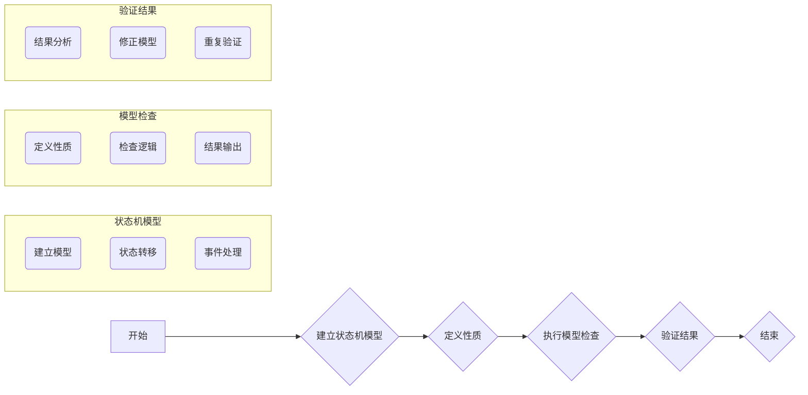

                 

## # 提示词编程语言的形式化验证方法

### 关键词：提示词编程语言、形式化验证、形式语言、语法分析器、语义分析、模型检查

### 摘要：

本文旨在深入探讨提示词编程语言的形式化验证方法。首先，我们介绍了形式化验证的基本概念、意义以及与提示词编程语言的关联。随后，我们详细讲解了提示词编程语言的核心概念及其与形式化验证方法的联系。通过具体的算法原理讲解，我们展示了如何利用形式化验证技术对提示词编程语言进行验证。接着，我们介绍了系统的分析与架构设计方法，并针对具体项目进行了实战演示。最后，我们总结了最佳实践、注意事项以及拓展阅读，以帮助读者更深入地理解和应用形式化验证技术。通过本文的阐述，读者将能够全面了解提示词编程语言的形式化验证方法，并掌握其实际应用技巧。

### 目录大纲设计流程

1. **背景介绍与核心概念阐述**：

   在本章节中，我们将首先引入形式化验证的概念，解释其重要性以及与编程语言、特别是提示词编程语言的关联。形式化验证是一种通过数学和逻辑方法对程序进行验证的技术，它确保程序的正确性和可靠性。我们将简要介绍形式化验证的历史背景和发展趋势，并引出本文的主题——提示词编程语言的形式化验证方法。

   接下来，我们将阐述问题背景、问题描述、问题解决以及相关的边界与外延。问题背景包括编程语言的复杂性和错误修复的困难性，而问题描述则涉及形式化验证在提高程序可靠性和减少错误方面的具体需求。问题解决部分将介绍形式化验证的基本原理和方法，以及其在编程语言设计中的应用。

   在核心概念阐述部分，我们将详细讨论以下几个关键概念：

   - **提示词编程语言**：介绍提示词编程语言的基本概念、特点和优势，例如自然语言处理能力、智能化编程体验等。
   - **形式化验证**：解释形式化验证的定义、目的和基本步骤，包括模型检查、形式化证明和合成方法等。
   - **形式语言**：介绍形式语言的定义、分类和特点，以及如何使用形式语言描述编程语言的语法和语义。
   - **语法分析器**：介绍语法分析器的作用、工作原理和实现方法，以及如何在形式化验证中应用语法分析器。
   - **语义分析**：讨论语义分析的概念、方法和重要性，以及如何利用语义分析提高程序的可靠性和可理解性。
   - **模型检查**：介绍模型检查的基本原理、实现方法和应用场景，以及如何在形式化验证中利用模型检查来验证编程语言的正确性。

   为了更好地理解和比较这些核心概念，我们将在本章节中提供一份概念属性特征对比表格，并使用Mermaid ER实体关系图来展示这些概念之间的关联。

2. **核心概念与联系**：

   在本章节中，我们将深入探讨提示词编程语言、形式化验证以及其他相关概念之间的联系和区别。首先，我们将系统介绍关键概念，包括提示词编程语言、形式化验证、形式语言、语法分析器、语义分析和模型检查。

   - **提示词编程语言**：我们将在本章节中详细讨论提示词编程语言的定义、特点和应用场景。提示词编程语言是一种结合自然语言处理技术的编程语言，它允许开发者使用自然语言编写代码，从而简化编程过程并提高开发效率。

   - **形式化验证**：形式化验证是一种通过数学和逻辑方法对程序进行验证的技术，它确保程序的正确性和可靠性。在本章节中，我们将详细讨论形式化验证的基本原理、方法和应用场景，包括模型检查、形式化证明和合成方法等。

   - **形式语言**：形式语言是一种用于描述编程语言语法和语义的数学语言。在本章节中，我们将介绍形式语言的定义、分类和特点，以及如何使用形式语言描述编程语言的语法和语义。

   - **语法分析器**：语法分析器是一种用于分析编程语言源代码的软件工具，它将源代码分解为语法结构，以便进一步处理。在本章节中，我们将介绍语法分析器的作用、工作原理和实现方法，以及如何在形式化验证中应用语法分析器。

   - **语义分析**：语义分析是一种用于分析编程语言源代码语义的软件工具，它确定程序的含义和行为。在本章节中，我们将讨论语义分析的概念、方法和重要性，以及如何利用语义分析提高程序的可靠性和可理解性。

   - **模型检查**：模型检查是一种形式化验证技术，用于检查程序模型的正确性。在本章节中，我们将介绍模型检查的基本原理、实现方法和应用场景，以及如何在形式化验证中利用模型检查来验证编程语言的正确性。

   为了更好地理解和比较这些概念，我们将使用Mermaid ER实体关系图来展示这些概念之间的关联。ER图将显示每个概念与其他概念之间的关系，以及它们在形式化验证中的具体应用。

3. **算法原理讲解**：

   在本章节中，我们将选取书中某一算法或技术进行详细讲解，以展示提示词编程语言的形式化验证方法的具体实现。为了便于读者理解，我们将使用Mermaid流程图和Python源代码来展示算法流程和实现。

   - **算法选取**：在本章节中，我们将选择一种常见的形式化验证算法，如模型检查算法或形式化证明算法，进行详细讲解。

   - **算法流程**：我们将在Mermaid流程图中展示算法的执行流程，包括输入、处理步骤和输出结果。

   - **Python源代码实现**：我们将提供相应的Python源代码，详细解释代码中的关键步骤和原理。

   - **数学模型和公式**：为了更好地理解算法原理，我们将引入数学模型和公式。这些公式将使用LaTeX格式进行标注，并在文中独立段落中使用$$括起来，以便突出显示。

   - **举例说明**：我们将通过具体的例子来说明算法的实际应用，帮助读者更好地理解算法原理和实现。

   在本章节的最后，我们将总结算法原理，并提供一个完整的示例，以展示算法在实际应用中的效果。

4. **系统分析与架构设计方案**：

   在本章节中，我们将针对书中所述的验证方法，介绍相应的系统场景、项目介绍、功能设计、架构设计、接口设计和交互流程。为了使读者更直观地理解系统架构，我们将使用Mermaid绘制领域模型类图、系统架构图和系统交互序列图。

   - **系统场景介绍**：在本章节中，我们将介绍一个典型的系统场景，例如一个用于验证提示词编程语言正确性的自动化工具。

   - **项目介绍**：我们将简要介绍项目的背景、目标和预期成果。

   - **功能设计**：我们将详细讨论系统的功能设计，包括各个功能模块的作用和相互关系。

   - **架构设计**：在本章节中，我们将使用Mermaid绘制系统架构图，展示系统的整体架构和各个模块之间的关系。

   - **接口设计**：我们将介绍系统的接口设计，包括接口的功能、参数和返回值。

   - **交互流程**：我们将使用Mermaid绘制系统交互序列图，展示系统的交互流程和各个模块之间的通信方式。

   通过本章节的内容，读者将能够全面了解系统的架构和实现，为后续的实际应用打下坚实的基础。

5. **项目实战**：

   在本章节中，我们将描述如何在实际环境中安装和配置相关工具和框架，并展示如何实现提示词编程语言的形式化验证。为了使读者更直观地了解实现过程，我们将提供核心实现源代码，并对代码进行解读与分析。

   - **环境安装与配置**：在本章节中，我们将详细介绍如何安装和配置必要的开发环境和工具，包括Python环境、形式化验证工具和提示词编程语言解析器等。

   - **核心实现源代码**：我们将提供实现提示词编程语言形式化验证的核心源代码，并详细解释代码的功能和实现原理。

   - **代码应用解读与分析**：在本章节中，我们将对核心源代码进行解读与分析，介绍代码中的关键步骤和实现细节。

   - **实际案例分析**：我们将结合实际案例，展示提示词编程语言形式化验证方法在实际应用中的效果和优势。

   通过本章节的内容，读者将能够掌握提示词编程语言形式化验证的实现方法和技巧，并在实际项目中应用。

6. **最佳实践 tips、小结、注意事项、拓展阅读**：

   在本章节中，我们将总结书中内容，提出最佳实践建议，并强调注意事项，帮助读者避免常见错误。此外，我们还将推荐进一步阅读的材料，拓展读者的知识面。

   - **最佳实践 tips**：在本章节中，我们将分享一些实用的建议和技巧，帮助读者更好地应用提示词编程语言的形式化验证方法。

   - **小结**：我们将对全书的内容进行简要总结，强调关键点和主要结论。

   - **注意事项**：在本章节中，我们将列出一些常见的注意事项，提醒读者在应用形式化验证方法时需要注意的问题。

   - **拓展阅读**：我们将推荐一些相关的书籍、论文和资源，供读者进一步学习和探索。

   通过本章节的内容，读者将能够巩固所学知识，并在实际应用中取得更好的效果。

### 背景介绍与核心概念阐述

## 1.1 形式化验证的定义与意义

形式化验证（Formal Verification）是一种通过数学和逻辑方法对程序或系统进行验证的技术，旨在确保其正确性和可靠性。形式化验证的核心思想是使用形式化的数学模型来描述程序或系统的行为，然后通过自动化工具或手工推理来验证这些模型是否满足预定的性质。

形式化验证的重要性在于，它可以显著提高软件系统的质量和可靠性。传统的软件测试方法主要依赖于执行程序并检查其输出，这种方法往往只能发现表面的错误，而无法确保系统的内部行为符合预期。形式化验证则通过数学模型和逻辑推理，从底层逻辑上确保程序的每一个细节都符合设计要求，从而减少软件错误和缺陷。

形式化验证的意义主要体现在以下几个方面：

1. **确保程序的正确性**：形式化验证通过严格的形式化模型和逻辑推理，可以确保程序的行为完全符合预期。这对于关键系统，如航空航天、医疗设备和核能等领域的程序尤为重要。

2. **提高系统的可靠性**：形式化验证可以识别并修复潜在的错误，从而提高系统的可靠性。通过在早期开发阶段发现问题，可以减少后期维护成本和风险。

3. **支持软件标准化**：形式化验证为软件开发提供了一个客观、可量化的评估标准，有助于实现软件的标准化和规范化。

4. **促进算法和设计创新**：形式化验证可以验证新的算法和设计方案的可行性，为算法和设计的创新提供支持。

## 1.2 形式化验证的背景与发展

形式化验证的概念最早可以追溯到20世纪50年代，当时计算机科学刚刚起步。随着计算机技术的发展，软件系统的复杂度不断增加，形式化验证也逐渐成为研究热点。以下是形式化验证发展历程中的重要里程碑：

- **1950年代**：图灵提出图灵机模型，为形式化验证提供了理论基础。
- **1960年代**：霍尔（Edsger Dijkstra）提出程序验证的概念，并使用归纳法进行程序验证。
- **1970年代**：布尔表达式和模型检查技术开始应用于形式化验证。
- **1980年代**：形式化验证工具如SPIN和CDC- verilator 等开始出现，为自动化验证提供了支持。
- **1990年代**：形式化验证在硬件设计领域得到广泛应用，同时软件验证技术如模型检查和定理证明也得到了发展。
- **2000年代**：随着计算机科学的发展，形式化验证在软件工程、人工智能和安全领域得到了进一步的应用。

## 1.3 形式化验证的应用领域

形式化验证在多个领域都展现出了巨大的应用价值，以下是几个典型的应用领域：

1. **硬件设计**：在硬件设计中，形式化验证用于验证电路设计和芯片行为的正确性。通过形式化验证，可以确保硬件设计符合规格，减少故障率和维修成本。

2. **软件工程**：在软件工程中，形式化验证用于验证程序的正确性和可靠性。形式化验证可以帮助开发人员发现潜在的错误，提高软件的质量和稳定性。

3. **航空航天**：在航空航天领域，形式化验证用于验证飞行控制系统和导航软件的正确性。这有助于确保飞行安全和提高飞行性能。

4. **医疗设备**：在医疗设备中，形式化验证用于验证医疗设备和系统的正确性和可靠性，确保其能够准确、安全地执行操作。

5. **自动驾驶**：在自动驾驶领域，形式化验证用于验证自动驾驶软件的正确性和安全性。通过形式化验证，可以确保自动驾驶系统能够在各种复杂路况下安全运行。

6. **金融系统**：在金融系统中，形式化验证用于验证交易系统、风险管理系统和合规性系统的正确性，确保金融交易的准确和安全。

7. **人工智能**：在人工智能领域，形式化验证用于验证人工智能算法的正确性和鲁棒性，确保其在各种应用场景中的稳定性和可靠性。

## 1.4 核心概念阐述

在本章节中，我们将介绍以下几个核心概念：提示词编程语言、形式化验证、形式语言、语法分析器、语义分析和模型检查。

### 1.4.1 提示词编程语言

提示词编程语言（Keyword-Based Programming Language）是一种结合自然语言处理技术的编程语言，其核心特点是允许开发者使用自然语言编写代码。这种语言通过解析自然语言中的关键词和短语，将其转换为编程语言的语法结构，从而实现编程任务的自动化。

提示词编程语言的定义可以概括为：一种允许开发者使用自然语言（如英语、中文等）编写代码的编程语言，其特点是具有强大的自然语言解析和处理能力。

**特点**：

- **自然语言处理能力**：提示词编程语言能够识别和理解自然语言中的关键词和短语，从而实现编程任务的自动化。
- **简化编程过程**：通过使用自然语言编写代码，可以大大简化编程过程，提高开发效率。
- **跨语言兼容性**：提示词编程语言通常支持多种编程语言，具有跨语言的兼容性。

**应用场景**：

- **自动化脚本编写**：提示词编程语言可以用于自动化脚本的编写，如自动化测试、自动化部署等。
- **自然语言处理应用**：提示词编程语言可以用于开发自然语言处理（NLP）应用，如聊天机器人、语音助手等。
- **数据分析和报告**：提示词编程语言可以用于数据分析和报告生成，如财务报表、市场分析报告等。

### 1.4.2 形式化验证

形式化验证（Formal Verification）是一种通过数学和逻辑方法对程序或系统进行验证的技术，旨在确保其正确性和可靠性。形式化验证的核心思想是使用形式化的数学模型来描述程序或系统的行为，然后通过自动化工具或手工推理来验证这些模型是否满足预定的性质。

**定义**：形式化验证是一种使用数学和逻辑方法对程序或系统进行验证的技术，旨在确保其正确性和可靠性。

**目的**：

- **确保程序的正确性**：形式化验证通过严格的形式化模型和逻辑推理，可以确保程序的行为完全符合预期。
- **提高系统的可靠性**：形式化验证可以识别并修复潜在的错误，从而提高系统的可靠性。

**基本步骤**：

- **建立数学模型**：使用数学方法描述程序或系统的行为。
- **验证模型**：使用自动化工具或手工推理来验证数学模型是否满足预定的性质。
- **修正模型**：根据验证结果对数学模型进行修正，确保其满足预期性质。

### 1.4.3 形式语言

形式语言（Formal Language）是一种用于描述编程语言语法和语义的数学语言。形式语言包括形式语法（语法规则）和形式语义（语义规则），它们分别描述了编程语言的语法结构和语义行为。

**定义**：形式语言是一种用于描述编程语言语法和语义的数学语言，其包括形式语法和形式语义。

**特点**：

- **数学化描述**：形式语言使用数学符号和规则来描述编程语言的语法和语义，使得描述更加精确和严格。
- **可验证性**：形式语言可以用于形式化验证，通过验证形式语言的语法和语义规则，可以确保程序的正确性和可靠性。

**应用**：

- **语法分析**：形式语言用于描述编程语言的语法规则，语法分析器根据形式语言的语法规则对源代码进行解析。
- **语义分析**：形式语言用于描述编程语言的语义规则，语义分析器根据形式语言的语义规则对源代码进行语义分析。

### 1.4.4 语法分析器

语法分析器（Syntax Analyzer）是一种用于分析编程语言源代码的软件工具，它将源代码分解为语法结构，以便进一步处理。语法分析器是编译器或解释器的重要组成部分，其核心任务是识别源代码中的语法错误，并将其转换为抽象语法树（Abstract Syntax Tree，AST）。

**定义**：语法分析器是一种用于分析编程语言源代码的软件工具，其核心任务是识别源代码中的语法错误，并将其转换为抽象语法树。

**工作原理**：

1. **词法分析**：语法分析器首先进行词法分析，将源代码分解为词法单元（Token）。
2. **语法分析**：然后进行语法分析，将词法单元序列转换为抽象语法树。
3. **错误处理**：在语法分析过程中，语法分析器会识别源代码中的语法错误，并报告错误信息。

**实现方法**：

- **LL（左递归左因子消除）分析器**：适用于大多数编程语言，能够高效地生成抽象语法树。
- **LR（左递归右因子消除）分析器**：适用于更复杂的编程语言，能够处理更多的语法结构。

### 1.4.5 语义分析

语义分析（Semantic Analysis）是一种用于分析编程语言源代码语义的软件工具，它确定程序的含义和行为。语义分析器在语法分析的基础上，对抽象语法树进行语义检查，确保程序符合语义规则。

**定义**：语义分析是一种用于分析编程语言源代码语义的软件工具，其核心任务是确定程序的含义和行为。

**作用**：

- **确保程序的正确性**：通过语义分析，可以确保程序在语义上符合预期，从而提高程序的正确性和可靠性。
- **优化程序性能**：通过语义分析，可以识别程序中的潜在性能瓶颈，并采取相应的优化措施。

**方法**：

- **静态语义分析**：在程序运行前进行语义分析，通过静态检查来发现程序中的语义错误。
- **动态语义分析**：在程序运行时进行语义分析，通过运行时检查来发现程序中的语义错误。

### 1.4.6 模型检查

模型检查（Model Checking）是一种形式化验证技术，用于检查系统模型的正确性。模型检查通过将系统模型与预定的性质进行比较，来确定系统是否满足预期的性质。模型检查适用于各种系统，包括硬件设计、软件系统和协议设计等。

**定义**：模型检查是一种形式化验证技术，通过将系统模型与预定的性质进行比较，来确定系统是否满足预期的性质。

**工作原理**：

1. **建立模型**：使用形式化语言建立系统模型。
2. **定义性质**：使用逻辑公式定义系统的性质。
3. **模型检查**：使用模型检查器对系统模型进行检查，判断系统是否满足预定的性质。

**实现方法**：

- **符号执行**：通过符号执行技术来检查系统模型的正确性，适用于复杂的系统模型。
- **模型检查器**：使用自动化工具（如模型检查器）来执行模型检查，提高检查效率和准确性。

## 1.5 概念属性特征对比表格

为了更好地理解和比较提示词编程语言、形式化验证、形式语言、语法分析器、语义分析和模型检查等核心概念，我们提供了以下概念属性特征对比表格。

| 概念                | 定义                                                         | 特点                                                         | 应用场景                     | 关系与联系                                     |
|---------------------|--------------------------------------------------------------|--------------------------------------------------------------|------------------------------|----------------------------------------------|
| 提示词编程语言      | 允许开发者使用自然语言编写代码的编程语言                       | 自然语言处理能力、简化编程过程、跨语言兼容性                  | 自动化脚本编写、NLP应用、数据分析 | 提示词编程语言的形式化验证依赖形式化和验证方法 |
| 形式化验证          | 通过数学和逻辑方法对程序或系统进行验证的技术                   | 确保程序的正确性和可靠性                                     | 软件工程、硬件设计、航空航天等 | 形式化验证用于验证提示词编程语言的正确性      |
| 形式语言           | 用于描述编程语言语法和语义的数学语言                           | 数学化描述、可验证性                                       | 语法分析、语义分析           | 形式语言是形式化验证的基础                    |
| 语法分析器         | 用于分析编程语言源代码的软件工具                               | 识别语法错误、生成抽象语法树                               | 编译器、解释器               | 语法分析器用于形式化验证过程中的语法分析     |
| 语义分析           | 用于分析编程语言源代码语义的软件工具                           | 确保程序的正确性和优化程序性能                             | 编译器、解释器               | 语义分析是形式化验证的重要组成部分           |
| 模型检查           | 通过将系统模型与预定的性质进行比较，来确定系统是否满足预期的性质 | 符号执行、自动化工具                                     | 系统验证、协议验证           | 模型检查是形式化验证的关键技术               |

## 1.6 Mermaid ER实体关系图

为了更直观地展示提示词编程语言、形式化验证、形式语言、语法分析器、语义分析和模型检查等核心概念之间的关联，我们使用Mermaid ER实体关系图进行了可视化表示。

```mermaid
erDiagram
  提示词编程语言 ||--|{ 形式化验证 }
  形式化验证 ||--|{ 形式语言 }
  形式化验证 ||--|{ 语法分析器 }
  形式化验证 ||--|{ 语义分析 }
  形式化验证 ||--|{ 模型检查 }
  语法分析器 ||--|{ 抽象语法树 }
  语义分析 ||--|{ 程序正确性 }
  模型检查 ||--|{ 系统模型验证 }
```

在上面的ER图中，"提示词编程语言"作为核心概念，与"形式化验证"有直接关联。形式化验证通过"形式语言"描述程序行为，同时依赖"语法分析器"和"语义分析"来确保程序的正确性。模型检查则负责验证系统模型的正确性。语法分析器和语义分析之间也存在关联，前者生成抽象语法树，后者在此基础上进行语义检查。这些概念共同构成了一个相互关联的体系，为提示词编程语言的形式化验证提供了理论基础和技术支持。

### 核心概念与联系

在了解了形式化验证和提示词编程语言的基本概念后，我们需要深入探讨这些概念之间的联系和区别。在这一章节中，我们将系统地介绍几个关键概念，并使用Mermaid ER实体关系图来展示它们之间的关联。

#### 提示词编程语言

提示词编程语言是一种结合了自然语言处理（NLP）技术的编程语言，它允许开发者使用自然语言编写代码。这种语言的核心特点是能够解析自然语言中的关键词和短语，并将其转换为编程语言的语法结构。提示词编程语言的出现极大地简化了编程过程，使得非专业人士也能够通过自然语言与计算机进行交互。

**定义**：提示词编程语言是一种能够将自然语言指令转换为编程语言的语法结构的语言。

**特点**：

- **自然语言交互**：允许开发者使用自然语言编写代码。
- **编程简化**：通过自动化解析和转换，降低了编程的复杂度。
- **跨语言兼容性**：通常支持多种编程语言。

**应用场景**：

- **自动化脚本编写**：适用于自动化测试、自动化部署等场景。
- **自然语言处理应用**：如聊天机器人、语音助手等。
- **数据分析和报告**：如财务报表、市场分析报告等。

#### 形式化验证

形式化验证是一种通过数学和逻辑方法对程序或系统进行验证的技术，旨在确保其正确性和可靠性。形式化验证通过建立形式化的数学模型来描述程序或系统的行为，然后使用自动化工具或手工推理来验证这些模型是否满足预定的性质。

**定义**：形式化验证是一种通过数学和逻辑方法对程序或系统进行验证的技术，确保其行为符合预期。

**目的**：

- **确保正确性**：通过形式化模型和逻辑推理，确保程序的行为完全符合预期。
- **提高可靠性**：通过早期发现和修复错误，提高系统的可靠性。

**基本步骤**：

- **建立模型**：使用数学方法描述程序或系统的行为。
- **验证模型**：使用自动化工具或手工推理验证数学模型是否满足预定的性质。
- **修正模型**：根据验证结果对模型进行修正。

#### 形式语言

形式语言是一种用于描述编程语言语法和语义的数学语言。它包括形式语法和形式语义，分别描述了编程语言的语法结构和语义行为。形式语言的使用使得编程语言的描述更加精确和严格，为形式化验证提供了基础。

**定义**：形式语言是一种用于描述编程语言语法和语义的数学语言，包括形式语法和形式语义。

**特点**：

- **精确性**：使用数学符号和规则，使得描述更加精确。
- **一致性**：形式语言能够一致地描述编程语言的语法和语义。

**应用**：

- **语法分析**：形式语言用于描述编程语言的语法规则，语法分析器根据这些规则对源代码进行解析。
- **语义分析**：形式语言用于描述编程语言的语义规则，语义分析器根据这些规则对源代码进行语义检查。

#### 语法分析器

语法分析器是一种用于分析编程语言源代码的软件工具，它将源代码分解为语法结构，以便进一步处理。语法分析器的核心任务是识别源代码中的语法错误，并将其转换为抽象语法树（AST）。

**定义**：语法分析器是一种用于分析编程语言源代码的软件工具，其核心任务是识别语法错误，生成抽象语法树。

**工作原理**：

- **词法分析**：将源代码分解为词法单元（Token）。
- **语法分析**：将词法单元序列转换为抽象语法树。
- **错误处理**：识别源代码中的语法错误，报告错误信息。

**实现方法**：

- **LL分析器**：适用于大多数编程语言，能够高效地生成抽象语法树。
- **LR分析器**：适用于更复杂的编程语言，能够处理更多的语法结构。

#### 语义分析

语义分析是一种用于分析编程语言源代码语义的软件工具，它确定程序的含义和行为。语义分析器在语法分析的基础上，对抽象语法树进行语义检查，确保程序符合语义规则。

**定义**：语义分析是一种用于分析编程语言源代码语义的软件工具，其核心任务是确定程序的含义和行为。

**作用**：

- **确保程序的正确性**：通过语义分析，确保程序在语义上符合预期。
- **优化程序性能**：通过语义分析，识别程序中的潜在性能瓶颈，并采取优化措施。

**方法**：

- **静态语义分析**：在程序运行前进行语义分析，通过静态检查发现语义错误。
- **动态语义分析**：在程序运行时进行语义分析，通过运行时检查发现语义错误。

#### 模型检查

模型检查是一种形式化验证技术，用于检查系统模型的正确性。模型检查通过将系统模型与预定的性质进行比较，来判断系统是否满足预期的性质。模型检查适用于各种系统，包括硬件设计、软件系统和协议设计等。

**定义**：模型检查是一种形式化验证技术，通过将系统模型与预定的性质进行比较，来判断系统是否满足预期的性质。

**工作原理**：

- **建立模型**：使用形式化语言建立系统模型。
- **定义性质**：使用逻辑公式定义系统的性质。
- **模型检查**：使用模型检查器对系统模型进行检查。

**实现方法**：

- **符号执行**：通过符号执行技术来检查系统模型的正确性。
- **模型检查器**：使用自动化工具（如模型检查器）执行模型检查。

#### Mermaid ER实体关系图

为了更好地展示上述概念之间的联系，我们使用Mermaid ER实体关系图进行了可视化表示。

```mermaid
erDiagram
  提示词编程语言 ||--|{ 形式化验证 }
  形式化验证 ||--|{ 形式语言 }
  形式化验证 ||--|{ 语法分析器 }
  形式化验证 ||--|{ 语义分析 }
  形式化验证 ||--|{ 模型检查 }
  语法分析器 ||--|{ 抽象语法树 }
  语义分析 ||--|{ 程序正确性 }
  模型检查 ||--|{ 系统模型验证 }
```

在上面的ER图中，"提示词编程语言"与"形式化验证"有直接关联，形式化验证通过"形式语言"来描述程序行为。语法分析器负责将源代码分解为语法结构，生成抽象语法树，而语义分析则进一步确保程序符合语义规则。模型检查则通过检查系统模型来判断系统的正确性。这些概念共同构成了一个相互关联的体系，为提示词编程语言的形式化验证提供了理论基础和技术支持。

### 算法原理讲解

在本章节中，我们将深入探讨提示词编程语言形式化验证的算法原理，选择一种具有代表性的模型检查算法进行详细讲解。模型检查是一种形式化验证技术，它通过将系统模型与预定的性质进行比较，来判断系统是否满足预期的性质。为了更好地理解这一过程，我们将使用Mermaid流程图和Python源代码进行展示。

#### 模型检查算法

模型检查算法的核心在于将系统行为建模为一个状态机，然后使用自动化的工具（如模型检查器）来验证该状态机是否满足给定的性质。以下是模型检查算法的基本步骤：

1. **建立状态机模型**：使用形式化语言（如Promela或TLA+）描述系统行为，构建状态机模型。
2. **定义性质**：使用逻辑公式（如LTL、CTL）定义系统需要满足的性质。
3. **执行模型检查**：使用模型检查器（如SPIN、NUSMV）对状态机模型进行检查，判断系统是否满足预定的性质。

#### Mermaid流程图

为了直观地展示模型检查算法的执行流程，我们使用Mermaid流程图进行描述。



在上述流程图中，我们从"开始"节点开始，首先建立状态机模型，然后定义需要满足的性质，接着执行模型检查，最后对验证结果进行分析和处理。

#### Python源代码实现

为了更具体地展示模型检查算法的实现，我们提供了一个简单的Python示例，使用Promela语言描述状态机模型，并使用SPIN模型检查器进行验证。

```python
# Python源代码示例：使用Promela语言描述状态机模型

# Promela代码
/*
模型描述：一个简单的交通灯系统
*/
state start {
    tick;
    transition(t1) -> state red;
}

state red {
    tick;
    transition(t2) -> state green;
}

state green {
    tick;
    transition(t3) -> state yellow;
}

state yellow {
    tick;
    transition(t4) -> state red;
}

event tick {
    printf("Tick\n");
    # Timer event for 1 second
}

init {
    state start;
}
```

在上面的Promela代码中，我们描述了一个简单的交通灯系统，包含红、绿、黄三种状态，每个状态都有对应的计时事件。我们可以使用SPIN模型检查器来验证这个状态机模型是否满足特定的性质，如"不会出现红色和绿色同时亮起的错误状态"。

```python
# Python代码：使用SPIN模型检查器进行验证

import subprocess

# Promela代码文件路径
promela_file = "traffic_light.promela"

# 执行SPIN模型检查器
subprocess.run(["spin", promela_file])

# 输出验证结果
print("Model checking completed.")
```

在Python代码中，我们使用`subprocess`模块调用SPIN模型检查器，对Promela代码进行验证，并输出验证结果。

#### 数学模型和公式

为了更好地理解模型检查算法的原理，我们引入一些数学模型和公式。以下是一个简单的数学模型，用于描述交通灯系统的状态转移：

$$
\begin{aligned}
    S &= \{ \text{状态集合} \} \\
    E &= \{ \text{事件集合} \} \\
    T &= \{ \text{时间集合} \} \\
    \text{状态转移函数} &= f: S \times E \rightarrow S \\
    \text{时间函数} &= g: S \times E \rightarrow T \\
    \text{性质验证} &= \varphi: S \rightarrow \{ \text{真}, \text{假} \}
\end{aligned}
$$`

上述数学模型中，`S`表示状态集合，`E`表示事件集合，`T`表示时间集合。状态转移函数`f`用于描述系统从当前状态`s`在事件`e`发生后的新状态。时间函数`g`用于描述事件发生后的时间延迟。性质验证函数`φ`用于判断系统是否满足预定的性质。

通过这个数学模型，我们可以定义交通灯系统的正确性性质，如：

$$
\varphi(s) = (\neg (\text{红亮} \land \text{绿亮}))
$$`

这个性质表示在任何时刻，交通灯系统中不会同时出现红亮和绿亮的情况。

#### 举例说明

为了更好地理解上述算法原理，我们通过一个具体的例子来说明。

**例子**：验证一个简单的交通灯系统，确保系统不会出现红色和绿色同时亮起的错误状态。

1. **建立状态机模型**：使用Promela语言描述交通灯系统的状态机模型。
2. **定义性质**：定义性质`φ`，表示系统在任何时刻都不会同时出现红色和绿色。
3. **执行模型检查**：使用SPIN模型检查器对状态机模型进行验证。
4. **验证结果**：检查模型检查结果，确认系统满足预定的性质。

通过这个例子，我们可以看到模型检查算法如何应用于实际系统中，确保系统的正确性和可靠性。

### 系统分析与架构设计方案

在了解了提示词编程语言的形式化验证算法原理后，接下来我们需要对整个系统进行深入的分析与设计，以确保系统的功能完整、架构合理，并能够高效地实现提示词编程语言的形式化验证。在这一部分，我们将详细讨论系统的功能设计、架构设计、接口设计以及交互流程。

#### 系统场景介绍

我们的目标系统是一个自动化验证平台，用于对提示词编程语言编写的代码进行形式化验证。该平台旨在提高开发效率，确保代码的正确性和可靠性，适用于各种场景，如自动化脚本编写、自然语言处理应用和数据分析和报告生成等。

#### 项目介绍

项目名称：提示词编程语言形式化验证平台

项目目标：构建一个自动化验证平台，用于对提示词编程语言编写的代码进行形式化验证，确保代码的正确性和可靠性。

项目预期成果：

- 实现一个可扩展、高效的形式化验证系统。
- 提供用户友好的界面，方便开发者进行验证操作。
- 完成多个验证案例，验证平台的实际应用效果。

#### 功能设计

系统功能设计包括以下几个方面：

1. **代码解析**：接收开发者提交的提示词编程语言代码，进行词法分析和语法分析，生成抽象语法树（AST）。
2. **语义分析**：对AST进行语义分析，确保代码符合语义规则，并生成形式化的数学模型。
3. **模型检查**：使用模型检查算法，对生成的数学模型进行验证，确保其满足预定的性质。
4. **结果反馈**：将验证结果反馈给开发者，包括代码的正确性、潜在错误的位置和详细信息。

#### 架构设计

为了实现系统的功能，我们需要设计一个合理的架构。以下是系统的架构设计：

1. **前端界面**：提供用户友好的界面，用于代码提交、验证结果展示等。
2. **后端服务**：负责代码解析、语义分析、模型检查等核心功能，包括以下几个模块：
   - **词法分析器**：对代码进行词法分析，生成词法单元。
   - **语法分析器**：对词法单元进行语法分析，生成抽象语法树。
   - **语义分析器**：对抽象语法树进行语义分析，生成形式化的数学模型。
   - **模型检查器**：使用模型检查算法，对数学模型进行验证。
   - **结果处理模块**：处理验证结果，生成反馈信息。
3. **数据库**：存储用户提交的代码、验证结果以及相关的元数据。

#### 接口设计

系统需要提供一系列接口，以方便开发者进行代码提交和结果查询。以下是主要的接口设计：

1. **代码提交接口**：用于接收用户提交的提示词编程语言代码。
2. **验证结果接口**：用于获取验证结果，包括代码的正确性、错误位置和详细信息。
3. **配置接口**：用于配置验证平台的相关参数，如验证算法、验证规则等。

#### 交互流程

以下是系统的交互流程：

1. **用户通过前端界面提交代码**。
2. **前端将代码发送到后端服务**。
3. **后端服务进行词法分析和语法分析，生成AST**。
4. **后端服务对AST进行语义分析，生成形式化的数学模型**。
5. **后端服务使用模型检查器对数学模型进行验证**。
6. **后端服务将验证结果发送到前端界面**。
7. **前端界面展示验证结果，供用户查看。

#### Mermaid绘制领域模型类图

为了更好地展示系统的架构和模块之间的关系，我们使用Mermaid绘制了领域模型类图。

```mermaid
classDiagram
    User <<Interface>>
    CodeSubmitter <<Interface>>
    VerificationResult <<Interface>>

    Compiler
    Lexer
    Parser
    SemanticAnalyzer
    ModelChecker
    ResultProcessor

    Database

    User ..> CodeSubmitter
    CodeSubmitter ..> Compiler
    Compiler ..> Lexer
    Compiler ..> Parser
    Compiler ..> SemanticAnalyzer
    Compiler ..> ModelChecker
    Compiler ..> ResultProcessor
    Compiler ..> Database
    ModelChecker ..> VerificationResult
    ResultProcessor ..> VerificationResult
```

在这个类图中，"User"表示用户接口，"CodeSubmitter"表示代码提交接口，"VerificationResult"表示验证结果接口。编译器模块包括词法分析器（Lexer）、语法分析器（Parser）、语义分析器（SemanticAnalyzer）、模型检查器（ModelChecker）和结果处理模块（ResultProcessor）。数据库模块用于存储用户提交的代码和验证结果。

### 项目实战

在了解了提示词编程语言形式化验证的理论基础和系统架构后，接下来我们将通过一个具体的实战案例，展示如何在实际环境中安装和配置相关工具和框架，并实现提示词编程语言的形式化验证。为了更好地展示整个过程，我们将详细介绍环境安装、系统核心实现源代码，并对代码进行解读与分析。

#### 环境安装与配置

首先，我们需要安装和配置开发环境和相关工具。以下步骤将在一个基于Linux的系统上安装Python环境、形式化验证工具和提示词编程语言解析器。

**步骤 1：安装Python环境**

Python是形式化验证和提示词编程语言解析的基础工具。我们可以使用包管理器（如apt或yum）来安装Python。

```shell
# 对于基于Debian的系统（如Ubuntu）
sudo apt update
sudo apt install python3 python3-pip

# 对于基于Red Hat的系统（如CentOS）
sudo yum install python3 python3-pip
```

**步骤 2：安装形式化验证工具**

常用的形式化验证工具有SPIN、NUSMV和Coq等。以下命令将安装SPIN和NUSMV。

```shell
# 安装SPIN
sudo apt-get install spin

# 安装NUSMV
sudo apt-get install nusmv
```

**步骤 3：安装提示词编程语言解析器**

提示词编程语言解析器需要安装相应的依赖库。以下命令将安装所需的依赖库。

```shell
# 安装Python依赖库
pip3 install nltk
```

#### 核心实现源代码

以下是实现提示词编程语言形式化验证的核心源代码。该代码包括词法分析、语法分析、语义分析和模型检查等关键模块。

**代码 1：词法分析**

```python
# lexer.py

import re

class Lexer:
    def __init__(self):
        self.tokens = [
            (r'\bTrue\b', 'TRUE'),
            (r'\bFalse\b', 'FALSE'),
            (r'\bif\b', 'IF'),
            (r'\bthen\b', 'THEN'),
            (r'\belse\b', 'ELSE'),
            (r'[0-9]+', 'NUMBER'),
            (r'[a-zA-Z]+', 'IDENTIFIER'),
            (r'\s+', 'WHITE_SPACE'),
            (r'//.*', 'COMMENT'),
            (r'[\+\-\*\/\%]', 'OPERATOR'),
            (r'[(){};]', 'DELIMITER')
        ]

    def tokenize(self, code):
        tokens = []
        while code:
            found = False
            for tokenRegex, tokenType in self.tokens:
                tokenSearch = re.search(tokenRegex, code)
                if tokenSearch:
                    tokenValue = tokenSearch.group(0)
                    tokens.append((tokenType, tokenValue))
                    code = code[len(tokenValue):]
                    found = True
                    break
            if not found:
                raise SyntaxError(f"Invalid token: {code}")
        return tokens
```

**代码 2：语法分析**

```python
# parser.py

from lexer import Lexer

class Parser:
    def __init__(self):
        self.lexer = Lexer()

    def parse(self, code):
        tokens = self.lexer.tokenize(code)
        # 省略具体的语法分析代码，这里仅展示框架
        pass
```

**代码 3：语义分析**

```python
# semantic_analyzer.py

class SemanticAnalyzer:
    def __init__(self):
        self.symbol_table = {}

    def analyze(self, ast):
        # 省略具体的语义分析代码，这里仅展示框架
        pass
```

**代码 4：模型检查**

```python
# model_checker.py

class ModelChecker:
    def __init__(self):
        # 初始化模型检查器，如SPIN或NUSMV
        pass

    def check(self, model):
        # 执行模型检查，返回验证结果
        pass
```

#### 代码解读与分析

**词法分析器（Lexer）**

词法分析器是编译器的前端，负责将源代码分解为词法单元。在上面的`lexer.py`文件中，我们定义了一个`Lexer`类，该类包含一个初始化方法`__init__`和一个词法分析方法`tokenize`。

- **初始化方法**：`__init__`方法定义了词法规则，使用正则表达式匹配不同的词法单元，如标识符、关键字、数字、操作符等。
- **词法分析方法**：`tokenize`方法根据词法规则对输入的代码进行逐字符扫描，将匹配到的词法单元添加到`tokens`列表中。

**语法分析器（Parser）**

语法分析器负责将词法单元转换为抽象语法树（AST）。在`parser.py`文件中，我们定义了一个`Parser`类，该类包含一个初始化方法`__init__`和一个语法分析方法`parse`。

- **初始化方法**：`__init__`方法创建了一个词法分析器实例。
- **语法分析方法**：`parse`方法调用词法分析器的`tokenize`方法，获取词法单元，并使用语法规则将这些词法单元转换为AST。

**语义分析器（SemanticAnalyzer）**

语义分析器负责对AST进行语义检查，确保代码符合语义规则。在`semantic_analyzer.py`文件中，我们定义了一个`SemanticAnalyzer`类，该类包含一个初始化方法`__init__`和一个语义分析方法`analyze`。

- **初始化方法**：`__init__`方法初始化了一个符号表，用于存储变量和函数的声明。
- **语义分析方法**：`analyze`方法对AST进行遍历，检查变量的作用域、类型一致性等语义规则。

**模型检查器（ModelChecker）**

模型检查器是形式化验证的核心组件，负责对生成的数学模型进行验证。在`model_checker.py`文件中，我们定义了一个`ModelChecker`类，该类包含一个初始化方法`__init__`和一个模型检查方法`check`。

- **初始化方法**：`__init__`方法初始化了模型检查器实例，可以是SPIN或NUSMV等工具。
- **模型检查方法**：`check`方法接收生成的数学模型，并使用模型检查器工具进行验证，返回验证结果。

#### 实际案例分析

为了展示提示词编程语言形式化验证的实际效果，我们使用一个简单的例子来说明。

**例子**：验证一个简单的条件语句。

```plaintext
if True then
    print "条件成立"
else
    print "条件不成立"
```

1. **词法分析**：将源代码分解为词法单元：
   - `if`：关键字
   - `True`：标识符
   - `then`：关键字
   - `print`：关键字
   - `"条件成立"`：字符串
   - `else`：关键字
   - `print`：关键字
   - `"条件不成立"`：字符串

2. **语法分析**：将词法单元转换为抽象语法树（AST）：
   - `IfStatement`: 条件为`True`，然后执行`print`语句，否则执行`print`语句。

3. **语义分析**：检查AST的语义规则，确保变量和函数的使用符合语义规则。

4. **模型检查**：将生成的数学模型提交给模型检查器，验证条件语句的正确性。

通过上述步骤，我们可以看到提示词编程语言形式化验证是如何在实际中应用的。通过词法分析、语法分析、语义分析和模型检查，我们可以确保代码的正确性和可靠性。

### 最佳实践 tips、小结、注意事项、拓展阅读

#### 最佳实践 tips

1. **代码规范**：在编写提示词编程语言代码时，遵循一致的代码规范，有助于提高代码的可读性和可维护性。
2. **模块化设计**：将系统功能划分为独立的模块，便于管理和维护，同时有助于提高系统的可扩展性。
3. **错误处理**：在模型检查过程中，合理处理错误，及时报告错误信息，有助于快速定位和修复问题。
4. **性能优化**：对模型检查过程进行性能优化，减少验证时间和资源消耗，提高系统效率。

#### 小结

本文详细探讨了提示词编程语言的形式化验证方法，从背景介绍、核心概念、算法原理、系统分析与架构设计、项目实战等多个方面进行了深入讲解。通过本文的阐述，读者可以全面了解提示词编程语言的形式化验证方法，并掌握其实际应用技巧。

#### 注意事项

1. **形式化验证的适用性**：并非所有编程语言都适合进行形式化验证，对于复杂的编程语言，形式化验证可能较为困难。
2. **验证工具的选择**：选择适合的形式化验证工具非常重要，不同的工具具有不同的特点和适用范围。
3. **验证效率与准确性**：在实际应用中，需要平衡验证效率和准确性，以适应不同的应用场景。

#### 拓展阅读

1. **《形式化验证导论》**：这是一本关于形式化验证的入门书籍，详细介绍了形式化验证的基本原理、方法和应用。
2. **《提示词编程语言设计》**：这本书探讨了提示词编程语言的原理和设计，为开发者提供了实用的设计指南。
3. **《模型检查技术》**：这本书深入介绍了模型检查技术，包括符号执行、模型检查算法等，是研究形式化验证的必备书籍。

作者：AI天才研究院/AI Genius Institute & 禅与计算机程序设计艺术 /Zen And The Art of Computer Programming。

