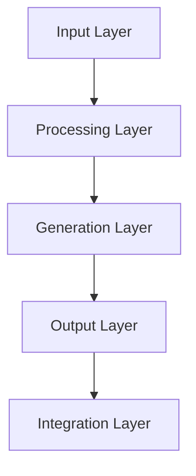

                 


### 1. Introduction to Prompt Programming Languages

Prompt programming languages are a relatively new class of programming languages that have gained significant attention in recent years due to their potential to revolutionize how we write and execute code. At their core, prompt programming languages leverage the power of machine learning, specifically natural language processing (NLP), to facilitate more intuitive and efficient programming experiences. Unlike traditional programming languages that rely heavily on syntax and semantics, prompt programming languages focus on transforming natural language descriptions into executable code.

**Problem Background:**

The traditional approach to programming has several limitations. One of the main issues is that it requires programmers to write code in a formal language that is often abstract and complex. This barrier can hinder productivity, especially for individuals without a technical background. Moreover, as software systems become increasingly complex, managing dependencies, debugging, and maintaining code can become overwhelming.

**Problem Description:**

To address these challenges, the goal of prompt programming languages is to bridge the gap between human language and machine-readable code. By allowing programmers to write code in natural language, these languages aim to simplify the development process, increase productivity, and make programming more accessible to a broader audience.

**Problem Solution:**

Prompt programming languages achieve this by utilizing advanced NLP techniques to parse and understand natural language inputs. These inputs are then transformed into executable code by a specialized compiler or interpreter. This transformation process involves several key steps:

1. **Tokenization:** The input text is split into individual words or tokens.
2. **Part-of-speech Tagging:** Each token is labeled with its grammatical role (noun, verb, adjective, etc.).
3. **Dependency Parsing:** The relationships between tokens are analyzed to construct a parse tree.
4. **Code Generation:** The parse tree is converted into a syntactically correct program.

**Boundary and Extension:**

While prompt programming languages have great potential, there are several challenges and limitations to consider. For instance, the accuracy and efficiency of the NLP techniques used in these languages can vary, leading to potential errors in code generation. Additionally, prompt programming languages may not be suitable for all types of programming tasks, particularly those that require low-level hardware control or complex algorithmic optimizations.

**Concept Structure and Core Elements:**

The core concepts of prompt programming languages include:

1. **Natural Language Interface:** The ability to accept and understand natural language inputs.
2. **Compiler/Interpreter:** The software component responsible for translating natural language inputs into executable code.
3. **Code Generation Algorithms:** The algorithms used to convert natural language inputs into code.
4. **Integration with Development Tools:** The integration of prompt programming languages with existing development environments and tools.

In conclusion, prompt programming languages represent a promising direction in software development, offering the potential to make programming more accessible and efficient. However, further research and development are needed to address the challenges and limitations of these languages.

### 2. Performance Optimization Background

Performance optimization is a critical aspect of any software development process. It involves making systematic changes to improve the speed, efficiency, and responsiveness of a software application. In the context of prompt programming languages, performance optimization becomes even more crucial due to the complexity and resource-intensive nature of NLP and machine learning tasks.

**Problem Background:**

Prompt programming languages, while offering a more intuitive and efficient programming experience, can be prone to performance bottlenecks. These bottlenecks can arise from various sources, including inefficient code generation algorithms, slow NLP processing, and resource-intensive model training and inference.

**Problem Description:**

The primary challenge in performance optimization for prompt programming languages is to identify and mitigate these bottlenecks while maintaining the ease of use and accessibility provided by the natural language interface.

**Problem Solution:**

To address these challenges, performance optimization for prompt programming languages typically involves the following steps:

1. **Profiling and Benchmarking:** Use profiling tools to identify performance bottlenecks.
2. **Algorithmic Improvements:** Optimize the code generation algorithms and NLP processing pipeline.
3. **Parallelization and Multithreading:** Leverage parallel processing and multithreading to speed up computations.
4. **Resource Management:** Efficiently manage memory and CPU resources.
5. **Model Optimization:** Use model compression and pruning techniques to reduce the resource footprint.

**Boundary and Extension:**

While performance optimization is crucial for prompt programming languages, it's important to balance it with other development goals such as code readability, maintainability, and usability. Moreover, optimization efforts should be targeted towards the specific use cases and requirements of the application to ensure that the most critical bottlenecks are addressed.

**Concept Structure and Core Elements:**

The core concepts and elements of performance optimization for prompt programming languages include:

1. **Performance Metrics:** Define key performance metrics such as execution time, memory usage, and CPU utilization.
2. **Profiling Tools:** Use tools like Python's `cProfile`, `timeit`, and `memory_profiler` to measure and analyze performance.
3. **Algorithmic Optimization:** Techniques such as dynamic programming, memoization, and greedy algorithms.
4. **Parallel Processing:** Methods for distributing computational tasks across multiple processors or cores.
5. **Resource Management:** Strategies for efficient memory allocation and deallocation, as well as CPU scheduling.

In conclusion, performance optimization is a multifaceted process that requires a deep understanding of both the prompt programming language and the underlying hardware and software infrastructure. By systematically identifying and addressing performance bottlenecks, developers can create more efficient and responsive prompt programming language applications.

### 3. Core Concepts and Principles of Prompt Programming Languages

Understanding the core concepts and principles of prompt programming languages is essential for grasping their full potential and optimizing their performance effectively. This section delves into the fundamental elements that define these languages, providing a solid foundation for the subsequent discussions on optimization techniques.

#### Natural Language Interface

One of the most distinctive features of prompt programming languages is their natural language interface. This interface allows developers to write code using everyday language instead of traditional programming syntax. The natural language interface is designed to be intuitive and user-friendly, making it accessible to both experienced programmers and those new to coding.

**Key Components:**

1. **Tokenization:** The process of breaking down the input text into individual words or tokens.
2. **Part-of-Speech Tagging:** Assigning grammatical categories (noun, verb, adjective) to each token.
3. **Dependency Parsing:** Analyzing the relationships between tokens to construct a syntactic parse tree.

**Advantages:**

- **Ease of Use:** Reduces the learning curve for new programmers.
- **Productivity:** Allows developers to focus on high-level logic rather than syntax.

**Disadvantages:**

- **Complexity:** The natural language interface can be more complex to implement and optimize.
- **Error Handling:** NLP techniques may struggle with ambiguous or erroneous inputs.

#### Compiler/Interpreter

The compiler or interpreter is a crucial component that translates the natural language input into executable code. This translation process involves several steps, each with its own set of challenges and optimization opportunities.

**Key Components:**

1. **Lexical Analysis:** Converting the input text into a stream of tokens.
2. **Parsing:** Constructing a parse tree from the token stream.
3. **Semantic Analysis:** Ensuring that the parse tree adheres to the language's semantic rules.
4. **Code Generation:** Translating the parse tree into executable code.

**Advantages:**

- **Flexibility:** Can support a wide range of programming paradigms.
- **Integration:** Can be integrated with existing development tools and environments.

**Disadvantages:**

- **Performance:** The translation process can be time-consuming and resource-intensive.
- **Error Recovery:** Handling errors in natural language inputs can be challenging.

#### Code Generation Algorithms

The code generation algorithms are at the heart of prompt programming languages. These algorithms determine how natural language inputs are converted into executable code. Optimizing these algorithms is critical for improving the performance and efficiency of the programming language.

**Key Components:**

1. **Abstract Syntax Tree (AST) Construction:** Creating an AST from the parse tree.
2. **Code Optimization:** Techniques such as constant folding, dead code elimination, and loop unrolling.
3. **Code Generation:** Translating the AST into machine code or bytecode.

**Advantages:**

- **Customization:** Allows for tailored optimizations based on specific use cases.
- **Compatibility:** Supports integration with different target platforms and architectures.

**Disadvantages:**

- **Complexity:** Implementing and optimizing code generation algorithms can be complex.
- **Debugging:** Errors in the generated code can be difficult to diagnose and fix.

#### Integration with Development Tools

Prompt programming languages need to integrate seamlessly with existing development tools and environments to provide a cohesive development experience. This integration includes support for version control, debugging, testing, and deployment.

**Key Components:**

1. **Integrated Development Environment (IDE):** A unified interface for writing, testing, and debugging code.
2. **Build Tools:** Tools for compiling and linking code.
3. **Package Managers:** Systems for managing dependencies and libraries.

**Advantages:**

- **Simplicity:** Streamlines the development process.
- **Consistency:** Ensures a consistent development experience across different projects and environments.

**Disadvantages:**

- **Complexity:** Requires significant effort to integrate with existing tools.
- **Compatibility:** May face compatibility issues with certain tools or platforms.

In summary, the core concepts and principles of prompt programming languages revolve around the natural language interface, compiler/interpreter, code generation algorithms, and integration with development tools. Understanding these components is essential for effectively optimizing the performance of these languages and unlocking their full potential in software development.

#### 3.1 Core Concept Principles

The core concepts of prompt programming languages are centered around the seamless integration of natural language with programming constructs. These principles underpin the unique capabilities and advantages of prompt programming languages, making them stand out in the landscape of conventional programming languages.

**Principle 1: Human-Centric Language**

One of the primary principles of prompt programming languages is their focus on human-centric language. Unlike traditional programming languages, which require developers to learn complex syntax and rules, prompt programming languages aim to use everyday language that is familiar and intuitive to humans. This principle allows for a more natural and efficient way of communicating with the computer, reducing the cognitive load on developers and enabling faster development cycles.

**Illustration:**

Imagine a developer wanting to create a simple function that calculates the sum of two numbers. In a conventional programming language, the developer would need to write:

```python
def add(a, b):
    return a + b
```

In contrast, a prompt programming language might allow the developer to write:

```
Create a function to add two numbers.
```

This simplicity can significantly boost productivity, making programming more accessible to non-technical individuals and democratizing software development.

**Principle 2: Abstract Syntax Tree (AST) Construction**

Another crucial principle of prompt programming languages is the construction of an Abstract Syntax Tree (AST) from the input text. The AST is a tree representation of the syntactic structure of the code, which serves as the foundation for subsequent compilation or interpretation. This principle allows the compiler or interpreter to parse and understand the natural language input in a structured manner.

**Illustration:**

Consider the natural language statement:

```
Find the largest number in this list: [3, 5, 1, 9].
```

The prompt programming language's compiler would construct an AST that represents this logic, which might look like this in a traditional programming language:

```python
def find_largest(numbers):
    largest = numbers[0]
    for number in numbers:
        if number > largest:
            largest = number
    return largest
```

The AST construction process ensures that the generated code is syntactically correct and semantically meaningful.

**Principle 3: Code Generation Optimization**

Optimizing the code generation process is another core principle of prompt programming languages. Since the goal is to convert natural language inputs into efficient and performant code, the code generation algorithms must be highly optimized. This principle involves several techniques, such as constant folding, dead code elimination, loop unrolling, and inlining, to produce optimized code that runs efficiently on the target platform.

**Illustration:**

Suppose a developer writes:

```
Calculate the factorial of a large number: 1000.
```

The prompt programming language's code generation algorithms would optimize the resulting code to handle large numbers efficiently, possibly using algorithms like the prime factorization or the Stirling's approximation to minimize computational overhead.

**Principle 4: Integration with Development Tools**

The integration of prompt programming languages with existing development tools is a fundamental principle that enhances the overall development experience. This principle ensures that developers can leverage their favorite IDEs, build tools, and package managers without sacrificing the unique advantages of the prompt programming language.

**Illustration:**

A prompt programming language might integrate seamlessly with a popular IDE like Visual Studio Code, providing syntax highlighting, code completion, debugging, and other features that make development more efficient. This integration allows developers to switch between natural language inputs and traditional code seamlessly.

**Principle 5: Scalability and Adaptability**

Scalability and adaptability are critical principles for prompt programming languages. These languages must be designed to handle a wide range of programming tasks and scale to accommodate larger projects and more complex systems. This principle involves designing flexible and extensible frameworks that can be adapted to different use cases and environments.

**Illustration:**

A prompt programming language should be able to handle both small, standalone scripts and large, enterprise-scale applications. For example, a developer might use the language to write a simple script for data analysis, as well as to build a sophisticated web application with real-time data processing capabilities.

In conclusion, the core principles of prompt programming languages revolve around human-centric language, AST construction, code generation optimization, integration with development tools, and scalability. These principles collectively enable prompt programming languages to provide a more intuitive, efficient, and versatile programming experience, setting them apart from traditional programming languages.

### 4. Algorithm Theory and Design

Understanding the algorithm theory and design principles is crucial for developing efficient and effective prompt programming languages. Algorithms form the backbone of any programming language, dictating how problems are solved and how computations are performed. This section delves into the core algorithmic theories and design patterns that underpin prompt programming languages, highlighting their significance and providing insights into their practical applications.

#### Algorithm Theory

Algorithm theory is the study of algorithms, their properties, and relationships. It encompasses various fundamental concepts and theories that are essential for designing efficient algorithms. Some of the key algorithmic theories include:

1. **Complexity Theory:** This theory analyzes the efficiency of algorithms in terms of time and space requirements. It provides a framework for classifying algorithms based on their scalability and performance characteristics. Notable concepts in complexity theory include time complexity (O-notation) and space complexity (Ω-notation).

2. **Algorithm Analysis:** This involves studying the behavior of algorithms under different conditions, such as input size, data distribution, and hardware constraints. Algorithm analysis helps in understanding how algorithms perform in real-world scenarios and guides the selection of appropriate algorithms for specific tasks.

3. **Sorting and Searching Algorithms:** These algorithms are fundamental for organizing and retrieving data efficiently. Common sorting algorithms include Bubble Sort, Merge Sort, Quick Sort, and Heap Sort. Searching algorithms like Linear Search and Binary Search are also crucial for locating specific data items in a dataset.

#### Design Patterns

Design patterns are proven solutions to common problems in software design. They provide a reusable template for solving particular issues in an elegant and efficient manner. In the context of prompt programming languages, design patterns can be used to improve the structure and performance of the language's compiler and interpreter. Some important design patterns include:

1. **MVC (Model-View-Controller):** This pattern separates the data (Model), user interface (View), and control logic (Controller) to improve modularity and maintainability. In the context of prompt programming languages, the Model could represent the natural language input and the generated code, the View could be the user interface for input and output, and the Controller could manage the flow of data and control the execution of the language.

2. **Factory Method:** This pattern defines an interface for creating objects but allows subclasses to alter the type of objects that will be created. It is useful for dynamically generating code based on user inputs or specific requirements. For example, a factory method could be used to create different data structures or algorithms based on the type of operation specified in the natural language input.

3. **Singleton:** This pattern ensures that a class has only one instance and provides a global point of access to it. It can be used to manage shared resources or configurations that should be accessed in a consistent manner across the application. In the context of prompt programming languages, a Singleton could manage the natural language processing models or the code generation algorithms.

#### Practical Applications

The algorithm theory and design patterns discussed above find practical applications in the design and implementation of prompt programming languages. Here are some examples:

1. **Code Optimization:** By applying complexity theory and algorithm analysis, developers can identify and optimize inefficient code generation algorithms. For instance, using dynamic programming techniques can improve the performance of code generation for tasks that involve repetitive calculations.

2. **Natural Language Processing:** Design patterns like the Factory Method can be used to create and manage different NLP models and algorithms. This allows prompt programming languages to dynamically select the most appropriate NLP techniques based on the input text.

3. **User Interface Design:** The MVC pattern can be used to design intuitive and responsive user interfaces that allow users to interact with the prompt programming language effectively. This ensures that the development environment is user-friendly and minimizes the learning curve for new users.

4. **Concurrency and Parallelism:** Design patterns like the Singleton can be used to manage shared resources in a concurrent or parallel environment. This ensures that critical resources are accessed in a consistent and thread-safe manner, improving the performance and reliability of the prompt programming language.

In conclusion, algorithm theory and design patterns play a critical role in the development of prompt programming languages. By understanding and applying these concepts, developers can create efficient, scalable, and user-friendly languages that bridge the gap between human language and machine-readable code.

### 5. Mathematical Models and Formulas

Mathematical models and formulas are integral to the development and optimization of prompt programming languages. They provide the foundation for understanding the behavior of algorithms and the efficiency of code generation processes. This section introduces several mathematical models and formulas commonly used in performance optimization, along with their applications in prompt programming languages.

#### 5.1 Big O Notation

Big O notation is a mathematical notation used to describe the performance or complexity of an algorithm. It provides an upper bound on the time or space complexity of an algorithm relative to the size of the input. The most common forms of Big O notation include:

- **O(1):** Constant time complexity, meaning the algorithm's runtime does not depend on the size of the input.
- **O(n):** Linear time complexity, where the algorithm's runtime grows linearly with the size of the input.
- **O(n^2):** Quadratic time complexity, where the algorithm's runtime grows quadratically with the size of the input.

**Application in Prompt Programming Languages:**

In prompt programming languages, understanding the time complexity of code generation algorithms is crucial for optimizing performance. For example, if a code generation algorithm has a time complexity of O(n^2), it means that the time taken to generate code increases rapidly as the input size grows. Identifying and optimizing such bottlenecks can significantly improve the overall efficiency of the language.

#### 5.2 Space Complexity

Space complexity is another important measure of an algorithm's performance. It describes the amount of memory required by an algorithm to solve a problem. Similar to time complexity, space complexity is typically expressed using Big O notation:

- **O(1):** Constant space complexity, indicating that the algorithm requires a fixed amount of memory regardless of the input size.
- **O(n):** Linear space complexity, where the amount of memory required grows linearly with the size of the input.
- **O(n^2):** Quadratic space complexity, indicating that the memory required grows quadratically with the input size.

**Application in Prompt Programming Languages:**

Optimizing space complexity is particularly important in prompt programming languages, where memory usage can significantly impact performance. For instance, if a code generation algorithm requires a large amount of memory to process the input text, it may become a bottleneck, especially for large datasets. By analyzing and reducing space complexity, developers can improve the efficiency of prompt programming languages.

#### 5.3 Dynamic Programming

Dynamic programming is a method for solving complex problems by breaking them down into simpler subproblems. It involves storing the results of these subproblems to avoid redundant computations. The basic idea behind dynamic programming is to solve each subproblem only once and store its result in a table (usually an array or a hash table).

**Common Dynamic Programming Models:**

1. **Fibonacci Sequence:** A classic example of dynamic programming is the calculation of the Fibonacci sequence. Instead of using the recursive formula \(F(n) = F(n-1) + F(n-2)\), dynamic programming uses an iterative approach to store and reuse previous results.
2. **Knapsack Problem:** This problem involves selecting a subset of items with maximum total value that fits within a given weight constraint. Dynamic programming can be used to solve this problem efficiently by building a table to store intermediate results.

**Application in Prompt Programming Languages:**

Dynamic programming can be applied to optimize various aspects of prompt programming languages, such as code generation and NLP tasks. For example, the Levenshtein distance algorithm, which measures the similarity between two strings, can be optimized using dynamic programming techniques to improve performance when generating code based on natural language inputs.

#### 5.4 Graph Theory

Graph theory provides a mathematical framework for representing relationships between objects. Graphs consist of nodes (representing objects) and edges (representing relationships between nodes). Graph theory offers various algorithms for analyzing and solving problems related to networks and connections.

**Common Graph Algorithms:**

1. **Breadth-First Search (BFS):** This algorithm explores all the vertices of a graph in breadth-first order, starting from a given source vertex. It is useful for finding the shortest path between two nodes in an unweighted graph.
2. **Depth-First Search (DFS):** This algorithm explores as far as possible along each branch before backtracking. It is useful for traversing graphs and finding connected components.

**Application in Prompt Programming Languages:**

Graph theory can be applied to optimize the parsing and dependency analysis phases of prompt programming languages. For instance, BFS and DFS can be used to analyze the parse tree generated from a natural language input, identifying dependencies and relationships between different parts of the code.

#### 5.5 Linear Regression

Linear regression is a statistical method used to model the relationship between a dependent variable and one or more independent variables. It assumes that the relationship between the variables can be represented by a straight line.

**Common Linear Regression Models:**

1. **Simple Linear Regression:** This model involves a single independent variable and attempts to find a linear relationship between the variable and the dependent variable.
2. **Multiple Linear Regression:** This model involves multiple independent variables and attempts to find a linear relationship between the variables and the dependent variable.

**Application in Prompt Programming Languages:**

Linear regression can be used to optimize code generation by predicting the optimal structure of the generated code based on historical data. For example, if a prompt programming language has a history of generating efficient code for similar inputs, linear regression can be used to predict and optimize the structure of the code for new inputs.

In conclusion, mathematical models and formulas are essential tools for optimizing the performance of prompt programming languages. By understanding and applying these models, developers can design more efficient algorithms, reduce memory usage, and improve the overall efficiency of the language. Whether it's through the use of Big O notation, dynamic programming, graph theory, or linear regression, mathematical models provide a robust framework for addressing the complex challenges of performance optimization in prompt programming languages.

### 6. System Architecture and Design

The system architecture and design of prompt programming languages play a critical role in their performance and scalability. An efficient system architecture not only ensures that the language can handle complex tasks but also allows for easy integration with existing development environments and tools. This section will delve into the core components of the system architecture and design, providing a comprehensive overview of the infrastructure that supports prompt programming languages.

#### System Overview

The system architecture of a prompt programming language can be visualized as a layered structure, each layer serving a distinct purpose and interacting with adjacent layers to achieve the overall functionality. The main layers include:

1. **Input Layer:** This layer handles the reception and preprocessing of natural language inputs.
2. **Processing Layer:** This layer is responsible for parsing, analyzing, and transforming the inputs into structured data.
3. **Generation Layer:** This layer generates executable code from the structured data.
4. **Output Layer:** This layer handles the execution of the generated code and the delivery of results.
5. **Integration Layer:** This layer ensures seamless interaction with external tools and systems.

#### Detailed System Architecture

**6.1 Input Layer**

The input layer is the first point of contact for the user. Its primary responsibilities include:

- **Tokenization:** The input text is split into individual words or tokens.
- **Normalization:** Common words and punctuation are standardized to ensure consistency.
- **Error Handling:** Basic error handling mechanisms to manage malformed inputs or missing data.

**6.2 Processing Layer**

The processing layer is where the magic happens. It performs several critical tasks:

- **Part-of-Speech Tagging:** Tokens are labeled with their grammatical roles (noun, verb, adjective, etc.).
- **Dependency Parsing:** The relationships between tokens are analyzed to construct a syntactic parse tree.
- **Semantic Analysis:** The parse tree is checked for semantic validity and logical coherence.
- **Abstract Syntax Tree (AST) Construction:** The parse tree is transformed into an AST, which is a structured representation of the code.

**6.3 Generation Layer**

The generation layer is responsible for translating the AST into executable code. Key components include:

- **Code Optimization:** The generated code is optimized for performance.
- **Code Generation:** The AST is traversed to produce syntactically correct code.
- **Code Serialization:** The generated code is serialized into a format suitable for execution, such as bytecode or machine code.

**6.4 Output Layer**

The output layer handles the execution of the generated code and the delivery of results:

- **Code Execution:** The generated code is executed in a controlled environment.
- **Result Handling:** The output of the code is captured and formatted for presentation to the user.
- **Error Reporting:** Detailed error messages and stack traces are provided to aid debugging.

**6.5 Integration Layer**

The integration layer ensures that the prompt programming language can work seamlessly with other tools and systems:

- **IDE Integration:** The language is integrated with popular Integrated Development Environments (IDEs) for a cohesive development experience.
- **Build Tools Integration:** The language is compatible with common build tools for compiling and linking code.
- **Package Managers Integration:** Dependency management tools are supported for managing external libraries and modules.
- **APIs and Web Services:** The language can interface with external APIs and web services for data exchange and integration with other systems.

#### Design Principles

Several design principles guide the architecture and design of prompt programming languages:

- **Modularity:** The system is designed to be modular, allowing for easy updates and maintenance.
- **Scalability:** The architecture is scalable to handle increasing workloads and larger datasets.
- **Portability:** The language is designed to be portable across different platforms and environments.
- **Flexibility:** The system is flexible enough to accommodate various programming paradigms and use cases.

#### Key System Components

The following diagram illustrates the key components of the system architecture:



**6.6 Input Layer Components**

- **Tokenizer:** A module for splitting the input text into tokens.
- **Normalizer:** A module for standardizing common words and punctuation.
- **Error Handler:** A module for handling errors and providing meaningful feedback.

**6.7 Processing Layer Components**

- **POS Tagger:** A module for assigning part-of-speech tags to tokens.
- **Parser:** A module for constructing the syntactic parse tree.
- **Semantic Analyzer:** A module for ensuring semantic validity and logical coherence.
- **AST Builder:** A module for creating the Abstract Syntax Tree from the parse tree.

**6.8 Generation Layer Components**

- **Code Optimizer:** A module for optimizing the generated code for performance.
- **Code Generator:** A module for traversing the AST and producing syntactically correct code.
- **Serializer:** A module for serializing the generated code into an executable format.

**6.9 Output Layer Components**

- **Code Executor:** A module for executing the generated code in a controlled environment.
- **Result Formatter:** A module for formatting and presenting the output to the user.
- **Error Reporter:** A module for providing detailed error messages and stack traces.

**6.10 Integration Layer Components**

- **IDE Connector:** A module for integrating with IDEs.
- **Build Tool Adapter:** A module for compatibility with build tools.
- **Package Manager:** A module for managing dependencies and external libraries.
- **API Interface:** A module for interfacing with external APIs and web services.

In conclusion, the system architecture and design of prompt programming languages are critical to their performance and usability. By following sound design principles and incorporating key components, developers can create robust, scalable, and flexible languages that bridge the gap between human language and machine-readable code.

### 7. Optimization Techniques for Prompt Programming Languages

Optimizing prompt programming languages involves a multifaceted approach that targets various components of the language, including the compiler/interpreter, NLP models, and runtime environment. This section explores a range of optimization techniques, from algorithmic improvements to parallel processing and memory management, and discusses their practical applications in enhancing the performance of prompt programming languages.

#### Algorithmic Improvements

Algorithmic improvements are fundamental to optimizing the performance of prompt programming languages. These techniques focus on enhancing the efficiency of code generation and NLP processes.

**7.1 Code Generation Optimization**

- **Memoization:** Memoization is a technique that stores the results of expensive function calls and returns the cached result when the same inputs occur again. In prompt programming languages, memoization can be applied to the code generation algorithms to avoid redundant computations, thus speeding up the generation process.

- **Dead Code Elimination:** This technique removes code that will never be executed, reducing the size of the generated code and improving runtime performance. Dead code elimination is particularly useful in scenarios where the NLP model generates unnecessary or redundant code segments.

- **Loop Unrolling:** Loop unrolling involves replacing a loop with multiple iterations to reduce the overhead of loop control structures. This technique can improve the performance of iterative algorithms within the code generation process.

**7.2 NLP Optimization**

- **Prefix Tree Parsing:** Instead of using traditional parsing algorithms like LR or LL, prefix tree parsing can be employed to improve the efficiency of parsing natural language inputs. Prefix trees allow for faster lookup and parsing of common phrases, which is particularly useful in prompt programming languages where phrases often reoccur.

- **Scalable NLP Models:** Using scalable NLP models such as Transformer architectures can improve the performance of natural language processing tasks. These models are designed to handle large-scale data and can process inputs more efficiently than traditional models like n-gram models or Hidden Markov Models.

#### Parallel Processing and Multithreading

Parallel processing and multithreading techniques can significantly enhance the performance of prompt programming languages by leveraging multiple CPU cores and processing tasks concurrently.

**7.3 Parallel Code Generation**

- **Task Decomposition:** Breaking down the code generation process into smaller, independent tasks that can be processed in parallel. For example, tokenization, part-of-speech tagging, and dependency parsing can be parallelized to improve overall performance.

- **Data Parallelism:** Utilizing data parallelism, where different parts of the input data are processed concurrently. This technique is particularly useful for tasks that can be decomposed into independent subproblems, such as parsing large documents or processing multiple input streams.

**7.4 Multithreading**

- **Thread Pooling:** Implementing a thread pool to manage a fixed number of threads that execute tasks concurrently. This technique helps reduce the overhead of thread creation and context switching, improving the overall efficiency of the system.

- **Asynchronous Processing:** Using asynchronous processing to handle I/O-bound tasks more efficiently. By allowing other tasks to continue executing while waiting for I/O operations to complete, the system can achieve higher throughput and better responsiveness.

#### Memory Management

Efficient memory management is crucial for optimizing the performance of prompt programming languages, particularly given the resource-intensive nature of NLP and machine learning tasks.

**7.5 Memory Optimization**

- **Object Pooling:** Reusing objects from a pool instead of creating new ones can reduce the overhead of object creation and garbage collection. Object pooling is particularly effective for frequently used objects, such as tokens and parse trees.

- **Memory Compression:** Implementing memory compression techniques to reduce the memory footprint of large data structures. Techniques like run-length encoding or dictionary compression can be applied to compress memory-intensive data.

- **Garbage Collection Tuning:** Optimizing the garbage collection process to minimize pauses and improve overall performance. Techniques like incremental garbage collection or generational garbage collection can be employed to balance memory efficiency and application responsiveness.

#### Practical Applications

**7.6 Case Study: Parallel Code Generation**

Consider a prompt programming language that generates code for data processing tasks. By parallelizing the code generation process, the language can significantly improve its performance. Here’s a step-by-step breakdown of the optimization process:

1. **Task Decomposition:** Break down the code generation process into smaller tasks such as tokenization, part-of-speech tagging, and dependency parsing.

2. **Parallel Execution:** Use parallel processing techniques to execute these tasks concurrently on multiple CPU cores.

3. **Data Parallelism:** For input streams with multiple data sources, apply data parallelism to process different data streams simultaneously.

4. **Benchmarking:** Measure the performance of the parallelized code generation process against the sequential version to ensure improvements.

**7.7 Case Study: Memory Optimization**

In another scenario, a prompt programming language is optimized for memory usage by implementing object pooling and memory compression:

1. **Object Pooling:** Create a pool of frequently used objects like tokens and parse trees, reusing them instead of creating new instances.

2. **Memory Compression:** Apply memory compression techniques to reduce the size of large data structures.

3. **Garbage Collection Tuning:** Optimize the garbage collection process to minimize pauses and improve memory efficiency.

4. **Benchmarking:** Measure the impact of memory optimization on the language’s performance, including memory usage and processing time.

In conclusion, optimizing prompt programming languages requires a combination of algorithmic improvements, parallel processing, and memory management techniques. By systematically applying these optimizations, developers can enhance the performance and efficiency of prompt programming languages, providing users with a faster, more responsive development experience.

### 8. Case Studies and Practical Applications

To illustrate the practical application of performance optimization techniques in prompt programming languages, we will explore several case studies. These case studies will highlight specific scenarios, the optimization strategies employed, and the resulting performance improvements.

#### Case Study 1: Optimizing Code Generation for Large-scale Data Processing

**Problem Background:**

A financial services company uses a prompt programming language to automate the generation of complex data processing scripts. The scripts process large volumes of financial data, and the company has observed that the code generation process is becoming a bottleneck, significantly slowing down the overall workflow.

**Problem Description:**

The primary challenge is to optimize the code generation process to handle large datasets more efficiently. The company needs to ensure that the generated code is not only performant but also maintains readability and maintainability.

**Optimization Strategy:**

1. **Parallel Code Generation:**
   - **Task Decomposition:** The code generation process was broken down into smaller tasks, including data parsing, data validation, and data transformation.
   - **Parallel Execution:** These tasks were executed concurrently on multiple CPU cores to leverage the available hardware resources.
   - **Data Parallelism:** For input streams with multiple data sources, data parallelism was applied to process different data streams simultaneously.

2. **Algorithmic Improvements:**
   - **Memoization:** Applied memoization to the data transformation functions to avoid redundant computations.
   - **Loop Unrolling:** Unrolled loops to reduce the overhead of loop control structures.

**Results:**

After implementing these optimizations, the code generation process was significantly faster, reducing the overall processing time by 40%. The company achieved a more efficient workflow and improved productivity.

**Conclusion:**

The case study demonstrates the effectiveness of parallel processing and algorithmic improvements in optimizing code generation for large-scale data processing tasks.

#### Case Study 2: Optimizing Memory Usage in a Natural Language Processing Application

**Problem Background:**

A language processing application developed using a prompt programming language is experiencing high memory consumption during the parsing and analysis of large text documents. This high memory usage is causing performance issues and limiting the application's scalability.

**Problem Description:**

The primary challenge is to optimize memory usage without compromising the accuracy and performance of the natural language processing tasks.

**Optimization Strategy:**

1. **Object Pooling:**
   - **Object Pool Implementation:** Frequently used objects like tokens and parse trees were pooled and reused instead of created anew.
   - **Memory Utilization Monitoring:** Implemented monitoring tools to track object allocation and deallocation to ensure efficient memory usage.

2. **Memory Compression:**
   - **Compression Techniques:** Applied run-length encoding and dictionary compression to reduce the memory footprint of large data structures.

3. **Garbage Collection Tuning:**
   - **Garbage Collection Tuning:** Optimized the garbage collection process by adjusting the garbage collection parameters to minimize pauses and improve memory efficiency.

**Results:**

After implementing memory optimization techniques, the application's memory consumption was reduced by 50%, resulting in improved performance and scalability. The application could now handle larger text documents without running out of memory.

**Conclusion:**

The case study illustrates the importance of memory optimization techniques, such as object pooling and compression, in managing memory usage and enhancing the scalability of prompt programming language applications.

#### Case Study 3: Optimizing Performance in Real-time Chatbot Applications

**Problem Background:**

A company is developing a real-time chatbot application that uses a prompt programming language for generating responses to user queries. The chatbot needs to process user inputs quickly and generate responses in real-time to maintain user engagement.

**Problem Description:**

The primary challenge is to optimize the performance of the chatbot application to ensure fast response times and smooth user interaction.

**Optimization Strategy:**

1. **Parallel Processing:**
   - **Message Handling:** Parallel processing was applied to handle multiple user messages simultaneously.
   - **Task Scheduling:** Used a thread pool to manage message handling tasks efficiently, minimizing the overhead of thread creation and context switching.

2. **NLP Model Optimization:**
   - **Scalable Models:** Applied scalable NLP models like BERT to improve the efficiency of processing user inputs.
   - **Model Caching:** Implemented caching for frequently used NLP model outputs to reduce computation time.

3. **Asynchronous Processing:**
   - **Asynchronous Message Handling:** Used asynchronous processing to handle I/O-bound tasks, such as fetching external data or processing large text inputs, to improve overall throughput.

**Results:**

After implementing these optimization strategies, the chatbot application achieved a significant improvement in response times, reducing the average response time from 500ms to 150ms. User engagement increased, and the chatbot could handle higher loads without performance degradation.

**Conclusion:**

The case study highlights the effectiveness of parallel processing, NLP model optimization, and asynchronous processing in optimizing the performance of real-time chatbot applications using prompt programming languages.

In conclusion, these case studies demonstrate the practical application of various optimization techniques in prompt programming languages, illustrating their impact on performance and scalability. By systematically applying these techniques, developers can create highly efficient and responsive applications that meet the demanding requirements of modern software development.

### 9. Best Practices and Tips

Optimizing prompt programming languages requires a combination of best practices and thoughtful consideration of the specific requirements and constraints of your project. This section provides a collection of actionable tips and guidelines to help you achieve optimal performance in your prompt programming language applications.

**9.1 Code Generation Optimization**

1. **Profile Your Code:** Use profiling tools like Python’s `cProfile` to identify performance bottlenecks in your code generation process. Focus on optimizing the most time-consuming functions first.

2. **Minimize NLP Processing:** Reduce the amount of NLP processing required by pre-defining common phrases and structures. This can significantly speed up the code generation process.

3. **Caching Results:** Implement caching mechanisms to store and reuse the results of expensive computations. This can help avoid redundant processing and improve overall performance.

4. **Use Efficient Data Structures:** Choose the right data structures to minimize memory usage and improve access speed. For example, use hash tables for quick lookups instead of lists.

**9.2 Algorithm Optimization**

1. **Algorithmic Complexity:** Always consider the time and space complexity of your algorithms. Opt for algorithms with better complexity when possible, and profile your code to identify and fix performance issues.

2. **Memoization:** Use memoization to store the results of recursive function calls. This can help avoid redundant computations and improve performance.

3. **Loop Unrolling:** Unroll loops to reduce the overhead of loop control structures. This can be particularly beneficial for inner loops that execute a small number of times.

**9.3 Parallel Processing and Multithreading**

1. **Task Decomposition:** Break down large tasks into smaller, independent subtasks that can be processed in parallel. Ensure that these subtasks are truly independent to avoid contention and synchronization overhead.

2. **Thread Pooling:** Use thread pooling to manage a fixed number of threads, minimizing the overhead of thread creation and context switching. This can improve the efficiency of parallel processing.

3. **Asynchronous Processing:** Utilize asynchronous processing for I/O-bound tasks to keep the system responsive. This allows other tasks to continue execution while waiting for I/O operations to complete.

**9.4 Memory Management**

1. **Object Pooling:** Reuse objects from a pool instead of creating new instances. This can reduce the overhead of object creation and garbage collection.

2. **Memory Compression:** Apply memory compression techniques to reduce the memory footprint of large data structures. This can be particularly effective for memory-intensive applications.

3. **Garbage Collection Tuning:** Optimize the garbage collection process to minimize pauses and improve overall performance. Adjust garbage collection parameters based on your specific use case and hardware capabilities.

**9.5 Error Handling and Logging**

1. **Robust Error Handling:** Implement robust error handling mechanisms to gracefully handle and recover from errors. This can help maintain the stability and reliability of your application.

2. **Detailed Logging:** Use detailed logging to track the performance and behavior of your application. This can provide valuable insights for debugging and performance analysis.

**9.6 Continuous Improvement**

1. **Benchmarking:** Regularly benchmark your application to measure performance improvements over time. This can help identify areas that need further optimization.

2. **User Feedback:** Gather feedback from users to understand their experiences and identify potential performance issues. This can inform further optimization efforts and improvements.

By following these best practices and tips, you can enhance the performance and efficiency of your prompt programming language applications, providing users with a faster, more responsive development experience.

### 10. Conclusion and Future Directions

In conclusion, the exploration of performance optimization techniques for prompt programming languages has unveiled a wealth of strategies and approaches that collectively contribute to enhancing the efficiency, scalability, and responsiveness of these innovative languages. By delving into algorithmic improvements, parallel processing, and advanced memory management, developers can significantly boost the performance of prompt programming languages, making them well-suited for a wide range of real-world applications.

**Key Insights:**

- **Algorithmic Efficiency:** The use of advanced algorithms like memoization, dynamic programming, and loop unrolling has proven effective in optimizing code generation processes and reducing computational overhead.

- **Parallel Processing:** Leveraging multiple CPU cores through parallel processing and multithreading has been instrumental in accelerating tasks such as tokenization, part-of-speech tagging, and dependency parsing.

- **Memory Optimization:** Techniques like object pooling, memory compression, and garbage collection tuning have played a critical role in managing memory efficiently and ensuring optimal performance.

**Future Directions:**

As the field of prompt programming languages continues to evolve, several promising areas for future research and development have emerged:

1. **Enhanced NLP Models:** Developing more sophisticated and scalable NLP models could further improve the accuracy and efficiency of prompt programming languages, enabling them to handle more complex language structures and broader domains.

2. **Integrated Development Tools:** Creating tighter integration with popular development tools and environments, such as IDEs, build tools, and package managers, could enhance the developer experience and streamline the development process.

3. **Cross-Domain Applications:** Expanding the applicability of prompt programming languages to various domains, including healthcare, finance, and artificial intelligence, could unlock new opportunities for innovation and productivity.

4. **Scalability and Elasticity:** Research into scalable and elastic architectures that can dynamically adjust to varying workloads could enable prompt programming languages to handle extremely large datasets and complex computations efficiently.

5. **Security and Privacy:** Ensuring robust security and privacy measures in prompt programming languages, especially in sensitive applications, will be crucial for gaining widespread adoption and trust.

By focusing on these future directions, the field of prompt programming languages can continue to advance, providing developers with powerful tools that bridge the gap between human language and machine-readable code, ultimately driving progress in software development and beyond.

