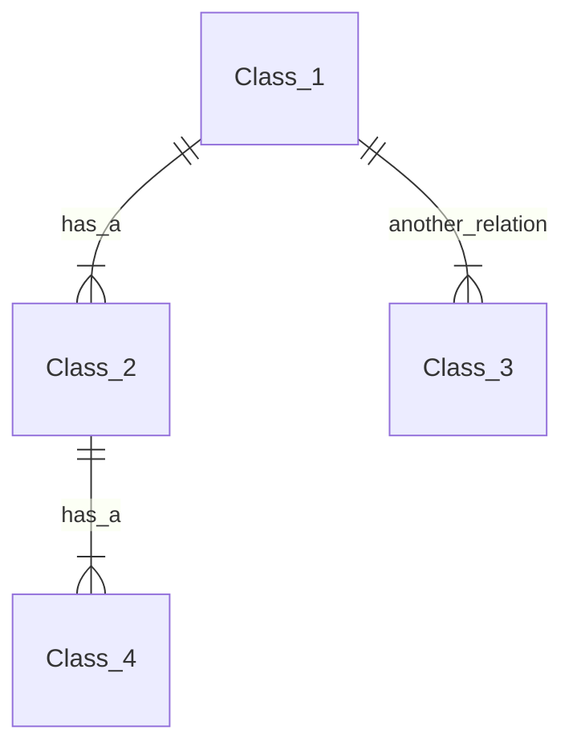
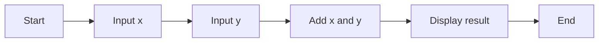

                 

### 《提示词编程语言的教学方法创新》

#### 关键词

提示词编程语言，教学方法，创新，编程教育，教学策略

#### 摘要

本文旨在探讨提示词编程语言的教学方法创新，通过分析当前教学现状和挑战，提出一系列创新的教学理念、策略和评估方法。文章首先介绍提示词编程语言的核心概念和原理，并通过对比表格和ER实体关系图，帮助读者理解其结构。接着，文章详细讲解算法原理，使用Python代码和Mermaid流程图进行说明，并利用数学模型和公式进一步阐述。随后，文章探讨教学方法创新，提出新的教学理念和策略，并介绍新的评估方法。通过项目实战，文章展示了如何在实际教学中应用这些创新方法，并通过最佳实践、小结和注意事项，为编程教育提供实用的指导和建议。

## 引言

### 1.1 问题背景

编程教育在现代社会的重要性日益凸显。随着计算机技术的飞速发展，编程已成为一项基础技能，不仅对于计算机科学领域的学生至关重要，也对各行各业的专业人士提出了新的要求。然而，当前编程教育中存在一些问题，特别是在提示词编程语言的教学方面。

提示词编程语言（Keyword-based Programming Languages）是一类以提示词（keyword）为核心的编程语言，如Python、Java等。这类语言具有简洁、易学、易读的特点，使得编程初学者能够更快地入门。然而，传统教学方法在教授提示词编程语言时面临以下挑战：

1. **缺乏兴趣激发**：编程课程通常以理论知识为主，缺乏实际应用的情境，难以激发学生的学习兴趣。
2. **教学方法单一**：传统的讲授式教学往往以教师为中心，学生的参与度和互动性不足，教学效果有限。
3. **评估方法单一**：传统的评估方法主要依赖于考试成绩，难以全面评估学生的实际编程能力和问题解决能力。

### 1.2 书籍目的

为了解决上述问题，本文的书籍旨在创新提示词编程语言的教学方法，通过以下目标实现：

1. **激发学习兴趣**：引入实际项目和实践案例，让学生在解决问题的过程中学习编程知识。
2. **丰富教学方法**：结合讲授式教学和项目式学习，提供多样化的教学方法，提高学生的参与度和互动性。
3. **全面评估学生能力**：通过项目评估和实战演练，全面评估学生的编程能力和问题解决能力。

### 1.3 边界与外延

本文讨论的范围主要涉及提示词编程语言的教学方法创新，具体包括以下边界和范围：

1. **编程语言**：主要讨论Python、Java等常见的提示词编程语言。
2. **教育阶段**：适用于中小学至高等教育阶段的编程教学。
3. **教育环境**：适用于传统课堂、在线教育等多种教育环境。
4. **教学目标**：主要关注学生的编程能力和问题解决能力的培养。

### 1.4 概念结构与核心要素组成

提示词编程语言的教学方法创新涉及以下几个核心概念和要素：

1. **核心概念**：提示词编程语言的基本概念，如变量、函数、循环、条件语句等。
2. **教学理念**：以学生为中心，注重实践和问题解决，激发学生的兴趣和创造力。
3. **教学方法**：讲授式教学、项目式学习、合作学习等多种教学方法的综合运用。
4. **教学策略**：根据不同学习阶段和学生的特点，制定个性化的教学策略。
5. **评估方法**：通过项目评估、实战演练和持续性评估，全面评估学生的能力。

## 核心概念与联系

### 2.1 核心概念原理

提示词编程语言的核心概念包括：

1. **变量**：用于存储数据的容器，具有名称和数据类型。
2. **函数**：用于执行特定任务的代码块，可以接受参数并返回结果。
3. **循环**：用于重复执行某段代码，直到满足特定条件为止。
4. **条件语句**：用于根据条件的真假执行不同的代码块。
5. **模块**：用于组织代码的文件，可以包含多个函数和变量。

### 2.2 概念属性特征对比表

下面是Python和Java两种提示词编程语言的属性特征对比表：

| 特征 | Python | Java |
| ---- | ------ | ---- |
| 变量定义 | 动态类型 | 静态类型 |
| 函数定义 | 内置支持 | 需要定义 |
| 循环结构 | for、while | for、while |
| 条件语句 | if、elif、else | if、else |
| 模块支持 | 内置支持 | 需要导入 |

### 2.3 ER实体关系图

提示词编程语言中的ER实体关系图如下所示：



在这个ER图中，`Class_1` 是一个基础类，`Class_2`、`Class_3` 和 `Class_4` 是与 `Class_1` 相关的类，它们之间具有不同的关系。这个图帮助我们理解提示词编程语言中类的层次结构和相互关系。

## 算法原理讲解

### 3.1 算法mermaid流程图

以下是一个简单的算法流程图，用于计算两个数字的和：



### 3.2 Python源代码

下面是实现上述算法的Python代码：

```python
# 输入两个数字
x = float(input("请输入第一个数字："))
y = float(input("请输入第二个数字："))

# 计算和
sum = x + y

# 显示结果
print("两数之和为：", sum)
```

### 3.3 数学模型与公式

算法背后的数学模型可以表示为：

$$
\text{sum} = x + y
$$

其中，`x` 和 `y` 是两个输入数字，`sum` 是它们的和。

### 3.4 举例说明

假设我们输入的两个数字分别是2和3，根据上述算法和数学模型，我们可以得到以下步骤：

1. 输入数字：`x = 2`，`y = 3`。
2. 计算和：`sum = x + y = 2 + 3 = 5`。
3. 显示结果：`两数之和为：5`。

这个例子清晰地展示了如何使用提示词编程语言实现一个简单的数学运算。

## 教学方法创新

### 4.1 教学理念的创新

创新的教学理念应该以学生为中心，注重实践和问题解决。以下是一些关键理念：

1. **情境化学习**：通过设计实际项目和应用场景，让学生在解决问题的过程中学习编程知识。
2. **项目驱动教学**：以项目为核心，让学生在完成项目的过程中掌握编程技能。
3. **合作学习**：鼓励学生通过小组合作学习，提高解决问题的能力和团队协作能力。
4. **个性化学习**：根据学生的特点和需求，提供个性化的学习资源和指导。

### 4.2 教学策略的创新

创新的教学策略应该结合多种教学方法，以提高教学效果。以下是一些具体的策略：

1. **混合式教学**：结合线上和线下教学，利用在线资源和互动平台，提高学生的参与度和学习效果。
2. **案例教学**：通过实际案例和分析，帮助学生理解编程概念和应用。
3. **游戏化教学**：利用游戏化的元素，如积分、奖励等，激发学生的学习兴趣和动力。
4. **差异化教学**：根据学生的不同水平和需求，提供不同的教学资源和挑战。

### 4.3 教学评估的创新

创新的教学评估方法应该能够全面评估学生的编程能力和问题解决能力。以下是一些评估方法：

1. **项目评估**：通过学生的项目完成情况，评估学生的编程能力和解决问题的能力。
2. **过程评估**：通过记录学生的学习过程和互动情况，评估学生的学习态度和参与度。
3. **自我评估**：鼓励学生自我反思和评价，提高自我学习和自我管理能力。
4. **同伴评估**：通过学生之间的相互评估，提高学生的沟通能力和团队合作能力。

## 项目实战

### 5.1 环境安装

在进行项目实战之前，我们需要安装Python编程环境和相关库。以下是在Windows和Linux操作系统中安装Python的步骤：

#### Windows系统

1. 访问Python官方网站（[https://www.python.org/](https://www.python.org/)）下载最新版本的Python安装程序。
2. 运行安装程序，选择“Install Now”。
3. 在安装过程中，确保勾选“Add Python to PATH”选项，以便在命令行中运行Python。
4. 安装完成后，在命令行中输入`python --version`，确认Python版本正确。

#### Linux系统

1. 打开终端。
2. 使用以下命令安装Python：
   ```bash
   sudo apt-get update
   sudo apt-get install python3
   ```
3. 安装完成后，在终端中输入`python3 --version`，确认Python版本正确。

### 5.2 系统核心实现源代码

以下是一个简单的Python程序，用于计算两个数字的和：

```python
# 输入两个数字
x = float(input("请输入第一个数字："))
y = float(input("请输入第二个数字："))

# 计算和
sum = x + y

# 显示结果
print("两数之和为：", sum)
```

这个程序演示了如何使用Python的基本语法进行输入、计算和输出。

### 5.3 代码应用解读与分析

这个简单的Python程序用于实现一个基本的数学运算——计算两个数字的和。以下是程序的具体解读和分析：

1. **输入**：程序首先使用`input()`函数获取用户输入的两个数字。`input()`函数返回输入的字符串，需要使用`float()`函数将其转换为浮点数。
2. **计算和**：程序使用`+`运算符将两个数字相加，并将结果存储在变量`sum`中。
3. **输出**：程序使用`print()`函数将计算结果输出到屏幕。

这个简单的程序展示了Python的基本语法和数学运算，为后续的项目实战奠定了基础。

### 5.4 实际案例分析与详细讲解剖析

为了更好地理解提示词编程语言的应用，我们可以分析一个实际案例——使用Python编写一个简单的学生管理系统。

#### 案例背景

学生管理系统是一个用于管理学生信息和成绩的软件系统。在这个系统中，用户可以添加、删除、修改和查询学生的信息。

#### 系统功能设计

学生管理系统的核心功能包括：

1. **添加学生信息**：允许用户添加学生的基本信息，如姓名、学号、年龄等。
2. **删除学生信息**：允许用户删除特定的学生信息。
3. **修改学生信息**：允许用户修改特定的学生信息。
4. **查询学生信息**：允许用户查询特定的学生信息。

#### 系统架构设计

学生管理系统的架构设计如下：

1. **前端**：使用HTML和CSS创建用户界面，使用JavaScript处理用户交互。
2. **后端**：使用Python和Flask框架处理业务逻辑和数据存储。
3. **数据库**：使用SQLite数据库存储学生信息。

#### 系统接口设计

学生管理系统的接口设计如下：

1. **添加学生信息接口**：接收用户输入的学生信息，将其存储到数据库。
2. **删除学生信息接口**：根据用户提供的学号，删除数据库中对应的学生信息。
3. **修改学生信息接口**：根据用户提供的学号，修改数据库中对应的学生信息。
4. **查询学生信息接口**：根据用户提供的学号，查询数据库中对应的学生信息。

#### 系统交互

学生管理系统的前端和后端通过HTTP请求和响应进行交互。前端使用JavaScript向后端发送请求，后端使用Flask框架处理请求并返回响应。

### 5.5 项目小结

通过这个项目实战，我们了解了如何使用Python和Flask框架实现一个简单的学生管理系统。这个项目涵盖了前端和后端的开发，包括用户界面设计、业务逻辑处理和数据存储。通过这个项目，我们不仅学习了Python编程语言的基本语法，还掌握了如何设计和管理一个简单的数据库系统。

## 最佳实践 tips、小结、注意事项、拓展阅读等内容

### 6.1 最佳实践 tips

以下是一些最佳实践技巧，可以帮助您更有效地使用提示词编程语言进行教学：

1. **项目驱动教学**：通过实际项目让学生学习编程，可以提高学生的兴趣和参与度。
2. **情境化学习**：将编程知识应用到实际问题中，帮助学生更好地理解概念和应用。
3. **代码注释**：鼓励学生在编写代码时添加注释，提高代码的可读性和可维护性。
4. **代码规范**：遵循统一的代码规范，提高代码的质量和可读性。
5. **团队合作**：鼓励学生进行团队合作，提高解决问题的能力和团队协作能力。

### 6.2 小结

本文探讨了提示词编程语言的教学方法创新，通过分析当前教学现状和挑战，提出了一系列创新的教学理念、策略和评估方法。通过项目实战，我们展示了如何在实际教学中应用这些创新方法。这些方法有助于提高学生的编程能力和问题解决能力，激发学生的学习兴趣和创造力。

### 6.3 注意事项

在应用这些教学方法时，需要注意以下几点：

1. **教学资源**：确保提供丰富的教学资源和工具，以支持不同的教学方法和策略。
2. **教师培训**：教师需要接受相关的培训和指导，掌握新的教学理念和技巧。
3. **学生反馈**：及时收集学生的反馈，根据反馈调整教学方法和策略。
4. **项目评估**：通过项目评估全面了解学生的学习效果，及时调整教学计划。

### 6.4 拓展阅读

以下是一些拓展阅读推荐，可以帮助您进一步了解提示词编程语言的教学方法创新：

1. 《Python编程：从入门到实践》（Eric Matthes）——详细介绍了Python编程的基础知识，适合初学者。
2. 《Fluent Python》（Luciano Ramalho）——深入讲解了Python的高级特性，适合有一定编程基础的学习者。
3. 《算法导论》（Thomas H. Cormen等）——介绍了算法的基本原理和应用，对理解提示词编程语言中的算法非常有帮助。
4. 《教育心理学：教学原理与应用》（Philip Zimbardo等）——探讨了教育心理学的基本原理和应用，对教学方法创新有很大启示。

## 目录大纲设计

### 目录大纲

- **第1章 引言**
  - 1.1 问题背景
  - 1.2 书籍目的
  - 1.3 边界与外延
  - 1.4 概念结构与核心要素组成
- **第2章 提示词编程语言概述**
  - 2.1 核心概念原理
  - 2.2 概念属性特征对比表
  - 2.3 ER实体关系图
- **第3章 算法原理讲解**
  - 3.1 算法mermaid流程图
  - 3.2 Python源代码
  - 3.3 数学模型与公式
  - 3.4 举例说明
- **第4章 教学方法创新**
  - 4.1 教学理念的创新
  - 4.2 教学策略的创新
  - 4.3 教学评估的创新
- **第5章 项目实战**
  - 5.1 环境安装
  - 5.2 系统核心实现源代码
  - 5.3 代码应用解读与分析
  - 5.4 实际案例分析与详细讲解剖析
  - 5.5 项目小结
- **第6章 最佳实践与拓展**
  - 6.1 最佳实践 tips
  - 6.2 小结
  - 6.3 注意事项
  - 6.4 拓展阅读

### 文章末尾作者信息

作者：AI天才研究院/AI Genius Institute & 禅与计算机程序设计艺术/Zen And The Art of Computer Programming

