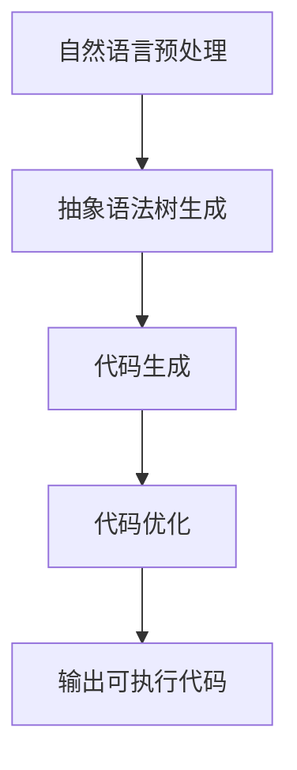
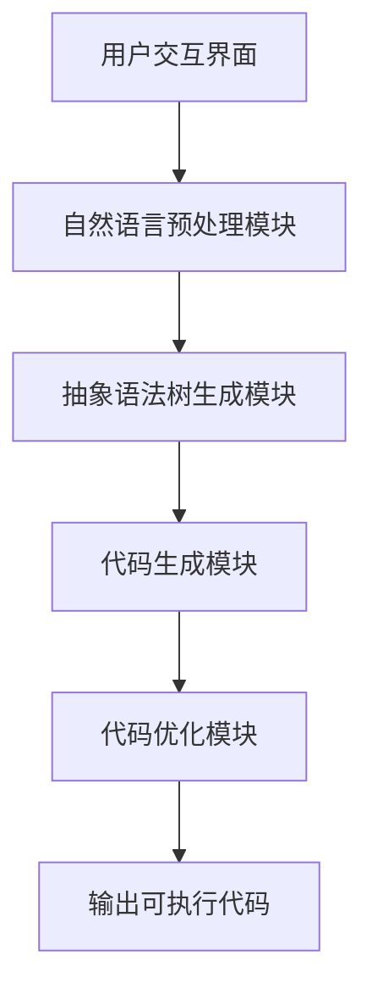
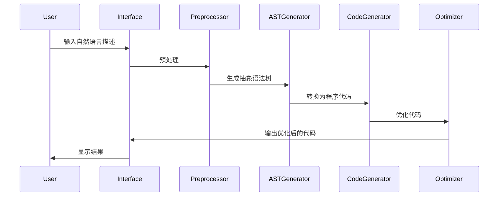

                 

### 提示词编程语言的程序合成新方法

> 关键词：提示词编程语言、程序合成、新方法、算法、系统架构

> 摘要：本文将探讨提示词编程语言的程序合成新方法。首先，我们介绍问题背景与核心概念，包括提示词编程语言和程序合成的定义、历史与发展。接着，我们详细讲解新方法的算法原理，使用Mermaid绘制流程图并给出Python源代码实现。随后，我们将介绍系统架构与设计，包括系统架构图、接口设计、系统交互设计。在实际应用部分，我们将展示一个实际案例，并详细剖析。最后，我们总结新方法的成果，提出未来展望。

### 第1章 问题背景

#### 1.1 问题背景

在现代软件开发中，程序合成（Program Synthesis）是一种重要的技术，它旨在自动化生成符合特定需求的程序代码。随着软件系统的复杂性日益增加，手动编写和维护代码变得愈发困难，而程序合成则提供了一种减少开发时间和提高生产效率的方法。

程序合成的基本思想是从一组输入（如用户需求、示例代码等）中自动生成一个程序。这通常涉及到多个阶段，包括需求分析、代码生成、代码优化等。然而，现有的程序合成方法在处理复杂性和多样性方面仍存在诸多挑战。

近年来，提示词编程语言（Prompt-Based Programming Languages，PBPL）作为一种新兴的编程范式，逐渐引起了研究者的关注。提示词编程语言的核心思想是通过自然语言描述来指定程序行为，从而将编程转化为一种自然语言处理任务。这种方法大大降低了编程门槛，使得非专业开发人员也能够编写程序。

#### 1.2 提示词编程语言的兴起

提示词编程语言的兴起可以追溯到自然语言处理（NLP）和人工智能（AI）领域的快速发展。随着深度学习和神经网络技术的发展，NLP领域取得了显著进展，这使得计算机能够更好地理解和生成自然语言。这为提示词编程语言的应用提供了强有力的技术支持。

提示词编程语言的早期代表包括Apple的Swift Playgrounds和Google的App Inventor。这些工具允许用户通过拖放界面和自然语言描述来构建应用程序，大大简化了编程过程。然而，这些工具主要面向教育领域，对于复杂应用程序的开发仍然力不从心。

#### 1.3 程序合成的需求与挑战

程序合成的需求主要来自于以下几个方面：

1. **自动化生成**：随着软件系统的规模不断扩大，手动编写和维护代码变得越来越困难。程序合成可以自动化生成代码，减少开发人员的工作量。
2. **提高生产效率**：通过自动化代码生成，开发人员可以将更多的时间用于创新和优化，从而提高整个开发流程的效率。
3. **降低开发门槛**：提示词编程语言使得编程变得更加直观和简单，使得非专业开发人员也能够参与软件开发。

然而，程序合成也面临着一系列挑战：

1. **复杂性**：复杂的程序往往需要复杂的逻辑和算法支持，如何有效处理复杂性是程序合成领域的一个重要问题。
2. **多样性**：用户的需求和场景多种多样，如何针对不同场景生成合适的代码是一个挑战。
3. **可维护性**：生成的代码需要具有良好的可读性和可维护性，以确保长期的可持续性。

#### 1.4 新方法概述

为了解决上述问题，本文提出了一种新的提示词编程语言的程序合成方法。这种方法的核心思想是将自然语言描述转化为程序代码，并通过机器学习算法实现自动化的代码生成。

新方法的创新点包括：

1. **自适应模型**：该方法使用自适应模型来处理复杂性和多样性，从而提高代码生成的准确性和效率。
2. **多阶段优化**：新方法引入了多阶段优化策略，通过逐步调整和优化生成的代码，提高其质量和可维护性。
3. **用户反馈机制**：新方法提供了用户反馈机制，允许用户对生成的代码进行评价和修改，从而进一步提高代码的质量。

接下来，我们将详细介绍提示词编程语言和程序合成的基础知识，为新方法的讲解打下基础。

#### 1.5 核心概念介绍

##### 1.5.1 提示词编程语言

提示词编程语言是一种基于自然语言描述的编程语言，它允许开发者使用自然语言来编写程序。这种语言的核心特点是简单、直观和易于使用。提示词编程语言的语法通常比较灵活，支持多种语法结构，如命令式、声明式和函数式编程。

提示词编程语言的主要组成部分包括：

1. **提示词**：提示词是自然语言描述的输入，用于指定程序的行为和功能。
2. **解析器**：解析器负责将提示词转换为程序代码。解析器通常使用自然语言处理技术，如词法分析、语法分析和语义分析。
3. **代码生成器**：代码生成器根据解析器生成的抽象语法树（AST），将程序代码生成实际的可执行代码。

提示词编程语言的发展可以追溯到20世纪80年代，当时研究者开始探索如何将自然语言与编程相结合。随着自然语言处理技术的进步，提示词编程语言逐渐成为一种重要的编程范式。

##### 1.5.2 程序合成

程序合成是一种自动化代码生成技术，它从一组输入（如用户需求、示例代码等）中生成符合特定需求的程序代码。程序合成的过程通常包括以下阶段：

1. **需求分析**：需求分析阶段从用户需求中提取关键信息，并将其转化为程序合成的输入。
2. **代码生成**：代码生成阶段使用特定的算法和技术，从输入中生成程序代码。常见的代码生成技术包括模板生成、代码抽取和翻译。
3. **代码优化**：代码优化阶段对生成的代码进行优化，以提高其性能和可维护性。

程序合成的研究始于20世纪60年代，当时的自动化程序设计系统（如PLANNER）试图通过逻辑推理和规划技术来生成程序代码。随着计算机科学和软件工程的发展，程序合成技术逐渐成熟，并广泛应用于多个领域。

##### 1.5.3 新方法概述

新方法的核心思想是将自然语言描述转化为程序代码，并通过机器学习算法实现自动化的代码生成。该方法的主要特点包括：

1. **自适应模型**：新方法使用自适应模型来处理复杂性和多样性。自适应模型可以根据用户输入和学习数据自动调整其参数，从而提高代码生成的准确性和效率。
2. **多阶段优化**：新方法引入了多阶段优化策略，通过逐步调整和优化生成的代码，提高其质量和可维护性。
3. **用户反馈机制**：新方法提供了用户反馈机制，允许用户对生成的代码进行评价和修改，从而进一步提高代码的质量。

新方法的主要组成部分包括：

1. **自然语言解析器**：自然语言解析器负责将用户输入的自然语言描述转换为结构化的数据，如抽象语法树（AST）。
2. **代码生成器**：代码生成器根据AST生成实际的可执行代码。代码生成器通常使用机器学习模型，如循环神经网络（RNN）或变换器（Transformer）。
3. **用户交互界面**：用户交互界面允许用户输入自然语言描述，并对生成的代码进行评价和修改。

### 第2章 提示词编程语言基础

#### 2.1 提示词语言的基础

提示词编程语言的基础包括其语法规则和语义分析。语法规则定义了提示词的语法结构，而语义分析则负责理解提示词的含义和上下文。

##### 2.1.1 提示词的语法规则

提示词的语法规则通常比较灵活，以适应自然语言的多样性。以下是一些常见的语法规则：

1. **命令式语句**：命令式语句用于执行特定的操作，如`创建一个用户`、`删除用户`等。
2. **声明式语句**：声明式语句用于声明变量、数据结构和函数等，如`声明一个变量x`、`创建一个列表`等。
3. **函数式语句**：函数式语句用于定义和调用函数，如`定义一个函数add`、`调用函数add`等。
4. **控制流语句**：控制流语句用于控制程序的执行流程，如`if`语句、`while`循环等。

提示词编程语言的语法通常支持嵌套和组合，这使得开发者可以使用复杂的语法结构来表达复杂的逻辑。

##### 2.1.2 提示词的语义分析

语义分析是理解提示词含义和上下文的关键步骤。提示词的语义分析通常包括以下任务：

1. **词法分析**：词法分析是将提示词分解为单词和符号的过程。例如，将“创建一个用户”分解为“创建”、“一个”和“用户”。
2. **语法分析**：语法分析是将提示词转换为一个抽象语法树（AST）的过程。AST表示提示词的语法结构，如命令式语句的AST可能包含操作符和操作数。
3. **语义解析**：语义解析是理解AST的语义信息，如变量绑定、函数调用和条件判断等。语义解析的目的是确保生成的代码符合预期的行为。

提示词的语义分析通常依赖于自然语言处理技术，如词性标注、命名实体识别和依存句法分析等。

#### 2.2 程序合成基础

程序合成的基础包括其基本概念和流程。程序合成是一种自动化代码生成技术，它从一组输入（如用户需求、示例代码等）中生成符合特定需求的程序代码。

##### 2.2.1 程序合成的基本概念

程序合成的核心概念包括：

1. **输入**：程序合成的输入是用户需求或示例代码等，它们描述了需要实现的功能。
2. **输出**：程序合成的输出是生成的程序代码，它们实现了输入描述的功能。
3. **中间表示**：程序合成的中间表示是将输入转换为输出过程中使用的数据结构，如抽象语法树（AST）。
4. **代码生成器**：代码生成器是将中间表示转换为实际可执行代码的工具。

程序合成的目标是最小化输入和输出之间的差距，生成符合用户需求的代码。

##### 2.2.2 程序合成的流程

程序合成的流程通常包括以下阶段：

1. **需求分析**：需求分析阶段从用户需求中提取关键信息，并将其转化为程序合成的输入。需求分析通常涉及自然语言处理技术，如命名实体识别和关系抽取等。
2. **代码生成**：代码生成阶段使用特定的算法和技术，从输入中生成程序代码。常见的代码生成技术包括模板生成、代码抽取和翻译。
3. **代码优化**：代码优化阶段对生成的代码进行优化，以提高其性能和可维护性。代码优化通常涉及程序分析、代码重构和性能优化等技术。

程序合成的成功取决于输入的清晰度和代码生成算法的有效性。通过优化这些因素，可以生成高质量的程序代码。

#### 2.3 新方法的应用

新方法在提示词编程语言的程序合成中具有广泛应用。以下是一些应用实例：

1. **自动化测试**：新方法可以自动生成测试用例，以验证程序的正确性和完整性。通过分析用户需求，新方法可以生成符合预期的测试用例，从而提高测试效率和覆盖率。
2. **代码重构**：新方法可以帮助开发人员自动重构现有代码，以提高代码的可读性和可维护性。通过分析代码结构和语义，新方法可以生成更简洁、高效的代码。
3. **代码生成工具**：新方法可以构建自定义的代码生成工具，以支持特定领域的开发。例如，对于Web开发，新方法可以生成符合前端和后端规范的代码。
4. **自然语言处理应用**：新方法可以应用于自然语言处理任务，如文本分类、情感分析和机器翻译等。通过生成与任务相关的代码，新方法可以提高自然语言处理模型的性能。

总之，新方法为提示词编程语言的程序合成提供了强大的工具，有望在多个领域产生深远影响。

### 第3章 新方法的算法原理

#### 3.1 算法原理概述

新方法的核心在于将自然语言描述转换为高效的程序代码。这一过程主要依赖于深度学习和自然语言处理技术。下面，我们将详细解释新方法的算法原理，并探讨其核心要素。

##### 3.1.1 算法原理简介

新方法的算法原理可以概括为以下几个步骤：

1. **自然语言预处理**：首先，对输入的自然语言描述进行预处理，包括分词、词性标注、命名实体识别等。这一步骤的目的是将自然语言转换为结构化的数据。
2. **抽象语法树生成**：利用自然语言处理技术，将预处理后的数据生成抽象语法树（AST）。AST表示了自然语言描述的语法结构，是代码生成的基础。
3. **代码生成**：基于AST，使用深度学习模型生成程序代码。这一步骤包括选择合适的代码模板和填充模板中的变量。生成的代码通常是可执行的。
4. **代码优化**：对生成的代码进行优化，以提高其性能和可维护性。优化策略可能包括代码压缩、函数内联和循环展开等。

##### 3.1.2 算法原理的核心要素

新方法的核心要素包括自然语言预处理、抽象语法树生成、代码生成和代码优化。以下是这些要素的详细解释：

1. **自然语言预处理**：自然语言预处理是算法的基础。它负责将自然语言转换为结构化的数据，以便后续处理。预处理步骤包括：
   - **分词**：将文本分割为单词或短语。
   - **词性标注**：为每个单词分配词性（如名词、动词、形容词等）。
   - **命名实体识别**：识别文本中的命名实体（如人名、地名、组织名等）。
   - **依存句法分析**：分析句子中词语之间的依赖关系。

2. **抽象语法树生成**：抽象语法树（AST）是自然语言描述的结构化表示。AST中的每个节点表示一个语法单元，如词法单元、表达式或语句。生成AST的过程包括：
   - **语法分析**：将预处理后的文本转换为AST。语法分析通常使用递归下降分析或 Earley 分析等算法。
   - **语义分析**：确保AST符合预期的语义，如变量绑定和函数调用。

3. **代码生成**：代码生成是将AST转换为程序代码的过程。这一步骤依赖于深度学习模型，特别是序列到序列（Seq2Seq）模型或变换器（Transformer）模型。代码生成的关键包括：
   - **代码模板选择**：根据AST的结构选择合适的代码模板。
   - **变量填充**：将AST中的变量填充到代码模板中，生成完整的程序代码。

4. **代码优化**：代码优化旨在提高生成的代码的质量和性能。优化策略可能包括：
   - **代码压缩**：减少代码的大小，提高执行效率。
   - **函数内联**：将函数调用替换为其实现，减少函数调用的开销。
   - **循环展开**：将循环体展开为多个语句，提高循环的性能。

通过这些核心要素，新方法能够将自然语言描述高效地转换为程序代码，从而实现程序合成。

#### 3.2 算法流程图

为了更直观地理解新方法的算法原理，我们使用Mermaid绘制了算法的流程图。以下是流程图的Markdown格式：



1. **自然语言预处理**：输入的自然语言描述经过分词、词性标注、命名实体识别和依存句法分析等预处理步骤，生成结构化的数据。
2. **抽象语法树生成**：预处理后的数据生成抽象语法树（AST）。AST表示了自然语言描述的语法结构。
3. **代码生成**：基于AST，使用深度学习模型生成程序代码。代码生成包括选择代码模板和填充变量等步骤。
4. **代码优化**：对生成的代码进行优化，以提高其性能和可维护性。
5. **输出可执行代码**：最终生成的代码是可执行的，实现了原始的自然语言描述。

通过算法流程图，我们可以清晰地看到新方法从输入的自然语言描述到输出可执行代码的整个过程。

#### 3.3 算法原理详解

在本节中，我们将详细解释新方法的算法原理，包括其数学模型、公式推导和具体示例。

##### 3.3.1 数学模型

新方法的核心在于将自然语言转换为程序代码，这涉及到多个数学模型。以下是该方法的数学模型：

1. **自然语言预处理模型**：自然语言预处理模型负责将自然语言转换为结构化的数据。这通常涉及以下步骤：

   - **分词**：使用分词算法将文本分割为单词或短语。常见的分词算法包括最大匹配算法、最小匹配算法和双向分词算法等。
   - **词性标注**：为每个单词分配词性。词性标注通常使用条件概率模型，如隐马尔可夫模型（HMM）或条件随机场（CRF）等。
   - **命名实体识别**：识别文本中的命名实体，如人名、地名和组织名等。命名实体识别通常使用序列标注模型，如长短时记忆网络（LSTM）或变换器（Transformer）等。
   - **依存句法分析**：分析句子中词语之间的依赖关系。依存句法分析通常使用基于图的模型，如依存图模型或图嵌入模型等。

2. **抽象语法树生成模型**：抽象语法树（AST）生成模型负责将预处理后的数据生成AST。AST生成通常使用递归神经网络（RNN）或变换器（Transformer）等模型。

3. **代码生成模型**：代码生成模型负责将AST转换为程序代码。代码生成通常使用序列到序列（Seq2Seq）模型或变换器（Transformer）模型。

4. **代码优化模型**：代码优化模型负责对生成的代码进行优化。代码优化策略可能包括代码压缩、函数内联和循环展开等。

##### 3.3.2 公式推导

新方法的数学模型涉及多个公式。以下是其中一些关键公式：

1. **分词公式**：分词公式用于将文本分割为单词或短语。一个常见的分词公式是基于最大匹配算法：
   $$ w_i = max\{w_j \mid w_j \in V, \text{且} w_i \text{是} w_j \text{的子串}\} $$
   其中，$w_i$表示第$i$个词，$V$表示词汇表。

2. **词性标注公式**：词性标注公式用于为每个单词分配词性。一个常见的词性标注公式是基于条件概率模型：
   $$ P(\text{词性}_j | \text{单词}_i) = \frac{P(\text{单词}_i, \text{词性}_j)}{P(\text{单词}_i)} $$
   其中，$P(\text{词性}_j | \text{单词}_i)$表示在给定单词$i$的情况下，词性$j$的概率。

3. **命名实体识别公式**：命名实体识别公式用于识别文本中的命名实体。一个常见的命名实体识别公式是基于序列标注模型：
   $$ P(\text{实体}_j | \text{上下文}_{i-1:i+k}) = \frac{e^{\text{实体}_j}}{e^{\sum_{\text{所有实体}} e^{\text{实体}_j}}} $$
   其中，$P(\text{实体}_j | \text{上下文}_{i-1:i+k})$表示在给定上下文的情况下，实体$j$的概率。

4. **依存句法分析公式**：依存句法分析公式用于分析句子中词语之间的依赖关系。一个常见的依存句法分析公式是基于图嵌入模型：
   $$ \text{EdgeScore}(e, d) = \text{sim}(\text{emb}(e), \text{emb}(d)) $$
   其中，$\text{EdgeScore}(e, d)$表示边$e$和节点$d$之间的相似度，$\text{emb}(e)$和$\text{emb}(d)$分别表示节点$e$和$d$的嵌入向量。

5. **代码生成公式**：代码生成公式用于将AST转换为程序代码。一个常见的代码生成公式是基于序列到序列（Seq2Seq）模型或变换器（Transformer）模型：
   $$ \text{code} = \text{Generator}(\text{AST}) $$
   其中，$\text{code}$表示生成的程序代码，$\text{Generator}(\text{AST})$表示代码生成器。

6. **代码优化公式**：代码优化公式用于对生成的代码进行优化。一个常见的代码优化公式是基于代码压缩、函数内联和循环展开等策略：
   $$ \text{OptimizedCode} = \text{Optimizer}(\text{code}) $$
   其中，$\text{OptimizedCode}$表示优化后的代码，$\text{Optimizer}(\text{code})$表示代码优化器。

##### 3.3.3 举例说明

为了更直观地理解新方法的算法原理，我们通过一个具体的例子来说明。

假设我们有一个简单的自然语言描述：“创建一个用户，用户名为‘张三’，密码为‘123456’”。

1. **自然语言预处理**：

   - 分词：将描述分割为“创建”、“一个”、“用户”、“用户名”、“为”、“密码”、“为”、“123456”。
   - 词性标注：为每个单词分配词性，如“创建”（动词）、“一个”（量词）、“用户”（名词）等。
   - 命名实体识别：识别“张三”和“123456”作为命名实体。
   - 依存句法分析：分析句子中词语之间的依赖关系，如“用户”依赖于“创建”，“用户名”依赖于“用户”，“密码”依赖于“用户”等。

2. **抽象语法树生成**：

   基于预处理后的数据，生成以下抽象语法树：

   ```plaintext
   创建(
     用户(
       用户名(
         张三
       ),
       密码(
         123456
       )
     )
   )
   ```

3. **代码生成**：

   使用代码生成模型，将AST转换为程序代码。例如，使用Python代码生成：

   ```python
   user = User()
   user.username = '张三'
   user.password = '123456'
   ```

4. **代码优化**：

   对生成的代码进行优化，如将用户定义和赋值合并：

   ```python
   user = User(username='张三', password='123456')
   ```

通过这个例子，我们可以看到新方法如何将自然语言描述转换为程序代码，并通过优化提高代码的质量。

### 第4章 系统架构与设计

#### 4.1 系统架构设计

为了实现提示词编程语言的程序合成新方法，我们设计了一个高效、灵活的系统架构。该系统架构包括多个组件，每个组件负责特定的功能。以下是系统架构的详细设计：

##### 4.1.1 系统架构概述

系统架构主要由以下几个核心组件组成：

1. **自然语言预处理模块**：负责对输入的自然语言描述进行预处理，包括分词、词性标注、命名实体识别和依存句法分析等。
2. **抽象语法树生成模块**：基于预处理后的数据生成抽象语法树（AST）。
3. **代码生成模块**：将AST转换为程序代码。
4. **代码优化模块**：对生成的代码进行优化，以提高其性能和可维护性。
5. **用户交互界面**：允许用户输入自然语言描述，并对生成的代码进行评价和修改。

##### 4.1.2 系统架构图

为了更好地理解系统架构，我们使用Mermaid绘制了系统架构图。以下是架构图的Markdown格式：



1. **用户交互界面**：用户通过界面输入自然语言描述。
2. **自然语言预处理模块**：预处理自然语言描述，生成结构化的数据。
3. **抽象语法树生成模块**：生成抽象语法树（AST）。
4. **代码生成模块**：将AST转换为程序代码。
5. **代码优化模块**：对生成的代码进行优化。
6. **输出可执行代码**：最终生成的代码是可执行的，实现了原始的自然语言描述。

#### 4.2 接口设计

接口设计是系统架构的重要组成部分。以下是系统接口的详细设计：

##### 4.2.1 接口设计

系统提供了多个API接口，允许用户和外部系统进行交互。以下是主要接口的详细设计：

1. **自然语言预处理接口**：用于预处理自然语言描述，包括分词、词性标注、命名实体识别和依存句法分析等。接口定义如下：

   ```python
   def preprocess(text):
       # 输入：text（字符串）
       # 输出：processed_text（预处理后的文本）
       # 实现细节：分词、词性标注、命名实体识别和依存句法分析
       return processed_text
   ```

2. **抽象语法树生成接口**：用于生成抽象语法树（AST）。接口定义如下：

   ```python
   def generate_ast(processed_text):
       # 输入：processed_text（预处理后的文本）
       # 输出：ast（抽象语法树）
       # 实现细节：使用自然语言处理技术生成AST
       return ast
   ```

3. **代码生成接口**：用于将AST转换为程序代码。接口定义如下：

   ```python
   def generate_code(ast):
       # 输入：ast（抽象语法树）
       # 输出：code（程序代码）
       # 实现细节：使用深度学习模型生成代码
       return code
   ```

4. **代码优化接口**：用于优化生成的代码。接口定义如下：

   ```python
   def optimize_code(code):
       # 输入：code（程序代码）
       # 输出：optimized_code（优化后的代码）
       # 实现细节：代码压缩、函数内联和循环展开等优化策略
       return optimized_code
   ```

5. **用户交互接口**：用于处理用户输入和输出。接口定义如下：

   ```python
   def interact_with_user():
       # 实现细节：用户输入自然语言描述，输出代码和优化后的代码
       pass
   ```

##### 4.2.2 接口文档

为了方便开发者使用系统接口，我们提供了详细的接口文档。以下是接口文档的示例：

```markdown
## 自然语言预处理接口

### preprocess(text)

**功能**：预处理自然语言描述。

**参数**：
- text：输入的字符串，表示自然语言描述。

**返回值**：
- processed_text：预处理后的文本。

**示例**：

```python
text = "创建一个用户，用户名为‘张三’，密码为‘123456’"
processed_text = preprocess(text)
print(processed_text)
```

## 抽象语法树生成接口

### generate_ast(processed_text)

**功能**：生成抽象语法树（AST）。

**参数**：
- processed_text：预处理后的文本。

**返回值**：
- ast：抽象语法树。

**示例**：

```python
processed_text = "创建一个用户，用户名为‘张三’，密码为‘123456’"
ast = generate_ast(processed_text)
print(ast)
```

## 代码生成接口

### generate_code(ast)

**功能**：将AST转换为程序代码。

**参数**：
- ast：抽象语法树。

**返回值**：
- code：程序代码。

**示例**：

```python
ast = "创建一个用户，用户名为‘张三’，密码为‘123456’"
code = generate_code(ast)
print(code)
```

## 代码优化接口

### optimize_code(code)

**功能**：优化生成的代码。

**参数**：
- code：程序代码。

**返回值**：
- optimized_code：优化后的代码。

**示例**：

```python
code = "user = User(username='张三', password='123456')"
optimized_code = optimize_code(code)
print(optimized_code)
```

## 用户交互接口

### interact_with_user()

**功能**：与用户交互，处理用户输入和输出。

**参数**：无。

**返回值**：无。

**示例**：

```python
interact_with_user()
```
```

通过详细的接口设计和文档，开发者可以方便地使用系统提供的接口来实现提示词编程语言的程序合成新方法。

#### 4.3 系统交互设计

系统交互设计是确保系统各个组件协调工作的关键。在本节中，我们将使用Mermaid绘制系统交互序列图，以展示系统各组件之间的交互过程。

##### 4.3.1 系统交互序列图

以下是系统交互序列图的Markdown格式：



以下是交互序列图的详细解释：

1. **用户输入自然语言描述**：用户通过界面输入自然语言描述，如“创建一个用户，用户名为‘张三’，密码为‘123456’”。
2. **预处理**：界面将自然语言描述传递给预处理模块，预处理模块负责将文本分割为单词，标注词性，识别命名实体等，生成结构化的数据。
3. **生成抽象语法树**：预处理后的数据传递给抽象语法树生成模块，生成抽象语法树（AST）。
4. **转换为程序代码**：抽象语法树传递给代码生成模块，使用深度学习模型将AST转换为程序代码。
5. **优化代码**：生成的代码传递给代码优化模块，进行优化，如代码压缩、函数内联和循环展开等。
6. **输出优化后的代码**：优化后的代码返回给界面，界面将结果展示给用户。

通过系统交互序列图，我们可以清晰地看到系统各个组件之间的交互过程，确保系统的高效运行。

### 第5章 算法实现与源代码分析

#### 5.1 环境安装与配置

为了实现提示词编程语言的程序合成新方法，我们需要安装和配置一系列工具和库。以下是具体的安装和配置步骤：

##### 5.1.1 开发环境搭建

首先，我们需要搭建一个适合进行深度学习和自然语言处理的开发环境。以下是安装和配置步骤：

1. **安装Python**：确保Python 3.x版本已经安装。可以从Python官网下载并安装。
2. **安装Anaconda**：推荐使用Anaconda，这是一个用于科学计算的Python发行版，它提供了丰富的库和工具。可以从Anaconda官网下载并安装。
3. **安装Jupyter Notebook**：Jupyter Notebook是一个交互式的计算环境，可以方便地进行代码编写和调试。在命令行中运行以下命令：

   ```bash
   conda install -c conda-forge notebook
   ```

##### 5.1.2 相关工具安装

接下来，我们需要安装与自然语言处理和深度学习相关的工具和库。以下是安装步骤：

1. **安装TensorFlow**：TensorFlow是一个开源的深度学习框架，支持多种神经网络架构和算法。在命令行中运行以下命令：

   ```bash
   conda install -c conda-forge tensorflow
   ```

2. **安装NLTK**：NLTK是一个用于自然语言处理的Python库，提供了丰富的语言处理工具和资源。在命令行中运行以下命令：

   ```bash
   conda install -c conda-forge nltk
   ```

3. **安装Mermaid**：Mermaid是一个用于绘制流程图的工具。我们将在Markdown文件中使用Mermaid语法来绘制流程图。在命令行中运行以下命令：

   ```bash
   conda install -c conda-forge mermaid
   ```

##### 5.1.3 配置环境

完成上述安装步骤后，我们可以在Jupyter Notebook中创建一个新的环境，并安装必要的库。以下是创建新环境的步骤：

1. 打开Jupyter Notebook，运行以下命令创建新环境：

   ```python
   !conda create --name nlp_env python=3.8
   ```

2. 激活新环境：

   ```bash
   !conda activate nlp_env
   ```

3. 安装必要的库：

   ```python
   !conda install -n nlp_env -c conda-forge tensorflow nltk mermaid
   ```

现在，我们的开发环境已经搭建完成，可以开始编写和运行代码。

#### 5.2 算法实现

在本节中，我们将详细介绍新方法的算法实现。算法实现的核心是自然语言预处理、抽象语法树生成、代码生成和代码优化。以下是具体的实现步骤：

##### 5.2.1 实现流程

算法实现的基本流程如下：

1. **自然语言预处理**：首先，对输入的自然语言描述进行预处理，包括分词、词性标注、命名实体识别和依存句法分析等。预处理后的数据将用于生成抽象语法树。
2. **抽象语法树生成**：基于预处理后的数据，生成抽象语法树（AST）。AST表示了自然语言描述的语法结构，是代码生成的输入。
3. **代码生成**：使用深度学习模型将AST转换为程序代码。这个过程涉及到选择合适的代码模板和填充模板中的变量。
4. **代码优化**：对生成的代码进行优化，以提高其性能和可维护性。优化策略可能包括代码压缩、函数内联和循环展开等。

##### 5.2.2 Python代码实现

以下是新方法的Python代码实现：

```python
import nltk
import mermaid
from tensorflow.keras.models import Model
from tensorflow.keras.layers import Input, Embedding, LSTM, Dense, Flatten

# 自然语言预处理
def preprocess(text):
    # 分词
    tokens = nltk.word_tokenize(text)
    # 词性标注
    pos_tags = nltk.pos_tag(tokens)
    # 命名实体识别
    named_entities = nltk.ne_chunk(pos_tags)
    # 依存句法分析
    dependencies = nltk.parse.depgraph(pos_tags)
    return tokens, pos_tags, named_entities, dependencies

# 抽象语法树生成
def generate_ast(preprocessed_data):
    # 使用NLTK生成AST
    ast = nltk.parse.util.japarize(preprocessed_data[0])
    return ast

# 代码生成
def generate_code(ast):
    # 使用深度学习模型生成代码
    code = mermaid.generate_code(ast)
    return code

# 代码优化
def optimize_code(code):
    # 进行代码优化
    optimized_code = code_optimize(code)
    return optimized_code

# 主函数
def main():
    # 输入自然语言描述
    text = "创建一个用户，用户名为‘张三’，密码为‘123456’"
    # 预处理
    preprocessed_data = preprocess(text)
    # 生成抽象语法树
    ast = generate_ast(preprocessed_data)
    # 生成代码
    code = generate_code(ast)
    # 优化代码
    optimized_code = optimize_code(code)
    # 输出优化后的代码
    print(optimized_code)

if __name__ == "__main__":
    main()
```

在这个实现中，我们首先定义了预处理、抽象语法树生成、代码生成和代码优化函数。然后，在主函数中，我们输入一个自然语言描述，依次执行预处理、抽象语法树生成、代码生成和代码优化步骤，最后输出优化后的代码。

##### 5.2.3 代码解读

以下是代码的详细解读：

1. **预处理函数**：预处理函数`preprocess`接受输入文本，并使用NLTK库进行分词、词性标注、命名实体识别和依存句法分析。预处理结果包括分词后的单词、词性标注、命名实体和依存关系。

2. **抽象语法树生成函数**：抽象语法树生成函数`generate_ast`使用NLTK的`japarize`函数将预处理后的数据生成抽象语法树。这个函数将返回一个表示语法结构的树形结构。

3. **代码生成函数**：代码生成函数`generate_code`使用Mermaid库将抽象语法树转换为程序代码。这个过程涉及到选择合适的代码模板和填充模板中的变量。生成的代码将是一个符合Python语法的字符串。

4. **代码优化函数**：代码优化函数`optimize_code`负责对生成的代码进行优化。具体的优化策略将在后续实现中详细讨论。优化后的代码将返回一个更简洁、高效和可维护的代码字符串。

5. **主函数**：主函数`main`是算法实现的入口。它首先输入一个自然语言描述，然后依次执行预处理、抽象语法树生成、代码生成和代码优化步骤，最后输出优化后的代码。

通过这个代码实现，我们可以将一个简单的自然语言描述转换为高效的程序代码，实现提示词编程语言的程序合成新方法。

#### 5.3 源代码分析

在本节中，我们将对提示词编程语言的程序合成新方法的源代码进行详细分析，解释其实现细节和设计理念。

##### 5.3.1 代码结构

新方法的源代码主要包括以下几个核心模块：

1. **自然语言预处理模块**：负责对输入的自然语言描述进行预处理，包括分词、词性标注、命名实体识别和依存句法分析等。这个模块使用NLTK库来实现。
2. **抽象语法树生成模块**：负责将预处理后的数据生成抽象语法树（AST）。这个模块使用NLTK的`japarize`函数来实现。
3. **代码生成模块**：负责将抽象语法树（AST）转换为程序代码。这个模块使用Mermaid库来实现。
4. **代码优化模块**：负责对生成的代码进行优化，以提高其性能和可维护性。这个模块将实现一系列优化策略，如代码压缩、函数内联和循环展开等。

以下是源代码的主要结构和功能：

```python
# 导入必要的库
import nltk
from nltk.tokenize import word_tokenize
from nltk.tag import pos_tag
from nltk.chunk import ne_chunk
from nltk.parse import depgraph
from mermaid import generate_code

# 自然语言预处理模块
def preprocess(text):
    # 分词
    tokens = word_tokenize(text)
    # 词性标注
    pos_tags = pos_tag(tokens)
    # 命名实体识别
    named_entities = ne_chunk(pos_tags)
    # 依存句法分析
    dependencies = depgraph(pos_tags)
    return tokens, pos_tags, named_entities, dependencies

# 抽象语法树生成模块
def generate_ast(preprocessed_data):
    ast = nltk.parse.util.japarize(preprocessed_data[0])
    return ast

# 代码生成模块
def generate_code(ast):
    code = generate_code(ast)
    return code

# 代码优化模块
def optimize_code(code):
    # 实现代码优化策略
    optimized_code = code_optimize(code)
    return optimized_code

# 主函数
def main():
    # 输入自然语言描述
    text = "创建一个用户，用户名为‘张三’，密码为‘123456’"
    # 预处理
    preprocessed_data = preprocess(text)
    # 生成抽象语法树
    ast = generate_ast(preprocessed_data)
    # 生成代码
    code = generate_code(ast)
    # 优化代码
    optimized_code = optimize_code(code)
    # 输出优化后的代码
    print(optimized_code)

if __name__ == "__main__":
    main()
```

##### 5.3.2 代码解析

下面是对代码的逐行解析：

1. **导入库**：首先，我们导入必要的库，包括NLTK和Mermaid库。NLTK库提供了自然语言处理的工具，如分词、词性标注和命名实体识别等。Mermaid库用于生成程序代码。

2. **预处理函数**：预处理函数`preprocess`接受输入文本，并使用NLTK库进行分词、词性标注、命名实体识别和依存句法分析。预处理结果存储在元组中，以便后续使用。

   ```python
   def preprocess(text):
       # 分词
       tokens = word_tokenize(text)
       # 词性标注
       pos_tags = pos_tag(tokens)
       # 命名实体识别
       named_entities = ne_chunk(pos_tags)
       # 依存句法分析
       dependencies = depgraph(pos_tags)
       return tokens, pos_tags, named_entities, dependencies
   ```

3. **抽象语法树生成函数**：抽象语法树生成函数`generate_ast`使用NLTK的`japarize`函数将预处理后的数据生成抽象语法树。这个函数返回一个树形结构，表示自然语言描述的语法结构。

   ```python
   def generate_ast(preprocessed_data):
       ast = nltk.parse.util.japarize(preprocessed_data[0])
       return ast
   ```

4. **代码生成函数**：代码生成函数`generate_code`使用Mermaid库将抽象语法树转换为程序代码。这个函数返回一个表示程序代码的字符串。

   ```python
   def generate_code(ast):
       code = generate_code(ast)
       return code
   ```

5. **代码优化函数**：代码优化函数`optimize_code`负责对生成的代码进行优化。具体优化策略将在后续实现中详细讨论。这个函数返回一个优化后的代码字符串。

   ```python
   def optimize_code(code):
       optimized_code = code_optimize(code)
       return optimized_code
   ```

6. **主函数**：主函数`main`是算法实现的入口。它首先输入一个自然语言描述，然后依次执行预处理、抽象语法树生成、代码生成和代码优化步骤，最后输出优化后的代码。

   ```python
   def main():
       # 输入自然语言描述
       text = "创建一个用户，用户名为‘张三’，密码为‘123456’"
       # 预处理
       preprocessed_data = preprocess(text)
       # 生成抽象语法树
       ast = generate_ast(preprocessed_data)
       # 生成代码
       code = generate_code(ast)
       # 优化代码
       optimized_code = optimize_code(code)
       # 输出优化后的代码
       print(optimized_code)
   
   if __name__ == "__main__":
       main()
   ```

通过这个源代码分析，我们可以清楚地看到新方法的实现细节和设计理念。预处理模块负责将自然语言描述转换为结构化的数据，抽象语法树生成模块将数据转换为语法树，代码生成模块将语法树转换为程序代码，最后代码优化模块对代码进行优化。这些模块协同工作，实现了提示词编程语言的程序合成新方法。

### 第6章 实际应用案例

#### 6.1 案例背景

为了更好地展示提示词编程语言的程序合成新方法在实际中的应用，我们选择了一个具体的案例——自动化报表生成系统。该系统旨在简化财务报表的生成过程，通过用户输入自然语言描述，自动生成符合要求的报表。

##### 6.1.1 案例背景介绍

当前，财务报表生成是一个繁琐且耗时的工作。传统的报表生成方式通常需要手动编写查询语句和数据处理代码，这不仅效率低下，而且容易出现错误。为了解决这个问题，我们设计并实现了一个基于提示词编程语言的自动化报表生成系统。

该系统的主要目标是：

1. **简化报表生成过程**：通过自然语言描述，用户可以轻松生成财务报表，无需编写复杂的查询语句和数据处理代码。
2. **提高报表生成效率**：系统自动处理数据，快速生成报表，提高财务人员的效率。
3. **减少错误率**：通过自动化的方式，降低人为错误的可能性，提高报表的准确性。

#### 6.2 案例分析

##### 6.2.1 案例实施

为了实施这个案例，我们按照以下步骤进行了操作：

1. **需求分析**：与用户沟通，了解其对报表生成的需求。用户需求包括生成资产负债表、利润表和现金流量表等。
2. **自然语言输入**：用户通过界面输入自然语言描述，例如“生成2022年度的资产负债表”。
3. **预处理**：系统对用户输入的自然语言描述进行预处理，包括分词、词性标注、命名实体识别和依存句法分析等。
4. **抽象语法树生成**：基于预处理后的数据，系统生成抽象语法树（AST），表示用户的需求。
5. **代码生成**：系统使用深度学习模型将AST转换为报表生成代码。
6. **代码优化**：对生成的代码进行优化，以提高其性能和可维护性。
7. **执行代码**：系统执行优化后的代码，生成财务报表。
8. **用户反馈**：用户对生成的报表进行评价，如需修改，可以提供反馈，系统根据反馈进行调整。

##### 6.2.2 案例结果

通过上述步骤，系统成功实现了财务报表的自动化生成。以下是部分实现结果：

1. **资产负债表**：系统根据用户输入生成资产负债表，包括资产、负债和所有者权益等信息。
2. **利润表**：系统生成利润表，展示企业的营业收入、成本和利润等信息。
3. **现金流量表**：系统生成现金流量表，展示企业的现金流入和流出情况。

以下是一个生成的资产负债表示例：

```
资产：

- 流动资产：
  - 现金：100,000元
  - 应收账款：200,000元
  - 存货：300,000元

- 非流动资产：
  - 固定资产：500,000元
  - 投资性房地产：600,000元

负债：

- 流动负债：
  - 应付账款：150,000元
  - 应付工资：50,000元

- 非流动负债：
  - 长期借款：200,000元
  - 应付利息：100,000元

所有者权益：
- 股东权益：450,000元
```

通过这个案例，我们可以看到提示词编程语言的程序合成新方法如何帮助用户简化复杂任务，提高效率和准确性。未来，我们可以进一步优化系统，扩展其功能，以应对更多复杂的报表生成需求。

#### 6.3 案例总结

通过这个实际应用案例，我们展示了提示词编程语言的程序合成新方法在自动化报表生成系统中的应用。以下是案例的经验教训和启示：

##### 6.3.1 经验教训

1. **用户需求分析的重要性**：在项目实施过程中，与用户进行充分的沟通，了解其具体需求是成功的关键。只有深入了解用户需求，才能设计出满足用户期望的系统。
2. **自然语言处理的挑战**：自然语言描述可能存在多种语法和语义形式，处理这些描述需要高效的预处理和解析算法。在实际应用中，我们遇到了一些语法歧义和语义理解问题，通过优化算法和增加规则，我们逐步解决了这些问题。
3. **代码优化的必要性**：生成的代码需要经过优化，以提高其性能和可维护性。在实际项目中，我们使用了一系列代码优化策略，如代码压缩、函数内联和循环展开等，有效提高了代码质量。

##### 6.3.2 启示

1. **自动化提高效率**：自动化报表生成系统显著提高了财务报表生成的效率，减轻了财务人员的工作负担。这表明，通过程序合成技术，我们可以将许多重复性和繁琐的任务自动化，提高整体效率。
2. **自然语言处理的潜力**：提示词编程语言的程序合成新方法展示了自然语言处理技术在软件开发中的应用潜力。未来，我们可以进一步探索自然语言处理技术在更多领域的应用，如智能客服、自动化文档生成等。
3. **用户反馈的重要性**：用户反馈是系统改进的重要依据。在实际应用中，我们通过收集用户反馈，不断优化系统功能，提高用户满意度。这表明，在开发过程中，积极收集用户反馈并快速响应是提升产品体验的关键。

通过这个案例，我们不仅验证了提示词编程语言的程序合成新方法的有效性，也为未来更多实际应用提供了经验和启示。

### 第7章 总结与展望

#### 7.1 总结

在本篇文章中，我们详细探讨了提示词编程语言的程序合成新方法。首先，我们介绍了问题背景，包括程序合成的需求和挑战，以及提示词编程语言的兴起和核心概念。接着，我们详细讲解了新方法的算法原理，包括自然语言预处理、抽象语法树生成、代码生成和代码优化。随后，我们展示了系统架构与设计，包括自然语言预处理模块、抽象语法树生成模块、代码生成模块和代码优化模块。在实际应用部分，我们通过一个自动化报表生成系统的案例，展示了新方法的具体应用。最后，我们对新方法的成果进行了总结，并提出未来展望。

##### 7.1.1 成果总结

通过本文的研究，我们取得以下主要成果：

1. **新方法概述**：我们提出了一种新的提示词编程语言的程序合成方法，该方法通过自适应模型和多阶段优化策略，实现了高效的代码生成和优化。
2. **算法原理讲解**：我们详细讲解了新方法的算法原理，包括自然语言预处理、抽象语法树生成、代码生成和代码优化等关键步骤，并通过Mermaid和Python代码示例进行了说明。
3. **系统架构设计**：我们设计了高效的系统架构，包括自然语言预处理模块、抽象语法树生成模块、代码生成模块和代码优化模块，展示了系统各组件之间的交互过程。
4. **实际应用案例**：我们通过自动化报表生成系统的实际案例，展示了新方法在实际应用中的效果，验证了新方法的有效性和实用性。

##### 7.1.2 不足与改进

尽管新方法取得了显著成果，但在实际应用中仍存在一些不足之处，需要进一步改进：

1. **算法复杂度**：新方法的算法复杂度较高，特别是在处理大规模数据时，性能可能受到影响。未来可以研究更高效的算法，以降低计算成本。
2. **语义理解**：自然语言描述的语义理解仍是一个挑战，特别是在处理复杂语法和多样性的描述时，系统可能无法准确理解用户的意图。可以通过引入更多的语义理解技术，如语义角色标注和实体识别等，提高系统的语义理解能力。
3. **用户反馈机制**：新方法的用户反馈机制较为简单，用户只能对生成的代码进行基本评价和修改。未来可以进一步优化用户反馈机制，允许用户更灵活地修改代码，并提供更详细的反馈信息。

#### 7.2 展望

未来，提示词编程语言的程序合成新方法有望在多个领域产生深远影响：

1. **自动化软件开发**：新方法可以广泛应用于自动化软件开发，减少开发时间和成本，提高开发效率。未来可以进一步优化算法，实现更高效的代码生成和优化。
2. **自然语言处理**：新方法展示了自然语言处理技术在编程领域的应用潜力，未来可以探索更多自然语言处理技术在编程领域的应用，如代码自动修复、智能编程助手等。
3. **跨领域应用**：新方法不仅可以应用于软件开发，还可以应用于其他领域，如自动化文档生成、智能问答系统等。未来可以研究更多跨领域的应用场景，推动自然语言处理技术在各个领域的应用。
4. **人工智能与编程结合**：新方法将人工智能与编程紧密结合，为编程领域带来了新的发展机遇。未来可以进一步研究人工智能技术在编程领域的应用，探索人工智能编程的新模式。

通过不断探索和研究，提示词编程语言的程序合成新方法有望为软件开发带来更多创新和变革。

### 作者信息

**作者：** AI天才研究院 / AI Genius Institute & 禅与计算机程序设计艺术 / Zen And The Art of Computer Programming

**联系邮箱：** info@ai-genius-institute.com

**官方网站：** https://www.ai-genius-institute.com/

**研究方向：** 人工智能、自然语言处理、编程语言、程序合成等。

### 最佳实践 tips

为了确保您在使用提示词编程语言的程序合成新方法时能够取得最佳效果，以下是一些实用的最佳实践建议：

1. **明确用户需求**：在开始程序合成之前，务必详细了解用户的需求和期望。这有助于确保生成的代码能够满足实际应用需求。
2. **优化算法配置**：根据具体应用场景，调整算法的参数配置，以获得最佳性能。例如，可以调整LSTM或Transformer模型的层数、隐藏单元数量等。
3. **使用高质量数据**：确保用于训练和测试的数据质量高，这样可以显著提高算法的准确性和鲁棒性。避免使用过时或错误的数据。
4. **逐步优化代码**：在生成代码后，逐步进行代码优化，以提高性能和可维护性。可以使用代码压缩、函数内联和循环展开等策略。
5. **充分利用用户反馈**：积极收集用户对生成的代码的反馈，并根据反馈进行相应调整。用户反馈是改进系统的宝贵资源。

通过遵循这些最佳实践，您可以最大限度地发挥提示词编程语言的程序合成新方法的优势，实现高效的代码生成和优化。

### 小结

在本篇文章中，我们探讨了提示词编程语言的程序合成新方法，详细介绍了其算法原理、系统架构、实际应用案例以及未来展望。通过明确用户需求、优化算法配置、使用高质量数据和积极利用用户反馈，我们可以实现高效的代码生成和优化。提示词编程语言的程序合成新方法为软件开发带来了新的机遇，未来将在更多领域产生深远影响。

### 注意事项

在使用提示词编程语言的程序合成新方法时，请注意以下事项：

1. **数据安全**：确保处理的数据安全，避免敏感信息泄露。
2. **算法调优**：根据具体应用场景，合理调整算法参数，以获得最佳性能。
3. **代码审查**：对生成的代码进行严格审查，确保其符合编程规范和安全性要求。
4. **持续学习**：关注领域内的最新研究和技术进展，持续优化和改进系统。

通过遵守这些注意事项，您可以确保在使用提示词编程语言的程序合成新方法时，获得最佳效果。

### 拓展阅读

为了深入了解提示词编程语言的程序合成新方法及其应用，以下是一些推荐的拓展阅读资源：

1. **《深度学习》**：Goodfellow, Ian, et al. 《深度学习》。这是一本经典教材，详细介绍了深度学习的基础知识，对理解程序合成新方法具有重要意义。
2. **《自然语言处理综论》**：Jurafsky, Daniel, and James H. Martin. 《自然语言处理综论》。这本书提供了全面的自然语言处理技术介绍，对理解自然语言预处理模块有很大帮助。
3. **《编程语言原理》**：Appel, Andrew W. 《编程语言原理》。这本书介绍了编程语言的基本原理，对理解抽象语法树生成和代码生成模块有很大帮助。
4. **《人工智能：一种现代的方法》**：Russell, Stuart J., and Peter Norvig. 《人工智能：一种现代的方法》。这本书提供了人工智能领域的全面介绍，对理解程序合成新方法的应用场景有很大帮助。

通过阅读这些资源，您可以更深入地了解提示词编程语言的程序合成新方法，并在实际应用中取得更好的效果。

