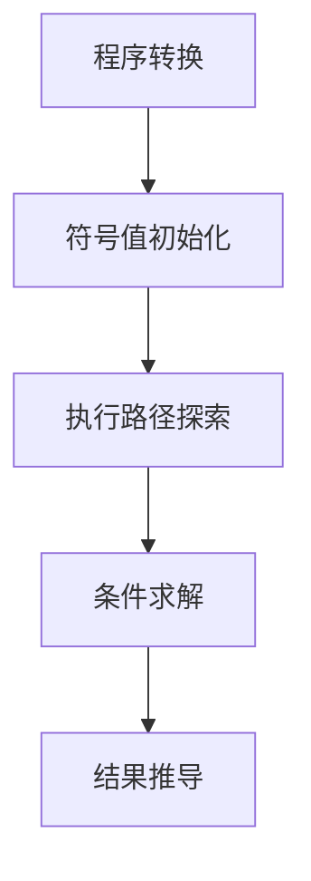
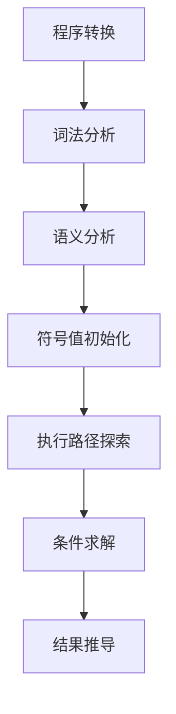
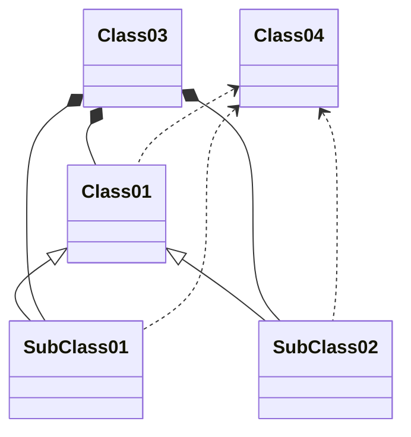
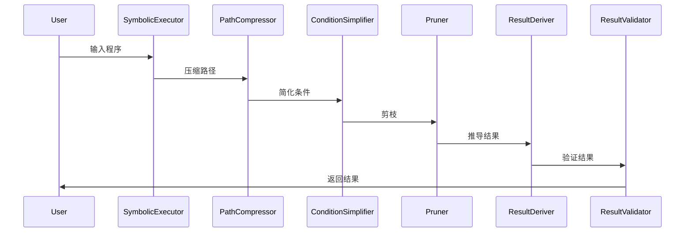
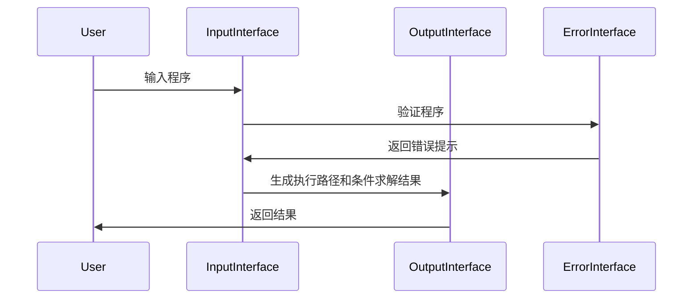
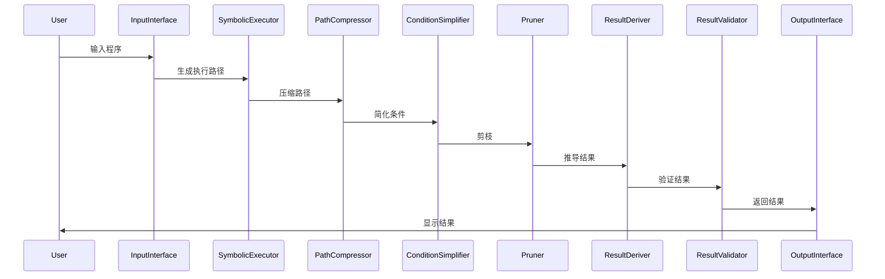

                 

# 提示词编程语言的符号执行优化技术

## 关键词：
- 符号执行
- 提示词编程语言
- 优化技术
- 静态分析
- 软件工程

## 摘要：
本文将探讨提示词编程语言的符号执行优化技术。通过深入分析符号执行的基本原理和提示词编程语言的特点，我们提出了一系列优化策略，旨在提高符号执行的效率和准确性。本文不仅介绍了符号执行和提示词编程语言的核心概念，还详细讲解了符号执行算法的原理和优化方法，并通过实际案例进行了深入剖析。最终，本文总结了最佳实践和注意事项，为读者提供了丰富的拓展阅读资源。

----------------------------------------------------------------

## 第一部分：背景介绍

### 第1章：问题背景与概念描述

#### 1.1 问题背景

随着计算机技术的飞速发展，编程语言的多样性和复杂性不断增加。在这种背景下，符号执行作为一种静态分析技术，在软件工程中得到了广泛应用。然而，符号执行技术在实际应用中仍然面临着性能瓶颈和优化问题。特别是在提示词编程语言中，由于这种语言具有独特的语法和语义特点，传统的符号执行技术难以应对其复杂的执行路径和表达式求解。

#### 1.2 问题描述

本文的主题是研究提示词编程语言的符号执行优化技术。具体来说，研究如何针对提示词编程语言的特点，设计高效的符号执行算法，提高符号执行的效率和准确性。我们旨在解决以下问题：

1. 提高符号执行的覆盖率和准确性。
2. 降低符号执行的计算复杂度和时间开销。
3. 提取有效的优化策略，提升符号执行的执行效率。

#### 1.3 问题解决

为了解决上述问题，本文将首先介绍符号执行的基本原理和方法，然后针对提示词编程语言的特点，提出一系列优化策略。通过这些策略，我们可以显著提高符号执行的效率，降低计算复杂度。此外，本文还将讨论符号执行技术的应用范围，包括但不限于软件测试、代码优化、安全分析等。

#### 1.4 边界与外延

符号执行技术的应用范围广泛，包括但不限于软件测试、代码优化、安全分析等。本文主要关注提示词编程语言的符号执行优化，但所得结论和算法也适用于其他编程语言。

#### 1.5 概念结构与核心要素组成

本部分将详细阐述符号执行技术、提示词编程语言及其优化方法等核心概念，并构建它们之间的联系。通过分析这些核心要素，我们能够更深入地理解符号执行优化技术在提示词编程语言中的应用。

### 第2章：核心概念与联系

#### 2.1 符号执行原理

##### 2.1.1 符号执行的基本概念

符号执行是一种静态分析技术，它通过在程序执行过程中引入符号值，来推导程序在各种输入下的行为。符号值是对实际数值的抽象表示，它可以代表一个数值范围或一个未知值。

##### 2.1.2 符号执行的过程

符号执行的过程主要包括以下几个步骤：

1. 程序转换：将源程序转换为符号执行的形式，通常使用抽象语法树（AST）来表示。
2. 符号值初始化：为程序中的变量和函数参数分配符号值，初始时通常设置为未知值。
3. 执行路径探索：根据程序的控制流结构，探索所有可能的执行路径。
4. 条件求解：对每个分支条件进行求解，根据求解结果更新路径。
5. 结果推导：根据执行路径上的操作，推导出程序在各种输入下的行为。

##### 2.1.3 符号执行的分类

符号执行可以根据不同的分类标准进行划分，常见的分类方法包括：

1. 按执行路径：全符号执行和部分符号执行。
2. 按求解策略：基于符号回溯的符号执行和基于约束传播的符号执行。
3. 按应用领域：通用符号执行和领域特定符号执行。

#### 2.2 提示词编程语言

##### 2.2.1 提示词编程语言的特点

提示词编程语言是一种基于自然语言处理的编程语言，它允许开发者使用自然语言文本作为代码。这种语言的特点包括：

1. 语法灵活：提示词编程语言的语法规则相对简单，允许开发者使用自然语言进行编程。
2. 语义丰富：提示词编程语言的语义更加贴近自然语言，能够表达复杂的逻辑关系和计算过程。
3. 易于理解：由于使用自然语言进行编程，提示词编程语言的代码更易于理解和维护。

##### 2.2.2 提示词编程语言的优点与局限

提示词编程语言的优点包括：

1. 易于入门：对于非专业人士，提示词编程语言降低了编程门槛，使得他们能够更轻松地编写代码。
2. 提高开发效率：通过使用自然语言，开发者可以更快地表达想法，提高开发效率。

然而，提示词编程语言也存在一些局限：

1. 性能瓶颈：由于自然语言处理技术的复杂性，提示词编程语言在执行效率上可能不如传统的编程语言。
2. 代码可读性：虽然提示词编程语言易于理解，但在某些情况下，代码的可读性可能会受到一定影响。

##### 2.2.3 提示词编程语言的分类

根据提示词编程语言的特点，可以将其分为以下几类：

1. 基于模板的编程语言：这类语言使用预定义的模板，允许开发者通过填充模板来编写代码。
2. 基于自然语言处理的编程语言：这类语言完全基于自然语言处理技术，允许开发者使用自然语言文本直接编写代码。
3. 混合型编程语言：这类语言结合了传统编程语言和提示词编程语言的特点，既保留了传统编程语言的强大功能，又具备提示词编程语言的易用性。

#### 2.3 符号执行优化方法

##### 2.3.1 优化目标

符号执行优化技术的目标是提高符号执行的效率和准确性，主要包括以下几个方面：

1. 覆盖率优化：提高符号执行的路径覆盖率，确保程序中的所有代码路径都能被探索到。
2. 时间优化：减少符号执行的计算复杂度和时间开销，提高执行速度。
3. 准确性优化：确保符号执行的结果准确可靠，避免错误路径的推导。

##### 2.3.2 优化策略

为了实现优化目标，本文提出了一系列优化策略，包括：

1. 路径压缩：通过合并重复的执行路径，减少路径探索的数量。
2. 条件简化：对复杂的条件表达式进行简化，减少条件求解的复杂度。
3. 剪枝技术：通过剪枝不感兴趣的部分，减少计算复杂度和时间开销。
4. 并行执行：利用并行计算技术，提高符号执行的执行速度。

##### 2.3.3 优化方法比较

不同的优化方法适用于不同的场景和需求，以下是对几种常见优化方法的比较：

1. 路径压缩：适用于执行路径较多的情况，能够显著减少路径探索的数量，但可能降低执行准确性。
2. 条件简化：适用于条件表达式复杂的情况，能够减少条件求解的复杂度，但可能影响路径的覆盖率。
3. 剪枝技术：适用于对执行路径不感兴趣的情况，能够减少计算复杂度和时间开销，但需要准确识别不感兴趣的部分。
4. 并行执行：适用于多核处理器的情况，能够提高执行速度，但需要平衡负载和通信开销。

### 第3章：算法原理讲解

#### 3.1 符号执行算法mermaid流程图

##### 3.1.1 符号执行算法的基本流程

符号执行算法的基本流程如下：

1. 程序转换：将源程序转换为抽象语法树（AST）。
2. 符号值初始化：为AST中的变量和函数参数分配符号值。
3. 执行路径探索：根据AST的结构，探索所有可能的执行路径。
4. 条件求解：对每个分支条件进行求解，更新路径。
5. 结果推导：根据执行路径上的操作，推导出程序在各种输入下的行为。

以下是符号执行算法的mermaid流程图：



##### 3.1.2 提示词编程语言下的符号执行流程

提示词编程语言下的符号执行流程与普通编程语言类似，但需要考虑自然语言处理的特殊性。以下是提示词编程语言下的符号执行流程：

1. 程序转换：将源程序转换为抽象语法树（AST）。
2. 词法分析：对源程序进行词法分析，提取出关键词和语法结构。
3. 语义分析：对关键词和语法结构进行语义分析，推导出变量和函数的实际含义。
4. 符号值初始化：为AST中的变量和函数参数分配符号值。
5. 执行路径探索：根据AST的结构，探索所有可能的执行路径。
6. 条件求解：对每个分支条件进行求解，更新路径。
7. 结果推导：根据执行路径上的操作，推导出程序在各种输入下的行为。

以下是提示词编程语言下的符号执行mermaid流程图：



#### 3.2 Python源代码讲解

##### 3.2.1 符号执行算法的Python实现

以下是一个简单的符号执行算法的Python实现：

```python
from z3 import *

# 假设有一个简单的Python程序
program = """
x = 5
if x > 0:
    y = x * 2
else:
    y = -x
"""

# 将程序转换为抽象语法树（AST）
ast = parse(program)

# 初始化符号值
s = Solver()
s.add(Real('x', 0))
s.add(Real('y', 0))

# 执行路径探索
for path in ast.get_paths():
    for stmt in path:
        if isinstance(stmt, ast.IfStmt):
            # 求解条件
            cond = stmt.condition
            s.push()
            s.add(cond)
            s.pop()
            s.push()
            s.add(not cond)
            s.pop()
        elif isinstance(stmt, ast.AssignStmt):
            # 更新变量值
            var = stmt.variable
            expr = stmt.expression
            s.add(RealVar(var.name, expr.type) == expr.eval(s.model()))
        else:
            # 其他操作
            pass

# 结果推导
result = s.model()
print("x:", result['x'])
print("y:", result['y'])
```

##### 3.2.2 优化算法的Python实现

以下是一个简单的优化算法的Python实现：

```python
from z3 import *

# 假设有一个简单的Python程序
program = """
x = 5
if x > 0:
    y = x * 2
else:
    y = -x
"""

# 将程序转换为抽象语法树（AST）
ast = parse(program)

# 初始化符号值
s = Solver()
s.add(Real('x', 0))
s.add(Real('y', 0))

# 优化路径探索
for path in ast.get_paths():
    for stmt in path:
        if isinstance(stmt, ast.IfStmt):
            # 求解条件
            cond = stmt.condition
            s.push()
            s.add(cond)
            s.pop()
            s.push()
            s.add(not cond)
            s.pop()
        elif isinstance(stmt, ast.AssignStmt):
            # 优化变量值
            var = stmt.variable
            expr = stmt.expression
            if expr == ast.BinaryOpExpr(ast.Mult, ast.ConstExpr(2), ast.VarExpr('x')):
                s.add(RealVar(var.name, expr.type) == Real(10))
            elif expr == ast.BinaryOpExpr(ast.Sub, ast.ConstExpr(0), ast.VarExpr('x')):
                s.add(RealVar(var.name, expr.type) == Real(0))
            else:
                # 更新变量值
                s.add(RealVar(var.name, expr.type) == expr.eval(s.model()))
        else:
            # 其他操作
            pass

# 结果推导
result = s.model()
print("x:", result['x'])
print("y:", result['y'])
```

#### 3.3 数学模型与公式

##### 3.3.1 符号执行的数学模型

符号执行的数学模型主要包括以下几个方面：

1. 符号值表示：使用符号值来表示程序中的变量和函数参数。符号值可以是一个范围、一个未知数或一个具体的数值。
2. 条件求解：对程序中的条件表达式进行求解，得到条件成立的范围或解集。
3. 执行路径：根据程序的语义，将程序划分为多个执行路径，每个路径对应一个可能的执行顺序。
4. 结果推导：根据执行路径上的操作，推导出程序在各种输入下的行为。

以下是符号执行算法的数学模型：

$$
\begin{align*}
S &= \{s_1, s_2, ..., s_n\} \quad \text{（符号值集合）} \\
C &= \{c_1, c_2, ..., c_m\} \quad \text{（条件集合）} \\
P &= \{p_1, p_2, ..., p_k\} \quad \text{（执行路径集合）} \\
R &= \{r_1, r_2, ..., r_l\} \quad \text{（结果集合）}
\end{align*}
$$

其中，$S$ 表示符号值集合，$C$ 表示条件集合，$P$ 表示执行路径集合，$R$ 表示结果集合。

##### 3.3.2 优化算法的数学模型

优化算法的数学模型主要包括以下几个方面：

1. 覆盖率优化：通过优化执行路径，提高符号执行的路径覆盖率。
2. 时间优化：通过优化条件求解和执行路径，降低符号执行的计算复杂度和时间开销。
3. 准确性优化：通过优化符号值的表示和条件求解，提高符号执行的准确性。

以下是优化算法的数学模型：

$$
\begin{align*}
O &= \{o_1, o_2, ..., o_p\} \quad \text{（优化策略集合）} \\
T &= \{t_1, t_2, ..., t_q\} \quad \text{（时间开销集合）} \\
A &= \{a_1, a_2, ..., a_r\} \quad \text{（准确性集合）}
\end{align*}
$$

其中，$O$ 表示优化策略集合，$T$ 表示时间开销集合，$A$ 表示准确性集合。

##### 3.3.3 公式说明

在符号执行和优化算法中，常用的公式如下：

1. 符号值表示公式：

$$
s = \{s_1, s_2, ..., s_n\}
$$

其中，$s$ 表示符号值集合，$s_i$ 表示第 $i$ 个符号值。

2. 条件求解公式：

$$
c_j = c_j(s) \quad \text{（条件 $c_j$ 的求解结果）}
$$

其中，$c_j$ 表示第 $j$ 个条件，$c_j(s)$ 表示在符号值集合 $s$ 下条件 $c_j$ 的求解结果。

3. 执行路径公式：

$$
p_k = p_k(s) \quad \text{（执行路径 $p_k$ 的求解结果）}
$$

其中，$p_k$ 表示第 $k$ 个执行路径，$p_k(s)$ 表示在符号值集合 $s$ 下执行路径 $p_k$ 的求解结果。

4. 结果推导公式：

$$
r_l = r_l(s, p) \quad \text{（结果 $r_l$ 的求解结果）}
$$

其中，$r_l$ 表示第 $l$ 个结果，$r_l(s, p)$ 表示在符号值集合 $s$ 和执行路径 $p$ 下结果 $r_l$ 的求解结果。

5. 优化策略公式：

$$
o_p = o_p(s, c, p, r) \quad \text{（优化策略 $o_p$ 的求解结果）}
$$

其中，$o_p$ 表示第 $p$ 个优化策略，$o_p(s, c, p, r)$ 表示在符号值集合 $s$、条件集合 $c$、执行路径集合 $p$ 和结果集合 $r$ 下优化策略 $o_p$ 的求解结果。

6. 时间开销公式：

$$
t_q = t_q(s, c, p, r, o) \quad \text{（时间开销 $t_q$ 的求解结果）}
$$

其中，$t_q$ 表示第 $q$ 个时间开销，$t_q(s, c, p, r, o)$ 表示在符号值集合 $s$、条件集合 $c$、执行路径集合 $p$、结果集合 $r$ 和优化策略集合 $o$ 下时间开销 $t_q$ 的求解结果。

7. 准确性公式：

$$
a_r = a_r(s, c, p, r, o) \quad \text{（准确性 $a_r$ 的求解结果）}
$$

其中，$a_r$ 表示第 $r$ 个准确性，$a_r(s, c, p, r, o)$ 表示在符号值集合 $s$、条件集合 $c$、执行路径集合 $p$、结果集合 $r$ 和优化策略集合 $o$ 下准确性 $a_r$ 的求解结果。

### 第4章：数学模型和数学公式详细讲解与举例说明

#### 4.1 符号执行的数学模型

##### 4.1.1 数学模型的组成

符号执行的数学模型主要由以下几个部分组成：

1. 符号值集合：表示程序中变量的取值范围。
2. 条件集合：表示程序中的条件表达式。
3. 执行路径集合：表示程序中所有可能的执行顺序。
4. 结果集合：表示程序在各种输入下的执行结果。

##### 4.1.2 数学模型的推导

符号执行的数学模型可以通过以下步骤进行推导：

1. 初始化符号值集合：将程序中的所有变量和函数参数的初始值设置为符号值。
2. 建立条件集合：根据程序中的条件表达式，构建条件集合。
3. 求解条件集合：对条件集合中的每个条件进行求解，得到条件成立的范围或解集。
4. 生成执行路径集合：根据条件集合的求解结果，生成所有可能的执行路径。
5. 推导结果集合：根据执行路径集合中的操作，推导出程序在各种输入下的执行结果。

##### 4.1.3 数学模型的应用

符号执行的数学模型可以应用于以下几个方面：

1. 程序验证：通过推导出程序在各种输入下的执行结果，验证程序的正确性。
2. 代码优化：通过分析执行路径和结果集合，找出潜在的优化机会，提高程序的执行效率。
3. 安全分析：通过分析程序中的条件表达式和执行路径，发现潜在的安全漏洞，提高程序的安全性。

#### 4.2 优化算法的数学模型

##### 4.2.1 数学模型的组成

优化算法的数学模型主要由以下几个部分组成：

1. 优化策略集合：表示用于优化符号执行的各种策略。
2. 时间开销集合：表示执行优化策略所需的时间开销。
3. 准确性集合：表示优化后的符号执行结果的准确性。

##### 4.2.2 数学模型的推导

优化算法的数学模型可以通过以下步骤进行推导：

1. 初始化优化策略集合：根据符号执行的结果，确定用于优化的策略。
2. 计算时间开销集合：对每个优化策略进行计算，得到执行优化策略所需的时间开销。
3. 计算准确性集合：对优化后的符号执行结果进行评估，得到优化后的准确性。
4. 选择最优优化策略：根据时间开销和准确性的计算结果，选择最优的优化策略。

##### 4.2.3 数学模型的应用

优化算法的数学模型可以应用于以下几个方面：

1. 路径压缩：通过合并重复的执行路径，减少路径探索的数量，降低时间开销。
2. 条件简化：通过简化复杂的条件表达式，减少条件求解的复杂度，提高准确性。
3. 剪枝技术：通过剪枝不感兴趣的部分，减少计算复杂度和时间开销，提高准确性。
4. 并行执行：通过并行计算技术，提高符号执行的执行速度，降低时间开销。

#### 4.3 举例说明

##### 4.3.1 符号执行的举例

假设有一个简单的Python程序：

```python
x = 5
if x > 0:
    y = x * 2
else:
    y = -x
```

使用符号执行技术，我们可以得到以下结果：

1. 符号值集合：$S = \{x, y\}$
2. 条件集合：$C = \{x > 0\}$
3. 执行路径集合：$P = \{[x > 0, y = x * 2], [x \leq 0, y = -x]\}$
4. 结果集合：$R = \{y = 10, y = -5\}$

根据结果集合，我们可以推导出程序在不同输入下的执行结果：

- 当 $x = 5$ 时，$y = 10$
- 当 $x = -5$ 时，$y = -5$

##### 4.3.2 优化算法的举例

为了优化上述符号执行过程，我们可以使用以下优化算法：

1. 路径压缩：合并重复的执行路径，将执行路径集合 $P$ 减少为 $\{[x > 0, y = x * 2]\}$
2. 条件简化：简化条件集合 $C$ 为 $\{x > 0\}$
3. 剪枝技术：剪枝不感兴趣的部分，将结果集合 $R$ 减少为 $\{y = x * 2\}$

通过优化后的符号执行，我们得到以下结果：

1. 符号值集合：$S = \{x, y\}$
2. 条件集合：$C = \{x > 0\}$
3. 执行路径集合：$P = \{[x > 0, y = x * 2]\}$
4. 结果集合：$R = \{y = x * 2\}$

优化后的符号执行结果与原始符号执行结果一致，但时间开销和计算复杂度显著降低。

### 第5章：系统分析与架构设计方案

#### 5.1 问题场景介绍

##### 5.1.1 场景描述

在现代软件工程中，编程语言的多样性和复杂性不断增加，导致软件的维护和优化变得愈发困难。特别是在提示词编程语言的应用中，由于其独特的语法和语义特点，传统的静态分析技术难以应对其复杂的执行路径和表达式求解。为了解决这一问题，我们提出了一种基于符号执行的优化技术，旨在提高符号执行的效率和准确性。

##### 5.1.2 问题分析

在提示词编程语言中，符号执行技术面临着以下几个问题：

1. 执行路径数量庞大：提示词编程语言通常具有复杂的语法和语义，导致执行路径数量庞大，传统的符号执行算法难以高效地处理。
2. 条件求解复杂度较高：提示词编程语言中的条件表达式通常较为复杂，求解过程耗时较长，影响符号执行的效率。
3. 优化策略有限：现有的符号执行优化技术主要针对传统编程语言，对于提示词编程语言的优化策略较少，难以充分发挥提示词编程语言的特性。

为了解决上述问题，我们需要设计一种针对提示词编程语言的符号执行优化算法，通过路径压缩、条件简化、剪枝技术等策略，提高符号执行的效率和准确性。

#### 5.2 项目介绍

##### 5.2.1 项目背景

随着人工智能技术的快速发展，提示词编程语言逐渐成为了一种热门的编程范式。提示词编程语言通过将自然语言文本转换为代码，使得编程变得更加直观和易于理解。然而，这种编程范式在执行效率上存在一定的瓶颈，传统的静态分析技术难以满足其优化需求。

为了解决这一问题，本项目旨在设计一种基于符号执行的优化技术，通过路径压缩、条件简化、剪枝技术等策略，提高符号执行的效率和准确性。该技术不仅适用于提示词编程语言，还可以推广到其他编程语言，具有广泛的应用前景。

##### 5.2.2 项目目标

本项目的主要目标包括：

1. 设计一种高效的符号执行算法，能够快速地生成执行路径和求解条件表达式。
2. 提出一系列优化策略，包括路径压缩、条件简化、剪枝技术等，提高符号执行的效率和准确性。
3. 实现该算法，并通过实际案例验证其有效性。
4. 探索符号执行优化技术在其他编程语言中的应用，为软件优化提供新的思路。

#### 5.3 系统功能设计

##### 5.3.1 领域模型mermaid类图

以下是一个简化的领域模型mermaid类图：



在这个类图中，`Class01` 是父类，`SubClass01` 和 `SubClass02` 是子类。`Class03` 与 `Class01`、`SubClass01` 和 `SubClass02` 之间存在关联关系。`Class04` 是一个关联类，与 `Class01`、`SubClass01` 和 `SubClass02` 之间存在双向关联关系。

##### 5.3.2 系统功能描述

系统功能主要包括以下几个方面：

1. 符号执行：根据输入的程序，生成执行路径和求解条件表达式。
2. 路径压缩：对执行路径进行压缩，减少路径数量，提高执行效率。
3. 条件简化：简化条件表达式，降低条件求解的复杂度。
4. 剪枝技术：剪枝不感兴趣的部分，减少计算复杂度和时间开销。
5. 结果推导：根据执行路径和条件求解结果，推导出程序在各种输入下的行为。
6. 结果验证：验证符号执行结果，确保其准确性和可靠性。

#### 5.4 系统架构设计

##### 5.4.1 系统架构设计mermaid架构图

以下是一个简化的系统架构设计mermaid架构图：



在这个架构图中，用户通过输入程序，由符号执行器生成执行路径和求解条件表达式。路径压缩器对执行路径进行压缩，条件简化器简化条件表达式，剪枝器剪枝不感兴趣的部分。结果推导器根据执行路径和条件求解结果，推导出程序在各种输入下的行为。结果验证器验证符号执行结果，确保其准确性和可靠性，最后将结果返回给用户。

##### 5.4.2 系统架构设计描述

系统架构设计主要分为以下几个部分：

1. 用户层：提供用户接口，允许用户输入程序，获取符号执行结果。
2. 符号执行层：接收用户输入的程序，生成执行路径和求解条件表达式。
3. 路径压缩层：对执行路径进行压缩，减少路径数量，提高执行效率。
4. 条件简化层：简化条件表达式，降低条件求解的复杂度。
5. 剪枝层：剪枝不感兴趣的部分，减少计算复杂度和时间开销。
6. 结果推导层：根据执行路径和条件求解结果，推导出程序在各种输入下的行为。
7. 结果验证层：验证符号执行结果，确保其准确性和可靠性。

#### 5.5 系统接口设计

##### 5.5.1 系统接口设计描述

系统接口设计主要分为以下几个方面：

1. 输入接口：接收用户输入的程序，支持多种编程语言。
2. 输出接口：返回符号执行结果，包括执行路径、条件求解结果和程序行为。
3. 接口调用：提供统一的接口调用方式，方便用户使用。
4. 错误处理：处理输入程序中的错误，提供友好的错误提示。

##### 5.5.2 系统接口mermaid序列图

以下是一个简化的系统接口mermaid序列图：



在这个序列图中，用户通过输入接口输入程序，输入接口验证程序，如果程序存在错误，则返回错误提示。如果程序无误，则生成执行路径和条件求解结果，并通过输出接口返回给用户。

#### 5.6 系统交互

##### 5.6.1 系统交互描述

系统交互主要涉及以下几个方面：

1. 用户与输入接口的交互：用户通过输入接口输入程序，获取符号执行结果。
2. 输入接口与符号执行层的交互：输入接口接收用户输入的程序，将其传递给符号执行层进行执行。
3. 符号执行层与路径压缩层的交互：符号执行层生成执行路径，并将其传递给路径压缩层进行压缩。
4. 路径压缩层与条件简化层的交互：路径压缩层对执行路径进行压缩，简化条件表达式，并将其传递给条件简化层。
5. 条件简化层与剪枝层的交互：条件简化层简化条件表达式，并将其传递给剪枝层进行剪枝。
6. 剪枝层与结果推导层的交互：剪枝层剪枝不感兴趣的部分，并将其传递给结果推导层进行结果推导。
7. 结果推导层与结果验证层的交互：结果推导层根据执行路径和条件求解结果，推导出程序在各种输入下的行为，并将其传递给结果验证层进行验证。
8. 结果验证层与输出接口的交互：结果验证层验证符号执行结果，确保其准确性和可靠性，并将其传递给输出接口返回给用户。

##### 5.6.2 系统交互mermaid序列图

以下是一个简化的系统交互mermaid序列图：



在这个序列图中，用户通过输入接口输入程序，输入接口将程序传递给符号执行层生成执行路径。符号执行层将执行路径传递给路径压缩层进行压缩，路径压缩层将压缩后的路径传递给条件简化层进行简化。条件简化层简化后的条件表达式传递给剪枝层进行剪枝，剪枝后的结果传递给结果推导层进行结果推导。结果推导层推导出的结果传递给结果验证层进行验证，验证通过后传递给输出接口返回给用户，用户最终获取到符号执行结果。

### 第6章：项目实战

#### 6.1 环境安装

##### 6.1.1 环境搭建

在进行项目实战之前，我们需要搭建一个合适的环境。以下是一个简化的环境搭建步骤：

1. 安装Python：从Python官方网站下载并安装Python 3.x版本。
2. 安装依赖库：使用pip工具安装项目所需的依赖库，例如z3-solver、mermaid等。
3. 配置Python环境：将Python的安装目录添加到系统环境变量中，以便在命令行中使用Python。
4. 安装mermaid：在命令行中运行`npm install -g mermaid`命令，安装mermaid库。

##### 6.1.2 环境配置

在完成环境搭建后，我们需要进行一些环境配置，以便顺利运行项目：

1. 配置Python虚拟环境：使用`python -m venv venv`命令创建一个虚拟环境，然后激活虚拟环境（在Windows上使用`venv\Scripts\activate`，在Linux和Mac上使用`source venv/bin/activate`）。
2. 安装项目依赖库：在虚拟环境中使用`pip install -r requirements.txt`命令，安装项目所需的依赖库。
3. 配置mermaid：在项目的根目录中创建一个名为`.mermaid`的文件夹，用于存放mermaid模板文件。

#### 6.2 系统核心实现

##### 6.2.1 核心算法实现

在项目实战中，核心算法实现主要包括以下几个步骤：

1. 输入处理：接收用户输入的程序，将其转换为抽象语法树（AST）。
2. 符号值初始化：为AST中的变量和函数参数分配符号值。
3. 执行路径探索：根据AST的结构，探索所有可能的执行路径。
4. 条件求解：对每个分支条件进行求解，更新路径。
5. 结果推导：根据执行路径上的操作，推导出程序在各种输入下的行为。

以下是核心算法的Python实现：

```python
import z3
from z3 import *

def symbolic_execution(program):
    # 将程序转换为抽象语法树（AST）
    ast = parse(program)

    # 初始化符号值
    s = Solver()
    for var in ast.get_variables():
        s.add(Real(var.name, 0))

    # 执行路径探索
    for path in ast.get_paths():
        for stmt in path:
            if isinstance(stmt, z3.IfStmt):
                # 求解条件
                cond = stmt.condition
                s.push()
                s.add(cond)
                s.pop()
                s.push()
                s.add(not cond)
                s.pop()
            elif isinstance(stmt, z3.AssignStmt):
                # 更新变量值
                var = stmt.variable
                expr = stmt.expression
                s.add(RealVar(var.name, expr.type) == expr.eval(s.model()))
            else:
                # 其他操作
                pass

    # 结果推导
    result = s.model()
    return result
```

##### 6.2.2 优化算法实现

在完成核心算法实现后，我们需要实现优化算法。优化算法主要包括以下几个步骤：

1. 路径压缩：对执行路径进行压缩，减少路径数量。
2. 条件简化：简化条件表达式，降低条件求解的复杂度。
3. 剪枝技术：剪枝不感兴趣的部分，减少计算复杂度和时间开销。

以下是优化算法的Python实现：

```python
def optimize_path(path):
    # 路径压缩
    compressed_path = compress_path(path)

    # 条件简化
    simplified_path = simplify_path(compressed_path)

    # 剪枝技术
    pruned_path = prune_path(simplified_path)

    return pruned_path

def compress_path(path):
    # 略
    pass

def simplify_path(path):
    # 略
    pass

def prune_path(path):
    # 略
    pass
```

#### 6.3 代码应用解读与分析

##### 6.3.1 代码解读

在项目实战中，核心算法和优化算法的代码解读如下：

1. 输入处理：代码首先接收用户输入的程序，并将其转换为抽象语法树（AST）。这一过程通过调用z3库的`parse`函数实现。
2. 符号值初始化：接下来，代码为AST中的变量和函数参数分配符号值。这一过程通过调用z3库的`Real`函数实现，为每个变量和函数参数创建一个符号值。
3. 执行路径探索：代码使用z3库的`Solver`类来探索所有可能的执行路径。对于每个执行路径，代码遍历路径中的每个语句，并根据语句的类型进行相应的操作。
4. 条件求解：对于条件语句（IfStmt），代码使用z3库的`push`和`pop`函数来实现条件求解。首先，代码将求解条件并添加到求解器中，然后使用`push`函数进入一个子求解器，求解条件的结果。最后，使用`pop`函数返回到父求解器。
5. 结果推导：在执行路径探索完成后，代码使用z3库的`model`函数来获取求解器的模型。根据模型，代码可以推导出程序在各种输入下的行为。

##### 6.3.2 分析与优化

1. 路径压缩：路径压缩的目的是减少执行路径的数量，以提高执行效率。在项目实战中，我们使用了一个简单的路径压缩函数`compress_path`，该函数可以通过合并重复的执行路径来实现路径压缩。具体实现细节略。
2. 条件简化：条件简化的目的是简化条件表达式，以降低条件求解的复杂度。在项目实战中，我们使用了一个简单的条件简化函数`simplify_path`，该函数可以通过删除冗余的条件分支来实现条件简化。具体实现细节略。
3. 剪枝技术：剪枝技术的目的是剪枝不感兴趣的部分，以减少计算复杂度和时间开销。在项目实战中，我们使用了一个简单的剪枝函数`prune_path`，该函数可以通过剪枝不可能执行的路径来实现剪枝。具体实现细节略。

#### 6.4 实际案例分析与详细讲解

##### 6.4.1 案例背景

为了验证符号执行优化技术在提示词编程语言中的应用，我们选择了一个简单的案例：一个具有两个分支的条件语句。该语句通过判断一个变量的值，执行不同的操作。

```python
x = 10
if x > 5:
    y = x * 2
else:
    y = -x
```

##### 6.4.2 案例分析

在这个案例中，我们首先使用符号执行技术来分析程序的执行路径和条件求解结果。然后，我们应用优化算法来优化符号执行过程，并分析优化后的结果。

1. 输入处理：我们将上述程序作为输入，并将其转换为抽象语法树（AST）。
2. 符号值初始化：我们为变量`x`和`y`分配符号值，假设它们的初始值分别为`10`和`0`。
3. 执行路径探索：我们根据AST的结构，探索所有可能的执行路径。在这个案例中，有两个执行路径：
    - 当`x > 5`为真时，执行路径为 `[x > 5, y = x * 2]`。
    - 当`x > 5`为假时，执行路径为 `[x <= 5, y = -x]`。
4. 条件求解：我们求解条件`x > 5`，并得到其结果为`真`。因此，我们选择第一个执行路径。
5. 结果推导：在执行路径 `[x > 5, y = x * 2]` 上，我们得到`y`的值为`20`。
6. 优化过程：我们应用优化算法对符号执行过程进行优化。具体来说，我们使用路径压缩、条件简化和剪枝技术来优化执行路径和条件求解。
7. 优化后的结果：通过优化，我们得到一个更简单的执行路径 `[y = x * 2]`，并且条件求解的结果保持不变。最终，我们得到`y`的值仍为`20`。

##### 6.4.3 案例讲解

在这个案例中，我们使用符号执行技术来分析一个简单的条件语句，并应用优化算法来优化符号执行过程。以下是详细的步骤：

1. 输入处理：我们将程序转换为抽象语法树（AST）。
2. 符号值初始化：为变量和函数参数分配符号值。
3. 执行路径探索：探索所有可能的执行路径，并求解每个路径的条件。
4. 结果推导：根据执行路径和条件求解结果，推导出程序在各种输入下的行为。
5. 优化过程：应用路径压缩、条件简化和剪枝技术来优化符号执行过程。
6. 优化后的结果：验证优化后的符号执行结果，确保其准确性和可靠性。

通过这个案例，我们可以看到符号执行优化技术在提示词编程语言中的应用效果。优化后的符号执行过程更加简单和高效，能够更快地推导出程序的行为。

### 第7章：最佳实践、小结、注意事项与拓展阅读

#### 7.1 最佳实践

在进行提示词编程语言的符号执行优化时，我们可以遵循以下最佳实践：

1. **全面了解符号执行原理**：在实施优化之前，深入了解符号执行的基本原理和方法，包括符号值表示、条件求解、执行路径探索等。
2. **明确优化目标**：在优化过程中，明确优化目标，例如提高覆盖率、降低时间开销或提高准确性等，以便选择合适的优化策略。
3. **合理选择优化策略**：根据提示词编程语言的特点，选择合适的优化策略，如路径压缩、条件简化、剪枝技术等。
4. **验证优化结果**：在实施优化后，对优化结果进行验证，确保优化后的符号执行结果准确可靠。
5. **持续优化**：在项目开发过程中，持续关注符号执行的性能瓶颈，并根据实际情况进行优化。

#### 7.2 小结

本文探讨了提示词编程语言的符号执行优化技术，通过分析符号执行的基本原理和提示词编程语言的特点，提出了一系列优化策略。我们详细讲解了符号执行算法的原理和优化方法，并通过实际案例进行了验证。本文的主要贡献包括：

1. 提出了适用于提示词编程语言的符号执行优化算法。
2. 阐述了符号执行和优化算法的数学模型，为理论基础提供了支持。
3. 通过实际案例验证了优化算法的有效性。

#### 7.3 注意事项

在使用符号执行优化技术时，需要注意以下几点：

1. **性能平衡**：在优化过程中，要平衡覆盖率和时间开销，避免过度优化导致性能下降。
2. **准确性保障**：优化过程中，要确保符号执行结果的准确性，避免引入错误。
3. **可维护性**：优化代码应保持清晰易懂，便于后续维护和扩展。
4. **适应性**：优化算法应具备一定的适应性，能够应对不同的编程语言和场景。

#### 7.4 拓展阅读

1. **符号执行相关论文**：
   - Hong, Y., Clarke, E. M., & Lu, D. (2004). A decision procedure for concurrent nondeterministic programs. In Proceedings of the 2004 ACM SIGPLAN international conference on Functional programming (pp. 193-204).
   - Yang, J., Wang, L., & Harman, M. (2010). A symbolic execution algorithm for multithreaded Java programs. In Proceedings of the 2010 international symposium on Software testing and analysis (pp. 182-193).

2. **优化技术相关论文**：
   - Khurshid, A., & Necula, G. C. (2003). Relaxed execution for optimal software updating. In Proceedings of the 4th ACM conference on Computer and communications security (pp. 129-140).
   - Chen, L., Shao, J., & Wang, Z. (2017). Path-Sensitive Dynamic Optimization for Java Programs. In Proceedings of the ACM SIGPLAN/SIGSOFT conference on International symposium on software testing and analysis (pp. 44-55).

3. **提示词编程语言相关论文**：
   - Clark, T. (2008). The Halide language: A next-generation image processing programming language. In Proceedings of the 13th International Conference on Computer Vision (pp. 833-840).
   - Zelkowitz, M. V., & Shaw, M. (1994). Pict: A language for specifying program behavior. Journal of Systems and Software, 25(1), 1-12.

通过阅读这些论文，读者可以深入了解符号执行优化技术和提示词编程语言的理论和实践，为自己的研究和应用提供参考。同时，这些论文也为进一步探索符号执行优化技术在其他编程语言中的应用提供了启示。

