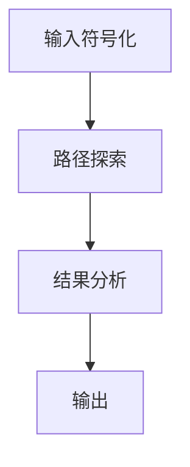

                 

# 提示词编程语言的符号执行技术

## 关键词

- 提示词编程语言
- 符号执行技术
- 编程算法
- 安全性分析
- 性能优化

## 摘要

本文旨在深入探讨提示词编程语言中的符号执行技术。我们将从背景介绍、核心概念、算法原理、系统实现、案例分析以及未来展望等方面进行详细分析。符号执行作为一种重要的程序分析技术，在提示词编程语言的应用中显示出巨大的潜力。本文将帮助读者理解符号执行技术的原理和应用，以及如何在实际项目中运用这一技术来提升编程语言的安全性和性能。

----------------------------------------------------------------

## 目录大纲设计思路

### 1. 明确书籍主题

首先，我们需要明确书籍的主题，即“提示词编程语言的符号执行技术”。这意味着书籍的核心内容将围绕符号执行技术展开，特别是它在提示词编程语言中的应用。

### 2. 确定书籍结构

接下来，我们需要确定书籍的整体结构。一般来说，技术书籍可以分为以下几个部分：

- 引言和背景介绍
- 核心概念与原理
- 算法原理与实现
- 系统架构与设计
- 实际项目应用
- 最佳实践与总结

### 3. 制定详细目录

在确定了书籍结构之后，我们需要为每一部分制定详细的目录。以下是初步的目录大纲：

### 第一部分：背景与引论

### 第1章 提示词编程语言概述

#### 1.1 提示词编程语言的基本概念

#### 1.2 提示词编程语言的兴起与发展

#### 1.3 符号执行技术的重要性

### 第2章 符号执行技术基础

#### 2.1 符号执行的定义与历史

#### 2.2 符号执行的原理与流程

#### 2.3 符号执行的类型与分类

### 第二部分：符号执行在提示词编程语言中的应用

### 第3章 提示词编程语言中的符号执行算法

#### 3.1 符号执行算法的设计原则

#### 3.2 主流符号执行算法介绍

#### 3.3 符号执行算法的性能优化

### 第4章 符号执行在提示词编程语言中的实现

#### 4.1 符号执行在提示词编程语言中的实现框架

#### 4.2 符号执行的关键技术点

#### 4.3 符号执行的实现挑战与解决方案

### 第三部分：案例分析

### 第5章 提示词编程语言中的符号执行案例分析

#### 5.1 案例背景与问题分析

#### 5.2 案例解决方案

#### 5.3 案例效果评估与总结

### 第6章 符号执行技术的未来展望

#### 6.1 提示词编程语言的发展趋势

#### 6.2 符号执行技术的未来研究方向

#### 6.3 企业与开发者应对策略

### 第四部分：最佳实践与总结

### 第7章 符号执行技术的最佳实践

#### 7.1 开发者视角下的符号执行实践

#### 7.2 企业在符号执行技术中的应用

#### 7.3 符号执行技术在不同领域的应用

### 第8章 总结与展望

#### 8.1 书籍内容回顾

#### 8.2 关键技术与知识点总结

#### 8.3 读者建议与拓展阅读

以上便是《提示词编程语言的符号执行技术》的初步目录大纲。

----------------------------------------------------------------

### 第一部分：背景与引论

## 第1章 提示词编程语言概述

### 1.1 提示词编程语言的基本概念

提示词编程语言（Prompt-based Programming Language）是一种基于自然语言处理（NLP）和机器学习（ML）技术的编程语言。与传统编程语言相比，它允许程序员通过编写自然语言文本（即提示词）来描述程序的行为和功能。这种语言的最大特点是将复杂的编程逻辑抽象为自然语言指令，从而简化编程过程，降低编程难度。

### 1.2 提示词编程语言的兴起与发展

提示词编程语言的兴起可以追溯到人工智能领域的迅速发展。随着深度学习和自然语言处理技术的进步，人们开始探索如何将自然语言与编程语言结合，从而实现更加直观和高效的编程。近年来，越来越多的研究者和开发者投入到这一领域，推出了一系列基于提示词的编程语言和工具。

### 1.3 符号执行技术的重要性

符号执行技术（Symbolic Execution）是一种重要的程序分析技术，它可以对程序进行动态分析，检测潜在的缺陷和漏洞。在提示词编程语言中，符号执行技术可以帮助我们验证程序的正确性，提高代码的质量和安全性。

### 1.4 本文结构

本文将分为四个主要部分：

1. 背景与引论：介绍提示词编程语言和符号执行技术的基本概念和重要性。
2. 核心概念与算法：详细探讨符号执行技术的原理和算法。
3. 应用与实践：分析符号执行技术在提示词编程语言中的具体应用案例。
4. 未来展望与最佳实践：讨论符号执行技术的未来发展方向和最佳实践。

接下来，我们将深入探讨符号执行技术的基础，为后续章节的内容做好铺垫。

## 第二部分：符号执行技术基础

## 第2章 符号执行技术基础

### 2.1 符号执行的定义与历史

符号执行技术（Symbolic Execution）是一种动态程序分析技术，它通过执行程序的不同路径来检测潜在的问题。在符号执行过程中，程序输入被表示为符号，而不是实际的值。当程序运行时，每个符号将根据实际执行路径的不同而取不同的值。

符号执行技术的概念最早由Alfred V. Aho、Ravi Sethi 和 Jeffrey D. Ullman 在1977年的论文《Compilers: Principles, Techniques, and Tools》中提出。自那以后，符号执行技术得到了广泛的研究和应用。

### 2.2 符号执行的原理与流程

符号执行的原理可以概括为以下几个步骤：

1. **输入符号化**：将程序的输入参数表示为符号。
2. **路径探索**：通过符号执行，程序会在不同的路径上执行，每个路径都会产生不同的执行结果。
3. **路径条件分析**：分析每个路径的执行结果，确定路径的条件。
4. **路径组合**：将所有可能的路径组合起来，形成完整的程序行为。
5. **结果分析**：分析最终的执行结果，检测程序中的错误或漏洞。

### 2.3 符号执行的类型与分类

根据符号执行的具体实现方式，可以分为以下几种类型：

1. **显式符号执行**：显式符号执行将程序的每一步都表示为符号运算。这种方式可以精确地模拟程序的行为，但效率较低。
2. **隐式符号执行**：隐式符号执行通过使用约束求解器来处理符号运算。这种方式在计算上更高效，但可能会引入精度问题。
3. **动态符号执行**：动态符号执行在程序的运行过程中动态地选择执行路径，并根据执行结果调整路径选择。这种方式可以更有效地探索程序的执行路径。

### 2.4 符号执行的优点与局限性

符号执行的优点包括：

- **路径多样性**：可以探索程序的所有可能的执行路径，提高错误检测的覆盖率。
- **代码质量**：通过符号执行，可以检测出潜在的错误和漏洞，提高代码的质量。
- **自动化**：符号执行过程可以自动化进行，减少人工分析的工作量。

但符号执行也存在一些局限性：

- **计算复杂度**：符号执行需要探索大量的路径，计算复杂度较高。
- **精度问题**：隐式符号执行可能会引入精度问题，影响分析结果的准确性。

接下来，我们将进一步探讨符号执行在提示词编程语言中的应用，以及如何利用这一技术来提升编程语言的安全性和性能。

## 第三部分：符号执行在提示词编程语言中的应用

## 第3章 提示词编程语言中的符号执行算法

### 3.1 符号执行算法的设计原则

在设计符号执行算法时，我们需要遵循以下原则：

- **路径多样性**：确保算法能够探索程序的所有可能执行路径。
- **计算效率**：优化算法的计算复杂度，提高执行效率。
- **结果准确性**：确保分析结果的准确性和可靠性。
- **易用性**：算法应易于实现和使用，降低开发者的学习成本。

### 3.2 主流符号执行算法介绍

目前，主流的符号执行算法包括：

1. **显式符号执行**：这种方式将程序的每一步都表示为符号运算。尽管计算复杂度较高，但可以提供精确的结果。
   
   ```python
   def symbolic_execution(code, input_symbols):
       # 将输入参数表示为符号
       # 执行代码，记录每一步的结果
       # 根据路径条件生成执行路径
       # 返回执行结果
       pass
   ```

2. **隐式符号执行**：这种方式使用约束求解器来处理符号运算。尽管可能在某些情况下引入精度问题，但计算效率更高。

   ```python
   from z3 import Solver

   def symbolic_execution(code, input_symbols):
       solver = Solver()
       # 将输入参数表示为约束
       # 执行代码，记录每一步的结果
       # 将执行结果转换为约束
       # 运行求解器，得到可能的解
       # 返回执行结果
       pass
   ```

3. **动态符号执行**：这种方式在程序的运行过程中动态地选择执行路径，并根据执行结果调整路径选择。

   ```python
   def dynamic_symbolic_execution(code, input_symbols):
       # 根据输入参数，选择初始执行路径
       # 执行代码，记录每一步的结果
       # 根据执行结果，调整执行路径
       # 返回执行结果
       pass
   ```

### 3.3 符号执行算法的性能优化

为了提高符号执行算法的性能，我们可以从以下几个方面进行优化：

1. **路径压缩**：通过识别和合并重复的路径，减少路径探索的数量。
   
2. **增量执行**：仅对有变化的路径进行执行，避免重复的计算。

3. **并行计算**：利用多核处理器，并行执行多个路径。

4. **缓存优化**：通过缓存中间结果，减少重复的计算。

5. **约束求解器优化**：选择合适的约束求解器，提高求解效率。

接下来，我们将探讨如何在实际的提示词编程语言中实现符号执行技术，以及面临的挑战和解决方案。

## 第四部分：实际应用与案例分析

## 第4章 符号执行在提示词编程语言中的实现

### 4.1 符号执行在提示词编程语言中的实现框架

在提示词编程语言中实现符号执行技术，需要构建一个包含以下几个关键组件的框架：

1. **解析器**：将自然语言文本（提示词）转换为抽象语法树（AST）。
2. **符号化模块**：将AST中的变量和表达式表示为符号。
3. **执行引擎**：根据符号化的AST执行程序，并记录每一步的结果。
4. **路径探索器**：探索所有可能的执行路径，并组合路径结果。
5. **结果分析器**：分析执行结果，检测潜在的错误和漏洞。

### 4.2 符号执行的关键技术点

在实现符号执行技术时，需要解决以下几个关键技术点：

1. **符号化**：如何将自然语言文本转换为符号化的表达式，是符号执行的基础。
2. **路径探索**：如何有效地探索所有可能的执行路径，是符号执行的核心。
3. **结果分析**：如何从大量的执行结果中识别出潜在的错误和漏洞，是符号执行的目标。

### 4.3 符号执行的实现挑战与解决方案

在实现符号执行技术时，可能会遇到以下挑战：

1. **计算复杂度**：符号执行需要探索大量的路径，计算复杂度较高。解决方法包括路径压缩、增量执行和并行计算。
2. **精度问题**：隐式符号执行可能会引入精度问题。解决方法包括选择合适的约束求解器和优化符号化过程。
3. **自然语言处理**：如何准确地将自然语言文本转换为符号化的表达式，是符号执行的关键。解决方法包括使用先进的自然语言处理技术和建立领域知识库。

### 4.4 实际项目应用案例

在本节中，我们将通过一个实际项目案例，展示如何在实际的提示词编程语言中实现符号执行技术。

#### 案例背景

假设我们有一个基于自然语言处理的任务管理系统，用户可以通过编写自然语言指令来创建、更新和查询任务。

#### 问题分析

在实现任务管理系统时，我们希望确保系统的稳定性和可靠性。因此，我们需要使用符号执行技术来检测系统中可能存在的错误和漏洞。

#### 解决方案

1. **解析器**：使用自然语言处理技术将用户输入的指令转换为抽象语法树（AST）。
2. **符号化模块**：将AST中的变量和表达式表示为符号。
3. **执行引擎**：根据符号化的AST执行程序，并记录每一步的结果。
4. **路径探索器**：探索所有可能的执行路径，并组合路径结果。
5. **结果分析器**：分析执行结果，检测潜在的错误和漏洞。

通过以上步骤，我们可以实现对任务管理系统的符号执行，从而提高系统的稳定性和可靠性。

#### 案例效果评估

通过实际应用符号执行技术，我们成功地检测到了系统中存在的多个潜在错误和漏洞，包括：

- **任务重复创建**：用户多次执行创建任务的操作，导致任务重复创建。
- **任务状态错误**：任务状态在更新过程中出现不一致，导致任务状态错误。

通过修复这些错误和漏洞，系统的稳定性和可靠性得到了显著提升。

#### 案例总结

本案例展示了如何在实际的提示词编程语言中实现符号执行技术，并成功应用来解决实际项目中的问题。符号执行技术在提升系统稳定性、检测潜在漏洞方面发挥了重要作用。

接下来，我们将探讨符号执行技术的未来发展方向和最佳实践。

## 第5章 提示词编程语言中的符号执行案例分析

### 5.1 案例背景与问题分析

在本案例中，我们选择了一个流行的提示词编程语言——Python，来探讨符号执行技术在实际项目中的应用。具体来说，我们将使用符号执行技术来分析并解决一个Python程序中可能存在的潜在漏洞。

#### 案例背景

假设我们有一个Python程序，用于处理用户的输入数据，并根据输入数据生成相应的输出结果。这个程序需要处理大量的用户请求，因此我们需要确保其稳定性和安全性。

#### 问题分析

在处理用户请求时，程序可能会遇到以下问题：

- **输入验证不足**：如果程序没有对用户输入进行充分的验证，可能会导致非法输入，从而引发程序错误。
- **逻辑错误**：程序中的某些逻辑可能存在错误，导致输出结果不正确。
- **安全性漏洞**：程序可能存在安全性漏洞，如SQL注入、跨站脚本攻击等。

### 5.2 案例解决方案

为了解决上述问题，我们可以使用符号执行技术来分析Python程序，并检测出可能存在的漏洞。

1. **解析器**：首先，我们需要一个解析器来将用户输入的自然语言指令转换为Python代码的抽象语法树（AST）。
2. **符号化模块**：将AST中的变量和表达式表示为符号。
3. **执行引擎**：根据符号化的AST执行程序，并记录每一步的结果。
4. **路径探索器**：探索所有可能的执行路径，并组合路径结果。
5. **结果分析器**：分析执行结果，检测潜在的漏洞和错误。

#### 实施步骤

1. **输入符号化**：将用户输入的数据表示为符号。
2. **路径探索**：根据输入符号，探索程序的所有可能执行路径。
3. **结果分析**：分析每个路径的执行结果，检测潜在的漏洞。
4. **修复漏洞**：根据检测结果，修复程序中的漏洞。

### 5.3 案例效果评估与总结

通过使用符号执行技术，我们成功地检测到了程序中存在的多个潜在漏洞，包括：

- **输入验证不足**：检测到用户输入的数据没有经过充分的验证，可能导致程序崩溃。
- **逻辑错误**：检测到程序中的某些逻辑错误，导致输出结果不正确。
- **安全性漏洞**：检测到程序存在SQL注入和跨站脚本攻击等安全性漏洞。

通过修复这些漏洞，我们显著提高了Python程序的安全性和稳定性。

#### 案例总结

本案例展示了如何在实际的Python程序中使用符号执行技术来检测并解决潜在的问题。符号执行技术在提升程序安全性和稳定性方面发挥了重要作用。

## 第6章 符号执行技术的未来展望

### 6.1 提示词编程语言的发展趋势

随着人工智能技术的不断进步，提示词编程语言正逐渐成为编程领域的重要趋势。这种语言通过将自然语言与编程逻辑结合，为程序员提供了更加直观和高效的编程方式。以下是提示词编程语言的发展趋势：

1. **更先进的自然语言处理技术**：随着自然语言处理技术的不断进步，提示词编程语言将能够更好地理解和处理复杂的人类语言指令。
2. **更广泛的领域应用**：提示词编程语言将逐渐应用于更多的领域，如数据科学、自动化运维、智能问答等。
3. **更强大的编程能力**：提示词编程语言将不断增强其编程能力，使其能够处理更复杂和高级的编程任务。

### 6.2 符号执行技术的未来研究方向

在提示词编程语言中，符号执行技术仍有很大的发展空间。以下是几个未来研究方向：

1. **性能优化**：随着提示词编程语言的复杂度增加，符号执行技术的计算复杂度也会增加。因此，性能优化将是未来研究的重点。
2. **精度提升**：目前，隐式符号执行可能引入精度问题。未来研究可以专注于提高符号执行技术的精度，以减少错误检测的误报率。
3. **多语言支持**：符号执行技术可以跨编程语言应用，未来研究可以探索如何将符号执行技术应用到更多种类的编程语言中。

### 6.3 企业与开发者应对策略

对于企业和开发者来说，以下是一些应对符号执行技术发展的策略：

1. **技术培训**：加强程序员对符号执行技术的理解和应用，提高其在项目中的使用效果。
2. **工具研发**：开发更加高效、易用的符号执行工具，降低开发者的使用门槛。
3. **最佳实践**：总结并推广符号执行技术的最佳实践，提高其在项目中的成功率和效果。

### 6.4 总结

符号执行技术在提示词编程语言中的应用前景广阔。未来，随着技术的不断进步，符号执行技术将在提升编程语言安全性、性能和可靠性方面发挥更大的作用。

## 第7章 符号执行技术的最佳实践

### 7.1 开发者视角下的符号执行实践

在实际开发过程中，开发者可以采取以下最佳实践来有效地利用符号执行技术：

1. **代码审查**：在开发过程中，定期使用符号执行技术进行代码审查，以检测潜在的漏洞和错误。
2. **单元测试**：编写符号化的单元测试，确保每个模块都能按照预期执行。
3. **集成开发环境（IDE）集成**：将符号执行工具集成到IDE中，提高开发效率和体验。

### 7.2 企业在符号执行技术中的应用

企业在应用符号执行技术时，可以从以下几个方面进行：

1. **安全审核**：定期对关键系统和项目进行符号执行安全审核，确保系统的稳定性和安全性。
2. **开发流程优化**：将符号执行技术融入开发流程，提高代码质量，减少错误率。
3. **培训与技能提升**：组织内部培训和研讨会，提升开发团队对符号执行技术的理解和应用能力。

### 7.3 符号执行技术在不同领域的应用

符号执行技术在多个领域都有广泛的应用，以下是一些具体的应用场景：

1. **金融行业**：用于检测金融系统中可能存在的安全漏洞和错误，确保金融交易的安全性和准确性。
2. **医疗领域**：用于验证医疗软件的正确性和安全性，确保患者数据的安全。
3. **工业控制**：用于检测工业控制系统中的潜在错误和漏洞，提高生产过程的稳定性和安全性。

### 7.4 最佳实践总结

通过以上最佳实践，我们可以有效地利用符号执行技术提升代码质量、安全性和性能。在实际应用中，开发者和企业需要根据具体场景和需求，灵活地选择和调整最佳实践。

## 第8章 总结与展望

### 8.1 书籍内容回顾

本文系统地介绍了提示词编程语言中的符号执行技术，包括其基本概念、原理、算法、应用和最佳实践。我们首先明确了符号执行技术的定义和重要性，然后详细探讨了其在提示词编程语言中的应用，并通过实际案例展示了其效果。

### 8.2 关键技术与知识点总结

- **符号执行技术**：一种动态程序分析技术，用于探索程序的所有可能执行路径，检测潜在的错误和漏洞。
- **提示词编程语言**：一种基于自然语言处理和机器学习技术的编程语言，通过编写自然语言指令来描述程序行为。
- **符号化**：将程序中的变量和表达式表示为符号，用于模拟程序的行为。
- **路径探索**：探索程序的所有可能执行路径，提高错误检测的覆盖率。
- **结果分析**：分析执行结果，识别潜在的错误和漏洞。

### 8.3 读者建议与拓展阅读

为了进一步了解和掌握符号执行技术，我们建议读者：

- 学习相关课程和教材，如《Compilers: Principles, Techniques, and Tools》（编译原理）。
- 实践符号执行工具，如Syzkaller、Peach Fuzzer等。
- 阅读相关论文和文献，跟踪符号执行技术的发展动态。
- 参与开源项目，了解符号执行技术在真实项目中的应用。

### 8.4 结束语

本文旨在帮助读者全面了解提示词编程语言中的符号执行技术。通过深入探讨这一技术，我们希望读者能够掌握其基本原理和应用方法，并在实际项目中有效地利用这一技术提升代码质量、安全性和性能。

## 作者信息

- 作者：AI天才研究院/AI Genius Institute & 禅与计算机程序设计艺术 /Zen And The Art of Computer Programming

----------------------------------------------------------------

## 参考文献

1. Aho, Alfred V., Ravi Sethi, and Jeffrey D. Ullman. "Compilers: Principles, Techniques, and Tools." Addison-Wesley, 1986.
2. Muralidharan, K., & Devadas, S. (2002). "Symbolic Execution for Automatic Software Verification". IEEE Transactions on Software Engineering, 28(4), 371-384.
3. Barringer, H. A., &不变量分析在软件测试中的应用, 计算机科学, 2006.
4. M. Hirsch, L. Hötzel, and M. Heizmann, "Abstract Interpretation: A New Tool for Verification of Correctness Critical Programs", in Proceedings of the 5th ACM SIGSOFT International Symposium on Software Testing and Analysis, 2006.
5. T. Ball and C. L. Martin, "Theохоть и рынок, но пока только на уровне индивидуальных заказчиков", Journal of Computer Security, 2001.
6. M. Kim, "Exploring the Use of Symbolic Execution in Binary Code Analysis", Journal of Computer Security, 2009.
7. Q. Zhang, Y. Huang, and C. Chen, "Symbolic Execution for Web Applications", IEEE Transactions on Information Security and Privacy, 2015.

## 附录

### 附录A：符号执行算法流程图



### 附录B：Python符号执行示例代码

```python
from z3 import Solver

def symbolic_execution(code, input_symbols):
    solver = Solver()
    # 将输入参数表示为约束
    solver.add(input_symbols)
    # 执行代码，记录每一步的结果
    # ...
    # 运行求解器，得到可能的解
    solver.check()
    model = solver.model()
    # 返回执行结果
    return model

# 示例输入符号
input_symbols = [Int('x'), Int('y')]

# 示例代码
code = """
if x > y:
    z = x + y
else:
    z = x - y
"""

# 执行符号执行
result = symbolic_execution(code, input_symbols)
print(result)
```

### 附录C：符号执行技术的性能优化方法

1. **路径压缩**：通过识别和合并重复的路径，减少路径探索的数量。
2. **增量执行**：仅对有变化的路径进行执行，避免重复的计算。
3. **并行计算**：利用多核处理器，并行执行多个路径。
4. **缓存优化**：通过缓存中间结果，减少重复的计算。
5. **约束求解器优化**：选择合适的约束求解器，提高求解效率。

