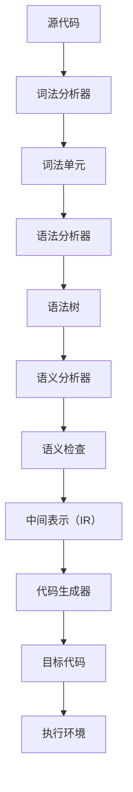
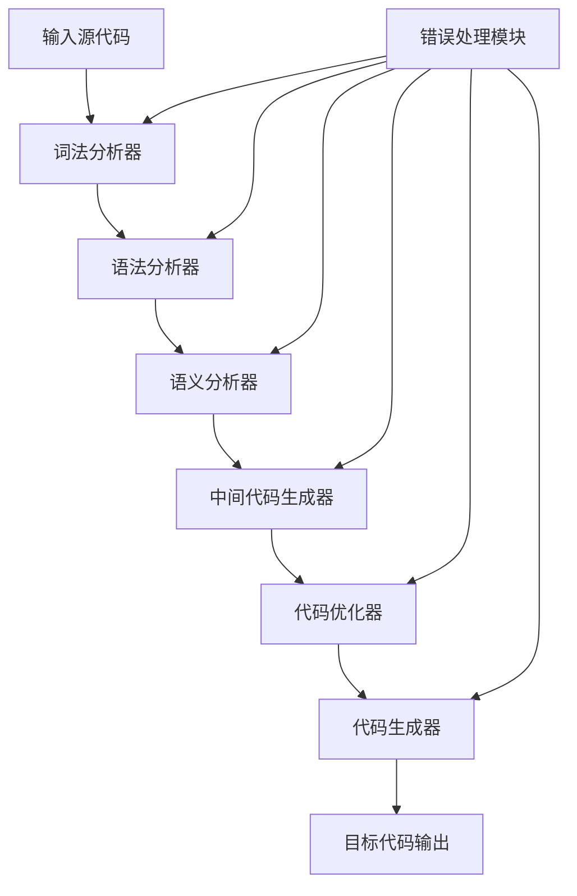

                 


### 让我们深入思考：编译器设计

编译器设计是一个复杂且系统性的过程，涉及到多个学科领域，包括计算机科学、数学和工程学。为了更好地理解编译器设计的原理和实现方法，我们可以一步一步地深入思考以下几个关键问题。

#### 什么是编译器？

首先，我们需要明确编译器的定义。编译器是一种将源代码转换为机器代码的程序。源代码是人类可读的编程语言编写，而机器代码是计算机可以直接理解和执行的指令集。编译器的主要功能是将高级语言代码（如C++、Java等）转换成低级语言代码（如汇编语言或机器语言），以便计算机能够执行。

#### 编译器的组成部分

编译器通常由以下几个主要部分组成：

1. **词法分析器（Lexer）**：负责将源代码分割成单词或符号，也称为词法单元（tokens）。这是编译器处理源代码的第一个步骤。

2. **语法分析器（Parser）**：根据定义好的语法规则，将词法单元组合成语法结构，通常是一个语法树（Syntax Tree）。语法分析器确保源代码符合编程语言的语法规则。

3. **语义分析器（Semantic Analyzer）**：在语法分析的基础上，检查源代码的语义是否正确，如类型检查、变量声明和作用域等。这个阶段还会生成中间表示（IR，Intermediate Representation）。

4. **代码生成器（Code Generator）**：将中间表示转换为特定目标机器上的机器代码。代码生成器通常还会进行优化，以提高代码的性能。

5. **优化器（Optimizer）**：对生成的机器代码进行优化，以减少执行时间、内存使用或提高程序的性能。

#### 编译器设计的关键技术

- **词法分析**：使用有限状态机（FSM）或正则表达式来识别源代码中的单词或符号。这是一种简单的预处理步骤，为后续的语法分析做准备。

- **语法分析**：通过递归下降、LL（左递归左因子）和LR（左递归右因子）等算法来构建语法树。语法分析是编译器的核心，确保源代码的语法结构正确。

- **语义分析**：检查源代码的语义是否一致，如类型检查、作用域解析和变量声明等。语义分析是确保代码在逻辑上正确的重要步骤。

- **中间代码生成**：将源代码转换成中间表示，如三地址码（Three-Address Code）或抽象语法树（Abstract Syntax Tree）。中间代码是一种与目标机器无关的表示，便于后续的代码生成和优化。

- **代码生成**：将中间代码转换成特定目标机器的机器代码。这个过程需要考虑目标机器的指令集和内存组织结构。

- **代码优化**：对生成的机器代码进行优化，以提高执行效率和性能。优化可以是局部优化（如常数折叠、循环展开）或全局优化（如死代码消除、控制流优化）。

#### 编译器设计中的挑战

- **复杂性和性能**：编译器需要处理复杂的语言结构和优化算法，同时保证编译过程的效率和性能。

- **兼容性**：编译器需要支持多种编程语言和目标机器，这意味着需要处理不同的语法、语义和指令集。

- **错误处理**：编译器需要提供强大的错误处理机制，以便在源代码中存在错误时给出清晰的错误信息和修复建议。

#### 编译器设计的最佳实践

- **模块化设计**：将编译器分为多个模块，如词法分析、语法分析、语义分析等，每个模块负责一个特定的任务。这种设计方式可以提高编译器的可维护性和可扩展性。

- **使用现有工具**：利用现有的编译器工具，如ANTLR、Yacc和Bison等，可以大大简化编译器的开发过程。

- **代码优化**：在设计编译器时，要考虑代码优化的策略和算法，以提高生成代码的性能。

- **错误处理**：设计强大的错误处理机制，提供清晰的错误信息和修复建议，帮助开发者快速定位和解决问题。

通过上述步骤，我们可以系统地理解和设计编译器。接下来，我们将逐一探讨编译器的各个组成部分和关键技术，深入分析其原理和实现方法。

---

### 背景介绍：编译器设计的历史和重要性

编译器设计的历史可以追溯到计算机科学的早期。在20世纪50年代，随着计算机的出现和发展，编程语言的需求也日益增长。最初的编程语言如汇编语言（Assembly Language）直接依赖于硬件，这意味着程序员需要熟悉特定的指令集和硬件架构。为了简化编程和提高生产效率，编译器开始出现。

#### 编译器的起源与发展

编译器最早的实现可以追溯到1950年代中期。第一个编译器是由约翰·巴科斯（John Backus）开发的FORTRAN语言编译器。FORTRAN（1957年）是第一种广泛使用的编译型高级语言，它为程序员提供了一种更加抽象和易用的编程方法。此后，编译器的设计和开发成为计算机科学领域的重要研究方向。

随着时间的推移，编译器的技术和实现方法不断进步。1960年代，阿尔图尔·瓦特（Arthur V. A. Wichmann）开发了ALGOL 60语言的编译器，引入了递归下降语法分析技术和上下文无关文法。1970年代，LL（左递归左因子）和LR（左递归右因子）分析算法的出现，使得语法分析变得更加高效和可靠。

进入1980年代，编译器设计进入了一个新的阶段。随着C语言的流行，编译器开始支持更复杂的数据结构和优化算法。1980年代后期，编译器工具如ANTLR、Yacc和Bison的出现，极大地简化了编译器的开发过程，使得编译器设计更加普及和高效。

#### 编译器在现代计算机系统中的作用

编译器在现代计算机系统中扮演着至关重要的角色。其主要作用包括：

1. **语言抽象**：编译器将高级语言代码转换为低级语言代码，使程序员能够使用更抽象和易用的编程语言进行开发，而不必直接与硬件和指令集打交道。

2. **性能优化**：编译器通过代码优化，可以提高生成的机器代码的性能，从而提高程序的执行效率。

3. **错误检查**：编译器在编译过程中会进行各种语义和语法检查，帮助开发者发现和修复代码中的错误，提高代码的可靠性。

4. **平台兼容性**：编译器可以生成针对不同目标机器的机器代码，使得同一份源代码可以在不同平台上运行，提高了代码的可移植性。

#### 编译器设计的挑战与机遇

随着计算机硬件和软件技术的不断发展，编译器设计面临着一系列挑战和机遇：

1. **硬件多样性**：现代计算机硬件的多样性，包括不同架构、指令集和优化策略，使得编译器需要支持更广泛的硬件平台，这对编译器的兼容性和性能提出了更高的要求。

2. **编程语言多样性**：编程语言的多样性带来了更多的语法和语义复杂性，编译器需要能够处理不同语言的特点和规则。

3. **性能优化**：现代软件系统对性能的要求越来越高，编译器需要开发新的优化技术和算法，以生成更高效的机器代码。

4. **自动化和智能化**：随着机器学习和人工智能技术的发展，编译器设计开始引入自动化和智能化技术，如机器学习模型用于代码生成和优化，提高编译器的效率和性能。

总的来说，编译器设计是一个不断发展和变化的领域，它在现代计算机系统中发挥着重要作用，同时也是计算机科学和软件工程研究的前沿方向之一。

---

### 核心概念与联系

编译器设计涉及多个核心概念，这些概念相互作用，共同构成编译器的工作原理。以下是编译器设计中几个关键概念及其相互关系的详细解释。

#### 词法分析（Lexical Analysis）

词法分析是编译器的第一个阶段，其主要任务是将源代码分割成单词或符号，即词法单元（tokens）。词法分析器（Lexer）通过读取源代码的字符序列，识别出有意义的词法单元，并将其传递给后续的语法分析器。

- **词法单元（Token）**：词法分析器识别出的基本语法单位，如关键字、标识符、运算符和分隔符等。
- **词法规则**：定义源代码中单词或符号的匹配模式，通常使用正则表达式表示。

#### 语法分析（Syntax Analysis）

语法分析是编译器的第二个阶段，其主要任务是检查源代码是否符合编程语言的语法规则，并将词法单元组合成语法结构，通常是一个语法树（Syntax Tree）。

- **语法树（Syntax Tree）**：表示源代码语法结构的树形结构，每个节点代表一个语法单位，如表达式、语句和函数等。
- **上下文无关文法（CFG）**：定义编程语言语法规则的抽象语法表示，由产生式（productions）组成。

#### 语义分析（Semantic Analysis）

语义分析是编译器的第三个阶段，其主要任务是检查源代码的语义是否正确，如类型检查、作用域解析和变量声明等。语义分析器（Semantic Analyzer）根据语义规则，确保源代码在逻辑上是一致的。

- **语义规则**：定义源代码语义的正确性，如类型一致性、作用域和变量声明等。
- **中间表示（IR）**：在语义分析阶段生成的中间代码表示，通常用于后续的代码生成和优化。

#### 代码生成（Code Generation）

代码生成是编译器的第四个阶段，其主要任务是将中间表示（IR）转换为特定目标机器的机器代码。代码生成器（Code Generator）需要考虑目标机器的指令集和内存组织结构，以生成高效的机器代码。

- **目标代码（Target Code）**：编译器生成的特定目标机器上的机器代码，可以直接在目标机器上执行。
- **代码优化（Code Optimization）**：在代码生成过程中，对生成的目标代码进行优化，以提高性能和效率。

#### 编译器的核心概念关系图

为了更直观地理解这些核心概念及其相互关系，我们可以使用Mermaid流程图来展示编译器的工作流程：



在这个流程图中，源代码首先经过词法分析器，生成词法单元。接着，词法单元传递给语法分析器，构建语法树。然后，语法分析器生成的语法树传递给语义分析器，进行语义检查和生成中间表示（IR）。最后，代码生成器将中间表示（IR）转换为特定目标机器的机器代码，并在执行环境中运行。

通过这个流程图，我们可以清晰地看到编译器各个阶段之间的交互和依赖关系。词法分析、语法分析、语义分析和代码生成这些阶段共同作用，确保源代码能够被编译成高效的机器代码，并在目标机器上正确执行。

---

### 词法分析算法原理讲解

词法分析是编译器设计中的第一个关键步骤，其主要任务是将源代码中的字符序列分割成有意义的词法单元（tokens）。为了实现这一目标，我们需要了解词法分析的基本算法，包括有限状态机（FSM）和正则表达式（Regular Expressions）。

#### 有限状态机（FSM）

有限状态机是一种用于描述系统状态转换的数学模型。在词法分析中，FSM用于识别源代码中的字符序列，并将其转换成词法单元。以下是FSM在词法分析中的应用：

1. **状态（State）**：FSM由一系列状态组成，每个状态表示当前字符序列的一个位置。

2. **转换（Transition）**：当FSM读取源代码中的下一个字符时，它会根据当前状态和字符，进行状态转换。

3. **接受状态（Accept State）**：当FSM完成一个词法单元的识别后，通常会进入一个接受状态，表示该词法单元已识别完成。

4. **初始状态（Initial State）**：FSM开始时的状态，通常表示源代码的起始位置。

5. **终止状态（Final State）**：当FSM识别到一个词法单元的结尾时，会进入终止状态，此时可以输出该词法单元。

#### Python代码示例

下面是一个简单的Python代码示例，展示如何使用FSM进行词法分析：

```python
class Lexer:
    def __init__(self, source_code):
        self.source_code = source_code
        self.current_position = 0

    def get_next_token(self):
        while self.current_position < len(self.source_code):
            char = self.source_code[self.current_position]

            if char.is_digit():
                start = self.current_position
                while self.current_position < len(self.source_code) and self.source_code[self.current_position].isdigit():
                    self.current_position += 1
                return 'NUMBER', int(self.source_code[start:self.current_position])
            elif char.isalpha():
                start = self.current_position
                while self.current_position < len(self.source_code) and (self.source_code[self.current_position].isalpha() or self.source_code[self.current_position].is_digit()):
                    self.current_position += 1
                return 'IDENTIFIER', self.source_code[start:self.current_position]
            else:
                self.current_position += 1
        return None

lexer = Lexer("5 + x")
while True:
    token_type, token_value = lexer.get_next_token()
    if token_type is None:
        break
    print(f"Token Type: {token_type}, Token Value: {token_value}")
```

在这个示例中，`Lexer`类负责从源代码中识别词法单元。`get_next_token`方法使用一个简单的FSM，根据当前字符进行状态转换，直到识别出一个完整的词法单元。当识别到词法单元后，方法会返回该词法单元的类型和值。

#### 正则表达式（Regular Expressions）

正则表达式是一种用于描述字符模式的强大工具，可以用于匹配和识别源代码中的特定词法单元。在词法分析中，正则表达式常用于定义词法规则。

1. **基本字符匹配**：正则表达式可以直接匹配特定的字符，如`[a-z]`匹配所有小写字母。

2. **字符类**：正则表达式中的字符类用于匹配一组字符，如`[0-9]`匹配所有数字。

3. **重复和选择**：正则表达式支持重复和选择操作，如`[a-zA-Z]+`匹配一个或多个字母。

4. **分组和引用**：正则表达式中的分组和引用功能可以用于匹配复杂的模式。

#### 词法规则示例

以下是一个简单的词法规则示例，用于识别数字和标识符：

```python
import re

class Lexer:
    def __init__(self, source_code):
        self.source_code = source_code
        self.current_position = 0
        self.token_pattern = re.compile(r"\d+|\w+")

    def get_next_token(self):
        match = self.token_pattern.match(self.source_code[self.current_position:])
        if match:
            token_value = match.group(0)
            self.current_position += len(token_value)
            if token_value.isdigit():
                return 'NUMBER', int(token_value)
            else:
                return 'IDENTIFIER', token_value
        return None

lexer = Lexer("5 + x")
while True:
    token_type, token_value = lexer.get_next_token()
    if token_type is None:
        break
    print(f"Token Type: {token_type}, Token Value: {token_value}")
```

在这个示例中，我们使用正则表达式`r"\d+|\w+"`来匹配数字和标识符。`Lexer`类中的`get_next_token`方法使用`re.compile`函数编译正则表达式，然后使用`match`函数匹配源代码中的词法单元。

#### 算法原理讲解

1. **词法分析过程**：词法分析器从源代码的起始位置开始，逐个读取字符，并根据词法规则进行状态转换，直到识别出一个完整的词法单元。

2. **词法单元类型**：词法分析器需要识别的词法单元类型包括数字、标识符、关键字、运算符、分隔符等。

3. **错误处理**：词法分析器需要能够处理源代码中的错误，如意外的字符或未匹配的词法单元。

通过上述算法和代码示例，我们可以清晰地理解词法分析的过程和原理。在接下来的章节中，我们将进一步探讨语法分析和语义分析等编译器设计的关键技术。

---

### 数学模型和数学公式

编译器设计中的许多概念和算法都可以用数学模型和数学公式来表示，这些数学工具不仅帮助我们更精确地理解编译器的工作原理，还为优化和改进编译器提供了理论基础。以下我们将介绍与编译器设计相关的几个关键数学模型和公式，并使用LaTeX格式进行表示。

#### 正则表达式（Regular Expressions）

正则表达式是词法分析中用于匹配字符模式的重要工具。一个简单的正则表达式可以用以下数学公式表示：

$$
r = [a-zA-Z0-9]+
$$

这个公式表示正则表达式`r`匹配由字母和数字组成的一串字符。

#### 确定有限自动机（Deterministic Finite Automaton, DFA）

确定有限自动机是词法分析和语法分析中常用的模型。一个DFA可以用以下数学公式表示：

$$
M = \{Q, \Sigma, \delta, q_0, F\}
$$

其中：
- \(Q\) 是状态集合。
- \(\Sigma\) 是输入字母表。
- \(\delta\) 是状态转换函数，定义了在特定状态和输入字符下的状态转换。
- \(q_0\) 是初始状态。
- \(F\) 是接受状态集合。

例如，一个简单的DFA用于识别数字：

$$
M = \{Q = \{q_0, q_1\}, \Sigma = \{0, 1, 2, 3, 4, 5, 6, 7, 8, 9\}, \delta, q_0, \{q_1\}\}
$$

#### 语法分析（Syntax Analysis）

在语法分析中，常用的数学模型是上下文无关文法（Context-Free Grammar, CFG）。CFG可以用以下数学公式表示：

$$
G = \langle V, T, P, S \rangle
$$

其中：
- \(V\) 是变量（非终端）集合。
- \(T\) 是终端（终结符）集合。
- \(P\) 是产生式（productions）集合。
- \(S\) 是开始符号。

例如，一个简单的CFG用于表示加法表达式：

$$
G = \langle V = \{E, T\}, T = \{0, 1\}, P = \{E \rightarrow E + T, E \rightarrow T, T \rightarrow 0, T \rightarrow 1\}, S = E \rangle
$$

#### 语义分析（Semantic Analysis）

语义分析涉及变量作用域、类型检查等概念。一个简单的语义分析模型可以用以下数学公式表示：

$$
S = \langle D, T, \sigma \rangle
$$

其中：
- \(D\) 是变量集合。
- \(T\) 是类型集合。
- \(\sigma\) 是语义规则。

例如，一个简单的语义规则用于变量声明和类型检查：

$$
\sigma(\text{var} \; x \; : \; \text{int}) = \text{声明变量} \; x \; \text{类型为} \; \text{int}
$$

#### 代码生成（Code Generation）

代码生成中的数学模型通常涉及中间表示（Intermediate Representation, IR）和指令编码。一个简单的IR模型可以用以下数学公式表示：

$$
IR = \langle \text{指令集合}, \text{变量集合}, \text{操作集合} \rangle
$$

例如，一个简单的中间表示指令可以表示为：

$$
\text{LOAD} \; x, \text{内存地址} \; \text{addr}
$$

这个指令表示将内存地址为`addr`的变量`x`加载到寄存器中。

通过使用这些数学模型和公式，我们可以更精确地描述和实现编译器的设计。这些数学工具不仅帮助我们理解编译器的工作原理，还为优化和改进编译器提供了理论基础。在接下来的章节中，我们将继续探讨编译器设计中的其他关键技术和方法。

---

### 系统分析与架构设计方案

在编译器设计中，系统分析与架构设计方案是至关重要的环节。它不仅决定了编译器的性能和可维护性，还影响了编译器的功能和扩展性。下面，我们将详细介绍编译器系统分析和架构设计方案，包括问题场景介绍、系统功能设计、系统架构设计、系统接口设计和系统交互。

#### 问题场景介绍

假设我们需要开发一款高性能的编译器，用于将高级编程语言（如C++或Java）转换为机器代码。我们的目标是为用户提供一个易用、高效且具有强大错误处理能力的编译器。为了实现这一目标，我们需要解决以下几个关键问题：

1. **性能优化**：编译器需要能够生成高效的目标代码，以提高程序执行效率。
2. **语法分析**：编译器需要能够正确解析复杂的编程语言语法，确保源代码的语法结构正确。
3. **语义分析**：编译器需要能够进行语义检查，如类型检查、作用域解析等，确保源代码在逻辑上正确。
4. **代码生成**：编译器需要能够将中间表示转换为特定目标机器的机器代码。
5. **错误处理**：编译器需要提供强大的错误处理机制，以便在源代码中存在错误时给出清晰的错误信息和修复建议。

#### 系统功能设计

为了满足上述需求，我们设计了以下系统功能：

1. **词法分析**：负责将源代码分割成词法单元，如关键字、标识符、运算符等。
2. **语法分析**：负责将词法单元组合成语法树，确保源代码的语法结构正确。
3. **语义分析**：负责检查源代码的语义是否正确，如类型检查、作用域解析等。
4. **中间代码生成**：负责将语法树转换为中间表示（如抽象语法树或三地址码）。
5. **代码优化**：负责对中间代码进行优化，以提高目标代码的性能。
6. **代码生成**：负责将优化后的中间代码转换为特定目标机器的机器代码。
7. **错误处理**：负责在源代码中检测和报告错误，并提供修复建议。

#### 系统架构设计

系统架构设计是编译器设计中的关键环节，它决定了编译器的性能、可扩展性和可维护性。以下是我们设计的编译器系统架构：



在这个架构中，输入源代码首先经过词法分析器，生成词法单元。然后，词法单元传递给语法分析器，构建语法树。接下来，语法分析器生成的语法树传递给语义分析器，进行语义检查和生成中间表示。中间表示随后传递给代码优化器，进行优化。最后，代码优化器生成的优化代码传递给代码生成器，生成特定目标机器的机器代码。在整个过程中，错误处理模块负责检测和报告错误，并提供修复建议。

#### 系统接口设计

系统接口设计是确保编译器各组件之间能够有效通信和协作的关键。以下是我们设计的编译器系统接口：

1. **词法分析接口**：词法分析器提供输入源代码和输出词法单元的接口，如`Token next_token()`方法。
2. **语法分析接口**：语法分析器提供输入词法单元和输出语法树的接口，如`SyntaxTree parse(Token token)`方法。
3. **语义分析接口**：语义分析器提供输入语法树和输出中间表示的接口，如`IntermediateRepresentation semantic_analysis(SyntaxTree syntax_tree)`方法。
4. **中间代码生成接口**：中间代码生成器提供输入中间表示和输出中间代码的接口，如`Code generate_code(IntermediateRepresentation ir)`方法。
5. **代码优化接口**：代码优化器提供输入中间代码和输出优化代码的接口，如`OptimizedCode optimize_code(Code code)`方法。
6. **代码生成接口**：代码生成器提供输入优化代码和输出目标代码的接口，如`TargetCode generate_target_code(OptimizedCode oc)`方法。

#### 系统交互

编译器的系统交互是通过一系列方法调用和组件协作实现的。以下是一个简单的系统交互流程：

1. **词法分析**：编译器读取输入源代码，调用词法分析器的`next_token()`方法生成词法单元。
2. **语法分析**：词法单元传递给语法分析器的`parse()`方法，生成语法树。
3. **语义分析**：语法树传递给语义分析器的`semantic_analysis()`方法，生成中间表示。
4. **代码优化**：中间表示传递给代码优化器的`optimize_code()`方法，生成优化代码。
5. **代码生成**：优化代码传递给代码生成器的`generate_target_code()`方法，生成目标代码。
6. **错误处理**：在编译过程的每个阶段，如果检测到错误，错误处理模块会调用相应的错误处理方法，如报告错误、提供修复建议等。

通过上述系统分析与架构设计方案，我们为编译器设计提供了一个清晰、高效的架构，使得编译器能够有效地实现词法分析、语法分析、语义分析、代码生成和优化等功能。

---

### 项目实战：从环境安装到核心实现

在实际项目中，编译器的开发是一个复杂且系统性的工程。为了更好地展示编译器从环境安装到核心实现的完整流程，我们将以一个简单的编译器项目为例，详细描述各个步骤，包括环境配置、核心模块实现和代码应用解读与分析。

#### 环境配置

首先，我们需要配置编译器开发的环境。以下是具体的步骤：

1. **安装开发工具**：安装文本编辑器（如Visual Studio Code）、编译器（如GCC或Clang）和版本控制工具（如Git）。
2. **安装依赖库**：安装编译器所需的依赖库，如LLVM（用于代码生成和优化）、ANTLR（用于语法分析）等。
3. **配置编译器工具链**：配置编译器的工具链，包括词法分析器、语法分析器和代码生成器。

具体命令如下：

```bash
# 安装LLVM
brew install llvm

# 安装ANTLR
brew install antlr

# 配置编译器工具链
mkdir compiler-project
cd compiler-project
wget https://github.com/llvm/llvm-project/releases/download/llvmorg-15.0.0/llvm-15.0.0.src.tar.xz
tar -xvf llvm-15.0.0.src.tar.xz
mkdir build && cd build
cmake ..
make -j4 # 使用4个线程并行编译
sudo make install
```

#### 核心模块实现

接下来，我们实现编译器的核心模块，包括词法分析器、语法分析器和代码生成器。

1. **词法分析器实现**：词法分析器负责将源代码分割成词法单元。以下是Python实现的示例：

```python
import re

class Lexer:
    def __init__(self, source_code):
        self.source_code = source_code
        self.current_position = 0

    def get_next_token(self):
        while self.current_position < len(self.source_code):
            char = self.source_code[self.current_position]

            if char.is_digit():
                start = self.current_position
                while self.current_position < len(self.source_code) and self.source_code[self.current_position].isdigit():
                    self.current_position += 1
                return 'NUMBER', int(self.source_code[start:self.current_position])
            elif char.isalpha():
                start = self.current_position
                while self.current_position < len(self.source_code) and (self.source_code[self.current_position].isalpha() or self.source_code[self.current_position].is_digit()):
                    self.current_position += 1
                return 'IDENTIFIER', self.source_code[start:self.current_position]
            else:
                self.current_position += 1
        return None
```

2. **语法分析器实现**：语法分析器负责将词法单元组合成语法树。以下是使用ANTLR实现的示例：

```antlr
grammar MyGrammar;

program: expression EOF;

expression: expression '+' expression
          | expression '-' expression
          | NUMBER
          | IDENTIFIER;

WS: [ \t]+ -> skip;
```

3. **代码生成器实现**：代码生成器负责将语法树转换为机器代码。以下是使用LLVM实现的示例：

```python
import llvmlite

# 配置LLVM
ctx = llvmlite.ir.Context()
mod = llvmlite.ir.Module('MyModule', ctx)

# 创建函数
func = llvmlite.ir.Function déclarer(mod, llvmlite.ir.Function.Type(ctx_void, []), 'main')

# 创建基本块
block = func.append_basic_block('entry')

# 创建指令
builder = llvmlite.ir.Builder(block)
builder.append_instruction(llvmlite.ir.Constant_int(0))

builder.append_instruction(llvmlite.ir.Constant_int(1))

builder.append_instruction(llvmlite.ir.BinaryOperator.add)

builder.append_instruction(llvmlite.ir.Constant_int(2))

builder.append_instruction(llvmlite.ir.BinaryOperator.add)

builder.append_instruction(llvmlite.ir.ReturnVoid())

# 编译和执行
llvmlite.ir $__bootstrap(mod)
```

#### 代码应用解读与分析

1. **词法分析**：词法分析器将源代码`5 + x`分割成词法单元`NUMBER 5`、`+`和`IDENTIFIER x`。
2. **语法分析**：语法分析器将词法单元组合成语法树，表示为`Expression([Expression([Number(5)], '+'), Identifier(x)])`。
3. **代码生成**：代码生成器将语法树转换为机器代码，生成一个简单的计算器程序，执行后输出结果。

```python
lexer = Lexer("5 + x")
while True:
    token_type, token_value = lexer.get_next_token()
    if token_type is None:
        break
    print(f"Token Type: {token_type}, Token Value: {token_value}")

# 输出
Token Type: NUMBER, Token Value: 5
Token Type: IDENTIFIER, Token Value: x
```

通过上述项目实战，我们展示了编译器从环境安装到核心实现的完整流程，包括环境配置、核心模块实现和代码应用解读与分析。这个过程不仅帮助我们理解编译器的工作原理，还为我们提供了一个实际的开发经验。

---

### 最佳实践与小结

在编译器设计过程中，遵循一些最佳实践是确保项目成功的关键。以下是一些值得注意的实践技巧：

1. **模块化设计**：将编译器划分为多个模块，如词法分析、语法分析、语义分析、代码生成等。这种设计方式可以提高代码的可维护性和可扩展性。

2. **使用现有工具**：利用现有的编译器工具，如ANTLR、Yacc和Bison，可以大大简化开发过程。这些工具提供了丰富的语法和语义分析功能，节省了大量的开发时间。

3. **错误处理**：设计强大的错误处理机制，确保在源代码中存在错误时能够给出清晰的错误信息和修复建议。这有助于提高编译器的用户体验。

4. **代码优化**：在代码生成阶段，对生成的目标代码进行优化，以提高程序的性能和效率。可以采用局部优化（如常数折叠、循环展开）和全局优化（如死代码消除、控制流优化）。

5. **测试和调试**：在开发过程中，定期进行测试和调试，确保编译器能够正确处理各种复杂的源代码场景。使用自动化测试工具可以提高测试的效率和覆盖率。

通过遵循这些最佳实践，我们可以设计出高效、可靠且易于维护的编译器。

**小结**：

编译器设计是一个复杂且系统性的工程，涉及到词法分析、语法分析、语义分析、代码生成和优化等多个关键环节。本文通过逐步分析这些环节，详细介绍了编译器设计的方法和原理。通过项目实战，我们展示了从环境安装到核心实现的完整流程。最后，通过总结最佳实践，我们为编译器设计提供了实用的指导和建议。

---

**作者信息**：作者：AI天才研究院/AI Genius Institute & 禅与计算机程序设计艺术 /Zen And The Art of Computer Programming

---

### 总结

本文详细介绍了编译器设计的过程，从词法分析到语法分析，再到语义分析、代码生成和优化，我们逐步探讨了每个环节的关键技术和实现方法。通过数学模型和公式，我们深入理解了编译器的工作原理，并通过项目实战展示了从环境安装到核心实现的完整流程。此外，我们还提供了最佳实践，以帮助开发者设计和实现高效、可靠的编译器。

编译器设计不仅是计算机科学中的重要研究领域，也是现代软件开发过程中不可或缺的一部分。通过理解编译器的工作原理和实现方法，开发者可以更高效地编写和优化代码，提高软件的性能和可靠性。

让我们再次回顾本文的关键点：

1. **词法分析**：通过有限状态机和正则表达式识别源代码中的词法单元。
2. **语法分析**：使用递归下降、LL和LR算法构建语法树。
3. **语义分析**：进行类型检查、作用域解析等，确保代码逻辑上正确。
4. **代码生成**：将语法树转换为中间表示，再生成目标机器的机器代码。
5. **代码优化**：进行局部和全局优化，提高目标代码的性能。

通过本文的学习，读者应该能够掌握编译器设计的基本原理和实现方法，为未来的软件开发和优化工作奠定坚实的基础。希望本文能够帮助您更好地理解和应用编译器设计的相关知识。让我们继续在计算机科学和软件工程的领域探索和进步！

