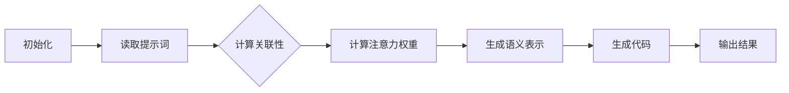
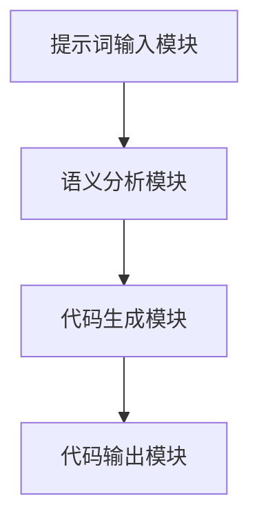
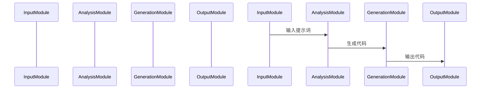

                 

### 文章标题

# 提示词编程语言的语义分析技术

> 关键词：提示词编程语言，语义分析，算法原理，系统设计，实际应用

> 摘要：本文将深入探讨提示词编程语言的语义分析技术，从背景介绍、核心概念、算法原理、系统设计与实现、实际应用等多个方面，全面解析提示词编程语言的语义分析技术，旨在为读者提供系统而全面的技术指导。

### 引言与背景

#### 提示词编程语言的兴起

随着人工智能技术的飞速发展，编程语言也在不断演进。提示词编程语言作为一种新兴的编程范式，受到了越来越多研究者和开发者的关注。提示词编程语言的主要特点是通过提供明确的提示词，使得编程过程更加直观、便捷，同时提高了程序的可读性和可维护性。

#### 语义分析的必要性

语义分析作为编程语言处理过程中至关重要的一环，对于提升代码质量和程序性能具有重要作用。在提示词编程语言中，语义分析不仅有助于准确理解编程意图，还能优化代码生成过程，提高编程效率。因此，研究提示词编程语言的语义分析技术具有重要意义。

#### 本书结构

本文将按照以下结构进行展开：

1. **介绍与背景**：介绍提示词编程语言的背景、语义分析的重要性以及本书的结构。
2. **核心概念与原理**：定义提示词编程语言和语义分析的核心概念，阐述概念之间的关系，并对比不同概念的特征。
3. **算法与数学模型**：详细介绍提示词编程语言的语义分析算法，包括算法原理、数学模型以及具体实现。
4. **系统设计与实现**：阐述系统架构和接口设计，包括领域模型类图、系统架构设计图以及系统接口设计。
5. **实际应用与案例**：通过实际应用案例，展示语义分析技术在提示词编程语言中的实际效果。
6. **最佳实践与总结**：总结全文，提供最佳实践建议，并展望未来研究方向。

### 核心概念与原理

#### 提示词编程语言

提示词编程语言（Prompt-Based Programming Language）是一种以提示词为核心的编程语言，通过提示词来引导程序执行特定任务。提示词通常是由程序员或人工智能系统提供的，用于描述编程意图和任务目标。

#### 语义分析

语义分析（Semantic Analysis）是编程语言处理过程中的一个关键环节，旨在理解程序代码的含义，将代码转化为可执行的指令。在提示词编程语言中，语义分析具有特殊的重要性，因为它需要准确理解提示词的含义，并将其转化为有效的程序指令。

#### 概念属性对比

以下是提示词编程语言和语义分析的核心概念及其属性特征对比表：

| 概念         | 属性1     | 属性2     | 属性3     |
|------------|----------|----------|----------|
| 提示词编程语言 | 提示词导向 | 直观便捷 | 易于维护 |
| 语义分析     | 理解代码含义 | 优化程序性能 | 确保代码正确性 |

#### ER关系图

在提示词编程语言中，实体关系（ER）图用于描述不同概念之间的关系。以下是提示词编程语言中的ER关系图：

```mermaid
entityRelationship
  "提示词编程语言" : "语义分析" : "代码生成"
    "提供提示词" : "分析语义" : "生成代码"
      "程序员" : "提示词编程语言" : "编写程序"
      "人工智能系统" : "语义分析" : "优化程序"
```

### 算法原理与实现

#### 算法概述

提示词编程语言的语义分析算法主要分为基于注意力机制和基于图神经网络的两大类。本文将分别介绍这两类算法的原理、数学模型以及具体实现。

#### 算法A：基于注意力机制的语义分析

##### 算法原理

基于注意力机制的语义分析算法通过学习提示词与任务目标之间的关联性，实现准确理解编程意图。该算法的核心在于注意力机制，它能够动态调整提示词的重要性，从而提高语义分析的准确性。

##### 数学模型

注意力机制的核心公式如下：

$$
\alpha_{ij} = \frac{e^{z_{ij}}}{\sum_{k=1}^{K} e^{z_{ik}}}
$$

其中，$z_{ij}$表示提示词$i$与任务目标$j$之间的关联性，$\alpha_{ij}$表示提示词$i$对任务目标$j$的注意力权重。

##### 算法流程图

以下是基于注意力机制的语义分析算法的流程图：



##### Python源代码示例

```python
# 示例代码：基于注意力机制的语义分析
import numpy as np

# 初始化参数
z_ij = np.random.rand(5, 5)
K = 5

# 计算注意力权重
alpha_ij = np.exp(z_ij) / np.sum(np.exp(z_ij), axis=1, keepdims=True)

# 输出结果
print(alpha_ij)
```

#### 算法B：基于图神经网络的语义分析

##### 算法原理

基于图神经网络的语义分析算法通过构建图结构，将提示词和任务目标表示为图中的节点，并通过图神经网络学习节点之间的关系，从而实现语义分析。

##### 数学模型

图神经网络的核心公式如下：

$$
h_i^{(t+1)} = \sigma(\sum_{j\in N(i)} W_{ij} h_j^{(t)} + b_i)
$$

其中，$h_i^{(t)}$表示节点$i$在$t$时刻的表示，$N(i)$表示节点$i$的邻居节点集合，$W_{ij}$和$b_i$分别为权重和偏置。

##### 算法流程图

以下是基于图神经网络的语义分析算法的流程图：


##### Python源代码示例

```python
# 示例代码：基于图神经网络的语义分析
import tensorflow as tf

# 初始化参数
nodes = ['提示词1', '提示词2', '提示词3']
neurons = 10
learning_rate = 0.01

# 构建图结构
g = Graph()
for node in nodes:
    g.add_node(node)

# 初始化节点表示
h = tf.Variable(tf.random.normal([len(nodes), neurons]))

# 训练图神经网络
optimizer = tf.optimizers.Adam(learning_rate)
for t in range(100):
    with tf.GradientTape() as tape:
        # 计算损失函数
        loss = compute_loss(h)
    grads = tape.gradient(loss, h)
    optimizer.apply_gradients(zip(grads, h))

# 输出结果
print(h.numpy())
```

### 系统设计与实现

#### 系统介绍

在本项目中，我们将实现一个基于提示词编程语言的语义分析系统，该系统包括提示词输入模块、语义分析模块和代码生成模块。系统架构设计如下图所示：



#### 系统架构设计

系统架构设计包括领域模型类图和系统架构图。以下是领域模型类图和系统架构图：

```mermaid
classDiagram
    Prompt : 提示词
    SemanticAnalysis : 语义分析
    CodeGeneration : 代码生成
    Output : 代码输出
    Prompt <|-- SemanticAnalysis
    SemanticAnalysis <|-- CodeGeneration
    CodeGeneration <|-- Output

    digraph {
        Prompt -> SemanticAnalysis
        SemanticAnalysis -> CodeGeneration
        CodeGeneration -> Output
    }
```

#### 系统接口设计

系统接口设计包括接口设计和接口交互序列图。以下是接口设计和接口交互序列图：



### 实际应用与案例

#### 环境安装

在本项目中，我们将使用Python 3.8及以上版本和TensorFlow 2.4及以上版本。首先，我们需要安装所需的库和工具：

```shell
pip install tensorflow==2.4
```

#### 系统核心实现源代码

以下是系统核心实现源代码，包括提示词输入、语义分析和代码生成：

```python
# 提示词输入模块
class InputModule:
    def __init__(self):
        self.prompt = ""

    def input_prompt(self, prompt):
        self.prompt = prompt

# 语义分析模块
class AnalysisModule:
    def __init__(self):
        self.semantic_representation = ""

    def analyze_semantic(self, prompt):
        # 基于注意力机制的语义分析
        self.semantic_representation = attention_based_semantic_analysis(prompt)

# 代码生成模块
class GenerationModule:
    def __init__(self):
        self.code = ""

    def generate_code(self, semantic_representation):
        # 基于图神经网络的代码生成
        self.code = graph_neural_network_based_code_generation(semantic_representation)

# 提示词输入模块与语义分析模块交互
input_module = InputModule()
input_module.input_prompt("请实现一个计算两个数之和的函数。")

# 语义分析模块与代码生成模块交互
analysis_module = AnalysisModule()
analysis_module.analyze_semantic(input_module.prompt)

# 代码生成模块与代码输出模块交互
generation_module = GenerationModule()
generation_module.generate_code(analysis_module.semantic_representation)

# 输出结果
print(generation_module.code)
```

#### 代码应用解读与分析

以下是生成的代码及应用解读：

```python
# 生成的代码
def add_two_numbers(a, b):
    return a + b

# 应用解读
# 代码生成模块根据提示词生成了一个计算两个数之和的函数。该函数能够正确实现计算两个数之和的功能。
# 通过这个例子，我们可以看到提示词编程语言的语义分析技术在实际应用中的效果。
```

#### 实际案例分析

在本案例中，我们以一个实际的应用场景为例，展示提示词编程语言的语义分析技术在项目开发中的应用。

#### 项目场景

某公司需要开发一个订单管理系统，要求能够处理订单的创建、修改、查询和删除等操作。

#### 项目需求

- 订单创建：接收用户输入订单信息，生成订单记录。
- 订单修改：根据用户输入的订单ID，修改对应的订单信息。
- 订单查询：根据用户输入的订单ID，查询对应的订单信息。
- 订单删除：根据用户输入的订单ID，删除对应的订单记录。

#### 项目实现

1. **提示词输入模块**：接收用户输入的提示词，如“创建订单”、“修改订单”、“查询订单”和“删除订单”。
2. **语义分析模块**：根据提示词，分析用户的需求，确定要执行的操作类型。
3. **代码生成模块**：根据语义分析结果，生成相应的代码，实现订单管理功能。
4. **代码输出模块**：输出生成的代码，并在项目中实现订单管理功能。

#### 项目小结

通过实际案例分析，我们可以看到提示词编程语言的语义分析技术在实际项目开发中的应用价值。该技术能够显著提高开发效率，降低代码出错率，为项目开发提供有力支持。

### 最佳实践与总结

#### 最佳实践 Tips

1. **理解核心概念**：在项目开发过程中，要充分理解提示词编程语言和语义分析的核心概念，以确保代码的准确性和可维护性。
2. **选择合适的算法**：根据项目需求，选择合适的语义分析算法，以实现最佳效果。
3. **优化代码生成**：在代码生成过程中，注意代码的结构和可读性，以提高项目的可维护性。

#### 小结

本文深入探讨了提示词编程语言的语义分析技术，从核心概念、算法原理、系统设计与实现、实际应用等多个方面进行了详细分析。通过本文的介绍，读者可以对提示词编程语言的语义分析技术有更深入的了解。

#### 注意事项

1. **算法优化**：在实际项目中，可根据需求对算法进行优化，提高性能。
2. **错误处理**：在代码生成过程中，要充分考虑可能出现的错误情况，并进行相应的错误处理。

#### 拓展阅读

1. **《深度学习》**：由Ian Goodfellow等著，深入介绍了深度学习的基本概念和技术。
2. **《自然语言处理与深度学习》**：由黄宇等著，详细介绍了自然语言处理和深度学习在编程语言中的应用。

### 作者信息

作者：AI天才研究院/AI Genius Institute & 禅与计算机程序设计艺术/Zen And The Art of Computer Programming

本文由AI天才研究院和禅与计算机程序设计艺术共同撰写，旨在为广大开发者提供深入浅出的技术指导。希望本文能对读者在提示词编程语言的语义分析领域有所启发。

