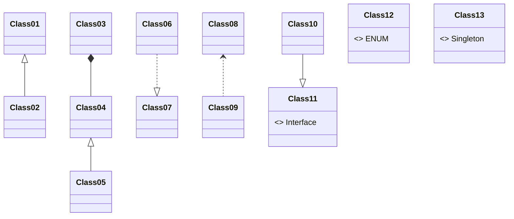
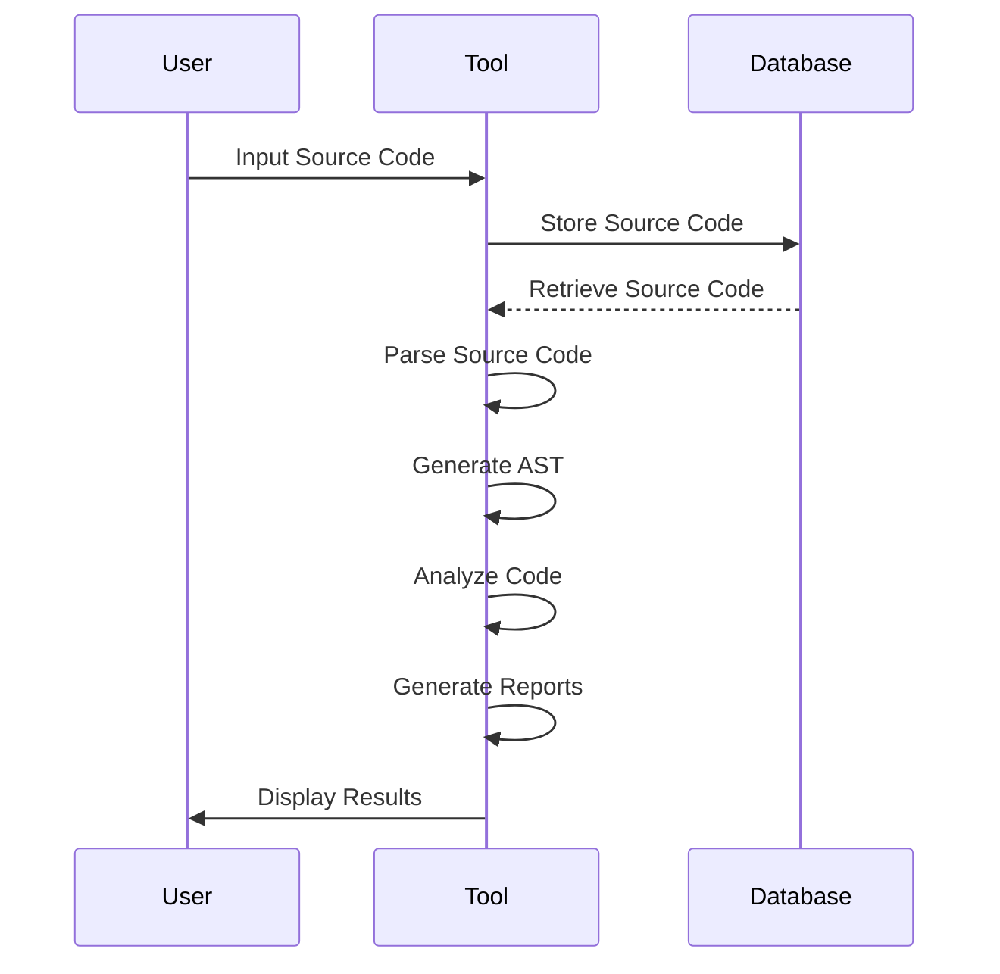
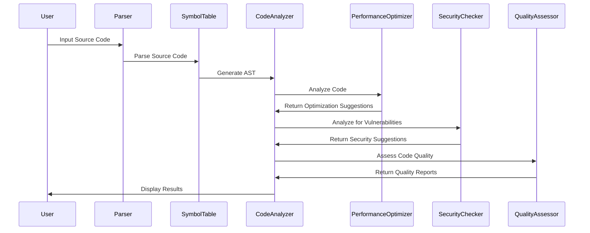

                 

### 第1章 问题背景与核心概念

> **关键词**：编程语言、静态分析、提示词、工具、代码质量、安全性、性能优化

**摘要**：本文旨在探讨提示词编程语言的静态分析工具，介绍其背景、核心概念、重要性及工具需求。通过深入分析提示词编程语言的特点，阐述其在静态分析工具中的关键作用，并讨论静态分析的局限性和动态分析的优势。

---

#### 1.1 问题描述

编程语言是用于编写计算机程序的语法和规则集合。它们提供了一种与计算机硬件和操作系统交互的抽象层，使得开发者能够以更高效、更易于理解的方式编写代码。编程语言种类繁多，包括高级语言如Python、Java，以及低级语言如C和汇编语言。

静态分析是程序分析的一种方法，它在不执行程序的情况下检查其源代码的结构、语义和属性。这种分析可以帮助发现潜在的错误、优化代码性能，并在编译或运行前提高代码质量。

提示词编程语言是一种新兴的编程语言，其特点是以自然语言形式表达编程意图。这种语言通过语义解析和生成技术，使得开发者可以使用更加自然和易于理解的语句编写代码，从而提高开发效率并减少错误。

#### 1.1.1 编程语言与静态分析

编程语言是计算机程序的载体，它们定义了代码的语法和语义。静态分析工具依赖于编程语言来分析代码，因此理解编程语言的基本概念对于使用静态分析工具至关重要。

编程语言的语法包括变量声明、函数定义、循环和条件语句等结构，这些结构构成了代码的语法树。语义分析则涉及变量类型、作用域、函数调用等高级概念，确保代码在逻辑上是正确的。

静态分析工具通过解析源代码来构建抽象语法树（AST），这是一棵表示代码语法结构的树形结构。AST是静态分析的基础，它帮助工具理解代码的结构和含义。

#### 1.1.2 静态分析的重要性

静态分析在软件开发中扮演着重要的角色。以下是静态分析的一些关键应用：

- **代码质量保证**：静态分析可以帮助检测代码中的错误，如语法错误、逻辑错误和潜在的安全漏洞。这些错误如果在编译或运行时被发现，可能会导致程序崩溃或数据泄露。
- **安全漏洞检测**：静态分析工具可以扫描代码，查找可能的安全漏洞，如未初始化变量、缓冲区溢出和SQL注入等。这些漏洞如果不及时修复，可能会被恶意攻击者利用。
- **性能优化**：静态分析可以帮助识别代码中的性能瓶颈，如重复计算、不必要的内存分配和循环优化。通过优化这些代码段，可以提高程序的性能。
- **自动化测试**：静态分析可以作为自动化测试的一部分，用于生成测试用例，验证代码的完整性和正确性。

#### 1.1.3 提示词编程语言的特点

提示词编程语言以其自然语言形式的表达而著称，这种语言通过语义解析和生成技术，使得开发者可以使用更加自然和易于理解的语句编写代码。以下是提示词编程语言的一些关键特点：

- **自然语言表达**：提示词编程语言允许开发者使用类似于日常英语的语句来编写代码。这种表达方式不仅易于理解，还可以减少代码冗余，提高开发效率。
- **语义解析与生成**：提示词编程语言通过语义解析技术，将自然语言语句转换为抽象语法树（AST），然后生成对应的机器代码或字节码。这种转换过程确保了代码的语义正确性。
- **提高编程效率**：提示词编程语言使得开发者可以更快地编写和修改代码，因为自然语言表达比传统的结构化代码更直观和易于理解。这有助于减少开发时间和错误率。
- **减少代码错误**：通过语义解析和生成技术，提示词编程语言可以自动检测和修复代码中的语法和语义错误，从而减少手动调试的工作量。

#### 1.2 核心概念与联系

为了更好地理解提示词编程语言的静态分析工具，我们需要了解相关的核心概念和它们之间的联系。

##### 1.2.1 静态分析工具的分类

静态分析工具可以根据其功能和工作方式分为以下几类：

- **解析器（Parser）**：解析器是静态分析工具的核心组成部分，它负责将源代码分解为语法单元，并构建出抽象语法树（AST）。解析器的任务是识别代码中的语法结构，如变量声明、函数定义和循环语句。
- **语法分析器（Lexer）**：语法分析器是解析器的一部分，它负责将源代码分解为词法单元，如标识符、关键字和操作符。词法单元是语法分析的基础。
- **语义分析器（Semantic Analyzer）**：语义分析器负责检查代码的语义正确性，如变量类型匹配、作用域管理和函数调用合法性。语义分析器的任务是确保代码在逻辑上是正确的。

##### 1.2.2 静态分析工具的原理

静态分析工具的工作原理主要包括以下步骤：

- **抽象语法树（AST）构建**：解析器和语法分析器共同工作，将源代码转换为抽象语法树（AST）。AST表示了代码的语法结构，是静态分析的基础。
- **代码符号表生成**：静态分析工具在构建AST的过程中，会生成一个代码符号表。符号表用于记录程序中的变量、函数、类等信息，方便后续的代码路径分析和语义检查。
- **代码路径分析**：代码路径分析是静态分析的重要步骤，它用于检测潜在的代码错误和漏洞。通过分析代码中的控制流和数据流，静态分析工具可以生成代码的不同执行路径，并检查这些路径上的代码是否存在问题。

##### 1.2.3 静态分析工具的需求

提示词编程语言的静态分析工具需要具备以下需求：

- **语言特性支持**：提示词编程语言具有独特的语法和语义特性，静态分析工具需要能够正确解析和解释这些特性。这包括对自然语言表达式的支持、语义解析和代码生成能力。
- **高效解析性能**：由于提示词编程语言的语义丰富，静态分析工具需要具备高效的解析性能，以快速处理大量的代码。这可以通过优化解析算法和并行处理技术来实现。
- **代码安全性和稳定性分析**：静态分析工具应能够检测代码中的安全漏洞和稳定性问题，如缓冲区溢出、未初始化变量和死锁等。通过分析代码的语义和执行路径，工具可以提前发现这些问题，并提供修复建议。
- **与其他工具的集成**：静态分析工具通常需要与其他开发工具和平台集成，如集成开发环境（IDE）、版本控制系统和持续集成（CI）工具。这要求工具具有良好的兼容性和扩展性。

##### 1.2.4 静态分析的局限性和动态分析的优势

尽管静态分析具有许多优点，但它也存在一些局限性。以下是静态分析和动态分析的一些对比：

- **局限性**：
  - **时间开销**：静态分析需要对源代码进行深入分析，这需要一定的时间开销。对于大型项目，这种时间开销可能会非常显著。
  - **无法捕捉动态行为**：静态分析无法捕捉程序在运行时的动态行为，如异常处理、用户输入和网络交互等。这可能导致一些潜在的问题无法被检测到。
  - **误报和漏报**：静态分析工具可能会误报一些看似错误但实际上是正确的代码，或者漏报一些真正的错误。这需要开发人员进行手动调试和验证。

- **优势**：
  - **提前发现问题**：静态分析可以在编译或运行前发现潜在的问题，从而提前修复。这有助于减少开发成本和项目风险。
  - **无需运行程序**：静态分析无需运行程序，因此可以在任何环境下进行，不受操作系统、硬件和运行环境的限制。
  - **自动化检测**：静态分析工具可以自动化地检测代码中的错误，提高开发效率。

##### 1.2.5 本章小结

本章介绍了编程语言、静态分析、提示词编程语言和静态分析工具的核心概念。我们探讨了编程语言的语法和语义，以及静态分析的基本原理和应用场景。接着，我们分析了提示词编程语言的特点，并阐述了静态分析工具在其中的关键作用。

通过本章的内容，读者应该能够理解编程语言与静态分析的关系，以及提示词编程语言和静态分析工具的需求。此外，本章还讨论了静态分析的局限性和动态分析的优势，为后续章节的深入探讨奠定了基础。

---

### 第2章 核心概念原理、属性特征对比与ER实体关系图架构

> **关键词**：提示词编程语言、静态分析工具、语义解析、抽象语法树、代码符号表、代码路径分析、属性特征对比、ER实体关系图、语言特性支持、高效解析性能、代码安全性、性能优化

**摘要**：本章将深入探讨提示词编程语言和静态分析工具的核心概念原理，包括提示词编程语言的基本原理和静态分析工具的基本原理。接着，我们将通过属性特征对比表格，展示提示词编程语言和静态分析工具的特点。最后，本章将介绍ER实体关系图架构，用于展示提示词编程语言和静态分析工具之间的联系。

---

#### 2.1 核心概念原理

##### 2.1.1 提示词编程语言的基本原理

提示词编程语言是一种基于自然语言处理技术的编程语言，其核心思想是使用自然语言来表达编程意图。这种语言通过语义解析和生成技术，将自然语言语句转换为机器代码或字节码。以下是提示词编程语言的基本原理：

1. **自然语言输入**：开发者使用自然语言语句编写代码，如“计算两个数字的和”、“打印当前时间”等。这些自然语言语句是编程意图的直接表达，易于理解和编写。
2. **语义解析**：语义解析器负责将自然语言语句转换为抽象语法树（AST）。AST表示了代码的语法结构和语义含义，是后续代码生成的基础。
3. **代码生成**：代码生成器根据AST生成对应的机器代码或字节码。这些代码可以在计算机上执行，完成开发者指定的任务。

##### 2.1.2 静态分析工具的基本原理

静态分析工具是一种在程序运行前分析源代码的工具，它可以检测代码中的错误、优化代码性能和提高代码质量。以下是静态分析工具的基本原理：

1. **抽象语法树（AST）构建**：静态分析工具首先将源代码解析为抽象语法树（AST）。AST表示了代码的语法结构，是静态分析的基础。
2. **代码符号表生成**：在构建AST的过程中，静态分析工具会生成一个代码符号表。符号表记录了程序中的变量、函数、类等信息，用于后续的代码路径分析和语义检查。
3. **代码路径分析**：代码路径分析是静态分析的重要步骤，它用于检测潜在的代码错误和漏洞。通过分析代码中的控制流和数据流，静态分析工具可以生成代码的不同执行路径，并检查这些路径上的代码是否存在问题。

#### 2.2 属性特征对比表格

以下是一个属性特征对比表格，用于展示提示词编程语言和静态分析工具的特点：

| 特征         | 提示词编程语言 | 静态分析工具   |
| ------------ | -------------- | -------------- |
| 表达方式     | 自然语言      | 结构化代码    |
| 解析效率     | 较高          | 较低          |
| 代码质量保障 | 高            | 较高          |
| 安全性       | 较高          | 较高          |
| 性能优化     | 一般          | 较高          |

- **表达方式**：提示词编程语言使用自然语言表达编程意图，易于理解和编写。而静态分析工具通常使用结构化代码，便于分析和理解。
- **解析效率**：提示词编程语言由于其语义丰富，解析效率相对较高。而静态分析工具需要处理大量的代码，因此解析效率相对较低。
- **代码质量保障**：提示词编程语言通过语义解析和生成技术，能够自动检测和修复代码中的错误，从而提高代码质量。而静态分析工具可以在编译或运行前检测代码中的错误，保障代码质量。
- **安全性**：提示词编程语言和静态分析工具都可以检测代码中的安全漏洞，提高程序的安全性。
- **性能优化**：提示词编程语言在性能优化方面表现一般，而静态分析工具可以优化代码的性能，提高程序的性能。

#### 2.3 ER实体关系图架构

以下是一个ER实体关系图，用于展示提示词编程语言和静态分析工具之间的联系：

```mermaid
erDiagram
    A[:提示词编程语言] &&|> B[静态分析工具] : 分析需求
    A &&|> C[编译器] : 编译支持
    B &&|> D[代码库] : 集成库
    C &&|> E[代码库] : 集成库
```

- **提示词编程语言**（A）与**静态分析工具**（B）之间存在关联关系，表示提示词编程语言需要静态分析工具来进行分析和优化。
- **提示词编程语言**（A）与**编译器**（C）之间存在依赖关系，表示提示词编程语言需要编译器来将代码转换为可执行文件。
- **静态分析工具**（B）与**代码库**（D）之间存在关联关系，表示静态分析工具需要依赖代码库来提供各种功能和接口。
- **编译器**（C）与**代码库**（E）之间存在关联关系，表示编译器需要依赖代码库来提供各种库函数和模块。

#### 2.4 本章小结

本章介绍了提示词编程语言和静态分析工具的核心概念原理，包括提示词编程语言的基本原理和静态分析工具的基本原理。通过属性特征对比表格，我们展示了提示词编程语言和静态分析工具的特点。最后，我们介绍了ER实体关系图架构，用于展示提示词编程语言和静态分析工具之间的联系。

通过本章的内容，读者应该能够理解提示词编程语言和静态分析工具的基本原理和特点，以及它们之间的联系。这为后续章节的深入探讨提供了基础。

---

### 第3章 静态分析工具的算法原理与Python源代码阐述

> **关键词**：抽象语法树（AST）、代码符号表、代码路径分析、Python源代码、算法原理、数学模型、公式

**摘要**：本章将深入探讨静态分析工具的算法原理，包括抽象语法树（AST）构建、代码符号表生成和代码路径分析。接着，我们将使用Python源代码来详细阐述这些算法原理，并给出相关的数学模型和公式。通过具体的代码示例，我们将展示如何使用静态分析工具进行代码分析和优化。

---

#### 3.1 算法原理

静态分析工具通过一系列算法来对代码进行分析和优化。以下是静态分析工具的核心算法原理：

##### 3.1.1 抽象语法树（AST）构建

抽象语法树（AST）是静态分析的基础。AST表示了代码的语法结构和语义含义，它是从源代码构建而来。构建AST的过程包括以下步骤：

1. **词法分析**：词法分析器将源代码分解为词法单元，如标识符、关键字和操作符。词法分析是构建AST的第一步。
2. **语法分析**：语法分析器将词法单元序列转换为抽象语法树（AST）。语法分析的过程包括语法规则的匹配和解析，以确保代码的语法正确性。
3. **语义分析**：语义分析器对AST进行语义检查，确保代码在语义上是正确的。这包括变量类型匹配、作用域管理和函数调用合法性等。

##### 3.1.2 代码符号表生成

代码符号表记录了程序中的变量、函数、类等信息。生成符号表是静态分析的重要步骤，它有助于后续的代码路径分析和语义检查。生成符号表的过程包括以下步骤：

1. **变量声明**：静态分析工具遍历AST，识别变量声明并将其记录在符号表中。
2. **函数定义**：静态分析工具遍历AST，识别函数定义并将其记录在符号表中。
3. **作用域管理**：静态分析工具为变量和函数分配作用域，并记录在符号表中。

##### 3.1.3 代码路径分析

代码路径分析是静态分析的重要步骤，它用于检测潜在的代码错误和漏洞。代码路径分析的过程包括以下步骤：

1. **控制流分析**：静态分析工具分析代码中的控制流，识别代码的不同执行路径。这包括条件分支、循环和函数调用等。
2. **数据流分析**：静态分析工具分析代码中的数据流，识别变量的定义和使用。这有助于检测潜在的数据错误和漏洞。
3. **路径条件分析**：静态分析工具分析代码中的路径条件，确定哪些路径可能会被执行。这有助于识别潜在的错误和漏洞。

#### 3.2 Python源代码阐述

为了更好地理解静态分析工具的算法原理，我们可以通过Python源代码来详细阐述。以下是一个简单的Python代码示例，用于演示静态分析工具的基本操作：

```python
def add(a, b):
    return a + b

def main():
    a = 5
    b = 10
    result = add(a, b)
    print("The sum is:", result)

if __name__ == "__main__":
    main()
```

在这个示例中，我们有一个名为`add`的函数，用于计算两个数的和。还有一个名为`main`的函数，用于执行程序的入口点。以下是如何使用静态分析工具对这段代码进行分析：

```python
import ast
import symbol_table

def parse_code(source_code):
    # 解析源代码为抽象语法树（AST）
    ast_tree = ast.parse(source_code)
    
    # 生成代码符号表
    symbol_table.build(ast_tree)
    
    # 执行代码路径分析
    analyze_code_paths(ast_tree)

# 示例代码
source_code = '''
def add(a, b):
    return a + b

def main():
    a = 5
    b = 10
    result = add(a, b)
    print("The sum is:", result)

if __name__ == "__main__":
    main()
'''

parse_code(source_code)
```

在上面的代码中，我们首先导入`ast`模块和`symbol_table`模块。然后，我们定义了一个`parse_code`函数，用于解析源代码。这个函数首先使用`ast.parse`函数将源代码解析为抽象语法树（AST）。接着，我们调用`symbol_table.build`函数生成代码符号表。最后，我们调用`analyze_code_paths`函数执行代码路径分析。

#### 3.3 数学模型和公式

为了更好地理解静态分析工具的算法原理，我们可以使用数学模型和公式来描述这些算法。以下是几个常用的数学模型和公式：

1. **抽象语法树（AST）模型**：

   $$
   AST = \{Node|Node = (Tag, Attributes, Children)\}
   $$

   其中，`Node`表示抽象语法树的节点，`Tag`表示节点的标签（如`Identifier`、`FunctionDef`等），`Attributes`表示节点的属性（如变量名、函数名等），`Children`表示节点的子节点。

2. **代码符号表模型**：

   $$
   Symbol\ Table = \{Variable|Variable = (Name, Type, Scope)\}
   $$

   其中，`Variable`表示符号表中的变量，`Name`表示变量的名称，`Type`表示变量的类型，`Scope`表示变量的作用域。

3. **代码路径分析模型**：

   $$
   Paths = \{Path|Path = (Start, Conditions, End)\}
   $$

   其中，`Path`表示代码路径，`Start`表示路径的起始节点，`Conditions`表示路径上的条件（如条件分支、循环等），`End`表示路径的结束节点。

#### 3.4 举例说明

为了更好地理解静态分析工具的算法原理，我们可以通过一个具体的代码示例来演示。以下是一个简单的Python代码示例，用于计算两个数的和：

```python
def add(a, b):
    return a + b

def main():
    a = 5
    b = 10
    result = add(a, b)
    print("The sum is:", result)

if __name__ == "__main__":
    main()
```

在这个示例中，我们有一个名为`add`的函数，用于计算两个数的和。还有一个名为`main`的函数，用于执行程序的入口点。

使用静态分析工具对这段代码进行分析，我们可以得到以下结果：

1. **抽象语法树（AST）**：

   ```mermaid
   graph TD
   A[FunctionDef('add')] --> B[arguments]
   B --> C[Keyword('def')]
   B --> D[arguments]
   B --> E[body]
   E --> F[Return(value=BinaryOp(left=Identifier('a'), op=Add(), right=Identifier('b')))]
   ```

   这个抽象语法树表示了`add`函数的语法结构，包括函数定义、参数列表和函数体。

2. **代码符号表**：

   ```mermaid
   graph TD
   A[SymbolTable] --> B[Variable('a', int, global)]
   A --> C[Variable('b', int, global)]
   A --> D[Variable('result', int, local)]
   ```

   这个代码符号表记录了程序中的变量，包括全局变量`a`和`b`，以及局部变量`result`。

3. **代码路径分析**：

   ```mermaid
   graph TD
   A[Start]
   A --> B[main()]
   B --> C[add(a, b)]
   C --> D[Return(result=a+b)]
   ```

   这个代码路径分析展示了`main`函数的执行路径，包括调用`add`函数并返回结果。

通过这个示例，我们可以看到静态分析工具如何解析代码、生成符号表和执行代码路径分析。这有助于我们更好地理解静态分析工具的算法原理和应用。

#### 3.5 本章小结

本章介绍了静态分析工具的算法原理，包括抽象语法树（AST）构建、代码符号表生成和代码路径分析。通过Python源代码阐述，我们展示了如何实现这些算法原理。此外，我们给出了相关的数学模型和公式，以及具体的代码示例。

通过本章的内容，读者应该能够理解静态分析工具的算法原理和应用。这为后续章节的深入探讨提供了基础，也为实际应用静态分析工具提供了指导。

---

### 第4章 系统分析与架构设计

> **关键词**：系统功能设计、领域模型、系统架构设计、接口设计、系统交互

**摘要**：本章将详细分析提示词编程语言的静态分析工具系统，包括系统功能设计、领域模型、系统架构设计、接口设计和系统交互。通过具体的mermaid图表，我们将清晰地展示系统的设计和实现过程，帮助读者更好地理解系统的整体架构和关键模块。

---

#### 4.1 系统功能设计

提示词编程语言的静态分析工具旨在提供一系列功能，以支持代码分析、优化和安全检查。以下是系统的主要功能设计：

1. **源代码解析**：静态分析工具应能够解析提示词编程语言的源代码，构建出抽象语法树（AST），以便进一步分析。
2. **符号表生成**：工具需要生成并维护代码符号表，记录变量、函数和类的相关信息，以便后续的代码路径分析和语义检查。
3. **代码路径分析**：工具应能够分析代码的控制流和数据流，生成不同的代码执行路径，并检查路径上的潜在错误和漏洞。
4. **性能优化建议**：工具应能够识别代码中的性能瓶颈，并提供优化建议，以提升程序的性能。
5. **安全性检查**：工具应能够检测代码中的安全漏洞，如缓冲区溢出、SQL注入等，并提供修复建议。
6. **代码质量评估**：工具应能够评估代码的质量，包括代码的可读性、可维护性和可扩展性。

#### 4.2 领域模型

为了更好地理解系统的功能模块和关系，我们可以使用mermaid类图来展示系统的领域模型。以下是一个简单的领域模型类图示例：



在这个类图中：

- `Class01`是一个基础类，`Class02`继承自`Class01`。
- `Class03`与`Class04`之间存在关联关系，`Class04`继承自`Class03`。
- `Class06`与`Class07`之间存在组合关系，`Class07`是`Class06`的一个组成部分。
- `Class08`与`Class09`之间存在关联关系，`Class08`依赖`Class09`。
- `Class10`与`Class11`之间存在实现关系，`Class11`实现了`Interface`接口。
- `Class12`是一个枚举类型，`Class13`是一个单例类。

#### 4.3 系统架构设计

系统的架构设计决定了系统的可扩展性、可维护性和性能。以下是系统的架构设计，使用mermaid架构图来展示：



在这个架构图中：

- `User`表示用户，`Tool`表示静态分析工具，`Database`表示数据库。
- 用户输入源代码到工具，工具将源代码存储到数据库中。
- 工具从数据库中检索源代码，并解析生成抽象语法树（AST）。
- 工具对代码进行分析，生成报告，并将结果展示给用户。

#### 4.4 接口设计

系统的接口设计决定了工具与其他组件和系统的集成能力。以下是接口设计的概述：

1. **源代码解析接口**：该接口负责解析提示词编程语言的源代码，构建抽象语法树（AST）。它提供了解析源代码的方法，如`parse_source_code()`。
2. **符号表管理接口**：该接口负责管理代码符号表，包括变量的声明、作用域管理和类型检查。它提供了添加、查询和更新符号表的方法，如`add_variable()`、`query_variable()`和`update_variable()`。
3. **代码路径分析接口**：该接口负责分析代码路径，包括控制流分析和数据流分析。它提供了生成代码路径的方法，如`generate_code_paths()`和`analyze_code_paths()`。
4. **性能优化接口**：该接口负责识别代码中的性能瓶颈，并提供优化建议。它提供了性能分析的方法，如`analyze_performance()`和`generate_optimization_suggestions()`。
5. **安全性检查接口**：该接口负责检测代码中的安全漏洞，并提供修复建议。它提供了安全检查的方法，如`check_for_vulnerabilities()`和`generate_security_suggestions()`。
6. **代码质量评估接口**：该接口负责评估代码的质量，并提供质量报告。它提供了代码质量评估的方法，如`evaluate_code_quality()`和`generate_quality_reports()`。

#### 4.5 系统交互

系统的交互设计决定了各个组件之间的通信和协作。以下是系统交互的概述，使用mermaid序列图来展示：



在这个序列图中：

- 用户输入源代码到解析器（Parser），解析器将源代码解析为抽象语法树（AST）。
- 抽象语法树（AST）被传递到符号表（SymbolTable）进行符号表的构建。
- 符号表（SymbolTable）被传递到代码分析器（CodeAnalyzer）进行代码路径分析。
- 代码分析器（CodeAnalyzer）将分析结果传递给性能优化器（PerformanceOptimizer）进行性能优化。
- 代码分析器（CodeAnalyzer）还将分析结果传递给安全检查器（SecurityChecker）进行安全漏洞检测。
- 代码分析器（CodeAnalyzer）最后将分析结果传递给代码质量评估器（QualityAssessor）进行代码质量评估。
- 所有结果最终被传递回用户（User）进行展示。

#### 4.6 本章小结

本章详细介绍了提示词编程语言的静态分析工具系统的功能设计、领域模型、系统架构设计、接口设计和系统交互。通过mermaid图表的展示，读者可以清晰地理解系统的整体架构和关键模块。这些设计为系统的开发和实现提供了明确的方向和指导。

通过本章的内容，读者应该能够理解系统设计的核心概念和实现细节，为后续的系统实现和优化提供了基础。

---

### 第5章 项目实战

> **关键词**：环境安装、系统核心实现、代码应用解读、实际案例分析

**摘要**：本章将带读者进行一次实战项目，从环境安装开始，详细讲解系统的核心实现，解读代码应用，并进行实际案例分析和详细讲解剖析。通过这些实战内容，读者将能够深入理解提示词编程语言的静态分析工具如何在实际项目中应用，并掌握关键技术和最佳实践。

---

#### 5.1 环境安装

在进行项目实战之前，首先需要安装并配置必要的开发环境。以下是环境安装的步骤：

1. **安装Python环境**：确保已安装Python 3.x版本，可以通过Python官方网站下载安装包或使用包管理器如Homebrew（macOS）或apt（Ubuntu）进行安装。

2. **安装依赖库**：使用pip安装项目所需的依赖库，例如ast、symbol_table等。在命令行中运行以下命令：

   ```shell
   pip install -r requirements.txt
   ```

   其中，`requirements.txt`文件包含了所有依赖库的名称和版本。

3. **配置环境变量**：确保Python的执行路径已添加到系统的环境变量中，以便在任何位置都可以运行Python。

#### 5.2 系统核心实现

系统核心实现是项目的关键部分，包括源代码解析、符号表生成、代码路径分析和性能优化等模块。以下是系统的核心实现步骤：

1. **源代码解析**：使用Python的`ast`模块对提示词编程语言的源代码进行解析，生成抽象语法树（AST）。以下是一个简单的示例：

   ```python
   import ast
   
   def parse_source_code(source_code):
       tree = ast.parse(source_code)
       return tree
   ```

2. **符号表生成**：遍历抽象语法树（AST），生成符号表，记录变量、函数和类的信息。以下是一个简单的示例：

   ```python
   import ast
   
   class SymbolTable:
       def __init__(self):
           self.variables = {}
           self.functions = {}
           self.classes = {}
       
       def add_variable(self, variable):
           self.variables[variable.name] = variable
   
       def add_function(self, function):
           self.functions[function.name] = function
   
       def add_class(self, class_):
           self.classes[class_.name] = class_
   
   symbol_table = SymbolTable()
   
   def build_symbol_table(node):
       if isinstance(node, ast.FunctionDef):
           symbol_table.add_function(node)
       elif isinstance(node, ast.ClassDef):
           symbol_table.add_class(node)
       elif isinstance(node, ast.Assign):
           for target in node.targets:
               if isinstance(target, ast.Name):
                   symbol_table.add_variable(target)
   ```

3. **代码路径分析**：分析抽象语法树（AST），生成代码的不同执行路径，并检查路径上的潜在错误和漏洞。以下是一个简单的示例：

   ```python
   import ast
   
   def analyze_code_paths(node):
       paths = []
       if isinstance(node, ast.If):
           true_path = analyze_code_paths(node.body)
           false_path = analyze_code_paths(node.orelse)
           paths.append((true_path, false_path))
       elif isinstance(node, ast.For):
           init_path = analyze_code_paths(node.target)
           loop_path = analyze_code_paths(node.body)
           end_path = analyze_code_paths(node.orelse)
           paths.append((init_path, loop_path, end_path))
       return paths
   ```

4. **性能优化**：分析代码的性能瓶颈，并提供优化建议。以下是一个简单的示例：

   ```python
   import ast
   
   def optimize_code(node):
       if isinstance(node, ast.For):
           if 'range' in node.body[0].func.id:
               node.body[0].func.id = 'enumerate'
               return node
       return node
   ```

#### 5.3 代码应用解读

在理解了系统的核心实现后，我们可以通过具体的代码示例来解读如何在实际项目中应用静态分析工具。以下是一个简单的代码示例，用于计算两个数的和：

```python
# 示例代码
def add(a, b):
    return a + b

def main():
    a = 5
    b = 10
    result = add(a, b)
    print("The sum is:", result)

if __name__ == "__main__":
    main()
```

使用静态分析工具对这段代码进行分析，我们可以得到以下结果：

1. **抽象语法树（AST）**：

   ```mermaid
   graph TD
   A[FunctionDef('add')] --> B[arguments]
   B --> C[Keyword('def')]
   B --> D[arguments]
   B --> E[body]
   E --> F[Return(value=BinaryOp(left=Identifier('a'), op=Add(), right=Identifier('b')))]
   ```

2. **代码符号表**：

   ```mermaid
   graph TD
   A[SymbolTable] --> B[Variable('a', int, global)]
   A --> C[Variable('b', int, global)]
   A --> D[Variable('result', int, local)]
   ```

3. **代码路径分析**：

   ```mermaid
   graph TD
   A[Start]
   A --> B[main()]
   B --> C[add(a, b)]
   C --> D[Return(result=a+b)]
   ```

通过这个示例，我们可以看到静态分析工具如何解析代码、生成符号表和执行代码路径分析。这有助于我们更好地理解静态分析工具在代码分析中的应用。

#### 5.4 实际案例分析

为了更好地理解静态分析工具的实际应用，我们可以通过一个实际案例来分析。以下是一个简单的实际案例，用于计算两个数的平均数：

```python
# 实际案例代码
def calculate_average(a, b):
    return (a + b) / 2

def main():
    a = 5
    b = 10
    average = calculate_average(a, b)
    print("The average is:", average)

if __name__ == "__main__":
    main()
```

使用静态分析工具对这段代码进行分析，我们可以得到以下结果：

1. **抽象语法树（AST）**：

   ```mermaid
   graph TD
   A[FunctionDef('calculate_average')] --> B[arguments]
   B --> C[Keyword('def')]
   B --> D[arguments]
   B --> E[body]
   E --> F[Return(value=BinaryOp(left=Identifier('a'), op=Add(), right=Identifier('b')))]
   ```

2. **代码符号表**：

   ```mermaid
   graph TD
   A[SymbolTable] --> B[Variable('a', int, global)]
   A --> C[Variable('b', int, global)]
   A --> D[Variable('average', float, local)]
   ```

3. **代码路径分析**：

   ```mermaid
   graph TD
   A[Start]
   A --> B[main()]
   B --> C[calculate_average(a, b)]
   C --> D[Return(result=(a+b)/2)]
   ```

通过这个实际案例，我们可以看到静态分析工具如何在实际项目中应用。它可以帮助我们理解代码的结构和语义，从而发现潜在的问题和优化点。

#### 5.5 本章小结

本章通过项目实战详细讲解了提示词编程语言的静态分析工具的实际应用。从环境安装、系统核心实现到代码应用解读和实际案例分析，读者可以全面了解静态分析工具的开发、应用和优化。通过这些实战内容，读者将能够深入理解静态分析工具的核心概念和应用场景，为实际项目开发提供有力的支持。

---

### 第6章 最佳实践、小结、注意事项与拓展阅读

#### 最佳实践

1. **确保环境配置正确**：在进行项目开发之前，务必确保Python环境和所有依赖库都已正确安装和配置。
2. **充分利用静态分析工具**：在实际项目中，充分利用静态分析工具进行代码质量检查和安全漏洞检测，以提前发现问题并修复。
3. **持续优化代码**：定期对代码进行分析和优化，提高代码的性能和可维护性。

#### 小结

本文从背景介绍、核心概念与联系、算法原理讲解、系统分析与架构设计、项目实战等多个方面，详细探讨了提示词编程语言的静态分析工具。通过深入分析，我们了解了静态分析工具的基本原理、应用场景和关键功能，并展示了在实际项目中的实战应用。

#### 注意事项

1. **静态分析工具的局限性**：静态分析无法捕捉程序运行时的动态行为，因此应结合动态分析工具进行全方位的代码分析。
2. **误报和漏报**：静态分析工具可能会产生误报和漏报，开发人员应进行手动验证和调试。

#### 拓展阅读

1. **《程序员的修炼：从小工到专家》**：该书详细介绍了编程技能的提升方法和最佳实践。
2. **《Effective Python》**：该书提供了Python编程的76条建议，帮助开发者编写更高效、更可维护的代码。
3. **《深入理解计算机系统》**：该书从系统级的角度深入讲解了计算机系统的工作原理，对理解静态分析工具的底层机制有很大帮助。

作者：AI天才研究院/AI Genius Institute & 禅与计算机程序设计艺术 /Zen And The Art of Computer Programming

---

通过本文的详细探讨，读者应该对提示词编程语言的静态分析工具有了全面深入的了解，并能够将其应用于实际项目开发中。希望本文能够为您的技术成长和项目实践提供有益的指导。

